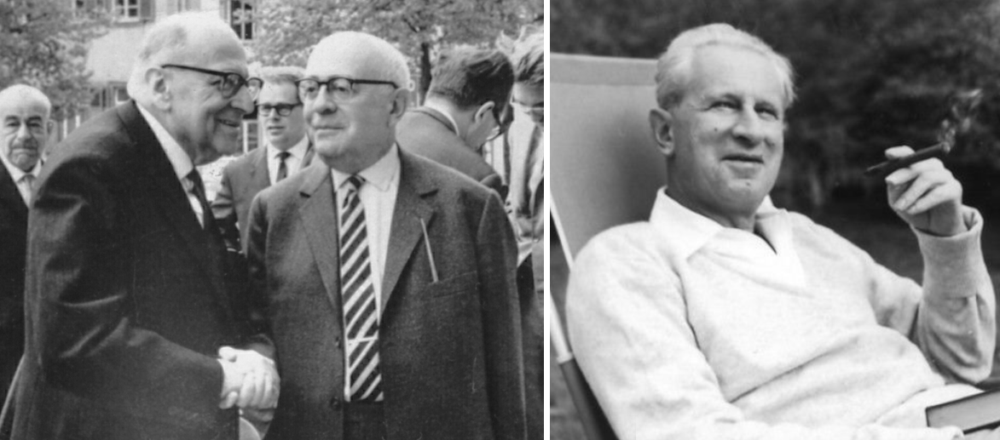
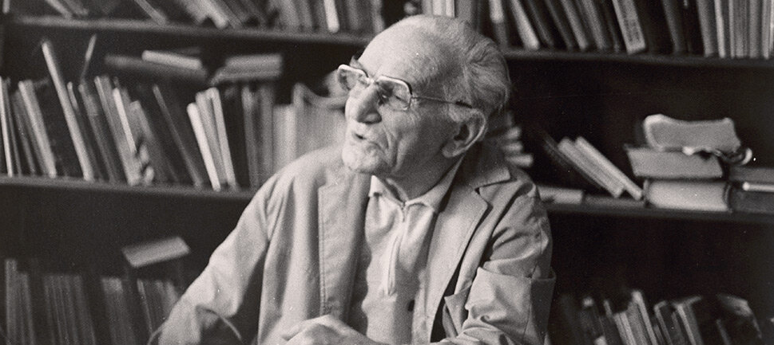

> <warning-title>Recommended starting point</warning-title>
> This training can be considered as the continuation of [Principles of learning and how they apply to training and teaching ](). If you wish to have a panoramic view of the theoretical corpus in which the **Critical Learning Theory** is embedded, we recommend to start with the above-mentioned training.
{: .warning}

# Introduction

The **Critical Learning Theory**  is a pedagogical paradigm rooted in the broader **Critical Theory** tradition originated with the **Frankfurt School** of thought, formally known as the Institute for Social Research (*Institut für Sozialforschung*), an academic hub founded in 1923 at Goethe University in Frankfurt, Germany. 

Consisting of a renowned collective of critical theorists such as Max Horkheimer, Theodor Adorno, Walter Benjamin, and Herbert Marcuse, the **Frankfurt School** developed the **Critical Theory** as a multidisciplinary approach crafted with the intent to comprehend and actively confront the oppressive dynamics ingrained within industrial societies (fig. 1).

In the realm of education, the **Critical Learning Theory** aligns with the Frankfurt School's tradition, emphasizing a critical analysis of educative systems as social institutions. It represents a framework for critically examinate the role of education in shaping and perpetuating power structures, cultural norms and social inequalities throught the repression of **critical thinking** (). A leading figure of this school of thought is  prominent American-Canadian critical pedagogue Henry Giroux.

Within the realm of **Critical Learning Theory**, the concept of **Hidden Curriculum**, extensively explored by Giroux, refers to the implicit messages, values, and norms transmitted to students through the informal aspects of the educational system, distinct from the explicit and planned syllabus ().

This training aspires to be a introduction on the **Critical Learning Theory** and the concept of **Hidden Curriculum**, with the aim of pointing out which pedagogical elements are the most appropriate to stimulate **critical thinking**, the backbone of scientific development.

# Contextualising framework

> *Critical thinking aims to define the irrational character of the established rationality.*
>
> One-Dimensional Man: Studies in the Ideology of Advanced Industrial Society. Herbert Marcuse
>
{: .quote}

Education is the result of multiple contextual variables that have an effect on behaviour, ideology and professional development, so it could be said that human beings, as social beings, are educated and transformed by their context (). In this line, John Dewey, a distinguished American philosopher and advocate for educational reform, beautifully articulated that the education proposed by society has its roots in society itself (). Thus, in order to contextualise current educational practices, we can start by analyzing the current stage of society, the so-called **information society**.

The **information society** can be characterised by the interrelationships that link individuals through access to and provision of information for the purpose of generating knowledge. According Manuel Esteve, a renowned Spanish pedagogue with great influence on official teacher training, the **information society** needs to increase the number of citizens with high levels of scientific and technical training capable of maintaining the current technological development (). But is this true? 

Contrary to Esteve's assertion, the argentinian sociologists Sara Morgenstern and Lucia Finkel indicate that the **information society** can function with very few, highly qualified and highly paid employees who constitute the decisive core of the companies' activity; the remaining skills are outsourced to other companies, leaving at the bottom a mass of precarious workers whose required competences are often embodied in demands for punctuality, organisational skills, non-conflict and submission to authority (). Their assertion seems to be confirmed by current technological development ().

> *The findings are striking: almost 40 percent of global employment is exposed to AI. Historically, automation and information technology have tended to affect routine tasks, but one of the things that sets AI apart is its ability to impact high-skilled jobs.*
>
> Kristalina Georgieva, managing director of the International Monetary Fund.
>
{: .quote}

## Educative systems

According the **Critical Theory**, educative systems are agents of ideological control linked to the principles and processes that govern the workplace; the dominant culture in educative systems is characterised by selectively ordering and legitimising privileged forms of language, social relations, life experiences and modes of reasoning ().

The philospher Pedro García Olivo affirms that the criterion governing Western educative systems, in line with OECD recommendations, is none other than that of favouring the adaptation of students to the requirements of the established productive and political apparatus, which requires their psychological and cultural homogenisation ().

In the face of the conservative claim that educative systems transmit objective knowledge, **Critical Learning Theory** concives knowledge as a particular representation of the dominant culture that structure the hegemonic cosmovision throught a selective process of emphasis and exclusions ().

# Critical thinking

> *Questioning is an exercise in dismantling those certainties that are installed as layers of truths imposing the tyranny of the obvious.*
>
> ¿Para qué sirve la filosofía?. Dario Sztajnzrajbe
>
{: .quote}

Before going deeper, it is inportant to accurately define **critical thinking**, since it is usually concived as a nebulose concept whose applications appears to be limitated to specific situations.

The most common definition comes from the **positivist tradition** in the applied sciences; it appeals to the function of teaching students to analyse and develop reading and writing tasks from the perspective of formal logical patterns of coherence, and determining if the conclusions can be derivated from the evaluated data (). Is it enought?

> <comment-title>On positivism</comment-title>
>
> Positivism, originating in the 19th century under the guidance of figures like Auguste Comte, is a philosophical and scientific stance that emphasizes the importance of empirical observation and the application of the scientific method in gaining knowledge about the world. Central to positivism is the idea that valid knowledge is derived from observable and measurable phenomena.
>
> Positivists stress the need for objectivity in the pursuit of knowledge, advocating for the exclusion of personal biases and subjective interpretations. They argue for a systematic and rigorous adherence to scientific methodologies, favoring concrete evidence over speculative reasoning. While positivism has significantly influenced the natural sciences, it has also faced criticism for its limitations in addressing subjective experiences, moral values, and aspects of reality that aren't easily quantifiable. Despite these critiques, positivism continues to be a major perspective in the philosophy of science.
>
> Max Horkheimer, who played a pivotal role in the **Frankfurt School**, argued that positivism misrepresent human social action by ignoring the influence of socially and historically mediated human consciousness on social facts. Positivism failed to acknowledge that these social facts are not objective entities but are shaped by observers and the broader social context, leading to a distorted view of reality. Secondly, Horkheimer contended that positivism construction of social reality was politically conservative, maintaining the existing status quo rather than challenging it.
>
{: .comment}

In his famous work *Dialectics of Ideology and Technology*, the American sociologist Alvin Gouldner pointed out that, in contrast to this superficial and clearly insufficient conception, **critical thinking must be capable of questioning even the logic of reasoning itself**, that is, it must be capable of problematising what has hitherto been treated as self-evident, of turning into an object of reflection what had previously been simply a tool ().

> <comment-title>Frankfurt School and critical thinking </comment-title>
>
> Some critical theorists of the first generation, including Max Horkheimer, Theodor Adorno and Walter Benjamin, argued that in Western democracies the capacity for critical reasoning is rapidly being eclipsed.
>
> Pointing to developments such as the intrusion of the state, the culture industry and the concentration of wealth in fewer and fewer people, these thinkers fear that the ideological and material conditions that make public interaction and critical thinking possible are being undermined by the increasing standardisation, fragmentation and commercialisation of everyday life.
>
{: .comment}

From the assumption of this conception of critical thinking a new question arises: is it really in the interest of education system to encourage critical thinking? One element that can help to answer this question is the hidden curriculum.

> <question-title>Critical thinking quiz</question-title>
>
> 1. **How does critical thinking align with the principles of both Critical Theory and Critical Learning Theory?**
> > a. By avoiding critical examination of societal issues.  
> > b. By promoting conformity to existing structures.  
> > c. By fostering a reflective approach to learning and encouraging critical analysis.  
> > d. By discouraging diverse perspectives.
> 2. **According to the Frankfurt School thinkers, what did critical thinking in education aim to achieve?**
> > a. To maintain the status quo.  
> > b. To encourage blind acceptance of authority.  
> > c. To develop individuals who conform to norms.  
> > d. To empower individuals to question and transform social structures.  
> 3. **When dealing with diverse cultural perspectives, why might the positivist conception of critical thinking face limitations?**
> > a. It fails to acknowledge cultural biases.  
> > b. It prioritizes subjective experiences.  
> > c. Cultural perspectives are irrelevant to objective analysis.  
> > d. It encourages emotional responses.  
> 4. **In the Frankfurt School's view, how does critical thinking contribute to the development of individuals within an educational context?**
> > a. By discouraging any form of dissent.  
> > b. By promoting uncritical acceptance of information.  
> > c. By fostering independent thought.  
> > d. By reinforcing conformity to existing power structures.
>
> > <solution-title></solution-title>
> > 1. By fostering a reflective approach to learning and encouraging critical analysis.
> > 2. To empower individuals to question and transform social structures.
> > 3. It fails to acknowledge cultural biases.
> > 4. By fostering independent thought.
> {: .solution}
{: .question}

# The hidden curriculum

> *Any pedagogy concerned with critical thinking has to consider the form and content of social relations in the classroom..*
>
> Teacher as intellectuals: towards a critical pedagogy of learning. Henry Giroux.
>
{: .quote}

Unlike the official curriculum, with its explicitly stated cognitive and affective objectives, **the hidden curriculum relies on those organisational aspects, such as the communicative systems, whose effects on the learning process are generally not consciously perceived by students** (). On the light of this definition, a new question emerges: which impact has the hidden curriculum on the learning process?

According the **Critical Learning Theory**, what students learn from the formally sanctioned content of the curriculum is much less important than what they learn from the ideological assumptions embodied in communicative systems (, ). In this training, we will focus in four of them: the curricular system, the system of pedagogical styles of classroom control, the evaluative system, and the technological system.

> <question-title>Hidden Curriculum quiz</question-title>
>
> 1. **What is the hidden curriculum?**
> > a. The formal curriculum taught in schools.  
> > b. Implicit values, behaviors, and expectations transmitted through the educational or social system.  
> > c. Extracurricular activities in schools.  
> 2. **How is the hidden curriculum transmitted?**
> > a. Through explicit teaching and textbooks.  
> > b. Through unspoken or implicit messages in the educational or social environment.  
> > c. Through standardized tests.  
> 3. **How does the hidden curriculum influence individuals?**
> > a. It has no impact on individuals' beliefs and attitudes.  
> > b. It shapes subconscious beliefs and attitudes through implicit messages. 
> > c. It directly dictates conscious decision-making.
>
> > <solution-title></solution-title>
> > 1. Implicit values, behaviors, and expectations transmitted through the educational or social system.
> > 2. Through unspoken or implicit messages in the educational or social environment.
> > 3. It shapes subconscious beliefs and attitudes through implicit messages.
> {: .solution}
{: .question}

## Curricular system

The curricular system is defined as the regulation of the elements that determine the teaching and learning processes for each of the teaching programmes.

According Giroux, the structure, organisation, and content of dominant curricular systems would endow students with the personality needs required in the bureaucratically structured and hierarchically organised workforce (). Elements such as exposure to a core of common subjects would lead to a dissolution of individuality in the mass, in the collective, to a standardisation and homogenisation of psychologies ().

## System of pedagogical styles of classroom control

The dominant pedagogical style of classroom control, the expository discursive mode, represent other of the manifestations of the hidden curriculum. In this discursive mode the sender acts repeatedly on the receiver but gives him/her a passive role (Castejón, España and Ganzarain, 2004). In this case, the hidden curriculum crystallizes as imposition of meanings, which, according to Giroux is intimately linked to its aspiration to depoliticisation (). Faced with this, we
could ask ourselves: does this aspiration impact in any way on the objectives of fostering critical thinking?

According Marcuse, the education system is political, so aspiring to its politicisation does not imply an inference in its functions (). The attempt to appropriate concepts that are spontaneously experienced as apolitical would represent a clear attack on critical thinking, derived from the struggle for ideological-political hegemony (). In words of Giroux, *when students have little room left to generate their own meanings, learning degenerates into a euphemism for a strategy of control* ().

Darío Sztajnszrajber, a prominent argentine philosopher, essayist and teacher, considers that if there were really an interest in fostering critical thinking, the discursive mode that should dominate in the classroom should be the interrogative one. According him, *questioning is a way of thinking, and that is why thinking is not only deriving conclusions, but often consists of the opposite: starting from the accepted conclusions of a community and turning them upside down* (). 

## Evaluation system

It is in the assessment system that the nature of the hidden curriculum is most clearly revealed. The potential effect of assessment is clearly perceived when it is recognised that both academic and non-academic aspects are taught and assessed, the latter including institutional adaptation and specific personal qualities (). 

An illustrative example is provided by the research of Samuel Bowles and Herbert Gintis, who pointed out that students who are best suited to the social ordering of the education system also had significantly below average scores on measures of mental creativity and flexibility ().

Group evaluation can be considered as an adequate pedagogical instrument for overcoming the drawbacks associated to the evaluation system, providing students with social contexts that emphasise social responsibility and group solidarity. According Giroux, no matter how progressive an approach to critical thinking may be, it will squander its own potential if it operates on the basis of a web of social relations in the classroom that are authoritarianly hierarchical and promote passivity, docility and silence ().

## Technological system

The technological system can be defined as a set of interconnected components that has been designed to fulfil a particular function without further human design input. According the philospher Günther Anders, the design of technological systems goes beyond mere neutrality in information transmission; instead, they actively convey values and thought patterns (, ).

> <comment-title>Notes on Günther Anders</comment-title>
>
> Günther Anders (12 July 1902 - 17 December 1992), a German-born philosopher, journalist and critical theorist, stands as a prominent figure known for his insightful reflections on technology, existentialism, and the human condition. Although Anders did not become a formal member of the **Frankfurt School**, he is considered to have exerted an important influence on some of its members, with whom he maintained a close relationship throughout his life.
>
> In 1923, Gunther Anders obtained his Ph.D. in philosophy from the University of Freiburg, having studied under the esteemed philosophers Martin Heidegger and Edmund Husserl.
>
> 
>
> Anders' main contribution to pedagogy lies in his insightful exploration of technology's influence on education. He argued that technological tools, far from being neutral conduits of information, actively shape values and habits of thought. This perspective underscores the need for educators to critically assess the implications of integrating technology into learning environments. 
>
> On August 2023, the University of Freiburg established a research position at the [Institute of Sociology](https://www.soziologie.uni-freiburg.de/forschung/gaf) in his honour.
>
{: .comment}

Anders challenged the assumption that technology might solely enhance educational processes, encouraging to transcend the temptation to view technology as a complete replacement for traditional, face-to-face engagement (, ).

# Conclusion

The underlying message assimilated under the practices of the dominant hidden curriculum, which fosters a unidirectional vision of the teaching-learning process, points less to educative system that help students think critically about the world they live in, than to institutions that act as agents of social control. Through the hidden curriculum, students internalise values that emphasise respect for authority, punctuality, cleanliness, docility and conformity.

Critical thinking, conceived as an exercise in questioning and evaluation, is antagonistic to the authoritarian character of the dominant hidden curriculum.

