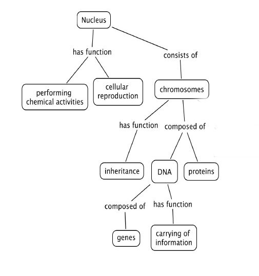
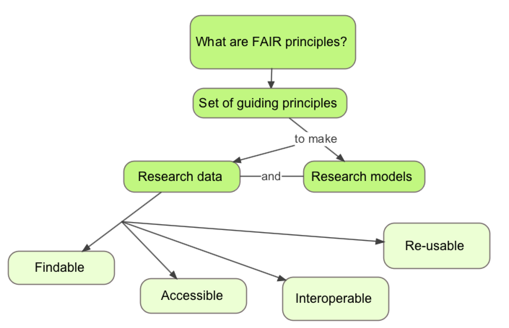

# Introduction
{:.no_toc}

**Teaching and training**, core elements of academic life, can be enormously
rewarding but also quite challenging. Instructors are often required to perform
under various constraints, and frequently have to accommodate, engage and
motivate student cohorts with very different backgrounds and aptitudes in
limited time-frames. This can be daunting for experienced teachers, but
especially so for those who're relatively new to teaching and training.

> ###  Definitions of key terms
>
> **Training**: instruction delivered via short courses designed to expand or
> build knowledge & practical skills in a given field, often conducted in the
> workplace or training centre to 'up-skill' members of a workforce
>
> **Teaching**: usually, instruction delivered over long time-scales via a
> series of courses (in schools, colleges, universities, etc.) designed to
> contribute to a formal programme that, if completed successfully, yields an
> accredited qualification in a given field (e.g., a degree)
>
{: .comment}

Formal education enterprises generally begin with **curriculum**
 design: this involves specifying

1. its purpose or **Teaching Goals (TGs)**;
2. its duration;
3. the **Knowledge, Skills and Abilities (KSAs)** intended to be achieved,
   expressed as a set of **Learning Outcomes (LOs)**;
4. how learners will demonstrate achievement of those LOs;
5. the materials, **Learning Experiences (LEs)** and assignments instructors
   will use to support learner progression towards the LOs;
6. the assessments for evaluating student learning and teaching effectiveness.

> ###  Definitions of key terms
>
> **Curriculum**: the inventory of tasks involving the design, organisation &
> planning of an education or training enterprise, including specification of
> learning outcomes, content, materials & assessments, & arrangements for
> training teachers & trainers
>
> **Knowledge, Skills and Abilities (KSAs)**:
>
> **Learning Outcomes (LOs)**: the KSAs that learners should be able to
> demonstrate after instruction, the tangible evidence that the teaching goals
> have been achieved; LOs are learner-centric
>
> **Learning Experience (LE)**: any setting or interaction in or via which
> learning takes place: e.g., a lecture, game, exercise, role-play, etc.
> Teaching Goal (TG): the intentions of an instructor regarding the pur- pose of
> a curriculum/course/lesson/activity/set of materials; TGs are
> instructor-centric (also termed instructional objectives)
>
> **Teaching Goal (TG)**: the intentions of an instructor regarding the purpose
> of a curriculum/course/lesson/activity/set of materials; TGs are
> instructor-centric (also termed instructional objectives)
>
{: .comment}

Emphasis is placed on teaching and learning, and mechanisms for collecting
evidence that learners have changed over time
. In this latter sense, the concept of
'curriculum' differentiates formal teaching from training, as formal programmes
usually afford time for learners both to be able to progress and to _demonstrate
their progression_.

By contrast, training courses are much shorter (measured in days or weeks,
rather than years); they hence necessarily focus on acquiring specific KSAs in
limited time-frames, generally without consideration of learner progression
beyond the course. However, the essential features of _effective curricula_
(i.e., those that achieve their stated LOs for the majority of learners) pertain
to instruction on any time-scale; they are thus also relevant for short courses,
and provide important considerations for those involved in, or embarking upon,
course design (whether face-to-face or online).

With this in mind, this tutorial outlines key steps of curriculum development –
and the role of Bloom's taxonomy  – that can be used
to inform the design of effective courses.

> ###  Sources
>
> This tutorial is significantly based on the , the 3rd
> session of ELIXIR Train the Trainer curriculum and
> 
>
{: .comment}

> ###  Select a topic for a 3 minute training - * 1 min - Silent reflection*
>
> - Choose a topic for a 3 minutes training, examples:
>   - how to make an origami bird
>   - introduction to biochemistry
>   - how bats recognise the presence of obstacles
>   - the second law of Newton
>   - how to draw a comic strip
>
{: .hands_on}

More practical lessons, applying what principle of learning

> ###  Check the tutorial on principles of learning
>
> For more details about how learning works and values, check our
> [tutorial]()
>
{: .tip }

> ### Agenda
>
> In this tutorial, we will cover:
>
> 1. TOC
> {:toc}
>
{: .agenda}

# Formal curriculum design

## Different types of curriculum

To set the scene for our considerations of course design, we examine some of the
foundations for effective curriculum development, drawing heavily on the
curriculum- and course- development guidelines developed by
. Notable here is the fact that different
types of curriculum have been defined: i.e., **intended**, **implemented**,
**attained** and **hidden curricula**. Recognising the existence of different
curriculum types (or, perhaps, different curricular outcomes) is important
because, while the intended curriculum is the starting point, it may not be the
curriculum actually attained: i.e., what you aimed to teach and what students
actually learned may not be the same.

To improve outcomes, differences between the intended and attained curricula
need to be minimised. The only way to discover the attained curriculum is to
find out what learning actually occurred. This requires **actionable**
evaluation, to assess whether the TGs and LOs were achieved, to identify
weaknesses in the implementation and to highlight improvements needed to
remediate them. These considerations are key to developing effective curricula
and courses.

> ###  Definitions of key terms
>
> **Actionable**: supportive of a decision, or the taking of some action by a
> learner, instructor or institution
>
> **Attained curriculum**: what learners actually acquire & can demonstrate
> having followed the implemented curriculum (from
> [UNESCO IBE Glossary of Curriculum-Related Terminology](http://www.ibe.unesco.org/en/glossary-curriculum-terminology/a/attained-curriculum))
>
> **Hidden curriculum**: unintended curricular effects: unofficial norms,
> behaviours & values that are transferred (not necessarily consciously) by the
> school culture or ethos; this recognises that schooling happens in broad
> social & cultural environments that influence learning (from
> [The glossary of Education Reform](http://www.edglossary.org/hidden-curriculum))
>
> **Implemented curriculum**: or taught curriculum, how the intended curriculum
> is delivered in practice: i.e., the teaching & learning activities, & the
> interactions between learners & teachers, & among learners
>
> **Intended curriculum**: the formal specification of KSAs that students are
> expected to achieve & be able to demonstrate having followed the implemented
> curriculum
>
{: .comment}

> ###  Define audience and teaching goal- * 10 min*
>
> 1. Take the topic you choose
> 2. Define teaching objectives (describe your goals and intentions as
>    instructor):
>    - stakeholders
>    - potential professions
>    - desired performance an/or competences of course completers
>    - duration
>
{: .hands_on}

## Structuring curriculum design

Curriculum design benefits from being systematic: structured approaches help to
orchestrate and clarify what will be taught, _why it will be taught_ and how;
they also afford opportunities to evaluate what does and doesn't work, and hence
what needs to change, ultimately leading to improvements in learning outcomes
. Several
different frameworks have been devised to facilitate the design process, but
each is motivated by the same underlying philosophy: to help formulate
programmes that promote _meaningful and enduring learning_. If we're to
understand whether we've really achieved this, we must

1. determine the purpose of the programme (what needs it addresses, why it's
   being developed, what learners will gain from it, why it's important),
2. define the intended LOs, and
3. develop **assessment** and evaluation mechanisms that will allow us to
   measure whether the programme successfully met its goals.

> ###  Definitions of key terms
>
> **Assessment**: the evaluation or estimation of the nature, quality or ability
> of someone or something
>
{: .comment}

Not surprisingly, the same principles apply to course design. The process may
seem daunting, but for the sake of simplicity, we focus here on one model: i.e.,
that proposed by Nicholls . Before discussing
this further, however, it's helpful to consider another very important tool used
in teaching and learning – Bloom's taxonomy .

### Bloom's taxonomy of cognitive complexity

Learning taxonomies are useful tools that can help both to formulate and clarify
LOs, and to arrange them on a scale of increasing complexity. Bloom’s taxonomy
, probably the most easily understood and widely
used today, features a _six-level hierarchy of cognitive complexity_, ranging
from _Remember_ (being able to recall facts and basic concepts) to _Evaluate_
being able to defend opinions or decisions), as illustrated in the following
figure:

![6 levels of Bloom's taxonomy (and their verbs) from bottom (lower-order thinking skills) to top (higher-order 'critical' thinking skills): Remember (recall or reiterate information) with memorize, recognise, identify, describe, reproduce, list, define, label, name, state, outline, order, arrange; Understand (demonstrate understanding of facts) with distinguish, classify, select, review, discuss, indicate, explain, estimate, locate, summarise; Apply (apply knowledge to real situations) with operate, manipulate, experiment, choose, modify, prepare, produce; Analyze (resolve ideas into simple parts, identify patterns) with calculate, examine, model, test, break down, infer, predict, solve; Synthesise (pull ideas into a coherent whole, create new ideas) with combine, formulate, illustrate, imagine, design, invent, compose; Evaluate (make & defend judgements, assess theories & outcomes) with critique, compare ideas, solve, recommend, rate](images/bloom_taxonomy.png "Bloom’s taxonomy of cognitive complexity, & a sample of associated verbs that can be used to create LOs. The verbs reflect a developmental trajectory, from lower- to higher-order thinking skills; they should be concretely observable & relate to how achievement of target LOs will be assessed. Source: ")

As can be seen from the figure, each Bloom's level is accompanied by a set of
active verbs that express expected, measurable learner behaviours at that level:
e.g., achieving the level _Understand_ means to be able to classify, select or
explain a piece of information: here, _classify, select, explain_ are
observable, assessable behaviours that can be readily encapsulated in coherent
LOs.

Typical illustrations of the taxonomy, like that in the figure, depict
successive cognitive levels, suggesting that learners must achieve one level
before advancing to the next, implying a _developmental trajectory_ from lower-
to higher-order cognitive skills. However, this structure should not be regarded
as completely rigid; indeed,  published a revised
version in 2001 in which they placed _Synthesise_ (the ability to create new or
original work) at the top of the hierarchy in place of _Evaluate_.
Notwithstanding the minutiae, it is perhaps more fruitful to regard the taxonomy
as a continuum or spectrum of cognitive levels, where each merges into the next,
providing a structured tool to help express measurable, assessable LOs, in which
the cognitive levels are made explicit.

The cognitive aspects embodied in LOs are important. Teaching should promote
more complex behaviours than just recall or recognition (unless remembering is
the intended LO), and push learners to achieve greater cognitive complexity
.
This can be done by embedding development in learning activities and materials,
and ensuring that LOs reflect the lowest to the highest levels of cognitive
complexity realistically achievable on completing those activities or having
engaged with those materials (realistic aims are key, especially for short
courses: e.g., expecting learners with no prior subject knowledge to achieve the
level _Evaluate_, say in a 1-day course, will guarantee failure and frustration
for learners and instructors alike).

# Nicholl's five phases of curriculum design

The backdrop for our considerations of course design is Nicholls' paradigm for
curriculum development, illustrated in:

. Where these are not satisfied, that or previous phases should be revisited (red arrows), otherwise it is safe to move to the next phase(s) (green arrows). When all considerations are satisfied, the curriculum or course can be characterised, with concrete evidence, as successful (star). Source: ")

Its five-phase structure has been briefly summarised by
, as follows:

1.  Select LOs;
2.  Select or develop LEs that will help learners achieve the LOs;
3.  Select or develop content relevant to LOs;
4.  Develop assessments to ensure learners progress toward LOs;
5.  Evaluate the effectiveness of LEs for leading learners to LOs.

As can be seen from Figure 2, the model's phases are interdependent; all are
ultimately dependent on the first – defining LOs. Moreover, the phases are
iterative: this means that LOs influence later decisions, but later decisions
may also reflect backwards, thereby providing opportunities to check for
alignment of each phase to the target LOs (in other words, to ensure that
successive phases are mutually consistent with, and supportive of, the LOs).
Thus, the role of LOs is pivotal: they must have specific characteristics to
function, and support each of the other phases as they do.

Figure 2 illuminates an important feature of the model: that _LOs are the
starting point, and drive all decision-making_. This is just as true for courses
as it is for programmes . Missing from the model,
however, is the dependence of LOs on a hierarchy of cognitive complexity that
establishes a developmental trajectory, like that seen in Bloom's taxonomy. We
reflect on this crucial point, and its relevance for course design, in the
discussion of each of the five phases below.

## Define intended LOs

> ###  What are Learning Outcomes?
>
> - Statements expressing which KSAs learners will be able to demonstrate upon
>   completion of a learning experience or a sequence of learning experiences
> - What learners will be able to do for the end of a lesson and the teacher can
>   in principle evaluate
>
{: .comment}

Just as for curricula, Phase 1 of course design begins with stating the LOs (as
already noted, LOs are explicit statements of the KSAs – and requisite level of
cognitive complexity – that learners are expected to achieve, and be able to
demonstrate, on completion of a period of instruction). To help formulate LOs,
it's important to take a step back and think about what you aim to achieve
(i.e., what are your TGs and the KSAs you intend to be achieved?), how you
propose to get there, and how you’ll know you succeeded.
 encapsulated this process in the form of three
succinct questions:

1. What KSAs are the targets of instruction (and assessment)?
2. What learner actions/behaviours will reveal these KSAs?
3. What tasks will elicit these specific actions or behaviours?

These questions were originally posed in 1994 in the context of assessment.
Their focus on KSAs – the LOs – thus guides not only the creation of relevant
tasks (to reveal the target KSAs) but also the rational development of
_appropriate_ assessments: i.e., they provide a framework for, and clarify,
_what to assess_. The questions can thus support all phases of course
development, starting with the selection of intended KSAs stated in a set of
LOs.

> ###  Evaluate LOs
>
> <!-- Describe use case for a course -->
>
> Think of a course you currently run, plan to run or have run in the past
>
> - Are its intended LOs stated?
>
{: .question}

Writing coherent LOs is challenging: they must contain appropriate (Bloom's)
verbs (Figure 1) that express measurable, observable and assessable actions,
accurately describing what successful learners will be able to do – _and at what
level of cognitive complexity_ – after instruction.

Various characteristics of, and principles for articulating, LOs have been
published (e.g.
[Stanford Institutional Research & Decision Support](http://irds.stanford.edu/sites/g/files/sbiybj10071/f/clo.pdf)
or ): some of these are listed briefly in the box
below.

> ###  Learning outcomes should
>
> - **be specific & well defined**: LOs should concisely state the specific KSAs
>   that learners should develop as a result of instruction;
> - **be realistic**: LOs must be attainable given the context and resources
>   available for instruction, and consistent with learners’ abilities,
>   developmental levels, prerequisite KSAs, and the time needed vs. time
>   available to achieve them;
> - **rely on active verbs, phrased in the future tense**: LOs should be stated
>   in terms of what successful learners will be able to do as a result of
>   instruction;
> - **focus on learning products, not the learning process**: LOs should not
>   state what instructors will do during instruction, but what learners will be
>   able to do as result of instruction;
> - **be simple, not compound**: LOs shouldn’t include compound statements that
>   join two or more KSAs into one statement;
> - **be appropriate in number**: LOs should be deliverable and assessable
>   within the time available for instruction;
> - **support assessment that generates actionable evidence**: here, actionable
>   means supportive of a decision, or taking some action by a learner or
>   instructor.
> <!-- NILOA five principles for articulating LOs>
{: .comment}

> ###  Learning outcomes - * 2 min - Silent working*
>
> 1. Take the topic you selected at the beginning
> 2. Try to jot a few LOs down
>
{: .hands_on}

Given their detail and complexity, and the importance of aligning the
instructional inputs you devise with the outcomes for learners you intend, it
can be hard to know where to start. This possibly explains why it may feel
easier to begin developing a course by selecting its content rather than first
trying to understand its impact on student learning. Nevertheless, ensuring that
target LOs meet, or are consistent with, the characteristics outlined in the box
below helps to promote better alignment of instructional inputs and learner
outcomes.

> ###  Evaluate Learning outcomes
>
> "By the end of the course learners will know the Pythagora's theorem"
>
> What do you think about this LO?
>
> > ###  Solution
> >
> > Not so good LO:
> >
> > - How to assess whether learners know the Pythagoras’ theorem?
> > - What do we mean by «knowing» the Pythagorean theorem?
> >   - They are able state it?
> >   - They are able explain it?
> >   - They are able apply it?
> >   - They are able demonstrate it?
> >   - They are able to use it in solving problem?
> > - It would make more sense to ask
> > - What will learners be able to do to show they know the Pythagorean
> >   theorem?
> >
> {: .solution}
>
{: .question}

In short, when defining LOs, the key question to ask is, are they SMART?

- **S**pecific / **S**imple
- **M**easurable
- **A**chievable / **A**ttainable
- **R**ealistic / **R**elevant
- **T**ime-bound / **T**ransferable

If they do not satisfy this test, they should be revised; only when they meet
these criteria is it safe to progress to Phase 2, as shown in Figure 2. SMART
LOs will be the roadmap as we plan out instructional strategies, write the
content and **create assessments**.

> ###  Create SMART LOs
>
> 1. Take the LOs you created
> 2. Consider if your LOs are SMART
>
>    If any of them do not meet the SMART criteria, try revising them as
>    follows:
>
>    1. Select an active verb that can (in principle) be observed & assessed
>    2. Complete the sentence
>
>       "At the end of this course, learners will be able to..."
>
>       If it helps, review the verbs listed in Figure 1. It’s important to:
>
>       - Focus here on what learners will be able to do at the end of
>         instruction
>
>         e.g., will they be able to describe its content? Explain a concept?
>         Implement an algorithm? Solve a problem? Evaluate results?
>
>       - Avoid vers open to multiple interpretation
>       - Use a verb that describes an observable action
>
> 3. Determine how well you have structured your LOs
>
>    1. Visit the
>       [Intended Learning Outcome Advisor](https://web.cs.manchester.ac.uk/iloadvisor)
>    2. Paste each LOs into the input box
>    3. Press the ‘SUBMIT’ button
>
>    How well did you do?
>
> 4. Consider revising your LOs if the Advisor identified any issues.
>
{: .hands_on}

<!-- ELIXIR TtT

> ###  Define audience, goal and outcomes (10 min)
>
> 1. Take the topic you choose
> 2. Define teaching objectives (describe your goals and intentions as the
>    instructor )
> 3. Write learning outcomes (think about what learners will be able to do by
>    the end of this instruction) - using Bloom’s taxonomy - actionable verbs
>
>    LO should be appropriate to the level of the target audience according to
>    Bloom’s taxonomy. When you pick actionable verbs to what to expect – choose
>    the appropriate level!
>
> 4. Identify the target audience and prerequisites
> 5. Identify the learning experiences
> 6. Start thinking about the content - but don’t spend time in preparing this
>    yet
>
{: .hands_on}

-->

Ultimately, _LOs provide the necessary structure and context for decision-making
by instructors (and learners), hence their primary role in course design_.

## Select LEs that will lead to the LOs

Phase 2 involves identifying the most appropriate LEs to lead learners to the
intended LOs. It is important to appreciate that different LEs can lead learners
to demonstrate different Bloom's-level accomplishments: e.g., lectures differ
from problem-sets – solving problems helps learners to work with, and
manipulate, information rather than passively listening to it; similarly, lab
exercises differ from writing computer programs – writing original code affords
learners the opportunity to create something new rather than simply following
instructions. Some example LEs are listed in Table 1, together with the Bloom's
level and the kinds of TG and LO that each may support.

| Learning experience | Highest Bloom's levels supported | Example TG(s) _This LE will allow me to..._                                                                                                                       | Example LO(s) _Learners will be able to..._                                                                                 |
| ------------------- | -------------------------------- | ----------------------------------------------------------------------------------------------------------------------------------------------------------------- | --------------------------------------------------------------------------------------------------------------------------- |
| Lecture, webinar    | Remember, Comprehend             | Inspire learners, ignite learners' enthusiasm, clarify/explain a concept, provide an overview, give context, summarise content                                    | _list_ the key points of the lecture/webinar, _summarise_ take home message(s)                                              |
| Exercise, practical | Apply, Analyse                   | Help learners digest course materials, solve typical problems, apply knowledge, show how to do things with appropriate guidance, give an idea of how a tool works | _follow_ a set of instructions or protocol, _calculate_ a set of results or outcomes from a given protocol                  |
| Flipped class       | Apply, Analyse                   | Teach learners how to formulate questions, help learners to memorise new information & concepts, or analyse & understand course materials                         | *summarise* the content material, *ask\* appropriate questions                                                               |
| Peer instruction    | Synthesise, Evaluate             | Prepare learners to defend an argument, give learners opportunities to explain things, thereby helping to develop critical thinking & awareness                   | _explain_ how they solved an exercise, _evaluate_ others' choices/decisions, _diagnose_ errors in the exercise-solving task |
| Group discussion    | Synthesise, Evaluate             | Give learners opportunities to practice questioning, develop new ideas & critical thinking                                                                        | _communicate_ their own ideas, _defend_ their own opinions                                                                  |
| Group work          | Synthesise, Evaluate             | Promote collaborative work & peer instruction, provide opportunities for giving/receiving feedback, & digesting course materials                                  | _provide_ feedback on their peers' work, _share_ ideas, _explain_ the advantages of team-work                               |
| Problem-solving     | Synthesise, Evaluate             | Promote learner abilities to identify & evaluate solutions, develop new ideas, make decisions, evaluate decision effectiveness, troubleshoot                      | _diagnose_ faulty reasoning or an underperforming result, _correct_ errors                                                  |

> ###  Definitions of key terms
>
> **Exercise**: an activity designed to help learners to mentally put into
> practice learned skills & knowledge
>
> **Flipped class**: a learner-centred approach in which students are introduced
> to new topics prior to class; class time is then used to explore those topics
> in greater depth via interactive activities
>
> **Group discussion**: an in-class, learner-centred approach in which students
> discuss ideas, solve problems &/or answer questions, guided by the instructor
>
> **Group work**: a learner-centred approach in which students are organised
> into groups (& perhaps assigned specific roles) & are given tasks to perform
> collaboratively
>
> **Lecture**: a didactic approach in which oral presentation is used to
> describe & explain concepts & to impart facts
>
> **Peer-instruction**: an interactive, in-class, learner-centred approach in
> which groups of two or more students briefly discuss a question or assignment
> given by the instructor
>
> **Practical**: an activity to put into practice learned skills & knowledge,
> generally in a lab setting
>
> **Problem-solving**: a learner-centred approach in which students are required
> to systematically investigate a problem by building or determining the best
> strategy to solve it (using what is known to discover what is not known)
>
> **Webinar**: a lecture delivered online
>
{: .comment}

Having defined SMART LOs in Phase 1, Phase 2 thus hinges on choosing the most
appropriate LEs to best lead learners towards them: if LOs include, for example,
being able to write a computer program, then the LEs must allow learners to
apply the knowledge they have acquired and to demonstrate that they’ve written a
piece of functional code: i.e., LEs and LOs must be aligned (if they are not,
this can lead directly to a gap between instructional inputs and intended
outcomes, which is one reason why course evaluation to detect such misalignments
is so crucial). If LEs don’t satisfy this criterion, alternative LEs should be
found, or the LOs should be revisited and revised before progressing to Phase 3
(as shown in Figure 2).

Sometimes, it may be necessary to use specific LEs: e.g., if a course is
lecture-based, it may not be possible to choose alternatives; or a particular
teaching scenario may not allow for an ideal LE. Even if you’re not in a
position to select the most appropriate LEs, the LOs must still be consistent
with the given LEs; and if those LEs won’t help learners to achieve the LOs,
then the LOs should be revised – i.e., LOs are still the most important feature
to consider. _The key is to determine exactly what specific LEs can contribute
to learning or how they will help move learners towards the LOs._

> ###  Evaluate LEs
>
> - Think of the course previously described
> - Consider the LEs listed in Table 1.
>   - Are any of these used in your course?
>   - What kinds of achievement or learning are they most likely to pro- mote?
>     Is this consistent with your stated LOs?
>   - Does your course have any LO that can’t be achieved through the LEs that
>     the course currently uses?
>
{: .question}

## Select and develop content relevant to the LOs

### Select content

With LOs and LEs aligned, Phase 3 involves finding the most appropriate
**content** to support learners to achieve the intended LOs. Regardless of where
content is drawn from, what matters is how it supports the LOs. To this end,
content selection should be judicious: it shouldn’t try to be all-encompassing
, but should consider the target Bloom’s levels in
the LOs, and the preparation of learners. Once content that’s considered to be
the core of a course has been identified, additional _auxiliary_ materials can
also be selected, and offered, say, as ‘further reading’. Using LOs to drive
content selection in this way thereby both provides focus (avoiding the
temptation to squeeze as much as possible into a course to ensure coverage
), and increases the likelihood
of accomplishing those LOs.

> ###  Definitions of key terms
>
> **Content**: a specific subject or topic item (e.g., DNA, RNA, proteins, a
> biochemical pathway, R programming) that is the target of learning
>
{: .comment}

Sometimes, specific content may be deemed essential .
Nevertheless, this must still support the LEs and promote achievement of the
LOs; if it doesn’t, then additional content and/or LEs should be considered that
will, or the LOs themselves should be revised, to prevent misalignment of
instructional inputs and learning outcomes. Overall, the role of _LOs here is to
help focus on relevant content, and avoid material that's either
non-essential/too broad or too narrow_.

<!-- . If content is, or seems, fixed, it can be difficult to make the
shift from content- to LO-driven decisions. In this case, Messick and Bloom’s can be used to make
adjustments so that what it means to learn that content or what it looks like to have learned that
content can be made concrete and observable. If such fixed content does not lead to observable
behaviors that are, or support the achievement of, LOs, then additional content should be
considered that will; otherwise, it may be necessary to discuss the feasibility of modifying the
content or revising the LOs with those who are able to make changes, to avoid misalignment of
intended and actual curricula -->

> ###  Evaluate content
>
> - Think of the course previously described
> - Consider its content
>
>   - How focused is it?
>   - Is the content consistent with your LEs?
>   - Does it support your LOs?
>
> - Review the LOs, & identify which parts of the course content support the
>   LOs.
> - Map out the relationships between the LOs, the LEs via which they will be
>   delivered & those specific items of content (e.g., item A supports LO 1, &
>   will be delivered using a lecture)
> - Is there any piece of content that doesn’t support any LO(s)?
> - Is there at least one piece of content for each LO?
> - Is there at least one LE for each piece of content?
{: .question}

<!-- ELIXIR TtT -->

Defining content

### Concept maps

Concept maps: rough and visual scheme on how the different concepts are linked

Concept maps can be used by trainers to help building content

Example 1: The nucleus

- Number of nodes: 9
- Number of edges: 6
- Total: 15 concepts

Connection with breaking training in small pieces (7+/2 concepts)

Concept maps help the trainer and helpers to connect things together

Concept maps begin with a main idea (or concept) and then branch out to show how
that main idea can be broken down into specific topics.

Example 2: the FAIR principles

- Parking lot (keywords I want to discuss)
  - Research data
  - Research models
  - Findable
  - Accessible
  - Interoperable
  - Re-usable
- Question: What are FAIR principles?

Why concept maps?

- Include concepts and relationships to link concepts
- Good to start a concept map with a focus question - context
- Help to organize knowledge and to structure it

How to use concept maps?

- Concept maps: graphical tools for organizing and representing knowledge
  - Tried to objective but depend on the trainer
  - Everyone has their one concept map
- Include concepts and relationships to link concepts
- Good to start a concept map with a focus question - context
- Help to organize knowledge and to structure it
- Good concept maps are built with iterations and feedback
- Joseph D. Novak , 1972

Example that Everyone has their own concept map

- Representation of the way to go from point A to point B from 2 persons living
  in the same city

Concept maps in curriculum/lesson/session planning

- They present key concepts in a highly concise manner
- This helps in the teaching plan to measure how much you can cover
- The hierarchical organization suggests a sequence to cover material

Further reading:
[The Theory Underlying Concept Maps and How to Construct and Use Them](http://cmap.ihmc.us/Publications/ResearchPapers/TheoryUnderlyingConceptMaps.pdf)

Concept map can take into account the existing knowledge of learners and new
concepts

(can play a role in the number of nodes/edges in the map)

> ###  Draw a concept map - * 15 min - Silent working*
>
> - Draw a concept map of your topic of interest
> - Start with a question
> - Include 7 (+ - 2) concepts
> - Include relationships and cross-links between these concepts
> - Arrange it in a hierarchical structure with the key concepts on top
>
{: .hands_on}

When using concept maps to identify the number of items you are going to teach
(7+-2 items) you have to COUNTS LINKS AS ITEMS!!!

Ask if difficulties, questions, thoughts to create the maps

> ###  Give / receive feedback on concept maps - * 10 min - Group of 2 persons*
>
> - Pair with someone
> - Check the concept name of your partner (see slide number above)
> - Write in comment on the slide
>   - One thing you are confuse/not sure about the map
>   - One thing you like/it is clear about the map
>
{: .hands_on}

### Content

- **Content collection**: collecting appropriate content to the needs and
  capabilities of your target audience
- **Content reduction**: one of the biggest challenges in designing training
  courses is the reduction of content to the training format. key points!

> ###  Delivery planning - * 10 min - Silent working*
>
> - Think if you want to make your training interactive
> - Think whether you need or want to use a visual support (images)
> - Think whether you need to distribute material in advance to the audience
> - Prepare for your choices
> - Be creative!
>
{: .hands_on}

> ###  Producing the content and the training material - * 15 min*
>
> It's now time to prepare the content of your mini-training.
>
> The structure should be something likePrepare the content of your
> mini-training
>
> - 0:20 min - Introduction
> - 2:20 min - Topic
> - 0:20 min - Conclusion
>
> Use your concept and adapt as needed
{: .hands_on}

### How to give feedback on training

- Collect constructive feedback on content and presentation: positive and
  negative feedback using the following matrix as template:

  | +            | -   |
  | ------------ | --- |
  | Content      |     |
  | Presentation |     |

* Listen actively and attentively
* Ask for clarification if you are confused
* Do not interrupt one another
* Challenge one another, but do so respectfully
* Critique ideas, not people
* Do not offer opinions without supporting evidence
* Take responsibility for the quality of the discussion
* Build on one another ’s comments; work toward shared understanding.
* Do not monopolise discussion.
* Speak from your own experience, without generalizing.
* If you are offended by anything said during discussion, acknowledge it
  immediately.

> ###  Give / receive feedback on mini-training delivery - * 15 min - Groups of 2 persons*
>
> - Deliver each one your 3 minute session to others with 1 person noting down
>   feedback in real-time
> - Describe your own feedback on your delivery
> - Provide feedback to the presenter
> - Write here any insights/thoughts/comments to share from your breakout room
>
{: .hands_on}

<!-- ELIXIR TtT -->

## Develop assessments to ensure progression

In any course, learners benefit from having opportunities to show that they’re
progressing. Generally, this is done using various types of assessment,
including tests, feedback surveys, and so on. Nicholls' model includes two
different types of assessment, to evaluate:

1. _learning_, to detect changes in learner performance during instruction, to
   identify their strengths, and diagnose their weaknesses – i.e., **formative
   assessment** (or feedback). This can inform decisions about how to modify
   instruction to better promote learning; it can also inform learners about
   changes they may need to make to improve their learning;
2. _instructional outcomes_, to verify whether learners achieved the stated LOs
   after instruction – i.e., **summative assessment**. This can help to inform
   decisions both about learners (e.g., ranking their performances) and about
   the course (i.e., whether any of its LOs, LEs, etc. need to be redesigned).

> ###  Definitions of key terms
>
> **Formative assessment**: formal or informal assessments (or feedback) made
> during learning so that instruction or practice can be better targeted for
> learners to be able to fully achieve target LOs
>
> **Summative assessment**: assessments made after a period of instruction in
> order to monitor whether LOs have been achieved
>
{: .comment}

Formative and summative assessments  are
important for determining whether and what learning has occurred. Summative
assessment doesn’t generally yield information about learners' progress: it sums
up what learning has been achieved after instruction relative to the intended
outcomes (via written tests, practical tasks, or other measurable activities),
and gives valuable data about learning attainment at the level of individuals
and entire learner cohorts. This can be tricky for short courses, but may be
necessary for those that give credits or offer certificates of completion.

Formative assessments are applied throughout a course; planned thoughtfully,
they can improve the performance of learners and instructors. Ideally, they
should be used often (say, every 15-20 minutes), thereby also yielding
opportunities to change pace and refocus learners’ attention. It may be hard to
conceive how to integrate such assessments into a course, but they need not be
complex or time-consuming (just informative about learning at a given point).

> ###  Simple formative assessment strategies
>
> The most effective way to test student understanding is to do so in class:
> it’s important to seize the moment, and deal with potential misunderstandings
> as soon as they arise. These in-class tips may be helpful:
>
> - _reflection_: towards the end of a training session, ask learners to reflect
>   on, and write down, a list of new concepts and skills they’ve learned. Ask
>   them to consider how they’d apply these concepts or skills in a practical
>   setting;
> - _agreed signals_: gauge learners’ satisfaction with a training session by
>   asking them to use agreed signals (e.g., raising coloured post-it notes to
>   indicate that the pace is too fast/ slow, etc.). This engages all learners,
>   and allows you to check their confi- dence with the content and its
>   delivery, even in large groups;
> - _3-2-1_: at the end of a training session, ask learners to note 3 things
>   they learned, 2 things they want to know more about, and 1 question they
>   have. This stimulates reflection on the session, and helps to process their
>   learning;
> - _misconception check_: present some common or predictable misconceptions
>   about a concept you’ve covered. Ask learners whether they agree or disagree,
>   and to explain why;
> - _diagnostic questions/questionnaires (which may be anonymous)_: ask learners
>   to note one thing they didn’t understand or that they missed, and one thing
>   that was very clear to them, or make them complete a multiple choice quiz,
>   then display and discuss the answers with them.
>
> These, and many other simple assessments, may be found in
> [Briggs' online list of 21 ways to check for student understanding](http://www.opencolleges.edu.au/informed/features/21-ways-to-check-for-student-understanding/).
>
{: .details}

If formative assessments are used frequently, and lead to specific decisions by
learners and instructors, then instruction (or learner preparation) can be
modified to better develop the target LOs
. Such assessments can
be designed to anticipate, and identify which learners are experiencing, common
misunderstandings, and gauge their readiness to move ahead; they can also help
learners to identify their own strengths and weaknesses by encouraging
reflection on what they do/don’t know or are/aren’t confident about, honing
their abilities to self-assess . Furthermore,
ideas for how to address any issues they’ve found, or for further learning, can
be built in (e.g., _"if you chose option C, you might want to re-read the
handout"_); formative assessments can therefore also support self-instruction.

Using actionable formative and summative assessment can help to ensure that LOs,
and progress towards them, are explicitly supported. _LOs clarify what
specifically needs to be assessed and why._

> ###  Evaluate assessment
>
> - Think of the course previously described
> - How much formative assessment have been used?
> - Does it paint a consistent picture of learning levels for the course?
> - To what extent are the tests aligned with the KSAs & Bloom’s levels
>   expressed in the LOs?
>
{: .question}

> ###  Assessment in mini-training
>
> - Consider the materials of the course you were just thinking about. Focus on
>   a set of those materials corresponding to a single lesson.
> - Analyse the flow of the lesson, & identify points where you could introduce
>   formative-feedback sessions.
> - For each portion of the lesson between two sets of feedback, imagine (&
>   write down) a quick activity – an exercise, a question, a reflection – that
>   learners could carry out that would help you understand whether they’re
>   following the lesson & that learning is occurring, or whether they’re
>   lagging behind or are lost.
>
{: .hands_on}

## Evaluate course effectiveness

The final step is to perform an actionable evaluation by collecting qualitative
and quantitative course data to assess its effectiveness in leading learners to
the stated LOs. Summative assessments can be useful here: e.g., if they reveal
uniformly low levels of achievement, it may indicate that future revisions are
needed to ensure that LEs, assessments and LOs are aligned; it could also flag
problems with the assessment – it’s vital to understand whether performance
reflects student learning levels or issues with the assessment itself (poorly
worded test questions, ambiguous response options, etc.), and, if not, to take
steps to ensure that it does.

Even if a full quantitative course evaluation isn’t possible, it may still be
possible to solicit actionable evidence of its impact via short- or long-term
feedback surveys. It’s tempting to use completion rates or learner satisfaction
as proxies for success; however, although simple to collate, these outcomes
aren’t informative about learners’ growth or course effectiveness. Satisfaction
surveys often use pre- and post-course questionnaires
 to collect demographic
details, and solicit learners’ self-evaluations and reactions to a course.
Reviewing learners’ perceptions can help to identify whether the conditions for
learning were present, but alone will not shed light on whether the intended LOs
were achieved: learner perceptions may be affected by factors unrelated to
course effectiveness, and their self-assessments may be biased (e.g.,
less-skilled learners notoriously overestimate their abilities – the
Dunning-Kruger effect ).

There are many evaluation methods, each with advantages and disadvantages; all
concur that multiple features need to be considered. One framework collates
learner reactions, their actual learning, changes in their behaviour, and the
impact of the course on their organisation (see box below). Such features can be
explicitly targeted in short- or long-term surveys: e.g., end-of-course,
summative quizzes can be used to test achievement of intended LOs; longer-term
questions (say, 6-12 months after a course) can focus on the extent to which
learners have put their acquired KSAs into working practice; and so on. Overall,
it’s important to choose an appropriate evaluation method for your
circumstances, and, alongside learner reactions to the course, for your
evaluation to consider what results you expected to achieve, whether the LOs
were achieved, and whether learners’ on-the-job practices changed.

> ###  Methods to evaluate training effectiveness
>
> Evaluation methods provide systematic frameworks for analysing the
> effectiveness of training courses. The first approach was introduced by
> Raymond Katzell in 1956 and later popularised by Kirkpatrick
> . The
> Kirkpatrick-Katzell method proposes a four-level strategy:
>
> - _Level 1: Reaction_ – what do learners feel about the training?
> - _Level 2: Learning_ – what did learners retain from the training?
> - _Level 3: Behaviour_ – did learners put their learning into practice
>   on-the-job (did their working behaviour change)?
> - _Level 4: Results_ – did their behavioural changes have an overall impact on
>   their organisation (e.g., greater productivity)?
>
> Surveying each level helps collect qualitative and quantitative data to
> evaluate training effectiveness. Note: this isn’t a real taxonomy, as there’s
> no evidence that outcomes at successive levels are linked (e.g., no
> correlation has been found between the reaction and learning stages
> ). However, if level 2 results indicate that
> learning didn’t occur, those from level 1 may identify aspects of a course
> that disappointed learners and help understand what should be improved. Many
> other approaches to training evaluation have been developed,
> [each focusing on slightly different levels or stages](https://kodosurvey.com/blog/training-evaluations-models-complete-guide).
>
{: .details}

Actionable evaluation is essential for identifying aspects of a course that may
benefit from intervention, leading to concrete decisions about what needs to be
remediated and why . Designing meaningful
evaluations requires thought; in some cases, it may help to appoint independent
evaluators or advisory boards, as external reviewers can give objective
appraisals, and may also help to frame the course against national/international
standards. _Ultimately, the evaluation should identify what works in a course,
and what needs remediation, to better support the achievement of the intended
LOs_.

> ###  Evaluate assessment
>
> - Think of the course previously described
> - Do you evaluate course effectiveness? If so, how do you do this? How do you
>   determine its effectiveness in leading learners to your intended LOs?
> - Consider the Kirkpatrick-Katzell framework. What level(s) does your
>   evaluation incorporate?
> - What adjustments would you need to make, if any, in order to align your
>   evaluation with the Kirkpatrick-Katzell strategy?
{: .question}

<!-- Challenges and options in implementing Nicholl's curriculum-development model-->

<!-- ELIXIR TtT -->

# Session, course, curriculum design

## From a 2-min presentation to a lesson/session

Instruction design in 5 steps

### From learning outcomes to a lesson/session/course outline

**Learning outcomes (LO)**: knowledge, skills and abilities (KSA) that learners
will be able to demonstrate after instruction

**Learning experiences (LE)**: lectures, scripts, exercises, a game, a video,
group work,

**Assessment and feedback tools**: creative activities, written tests,
observation, interaction, forms,…

- Well-defined and well-written LO will guide the whole structure
- LO, LE, Assessment should be tightly-linked
- This is not "teaching to the test", it's teaching to make the learners learn
- When all the LOs are expanded, you have your course outline

#### Lesson/session/course plan

Template to help developing plan:

| Time | Activity | Description | Goal |
| ---- | -------- | ----------- | ---- |
|      |          |
|      |          |
|      |          |

Example for a 1h15 session

| Time          | Activity           | Description                                                                                                                                                                                                                        | Goal                                                                                                                                                                                                 |
| ------------- | ------------------ | ---------------------------------------------------------------------------------------------------------------------------------------------------------------------------------------------------------------------------------- | ---------------------------------------------------------------------------------------------------------------------------------------------------------------------------------------------------- |
| 9:00 - 9:15   | warm-up            | Learners summaries the key points of each session from the previous day and answer questions from the audience. The instructor describes the plan of the day in detail                                                             | Retrieval from memory, repetition, get prepared for new topics, expose learners                                                                                                                      |
| 9:15 - 9:25   | lecture            | Python functions                                                                                                                                                                                                                   | Learning to write a function, about function input and output, and how to call a the function                                                                                                        |
| 9:20 - 10:00  | practical activity | Two exercises to be solved in pairs on a single computer. After solving the 1st exercise, the "driver" andr"navigator" will swap. 2 learners (1 / exercise) will display their solutions to the audience. Questions and discussion | Learners will be able to write and call a function calculating the distance between 2 points in the 3D space and a function taking the base and height of a triangle as input and returning its area |
| 10:00 - 10:15 | wrap-up            | Group test on functions (match input and output with specific functions: fill gaps in pieces of code). Game: repetition using ball throwing                                                                                        | Assess learning. Do we need to work more on functions? Repeat meaning and usage of all Python objects introduced so far                                                                              |

## Logistics that will help or hinder learning

Reproducibility of compute environments

- Identical installation setup on every computer and sufficient hardware (power
  and memory) to run the tools
- Different courses, different compute requirements: Unix, R, Python,
  metagenomics, long read sequencing
- Installation process time-consuming and technically challenging
- Virtual machines, cloud computing, containers, software images
  - Allocate time (pre-sessions) to make sure installations are up and running

Training rooms for bioinformatics

Physical environment

- Room geometry: seats’ quality, the lighting, the room temperature control, the
  stability of power and network connections
- Functionality : video, audio, drawing surfaces (whiteboard, flipchart paper),
  a corkboard to pin materials
- Hardware needs: power suppliers, network connections with a good quality wifi
  access

<!-- -->

# Training material: sharing and making re-use possible

When developing a course, it’s helpful to document the design process, including
details of how it was conceptualised, the assumptions and decisions made along
the way, the assessment criteria, etc., and to share that documentation with
instructors and learners (this can be done via community mailing lists, through
blog posts, collaborative repositories, social channels, using GitHub, Slack,
etc.). By way of example, [The Carpentries](https://carpentries.org/) provide
[instructor note](https://swcarpentry.github.io/shell-novice/guide/) for most of
their courses. These are collectively-written documents that reflect on the
strengths and weaknesses of the course design (and its materials), what
did/didn’t work, suggested improvements, tips for teaching, challenges
encountered, learner feedback, and indications of where alignment of
LOs/LEs/content/assessments failed, and why. Best practices like this help
course designers and communities of trainers to understand what was intended,
what was done, and why those might be different, if they are. This is
particularly valuable for courses whose materials are not developed by its
instructors. Such documentation can thus facilitate reflection and promote good
practice, and can help new instructors prepare to deliver the course. If made
available to learners, it can help them to understand what they can expect from
a course, and make informed decisions about whether it will help them to achieve
their learning goals; it may also help them to better gauge their performance,
and to identify what will help them perform better – it may therefore also
improve learning outcomes.

_Creating and sharing documentation with instructors and learners fosters the
development of communities of best practice, and can support both learning and
the success of a course._

<!-- ELIXIR TtT -->

## FAIR principles

Data and models should be:

- Findable - can be searched for by the community after publication
- Accessible - can be read/downloaded by other researchers
- Interoperable - can be understood clearly in the context of the original
  experiment
- Re-usable - can be used by other researchers

Making training materials (slides, exercises, datasets, etc) FAIR

- Findable - can be searched and found by the trainers community
- Accessible - can be read/downloaded by other trainers
- Interoperable - can be understood clearly in the context of the original
  course
- Re-usable - can be used by other trainers



Training materials repositories and resources

- [GOBLET](http://mygoblet.org/training-portal)
- [TeSS](https://tess.elixir-europe.org/)
- [GitHub](https://github.com)
- [Jupyter](http://jupyter.org/)
- Other? ✏️ Add your suggestions

<!-- -->

> ###  Apply - * 5 min*
>
> - Articulate a goal of good teaching practice that you are ready to apply for
>   your next training
> - Share in the shared notes
{: .hands_on}

# Conclusion
{:.no_toc}

Course design is prefaced by determining the purpose of the programme, analysing
the context in which the course will be delivered and who will benefit.
Fundamental to this process is to identify the needs the course will address,
its target audience, and the prerequisite KSAs that learners must have in order
to profit most from the course. Identifying the target audience and learner
prerequisites helps to define criteria for selecting participants, should a
limit be needed to maximise course effectiveness.

Once such ‘situational analysis’ has been completed, the starting point, and
pivotal reference for all subsequent stages of the course-design process, is to
articulate SMART LOs. As part of this process, Bloom’s taxonomy is useful for
defining LOs that are measurable, and whose cognitive complexity increases along
a developmental trajectory; and Messick’s questions help both to select KSAs and
LOs, and to ensure alignment of instruction and assessment. Crucially, informed
choices need to be made about the LEs (and the content they use) that best align
with the goal of achieving specific LOs _in the time available_. General topic
areas (life sciences, computer science, data science, etc.) may provide the
overarching framework, but your goals for learners should drive how content is
selected, taught and assessed. In terms of assessment approaches, formative
assessment is generally more relevant for short courses, but summative
assessment may be necessary for accredited courses. Ultimately, it’s important
to understand what each type of assessment contributes to the course-design
process and to build your practice to maximise the effectiveness of each.

Evaluating course effectiveness should be the final stage of a robust design
process, and the first step towards course re-design and improvement, should the
course be delivered regularly. To do this rigorously, it’s helpful to employ a
multi-level evaluation strategy, in which learner satisfaction is just one
strand (used alone, learner satisfaction is not a reliable metric of success).

Course design requires thought and time. Successful courses support learners as
they develop from entry-level performance to the minimum performance level for
achieving the target LOs. If designed specifically to support learners and LOs,
and evaluated against that objective, the instruction that’s delivered and
learning that’s intended are more likely to match. This can’t guarantee success
for all learners, but does create the optimal circumstances for success.

Structured approaches benefit course design by leveraging what’s already known
about learning, and providing a framework for decision-making. The process can
be challenging, but investing in it is likely to pay dividends. Ultimately,
everything in the design should lead to, and support development of, the LOs
that learners should possess, and be able to demonstrate, on completion of a
course. For ease of reference, the approach outlined here can be distilled into
the simple set of recommendations summarised:

| Recommendation                                                                                                            | Benefits                                                                                         |
| ------------------------------------------------------------------------------------------------------------------------- | ------------------------------------------------------------------------------------------------ |
| 1 - Follow a structured paradigm for course design.                                                                       | Leverages what’s known about education & learning; provides a framework for decision-making.     |
| 2 - Focus on LOs first, to inform all other course-design decisions                                                       | LOs provide context for decision-making by instructors & learners.                               |
| 2.1 - Leverage LOs to determine appropriate LEs                                                                           | LOs help to choose LEs that support learners to achieve the LOs.                                 |
| 2.2 - Leverage LOs to select content that promotes achievement of the LOs.                                                | LOs help to focus on relevant content, & to avoid material that is non-essential &/or too narrow |
| 2.3 - Assess learners' progress towards LOs & the achievement of LOs using formative & summative assessment, respectively | LOs clarify what specifically needs to be assessed & why.                                        |
| 3 - Plan & execute an actionable course evaluation.                                                                       | Helps identify what works & what to remedy in the course to better support achievement of LOs.   |
| 4 - Document & share the course features with learners.                                                                   | Helps to support learning & promotes success of the course.                                      |

> ###  Resources
>
> - Design:
>   [ftp://gtpb.igc.gulbenkian.pt/bicourses/posters/Calix_March2013.pdf](ftp://gtpb.igc.gulbenkian.pt/bicourses/posters/Calix_March2013.pdf)
> - [https://www.clinton.edu/curriculumcommittee/listofmeasurableverbs.cxml](https://www.clinton.edu/curriculumcommittee/listofmeasurableverbs.cxml)
> - Adopt collaborative platforms to support training activities
{: tip}

<!--
Considerations for training and self-directed learning
Designing instruction is challenging, requiring thought, attention and time; this is just as true for
short-form and self-instruction as it is for curricula and programs of study (Diamond, 2008). Self-
directed learners need to make informed decisions about which training sessions will be most likely
to help them achieve their own learning goals; they therefore need to develop a sense of whether
  14
particular learning opportunities or LEs can actually support the stated LOs (e.g., in order to be
able to choose between several different offerings of a ‘data science’ course that appear
superficially similar). Similarly, trainers need to focus on, and make informed choices about, the
LEs that best align with the objective of achieving specific LOs in the time available.
Assessment presents greater challenges for training and self-directed learning. Trainers can use
short- and longer-term evaluations to determine, say, interest in, or consistency in implementing,
the training material; but formative assessment is generally the most relevant assessment tool for
this context. Self-directed learners may be unlikely to create formative assessments, but they may
formulate LOs for themselves and then try to determine whether they have met them, or whether
they need to augment their learning with supplemental reading or exercises/activities. Job
descriptions and published descriptors (the European Qualifications Framework (European
Communities, 2008), etc.) can be leveraged by self-directed learners and trainers; these concretely
describe specific KSAs that can be used as targets, against which to compare the LOs or LEs they
are considering.

-->