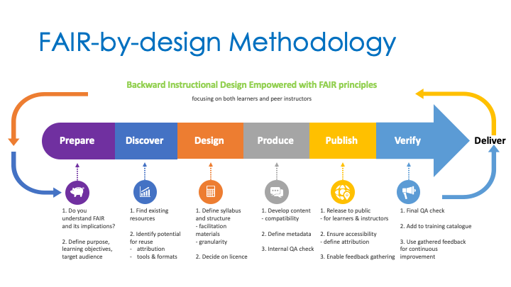

Welcome to the FAIR-by-Design Methodology Microlearning GTN tutorial.

> <agenda-title></agenda-title>
>
>Below are the main stages of the FAIR-by-Design Methodology that will help guide you on your journey of creating FAIR learning materials.
>
>
>
>The FAIR-by-Design Methodology is defined into [a number of stages](#main-stages) that help you incorporate the FAIR principles into the backward learning instructional design process so that the final output are FAIR learning materials from both learners and instructors perspective:
>
>1. [Prepare](#stage-1---prepare)
>	- Do you understand FAIR and its implications
>	- Define purpose, learning objectives, target audience
>2. [Discover](#stage-2---discover)
>	- Find existing resources
>	- Identify potential for reuse
>3. [Design](#stage-3---design)
>	- Define the syllabus and structure
>	- Identify granularity
>	- Define facilitation materials
>4. [Produce](#stage-4---produce)
>	- Develop content using common apps and file formats
>	- Define machine readable metadata
>	- Perform internal QA check
>5. [Publish](#stage-5---publish)
>	- Define license and other related info
>	- Release for instructors and learners
>	- Enable feedback gathering
>6. [Verify](#stage-6---verify)
>	- Final QA check
>	- Use gathered feedback for continuous improvement
>7. [Continuous Improvement](#stage-7---continuous-improvement)
>	- Create a list of potential improvements
>	- Choose a set of improvements to be implemented 
>	- Start a new release cycle
>
>Review each stage and the essential steps that it includes.
>
>Essential information about this microlearning unit can be found in the [About](#about) section.
>
{: .agenda}

If you have any questions at any stage on your journey do not hesitate to <a href="mailto:sonja.filiposka@finki.ukim.mk">contact the FAIR-by-Design methodology team</a>.

May all your materials be FAIR!


# Main stages

## Stage 1 - Prepare
> Before anything else, preparation is the key to success!
{: .quote author="Alexander Graham Bell"}

### First things first: What is FAIR?


> <solution-title>Findable</solution-title>
> The editable learning material has a unique and persistent identifier (PID) and is described with sufficiently detailed metadata.
{: .solution}


> <solution-title>Accessible</solution-title>
> The human and machine readable metadata and object are stored in a trusted repository with clear authentication and authorization procedures.
{: .solution}


> <solution-title>Interoperable</solution-title>
> The metadata describing the learning material follows a the RDA minimum metadata schema combined with agreed-upon controlled vocabularies.
> Formal, accessible, shared, and broadly applicable language(s) and format(s) are used to develop the material.
{: .solution}


> <solution-title>Reusable</solution-title>
>The learning material has a clear usage license (CC-BY-4.0 recommended) and accurate information on provenance.
{: .solution }

### Adopt a metadata schema
  <a href="https://fair-by-design-methodology.github.io/FAIR-by-Design_ToT/latest/Stage%201%20%E2%80%93%20Prepare/02-Preparing%20FAIR%20Learning%20Objects/02-Preparing%20FAIR%20Learning%20Objects/#rda-minimal-metadata-for-learning-resources" class="btn btn-primary btn-lg btn-block">The RDA Minimal Metadata Set for Learning Resources</a>

> <details-title>Descriptive info metadata fields</details-title>
> - **Title** =	The human readable name of the resource
> - **Abstract / Description** =	A brief synopsis about or description of the learning resource
> - **Author(s)** =	Name of entity(ies) authoring the resource
> - **Primary Language** =	Language in which the resource was originally published or made available
> - **Keyword(s)** =	Keywords or tags used to describe the resource
> - **Version Date** =	Version date for the most recently published or broadcast resource
{: .details}

> <details-title>Access info metadata fields</details-title>
> - **URL to Resource** =	URL that resolves to the learning resource or to a "landing page" for the resource that contains important contextual information including the direct resolvable link to the resource, if applicable.
> - **Resource URL Type**	 = Designation of the identifier scheme used for the resource URL, e.g., DOI, ARK, Handle
> - **License** =	A license document that applies to this content, typically indicated by URL
> - **Access Cost**	= Choice stating whether or not there is a fee for use of the resource (yes, no, maybe)
{: .details}

> <details-title>Educational info metadata fields</details-title>
> - **Target Group (Audience)** =	Principal users(s) for which the resource was designed
> - **Learning Resource Type** =	The predominant type or kind that characterizes the learning resource
> - **Learning Outcome** =	Descriptions of what knowledge, skills or abilities a learner should acquire on completion of the resource
> - **Expertise (Skill) Level** =	Target skill level in the topic being taught; example values include beginner, intermediate, advanced
{: .details}

More on the metadata here 


><tip-title>More on FAIR learning objects definition:</tip-title>
>- [FAIR instructional design skills](https://fair-by-design-methodology.github.io/FAIR-by-Design_ToT/latest/Stage%201%20%E2%80%93%20Prepare/01-FAIR%20skills%20%26%20principles/01-FAIR%20skills%20%26%20principles/#fair-instructional-design-skills)
 >- [FAIR guiding principles](https://fair-by-design-methodology.github.io/FAIR-by-Design_ToT/latest/Stage%201%20%E2%80%93%20Prepare/01-FAIR%20skills%20%26%20principles/01-FAIR%20skills%20%26%20principles/#fair-guiding-principles)
 >- [FAIR learning objects](https://fair-by-design-methodology.github.io/FAIR-by-Design_ToT/latest/Stage%201%20%E2%80%93%20Prepare/01-FAIR%20skills%20%26%20principles/01-FAIR%20skills%20%26%20principles/#fair-learning-objects)
{: .tip}

### Start Ideating...

<div class="row">
  <div class="col-sm-4">
   <!-- <div class="card text-white bg-secondary mb-3" > -->
   <div class="card bg-light mb-3" >
      <!-- <div class="card-header text-white"> -->
      <div class="card-header"><i class="fa fa-fast-backward" aria-hidden="true"></i> Think backward</div>
      <div class="card-body">
        <h5 class="card-title">Step 1</h5>
        <p class="card-text">What are your desired effects, i.e. learning outcomes...</p>
      </div>
    </div>
  </div>

  <div class="col-sm-4">
    <div class="card bg-light mb-3" >
      <div class="card-header"><i class="fa fa-fast-backward" aria-hidden="true"></i> Think backward</div>
      <div class="card-body">
        <h5 class="card-title">Step 2</h5>
        <p class="card-text">How are you going to assess their achievement....</p>
      </div>
    </div>
  </div>

  <div class="col-sm-4">
    <div class="card bg-light mb-3" >
      <div class="card-header"><i class="fa fa-fast-backward" aria-hidden="true"></i> Think backward</div>
      <div class="card-body">
        <h5 class="card-title">Step 3</h5>
        <p class="card-text">How should you structure the material to reach them...</p>
      </div>
    </div>
  </div>

</div>
><tip-title>More on backward learning:</tip-title>
> - [Steps of the backward learning process](https://fair-by-design-methodology.github.io/FAIR-by-Design_ToT/latest/Stage%201%20%E2%80%93%20Prepare/02-Preparing%20FAIR%20Learning%20Objects/02-Preparing%20FAIR%20Learning%20Objects_cont/#backward-instructional-design-process)
{: .tip }

### Define.

> <question-title>Purpose</question-title>
> When and how the learning materials can be used and for what purposes?
{: .question }

> <question-title>Target Audience</question-title>
> Is there anything specific that needs to be taken into account, such as cultural context?
{: .question }

> <question-title>Prerequisites</question-title>
> What does the target audience need to know or understand before starting the learning process?
{: .question }

> <question-title>Scope</question-title>
> Is it going to be a single learning unit, or a group such as a course?
{: .question }

> <question-title>Learning Objectives</question-title>
> What competences will be gained after successful completing of the learning process?
>
> ><tip-title>Be SMART</tip-title>
> >Objectives should be specific, ​measurable, ​attainable, ​relevant and ​time-bound​.
> {: .tip}
>
> ><tip-title>Use Blooms Taxonomy</tip-title>
> >Formulate the objectives as actionable verb + observable knowledge, skill, attitude, behavior or ability.
> {: .tip}
> 
> [See more](https://fair-by-design-methodology.github.io/FAIR-by-Design_ToT/latest/Stage%201%20%E2%80%93%20Prepare/02-Preparing%20FAIR%20Learning%20Objects/02-Preparing%20FAIR%20Learning%20Objects_cont/#defining-learning-objectives)
{: .question }

<a href="https://fair-by-design-methodology.github.io/FAIR-by-Design_Book/4%20-%20FAIR-by-design%20learning%20materials%20creation/4.1%20-%20Workflow%20stages%20description/411-prepare/" class="btn btn-dark text-white btn-lg btn-block">Go to FAIR-by-Design Methodology: Prepare stage....</a>

## Stage 2 - Discover
> Greater even than the greatest discovery is to keep open the way to future discovery.
{: .quote author="John Jacob Abel"}
### Get inspired
Reusable materials can be found anywhere. These are just some examples:
> <code-in-title>OER</code-in-title>
> [DOAB](https://directory.doabooks.org/)
> [MERLOT](https://www.merlot.org/merlot/index.htm)
> [OASIS](https://oasis.geneseo.edu/index.php)
> [OER Commons](https://www.oercommons.org/)
> [OERTX CORA](https://www.projectcora.org/)
> [GALILEO](https://oer.galileo.usg.edu/)
> [FORRT](https://forrt.org/)
{: .code-in}

> <code-in-title>EOSC</code-in-title>
> [EOSC Training catalogue on the EOSC Marketplace](https://search.marketplace.eosc-portal.eu/search/training?q=*)
> 
> Most EOSC projects have their own training catalogues and/or platforms...
{: .code-in}

> <code-in-title>General</code-in-title>
> [Creative Commons Search](https://search.creativecommons.org/) - content provided under a CC license
> 
> [Zenodo](https://zenodo.org/) - a multi-disciplinary open repository
> 
> [OSF](https://osf.io/) - a free, open research platform
{: .code-in}

### Potential for reuse
> <warning-title> Respect the licenses, to be respected!</warning-title>
> Materials with non-permissible licenses can be used for inspiration only. Materials with permissible licenses should be reused based on the license rules.
{: .warning}

### Don't forget the multimedia search

Different learners have different learning modalities (read/write, auditory, visual, kinesthetic). You should use all types of multimedia in your learning materials.

<a href="https://fair-by-design-methodology.github.io/FAIR-by-Design_Book/4%20-%20FAIR-by-design%20learning%20materials%20creation/4.1%20-%20Workflow%20stages%20description/412-discover/" class="btn btn-dark text-white btn-lg btn-block">Go to FAIR-by-Design Methodology: Discover stage....</a>

## Stage 3 - Design
> Design is intelligence made visible.
{: .quote author="Alina Wheeler"}
### Time to brainstorm

<small>
<br>
<a href="https://pixabay.com/users/geralt-9301/?utm_source=link-attribution&utm_medium=referral&utm_campaign=image&utm_content=3829057">Gerd Altmann</a> from <a href="https://pixabay.com//?utm_source=link-attribution&utm_medium=referral&utm_campaign=image&utm_content=3829057">Pixabay</a>
</small>
#### Concept map
Build a concept map of your learning materials aligning with the MVS profiles.

The aligned MVS profile can help you cristalize the learning objectives using MVS taxonomy.

Each MVS profile defines a list of technical and soft skills required for the profile. Think on how to incorporate both aspects in your learning materials.

<a href="https://fair-by-design-methodology.github.io/MVS/latest/MVS%20Profiles/Civil%20Servant/civil_servant/" class="btn btn-primary stretched-link">Go to MVS profiles catalogue</a>

### Structure is everything

><comment-title></comment-title>
> Create an intuitive logical organisation of all learning materials.
{: .comment}

><comment-title></comment-title>
> The goal is for other people to easily reuse a single item (plan, activity, unit, assessment, ...).
{: .comment}

><comment-title></comment-title>
> Use a hierarchical structure to combine learning units into larger compositions.
{: .comment}


><hands-on-title>How to organise the files</hands-on-title>
> The diagram shows how to organise all files in folders and subfolders. Click on the links to discover and use pre-prepared templates.
{: .hands-on}

```
├── README
├── CITATION.cff
├── LICENCE
├── resources
├───├── attachments 
│   ├── Learning Unit1
├───├───├── attachments
│   │   ├── assesment
│   │   ├── activities
│   ├── Learning Unit2

```

><comment-title>Syllabus is ready</comment-title>
> You should by now have the first draft of your <a href='https://fair-by-design-methodology.github.io/FAIR-by-Design_ToT/latest/Stage%203%20–%20Design/04-Conceptualisation/04-Conceptualisation/'>syllabus</a>. It contains all the fields from the RDA min metadata set plus the high level topics covered by the learning material.
{: .comment}

><tip-title>Available feedback form</tip-title>
> The <a href='https://fair-by-design-methodology.github.io/FAIR-by-Design_ToT/latest/Stage%203%20–%20Design/07-Facilitation/07-Facilitation/'> feedback form template </a> is ready to be used as is. All you need to do is change the name of the training. It should be shared with training participants after the training, to gather quantitative and qualitative feedback.
{: .tip}

><tip-title>Available facilitation guide kit</tip-title>
> The <a href='https://fair-by-design-methodology.github.io/FAIR-by-Design_ToT/latest/Stage%203%20–%20Design/07-Facilitation/07-Facilitation/'> facilitation guide </a> should help prepare for the actual training. If you don't want to develop your own, use something that is already available such as the [TRIPLE project TRAINING TOOLKIT](https://project.gotriple.eu/project-deliverables/triple-training-toolkit/).
{: .tip}

><tip-title>Don't worry, we got you covered with templates</tip-title>
> All templates are readily available for use in the specialised [templates repository](https://github.com/FAIR-by-Design-Methodology/templates). See the detailed training on how to use it step by step.
{: .tip}

><question-title>What about instructor notes?</question-title>
>  Need to be detailed enough so that anyone can reuse the slides properly. Don't put them in the slide deck. This is what the learning content file is for.
{: .question}

### How to develop the learning content

<a href="https://www.csun.edu/sites/default/files/Holle-Lesson-Planning.pdf" class="btn btn-primary btn-lg btn-block">Use the Hunter Model</a>

<div class="row">
  <div class="col-sm-4">
   <div class="card bg-light mb-3" >
      <div class="card-body">
        <h5 class="card-title"> 1. Set Learning Objectives</h5>
        <p class="card-text">
         ... what is the goal 
        </p>
      </div>
    </div>
  </div>
<div class="col-sm-4">
   <div class="card bg-light mb-3" >
      <div class="card-body">
        <h5 class="card-title"> 2. Identify Needs</h5>
        <p class="card-text">
        ... how to get there
        </p>
      </div>
    </div>
  </div>
<div class="col-sm-4">
   <div class="card bg-light mb-3" >
      <div class="card-body">
        <h5 class="card-title"> 3. Plan</h5>
        <p class="card-text">
        ... share the agenda 
        </p>
      </div>
    </div>
  </div>
</div>

<div class="row">
  <div class="col-sm-4">
   <div class="card bg-light mb-3" >
      <div class="card-body">
        <h5 class="card-title"> 4. Hook</h5>
        <p class="card-text">
         ... why is the content important 
        </p>
      </div>
    </div>
  </div>
<div class="col-sm-4">
   <div class="card bg-light mb-3" >
      <div class="card-body">
        <h5 class="card-title"> 5. Instruct</h5>
        <p class="card-text">
        ... watch how I do it
        </p>
      </div>
    </div>
  </div>
<div class="col-sm-4">
   <div class="card bg-light mb-3" >
      <div class="card-body">
        <h5 class="card-title"> 6. Practise</h5>
        <p class="card-text">
        ... you help me do it, I'll watch you do it 
        </p>
      </div>
    </div>
  </div>
</div>

<div class="row">
  <div class="col-sm-4">
   <div class="card bg-light mb-3" >
      <div class="card-body">
        <h5 class="card-title"> 7. Wrap-Up</h5>
        <p class="card-text">
         ... foster retention and reinforcement
        </p>
      </div>
    </div>
  </div>
<div class="col-sm-4">
   <div class="card bg-light mb-3" >
      <div class="card-body">
        <h5 class="card-title"> 8. Evaluate</h5>
        <p class="card-text">
        ... monitor progress
        </p>
      </div>
    </div>
  </div>
<div class="col-sm-4">
   <div class="card bg-light mb-3" >
      <div class="card-body">
        <h5 class="card-title"> 9. Reflect</h5>
        <p class="card-text">
        .. how did it go?
        </p>
      </div>
    </div>
  </div>
</div>

<a href="https://fair-by-design-methodology.github.io/FAIR-by-Design_Book/4%20-%20FAIR-by-design%20learning%20materials%20creation/4.1%20-%20Workflow%20stages%20description/413-design/" class="btn btn-dark text-white btn-lg btn-block">Go to FAIR-by-Design Methodology: Design stage....</a>

## Stage 4 - Produce

> To contrive is nothing! To construct is something! To produce is everything! 
{: .quote author="Edward Rickenbacker​"}

### Choose Tools & Formats
> <tip-title>Collaborative environment for team work</tip-title>
>  Choose an environment for producing the learning material that will enable multiple people to work on the same material at one. Two examples are workplace or GitHub (find out more <a href='https://fair-by-design-methodology.github.io/FAIR-by-Design_ToT/latest/Stage%204%20–%20Produce/08-Development%20Tools/08-Introduction%20to%20Markdown%20and%20Git/'>here</a>). Replicate the folder tree in the environment and start using the provided templates to generate the content.
{: .tip}

> <tip-title>Granular versioning for easy rollback</tip-title>
>    Versioning helps you maintain control over your changes. If the collaborative environment does not provide versioning and history retention then keep a history of the files by adopting a naming convention such as combining the file name with an increasing version number.
{: .tip}

> <tip-title>Open file formats to foster reuse</tip-title>
>  For other people to reuse your materials they should be made available using open file formats (docx, pptx, pdf, md, html, etc.). If you use close file formats then you MUST clearly state the tools that have been used for development in your README file.
{: .tip}

> <tip-title>Multimodal content to reach all audience</tip-title>
>  Don't forget to include different types of multimedia to provide support for different learning modalities: read/write, auditory, visual, kinesthetic.
{: .tip}

> <tip-title>Two file sets: editable + final</tip-title>
> Always work with and keep a history of your editable files. These are what matters for you and other instructors. The second set of final files should be obtained from the editable when needed (before distributing them to the learners). The final files should be kept on the learning platform only. In this way you don't need to worry about keeping the versions in sync.
{: .tip}

> <tip-title>Don't forget to support co-creation</tip-title>
> Truly FAIR learning materials should enable co-creation with external parties. If you don't use a collaborative environment that supports this from the start (such as GitHub), then think how are you going to enable this in the future and how are you going to deal with versioning then.
{: .tip}


### Plan to reuse existing material? 

#### Check the license

The existing materials is available under a CC license, but it is different than the one you plan to use for your materials...

><details-title>I want to reuse it as a whole</details-title>
>You can't use something that is licensed with ND (no derivatives). In this case you must follow the rules on combining and adapting CC material. 
>[Read more...](https://creativecommons.org/faq/#combining-and-adapting-cc-material)
{: .details}

><details-title>I want to reuse a small part of it</details-title>
> No problem, you can reuse any existing CC licensed material in your learning materials as long as the reused portion is used as a showcase or to make a specific point and it is not the core of your work. If the work is licensed with ND, do not modify it while reusing.
{: .details}

><details-title>Learn more about IPR</details-title>
>[How Intellectual Property Rights (IPR) protect the interests of the creators and owners by providing them with rights over their creation?](https://fair-by-design-methodology.github.io/FAIR-by-Design_ToT/latest/Stage%201%20%E2%80%93%20Prepare/02-Preparing%20FAIR%20Learning%20Objects/02-Preparing%20FAIR%20Learning%20Objects/#intellectual-property-rights-ipr)
{: .details}

[ Go to CC licensing FAQ](https://creativecommons.org/faq/#before-using-cc-licensed-material)


#### Attribute

All CC licenses require that you attribute the author, and this rule is recommended even if the license is public domain CC-0.
If the work you are reusing has a copyright notice ('© some text') you need to reproduce it while you credit the work.
You should also be able to remove attribution upon request.

> <details-title>Use the authors recommended attribution</details-title>
> If the original author has provided a cite-as information, use it to attribute the work.
{: .details}

> <details-title>Use TASL</details-title>
> Provide the Title, Author, Source and License of the work that you are reusing. 
>
>- Source is the URL to the original work.
>- If there is a URL to the author personal pages, provide it together with the name.
>- Provide the name of the license and a URL to the license. 
{: .details}

> <details-title>Examples</details-title>
> Examples are taken from [Best Practices for Creative Commons attributions - how to attribute works you reuse under a Creative Commons license](https://www.newmediarights.org/guide/how_to/creative_commons/best_practices_creative_commons_attributions) submitted by [New Media Rights](https://www.newmediarights.org/) available under a [CC BY-NC 3.0 US DEED](https://creativecommons.org/licenses/by-nc/3.0/us/) 
> - Webpage/Blog - Title (with link to original work), author (or username) (with link to author's website), and license (with link).
> 	- [Undercover Vampire Policeman](https://chriszabriskie.bandcamp.com/album/undercover-vampire-policeman) by [Chris Zabriskie](https://chriszabriskie.bandcamp.com/), available under a [Creative Commons Attribution 4.0 License](http://creativecommons.org/licenses/by/4.0/)
> - Book – Title, author, license written somewhere near the title and author if it’s a hard copy or if it’s an online book you should include a link to the licensed terms.
> 	- [From Dust to Digital: Ten Years of the Endangered Archives Programme](https://books.google.com/books?id=ImO3BgAAQBAJ&pg=PR4&dq=creative+commons+4.0&hl=en&sa=X&ved=0CEoQ6AEwCGoVChMIspCXhPPxxgIVSF0eCh27NA5X#v=onepage&q=creative%20commons%204.0&f=false) by Maja Kominko under a Creative Commons Attribution Non-commercial Non-Derivative 4.0 International license (CC BY-NC-ND 4.0)
> - Online Video - Title, author, license written into credits at end of video.  Ideally make the text clickable to the original work.  Put links to the original work and the license terms in the information section for the particular work (i.e. on the right in YouTube).
> 	- [http://www.youtube.com/watch?v=fDbbdeIXO0w#t=3m0s](http://www.youtube.com/watch?v=fDbbdeIXO0w#t=3m0s)
> - Podcast/Audio - Title, author, license read at the end of the entire work.
> 	- [“Je Suis Rick Springfield”](http://www.jonathancoulton.com/wiki/Je_Suis_Rick_Springfield) from the album [Artificial Heart](http://www.jonathancoulton.com/wiki/Artificial_Heart_(album)), by Jonathan Coulton, used under a [Creative Commons Attribution-Noncommercial 3.0 Unported License](http://creativecommons.org/licenses/by-nc/3.0/)
>- Photo/Drawing/Illustration – Title, author, license (with link online) or in close proximity to the tangible work (either in the border or directly on the work, if applicable).
> 	- [Comcast protest](http://www.flickr.com/photos/ari/8503459/in/set-214952/)” by Flikr user [Steve Rhodes](http://www.flickr.com/photos/ari/) used under [Creative Commons Attribution 2.0 license](http://creativecommons.org/licenses/by/2.0/deed.en)
{: .details}

> <details-title>Learn more</details-title>
> [  Attribution and Citing](https://fair-by-design-methodology.github.io/FAIR-by-Design_ToT/latest/Stage%201%20%E2%80%93%20Prepare/02-Preparing%20FAIR%20Learning%20Objects/02-Preparing%20FAIR%20Learning%20Objects/#attribution-and-citing)
{: .details}

[ How to handle attribution?](https://courses.lumenlearning.com/suny-oerguide/chapter/how-to-handle-attribution/)


### Accessibility
><tip-title></tip-title>
>The developed learning materials should cover the widest range of learner variability including the ones that use or do not use assistive technology.
{: .tip}


<small>
<br>
<a href="https://pixabay.com/users/inspire-studio-22128832/?utm_source=link-attribution&utm_medium=referral&utm_campaign=image&utm_content=6602642">J S</a> from <a href="https://pixabay.com//?utm_source=link-attribution&utm_medium=referral&utm_campaign=image&utm_content=6602642">Pixabay</a>
</small>

#### Standards
There are several standards that govern the rules on level of accessibility. Three conformance levels exist, you should aim for AA which is the middle one.

Most commonly used is the <a href="https://www.w3.org/WAI/standards-guidelines/wcag/">W3C Web Content Accessibility Guidelines (WCAG) standard version 2.1</a>.

PDF document accessibility is measured with a separate technical specification <a href="https://pdfua.foundation/en/why-pdf-ua/">PDF/UA (Universal Accessibility)</a>.

<a href="https://fair-by-design-methodology.github.io/FAIR-by-Design_ToT/latest/Stage%204%20%E2%80%93%20Produce/11-Accessibility/11-Checking_accessibility/" class="btn btn-primary stretched-link">Learn more</a>


#### Use accessibility evaluation tools!

Accessibility evaluation tools are not perfect. Even if they say that all is ok, it does not mean that your content is truly accessible. But they are a very good starting point.

> <details-title>Slides</details-title>
> Use the integrated accessibility checker in Power Point:
> 1. Open an existing presentation in PowerPoint and review the content. 
> 2. Select the Review tab. 
> 3. Select Check Accessibility.
> 4. An Accessibility Checker pane will appear on the right with 'Inspection Results' displayed.
{: .details}

> <details-title>Web content</details-title>
> Choose from the [Web Accessibility Evaluation Tools List](https://www.w3.org/WAI/test-evaluate/tools/list/) developed by W3C.
{: .details}

> <details-title>PDF document</details-title>
> Check accessibility in Adobe Acrobat Pro.
>
> Open the PDF and then from the All tools menu on the left, select View more and then select Prepare for accessibility.
{: .details}


### Internal QA

<div class="row">
  <div class="col-sm-4">
   <!-- <div class="card text-white bg-secondary mb-3" > -->
   <div class="card bg-light mb-3" >
      <!-- <div class="card-header text-white"> -->
      <div class="card-body">
        <h5 class="card-title"> QA Self-assessment</h5>
        <p class="card-text">
         to check if everything is as it should be. 
        </p>
      </div>
    </div>
  </div>
<div class="col-sm-4">
   <!-- <div class="card text-white bg-secondary mb-3" > -->
   <div class="card bg-light mb-3" >
      <!-- <div class="card-header text-white"> -->
      <div class="card-body">
        <h5 class="card-title"> Quantitative</h5>
        <p class="card-text">
        are all required elements produced
        </p>
      </div>
    </div>
  </div>
<div class="col-sm-4">
   <!-- <div class="card text-white bg-secondary mb-3" > -->
   <div class="card bg-light mb-3" >
      <!-- <div class="card-header text-white"> -->
      <div class="card-body">
        <h5 class="card-title"> Qualitative</h5>
        <p class="card-text">
        do all learning units provide materials to reach the learning objectives with different modalities. 
        </p>
      </div>
    </div>
  </div>
</div>

<a href="https://fair-by-design-methodology.github.io/FAIR-by-Design_Book/4%20-%20FAIR-by-design%20learning%20materials%20creation/4.1%20-%20Workflow%20stages%20description/414-produce/" class="btn btn-dark text-white btn-lg btn-block">Go to FAIR-by-Design Methodology: Produce stage....</a>
## Stage 5 - Publish
> Publishing is the art of working on a creative idea and turning it into a masterpiece​!
{: .quote author="Unknown"}

><warning-title>Publishing closed FAIR materials</warning-title>
> Having FAIR learning materials does not always mean that the materials are open to everyone and there are no costs or access rules attached. In this case the bundle that is going to be published in an open repository such as Zenodo should contain the following:
>  1. Syllabus - that contains all metadata that describe the materials and metadata should always be open
>  2. Accompanying files - optional - augment the description of the materials and describe the details when it comes to accessing and using the materials from a trainer perspective 
> Another alternative is to publish the materials in a closed repository where the corresponding access rules can be implemented.
{: .warning}

### Final preparations
><tip-title>Time to create the accompanying files</tip-title>
>These are <a href='https://fair-by-design-methodology.github.io/FAIR-by-Design_ToT/latest/Stage%205%20–%20Publish/16-Publishing%20Preparations/16-Publishing%20Preparations/'>files</a> that are provided in the root of your learning materials and describe the content and define the rules of reuse.
{: .tip}

<div class="row">
  <div class="col-sm-4">
   <!-- <div class="card text-white bg-secondary mb-3" > -->
   <div class="card bg-light mb-3" >
      <!-- <div class="card-header text-white"> -->
      <div class="card-body">
        <h5 class="card-title"> LICENSE</h5>
        <p class="card-text">
         Plaintext file that defines the license of your learning materials. Just copy paste it from the official CC website. CC-BY-4.0 is the recommended license. 
         <br>
         <a href="https://creativecommons.org/licenses/by/4.0/legalcode.txt" >  CC license
         </a>       
        </p>
      </div>
    </div>
  </div>
<div class="col-sm-4">
   <!-- <div class="card text-white bg-secondary mb-3" > -->
   <div class="card bg-light mb-3" >
      <!-- <div class="card-header text-white"> -->
      <div class="card-body">
        <h5 class="card-title"> README</h5>
        <p class="card-text">
        A README is a text file that introduces and explains the contents of your learning materials. It usually describes the context and defines how the materials may be reused or co-created. It is usually written in a plain text format.
        <br>
		<a href="https://www.makeareadme.com/">
          Make a README
        </a>
        </p>
      </div>
    </div>
  </div>
<div class="col-sm-4">
   <!-- <div class="card text-white bg-secondary mb-3" > -->
   <div class="card bg-light mb-3" >
      <!-- <div class="card-header text-white"> -->
      <div class="card-body">
        <h5 class="card-title"> CITATION.cff</h5>
        <p class="card-text">
        Citation files are plain text files with human- and machine-readable citation information that tells others how to cite or attribute your work. 
        <br>
        <a href="https://citation-file-format.github.io/">
          Create a citation file
         </a>
        </p>
      </div>
    </div>
  </div>
</div>

<div class="row">
  <div class="col-sm-4">
   <!-- <div class="card text-white bg-secondary mb-3" > -->
   <div class="card bg-light mb-3" >
      <!-- <div class="card-header text-white"> -->
      <div class="card-body">
        <h5 class="card-title"> CODE_OF_CONDUCT</h5>
        <p class="card-text">
        A code of conduct defines the rules for how to engage in a co-creation community. It is based on a premise of an inclusive environment that respects all contributions.
         <br>
         <a href="https://github.com/probot/template/blob/master/CODE_OF_CONDUCT.md">
          Code of conduct template
         </a>
        </p>
      </div>
    </div>
  </div>
<div class="col-sm-4">
   <!-- <div class="card text-white bg-secondary mb-3" > -->
   <div class="card bg-light mb-3" >
      <!-- <div class="card-header text-white"> -->
      <div class="card-body">
        <h5 class="card-title"> RELEASE NOTES</h5>
        <p class="card-text">
        A release note is a report published alongside new or updated version of your learning materials that details the changes in the new version. 
        <br>
        <a href="https://slite.com/templates/release-notes">
         Creating Release Notes
        </a>
		</p>
      </div>
    </div>
  </div>
</div>

### Store in a repository

><tip-title>Automated publishing</tip-title>
>If you are working on GitHub using the provided templates repository then the "publish to Zenodo" step is fully automated for you. Just follow the [guide to publishing](https://fair-by-design-methodology.github.io/FAIR-by-Design_ToT/latest/Stage%205%20%E2%80%93%20Publish/17-Zenodo%20Publishing/17-Zenodo%20Publishing/).
{: .tip}

><tip-title>To training catalogue</tip-title>
>You are at the point when you should also consider making a record in a relevant training catalogue such as the EOSC training catalogue.
{: .tip}

<a href="https://fair-by-design-methodology.github.io/FAIR-by-Design_Book/4%20-%20FAIR-by-design%20learning%20materials%20creation/4.1%20-%20Workflow%20stages%20description/415-publish/" class="btn btn-dark text-white btn-lg btn-block">Go to FAIR-by-Design Methodology: Publish stage....</a>

## Stage 6 - Verify
> You will find it a very good practice always to verify your references, sir!
{: .quote author="Martin Routh"}
### External QA
> <tip-title> A fresh set of eyes</tip-title>
> Have someone who has not participated in the development of the learning materials review the final work. This will guarantee a review free of cognitive bias.
{: .tip}

> <tip-title> Go through the QA checklists</tip-title>
> In Skills4EOSC T2.4 has developed a number of QA checklists that you and your external reviewer need to go through so that you can ensure high-quality learning materials.
{: .tip}

### FAIR or not FAIR, that is the question...

#### Measure FAIRness

Use the FAIR-by-Design methodology QA checklist to check if you have followed the most important aspects of the methodology and managed to produce FAIR learning materials.

The questions marked as essential achieve bare minimum FAIRness. 

><details-title>Essential requirements</details-title>
> - **Findable** =	Is the complete learning resource (including instructors info) registered or indexed in at least one searchable repository? Is it in a FAIR repository? Is metadata for the resource provided in both human- and machine-readable format (e.g JSON, XMLor YAML?
> - **Accessible** =	Has an accessibility checker tool been utilised to improve the accessibility of all learning resource files (PDF, HTML, video, etc.)? Are access rules (authentication & authorisation) implemented for the learning resource?
> - **Interoperable** = Is the RDA minimal (or domain specific) metadata schema used for the learning material description? Is the resource available in open file formats which are tool agnostic and compatible with a wide variety of existing software?
> - **Reusable** = Is there clear attribution for all reused resources with compatible licenses? Has the learning resource been made available for use by defining a permissable license or policy information that allows derivations?
{: .details}

><details-title>Optional requirements</details-title>
> -  Did you follow the stages of the backward instructional design process while developing the learning resource?
> -  Are controlled vocabularies (CVs) used for describing the resource characteristics aligned with the chosen metadata schema?
> -  Does the learning resource represent a complete learning object defined around minimum one learning objective?
> -  Does the resource incorporate an instructor kit that aids in facilitating the process of others reusing learning material by offering helpful how-to guides?
>    -  facilitator guide
>    -  activities description
>    -  assessment activities and strategy to assess
>    -  general learning content or instructor notes
>    -  lesson unit plan
>    -  syllabus
> -  Have you employed a versioning system to track and control changes in your materials?
> -  Are the resource access rules (how to access, e.g. registration procedure) explicitly communicated to learners?
> -  Is the learning resource searchable in at least one relevant catalogue? 
>    -  Is it FAIR (can be searched based on metadata)?
> -  Does the course include the possibility to provide feedback or comments from users and-or trainers/designers? 
>    -  If so, do you regularly gather and analyse that feedback?
> -  Does the resource adopt an open community approach regarding its quality and reachability?
> -  Has the learning resource been checked by a third party regarding its learning experience quality?
{: .details}

### Feedback QA 

> <comment-title>Regularly gather feedback from learners and instructors</comment-title>
> Ensure that you actively and regularly gather feedback from both perspectives: the learners and the instructors.
{: .comment}

<a href="https://fair-by-design-methodology.github.io/FAIR-by-Design_Book/4%20-%20FAIR-by-design%20learning%20materials%20creation/4.1%20-%20Workflow%20stages%20description/416-verify/" class="btn btn-dark text-white btn-lg btn-block">Go to FAIR-by-Design Methodology: Verify stage....</a>

## Stage 7 - Continuous Improvement
> To improve is to change; to be perfect is to change often
{: .quote author="Winston Churchill"}

####  Gather

Gather feedback from all available internal & external sources.

Potential sources:  
- Feedback form   
- QA recommendations   
- self-reflection after training   
- Survey   
- Direct mail contact   
- Other means of communication

####  Analyse

Analyse the gathered information in a structured way.

Create a list of potential improvements with impact level (high, moderate, low).

####  Improve

Select items from the list that will be part of a new version.

Choose items that make sense to be in the same new release.

####  Repeat

Start a new cycle of the FAIR-by-Design methodology that will implement the selected items. 

After the Verify stage, you will reenter continuous improvement with newly gathered information....

<a href="https://fair-by-design-methodology.github.io/FAIR-by-Design_Book/4%20-%20FAIR-by-design%20learning%20materials%20creation/4.2%20-%20Continuous%20Improvement/417-improvement/" class="btn btn-dark text-white btn-lg btn-block">Go to FAIR-by-Design Methodology: Continuous Improvement stage....</a>

# About

## FAIR-by-Design Microlearning

### Self-paced how to FAIR-by-Design guide

### Original Location

- online: [https://fair-by-design-methodology.github.io/microlearning/latest/](https://fair-by-design-methodology.github.io/microlearning/latest/)
- this tutorial is an adapted version of the original microlearning guide

### Training Description

Short how to guide that guides you through the stages of the FAIR-by-Design methodology without any specific choice on tools and formats.

### Target audience

All interested parties who need to develop learning materials for any type of project-related training.

### Expertise Level / Skill Level: Beginner

### Primary Language: English

### Access Cost: No

### Prerequisites

No prior knowledge is required.

### Learning Objectives

- Design FAIR learning materials
- Structure FAIR learning materials
- Create and publish FAIR-by-Design learning materials
- Assess FAIR-ness of learning objects

### Keywords

FAIR, learning objects, methodology, practical implementation

### Certification Information

This training has no certification or any recognition mechanism included.

### Original Author(s)

- Sonja Filiposka, Dominique Green, Anastas Mishev, Vojdan Kjorveziroski, Andrea Corleto, Eleonora Napolitano, Gabriella Paolini, Sara di Giorgio, Joanna Janik, Luca Schirru, Arnaud Gingold, Christine Chardosek, Irakleitos Souyioultzoglou, Carolin Leister, Emma Lazzeri


### Contact information

- For more information please contact the T2.3 FAIR-by-Design Methodology Task Leader Sonja Filiposka using [sonja.filiposka@finki.ukim.mk](mailto:sonja.filiposka@finki.ukim.mk).

### Original License

<a rel="license" href="http://creativecommons.org/licenses/by/4.0/"></a><br />This work is licensed under a <a rel="license" href="http://creativecommons.org/licenses/by/4.0/">Creative Commons Attribution 4.0 International License</a>.

### Original microlearning unit DOI

[https://doi.org/10.5281/zenodo.11548062](https://doi.org/10.5281/zenodo.11548062)

### Accessibility Mission

Skills4EOSC is dedicated to ensuring that all produced learning materials are accessible to as many visitors as possible regardless of their ability or technology. We have an active commitment to increasing our learning materials accessibility. The main standards that we aim to comply with are WCAG v.2.1 Level AA criteria and PDF/UA (ISO 14289).

#### Acknowledgement

These learning materials have been developed by following the [FAIR-by-Design Methodology](https://zenodo.org/records/8305540).

