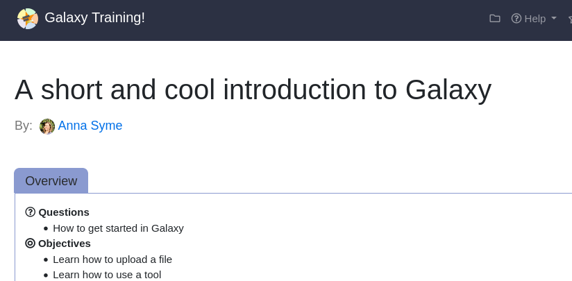

# Introduction
{:.no_toc}

If you are working on your own training materials and want preview them online without installing anything on your computer, you can do this using GitPod!


> ### Agenda
>
> In this tutorial, you will learn how to run a local instance of the GTN website:
>
> 1. TOC
> {:toc}
>
{: .agenda}


# Setting up Gitpod


> ###  Hands-on: Setting up GitPod
>
> 1. **Create a fork** of the GTN GitHub repository
>    - Go on the GitHub repository: [github.com/galaxyproject/training-material](https://github.com/galaxyproject/training-material){: width="50%"}
>    - Click on th Fork button (top-right corner of the page)
>      
>
> 2. **Open** your browser and navigate to [gitpod.io](https://gitpod.io)
> 3. **Log in** with GitHub
>    {: width="25%"}
> 4. Copy the link to your fork of the GTN, e.g. `https://github.com/shiltemann/training-material`
> 5. In the browser’s address bar, prefix the entire URL with `gitpod.io/#` and press Enter.
>
>    For example, `gitpod.io/#https://github.com/<your username>/training-material`
>
>    > ###  Tip: Make this even easier with the GitPod browser extension!
>    >  1. To make this even easier, you can install the GitPod browser extension
>    >     - [Firefox](https://addons.mozilla.org/en-GB/firefox/addon/gitpod/)
>    >     - [Chrome or Edge](https://chrome.google.com/webstore/detail/gitpod-online-ide/dodmmooeoklaejobgleioelladacbekii)
>    >  2. Now it is just a single click to open any GitHub repository in GitPod
>    >     
>    {: .tip}
> 6. Gitpod will now configure your environment. This may take some time
>    
> 7. Once the setup is finished, you should see a page something like this:
>    
{: .hands_on}

# The GitPod Workspace

Let's have a closer look at the GitPod workspace:

- **Left:** Here you see all the files in the GTN repository
- **Top:** This is the main window where you can view and edit files
- **Bottom:** Terminal window. Here you can type commands (e.g. to build the website preview) and read output and error messages.


# Build and preview the GTN website

Before we start making any changes, let's build the website and get a live preview.

> ###  Hands-on: Setting up GitPod
>
> 1. In the terminal window (bottom), type the following command:
>    `make serve-gitpod`
>
>    
>
> 2. The first time you run this command, it will install some dependencies, so it may take a little bit of time (a few minutes)
>    - Next times will be a lot faster! (~30 seconds)
>
> 3. When the build process is finished, the terminal will show you a link
>    - Click on the link in the terminal on the line: `Server address: http://127.0.0.1:4000/training-material/`
>
>    
>
> 4. This will take you to a preview of the GTN website
>    - **Note:** It will take you the 404 page because GitPod doesn't know the location of the GTN homepage, but from here you can just click the homepage button.
>
{: .hands_on}


# Editing Training Materials on GitPod

Now that you have the GitPod environment working and we have a live preview up, let's make some changes to the GTN materials and get an instant preview.


**Scenario:** You have spotted a typo in one of the tutorials, and would like to fix this and see the resulting GTN webpage.


> ###  Hands-on: Make and view changes
>
> 1. In the preview of the GTN website, open the following tutorial:
>    - Topic: "Introduction to Galaxy Analyses" topic
>    - Tutorial: "A Short Introduction to Galaxy""
>    - We will edit this tutorial and watch the live preview window for the effects
>
> 2. On the file browser on the left, open the following file:
>    - `topics/introduction/tutorials/galaxy-short/tutorial.md`
>
> 3. Change the title of the tutorial
>    - **From:** "A Short Introduction to Galaxy"
>    - **To:** "A Short and Cool Introduction to Galaxy"
>    - You should immediately see a message in the terminal saying "regenerating". GitPod has detected your changes and is rebuilding the website.
>    
>    
>
> 4. Open the tab in your browser that has the GTN preview open, and **refresh the page**.
>
> 5. You should see the change you made:
>    
>
{: .hands_on}


In this way you can edit files in the text editor, and see the effects in the website preview.


# Saving your changes back to GitHub

When you have finished your changes, it all looks good in the preview, you want to save your changes back to GitHub so that you can either continue later, or make a Pull Request to the GTN to contribute your changes.

> ###  Hands-on: Save changes
>
> 1. **Option 1: via the terminal**
>    - Hit CTRL+C if your preview was still running
>    - Create a new branch, commit your changes, push changes:
>
>    ```basth
>    git checkout -b fix-title
>    git commit -m "update tutorial title" topics/introduction/tutorials/galaxy-intro-short/tutorial.md
>    git push origin fix-title
>    ```
>
> 2. **Option 2: via the web interface**
>    - Create a new branch:
>      -  On the bottom-left, click on the branch logo (probably "master" or "main")
>         
>      - Enter `fix-title` as the name for your new branch (at top of window)
>      - Choose "+ Create new branch..." from the dropdown
>    - Commit changes:
>      - On the left menu, click on the "changed files" tab
>        
>      - Click on the "+" icon next to the file we edited to *stage changes*
>        
>      - Hit the checkmark icon at the top to commit the changes
>      - Enter a commit message (top of window)
>   - Publish changes
>     - Click the cloud button at bottom left to publish your changes
>       
>
>
> 3. Your changes are now saved to your fork, and you can make a PR via the GitHub interface.
>    - If you used option 1 and want to do that right away, you can click on the link in the terminal:
>      
>
> > ### Note: GitPod Permissions
> > If this is your first time using GitPod, you may need to grant permissions to let GitPod push to your GitHub fork
> > 
> > This will take you through a process to authorize GitPod, and set permissions
> > 
> {: .tip}
{: .hands_on}


# Closing your GitPod Workspace

Everybody gets 50 hours per month for free on GitPod, so it is wise to close your GitPod workspace when you are finished with it, to conserver your quotum.

> ###  Hands-on: Shutting down your GitPod workspace
>
> 1. Click on the menu button at the top left corner of the screen
>    - Choose "Gitpod: Stop Workspace"
>
>    
>
{: .hands_on}


