If you are working on your own training materials and want preview them online without installing anything on your computer, you can do this using GitPod!


> <agenda-title></agenda-title>
>
> In this tutorial, you will learn how to run a local instance of the GTN website:
>
> 1. TOC
> {:toc}
>
{: .agenda}


# Setting up Gitpod


> <hands-on-title>Setting up GitPod</hands-on-title>
>
> 1. **Create a fork** of the GTN GitHub repository
>    - Go on the GitHub repository: [github.com/galaxyproject/training-material](https://github.com/galaxyproject/training-material){: width="50%"}
>    - Click on th Fork button (top-right corner of the page)
>      
>
>    > <tip-title>Already have a fork of the GTN?</tip-title>
>    > If you already have a fork, fantastic! But a common issue is that the `main` branch gets outdated, or your fork was from before we renamed the `master` branch to `main`.
>    >
>    > - Start by browsing to your fork in GitHub
>    > - Check the default branch that is shown.
>    >   - Does it say `master`? Then you need to update it, following the instructions below
>    >
>    >   > <tip-title> changing your default branch from master to main </tip-title>
>    >   >  1. Go to your fork's settings (Click on the gear icon called "Settings")
>    >   >  2. Find "Branches" on the left
>    >   >  3. If it says master you can click on the ⇆  icon to switch branches.
>    >   >  4. Select `main` (it may not be present).
>    >   >  5. If it isn't present, use the pencil icon to rename `master` to `main`.
>    >   >  6. Now you can update it in the next step
>    >   {: .tip}
>    >
>    > - Click the **Sync Fork** button on your fork to update it to the latest version
>    >
>    >   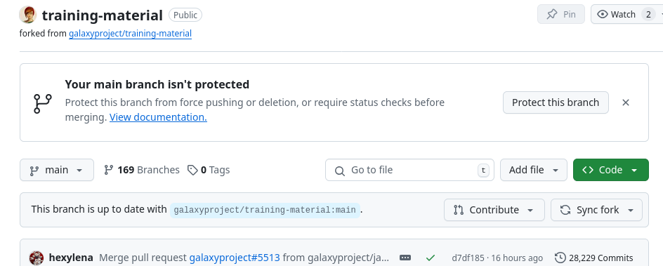
>    {: .tip}
>
> 2. **Open** your browser and navigate to [gitpod.io/login](https://gitpod.io/login)
>    - Note: don't leave the `/login` part of the URL off, it will lead you to a different flavour of GitPod. We are using Gitpod classic
> 3. **Log in** with GitHub
>    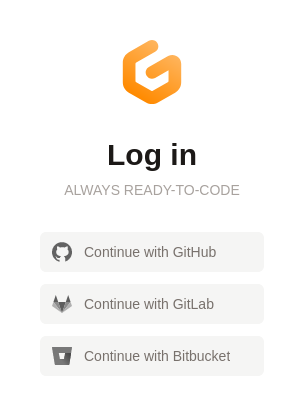{: width="25%"}
> 4. Click on **Configure your own repository** under the Workspaces menu
>    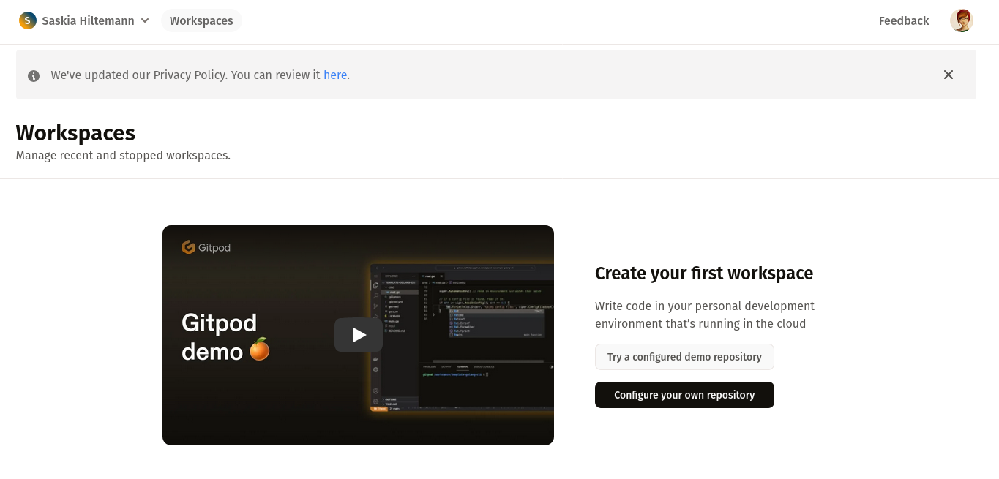
> 5. Under **Select a repository** choose your fork, e.g. `https://github.com/shiltemann/training-material`
>    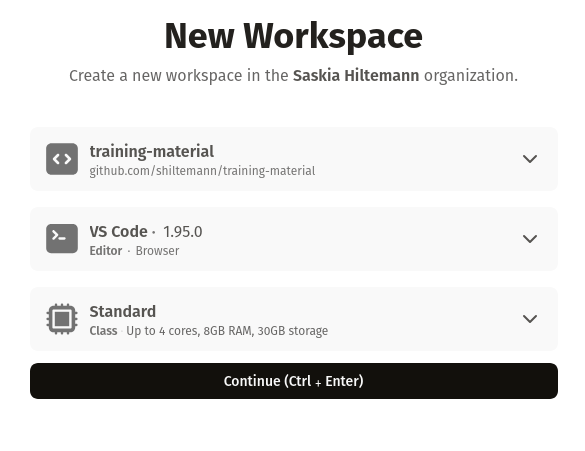
> 6. Click **continue**
>    - This will create an enviroment where you can make changes to the GTN and preview them
>    - **Note:** It can take quite some time to start up the first time (15-30 minutes)
>    - We can make future starts a lot faster using **prebuilds** (see tip box below), you can configure this now while you wait
>
>    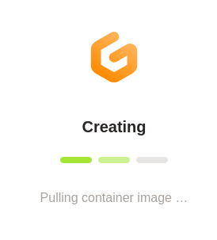
>
>    > <tip-title> Enabling Prebuilds for your GitPod workspace </tip-title>
>    > Prebuilds can speed up the launch of your GitPod workspace after the first time. When this is enabled,
>    > starting a workspace will check if there is a previous build to reuse. This should bring startup times
>    > down to 3-5 minutes.
>    >
>    > **Enable Prebuilds**
>    > 1. On the GitPod website, click on your name in the top left of the screen
>    > 2. Select **Repositories**
>    > 3. Add your fork as a repository
>    > 4. On the left, click **Prebuild settings**
>    > 5. Click the slider in front of **Prebuilds are disabled** to toggle the setting
>    > 6. Set **Branch Filter** to **Default Branch**
>    >
>    > 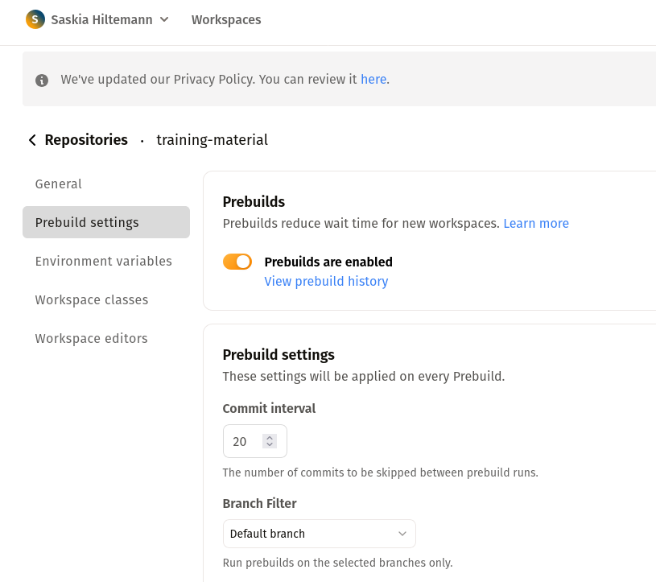
>    >
>    > **Run a prebuild now**
>    > 1. In GitPod, click on your name in the top left of the screen
>    > 2. Select **Prebuilds**
>    > 3. Click **Run a Prebuild**
>    > 4. **Select a Repository**: your fork
>    > 5. Click **Run Prebuild**
>    >    - This will also take a bit of time to complete
>    >    - In the future, it will automatically refresh this prebuild every 20 commits, so you only have to do this once
>    >
>    >
>    > **Note:** Prebuilds expire if you haven't used them in 7 days, so if you have taken a longer
>    > break from GTN you might have to wait longer again the first time. But otherwise it should
>    > bring the launch time down to around 3-5 minutes.
>    {: .tip}
>
> 8. Once the setup is finished, you should see a page something like this:
>    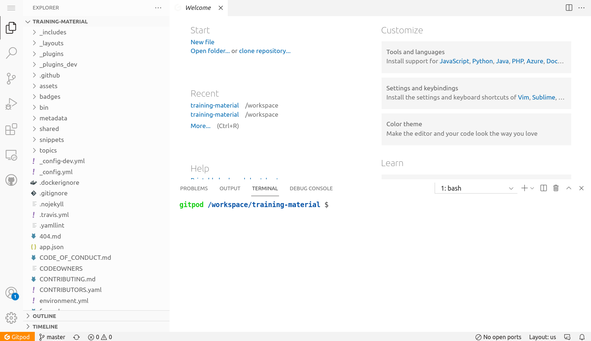
>
>    > <tip-title>Make this even easier with the GitPod browser extension!</tip-title>
>    >  1. To make this even easier, you can install the GitPod browser extension
>    >     - [Firefox](https://addons.mozilla.org/en-GB/firefox/addon/gitpod/)
>    >     - [Chrome or Edge](https://chrome.google.com/webstore/detail/gitpod-always-ready-to-co/dodmmooeoklaejobgleioelladacbeki)
>    >  2. Now it is just a single click to open any GitHub repository in GitPod
>    >     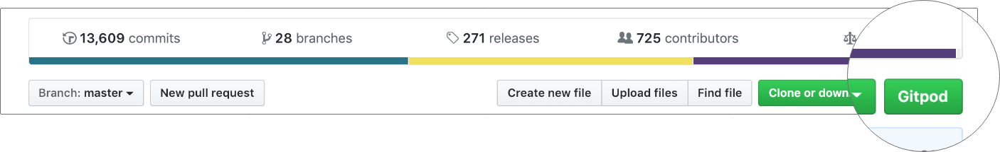
>    {: .tip}
>
{: .hands_on}

# The GitPod Workspace

Let's have a closer look at the GitPod workspace:

- **Left:** Here you see all the files in the GTN repository
- **Top:** This is the main window where you can view and edit files
- **Bottom:** Terminal window. Here you can type commands (e.g. to build the website preview) and read output and error messages.


# Build and preview the GTN website

Before we start making any changes, let's build the website and get a live preview.

> <hands-on-title>Setting up GitPod</hands-on-title>
>
> 1. In the terminal window (bottom), type the following command:
>    `make serve-gitpod`
>
>    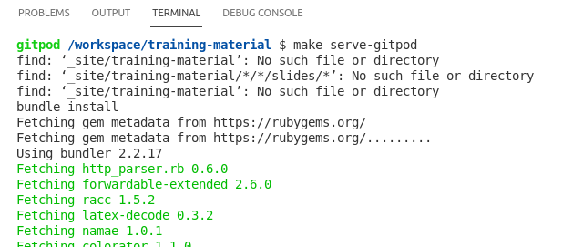
>
> 2. The first time you run this command, it will install some dependencies, so it may take a little bit of time (a few minutes)
>    - Next times will be a lot faster! (~30 seconds)
>
> 3. When the build process is finished, the terminal will show you a link, and a window should popup with a preview on the right.
>    - You may have to click the "Try Again" button if the preview was generated before the site building completed
>
>      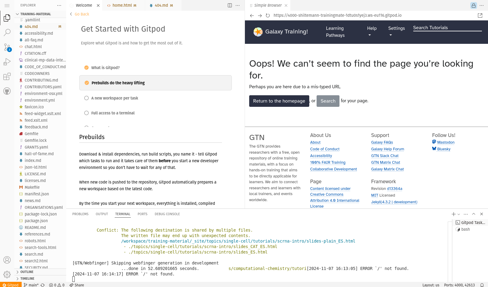
>
>    - Click on the link in the terminal to see the GTN in full-screen: `Server address: http://127.0.0.1:4000/training-material/`
>
>    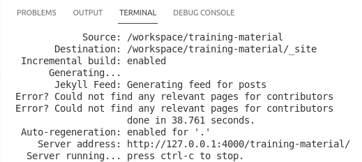
>
>    > <tip-title>Not opening?</tip-title>
>    > 
>    > Some browsers block popups by default, you may need to allow GitPod to show popups in order to click links.
>    {: .tip}
>
> 4. This will take you to a preview of the GTN website
>    - **Note:** It will take you the 404 page because GitPod doesn't know the location of the GTN homepage, but from here you can just click the homepage button.
>
{: .hands_on}


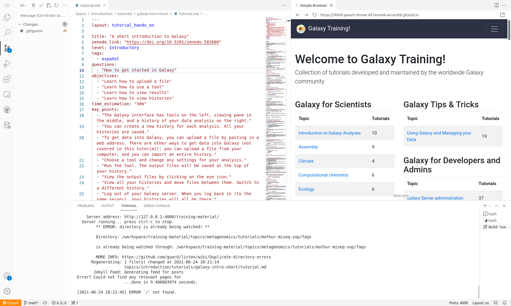

# Editing Training Materials on GitPod

Now that you have the GitPod environment working and we have a live preview up, let's make some changes to the GTN materials and get an instant preview.


**Scenario:** You have spotted a typo in one of the tutorials, and would like to fix this and see the resulting GTN webpage.


> <hands-on-title>Make and view changes</hands-on-title>
>
> 1. In the preview of the GTN website, open the following tutorial:
>    - Topic: "Introduction to Galaxy Analyses" topic
>    - Tutorial: "A Short Introduction to Galaxy""
>    - We will edit this tutorial and watch the live preview window for the effects
>
>
> 2. On the file browser on the left, open the following file:
>
>    ```
>    topics/introduction/tutorials/galaxy-intro-short/tutorial.md
>    ```
>
>    > <tip-title>Finding files faster?</tip-title>
>    > You can use the key combination <kbd>ctrl-p</kbd> to launch the file search dialog and simply enter the text `topics/introduction/tutorials/galaxy-intro-short/tutorial.md`
>    {: .tip}
>
> 3. Change the title of the tutorial
>    - **From:** "A Short Introduction to Galaxy"
>    - **To:** "A Short and Cool Introduction to Galaxy"
>
>    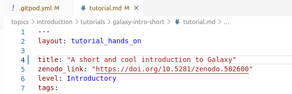
>
>    - You should immediately see a message in the terminal saying "regenerating". GitPod has detected your changes and is rebuilding the website.
>
>    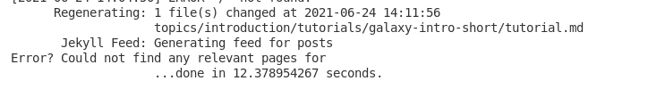
>
> 4. Move to the top right panel where the GTN is previewed and refresh the frame
>    -  Refresh button in front of the address bar of the preview panel
>    - You can also open the preview in it's own brower tab, using the  button at the top-right corner of the preview window. Then you can reload the page the regular way (e.g. <kbd>F5</kbd> or <kbd>ctrl + r</kbd> or the reload button in the browser)
>
> 5. You should see the change you made:
>    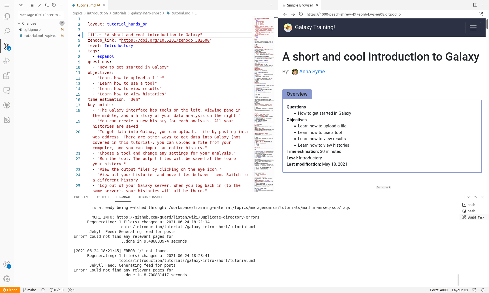
>
{: .hands_on}


In this way you can edit files in the text editor, and see the effects in the website preview.


# Saving your changes back to GitHub

When you have finished your changes, it all looks good in the preview, you want to save your changes back to GitHub so that you can either continue later, or make a Pull Request to the GTN to contribute your changes.

> <hands-on-title>Save changes</hands-on-title>
>
> 1. **Option 1: via the terminal**
>    - Hit <kbd>ctrl+c</kbd> if your preview was still running to stop it
>    - Create a new branch, commit your changes, push changes:
>
>    ```bash
>    git checkout -b fix-title
>    git commit -m "update tutorial title" topics/introduction/tutorials/galaxy-intro-short/tutorial.md
>    git push origin fix-title
>    ```
>
> 2. **Option 2: via the web interface**
>    - Create a new branch:
>      -  On the bottom-left, click on the branch logo (probably labelled "main")
>         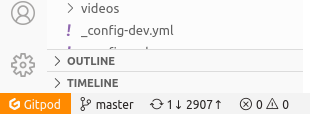
>      - Enter `fix-title` as the name for your new branch (at top of window)
>      - Choose "+ Create new branch..." from the dropdown
>    - Commit changes:
>      - On the left menu, click on the "changed files" tab
>        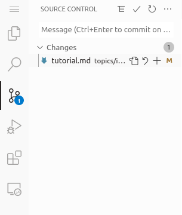
>      - Click on the "+" icon next to the file we edited to *stage changes*
>        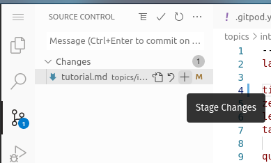
>      - Hit the checkmark icon at the top to commit the changes
>      - Enter a commit message (top of window)
>   - Publish changes
>     - Click the cloud button at bottom left to publish your changes
>       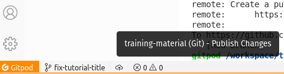
>
>
> 3. Your changes are now saved to your fork, and you can make a PR via the GitHub interface.
>    - If you used option 1 and want to do that right away, you can click on the link in the terminal:
>      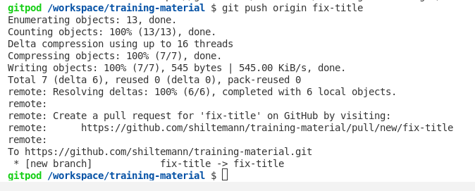
>
> > <tip-title>GitPod Permissions</tip-title>
> > If this is your first time using GitPod, you may need to grant permissions to let GitPod push to your GitHub fork
> > 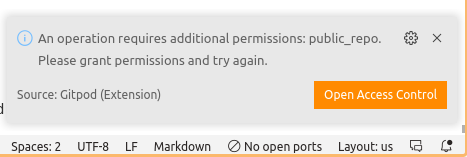
> > This will take you through a process to authorize GitPod, and set permissions
> > 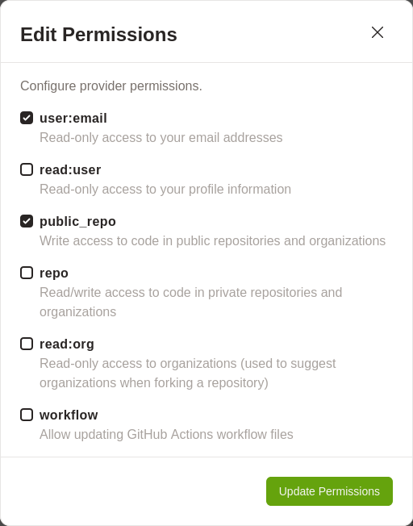
> > If it doesn't take you to GitPod's permission page because your browser blocks popups, you can set them [on this page](https://gitpod.io/integrations).
> {: .tip}
{: .hands_on}


# Closing your GitPod Workspace

Everybody gets 50 hours per month for free on GitPod, so it is wise to close your GitPod workspace when you are finished with it, to conserve your quotum.

> <hands-on-title>Shutting down your GitPod workspace</hands-on-title>
>
> 1. Click on the menu button at the top left corner of the screen
>    - Choose "Gitpod: Stop Workspace"
>
>    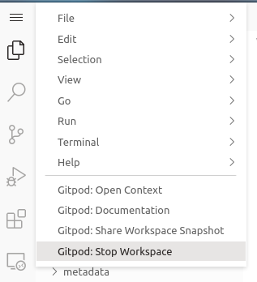
>
{: .hands_on}
