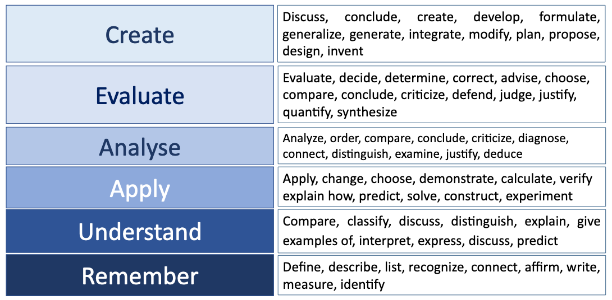
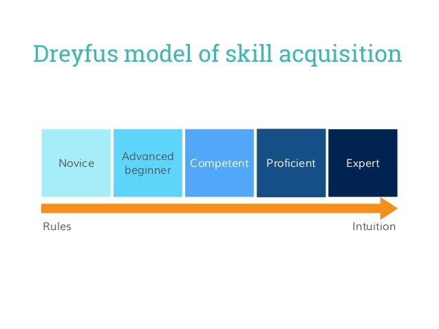
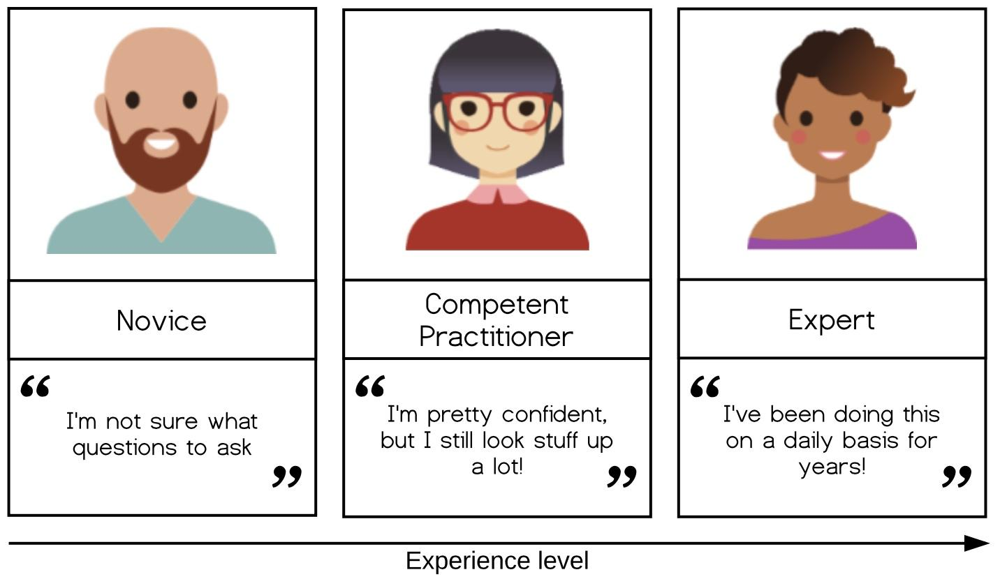

# Introduction
{:.no_toc}

---
> *Learning results from what the student does and thinks and only from what the student does and thinks. The teacher can advance learning only by influencing what the student does to learn*
>
> [H.A. Simon](https://en.wikipedia.org/wiki/Herbert_A._Simon) (one of the founders of the field of [Cognitive Science](https://en.wikipedia.org/wiki/Cognitive_science) and Nobel Laureate)
>
---

This quotation from Herbert A. Simon clearly indicates that we cannot talk about teaching, teaching practices or effective teaching techniques if we don't understand first how people learn.

Here, we want to share with you what we learnt about how learning works. Our knowledge in the field of cognition and learning comes from diving into pedagogical and cognitive research results, reading books such as ["How Learning Works"](https://www.amazon.it/How-Learning-Works-Research-Based-Principles/dp/0470484101) or ["Small Teaching"](http://eu.wiley.com/WileyCDA/WileyTitle/productCd-1118944496.html) and many others, studying research articles published in the field of cognitive science and educational psychology, attending instructor training courses (like this one), and - last but not least - from our own experience as both instructors/teachers, learners, and passionate observers of learning processes and teaching practices.

Since this material cannot cover the broad literature on the subject of learning we strongly invite you to commit to read at least one book on how learning works (for example: ["How Learning Works"](https://www.amazon.it/How-Learning-Works-Research-Based-Principles/dp/0470484101) or ["Small Teaching"](http://eu.wiley.com/WileyCDA/WileyTitle/productCd-1118944496.html)), have a look at the [Software Carpentry Instructor training materials](http://swcarpentry.github.io/instructor-training/) and explore the material available through the [ELIXIR Train-the-Trainer course]().

# Learning outcomes and instructional design

Important for any instructional design and the 1st starting point

## Knowledge, Skills, Abilities (KSAs)

The first step of good instructional design consists in identifying the set of KSAs that learners are expected to acquire by the end of instruction.

## Teaching objectives and Learning Outcomes

> ###  Sources
>
> [Atherton J S (2013) Learning and Teaching; Objectives](http://www.learningandteaching.info/teaching/objectives.htm#ixzz4DtSAL2pi)
- Under Creative Commons License: Attribution Non-Commercial No Derivatives
>
{: .comment}

**Objectives** are statements of what you are setting out to teach, although expressed as if the students were going to learn it. Despite Aims are usually intended to be more general and encompassing than Objectives, they are essential the same.

**Outcomes** (more accurately “desired outcomes”) are statements of what you might (in principle) assess. You may not end up assessing all of them, but they are statements of what a student will know or be able to do, if she or he has learned everything in the course or session.

**See also** the [PDF](docs/Objectives_vs_Outcomes.pdf) document from the [Rensselaer Polytechnic Institute Office of the Provost](http://provost.rpi.edu/institutional-research)

### Learning objectives and learning outcomes

These two terms are often used interchangeably by the community. Even worse, they are often abbreviated by the acronym (LO), thus introducing even more ambiguity. In our opinion there is no need. Objectives (aims or goals) and Outcomes (results) may overlap, but are not genuinely the same.

Furthermore, American educational psychologists tend to use "Learning Objectives" to mean "Learning Outcomes" and "Teaching aims, goals or objectives" to mean "Learning Objectives".

In the attempt of removing ambiguities we will use the term **Teaching Objectives** to mean:

* Objectives describe the goals and intentions of the instructor.
* Objectives, often termed the input in the course, state the purpose and goals of the course.
* Objectives focus on content and skills important within the classroom or programme.
* Objectives may describe what the instructors will do.
* Objectives can often be numerous, specific, and detailed.

And the term **Learning Outcomes** to mean:

* Student Learning Outcomes catalog the overarching "products" of the course and are the evidence that the goals or objectives were achieved.
* Learning Outcomes are statements that describe or list measurable and essential mastered content-knowledge—reflecting skills, competencies, and knowledge that students have achieved and can demonstrate upon successfully completing a course.
* Outcomes express higher-level thinking skills that integrate course content and activities and can be observed as a behavior, skill, or discrete useable knowledge upon completing the
course.
* Outcomes are exactly what assessments are intended to show – specifically what the student will be able to do upon completing the course.
* An assessable outcome can be displayed or observed and evaluated against criteria.
* Outcomes are clear and measurable criteria for guiding the teaching, learning, and assessment process in the course.

Adapted from [http://provost.rpi.edu/learning-assessment/learning-outcomes/objectives-vs-outcomes](http://provost.rpi.edu/learning-assessment/learning-outcomes/objectives-vs-outcomes)

[Operational definitions:](https://irds.stanford.edu/sites/g/files/sbiybj10071/f/clo.pdf)

* Statements expressing which KSAs learners will be able to demonstrate upon completion of a learning experience or a sequence of learning experiences
* What learners will be able to do for the end of instruction and the teacher / instructor can in principle evaluate

Learning outcome:
* Need observable actions to let teacher assess them

### How to write learning outcomes using OBSERVABLE verbs

In order to write learning outcomes, you can use the following scheme:

1. Think about what learners will be able to do by the end of instruction
2. Use the sentences:

    *By the end of the lesson (session/course/instruction) the learner will be able to.........*

    OR

    *The successful learner will be able to......*

3. Replace dots with a verb that you can assess (name, explain, solve, distinguish, etc.).
4. Avoid verbs that are open to many interpretations: appreciate, have faith in, know, learn, understand, believe
5. Keep in mind that learning outcomes can be as specific as you want. You may even think about a different learning outcome for each task you assign to learners.

Identify observable and non observable actions (verbs)

> ###  Identify observable and non observable actions (verbs) - * 3 min*
>
> Here is a list of verbs: Compare, classify, distinguish, explain, believe, give examples of, define, learn, describe, list, recognize, know, connect, measure, identify, have faith in
> * Write in the shared notes which ones describe observable actions
> * Write in the shared notes which ones are instead open to multiple interpretation
>
>   >  Requirements
>   > In classifying verbs, it may help to focus on how you would assess the corresponding action / behaviour.
>   > Example: "identify"
>   > - Q: What would I do to assess whether a learner is able to identify something?
>   > - A: Ask them to do this challenge.
>   {: .tip}
>
> Good example of feedback: We will stress the importance of feedback on last day
{: .hands_on}

### Instruction design in 5 steps

So how can we now use the knowledge we have gathered during this time in the course? Here we will go through the Instructional design in 5 steps and explain why learning outcomes (to articulate and specify these) is so important for the curricula and the course design process.

* Writing LOs
	* Important to build the training
* Selection learning experiences
    * Focus on LOs
* Selection of content relevant to LOs
    * Usually (traditionally) starting by the content
    * But here only 3
* Develop assessment
    * Example: formative assessment as the previous challenge
* Evaluation
    * Evaluation of your training
    * Example
        * Final exams at university
        * Final feedback

# How do people learn?

So let's start with How do people learn and how does learning work

## General definition of learning

(Relatively) permanent changes in behaviour, skills, knowledge, or attitudes resulting from identifiable psychological or social experiences.

* A key feature of learning: permanence
* The change has to last
* Changes do not count as learning if they are temporary
* Example: learning a phone number

Why is it important to learn about how people learn?

* It is common to confuse our effort (i.e. our teaching) with what learners get from our efforts (i.e. their learning)
    * We usually assume learners learnt
    * Nevertheless, the distinction between learning and teaching is especially important for teachers to remember and it is essential that teachers become aware of the fact that the way they think about learning affects the way they teach and that the very circumstances of teaching can influence teachers’ perceptions of learning, and therefore also influence how they teach.
    * For example, imagine that a cognitive scientist convinced you that people don’t retain anything of what you tell them after 20 minutes of passively listening to you. Would you keep lecturing for more than 20 minutes?
    * And how would you teach if, in contrast, you assumed that the mind is a vessel to be filled?
    * Moreover, most teachers tend to think that what is taught is equivalent to what is learned, namely that what they teach is the same as what students understand or retain of what they teach  (even though most of them know that assuming this is a mistake and that teaching and learning can be quite different).
* Learning how learning works helps clarify this distinction
* The way we think about learning affects the way we teach
* Understanding  how people learn makes you a more aware and therefore better teacher
* You  can use such knowledge to improve your day-to-day teaching

## Learning metaphors, theories and models

Learning - similarly to thinking - is a complex process that requires multiple approaches spanning many different disciplines, ideas, theories and models to be understood.

Many learning theories, models, concept and ideas from from the **Science of Learning**, **Educational Psychology**, and the **Cognitive Sciences** are relevant to classrooms, in that they describe at least some of what usually happens there and offer guidance for assisting learning.

This session will provide you with some understanding of how learning works but it is far from being exhaustive. In particular, we will present and discuss learning models, concepts and perspectives that are important for you to know as they suggest things that you might do in your classroom to make learners’ learning more productive and your teaching more effective and mindful.

A metaphor is a word from one thematic domain that has been embedded in another one, thus entering a network of new linguistic relations. This is, indeed, what metaphors are all about: they are transplants from one discourse to another. They are a source of new ways of seeing things. “Metaphors of learning” are a source of new ways of seeing learning.

---
> *A mind is a fire to be kindled, not a vessel to be filled*
>
> Plutard
>
---

We can use metaphors to shape and reveal our way of thinking about learning and, therefore, shape our actions as teachers.

Think about the mind-as-a-vessel-to-be-filled metaphor.

* How the mind-as-a-vessel-to-be-filled metaphor may affect your way of teaching?
* Solution: you are likely to spend your time in the class at the blackboard, trying to ‘transmit’ to the students your own knowledge.

> ###  Challenge- * 5 min*
>
> Think about the following metaphors:
>	* A mind is a fire to be kindled
>	* Teaching is growing a garden
> Write the shared notes how these metaphors may affect your way of teaching
{: .hands_on}

## Metaphors define the role of the teacher and the learners

* Learning is knowledge transfer
    * Teacher: defines, develops and prepares contents
    * Learner: receivers and memorizes
* Learning metaphors
    * Teacher: Prepares the environment, guides the exploration
    * Learner: Explores, works on information, attributes meanings
* Learning is participation in social practices
    * Learner + teacher = Community that shares activities and social practices

# Learning theories

Learning theories describes how students receive, process, and retain knowledge during learning. However, there is no single one theory (as in physics for example). There is a massive catalogue of learning theories out there and there is no universal theory of learning.

Landscape of the best known learning theories available.

There is no universal theory of learning but evidence-based research results supporting some learning principles, which are today accepted and applied

Researchers in the fields of cognitive science and educational psychology have proposed a large number of learning theories: a flavour of the diversity of approaches and philosophies can be gained, for example, from the [HoTEL](http://cmapspublic3.ihmc.us/rid=1LNV3H2J9-HWSVMQ-13LH/Learning%20Theory.cmap) (Holistic approach to Technology-Enhanced Learning) website10. But which should we rely on? Which should we learn, teach and apply?

There is no universal theory of learning… but there are interesting elements for classroom teaching in many different theories

There are no universal theories of learning that, like the laws of physics, describe in a rigorous manner how learning works. There are elements of truth in different theories.

There is no universal theory of learning, but **evidence-based** research results that support learning principles recognized and applied today

In this sense there are interesting elements for a teacher in many different theories.

Existing theories can be grouped according to whether they focus on changes in behavior or in thinking

The distinction is rough and inexact, but a good place to begin. Let’s consider two perspectives about learning, called **behaviorism**, **connectivism** and **constructivism**. This latter can be further divided into **psychological constructivism** and **social constructivism**.

We will briefly describe the key ideas from each of these perspectives and explain how you can use them in your classroom to support learners’ learning.

## Behaviourism

Learning as changes in overt behavior

learning is acquiring new behaviours by conditioning, reflex response to stimuli, reward/punishment / (learning as changes in overt behavior → perspective on learning that focusesfouses on changes in individuals’ observable behaviours)

**Operant conditioning**: a variety of behaviourism that focuses on how the consequences of a behaviour affect the behaviour over time.

It is based on the idea that certain consequences (reinforcement or inhibition of a behaviour) tend to make a behaviour happen more or less frequently.

* learning and behaviour changes are acquired by linking stimuli and responses
* Learner is passive; they learn via external processes, i.e., positive reinforcement.
* Behaviorists look at learning as an aspect of conditioning (looking at the environment of the learner).
* Cognitivism
    * Learning is internal and is the result of a student processing and organising new information (short and long term memory)
    * Educators who embrace cognitive theory believe that the definition of learning as a change in behaviour is too narrow, and study the learner (complexities of the memory) rather than their environment.

## Constructivism

Learning as changes in thinking

How learners actively create (or “construct”) knowledge out of experience

Behaviorist models of learning may be helpful in understanding and influencing what students do, but teachers usually also want to know what students are thinking, and how to enrich what students are thinking. For this goal of teaching, some of the best help comes from constructivism, which is a perspective on learning focused on how students actively create (or "construct") knowledge out of experiences. Constructivist models of learning differ about how much a learner constructs knowledge independently, compared to how much he or she takes cues from people who may be more of an expert and who help the learner’s efforts (Fosnot, 2005; Rockmore, 2005).

* Knowledge is constructed by adapting new information based on previous individual experience
* Learners build on personal experience [internal], active & social in the learning process
* Constructivists believe that a learner's ability to learn relies largely on what they already know and understand, and the acquisition of knowledge should be an individually tailored process of construction.

**Psychological constructivism**: changes in thinking resulting from individual experiences. A person learns by mentally organising and reorganising new information or experiences.

**Social constructivism**: changes in thinking due to assistance from / interaction with others

For convenience these are called psychological constructivism and social constructivism (or sometimes sociocultural theory). As explained in the next section, both focus on individuals’ thinking rather than their behavior, but they have distinctly different implications for teaching.

## The socio-constructivist perspective

Learning is an active process that essentially takes place within an interaction with others and with objects belonging to the culture in which we live (Bruner, Vygotskij, Dewey ......)

> ###  How do you go about learning something new? / How do you approach learning new things? - * 5 min*
>
> Think which is the most effective approach for you to learn?
>	* Read about it
>   * Attend a training session !
>   * Have a go ?
>   * Do, reflect, process, further understand?
> Write in the shared document an approach that works for you when you want to learn something new (from the most to the less effective one)
> Write if you recognise elements of one of more learning perspectives (constructivism / behaviourism)  in your way of learning
> >  Requirements
> > The instructor discusses  what participants have written in the GDoc
> > {: .tip}
{: .hands_on}

## Implications for classroom teaching

Behaviourism / operant conditioning:

* Encourage intrinsic and extrinsic motivation
    * 1st thing we will do as teacher
    * Intrinsic: the reinforcement for a behaviour is the the behaviour itself
        * Positive input come from the action
        * Example: reading reinforced by the enjoyment of reading
    * Extrinsic: the reinforcement comes from an external reward
        * Come from teachers, family, friends, etc
        * Example: praise
* Formative assessment
    * Or formative feedback
    * Type of assessment done all the time
    * Adn giving feedback
        * Showing answers
        * Comment answers
    * Feedback: form of inputs which

Constructivism: 4 learning frameworks and models

1. Bloom’s taxonomy
2. Working memory and long term memory
3. Mental models
4. Dreyfuss model for skills acquisition

## The Bloom’s 6 categories of cognitive skills

And one of the most used "models" or concepts is the one based on the Bloom’s six categories of cognitive skills.

Tool important to develop training, but not only

**Bloom's taxonomy** is a set of six categories of cognitive skills

Αctionable verbs that are accompanied with each level of the hierarchy.

Hierarchy because need to go from bottom to top

* **Remembering (original Knowledge):** involves recognizing or remembering facts, terms, basic concepts, or answers without necessarily understanding what they mean.
* **Understand (original comprehension):** involves demonstrating an understanding of facts and ideas by organizing, summarizing, translating, generalizing, giving descriptions, and stating the main ideas.
* **Apply/Application:** involves using acquired knowledge—solving problems in new situations by applying acquired knowledge, facts, techniques and rules. Learners should be able to use prior knowledge to solve problems, identify connections and relationships and how they apply in new situations.
* **Analyze:** involves examining and breaking information into component parts, determining how the parts relate to one another, identifying motives or causes, making inferences, and finding evidence to support generalizations.
* **Evaluate:** involves presenting and defending opinions by making judgments about information, the validity of ideas, or quality of work based on a set of criteria
* **Create (original synthesize): **involves building a structure or pattern from diverse elements; it also refers to the act of putting parts together to form a whole.

Analyze / Evaluate / Create : critical thinking

Blooms taxonomy levels are very useful to align instruction with learners' level of complexity of thinking as well as experience.

How to use this tool?

* Help learner to structure their knowledge
* Knowing at which level of cognitive complexity you want to teach
* write Learning Outcomes
* design instruction and learning experiences i.e. how you are to teach/train, which infrastructure and how to present the materials etc
* assess learning (taking place during curricula or course and after)

We can use Bloom’s taxonomy to align instruction with learners' level of complexity of thinking as well as experience.

Connection of set of verbs to the different levels to help writing LOs and assessing

# Working memory, long term memory and learning

From cognitive science, quite involved in constructivism

")

1. Environment
2. Working memory
3. Long-term memory
4. Working memory: fast
	* Ex: phone number
5. Long term: slow
	* How much effort to remember a full poem

How it works?

> ###  How short is your short term memory? - * 10 min*
>
> Challenge (from Willingham, 2009)
>
> 1. Read the following letter combination
>
>    
>
> 2. Hide them after 10 secondes
> 3. Take a piece of paper
> 4. Write how many consecutive letters you can remember
> 5. Unhide them after 2 minutes
> 6. Thnik how can we take advantage of this model?
> 7. Now read the following letter combination
>
>    
>
> 8. Hide them after 2 minutes
> 9. Take a piece of paper
> 10. Write how many consecutive letters you can remember
> 11. Unhide them after 2 minutes
>
> The amount of space in working memory does not depend on the number of letters.
> It depends on the **number of meaningful objects**.
{: .hands_on}

Round #2: meaning of the words (long-term memory) helps to remember. It make room in working memory

To facilitate learning, we have to make room in working memory

Connecting words with a story would help to remember

## What can we do to make room in working memory?

> ###  How can you avoid to overload learners working memory?  - * 5 min - Groups of 2/3 persons*
>
> * Discuss one thing a teacher could do to avoid overloading their students' working memory.
> * Write your proposal in the shared notes
{: .hands_on}

## What can we do to make room in working memory?

* Chunking
    * Example: Short theoretical sessions alternated with practical sessions to allow the processing of the material
* Avoid extraneous cognitive load
    * Example: Avoid too crowded slides

## Cognitive load

3 cognitive loads recognize by cognitive science

* **Intrinsic cognitive load**: effort associated with a specific topic.
* **Germane cognitive load**: the (desirable) mental effort required to create linkages between new information and old.
* **Extraneous cognitive load:** everything else that distracts or gets in the way
    * Refers to the way information or tasks are presented to a learner.

## Attention split effect

Split-attention occurs when learners are required to split their attention between at least two sources of information that have been separated either spatially or temporally

> ###  Extraneous cognitive load - * 10 min - Groups of 2/3 persons*
>
> * Think of the tasks you teach in your lessons/courses
> * Pick one
> *  Think about the following questions and discuss within the room
>     * What would be the extraneous load in performing this tak?
>     * How can you avoid it?
> * Write here any insights/thoughts/comments to share from your breakout room
{: .hands_on}

# Mental models and Novice vs Competent Practitioner vs Expert

## Mental models

**Mental model** is a collection of concepts and facts, along with the relationships between those concepts, that a person has about a topic or field.

It is how people organize their knowledge

You can think of a graph with nodes (facts, concepts) and edges (connections)

 model of DNA")

### Dreyfuss model

The Dreyfus model of skills acquisition by brothers Stuart and Huber Dreyfus uses a 5 stage from novice to expert.

The stages follow a progression from rigid adherence (novice) to rules to an intuitive mode of reasoning based on tacit knowledge "silent knowledge" (expert).

The fundamental idea is that when teaching a concept, you have to tailor the style of teaching to where the learner is in their understanding and that progression follows a common pattern.

Early stages of learning focus on concrete steps to imitate, the focus then shifts to understanding principles and finally into self-directed innovation.

The skill level is tied to a mental function transitioning from recollection (non-situational or situational), recognition (decomposed or holistic), decision (analytical or intuitive), and awareness (monitoring or absorbed)

### The Carpentries

Carpentries was started by Greg Wilson and Brent Gorda and they coined the term "The Carpentries" for enabling researchers to do "computational thinking" and use tools of computation effectively.

The Style of the Carpentries are that teachers are where the learners are e.g. by doing live-coding together.

* **Novice**: someone who doesn’t even know what questions to ask.
* **Competent practitioner**: someone who has enough understanding for everyday purposes
    * They won’t know all the details of how something works and their understanding may not be entirely accurate, but it is sufficient for completing normal tasks with normal effort under normal circumstances.
* **Expert**: someone who can easily handle situations that are out of the ordinary.

### Novice vs Competent Practitioner vs Expert

* A **novice**, typically has not yet built a mental model of the field.
* A **competent practitioner **has a mental model that works for many purposes, but will not be very accurate.
* **Experts’** mental models are much more densely connected. Therefore they can jump directly from a problem to its solution because there is a direct link between the two in their mind

## How can we take advantage of these models?

* It is not only a matter of knowledge (concepts and facts)
* Help novices build a mental model
* When a mental model exists, a good teacher will
    * Verify it is correct and remediate any misconception
    * If it is a good model, it must be augmented with new facts and new connections
* Help learners make connections
* Be aware of the limitations of expertise (expert blind spot)

## 3 main classes of misconceptions

* **Simple factual errors**: These are the easiest to correct.
* **Broken models**: We can address these by having learners reason through examples to see contradictions.
* **Fundamental beliefs**: These beliefs are deeply connected to the learner’s social identity and are the hardest to change.

## An overview so far

> |  Model  | How it can support learning |
> | ----- |--------------------|
> | Bloom’s Taxonomy | Learning outcomes, instructional design, assessment |
> | Working memory | Make room in the working memory (chunking and extraneous cognitive load)    |
> | Mental model | Help learners to build and enrich them    |
> | Dreyfuss model for skill acquisition | Differences between novices and experts. Expert blind spot    |
{: .matrix}

There is no universal theory of learning, but **evidence-based** research results that support learning principles recognized and applied today

(_**Evidence-based**_: an approach that emphasizes the practical applications of the results of the best research available at the moment)

# Evidence-based research on learning

## Resources to learn more about how learning works

There is a great deal of literature on how learning works.

The reason why we mention these three books is that they show how to integrate effective, research based strategies for learning into classroom practice.

Educational practice usually does not rely on research findings. People tend to rely on their intuitions about what’s best for learning. But relying on intuition may be a bad idea for teachers and learners alike.

* _[How Learning works, Ambrose et al, 2010](https://www.academia.edu/6743627/How_Learning_Works_Seven_Research_Based_Principles_for_Smart_Teaching_Susan_A_Ambrose_Michael_W_Bridges_Michele_DiPietro_Marsha_C_Lovett_Marie_K_Norman_with_a_Foreword_by_Richard_E_Mayer)_
    * Presents a set of evidence-based principles for how to help people learn that is grounded in cognitive theory (that is, the science of instruction). T
    * his book tries to help teachers understand how research in the science of learning can improve their reaching.
    * The book is organised around seven learning principles.
    * Each principle is based on research evidence from the science of learning and the science of instruction.
* _Small teaching_, Lang, 2011
    * Cognitive psychologists, neuroscientists, and biologists all have produced a revealing body of research over the past several decades on how human beings learn, but often translating these findings into the classroom is overwhelming for busy instructors.
    * Small Teaching bridges the gap between research and practice  by providing a fully developed strategy for making deliberate, structured, and incremental steps towards tuning into how students are hardwired to learn.
    * The book introduces small activities that require minimal preparation and grading.
    * The models presented are specifically designed to be used as both one-time experiences to innovate a course session or unit plan as well as a menu of options that can be combined into an entirely new teaching approach.
* _Understanding how we learn_, Weinstein & Sumeracki,  2018
    * By the “learning scientists” Weinstein and Sumeracki (and illustrated by Oliver Caviglioli)
    * Examination of cognitive psychology’s application to education
    * It is designed to convey the concepts of research to the reality of an instructor’s classroom.
    * The book proposes 6 strategies for effective learning (based on evidence from cognitive research).  It is structured in four parts:
        * Evidence-based education and the science of learning
        * Basics of human cognitive processes
        * Strategies for effective learning
        * Tips for students, teachers, and parents
* [Carpentries Instructor Training materials](https://carpentries.github.io/instructor-training/)
    * We also rely on the Carpentries Instructor Training materials.
    * The Carpentries is a community of volunteers teaching computational and data management skills worldwide.
    * The community also developed training materials to teach pedagogical skills.
    * Much of the GTN Ttt was inspired by the pedagogical materials from the Carpentries and the ELIXIR TtT.

> ###  What is learning in your opinion/experience? How does learning occur? - * 5 min*
>
> _Break-out_ room (2 ppl per room)
>
> We follow the first challenge with another one. Now IN PAIRS in breakout rooms (Zoom). Here the reflection is on LEARNING and what learning is in your experience. Write your thoughts, one or more sentences, in the shared Google Doc.
> 	* Discuss your reflections on learning and what learning is in your experience
>	* Write here any insights/thoughts/comments to share from your breakout room
{: .hands_on}

Some theories /  models are good tools to explain concepts, but they should be taken with a grain of salt.

Some models have never been broken - whereas some have been broken (e.g. learning styles) and some can be very helpful tools for instructors and learners.

One example is the Bloom’s Taxonomy that can be a great model to refer to when we write learning outcomes.

We will make a couple of examples from cognitivism.

The idea is that we should be very flexible as for learning theories, and rather **focus on evidence-based research results**. Research results described in the books mentioned above support a number of l**earning principles and strategies** that can be easily translated into classroom effective practice.

Our learning model is based on such evidence-based learning principles and strategies

## 6 strategies for effective learning

**Six strategies for effective learning** based on evidence from cognitive research:

Extracted from _Understanding how we learn_, Weinstein & Sumeracki,  2018

* **Spaced practice** - Spread study activities out over time (no cramming)
* **Interleaving** - Switching between topics while studying
* **Elaboration** - Asking and explaining why and how things work
* **Concrete examples** - When studying / explaining abstract concepts, illustrating them with specific examples
* **Dual coding** - Combining worlds with visuals
* **Retrieval practice** - Bringing learned information to mind from long term memory

Six Strategies for Effective Learning by [Yana Weinstein, Megan Smith, & Oliver Caviglioli](http://www.learningscientists.org/downloadable-materials/) /
[Creative Commons Attribution-NonCommercial-NoDerivatives 4.0 International License](http://creativecommons.org/licenses/by-nc-nd/4.0/), based on a work at[http://www.learningscientists.org](http://www.learningscientists.org/), [teachinghow2s.com/cogsci](http://teachinghow2s.com/cogsci).

The materials, which are both a book and a website and blog all which are highly recommended, are intended to teach about principles of learning and to provide teachers and students with flexible guiding principles to guide learning and studying.

There are good examples for all 6 strategies on the website and the blog.

* **Concrete example:** The idea is to take an abstract concept and use real world examples to increase understanding and 2 examples are better than 1.
* **Spacing:** Spaced practice is the exact opposite of cramming. When you cram, you study for a long, intense period of time close to an exam. When you space your learning, you take that same amount of study time, and spread it out across a much longer period of time. Doing it this way, that same amount of study time will produce more _long-lasting learning._
* **Interleaving:** You shouldn’t study one idea, topic, or type of problem for too long. Instead, you should change it up often. Especially good for problem-solving topics like bioinformatics. Then you should jump from one topic to another and go back to the previous one, with the aim of developing the connections among topics.
* **Elaboration:** can be used to mean a lot of different things. It involves explaining and describing ideas with many details. Elaboration also involves making connections among ideas you are trying to learn and connecting the material to your own experiences, memories, and day-to-day life.
* **Dual coding: **Dual coding is combining words and visuals such as pictures, diagrams, graphic organizers, and so on. The idea is to provide two different representations of the information, both visual and verbal. Adding visuals to a verbal description can make the presented ideas more concrete, and provides two ways of understanding the presented ideas. The visuals should be meaningful.
* **Retrieval practice:** concept maps are examples of a retrieval practice when you bring out knowledge/memories from long-term memory

We will see in session 3 a number of teaching practices. You should try to reconnect them to these learning strategies, i.e. try to understand how the proposed teaching practices facilitate learning based on these six strategies.

> ###  How do you understand the 6 strategies for effective learning? - * 15 min - Groups of 2 persons*
>
> We follow the first challenge with another one. Now IN PAIRS in breakout rooms (Zoom). Here the reflection is on LEARNING and what learning is in your experience. Write your thoughts, one or more sentences, in the shared Google Doc.
>	* Discuss the learning strategy: did you understand it the same way? Do you have any questions?
>	* Find out an example on how you would implement it as a teacher/instructor (what would you do as a teacher in order to facilitate learning based on the strategy at hand)
>	* Write here any insights/thoughts/comments to share from your breakout room
{: .hands_on}

## 7 evidence-based learning principles

Extracted from _[How Learning works, Ambrose et al, 2010](https://www.academia.edu/6743627/How_Learning_Works_Seven_Research_Based_Principles_for_Smart_Teaching_Susan_A_Ambrose_Michael_W_Bridges_Michele_DiPietro_Marsha_C_Lovett_Marie_K_Norman_with_a_Foreword_by_Richard_E_Mayer)_

* **Principle P1: **Students' **prior knowledge** can help or hinder learning.
    * Hindrances include prior knowledge which may be accurate but insufficient to support learning new material
    * Inappropriate for the specific class, thus distorting comprehension of new material; or, completely inaccurate.
* **Principle P2: **How students **organise knowledge** influences how they learn and apply what they know.
    * Generally, people organize knowledge “as a function of their experience, the nature of their knowledge, and the role that that knowledge plays in their lives”
* **Principle P3: **Students **motivation** determines, directs and sustains what they do learn.
    * Ambrose et. al define motivation as “the personal investment that an individual has in reaching a desired state or outcome” and identify three core concepts for understanding motivation
        * the subjective value of a goal
        * the expectancies for successfully reaching the goal
        * ??
* **Principle P4: **To develop mastery, students must acquire **component skills**, practice **integrating** them, and  know when to **apply** what they have learned
    * Mastery refers to “the attainment of a high degree of competence with a particular area”
    * Could be either beneficial or detrimental.
* **Principle P5: Goal-directed** practice coupled with **targeted feedback** enhances the quality of students' learning
    * Learning and performance are advanced when students employ a methodology that
        * focuses on a specific performance goal
        * pinpoints a suitable level of challenge relative to students’ current performance,
        * is in an amount and frequency sufficient to meet the performance criteria.
* **Principle P6: **Students' current level of development interacts with the **social, emotional, and intellectual climate** of the course to impact learning
    * Ambrose et. al maintain that “student-centered teaching requires us to teach students, not content”.
* **Principle P7: **To become self-directed learners, students must learn to **monitor and adjust **their approaches to learning.
    * This principle relates to metacognition, or “the process of reflecting on and directing one’s own thinking”.
    * Students develop metacognitive skills by learning to
        * assess the task at hand,
        * evaluate their own strengths and weaknesses,
        * plan appropriate approaches to complete the task,
        * apply strategies to monitor their performance, while making adjustments to the selected approach.

> ###  How do you understand the 7 principles of learning?  (15 min - Groups of 2/3 persons)
>
> * Read and reflect together the principles
> * Pick one principle that is not (fully) clear to you
> * Ask one question about this principle
> * Write here any insights/thoughts/comments to share from your breakout room
{: .hands_on}

# Teaching or training?

> ###  Based on your experience, what are the differences between teaching and training?  - * 5 min*
>
> Identify and write 2 main differences between Teaching and training
{: .hands_on}

Cartoon from the [Open Science Training Handbook](https://www.fosteropenscience.eu/content/open-science-training-handbook)

Teaching is more theoretical and abstract, while training (when done well) is more hands-on and practical.

Teaching seeks to impart knowledge and provide information, while training is intended to develop abilities.

* **Teach**: to provide knowledge, instruction or information
* **Train**: to develop abilities through practice with instruction or supervision

For example, it is possible to teach someone about buoyancy, fluid dynamics, water displacement and coastline safety, but that knowledge will not make them a good swimmer. Specific, practical and applied training is necessary to use abstract knowledge to learn or master a skill. In many cases, teaching and training are complementary. Vocational training programs often combine teaching and training quite nicely.

## How does learning progress?

After going through the theory of learning with the 6 strategies and the Ambrose 7 principles as well as the differences between teaching and training we now should learn -  How learning progresses. This is important to know as if you are a teacher or trainer either for a longer curriculum developmental trajectory or a short-format course designer as you would like to follow your students / participants' learning.

We can use Bloom's taxonomy to **align instruction with learners' levels of complexity of thinking** (and experience).

In practice, you can use the Bloom’s levels of cognitive complexity (and the [accompanied actionable verbs in the previous link](https://tips.uark.edu/blooms-taxonomy-verb-chart/)) to:
* write Learning Outcomes
* design instruction and learning experiences i.e. how you are to teach/train, which infrastructure and how to present the materials etc
* assess learning (taking place during curricula or course and after)

](images/image3.jpg "[Via et al, Course design: Considerations for trainers – a Professional Guide, 2020](https://f1000research.com/documents/9-1377)")

By simplified I mean that here you only see the arrows going from one box to the following in line. However, usually we need to revise and go back one or several boxes if we have failed to specify or articulated Learning outcomes from the beginning. This is what we mean by Learning Outcomes drives the whole process.

The first step of good instructional design consists in identifying the set of KSAs (Knowledge, Skills, Abilities) that successful learners will acquire by the end of instruction.

> ###  How do I write LOs? - * 5 min*
>
> * Think of a lesson/session you usually deliver
> * Write one Learning Outcome for the lesson/session
{: .hands_on}

# Conclusion

What facilitates learning?

* It is not only a matter of knowledge
* Help novices build a mental model
* Help learners make connections
* Be aware of the limitations of expertise
    * expert blind spot
    * fluid representations
* Detect and remediate misconceptions
