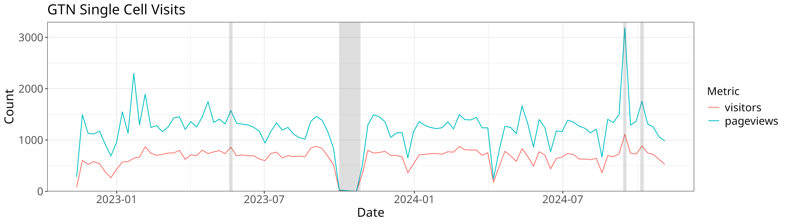

We'll use some ggplot and tidyverse code to plot the data we collected in part 1

> <agenda-title></agenda-title>
>
> In this tutorial, we will cover:
>
> 1. TOC
> {:toc}
>
{: .agenda}


We'll use tidyverse (which includes things like magrittr (`%>%`) and ggplot2) to load our data. Reshape2 provides the cast/melt functions which can be used to reshape specific datasets into formats that are easier to plot.

```R
library(tidyverse)
library(reshape2)
# This path will probably need to be changed depending on where you downloaded that dataset.
data = read_tsv("sc.tsv")
```

## Data Cleaning

Let's start by cleaning our data a bit. We've got a couple problems with it:

- there might be some null mergedAt dates, we'll want to remove those
- we probably want to ignore a couple of classes of datasets that were added/removed (images, and the explicit 'ignore' type.)

```R
clean = data %>% 
	select(num, class, additions, deletions, mergedAt) %>% 
	filter(!is.na(mergedAt)) %>% 
	group_by(num, class, mergedAt, month=floor_date(mergedAt, 'month'), quarter=floor_date(mergedAt, 'quarter')) %>% 
	summarise(additions=sum(additions), deletions=-sum(deletions)) %>%
	filter(class != "ignore") %>%
	filter(class != "image") %>%
	arrange(mergedAt) %>%
	as_tibble()
```

We'll setup a 'theme' for our plot that mainly consists of using the black and white theme which is quite elegant and readable, and then making some font sizes a wee bit larger:

```R
theme = theme_bw() + theme(
  axis.text=element_text(size=14), 
  plot.title=element_text(size=18), 
  axis.title=element_text(size=16),
  legend.title=element_text(size=14),
  legend.text=element_text(size=14))
```

We want all of our plots to look the same which is why we use this trick, it helps us keep a consistent aesthetic without having to re-type the configuration every single time.

Let's get to plotting!

## Plot: Lines added/removed by date/time period

We have a dataset that looks like:

```R
clean %>% head(10)
```

We'll want to plot the changes versus the time (either quarter or month), and
then maybe plot them differently based on the class of the addition/removal. So that translates into an aesthetics statement like `aes(x=time, y=additions, fill=class)`

In ggplot2 you can plot data some different ways, if you provide the datasets upfront, e.g. `data %>% ggplot()` you'll generally do something like `data %>% ggplot(aes(x=a, y=b)) + geom_something()` and `geom_something` will take the data from the ggplot call. However if you want to plot multiple series, you can also provide the data directly to the `geom_*` functions like so:

```R
ggplot() +
  geom_col(data=clean, aes(x=quarter, y=additions, fill=class)) +
  geom_col(data=clean, aes(x=quarter, y=deletions, fill=class)) + scale_fill_brewer(palette = "Paired") +
  geom_point(data=clean, aes(x=mergedAt, y=0), shape=3, alpha=0.3, color="black") +
  theme +
  xlab("Quarter") + ylab("Lines added or removed") + guides(fill=guide_legend(title="Category")) +
  ggtitle("Lines added or removed by file type across GTN Single Cell Learning Materials")
ggsave("sc-lines-by-quarter.png", width=12, height=5)

ggplot() +
  geom_col(data=clean, aes(x=month, y=additions, fill=class)) + 
  geom_col(data=clean, aes(x=month, y=deletions, fill=class)) + scale_fill_brewer(palette = "Paired") +
  theme +
  geom_point(data=clean, aes(x=mergedAt, y=0), shape=3, alpha=0.3, color="black") +
  xlab("Month") + ylab("Lines added or removed") + guides(fill=guide_legend(title="Category")) +
  ggtitle("Lines added or removed by file type across GTN Single Cell Learning Materials") 
ggsave("sc-lines-by-month.png", width=12, height=5)
```


In this case we plotted the data for additions and deletions separately, and we additionally added points based on the actual date of the PRs to visualise their density.


Let's produce @gtn:nomadscientist's favourite running sum plots in addition. We'll start by reshaping our data. Currently we have data that looks like:

time | variable | value
-- | --- | ---
today | measure1 | 1
today | measure2 | 10
yesterday | measure1 | 30
yesterday | measure2 | 5

And we'll re-shape this to look like this, which will make it easier to calculate changes over the course of a specific series:

time | measure1 | measure2
--- | --- | ---
today | 1 | 10
yesterday | 30 | 5


We'll use the `dcast` function to do that:

```
clean %>% select(month, class, additions)  %>% dcast(month ~ class, value.var="additions") %>% head()
```

That doesn't look quite right so, let's change how the data is aggregated:

```R
# cumulative
clean %>% select(month, class, additions)  %>% dcast(month ~ class, value.var="additions", fun.aggregate = sum)
```

Let's do it for real now:

```R
cumulative = clean %>% select(month, class, additions)  %>% 
  dcast(month ~ class, value.var="additions", fun.aggregate = sum) %>%
  mutate(across(bibliography:workflows, cumsum)) %>% 
  reshape2::melt(id.var="month")

cumulative %>% ggplot(aes(x=month, y=value, color=variable)) + geom_line() + 
  theme_bw() + theme +
  xlab("Month") + ylab("Lines added") + guides(color=guide_legend(title="Category")) +
  ggtitle("Cumulative lines added by category, across GTN Single Cell materials")
ggsave("sc-lines-cumulative.png", width=12, height=8)
```


## Contributions over time

Let's again start with some cleaning, namely removing all rows with 0 records, and removing future records (at the time of writing.)

```R
roles = read_tsv("sc-roles.tsv")
w = roles %>% 
  filter(count != 0) %>% 
  filter(!grepl("2025", date)) %>%
  filter(!grepl("2024-12-01", date))

w %>% 
  ggplot(aes(x=date, y=count, color=area)) + 
  theme +
  xlab("Date") + ylab("Unique Contributors") + guides(color=guide_legend(title="Contribution Area")) +
  ggtitle("Contributors over time to GTN Single Cell Materials") +
  geom_line()
ggsave("sc-contribs.png", width=12, height=6)
```


## New X over Time

Let's plot all of the new single cell things added over time, all the new FAQs, Tutorials, Slides, Etc:

```R
added_by_time = read_tsv("single-cell-over-time.tsv")
added_by_time %>% dcast(date ~ `type`) %>% 
  arrange(date) %>% 
  mutate(across(event:workflow, cumsum)) %>% 
  melt(id.var="date") %>% 
  as_tibble() %>% arrange(date) %>% 
  ggplot(aes(x=date, y=value, color=variable)) + geom_line() + 
  theme_bw() + theme +
  xlab("Date") + ylab("New Single Cell Items") + guides(color=guide_legend(title="Contribution Type")) +
  ggtitle("New Single Cell events, FAQs, news, slides, tutorials, videos and workflows in the GTN")
ggsave("sc-files-cumulative.png", width=6, height=6)
```

We may also want to know how many changes there have been since the start date of this study, e.g. October 1st, 2020:

```R
since_oct = added_by_time %>% dcast(date ~ `type`) %>% 
  arrange(date) %>% 
  mutate(across(event:workflow, cumsum)) %>% 
  filter(date > as.Date("2020-10-01"))

# Pull out the first/last date as our start ane dnwend
start_date = (since_oct %>% head(n=1))$date
end_date = (since_oct %>% tail(n=1))$date

# Table of our changes.
since_oct %>% 
  filter(date == start_date | date == end_date) %>%  # Just those rows
  mutate(date = case_when(date == start_date ~ 'start', date == end_date ~ 'end')) %>% # Relabel the start/end as literal string start and end
  pivot_longer(-date) %>% pivot_wider(names_from=date, values_from=value) %>% # Transpose the data
  mutate(increase=end - start) %>% # And calculate our increase
  select(name, increase) %>% arrange(-increase)
```

## Pageviews

GTN uses the Galaxy Europe Plausible server for collecting metrics (you can change your preferences in [your GTN privacy preferences]()).
We can download the data from the server and plot it, filtering by our preferred start/end dates and filters (namely that page includes `/topics/single-cell/`).
Unfortunately the data is downloaded as a zip file which we'll then need to extract data from:

```R
system("wget 'https://plausible.galaxyproject.eu/training.galaxyproject.org/export?period=custom&date=2024-11-07&from=2022-08-01&to=2024-11-07&filters=%7B%22page%22%3A%22~%2Ftopics%2Fsingle-cell%2F%22%7D&with_imported=true&interval=date' -O sc-stats.zip")
```

We can use the unzip function to read a single file directly from the zip:

```R
views = read_csv(unzip("sc-stats.zip", "visitors.csv"))
```

With that we're ready to plot. We're going to use a new feature for our plot,
`annotate`. Annotation allows you to draw arbitrary features atop your plot, in
this case we're going to draw rectangles to indicate outages and events that
might have affected our data.

```R
y = 3300
xoff = 3
views %>% group_by(date=floor_date(date, 'week')) %>% 
  summarise(date, visitors=sum(visitors), pageviews=sum(pageviews)) %>% 
  filter(visitors != 0 | pageviews != 0) %>%
  melt(id.var="date")  %>% 
  ggplot(aes(x=date, y=value, color=variable)) + geom_line() + 
  annotate("rect", xmin = as.Date("2023-10-01"), xmax = as.Date("2023-10-27"), ymin = 0, ymax = y,  alpha = .2) + # Outage
  annotate("rect", xmin = as.Date("2023-05-22") - xoff, xmax = as.Date("2023-05-26") - xoff, ymin = 0, ymax = y,  alpha = .2) + # Smorg3
  annotate("rect", xmin = as.Date("2024-10-07") - xoff, xmax = as.Date("2024-10-11") - xoff, ymin = 0, ymax = y,  alpha = .2) + # GTA
  annotate("rect", xmin = as.Date("2024-09-16") - xoff, xmax = as.Date("2024-09-20") - xoff, ymin = 0, ymax = y,  alpha = .2) + # Bootcamp
  theme_bw() + theme +
  scale_y_continuous(expand = c(0, 0), limits = c(0, NA)) +
  xlab("Date") + ylab("Count") + guides(color=guide_legend(title="Metric")) +
  ggtitle("GTN Single Cell Visits")
ggsave("sc-pageviews.png", width=14, height=4)
```

for our lovely pageview plot!


