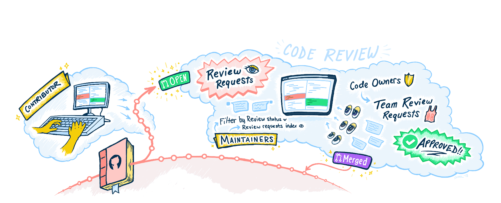
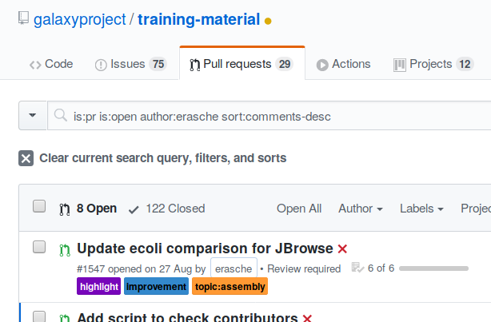
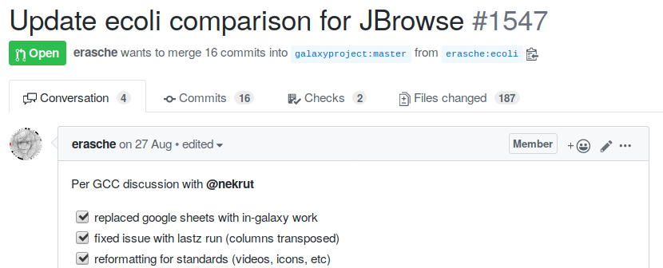
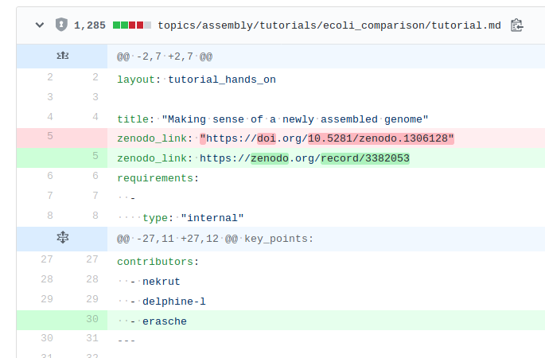
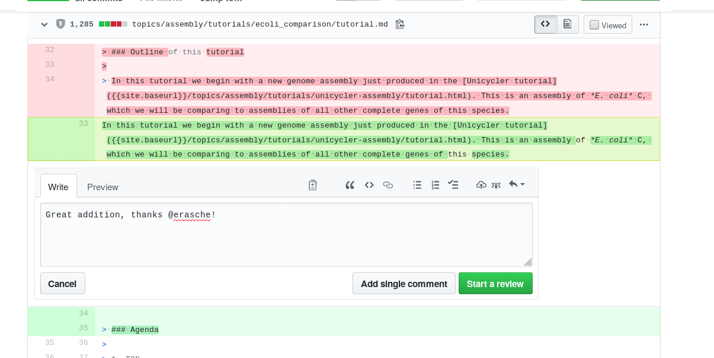
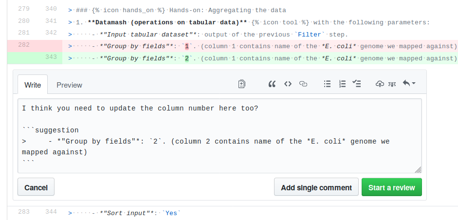
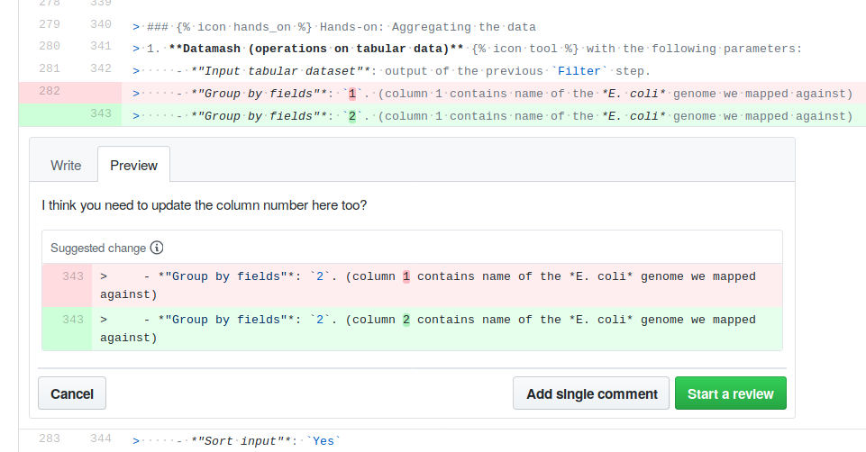
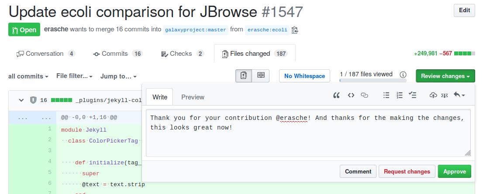

# Introduction
{:.no_toc}

First of all, ***thank you!*** for contributing! Reviewing is a very important part of keeping the GTN training materials of high quality. We greatly appreciate any help with this! Whether you just report one typo, or test an enitire tutorial start to finish, any review--big or small--is extremely useful.


> ### Agenda
>
> In this tutorial, we will cover:
>
> 1. TOC
> {:toc}
>
{: .agenda}

Reviewing is usually an iterative process, contributors suggest changes, reviewers make comments and request changes, the contributors discuss with the reviewer(s), implement changes, and then another round of review may be made. When both reviewer and tutorial contributor are happy with the final product, the changes are ready to be *merged*, and the changes will become available on the training website.




# GitHub Pull Requests (PRs)

Whenever somebody in the community wants to make a change to the training materials, they propose their changes by making a *pull request* (PR) to the [GTN GitHub repository](https://github.com/{{ site.repository }}).

You can view the currently open PRs under the [*Pull requests* tab](https://github.com/{{ site.repository }}/pulls?q=is%3Apr+is%3Aopen+sort%3Aupdated-desc) of the GitHub repository:

{: .width="75%"}

Some of these will be small PRs, e.g. fixing a typo or link, while others might be more substantial, for example adding a completely new tutorial or topic.

## Viewing changes in GitHub

More information about the pull request, and any discussion about it, can be found by clicking on the PR in the list:

{: width="75%"}


To view the changes included in a PR, click on the pull request in the list, and go to the `files changed` tab near the top of the screen

{: width="75%"}


Here you will find a list of all the files that were changed, and what those changes were, we call this a *diff*. The red lines show the old version of the file content, and the green lines show the proposed version.

You can now look through the changes to review them. For larger changes, looking at the diff may not be sufficient, and you may prefer to look at a preview of the website with the proposed changes in the PR. We will see how to do this in a later section.


# Adding your Review

After looking at the changes, you can add your review in the GitHub interface. You can either approve the changes, add comments requesting further changes, asking a question or giving a compliment to the PR creator(s).

## Commenting on Changes
If you have a question, suggestion, or compliment about a certain change, you can add a comment to a specific line of the diff, by moving your mouse over the line you want to comment on, and clicking on the plus icon that appears at the start of the line. A comment box will now open below this line, where you can type your message:



#### Single Comment vs Review
If you just have a single comment on the diff, you can click on the button labeled `Add Single Comment` to post it immediately. If you plan a more thorough review, multiple comments can be bundled together by pressing the 'Start a review' button. The comment will not be published yet, but you will get a chance to add more comments on other lines, before publishing your entire review once you are ready.

#### In-line Code Suggestions
For minor edits, you can also apply the change you are suggesting, directly within the GitHub. This acts like a mini-PR that can be accepted by the person who opened the PR or any of the project's maintainers and will be added to the main PR.

To add an in-line suggestion:

1. Start a **comment** on the relevant line
2. Click on the **Insert Suggestion** icon 
3. A code block is added in the comment box, containing the original line.
4. Change this line with your suggested edit. You can also add some explanation before or after the suggestion:
   
5. You can preview the suggestion in the preview tab. You will see another diff:
   
6. Post your suggestion! (or add it to your current review)


## Approving the PR
When you think a PR is ready to merge, you can approve it via the GitHub interface. At the top of the *Files Changed* tab of the PR, you will find a green button labelled **Review changes**. If you click on this, you can write a message and choose to approve the changes (or not). Multiple different reviewers may add their review in this way.



## Merging a PR
If you are a topic maintainer, checks have passed, and you are happy with the changes, you can merge the PR to update the tutorial on the live website using the **Merge Pull Request** button at the bottom of the PR page.


## Tips and Tricks
Below are a few tips and tricks for reviewing. Have a tip to add here? open a PR!

- Be kind, people have worked hard on their tutorial, acknowledge that, highlight some things you like about the tutorial as well as the things you think should be changed.

- New contributors may not know *how* to implement your requested changes, offer to help them if you think they may appreciate it.

- If there are a lot of changes that need to be made, start with a few of the most important ones, the rest can be addressed in a later round of review.


# Evaluating a Tutorial

The previous section focused on how to add reviews using the GitHub interface. In this section, we will focus on how to evaluate the quality of the tutorial itself.

The best way to review a tutorial, is to put yourself in the shoes of a learner, and test it out yourself. Upload the data to Galaxy, perform all the steps described in the tutorial. Did everything work? Could you answer all the questions? Do certain steps in the analysis require more explanation for beginners?

TODO: link to how to make good lessons?

This can be rather time consuming, but if you are able, this is a very good test of a tutorial's quality. Not an expert in the topic? Even better! Because neither are the learners this tutorial is intended for, and [experts often have a blind spot](TODO), and non-experts can identify more easily where more explanation is required for novices.

If you have less time, just reading through the tutorial is also a good place to start an can reveal areas of improvement. If a workflow is included in the tutorial, this can be uploaded to a supported Galaxy instance and run to check if all the steps work as expected.


## Previewing the tutorial

It is always a good idea to view the built version of the website for more substantial PRs, there are two ways to do this:

### Locally

First you will need to checkout the PR branch with git. The easiest way to do this is by installing [hub](TODO). Then you can easily checkout the code for the PR using

```bash
hub pr checkout 1547
```

Replace `1547` with the number of the PR (can be found after the title)

Serve the jekyll website using `make serve`. Full instruction for previewing the website locally can be found in [this tutorial](TODO)

### On Heroku

If you cannot run a local preview, you may be able to use the [Heroku](TODO) preview. This is automatically built for some PRs. For PRs from forks or PRs older than a couple days, the heroku build may need to be manually (re)started, ask in the [Gitter channel] if you would like us to do this for you.

TODO: how to view via heroku

# Review Checklist

Below is a list of common things to look for when reviewing, this list is just a guide, and definitely incomplete, but it may help you during your review:


**Content**
- Are the tutorial Objectives, question and key messages present?
  - Do they match the tutorial content?
  - Is anything missing?
- Is there a good introduction to the tutorial?
  - Description of what we will do in the tutorial and why.
  - Description the data that will be used.
  - Sufficient biological background
- Is there enough explanation throughout the tutorial
  - Reason for each step should be explained
  - Explanation of what happens in the steps
  - Explanation of the outputs
- Hands-on boxes
  - Are the instructions clear?
  - Are they concise?
- Question boxes
  - Are there enough question boxes in the tutorial?
    - Questions help learners feel confident  of their understanding
  - Do all question boxes have answers?
    - All tutorials should be usable for self-study, so all questions should have answers.
    - Are the answers correct? (tip: run the workflow to check)
- Screenshot of tool forms are discouraged
  - They are hard to keep up-to-date (if the tool changes or Galaxy interface changes)
  - If screenshots are used, a textual version of it should always be included as well
    - This increases accessibility for visually impaired users
    - Allows learners to copy-paste textual parameters
- Videos are also discouraged
  - Even harder to keep up to date
  - If videos are included, all information contained in them should also be available in written form
    - The tutorial should always be doable without watching the video.
- Are the section names useful and well structured?
  - Look at the agenda at the top, is this clear?


**Framework**
- Do the tests pass? (see next section)
- Does the layout fit with the [best practices guidelines](TODO)?
- Is all the input data on Zenodo?
  - Do the Zenodo links match in the metadata, hands_on boxes, and data-library yaml file?
- Is there a workflow for the tutorial?
  - Does it work correctly? (test it on one of the supported Galaxy instances)
- Can some things be replaced by snippets?
  - Common instructions such as starting a new history should be included via snippets
- Are there links to a specific Galaxy instance?
  - This should not happen, find a way to make it more generic
- Are all the images in the PR actually used in the tutorial?


# Automated Testing with GitHub
For every pull request, some automatic tests are run using GitHub Actions continuous integration framework to assist in the reviewing process. GHA can test many of the technical aspects of a contribution, leaving you free to focus on evaluation of the scientific content and pedagogic value of the tutorial.

## What does GitHub check for?

- The website builds successfully
- All internal links (those referring to other pages within the GTN) are valid
- There are no broken boxes (but it still misses things)
- All contributors listed on tutorial are in the `CONTRIBUTING.yaml` file
- All `yaml` files have a valid structure
- Snippets are correctly formatted
- Citations used in the tutorial are present in the bibliography (`.bib`) file
