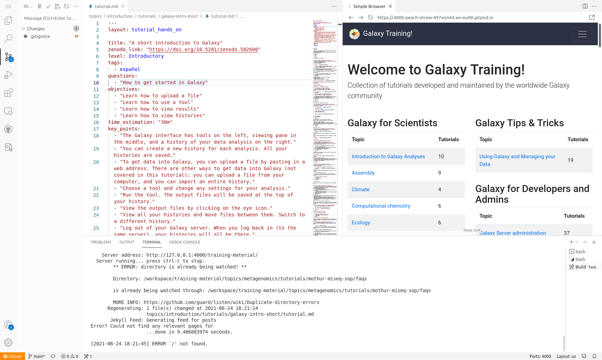
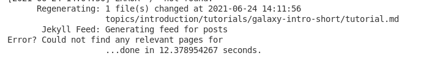
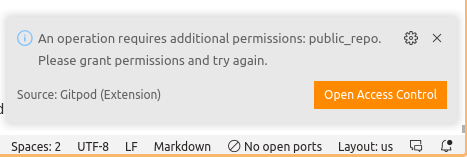

If you are working on your own training materials and want preview them online without installing anything on your computer, you can do this using GitHub CodeSpaces! Everybody gets 60 free hours of CodeSpaces per month


> <agenda-title></agenda-title>
>
> In this tutorial, you will learn how to contribute to the GTN website:
>
> 1. TOC
> {:toc}
>
{: .agenda}


# Launching CodeSpaces


> <hands-on-title>Setting up GitPod</hands-on-title>
>
> 1. Navigate to the GTN GitHub repository, [github.com/galaxyproject/training-material](https://github.com/galaxyproject/training-material)
> 2. Click on the greed **Code** button
> 3. At the top, switch to the **CodeSpaces** tab
>    
> 4. Click on **Create codespace on main**
> 5. This will setup a [Visual Studio Code](https://code.visualstudio.com/) environment for you
>    - It may take a couple minutes to finish setting everything up
>    - In this environment you can also build the GTN website to preview your changes
>    - When everything is ready, you should see something like this:
>
>    
{: .hands_on}

# The VScode environment

Let's have a closer look at your CodeSpaces window:

- **Left:** Here you see all the files in the GTN repository
- **Top:** This is the main window where you can view and edit files
- **Bottom:** Terminal window. Here you can type commands (e.g. to build the website preview) and read output and error messages.


# Build and preview the GTN website

Before we start making any changes, let's build the website and get a live preview.

> <hands-on-title>Setting up GitPod</hands-on-title>
>
> 1. In the terminal window (bottom), type the following command:
>    `make serve-codespaces`
>
>    
>
> 3. When the build process is finished, a message will pop up with a button to view the GTN website preview.
>    - You may have to click the "Try Again" button if the preview was generated before the site building completed
>
>      
>
>    - Click on the link in the terminal to see the GTN in full-screen: `Server address: http://127.0.0.1:4000/training-material/`
>
>    
>
>    > <tip-title>Not opening?</tip-title>
>    > 
>    > Some browsers block popups by default, you may need to allow GitPod to show popups in order to click links.
>    {: .tip}
>
> 4. This will take you to a preview of the GTN website
>    - **Note:** It will take you the 404 page because GitPod doesn't know the location of the GTN homepage, but from here you can just click the homepage button.
>
{: .hands_on}




# Editing Training Materials on CodeSpaces

Now that you have the codespace environment working and we have a live preview up, let's make some changes to the GTN materials and get an instant preview.


**Scenario:** You have spotted a typo in one of the tutorials, and would like to fix this and see the resulting GTN webpage.


> <hands-on-title>Make and view changes</hands-on-title>
>
> 1. In the preview of the GTN website, open the following tutorial:
>    - Topic: "Introduction to Galaxy Analyses" topic
>    - Tutorial: "A Short Introduction to Galaxy""
>    - We will edit this tutorial and watch the live preview window for the effects
>
>
> 2. On the file browser on the left, open the following file:
>
>    ```
>    topics/introduction/tutorials/galaxy-intro-short/tutorial.md
>    ```
>
>    > <tip-title>Finding files faster?</tip-title>
>    > You can use the key combination <kbd>ctrl-p</kbd> to launch the file search dialog and simply enter the text `topics/introduction/tutorials/galaxy-intro-short/tutorial.md`
>    {: .tip}
>
> 3. Change the title of the tutorial
>    - **From:** "A Short Introduction to Galaxy"
>    - **To:** "A Short and Cool Introduction to Galaxy"
>
>    
>
>    - You should immediately see a message in the terminal saying "regenerating". CodeSpaces has detected your changes and is rebuilding the website.
>
>    
>
> 4. Move to the top right panel where the GTN is previewed and refresh the website
>    -  Refresh button in front of the address bar of the preview panel
>    - You can also open the preview in it's own brower tab, using the  button at the top-right corner of the preview window. Then you can reload the page the regular way (e.g. <kbd>F5</kbd> or <kbd>ctrl + r</kbd> or the reload button in the browser)
>
> 5. You should see the change you made:
>    
>
{: .hands_on}


In this way you can edit files in the text editor, and see the effects in the website preview.


# Saving your changes back to GitHub

When you have finished your changes, it all looks good in the preview, you want to save your changes back to GitHub so that you can either continue later, or make a Pull Request to the GTN to contribute your changes.


TODO: main option: do nothing, and just hit the "save to branch/fork" message in GitHub web interface


> <hands-on-title>Save changes</hands-on-title>
>
> 1. **Option 1: via the terminal**
>    - Hit <kbd>ctrl+c</kbd> if your preview was still running to stop it
>    - Create a new branch, commit your changes, push changes:
>
>    ```bash
>    git checkout -b fix-title
>    git commit -m "update tutorial title" topics/introduction/tutorials/galaxy-intro-short/tutorial.md
>    git push origin fix-title
>    ```
>
> 2. **Option 2: via the web interface**
>    - Create a new branch:
>      -  On the bottom-left, click on the branch logo (probably labelled "main")
>         
>      - Enter `fix-title` as the name for your new branch (at top of window)
>      - Choose "+ Create new branch..." from the dropdown
>    - Commit changes:
>      - On the left menu, click on the "changed files" tab
>        
>      - Click on the "+" icon next to the file we edited to *stage changes*
>        
>      - Hit the checkmark icon at the top to commit the changes
>      - Enter a commit message (top of window)
>   - Publish changes
>     - Click the cloud button at bottom left to publish your changes
>       
>
>
> 3. Your changes are now saved to your fork, and you can make a PR via the GitHub interface.
>    - If you used option 1 and want to do that right away, you can click on the link in the terminal:
>      
>
> > <tip-title>GitPod Permissions</tip-title>
> > If this is your first time using GitPod, you may need to grant permissions to let GitPod push to your GitHub fork
> > 
> > This will take you through a process to authorize GitPod, and set permissions
> > 
> > If it doesn't take you to GitPod's permission page because your browser blocks popups, you can set them [on this page](https://gitpod.io/integrations).
> {: .tip}
{: .hands_on}


# Closing your CodeSpace

Everybody gets 60 hours per month for free on CodeSpaces. Your codespace should automatically shut down after a certain period of inactivity,
but it is always a good idea to close your CodeSpace when you are finished with it, to conserve your quotum.


> <hands-on-title>Shutting down your GitPod workspace</hands-on-title>
>
> 1. Click on the menu button at the top left corner of the screen
>    - Choose "Gitpod: Stop Workspace"
>
>    
>
{: .hands_on}


