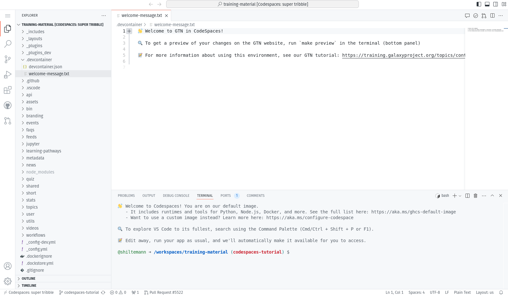
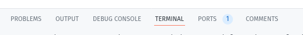
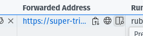
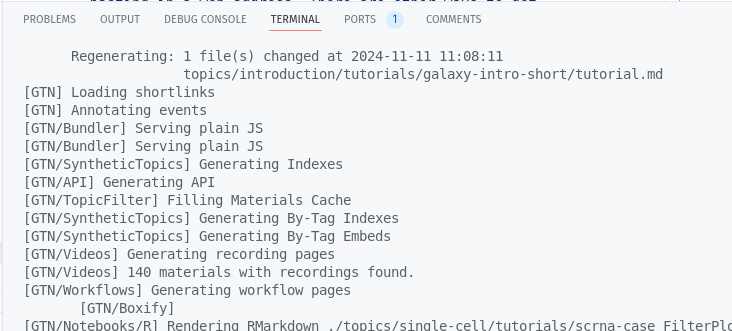
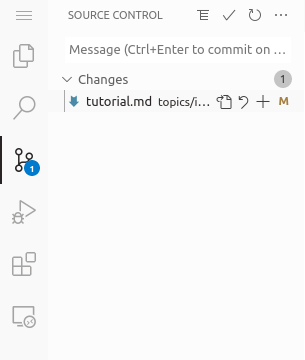

If you are working on your own training materials and want preview them online without installing anything on your computer, you can do this using GitHub CodeSpaces! Everybody gets 60 free hours of CodeSpaces per month


> <agenda-title></agenda-title>
>
> In this tutorial, you will learn how to contribute to the GTN website:
>
> 1. TOC
> {:toc}
>
{: .agenda}


# Launching CodeSpaces


> <hands-on-title>Setting up GitPod</hands-on-title>
>
> 1. Navigate to the GTN GitHub repository, [github.com/galaxyproject/training-material](https://github.com/galaxyproject/training-material)
>
> 2. Click on the green **Code** button
>
> 3. At the top, switch to the **CodeSpaces** tab
>    
>
> 4. Click on **Create codespace on main**
>    - Note: if you switch to a specific branch in GitHub first, you can create a codespace for that branch
>
> 5. This will setup a [Visual Studio Code](https://code.visualstudio.com/) environment for you
>    - It may take a couple minutes to finish setting everything up
>    - In this environment you can also build the GTN website to preview your changes
>    - When everything is ready, you should see something like this:
>
>    
{: .hands_on}

# The VScode environment

Let's have a closer look at your CodeSpaces window:

- **Left:** Here you see all the files in the GTN repository
- **Top:** This is the main window where you can view and edit files
- **Bottom:** Terminal window. Here you can type commands (e.g. to build the website preview) and read output and error messages.


# Build and preview the GTN website

Before we start making any changes, let's build the website and get a live preview.

> <hands-on-title>Setting up GitPod</hands-on-title>
>
> 1. In the terminal window (bottom), type the following command:
>    `make preview`
>
>    - This will take 2-3 minutes to complete
>
>    
>
> 3. When the build process is finished, a preview window will automatically open (at the top right)
>    - The preview will show the GTN 404 (codespace doesnt know what to show)
>    - Just click on **Return to homepage**.
>
>    > <tip-title>Window not opening? </tip-title>
>    > If the preview window doesn't open for you, or if you close it and want to reopen it, you can always do so as follows:
>    > 1. Go to the **Ports** tab of the bottom panel
>    >
>    >    
>    >
>    > 2. Hover over the link in the **Forwarded Address** column, 3 icons should appear
>    >
>    >    
>    >
>    > 3. Click on:
>    >    - The **world/globe icon** to open the GTN preview in a new window, or
>    >    - Or, click on the **window icon** to the right of the globe icon to preview the GTN in a tab inside the codespaces environment
>    {: .tip}
>
> 4. >
> 5. If you opened the GTN preview inside the codespace, your window will now look something like this:
>
>    
>
>    > <tip-title>Not opening?</tip-title>
>    > 
>    > Some browsers block popups by default, you may need to allow CodeSpaces to show popups in your browser.
>    {: .tip}
>
{: .hands_on}


# Editing Training Materials on CodeSpaces

Now that you have the codespace environment working and we have a live preview up, let's make some changes to the GTN materials and get an instant preview.


**Scenario:** You have spotted a typo in one of the tutorials, and would like to fix this and see the resulting GTN webpage.


> <hands-on-title>Make and view changes</hands-on-title>
>
> 1. In the preview of the GTN website, open the following tutorial:
>    - Topic: "Introduction to Galaxy Analyses" topic
>    - Tutorial: "A Short Introduction to Galaxy""
>    - We will edit this tutorial and watch the live preview window for the effects
>
>
> 2. On the file browser on the left, open the following file:
>
>    ```
>    topics/introduction/tutorials/galaxy-intro-short/tutorial.md
>    ```
>
> 3. Change the title of the tutorial
>    - **From:** "A Short Introduction to Galaxy"
>    - **To:** "A Short and Cool Introduction to Galaxy"
>
>    
>
> 4. Save the file
>    - **CTRL+S** to save the file
>    - You should immediately see a message in the terminal saying "regenerating". CodeSpaces has detected your changes and is rebuilding the website.
>
>    
>
> 5. Move to the top right panel where the GTN is previewed and refresh the website
>    -  Refresh button in front of the address bar of the preview panel
>    - You can also open the preview in it's own brower tab, using the  button at the top-right corner of the preview window. Then you can reload the page the regular way (e.g. <kbd>F5</kbd> or <kbd>ctrl + r</kbd> or the reload button in the browser)
>
> 6. You should see the change you made:
>    
>
{: .hands_on}


In this way you can edit files in the text editor, and see the effects in the website preview.


# Saving your changes back to GitHub

When you have finished your changes, it all looks good in the preview, you want to save your changes back to GitHub so that you can either continue later, or make a Pull Request to the GTN to contribute your changes.


TODO: main option: do nothing, and just hit the "save to branch/fork" message in GitHub web interface


> <hands-on-title>Save changes</hands-on-title>
>
> 1. **Option 1: via the terminal**
>    - Hit <kbd>ctrl+c</kbd> if your preview was still running to stop it
>    - Create a new branch, commit your changes, push changes:
>
>    ```bash
>    git checkout -b fix-title
>    git commit -m "update tutorial title" topics/introduction/tutorials/galaxy-intro-short/tutorial.md
>    git push origin fix-title
>    ```
>
> 2. **Option 2: via the web interface**
>    - Create a new branch:
>      -  On the bottom-left, click on the branch logo (probably labelled "main")
>         
>      - Enter `fix-title` as the name for your new branch (at top of window)
>      - Choose "+ Create new branch..." from the dropdown
>    - Commit changes:
>      - On the left menu, click on the "changed files" tab
>        
>      - Click on the "+" icon next to the file we edited to *stage changes*
>        
>      - Hit the checkmark icon at the top to commit the changes
>      - Enter a commit message (top of window)
>   - Publish changes
>     - Click the cloud button at bottom left to publish your changes
>       
>
>
> 3. Your changes are now saved to your fork, and you can make a PR via the GitHub interface.
>    - If you used option 1 and want to do that right away, you can click on the link in the terminal:
>      
>
> > <tip-title>GitPod Permissions</tip-title>
> > If this is your first time using GitPod, you may need to grant permissions to let GitPod push to your GitHub fork
> > 
> > This will take you through a process to authorize GitPod, and set permissions
> > 
> > If it doesn't take you to GitPod's permission page because your browser blocks popups, you can set them [on this page](https://gitpod.io/integrations).
> {: .tip}
{: .hands_on}


# Closing your CodeSpace

Everybody gets 60 hours per month for free on CodeSpaces. Your codespace will automatically shut down after 30 minutes of inactivity,
but it is always a good idea to close your CodeSpace when you are finished with it, to conserve your quotum.


> <hands-on-title>Shutting down your CodeSpace</hands-on-title>
>
> 1. Return to the [GTN GitHub page](https://github.com/galaxyproject/training-material)
>
> 2. Click on the green **Code** button again
>
> 3. Under the Codespaces tab, you should see your running codespace
>
>    
>
> 4. Click on the 3-dots menu to the right of your (randomly generated) codespace name
>
> 5. In this menu you can quit your codespace in two ways:
>    - **Stop codespace**: your changes will be kept and you can restart the codespace later
>    - **Delete** your codespace. Any changes you did not commit and push to GitHub are lost.
>      
>
>    - In this menu you can also resume a stopped codespace by simply clicking **Open in Browswer**
>
{: .hands_on}


Congrats! You learned how to contribute to the GTN by using the CodeSpaces environment!
