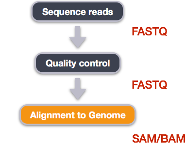
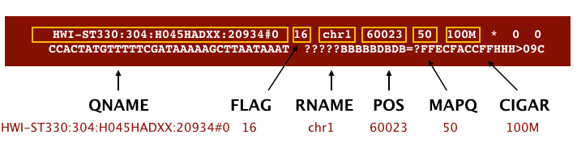
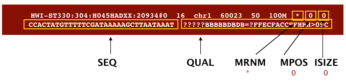
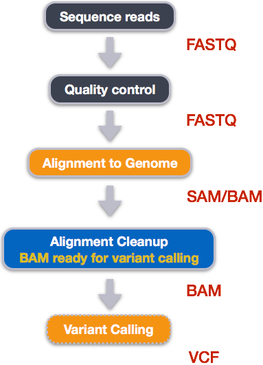
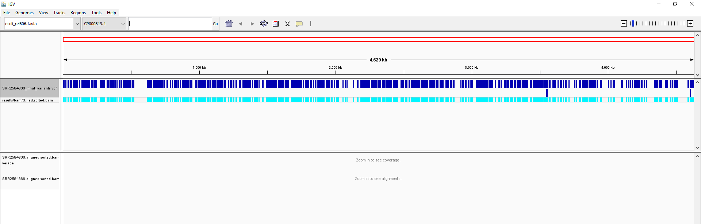

In this tutorial we are working with files from a long-term evolution study of an *E. coli* population (designated Ara-3). We will perform variant calling to see how the population changed over time. We care how this population changed relative to the original population, *E. coli* strain REL606. Therefore, we will align each of our samples to the *E. coli* REL606 reference genome, and see what differences exist in our reads versus the genome.

The whole proccess is designed to be run in RStudio as an Interactive Tool, directly in Galaxy.

> <comment-title></comment-title>
>
> This tutorial is significantly based on [the Carpentries](https://carpentries.org) ["Data Wrangling and Processing for Genomics"](https://datacarpentry.org/wrangling-genomics/) lesson
>
{: .comment}

> <agenda-title></agenda-title>
>
> In this tutorial, we will cover:
>
> 1. TOC
> {:toc}
>
{: .agenda}




> <hands-on-title>Software to use</hands-on-title>
>
> The R Console and other interactive tools like RStudio are great for prototyping code and exploring data, but sooner or later we will want to use our program in a pipeline or run it in a shell script to process thousands of data files. This is one of those cases and, in order to do that, we will use the terminal provided by the RStudio itself.
> We go to "Tools" and pick the "Shell..." option and we are good to go. Our workspace is the left, terminal window that just opened.
>
> Fortunately, [miniconda](https://docs.conda.io/en/latest/miniconda.html) is already installed. Miniconda is a package manager that simplifies the installation processes. We can and will use it to install every essential package for our tutorial. However, it is of critical importance that we do that in an new environment within our existing base and install our packages in said environment.
>
> > <code-in-title>Environment and Packages</code-in-title>
> > ```bash
> > $ conda create -n name_of_your_env bwa samtools bcftools
> > $ conda activate name_of_your_env
> > ```
> {: .code-in}
>
>
> | Software | Version | Manual | Available for | Description |
> | -------- | ------------ | ------ | ------------- | ----------- |
> | [BWA](http://bio-bwa.sourceforge.net/) | 0.7.17 | [BWA Manual](http://bio-bwa.sourceforge.net/bwa.shtml) | Linux, MacOS | Mapping DNA sequences against reference genome. |
> | [SAMtools](http://samtools.sourceforge.net/) | 1.15.1 | [SAMtools Manual](http://www.htslib.org/doc/samtools.html) | Linux, MacOS | Utilities for manipulating alignments in the SAM format. |
> | [BCFtools](https://samtools.github.io/bcftools/) | 1.15.1 | [BCFtools manual](https://samtools.github.io/bcftools/bcftools.html) | Linux, MacOS | Utilities for variant calling and manipulating VCFs and BCFs. |
> | [IGV](http://software.broadinstitute.org/software/igv/home) | [IGV Download](https://software.broadinstitute.org/software/igv/download) | [IGV User Guide](https://software.broadinstitute.org/software/igv/UserGuide) | Linux, MacOS, Windows | Visualization and interactive exploration of large genomics datasets. |
>
{: .hands_on}

# Alignment to a reference genome



Image from ["Data Wrangling and Processing for Genomics"](https://datacarpentry.org/wrangling-genomics/)

We perform read alignment or mapping to determine where in the genome our reads originated from. There are a number of tools to
choose from and, while there is no gold standard, there are some tools that are better suited for particular NGS analyses. We will be
using the [Burrows Wheeler Aligner (BWA)](http://bio-bwa.sourceforge.net/), which is a software package for mapping low-divergent
sequences against a large reference genome.

The alignment process consists of two steps:

1. Indexing the reference genome
2. Aligning the reads to the reference genome

# Setting up

> <hands-on-title>Download Genome</hands-on-title>
>
> First we download the reference genome for *E. coli* REL606. Although we could copy or move the file with `cp` or `mv`, most genomics workflows begin with a download step, so we will practice that here.
>
> > ###   Input: Bash
> > ```bash
> > $ cd ~/dc_workshop
> > $ mkdir -p data/ref_genome
> > $ curl -L -o data/ref_genome/ecoli_rel606.fasta.gz ftp://ftp.ncbi.nlm.nih.gov/genomes/all/GCA/000/017/985/GCA_000017985.1_ASM1798v1/GCA_000017985.1_ASM1798v1_genomic.fna.gz
> > $ gunzip data/ref_genome/ecoli_rel606.fasta.gz
> > ```
> {: .code-in}
>
> > <question-title></question-title>
> >
> > We saved this file as `data/ref_genome/ecoli_rel606.fasta.gz` and then decompressed it.
> > What is the real name of the genome?
> >
> > > <solution-title></solution-title>
> > >
> > > ```bash
> > > $ head data/ref_genome/ecoli_rel606.fasta
> > > ```
> > >
> > >
> > > The name of the sequence follows the `> ` character. The name is `CP000819.1 Escherichia coli B str. REL606, complete genome`.
> > > Keep this chromosome name (`CP000819.1`) in mind, as we will use it later in the lesson.
> > {: .solution}
> {: .question}
>
> We will also download a set of trimmed FASTQ files to work with that will enable us to run our variant calling workflow quite quickly.
>
> > <code-in-title>Getting easy-to-work FASTQ files</code-in-title>
> > ```bash
> > $ curl -L -o sub.tar.gz https://ndownloader.figshare.com/files/14418248
> > $ tar xvf sub.tar.gz
> > $ mv sub/ ~/dc_workshop/data/trimmed_fastq_small
> > ```
> {: .code-in}
> >
> You will also need to create directories for the results that will be generated as part of this workflow. We can do this in a single line of code, because `mkdir` can accept multiple new directory names as input.
>
> > <code-in-title>Create result directories</code-in-title>
> > ```bash
> > $ mkdir -p results/sam results/bam results/bcf results/vcf
> > ```
> {: .code-in}
{: .hands_on}


> <hands-on-title>Index the reference genome</hands-on-title>
> Our first step is to index the reference genome for use by BWA. Indexing allows the aligner to quickly find potential alignment sites for query sequences in a genome, which saves time during alignment. Indexing the reference only has to be run once. The only reason you would want to create a new index is if you are working with a different reference genome or you are using a different tool for alignment.
>
> > <code-in-title>Indexing with `bwa`</code-in-title>
> > ```bash
> > $ bwa index data/ref_genome/ecoli_rel606.fasta
> > ```
> {: .code-in}
>
> While the index is created, you will see output that looks something like this:
>
> > <code-out-title></code-out-title>
> > ```
> > [bwa_index] Pack FASTA... 0.04 sec
> > [bwa_index] Construct BWT for the packed sequence...
> > [bwa_index] 1.05 seconds elapse.
> > [bwa_index] Update BWT... 0.03 sec
> > [bwa_index] Pack forward-only FASTA... 0.02 sec
> > [bwa_index] Construct SA from BWT and Occ... 0.57 sec
> > [main] Version: 0.7.17-r1188
> > [main] CMD: bwa index data/ref_genome/ecoli_rel606.fasta
> > [main] Real time: 1.765 sec; CPU: 1.715 sec
> > ```
> {: .code-out}
>
{: .hands_on}

> <hands-on-title>Align reads to reference genome</hands-on-title>
>
> The alignment process consists of choosing an appropriate reference genome to map our reads against and then deciding on an
> aligner. We will use the BWA-MEM algorithm, which is the latest and is generally recommended for high-quality queries as it
> is faster and more accurate.
>
> An example of what a `bwa` command looks like is below. This command will not run, as we do not have the files `ref_genome.fa`, `input_file_R1.fastq`, or `input_file_R2.fastq`.
>
>
> ```
> $ bwa mem ref_genome.fasta input_file_R1.fastq input_file_R2.fastq > output.sam
> ```
>
>
> Have a look at the [bwa options page](http://bio-bwa.sourceforge.net/bwa.shtml). While we are running bwa with the default
> parameters here, your use case might require a change of parameters. *NOTE: Always read the manual page for any tool before using
> and make sure the options you use are appropriate for your data.*
>
> We are going to start by aligning the reads from just one of the
> samples in our dataset (`SRR2584866`). Later, we will be
> iterating this whole process on all of our sample files.
>
> > <code-in-title>Aligning with bwa</code-in-title>
> > ```bash
> > $ bwa mem data/ref_genome/ecoli_rel606.fasta data/trimmed_fastq_small/SRR2584866_1.trim.sub.fastq data/trimmed_fastq_small/SRR2584866_2.trim.sub.fastq > results/sam/SRR2584866.aligned.sam
> > ```
> {: .code-in}
>
> > <code-out-title></code-out-title>
> > ```
> > [M::bwa_idx_load_from_disk] read 0 ALT contigs
> > [M::process] read 77446 sequences (10000033 bp)...
> > [M::process] read 77296 sequences (10000182 bp)...
> > [M::mem_pestat] # candidate unique pairs for (FF, FR, RF, RR): (48, 36728, 21, 61)
> > [M::mem_pestat] analyzing insert size distribution for orientation FF...
> > [M::mem_pestat] (25, 50, 75) percentile: (420, 660, 1774)
> > [M::mem_pestat] low and high boundaries for computing mean and std.dev: (1, 4482)
> > [M::mem_pestat] mean and std.dev: (784.68, 700.87)
> > [M::mem_pestat] low and high boundaries for proper pairs: (1, 5836)
> > [M::mem_pestat] analyzing insert size distribution for orientation FR...
> > ```
> {: .code-out}
{: .hands_on}

# SAM/BAM format

The [SAM file](https://genome.sph.umich.edu/wiki/SAM),
is a tab-delimited text file that contains information for each individual read and its alignment to the genome. While we do not
have time to go into detail about the features of the SAM format, the paper by
[Heng Li et al.](http://bioinformatics.oxfordjournals.org/content/25/16/2078.full) provides a lot more detail on the specification.

**The compressed binary version of SAM is called a BAM file.** We use this version to reduce size and to allow for *indexing*, which enables efficient random access of the data contained within the file.

The file begins with a **header**, which is optional. The header is used to describe the source of data, reference sequence, method of
alignment, etc., this will change depending on the aligner being used. Following the header is the **alignment section**. Each line
that follows corresponds to alignment information for a single read. Each alignment line has **11 mandatory fields** for essential
mapping information and a variable number of other fields for aligner specific information. An example entry from a SAM file is
displayed below with the different fields highlighted.



Image from [Data Wrangling and Processing for Genomics](https://datacarpentry.org/wrangling-genomics/)



Image from ["Data Wrangling and Processing for Genomics"](https://datacarpentry.org/wrangling-genomics/)

> <hands-on-title>SAM to BAM</hands-on-title>
> > <code-in-title>bash</code-in-title>
> > We will convert the SAM file to BAM format using the `samtools` program with the `view` command and tell this command that the input is in SAM format (`-S`) and to output BAM format (`-b`):
> >
> > ```bash
> > $ samtools view -S -b results/sam/SRR2584866.aligned.sam > results/bam/SRR2584866.aligned.bam
> > ```
> {: .code-in}
> > <code-out-title></code-out-title>
> > ```
> > [samopen] SAM header is present: 1 sequences.
> > ```
> {: .code-out}
>
{: .hands_on}

> <hands-on-title>Sort BAM file by coordinates</hands-on-title>
>
> Next we sort the BAM file using the `sort` command from `samtools`. `-o` tells the command where to write the output.
> > <code-in-title>`sort` command</code-in-title>
> > ```bash
> > $ samtools sort -o results/bam/SRR2584866.aligned.sorted.bam results/bam/SRR2584866.aligned.bam
> > ```
> {: .code-in}
>
> Our files are pretty small, so we will not see this output. If you run the workflow with larger files, you will see something like this:
> > <code-out-title></code-out-title>
> >
> > ```
> > [bam_sort_core] merging from 2 files...
> > ```
> {: .code-out}
>
> SAM/BAM files can be sorted in multiple ways, e.g. by location of alignment on the chromosome, by read name, etc. It is important to be aware that different alignment tools will output differently sorted SAM/BAM, and different downstream tools require differently sorted alignment files as input.
>
> You can use samtools to learn more about this bam file as well.
>
> > <code-in-title>`flagstat` command</code-in-title>
> > ```bash
> > samtools flagstat results/bam/SRR2584866.aligned.sorted.bam
> > ```
> {: .code-in}
>
> This will give you the following statistics about your sorted bam file:
>
> > <code-out-title></code-out-title>
> > ```
> > 351169 + 0 in total (QC-passed reads + QC-failed reads)
> > 0 + 0 secondary
> > 1169 + 0 supplementary
> > 0 + 0 duplicates
> > 351103 + 0 mapped (99.98% : N/A)
> > 350000 + 0 paired in sequencing
> > 175000 + 0 read1
> > 175000 + 0 read2
> > 346688 + 0 properly paired (99.05% : N/A)
> > 349876 + 0 with itself and mate mapped
> > 58 + 0 singletons (0.02% : N/A)
> > 0 + 0 with mate mapped to a different chr
> > 0 + 0 with mate mapped to a different chr (mapQ> =5)
> > ```
> {: .code-out}
{: .hands_on}

# Variant calling

A variant call is a conclusion that there is a nucleotide difference vs. some reference at a given position in an individual genome
or transcriptome, often referred to as a Single Nucleotide Variant (SNV). The call is usually accompanied by an estimate of
variant frequency and some measure of confidence. Similar to other steps in this workflow, there are a number of tools available for
variant calling. In this workshop we will be using `bcftools`, but there are a few things we need to do before actually calling the
variants.



Image from ["Data Wrangling and Processing for Genomics"](https://datacarpentry.org/wrangling-genomics/)

> <hands-on-title>Step 1: Calculate the read coverage of positions in the genome</hands-on-title>
>
> Do the first pass on variant calling by counting read coverage with
> [bcftools](https://samtools.github.io/bcftools/bcftools.html). We will
> use the command `mpileup`. The flag `-O b` tells bcftools to generate a
> bcf format output file, `-o` specifies where to write the output file, and `-f` flags the path to the reference genome:
> > <code-in-title>`mpileup` command</code-in-title>
> > ```bash
> > $ bcftools mpileup -O b -o results/bcf/SRR2584866_raw.bcf -f data/ref_genome/ecoli_rel606.fasta results/bam/SRR2584866.aligned.sorted.bam
> > ```
> {: .code-in}
> > <code-out-title></code-out-title>
> > ```
> > [mpileup] 1 samples in 1 input files
> > ```
> {: .code-out}
>
> We have now generated a file with coverage information for every base.
>
{: .hands_on}

> <hands-on-title>Step 2: Detect the single nucleotide variants (SNVs</hands-on-title>
>
> Identify SNVs using bcftools `call`. We have to specify ploidy with the flag `--ploidy`, which is one for the haploid *E. coli*. `-m` allows for multiallelic and rare-variant calling, `-v` tells the program to output variant sites only (not every site in the genome), and `-o` specifies where to write the output file:
> > <code-in-title>`call` command</code-in-title>
> > ```bash
> > $ bcftools call --ploidy 1 -m -v -o results/vcf/SRR2584866_variants.vcf results/bcf/SRR2584866_raw.bcf
> > ```
> {: .code-in}
>
{: .hands_on}

> <hands-on-title>Step 3: Filter and report the SNV variants in variant calling format (VCF</hands-on-title>
>
> Filter the SNVs for the final output in VCF format, using `vcfutils.pl`:
> > <code-in-title>Filtering with `vcfutils.pl` command</code-in-title>
> > ```bash
> > $ vcfutils.pl varFilter results/vcf/SRR2584866_variants.vcf  > results/vcf/SRR2584866_final_variants.vcf
> > ```
> {: .code-in}
>
{: .hands_on}


> <hands-on-title>Explore the VCF format:</hands-on-title>
>
> > 
> > ```bash
> > $ less -S results/vcf/SRR2584866_final_variants.vcf
> > ```
> {: .code-in}
>
> You will see the header (which describes the format), the time and date the file was
> created, the version of bcftools that was used, the command line parameters used, and
> some additional information:
>
> >  Output
> > ```
> > ##fileformat=VCFv4.2
> > ##FILTER<ID=PASS,Description="All filters passed">
> > ##bcftoolsVersion=1.8+htslib-1.8
> > ##bcftoolsCommand=mpileup -O b -o results/bcf/SRR2584866_raw.bcf -f data/ref_genome/ecoli_rel606.fasta results/bam/SRR2584866.aligned.sorted.bam
> > ##reference=file://data/ref_genome/ecoli_rel606.fasta
> > ##contig<ID=CP000819.1,length=4629812>
> > ##ALT<ID=*,Description="Represents allele(s) other than observed.">
> > ##INFO<ID=INDEL,Number=0,Type=Flag,Description="Indicates that the variant is an INDEL.">
> > ##INFO<ID=IDV,Number=1,Type=Integer,Description="Maximum number of reads supporting an indel">
> > ##INFO<ID=IMF,Number=1,Type=Float,Description="Maximum fraction of reads supporting an indel">
> > ##INFO<ID=DP,Number=1,Type=Integer,Description="Raw read depth">
> > ##INFO<ID=VDB,Number=1,Type=Float,Description="Variant Distance Bias for filtering splice-site artefacts in RNA-seq data (bigger is better)",Version=
> > ##INFO<ID=RPB,Number=1,Type=Float,Description="Mann-Whitney U test of Read Position Bias (bigger is better)">
> > ##INFO<ID=MQB,Number=1,Type=Float,Description="Mann-Whitney U test of Mapping Quality Bias (bigger is better)">
> > ##INFO<ID=BQB,Number=1,Type=Float,Description="Mann-Whitney U test of Base Quality Bias (bigger is better)">
> > ##INFO<ID=MQSB,Number=1,Type=Float,Description="Mann-Whitney U test of Mapping Quality vs Strand Bias (bigger is better)">
> > ##INFO<ID=SGB,Number=1,Type=Float,Description="Segregation based metric.">
> > ##INFO<ID=MQ0F,Number=1,Type=Float,Description="Fraction of MQ0 reads (smaller is better)">
> > ##FORMAT<ID=PL,Number=G,Type=Integer,Description="List of Phred-scaled genotype likelihoods">
> > ##FORMAT<ID=GT,Number=1,Type=String,Description="Genotype">
> > ##INFO<ID=ICB,Number=1,Type=Float,Description="Inbreeding Coefficient Binomial test (bigger is better)">
> > ##INFO<ID=HOB,Number=1,Type=Float,Description="Bias in the number of HOMs number (smaller is better)">
> > ##INFO<ID=AC,Number=A,Type=Integer,Description="Allele count in genotypes for each ALT allele, in the same order as listed">
> > ##INFO<ID=AN,Number=1,Type=Integer,Description="Total number of alleles in called genotypes">
> > ##INFO<ID=DP4,Number=4,Type=Integer,Description="Number of high-quality ref-forward , ref-reverse, alt-forward and alt-reverse bases">
> > ##INFO<ID=MQ,Number=1,Type=Integer,Description="Average mapping quality">
> > ##bcftools_callVersion=1.8+htslib-1.8
> > ##bcftools_callCommand=call --ploidy 1 -m -v -o results/bcf/SRR2584866_variants.vcf results/bcf/SRR2584866_raw.bcf; Date=Tue Oct  9 18:48:10 2018
> > ```
> >
> > Followed by information on each of the variations observed:
> >
> > ```
> > #CHROM  POS     ID      REF     ALT     QUAL    FILTER  INFO    FORMAT  results/bam/SRR2584866.aligned.sorted.bam
> > CP000819.1      1521    .       C       T       207     .       DP=9;VDB=0.993024;SGB=-0.662043;MQSB=0.974597;MQ0F=0;AC=1;AN=1;DP4=0,0,4,5;MQ=60
> > CP000819.1      1612    .       A       G       225     .       DP=13;VDB=0.52194;SGB=-0.676189;MQSB=0.950952;MQ0F=0;AC=1;AN=1;DP4=0,0,6,5;MQ=60
> > CP000819.1      9092    .       A       G       225     .       DP=14;VDB=0.717543;SGB=-0.670168;MQSB=0.916482;MQ0F=0;AC=1;AN=1;DP4=0,0,7,3;MQ=60
> > CP000819.1      9972    .       T       G       214     .       DP=10;VDB=0.022095;SGB=-0.670168;MQSB=1;MQ0F=0;AC=1;AN=1;DP4=0,0,2,8;MQ=60      GT:PL
> > CP000819.1      10563   .       G       A       225     .       DP=11;VDB=0.958658;SGB=-0.670168;MQSB=0.952347;MQ0F=0;AC=1;AN=1;DP4=0,0,5,5;MQ=60
> > CP000819.1      22257   .       C       T       127     .       DP=5;VDB=0.0765947;SGB=-0.590765;MQSB=1;MQ0F=0;AC=1;AN=1;DP4=0,0,2,3;MQ=60      GT:PL
> > CP000819.1      38971   .       A       G       225     .       DP=14;VDB=0.872139;SGB=-0.680642;MQSB=1;MQ0F=0;AC=1;AN=1;DP4=0,0,4,8;MQ=60      GT:PL
> > CP000819.1      42306   .       A       G       225     .       DP=15;VDB=0.969686;SGB=-0.686358;MQSB=1;MQ0F=0;AC=1;AN=1;DP4=0,0,5,9;MQ=60      GT:PL
> > CP000819.1      45277   .       A       G       225     .       DP=15;VDB=0.470998;SGB=-0.680642;MQSB=0.95494;MQ0F=0;AC=1;AN=1;DP4=0,0,7,5;MQ=60
> > CP000819.1      56613   .       C       G       183     .       DP=12;VDB=0.879703;SGB=-0.676189;MQSB=1;MQ0F=0;AC=1;AN=1;DP4=0,0,8,3;MQ=60      GT:PL
> > CP000819.1      62118   .       A       G       225     .       DP=19;VDB=0.414981;SGB=-0.691153;MQSB=0.906029;MQ0F=0;AC=1;AN=1;DP4=0,0,8,10;MQ=59
> > CP000819.1      64042   .       G       A       225     .       DP=18;VDB=0.451328;SGB=-0.689466;MQSB=1;MQ0F=0;AC=1;AN=1;DP4=0,0,7,9;MQ=60      GT:PL
> > ```
> {: .code-out}
>
{: .hands_on}

This is a lot of information, so let's take some time to make sure we understand our output.

The first few columns represent the information we have about a predicted variation.

| column | info |
| ------- | ---------- |
| CHROM | contig location where the variation occurs |
| POS | position within the contig where the variation occurs |
| ID | a `.` until we add annotation information |
| REF | reference genotype (forward strand) |
| ALT | sample genotype (forward strand) |
| QUAL | Phred-scaled probability that the observed variant exists at this site (higher is better) |
| FILTER | a `.` if no quality filters have been applied, PASS if a filter is passed, or the name of the filters this variant failed |

In an ideal world, the information in the `QUAL` column would be all we needed to filter out bad variant calls.
However, in reality we need to filter on multiple other metrics.

The last two columns contain the genotypes and can be tricky to decode.

| column | info |
| ------- | ---------- |
| FORMAT | lists in order the metrics presented in the final column |
| results | lists the values associated with those metrics in order |

For our file, the metrics presented are GT:PL:GQ.

| metric | definition |
| ------- | ---------- |
| AD, DP | the depth per allele by sample and coverage |
| GT | the genotype for the sample at this loci. For a diploid organism, the GT field indicates the two alleles carried by the sample, encoded by a 0 for the REF allele, 1 for the first ALT allele, 2 for the second ALT allele, etc. A 0/0 means homozygous reference, 0/1 is heterozygous, and 1/1 is homozygous for the alternate allele. |
| PL | the likelihoods of the given genotypes |
| GQ | the Phred-scaled confidence for the genotype |

The Broad Institute's [VCF guide](https://www.broadinstitute.org/gatk/guide/article?id=1268) is an excellent place
to learn more about the VCF file format.

> <question-title></question-title>
>
> Use the `grep` and `wc` commands you have learned to assess how many variants are in the vcf file.
>
> > <solution-title></solution-title>
> >
> > > 
> > > ```bash
> > > $ grep -v "#" results/vcf/SRR2584866_final_variants.vcf | wc -l
> > > ```
> > {: .code-in}
> > > 
> > > ```
> > > 766
> > > ```
> > {: .code-out}
> >
> > There are 766 variants in this file.
> {: .solution}
{: .question}

> <hands-on-title>Assess the alignment (visualization) - optional step</hands-on-title>
>
> It is often instructive to look at your data in a genome browser. Visualization will allow you to get a "feel" for
> the data, as well as detecting abnormalities and problems. Also, exploring the data in such a way may give you
> ideas for further analyses.  As such, visualization tools are useful for exploratory analysis. In this lesson we
> will describe two different tools for visualization: a light-weight command-line based one and the Broad
> Institute's Integrative Genomics Viewer (IGV) which requires
> software installation and transfer of files.
>
> > <code-in-title> In order for us to visualize the alignment files, we will need to index the BAM file using `samtools`:</code-in-title>
> >
> > ```bash
> > $ samtools index results/bam/SRR2584866.aligned.sorted.bam
> > ```
> {: .code-in}
>
> ## Viewing with `tview`
>
> [Samtools](http://www.htslib.org/) implements a very simple text alignment viewer based on the GNU
> `ncurses` library, called `tview`. This alignment viewer works with short indels and shows [MAQ](http://maq.sourceforge.net/) consensus.
> It uses different colors to display mapping quality or base quality, subjected to users' choice. Samtools viewer is known to work with a 130 GB alignment swiftly. Due to its text interface, displaying alignments over network is also very fast.
>
> In order to visualize our mapped reads, we use `tview`, giving it the sorted bam file and the reference file:
>
> > <code-in-title>Visualize with `tview`</code-in-title>
> >
> > ```bash
> > $ samtools tview results/bam/SRR2584866.aligned.sorted.bam data/ref_genome/ecoli_rel606.fasta
> > ```
> {: .code-in}
>
> > <code-out-title></code-out-title>
> > ```
> > 1         11        21        31        41        51        61        71        81        91        101       111       121
> > AGCTTTTCATTCTGACTGCAACGGGCAATATGTCTCTGTGTGGATTAAAAAAAGAGTGTCTGATAGCAGCTTCTGAACTGGTTACCTGCCGTGAGTAAATTAAAATTTTATTGACTTAGGTCACTAAATAC
> > ..................................................................................................................................
> > ,,,,,,,,,,,,,,,,,,,,,,,,,,,,,,,,,,,, ..................N................. ,,,,,,,,,,,,,,,,,,,,,,,,,,,,,,,,........................
> > ,,,,,,,,,,,,,,,,,,,,,,,,,,,,,,,,,,, ..................N................. ,,,,,,,,,,,,,,,,,,,,,,,,,,,.............................
> > ...................................,g,,,,,,,,,,,,,,,,,,,,,,,,,,,,,,,,,  ....................................   ................
> > ,,,,,,,,,,,,,,,,,,,,,,,,,,,,,,,,,,,....................................   ....................................      ,,,,,,,,,,
> > ,,,,,,,,,,,,,,,,,,,,,,,,,,,,,,,,,,,,  ....................................  ,,a,,,,,,,,,,,,,,,,,,,,,,,,,,,,,     .......
> > ,,,,,,,,,,,,,,,,,,,,,,,,,,,,,,, .............................  ,,,,,,,,,,,,,,,,,g,,,,,    ,,,,,,,,,,,,,,,,,,,,,,,,,,,,
> > ,,,,,,,,,,,,,,,,,,,,,,,,,,,,,,,,,,,  ...........................T.......   ,,,,,,,,,,,,,,,,,,,,,,,c,          ......
> > ......................... ................................   ,g,,,,,,,,,,,,,,,,,,,      ...........................
> > ,,,,,,,,,,,,,,,,,,,,, ,,,,,,,,,,,,,,,,,,,,,,,,,,,,,,, ,,,,,,,,,,,,,,,,,,,,,,,,,,,       ..........................
> > ,,,,,,,,,,,,,,,,,,,,,,,,,,,,,,,,,,,   ................................T..  ..............................   ,,,,,,
> > ...........................       ,,,,,,g,,,,,,,,,,,,,,,,,   ....................................         ,,,,,,
> > ,,,,,,,,,,,,,,,,,,,,,,,,,, ....................................  ...................................        ....
> > ....................................  ........................  ,,,,,,,,,,,,,,,,,,,,,,,,,,,,,,,,,,,,      ....
> > ,,,,,,,,,,,,,,,,,,,,,,,,,,,,,,,,,,,,   ,,,,,,,,,,,,,,,,,,,,,,,,,,,,,,,,,,,,  ,,,,,,,,,,,,,,,,,,,,,,,,,,,,,,,,,
> > ........................            .................................. .............................     ....
> > ,,,,,,,,,,,,,,,,,,,,,,,,,,,,,,,,,,,,   ....................................        ..........................
> > ...............................       ,,,,,,,,,,,,,,,,,,,,,,,,,,,,,,,, ....................................
> > ...................................  ,,,,,,,,,,,,,,,,,,,,,,,,,,,,,,,,  ,,,,,,,,,,,,,,,,,,,,,,,,,,,,,,,,,,,
> > ,,,,,,,,,,,,,,,,,,,,,,,,,,,,,,,,,,,, ,,,,,,,,,,,,,,,,,,,,,,,,,,,,,,,,,,  ..................................
> > .................................... ,,,,,,,,,,,,,,,,,,a,,,,,,,,,,,,,,,,,        ,,,,,,,,,,,,,,,,,,,,,,,,,
> > ,,,,,,,,,,,,,,,,,,,,,,,,,,,,,,,,,,,  ............................ ,,,,,,,,,,,,,,,,,,,,,,,,,,,,,,,,,,,,
> > ```
> {: .code-out}
>
> The first line of output shows the genome coordinates in our reference genome. The second line shows the reference
> genome sequence. The third line shows the consensus sequence determined from the sequence reads. A `.` indicates
> a match to the reference sequence, so we can see that the consensus from our sample matches the reference in most
> locations. That is good! If that was not the case, we should probably reconsider our choice of reference.
>
> Below the horizontal line, we can see all of the reads in our sample aligned with the reference genome. Only
> positions where the called base differs from the reference are shown. You can use the arrow keys on your keyboard
> to scroll or type `?` for a help menu. To navigate to a specific position, type `g`. A dialogue box will appear. In
> this box, type the name of the "chromosome" followed by a colon and the position of the variant you would like to view
> (e.g. for this sample, type `CP000819.1:50` to view the 50th base. Type `Ctrl^C` or `q` to exit `tview`.
>
> > <question-title></question-title>
> >
> > Visualize the alignment of the reads for our `SRR2584866` sample. What variant is present at
> > position 4377265? What is the canonical nucleotide in that position?
> >
> > > <solution-title></solution-title>
> > >
> > > ```bash
> > > $ samtools tview ~/dc_workshop/results/bam/SRR2584866.aligned.sorted.bam ~/dc_workshop/data/ref_genome/ecoli_rel606.fasta
> > > ```
> > >
> > > Then type `g`. In the dialogue box, type `CP000819.1:4377265`.
> > > `G` is the variant. `A` is canonical. This variant possibly changes the phenotype of this sample to hypermutable. It occurs
> > > in the gene *mutL*, which controls DNA mismatch repair.
> > {: .solution}
> {: .question}
>
> ## Viewing with IGV
>
> [IGV](http://www.broadinstitute.org/igv/) is a stand-alone browser, which has the advantage of being installed locally and providing fast access. Web-based genome browsers, like [Ensembl](http://www.ensembl.org/index.html) or the [UCSC browser](https://genome.ucsc.edu/), are slower, but provide more functionality. They not only allow for more polished and flexible visualization, but also provide easy access to a wealth of annotations and external data sources. This makes it straightforward to relate your data with information about repeat regions, known genes, epigenetic features or areas of cross-species conservation, to name just a few.
>
>In order to use IGV, we will need to download the files, that we are going to use as input, to our local machine. We can do this easily via the Galaxy RStudio interface, in which we were working all along. 
>We will work on the lower right panel in the RStudio, on the "Files" tab, wehre we simply need to select the desired files by checking the boxes left to their name.
>Then, we click on the option "Export", which we can find on the said panel in the "More" dropdown tab. After assigning a name for the file to be downloaded we hit "Download" and our selection are localy downloaded. 
>The files we are going to use are listed below:
>
>~~~
>~/dc_workshop/results/bam/SRR2584866.aligned.sorted.bam 
>~/dc_workshop/results/bam/SRR2584866.aligned.sorted.bam.bai 
>~/dc_workshop/data/ref_genome/ecoli_rel606.fasta 
>~/dc_workshop/results/vcf/SRR2584866_final_variants.vcf 
>~~~
>
> Next, we need to open the IGV software. If you have not done so already, you can download IGV from the [Broad Institute's software page](https://www.broadinstitute.org/software/igv/download), double-click the `.zip` file
> to unzip it, and then drag the program into your Applications folder.
>
> 1. Open IGV.
> 2. Load our reference genome file (`ecoli_rel606.fasta`) into IGV using the **"Load Genomes from File..."** option under the **"Genomes"** pull-down menu.
> 3. Load our BAM file (`SRR2584866.aligned.sorted.bam`) using the **"Load from File..."** option under the **"File"** pull-down menu.
> 4.  Do the same with our VCF file (`SRR2584866_final_variants.vcf`).
>
> Your IGV browser should look like the screenshot below:
>
> 
>
> There should be two tracks: one coresponding to our BAM file and the other for our VCF file.
>
> In the **VCF track**, each bar across the top of the plot shows the allele fraction for a single locus. The second bar shows
> the genotypes for each locus in each *sample*. We only have one sample called here, so we only see a single line. Dark blue =
> heterozygous, Cyan = homozygous variant, Grey = reference.  Filtered entries are transparent.
>
> Zoom in to inspect variants you see in your filtered VCF file to become more familiar with IGV. See how quality information
> corresponds to alignment information at those loci.
> Use [this website](http://software.broadinstitute.org/software/igv/AlignmentData) and the links therein to understand how IGV colors the alignments.
>
{: .hands_on}

> <tip-title>BWA alignment options</tip-title>
> BWA consists of three algorithms: BWA-backtrack, BWA-SW and BWA-MEM. The first algorithm is designed for Illumina sequence
> reads up to 100bp, while the other two are for sequences ranging from 70bp to 1Mbp. BWA-MEM and BWA-SW share similar features such
> as long-read support and split alignment, but BWA-MEM, which is the latest, is generally recommended for high-quality queries as it
> is faster and more accurate.
{: .tip}
