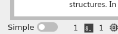
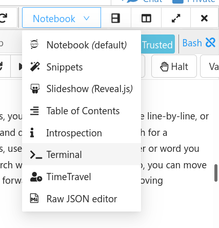

This is not a tutorial like most GTN content but a fun exercise for you to play around and learn a bit about the command line, and hopefully re-inforce the skills you covered in Basic and Advanced CLI skills.

> ###  Open a Jupyter Terminal
> To best follow this tutorial, you should open a terminal.
>
> Here are some instructions for how to do this on various environments.
>
> **Jupyter** on UseGalaxy.\* and **MyBinder.org**
>
> 1. Use the File → New → Terminal menu to launch a terminal.
>
>    
>
> 2. Disable "Simple" mode in the bottom left hand corner, if it activated.
>
>    
>
> 3. Drag one of the terminal or notebook tabs to the side to have the training materials and terminal side-by-side
>
>    
>
> **CoCalc**
>
> 1. Use the *Split View* functionality of cocalc to split your view into two portions.
>
>    
>
> 2. Change the view of one panel to a terminal
>
>    
>
{: .hands_on}

## Setup

```bash
git clone https://gitlab.com/slackermedia/bashcrawl
cd bashcrawl/entrance
# Run: cat scroll
```

Have fun, and good luck!
