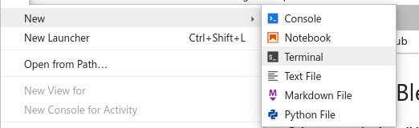
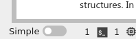
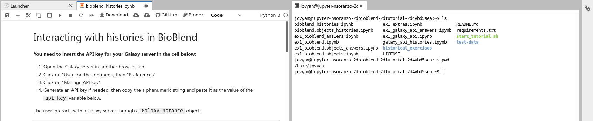
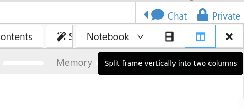
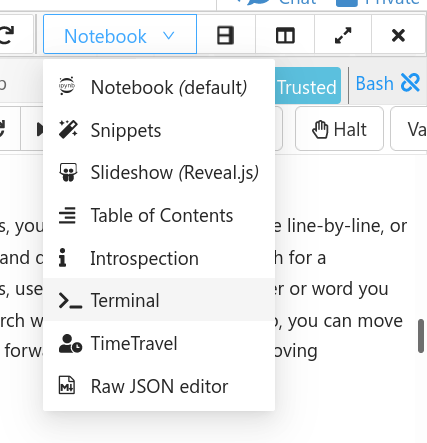
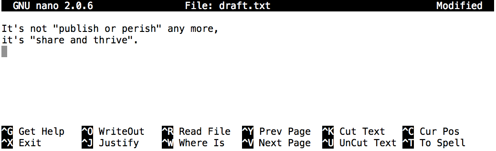

This tutorial will walk you through the basics of how to use the Unix command line.

> ###  Comment
>
> This tutorial is **significantly** based on [the Carpentries](https://carpentries.org) ["The Unix Shell"](https://swcarpentry.github.io/shell-novice/) lesson, which is licensed CC-BY 4.0. Adaptations have been made to make this work better in a GTN/Galaxy environment.
>
{: .comment}


> ### Agenda
>
> In this tutorial, we will cover:
>
> 1. TOC
> {:toc}
>
{: .agenda}

# Background


Humans and computers commonly interact in many different ways, such as through a keyboard and mouse,
touch screen interfaces, or using speech recognition systems.
The most widely used way to interact with personal computers is called a
**graphical user interface** (GUI).
With a GUI, we give instructions by clicking a mouse and using menu-driven interactions.

While the visual aid of a GUI makes it intuitive to learn,
this way of delivering instructions to a computer scales very poorly.
Imagine the following task:
for a literature search, you have to copy the third line of one thousand text files in one thousand
different directories and paste it into a single file.
Using a GUI, you would not only be clicking at your desk for several hours,
but you could potentially also commit an error in the process of completing this repetitive task.
This is where we take advantage of the Unix shell.
The Unix shell is both a **command-line interface** (CLI) and a scripting language,
allowing such repetitive tasks to be done automatically and fast.
With the proper commands, the shell can repeat tasks with or without some modification
as many times as we want.
Using the shell, the task in the literature example can be accomplished in seconds.

## Setup

Before we do anything, we'll get you setup with some test data which can help
guide your exploration of the CLI.

```bash
cd ~/
mkdir -p Desktop/
cd Desktop/
wget -c https://github.com/swcarpentry/shell-novice/raw/2929ba2cbb1bcb5ff0d1b4100c6e58b96e155fd1/data/shell-lesson-data.zip
unzip -u shell-lesson-data.zip
```


## The Shell

The shell is a program where users can type commands.
With the shell, it's possible to invoke complicated programs like climate modeling software
or simple commands that create an empty directory with only one line of code.
The most popular Unix shell is Bash (the Bourne Again SHell ---
so-called because it's derived from a shell written by Stephen Bourne).
Bash is the default shell on most modern implementations of Unix and in most packages that provide
Unix-like tools for Windows.

Using the shell will take some effort and some time to learn.
While a GUI presents you with choices to select, CLI choices are not automatically presented to you,
so you must learn a few commands like new vocabulary in a language you're studying.
However, unlike a spoken language, a small number of "words" (i.e. commands) gets you a long way,
and we'll cover those essential few today.

The grammar of a shell allows you to combine existing tools into powerful
pipelines and handle large volumes of data automatically. Sequences of
commands can be written into a *script*, improving the reproducibility of
workflows.

In addition, the command line is often the easiest way to interact with remote machines
and supercomputers.
Familiarity with the shell is near essential to run a variety of specialized tools and resources
including high-performance computing systems.
As clusters and cloud computing systems become more popular for scientific data crunching,
being able to interact with the shell is becoming a necessary skill.
We can build on the command-line skills covered here
to tackle a wide range of scientific questions and computational challenges.

Let's get started.

When the shell is first opened, you are presented with a **prompt**,
indicating that the shell is waiting for input.

```
$
```

The shell typically uses `$ ` as the prompt, but may use a different symbol.
In the examples for this lesson, we will **not** include this prompt!

Most importantly:
when typing commands, either from these lessons or from other sources,
*do not type the prompt*, only the commands that follow it.
Also note that after you type a command, you have to press the <kbd>Enter</kbd> key to execute it.

The prompt is followed by a **text cursor**, a character that indicates the position where your
typing will appear.
The cursor is usually a flashing or solid block, but it can also be an underscore or a pipe.
You may have seen it in a text editor program, for example.

So let's try our first command, `ls` which is short for listing.


> ###  Open a Jupyter Terminal
> This tutorial will let you accomplish almost everything from this view, running code in the cells below directly in the training material. You can choose between running the code here, or opening up a terminal tab in which to run it.
>
> Here are some instructions for how to do this on various environments.
>
> **Jupyter** on UseGalaxy.\* and **MyBinder.org**
>
> 1. Use the File → New → Terminal menu to launch a terminal.
>
>    
>
> 2. Disable "Simple" mode in the bottom left hand corner, if it activated.
>
>    
>
> 3. Drag one of the terminal or notebook tabs to the side to have the training materials and terminal side-by-side
>
>    
>
> **CoCalc**
>
> 1. Use the *Split View* functionality of cocalc to split your view into two portions.
>
>    
>
> 2. Change the view of one panel to a terminal
>
>    
>
{: .hands_on}

This command will list the contents of the current directory:

```bash
ls
```

> ###  Command not found
> If the shell can't find a program whose name is the command you typed, it
> will print an error message such as:
>
> > ###  Input: Bash
> > ```
> > $ ks
> > ```
> {: .code-in}
>
> > ###  Output
> > ```
> > ks: command not found
> > ```
> {: .code-out}
>
> This might happen if the command was mis-typed or if the program corresponding to that command
> is not installed.
{: .tip }


## Nelle's Pipeline: A Typical Problem

Nelle Nemo, a marine biologist,
has just returned from a six-month survey of the
[North Pacific Gyre](http://en.wikipedia.org/wiki/North_Pacific_Gyre),
where she has been sampling gelatinous marine life in the
[Great Pacific Garbage Patch](http://en.wikipedia.org/wiki/Great_Pacific_Garbage_Patch).
She has 1520 samples that she's run through an assay machine to measure the relative abundance
of 300 proteins.
She needs to run these 1520 files through an imaginary program called `goostats.sh` she inherited.
On top of this huge task, she has to write up results by the end of the month so her paper
can appear in a special issue of *Aquatic Goo Letters*.

The bad news is that if she has to run `goostats.sh` by hand using a GUI,
she'll have to select and open a file 1520 times.
If `goostats.sh` takes 30 seconds to run each file, the whole process will take more than 12 hours
of Nelle's attention.
With the shell, Nelle can instead assign her computer this mundane task while she focuses
her attention on writing her paper.

The next few lessons will explore the ways Nelle can achieve this.
More specifically,
they explain how she can use a command shell to run the `goostats.sh` program,
using loops to automate the repetitive steps of entering file names,
so that her computer can work while she writes her paper.

As a bonus,
once she has put a processing pipeline together,
she will be able to use it again whenever she collects more data.

In order to achieve her task, Nelle needs to know how to:
- navigate to a file/directory
- create a file/directory
- check the length of a file
- chain commands together
- retrieve a set of files
- iterate over files
- run a shell script containing her pipeline

# Navigating Files and Directories

The part of the operating system responsible for managing files and directories
is called the **file system**.
It organizes our data into files,
which hold information,
and directories (also called 'folders'),
which hold files or other directories.

Several commands are frequently used to create, inspect, rename, and delete files and directories.
To start exploring them, we'll go to our open shell window.

First, let's find out where we are by running a command called `pwd`
(which stands for 'print working directory'). Directories are like *places*, at any time
while we are using the shell, we are in exactly one place called
our **current working directory**. Commands mostly read and write files in the
current working directory, i.e. 'here', so knowing where you are before running
a command is important. `pwd` shows you where you are:

```bash
pwd
```

Try running it now.

> ###  Home Directory Variation
>
> The home directory path will look different on different operating systems.
>
> Linux         | OSX            | Jupyter (UseGalaxy/Binder) | CoCalc
> ---           | --             | ---                        | ---
> `/home/nelle` | `/Users/nelle` | `/home/joyvan`             | `/projects/<id>`
>
> On Windows, it will be similar to `C:\Documents and Settings\nelle` or `C:\Users\nelle`.
> (Note that it may look slightly different for different versions of Windows.)
> In future examples, we've used Mac output as the default - Linux and Windows
> output may differ slightly but should be generally similar.
>
> We will also assume that your `pwd` command returns your user's home directory.
> If `pwd` returns something different, you may need to navigate there using `cd`
> or some commands in this lesson will not work as written.
> See [Exploring Other Directories](#exploring-other-directories) for more details
> on the `cd` command.
{: .tip}

To understand what a 'home directory' is,
let's have a look at how the file system as a whole is organized.  For the
sake of this example, we'll be
illustrating the filesystem on our scientist Nelle's computer.  After this
illustration, you'll be learning commands to explore your own filesystem,
which will be constructed in a similar way, but not be exactly identical.

On Nelle's computer, the filesystem looks like this:


At the top is the **root directory**
that holds everything else.
We refer to it using a slash character, `/`, on its own;
this character is the leading slash in `/Users/nelle`.

Inside that directory are several other directories:
`bin` (which is where some built-in programs are stored),
`data` (for miscellaneous data files),
`Users` (where users' personal directories are located),
`tmp` (for temporary files that don't need to be stored long-term),
and so on.

We know that our current working directory `/Users/nelle` is stored inside `/Users`
because `/Users` is the first part of its name.
Similarly,
we know that `/Users` is stored inside the root directory `/`
because its name begins with `/`.

> ## Slashes
>
> Notice that there are two meanings for the `/` character.
> When it appears at the front of a file or directory name,
> it refers to the root directory. When it appears *inside* a path,
> it's just a separator.
{: .tip}

Underneath `/Users`,
we find one directory for each user with an account on Nelle's machine,
her colleagues *imhotep* and *larry*.


The user *imhotep*'s files are stored in `/Users/imhotep`,
user *larry*'s in `/Users/larry`,
and Nelle's in `/Users/nelle`.  Because Nelle is the user in our
examples here, therefore we get `/Users/nelle` as our home directory.
Typically, when you open a new command prompt, you will be in
your home directory to start.

Now let's learn the command that will let us see the contents of our
own filesystem.  We can see what's in our home directory by running `ls`:

```bash
ls
```

`ls` prints the names of the files and directories in the current directory.
We can make its output more comprehensible by using the `-F` **option**
(also known as a **switch** or a **flag**),
which tells `ls` to classify the output
by adding a marker to file and directory names to indicate what they are:
- a trailing `/` indicates that this is a directory
- `@` indicates a link
- `*` indicates an executable

Depending on your default options,
the shell might also use colors to indicate whether each entry is a file or
directory.

```bash
ls -F
```

Here,
we can see that our home directory contains only **sub-directories**.
Any names in our output that don't have a classification symbol
are plain old **files**.

> ###  Real Terminal Tip: Clearing your terminal
>
> If your screen gets too cluttered, you can clear your terminal using the
> `clear` command. You can still access previous commands using <kbd>↑</kbd>
> and <kbd>↓</kbd> to move line-by-line, or by scrolling in your terminal.
{: .tip}


### Getting help

`ls` has lots of other **options**. There are two common ways to find out how
to use a command and what options it accepts:

1. We can pass a `--help` option to the command,
2. We can read its manual with `man`

#### The `--help` option

Many bash commands, and programs that people have written that can be
run from within bash, support a `--help` option to display more
information on how to use the command or program.

```bash
ls --help
```

> ###  Unsupported command-line options
> If you try to use an option (flag) that is not supported, `ls` and other commands
> will usually print an error message similar to:
>
> > ###  Input: Bash
> > ```
> > ls -j
> > ```
> {: .code-in}
>
> > ###  Output
> > ```
> > ls: invalid option -- 'j'
> > Try 'ls --help' for more information.
> > ```
> {: .code-out}
>
{: .tip}

#### The `man` command

The other way to learn about `ls` is to type

> ###  Input: Bash
> ```
> $ man ls
> ```
{: .code-in}

> ###  Output
> ```
> LS(1)                                                          User Commands                                                          LS(1)
>
> NAME
>        ls - list directory contents
>
> SYNOPSIS
>        ls [OPTION]... [FILE]...
>
> DESCRIPTION
>        List information about the FILEs (the current directory by default).  Sort entries alphabetically if none of -cftuvSUX nor --sort is
>        specified.
>
>        Mandatory arguments to long options are mandatory for short options too.
>
>        -a, --all
>               do not ignore entries starting with .
>
>        -A, --almost-all
>               do not list implied . and ..
>
>        --author
>               with -l, print the author of each file
>
>        -b, --escape
>               print C-style escapes for nongraphic characters
>
>        --block-size=SIZE
>               with -l, scale sizes by SIZE when printing them; e.g., '--block-size=M'; see SIZE format below
>
>        -B, --ignore-backups
>               do not list implied entries ending with ~
>
>        -c     with -lt: sort by, and show, ctime (time of last modification of file status information); with -l: show ctime  and  sort  by
>               name; otherwise: sort by ctime, newest first
>
>        -C     list entries by columns
>
>        --color[=WHEN]
>               colorize the output; WHEN can be 'always' (default if omitted), 'auto', or 'never'; more info below
>
> ```
{: .code-out}

This command will turn your terminal into a page with a description
of the `ls` command and its options.

To navigate through the `man` pages,
you may use <kbd>↑</kbd> and <kbd>↓</kbd> to move line-by-line,
or try <kbd>B</kbd> and <kbd>Spacebar</kbd> to skip up and down by a full page.
To search for a character or word in the `man` pages,
use <kbd>/</kbd> followed by the character or word you are searching for.
Sometimes a search will result in multiple hits.
If so, you can move between hits using <kbd>N</kbd> (for moving forward) and
<kbd>Shift</kbd>+<kbd>N</kbd> (for moving backward).

To **quit** the `man` pages, press <kbd>Q</kbd>.

> ###  Manual pages on the web
>
> Of course, there is a third way to access help for commands:
> searching the internet via your web browser.
> When using internet search, including the phrase `unix man page` in your search
> query will help to find relevant results.
>
> GNU provides links to its
> [manuals](http://www.gnu.org/manual/manual.html) including the
> [core GNU utilities](http://www.gnu.org/software/coreutils/manual/coreutils.html),
> which covers many commands introduced within this lesson.
{: .tip}

> ###  Exploring More `ls` Flags
>
> You can also use two options at the same time. What does the command `ls` do when used
> with the `-l` option? What about if you use both the `-l` and the `-h` option?
>
> Some of its output is about properties that we do not cover in this lesson (such
> as file permissions and ownership), but the rest should be useful
> nevertheless.
>
> > ###  Solution
> > The `-l` option makes `ls` use a **l**ong listing format, showing not only
> > the file/directory names but also additional information, such as the file size
> > and the time of its last modification. If you use both the `-h` option and the `-l` option,
> > this makes the file size '**h**uman readable', i.e. displaying something like `5.3K`
> > instead of `5369`.
> {: .solution}
{: .question}

> ###  Listing in Reverse Chronological Order
>
> By default, `ls` lists the contents of a directory in alphabetical
> order by name. The command `ls -t` lists items by time of last
> change instead of alphabetically. The command `ls -r` lists the
> contents of a directory in reverse order.
> Which file is displayed last when you combine the `-t` and `-r` flags?
> Hint: You may need to use the `-l` flag to see the
> last changed dates.
>
> > ###  Solution
> > The most recently changed file is listed last when using `-rt`. This
> > can be very useful for finding your most recent edits or checking to
> > see if a new output file was written.
> {: .solution}
{: .question}

```bash
# Explore the possible solutions here!
```

### Exploring Other Directories

Not only can we use `ls` on the current working directory,
but we can use it to list the contents of a different directory.
Let's take a look at our current directory by running `ls -F ~/`,
i.e.,
the command `ls` with the `-F` **option** and the [**argument**][Arguments]  `/`.
The argument `~/` tells `ls` that
we want a listing of something other than our current working directory:

```bash
ls -F ~/
```

As you may now see, using a bash shell is strongly dependent on the idea that
your files are organized in a hierarchical file system.
Organizing things hierarchically in this way helps us keep track of our work:
it's possible to put hundreds of files in our home directory,
just as it's possible to pile hundreds of printed papers on our desk,
but it's a self-defeating strategy.

Now that we know the `shell-lesson-data` directory is located in current working directory, we
can do two things.

First, we can look at its contents, using the same strategy as before, passing
a directory name to `ls`:

```bash
ls -F shell-lesson-data
```

Second, we can actually change our location to a different directory, so
we are no longer located in
our home directory.

The command to change locations is `cd` followed by a
directory name to change our working directory.
`cd` stands for 'change directory',
which is a bit misleading:
the command doesn't change the directory;
it changes the shell's idea of what directory we are in.
The `cd` command is akin to double clicking a folder in a graphical interface to get into a folder.

Let's say we want to move to the `data` directory we saw above. We can
use the following series of commands to get there:

```bash
cd shell-lesson-data
```

These commands will move us into
the `shell-lesson-data` directory, then into the `data` directory.
You will notice that `cd` doesn't print anything. This is normal.
Many shell commands will not output anything to the screen when successfully executed.
But if we run `pwd` after it, we can see that we are now
in `/Users/nelle/Desktop/shell-lesson-data/data`.
If we run `ls -F` without arguments now,
it lists the contents of `/Users/nelle/Desktop/shell-lesson-data/data`,
because that's where we now are:

```bash
pwd
```

```bash
ls -F data/
```

We now know how to go down the directory tree (i.e. how to go into a subdirectory),
but how do we go up (i.e. how do we leave a directory and go into its parent directory)?
We might try the following:

```bash
cd shell-lesson-data
```

But we get an error! Why is this?

With our methods so far,
`cd` can only see sub-directories inside your current directory. There are
different ways to see directories above your current location; we'll start
with the simplest.

There is a shortcut in the shell to move up one directory level
that looks like this:

```bash
cd ..
```

`..` is a special directory name meaning
"the directory containing this one",
or more succinctly,
the **parent** of the current directory.
Sure enough,
if we run `pwd` after running `cd ..`, we're back in `/Users/nelle/Desktop/shell-lesson-data`:

```bash
pwd
```

The special directory `..` doesn't usually show up when we run `ls`. If we want
to display it, we can add the `-a` option to `ls -F`:

```bash
ls -F -a
```

`-a` stands for 'show all';
it forces `ls` to show us file and directory names that begin with `.`,
such as `..` (which, if we're in `/Users/nelle`, refers to the `/Users` directory).
As you can see,
it also displays another special directory that's just called `.`,
which means 'the current working directory'.
It may seem redundant to have a name for it,
but we'll see some uses for it soon.

Note that in most command line tools, multiple options can be combined
with a single `-` and no spaces between the options: `ls -F -a` is
equivalent to `ls -Fa`.

> ###  Other Hidden Files
>
> In addition to the hidden directories `..` and `.`, you may also see a file
> called `.bash_profile`. This file usually contains shell configuration
> settings. You may also see other files and directories beginning
> with `.`. These are usually files and directories that are used to configure
> different programs on your computer. The prefix `.` is used to prevent these
> configuration files from cluttering the terminal when a standard `ls` command
> is used.
{: .tip}

These three commands are the basic commands for navigating the filesystem on your computer:
`pwd`, `ls`, and `cd`. Let's explore some variations on those commands. What happens
if you type `cd` on its own, without giving
a directory?

```bash
cd
```

How can you check what happened? `pwd` gives us the answer!

```bash
pwd
```

It turns out that `cd` without an argument will return you to your home directory,
which is great if you've gotten lost in your own filesystem.

Let's try returning to the `data` directory from before. Last time, we used
three commands, but we can actually string together the list of directories
to move to `data` in one step:

```bash
cd ~/Desktop/shell-lesson-data/data
```

Check that we've moved to the right place by running `pwd` and `ls -F`.

If we want to move up one level from the data directory, we could use `cd ..`.  But
there is another way to move to any directory, regardless of your
current location.

So far, when specifying directory names, or even a directory path (as above),
we have been using **relative paths**.  When you use a relative path with a command
like `ls` or `cd`, it tries to find that location from where we are,
rather than from the root of the file system.

However, it is possible to specify the **absolute path** to a directory by
including its entire path from the root directory, which is indicated by a
leading slash. The leading `/` tells the computer to follow the path from
the root of the file system, so it always refers to exactly one directory,
no matter where we are when we run the command.

This allows us to move to our `shell-lesson-data` directory from anywhere on
the filesystem (including from inside `data`). To find the absolute path
we're looking for, we can use `pwd` and then extract the piece we need
to move to `shell-lesson-data`.

> ###  Input: Bash
> ```
> $ pwd
> ```
{: .code-in}

> ###  Output
> ```bash
> /Users/nelle/
> ```
{: .code-out}

Then we could run something like:

```
$ cd /Users/nelle/shell-lesson-data
```

Run `pwd` and `ls -F` to ensure that we're in the directory we expect. If we're not, edit the command block below to make sure we're in the correct location (`~/Desktop/shell-lesson-data/`)

```
pwd
ls -F
```

> ###  Two More Shortcuts
>
> The shell interprets a tilde (`~`) character at the start of a path to
> mean "the current user's home directory". For example, if Nelle's home
> directory is `/Users/nelle`, then `~/data` is equivalent to
> `/Users/nelle/data`. This only works if it is the first character in the
> path: `here/there/~/elsewhere` is *not* `here/there/Users/nelle/elsewhere`.
>
> Another shortcut is the `-` (dash) character. `cd` will translate `-` into
> *the previous directory I was in*, which is faster than having to remember,
> then type, the full path.  This is a *very* efficient way of moving
> *back and forth between two directories* -- i.e. if you execute `cd -` twice,
> you end up back in the starting directory.
>
> The difference between `cd ..` and `cd -` is
> that the former brings you *up*, while the latter brings you *back*.
>
> ----
> Try it out below!
{: .tip}

First navigate to `~/Desktop/shell-lesson-data` (you should already be there).

```bash
cd ~/Desktop/shell-lesson-data
```

Then `cd` into the `creatures` directory
```bash
cd creatures
```

Now if you run
```bash
cd -
```
you'll see you're back in `~/Desktop/shell-lesson-data`.
Run `cd -` again and you're back in `~/Desktop/shell-lesson-data/creatures`

> ###  Absolute vs Relative Paths
>
> Starting from `/Users/amanda/data`,
> which of the following commands could Amanda use to navigate to her home directory,
> which is `/Users/amanda`?
>
> 1. `cd .`
> 2. `cd /`
> 3. `cd /home/amanda`
> 4. `cd ../..`
> 5. `cd ~`
> 6. `cd home`
> 7. `cd ~/data/..`
> 8. `cd`
> 9. `cd ..`
>
> > ###  Solution
> > 1. No: `.` stands for the current directory.
> > 2. No: `/` stands for the root directory.
> > 3. No: Amanda's home directory is `/Users/amanda`.
> > 4. No: this command goes up two levels, i.e. ends in `/Users`.
> > 5. Yes: `~` stands for the user's home directory, in this case `/Users/amanda`.
> > 6. No: this command would navigate into a directory `home` in the current directory, if it exists.
> > 7. Yes: unnecessarily complicated, but correct.
> > 8. Yes: shortcut to go back to the user's home directory.
> > 9. Yes: goes up one level.
> {: .solution}
{: .question}

> ###  Relative Path Resolution
>
> Using the filesystem diagram below, if `pwd` displays `/Users/thing`,
> what will `ls -F ../backup` display?
>
> 1.  `../backup: No such file or directory`
> 2.  `2012-12-01 2013-01-08 2013-01-27`
> 3.  `2012-12-01/ 2013-01-08/ 2013-01-27/`
> 4.  `original/ pnas_final/ pnas_sub/`
>
> 
>
> > ###  Solution
> > 1. No: there *is* a directory `backup` in `/Users`.
> > 2. No: this is the content of `Users/thing/backup`, but with `..`, we asked for one level further up.
> > 3. No: see previous explanation.
> > 4. Yes: `../backup/` refers to `/Users/backup/`.
> {: .solution}
{: .question}

> ###  `ls` Reading Comprehension
>
> Using the filesystem diagram below,
> if `pwd` displays `/Users/backup`,
> and `-r` tells `ls` to display things in reverse order,
> what command(s) will result in the following output:
>
> ```
> pnas_sub/ pnas_final/ original/
> ```
> {: .output}
>
> 
>
> 1.  `ls pwd`
> 2.  `ls -r -F`
> 3.  `ls -r -F /Users/backup`
>
> > ###  Solution
> >  1. No: `pwd` is not the name of a directory.
> >  2. Yes: `ls` without directory argument lists files and directories in the current directory.
> >  3. Yes: uses the absolute path explicitly.
> {: .solution}
{: .question}


## General Syntax of a Shell Command
We have now encountered commands, options, and arguments,
but it is perhaps useful to formalise some terminology.

Consider the command below as a general example of a command,
which we will dissect into its component parts:

```
$ ls -F ~/Desktop/shell-lesson-data/
```

`ls` is the **command**, with an **option** `-F` and an
**argument** `/`.
We've already encountered options (also called **switches** or **flags**) which
either start with a single dash (`-`) or two dashes (`--`),
and they change the behavior of a command.
[Arguments] tell the command what to operate on (e.g. files and directories).
Sometimes options and arguments are referred to as **parameters**.
A command can be called with more than one option and more than one argument, but a
command doesn't always require an argument or an option.

Each part is separated by spaces: if you omit the space
between `ls` and `-F` the shell will look for a command called `ls-F`, which
doesn't exist. Also, capitalization can be important.
For example, `ls -s` will display the size of files and directories alongside the names,
while `ls -S` will sort the files and directories by size, as shown below:

```
$ ls -s Desktop/shell-lesson-data/data
total 116
 4 amino-acids.txt   4 animals.txt   4 morse.txt  12 planets.txt  76 sunspot.txt
 4 animal-counts     4 elements      4 pdb         4 salmon.txt
$ ls -S Desktop/shell-lesson-data/data
sunspot.txt  animal-counts  pdb        amino-acids.txt  salmon.txt
planets.txt  elements       morse.txt  animals.txt
```

Putting all that together, our command above gives us a listing
of files and directories in our shell-lesson-data folder.


### Nelle's Pipeline: Organizing Files

Knowing this much about files and directories,
Nelle is ready to organize the files that the protein assay machine will create.
First,
she creates a directory called `north-pacific-gyre`
(to remind herself where the data came from).
Inside that,
she creates a directory called `2012-07-03`,
which is the date she started processing the samples.
She used to use names like `conference-paper` and `revised-results`,
but she found them hard to understand after a couple of years.
(The final straw was when she found herself creating
a directory called `revised-revised-results-3`.)

> ###  Sorting Output
>
> Nelle names her directories 'year-month-day',
> with leading zeroes for months and days,
> because the shell displays file and directory names in alphabetical order.
> If she used month names,
> December would come before July;
> if she didn't use leading zeroes,
> November ('11') would come before July ('7'). Similarly, putting the year first
> means that June 2012 will come before June 2013.
{: .tip}

Each of her physical samples is labelled according to her lab's convention
with a unique ten-character ID,
such as 'NENE01729A'.
This ID is what she used in her collection log
to record the location, time, depth, and other characteristics of the sample,
so she decides to use it as part of each data file's name.
Since the assay machine's output is plain text,
she will call her files `NENE01729A.txt`, `NENE01812A.txt`, and so on.
All 1520 files will go into the same directory.

Now in her current directory `shell-lesson-data`,
Nelle can see what files she has using the command:

```bash
ls north-pacific-gyre/2012-07-03/
```

This command is a lot to type,
but she can let the shell do most of the work through what is called **tab completion**.
If she types:

```bash
ls nor
```

and then presses <kbd>Tab</kbd> (the tab key on her keyboard),
the shell automatically completes the directory name for her:

```
$ ls north-pacific-gyre/
```
{: .language-bash}

If she presses <kbd>Tab</kbd> again,
Bash will add `2012-07-03/` to the command,
since it's the only possible completion.
Pressing <kbd>Tab</kbd> again does nothing,
since there are 19 possibilities;
pressing <kbd>Tab</kbd> twice brings up a list of all the files,
and so on.
This is called **tab completion**,
and we will see it in many other tools as we go on.


# Working with Files and Directories

We now know how to explore files and directories,
but how do we create them in the first place?

## Step one: see where we are and what we already have

Let's go back to our `shell-lesson-data` directory on the Desktop
and use `ls -F` to see what it contains:

```bash
pwd
```

```bash
ls -F
```

You should see folders like the following, if not, you're in the wrong place!

```
creatures/  data/  molecules/  north-pacific-gyre/  notes.txt  pizza.cfg  solar.pdf  writing/
```

## Create a directory

Let's create a new directory called `thesis` using the command `mkdir thesis`
(which has no output):

```bash
mkdir thesis
```

As you might guess from its name,
`mkdir` means 'make directory'.
Since `thesis` is a relative path
(i.e., does not have a leading slash, like `/what/ever/thesis`),
the new directory is created in the current working directory:

```bash
ls -F
```

Since we've just created the `thesis` directory, there's nothing in it yet:

```bash
ls -F thesis
```

Note that `mkdir` is not limited to creating single directories one at a time.
The `-p` option allows `mkdir` to create a directory with nested subdirectories
in a single operation:

```bash
mkdir -p project/data project/results
```

The `-R` option to the `ls` command will list all nested subdirectories within a directory.
Let's use `ls -FR` to recursively list the new directory hierarchy we just created in the
`project` directory:

```bash
ls -FR project
```

It should look like:

```
project/:
data/  results/

project/data:

project/results:
```

> ###  Two ways of doing the same thing
> Using the shell to create a directory is no different than using a file explorer.
> If you open the current directory using your operating system's graphical file explorer,
> the `thesis` directory will appear there too.
> While the shell and the file explorer are two different ways of interacting with the files,
> the files and directories themselves are the same.
{: .tip}

> ###  Good names for files and directories
>
> Complicated names of files and directories can make your life painful
> when working on the command line. Here we provide a few useful
> tips for the names of your files and directories.
>
> 1. Don't use spaces.
>
>    Spaces can make a name more meaningful,
>    but since spaces are used to separate arguments on the command line
>    it is better to avoid them in names of files and directories.
>    You can use `-` or `_` instead (e.g. `north-pacific-gyre/` rather than `north pacific gyre/`).
>    To test this out, try typing `mkdir north pacific gyre`and see what directory (or directories!)
>    are made when you check with `ls -F`.
>
> 2. Don't begin the name with `-` (dash).
>
>    Commands treat names starting with `-` as options.
>
> 3. Stick with letters, numbers, `.` (period or 'full stop'), `-` (dash) and `_` (underscore).
>
>    Many other characters have special meanings on the command line.
>    We will learn about some of these during this lesson.
>    There are special characters that can cause your command to not work as
>    expected and can even result in data loss.
>
> If you need to refer to names of files or directories that have spaces
> or other special characters, you should surround the name in quotes (`""`).
{: .tip}

## Creating a text file

Let's change our working directory to `thesis` using `cd`,
then run a text editor called Nano to create a file called `draft.txt`:

```
$ cd thesis
$ nano draft.txt
```

> ###  Nano won't work in a Jupyter Notebook!
> Nano is an interactive, full screen editor. You'll need to switch to a proper
> console to do this step, if you haven't already.
>
> In JupyterLab you can find this under the top menu by clicking **File -> New -> Terminal**
{: .warning}

> ###  Which Editor?
>
> When we say, "`nano` is a text editor" we really do mean "text": it can
> only work with plain character data, not tables, images, or any other
> human-friendly media. We use it in examples because it is one of the
> least complex text editors. However, because of this trait, it may
> not be powerful enough or flexible enough for the work you need to do
> after this workshop. On Unix systems (such as Linux and macOS),
> many programmers use [Emacs](http://www.gnu.org/software/emacs/) or
> [Vim](http://www.vim.org/) (both of which require more time to learn),
> or a graphical editor such as
> [Gedit](http://projects.gnome.org/gedit/). On Windows, you may wish to
> use [Notepad++](http://notepad-plus-plus.org/).  Windows also has a built-in
> editor called `notepad` that can be run from the command line in the same
> way as `nano` for the purposes of this lesson.
>
> No matter what editor you use, you will need to know where it searches
> for and saves files. If you start it from the shell, it will (probably)
> use your current working directory as its default location. If you use
> your computer's start menu, it may want to save files in your desktop or
> documents directory instead. You can change this by navigating to
> another directory the first time you "Save As..."
{: .tip}

Let's type in a few lines of text.
Once we're happy with our text, we can press <kbd>Ctrl</kbd>+<kbd>O</kbd>
(press the <kbd>Ctrl</kbd> or <kbd>Control</kbd> key and, while
holding it down, press the <kbd>O</kbd> key) to write our data to disk
(we'll be asked what file we want to save this to:
press <kbd>Return</kbd> to accept the suggested default of `draft.txt`).



Once our file is saved, we can use <kbd>Ctrl</kbd>+<kbd>X</kbd> to quit the editor and
return to the shell.

> ###  Control, Ctrl, or ^ Key
>
> The Control key is also called the 'Ctrl' key. There are various ways
> in which using the Control key may be described. For example, you may
> see an instruction to press the <kbd>Control</kbd> key and, while holding it down,
> press the <kbd>X</kbd> key, described as any of:
>
> * `Control-X`
> * `Control+X`
> * `Ctrl-X`
> * `Ctrl+X`
> * `^X`
> * `C-x`
>
> In nano, along the bottom of the screen you'll see `^G Get Help ^O WriteOut`.
> This means that you can use `Control-G` to get help and `Control-O` to save your
> file.
{: .tip}

`nano` doesn't leave any output on the screen after it exits,
but `ls` now shows that we have created a file called `draft.txt`:

```bash
ls
```

> ###  Creating Files a Different Way
>
> We have seen how to create text files using the `nano` editor.
> Now, try the following command:
>
> ```bash
> touch my_file.txt
> ```
>
> 1.  What did the `touch` command do?
>     When you look at your current directory using the GUI file explorer,
>     does the file show up?
>
> 2.  Use `ls -l` to inspect the files.  How large is `my_file.txt`?
>
> 3.  When might you want to create a file this way?
>
> > ###  Solution
> > 1.  The `touch` command generates a new file called `my_file.txt` in
> >     your current directory.  You
> >     can observe this newly generated file by typing `ls` at the
> >     command line prompt.  `my_file.txt` can also be viewed in your
> >     GUI file explorer.
> >
> > 2.  When you inspect the file with `ls -l`, note that the size of
> >     `my_file.txt` is 0 bytes.  In other words, it contains no data.
> >     If you open `my_file.txt` using your text editor it is blank.
> >
> > 3.  Some programs do not generate output files themselves, but
> >     instead require that empty files have already been generated.
> >     When the program is run, it searches for an existing file to
> >     populate with its output.  The touch command allows you to
> >     efficiently generate a blank text file to be used by such
> >     programs.
> {: .solution}
{: .question}

```bash
# Explore the possible solutions here!
```

> ###  What's In A Name?
>
> You may have noticed that all of Nelle's files are named 'something dot
> something', and in this part of the lesson, we always used the extension
> `.txt`.  This is just a convention: we can call a file `mythesis` or
> almost anything else we want. However, most people use two-part names
> most of the time to help them (and their programs) tell different kinds
> of files apart. The second part of such a name is called the
> **filename extension** and indicates
> what type of data the file holds: `.txt` signals a plain text file, `.pdf`
> indicates a PDF document, `.cfg` is a configuration file full of parameters
> for some program or other, `.png` is a PNG image, and so on.
>
> This is *just a convention*, albeit an important one. Files contain
> bytes: it's up to us and our programs to interpret those bytes
> according to the rules for plain text files, PDF documents, configuration
> files, images, and so on.
>
> Naming a PNG image of a whale as `whale.mp3` doesn't somehow
> magically turn it into a recording of whale song, though it *might*
> cause the operating system to try to open it with a music player
> when someone double-clicks it.
{: .tip}

## Moving files and directories
Returning to the `shell-lesson-data` directory,

```bash
cd ~/Desktop/shell-lesson-data/
```

In our `thesis` directory we have a file `draft.txt`
which isn't a particularly informative name,
so let's change the file's name using `mv`,
which is short for 'move':

```bash
mv thesis/draft.txt thesis/quotes.txt
```

The first argument tells `mv` what we're 'moving',
while the second is where it's to go.
In this case,
we're moving `thesis/draft.txt` to `thesis/quotes.txt`,
which has the same effect as renaming the file.
Sure enough,
`ls` shows us that `thesis` now contains one file called `quotes.txt`:

```bash
ls thesis
```

One must be careful when specifying the target file name, since `mv` will
silently overwrite any existing file with the same name, which could
lead to data loss. An additional option, `mv -i` (or `mv --interactive`),
can be used to make `mv` ask you for confirmation before overwriting.

Note that `mv` also works on directories.

Let's move `quotes.txt` into the current working directory.
We use `mv` once again,
but this time we'll use just the name of a directory as the second argument
to tell `mv` that we want to keep the filename
but put the file somewhere new.
(This is why the command is called 'move'.)
In this case,
the directory name we use is the special directory name `.` that we mentioned earlier.

```bash
mv thesis/quotes.txt .
```

The effect is to move the file from the directory it was in to the current working directory.
`ls` now shows us that `thesis` is empty:

```bash
ls thesis
```

Alternatively, we can confirm the file `quotes.txt` is no longer present in the `thesis` directory
by explicitly trying to list it:

```bash
ls thesis/quotes.txt
```

`ls` with a filename or directory as an argument only lists the requested file or directory.
If the file given as the argument doesn't exist, the shell returns an error as we saw above.
We can use this to see that `quotes.txt` is now present in our current directory:

```bash
ls quotes.txt
```

> ###  Moving Files to a new folder
>
> After running the following commands,
> Jamie realizes that she put the files `sucrose.dat` and `maltose.dat` into the wrong folder.
> The files should have been placed in the `raw` folder.
>
> ```
> $ ls -F
>  analyzed/ raw/
> $ ls -F analyzed
> fructose.dat glucose.dat maltose.dat sucrose.dat
> $ cd analyzed
> ```
>
> Fill in the blanks to move these files to the `raw/` folder
> (i.e. the one she forgot to put them in)
>
> ```bash
> mv sucrose.dat maltose.dat ____/____
> ```
>
> > ###  Solution
> > ```
> > $ mv sucrose.dat maltose.dat ../raw
> > ```
> > {: .language-bash}
> > Recall that `..` refers to the parent directory (i.e. one above the current directory)
> > and that `.` refers to the current directory.
> {: .solution}
{: .question}

## Copying files and directories

The `cp` command works very much like `mv`,
except it copies a file instead of moving it.
We can check that it did the right thing using `ls`
with two paths as arguments --- like most Unix commands,
`ls` can be given multiple paths at once:

```bash
cp quotes.txt thesis/quotations.txt
ls quotes.txt thesis/quotations.txt
```

We can also copy a directory and all its contents by using the
[recursive](https://en.wikipedia.org/wiki/Recursion) option `-r`,
e.g. to back up a directory:

```bash
cp -r thesis thesis_backup
```

We can check the result by listing the contents of both the `thesis` and `thesis_backup` directory:

```bash
ls thesis thesis_backup
```

> ###  Renaming Files
>
> Suppose that you created a plain-text file in your current directory to contain a list of the
> statistical tests you will need to do to analyze your data, and named it: `statstics.txt`
>
> After creating and saving this file you realize you misspelled the filename! You want to
> correct the mistake, which of the following commands could you use to do so?
>
> 1. `cp statstics.txt statistics.txt`
> 2. `mv statstics.txt statistics.txt`
> 3. `mv statstics.txt .`
> 4. `cp statstics.txt .`
>
> > ###  Solution
> > 1. No.  While this would create a file with the correct name,
> > the incorrectly named file still exists in the directory
> > and would need to be deleted.
> > 2. Yes, this would work to rename the file.
> > 3. No, the period(.) indicates where to move the file, but does not provide a new file name;
> > identical file names
> > cannot be created.
> > 4. No, the period(.) indicates where to copy the file, but does not provide a new file name;
> > identical file names cannot be created.
> {: .solution}
{: .question}

> ###  Moving and Copying
>
> What is the output of the closing `ls` command in the sequence shown below?
>
> > ###  Input: Bash
> > ```
> > pwd
> > ```
> {: .code-in}
>
> > ###  Output
> > ```
> > /Users/jamie/data
> > ```
> {: .code-out}
>
> > ###  Input: Bash
> > ```
> > ls
> > ```
> {: .code-in}
>
> > ###  Output
> > ```
> > proteins.dat
> > ```
> {: .code-out}
>
>
> > ###  Input: Bash
> > ```
> > mkdir recombined
> > mv proteins.dat recombined/
> > cp recombined/proteins.dat ../proteins-saved.dat
> > ls
> > ```
> {: .code-in}
>
> 1.   `proteins-saved.dat recombined`
> 2.   `recombined`
> 3.   `proteins.dat recombined`
> 4.   `proteins-saved.dat`
>
> > ###  Solution
> > We start in the `/Users/jamie/data` directory, and create a new folder called `recombined`.
> > The second line moves (`mv`) the file `proteins.dat` to the new folder (`recombined`).
> > The third line makes a copy of the file we just moved.
> > The tricky part here is where the file was copied to.
> > Recall that `..` means 'go up a level', so the copied file is now in `/Users/jamie`.
> > Notice that `..` is interpreted with respect to the current working
> > directory, **not** with respect to the location of the file being copied.
> > So, the only thing that will show using ls (in `/Users/jamie/data`) is the recombined folder.
> >
> > 1. No, see explanation above. `proteins-saved.dat` is located at `/Users/jamie`
> > 2. Yes
> > 3. No, see explanation above. `proteins.dat` is located at `/Users/jamie/data/recombined`
> > 4. No, see explanation above. `proteins-saved.dat` is located at `/Users/jamie`
> >
> {: .solution}
{: .question}

## Removing files and directories

Returning to the `shell-lesson-data` directory,
let's tidy up this directory by removing the `quotes.txt` file we created.
The Unix command we'll use for this is `rm` (short for 'remove'):

```bash
rm quotes.txt
```

We can confirm the file has gone using `ls`:

```bash
ls quotes.txt
```

> ## Deleting Is Forever
>
> The Unix shell doesn't have a trash bin that we can recover deleted
> files from (though most graphical interfaces to Unix do).  Instead,
> when we delete files, they are unlinked from the file system so that
> their storage space on disk can be recycled. Tools for finding and
> recovering deleted files do exist, but there's no guarantee they'll
> work in any particular situation, since the computer may recycle the
> file's disk space right away.
{: .tip}


> ###  Using `rm` Safely
>
> What happens when we execute `rm -i thesis_backup/quotations.txt`?
> Why would we want this protection when using `rm`?
>
> > ###  Solution
> > ```
> > $ rm: remove regular file 'thesis_backup/quotations.txt'? y
> > ```
> > {: .language-bash}
> > The `-i` option will prompt before (every) removal (use <kbd>Y</kbd> to confirm deletion
> > or <kbd>N</kbd> to keep the file).
> > The Unix shell doesn't have a trash bin, so all the files removed will disappear forever.
> > By using the `-i` option, we have the chance to check that we are deleting only the files
> > that we want to remove.
> {: .solution}
{: .question}


If we try to remove the `thesis` directory using `rm thesis`,
we get an error message:

```bash
rm thesis
```

This happens because `rm` by default only works on files, not directories.

`rm` can remove a directory *and all its contents* if we use the
recursive option `-r`, and it will do so *without any confirmation prompts*:

```bash
rm -r thesis
```

Given that there is no way to retrieve files deleted using the shell,
`rm -r` *should be used with great caution*
(you might consider adding the interactive option `rm -r -i`).

## Operations with multiple files and directories

Oftentimes one needs to copy or move several files at once.
This can be done by providing a list of individual filenames,
or specifying a naming pattern using wildcards.

> ###  Copy with Multiple Filenames
>
> For this exercise, you can test the commands in the `shell-lesson-data/data` directory.
>
> In the example below, what does `cp` do when given several filenames and a directory name?
>
> > ###  Input: Bash
> > ```
> > $ mkdir backup
> > $ cp amino-acids.txt animals.txt backup/
> > ```
> {: .code-in}
>
> In the example below, what does `cp` do when given three or more file names?
>
> > ###  Input: Bash
> > ```
> > $ ls -F
> > amino-acids.txt  animals.txt  backup/  elements/  morse.txt  pdb/
> > planets.txt  salmon.txt  sunspot.txt
> > $ cp amino-acids.txt animals.txt morse.txt
> > ```
> {: .code-in}
>
> > ###  Solution
> > If given more than one file name followed by a directory name
> > (i.e. the destination directory must be the last argument),
> > `cp` copies the files to the named directory.
> >
> > If given three file names, `cp` throws an error such as the one below,
> > because it is expecting a directory name as the last argument.
> >
> > ```
> > cp: target 'morse.txt' is not a directory
> > ```
> > {: .output}
> {: .solution}
{: .question}

```bash
# Explore the possible solutions here!
```

### Using wildcards for accessing multiple files at once

> ###  Wildcards
>
> `*` is a **wildcard**, which matches zero or more  characters.
> Let's consider the `shell-lesson-data/molecules` directory:
> `*.pdb` matches `ethane.pdb`, `propane.pdb`, and every
> file that ends with '.pdb'. On the other hand, `p*.pdb` only matches
> `pentane.pdb` and `propane.pdb`, because the 'p' at the front only
> matches filenames that begin with the letter 'p'.
>
> `?` is also a wildcard, but it matches exactly one character.
> So `?ethane.pdb` would match `methane.pdb` whereas
> `*ethane.pdb` matches both `ethane.pdb`, and `methane.pdb`.
>
> Wildcards can be used in combination with each other
> e.g. `???ane.pdb` matches three characters followed by `ane.pdb`,
> giving `cubane.pdb  ethane.pdb  octane.pdb`.
>
> When the shell sees a wildcard, it expands the wildcard to create a
> list of matching filenames *before* running the command that was
> asked for. As an exception, if a wildcard expression does not match
> any file, Bash will pass the expression as an argument to the command
> as it is. For example, typing `ls *.pdf` in the `molecules` directory
> (which contains only files with names ending with `.pdb`) results in
> an error message that there is no file called `*.pdf`.
> However, generally commands like `wc` and `ls` see the lists of
> file names matching these expressions, but not the wildcards
> themselves. It is the shell, not the other programs, that deals with
> expanding wildcards.
{: .tip}

> ###  List filenames matching a pattern
>
> When run in the `molecules` directory, which `ls` command(s) will
> produce this output?
>
> `ethane.pdb   methane.pdb`
>
> 1. `ls *t*ane.pdb`
> 2. `ls *t?ne.*`
> 3. `ls *t??ne.pdb`
> 4. `ls ethane.*`
>
> > ###  Solution
> >  The solution is `3.`
> >
> > `1.` shows all files whose names contain zero or more characters (`*`)
> > followed by the letter `t`,
> > then zero or more characters (`*`) followed by `ane.pdb`.
> > This gives `ethane.pdb  methane.pdb  octane.pdb  pentane.pdb`.
> >
> > `2.` shows all files whose names start with zero or more characters (`*`) followed by
> > the letter `t`,
> > then a single character (`?`), then `ne.` followed by zero or more characters (`*`).
> > This will give us `octane.pdb` and `pentane.pdb` but doesn't match anything
> > which ends in `thane.pdb`.
> >
> > `3.` fixes the problems of option 2 by matching two characters (`??`) between `t` and `ne`.
> > This is the solution.
> >
> > `4.` only shows files starting with `ethane.`.
> {: .solution}
{: .question}

```bash
# Explore the possible solutions here!
```

> ###  More on Wildcards
>
> Sam has a directory containing calibration data, datasets, and descriptions of
> the datasets:
>
> ```
> .
> ├── 2015-10-23-calibration.txt
> ├── 2015-10-23-dataset1.txt
> ├── 2015-10-23-dataset2.txt
> ├── 2015-10-23-dataset_overview.txt
> ├── 2015-10-26-calibration.txt
> ├── 2015-10-26-dataset1.txt
> ├── 2015-10-26-dataset2.txt
> ├── 2015-10-26-dataset_overview.txt
> ├── 2015-11-23-calibration.txt
> ├── 2015-11-23-dataset1.txt
> ├── 2015-11-23-dataset2.txt
> ├── 2015-11-23-dataset_overview.txt
> ├── backup
> │   ├── calibration
> │   └── datasets
> └── send_to_bob
>     ├── all_datasets_created_on_a_23rd
>     └── all_november_files
> ```
>
> Before heading off to another field trip, she wants to back up her data and
> send some datasets to her colleague Bob. Sam uses the following commands
> to get the job done:
>
> ```
> $ cp *dataset* backup/datasets
> $ cp ____calibration____ backup/calibration
> $ cp 2015-____-____ send_to_bob/all_november_files/
> $ cp ____ send_to_bob/all_datasets_created_on_a_23rd/
> ```
>
> Help Sam by filling in the blanks.
>
> The resulting directory structure should look like this
>
> ```
> .
> ├── 2015-10-23-calibration.txt
> ├── 2015-10-23-dataset1.txt
> ├── 2015-10-23-dataset2.txt
> ├── 2015-10-23-dataset_overview.txt
> ├── 2015-10-26-calibration.txt
> ├── 2015-10-26-dataset1.txt
> ├── 2015-10-26-dataset2.txt
> ├── 2015-10-26-dataset_overview.txt
> ├── 2015-11-23-calibration.txt
> ├── 2015-11-23-dataset1.txt
> ├── 2015-11-23-dataset2.txt
> ├── 2015-11-23-dataset_overview.txt
> ├── backup
> │   ├── calibration
> │   │   ├── 2015-10-23-calibration.txt
> │   │   ├── 2015-10-26-calibration.txt
> │   │   └── 2015-11-23-calibration.txt
> │   └── datasets
> │       ├── 2015-10-23-dataset1.txt
> │       ├── 2015-10-23-dataset2.txt
> │       ├── 2015-10-23-dataset_overview.txt
> │       ├── 2015-10-26-dataset1.txt
> │       ├── 2015-10-26-dataset2.txt
> │       ├── 2015-10-26-dataset_overview.txt
> │       ├── 2015-11-23-dataset1.txt
> │       ├── 2015-11-23-dataset2.txt
> │       └── 2015-11-23-dataset_overview.txt
> └── send_to_bob
>     ├── all_datasets_created_on_a_23rd
>     │   ├── 2015-10-23-dataset1.txt
>     │   ├── 2015-10-23-dataset2.txt
>     │   ├── 2015-10-23-dataset_overview.txt
>     │   ├── 2015-11-23-dataset1.txt
>     │   ├── 2015-11-23-dataset2.txt
>     │   └── 2015-11-23-dataset_overview.txt
>     └── all_november_files
>         ├── 2015-11-23-calibration.txt
>         ├── 2015-11-23-dataset1.txt
>         ├── 2015-11-23-dataset2.txt
>         └── 2015-11-23-dataset_overview.txt
> ```
>
> > ###  Solution
> >
> > ```
> > cp *calibration.txt backup/calibration
> > cp 2015-11-* send_to_bob/all_november_files/
> > cp *-23-dataset* send_to_bob/all_datasets_created_on_a_23rd/
> > ```
> >
> {: .solution}
{: .question}

```bash
# Explore the possible solutions here!
```

> ###  Organizing Directories and Files
>
> Jamie is working on a project and she sees that her files aren't very well
> organized:
>
> ```
> $ ls -F
> analyzed/  fructose.dat    raw/   sucrose.dat
> ```
>
> The `fructose.dat` and `sucrose.dat` files contain output from her data
> analysis. What command(s) covered in this lesson does she need to run
> so that the commands below will produce the output shown?
>
> ```
> $ ls -F
> analyzed/   raw/
> $ ls analyzed
> fructose.dat    sucrose.dat
> ```
>
> > ###  Solution
> > ```
> > mv *.dat analyzed
> > ```
> > {: .language-bash}
> > Jamie needs to move her files `fructose.dat` and `sucrose.dat` to the `analyzed` directory.
> > The shell will expand *.dat to match all .dat files in the current directory.
> > The `mv` command then moves the list of .dat files to the 'analyzed' directory.
> {: .solution}
{: .question}

```bash
# Explore the possible solutions here!
```

> ###  Reproduce a folder structure
>
> You're starting a new experiment and would like to duplicate the directory
> structure from your previous experiment so you can add new data.
>
> Assume that the previous experiment is in a folder called '2016-05-18',
> which contains a `data` folder that in turn contains folders named `raw` and
> `processed` that contain data files.  The goal is to copy the folder structure
> of the `2016-05-18-data` folder into a folder called `2016-05-20`
> so that your final directory structure looks like this:
>
> ```
> 2016-05-20/
> └── data
>    ├── processed
>    └── raw
> ```
>
> Which of the following set of commands would achieve this objective?
> What would the other commands do?
>
> > ###  Option 1
> > ```
> > $ mkdir 2016-05-20
> > $ mkdir 2016-05-20/data
> > $ mkdir 2016-05-20/data/processed
> > $ mkdir 2016-05-20/data/raw
> > ```
> {: .code-in}
>
> > ###  Option 2
> > ```
> > $ mkdir 2016-05-20
> > $ cd 2016-05-20/
> > $ mkdir data/
> > $ cd data
> > $ mkdir raw processed
> > ```
> {: .code-in}
>
>
> > ###  Option 3
> > ```
> > $ mkdir 2016-05-20/data/raw
> > $ mkdir 2016-05-20/data/processed
> > ```
> {: .code-in}
>
> > ###  Option 4
> > ```
> > $ mkdir -p 2016-05-20/data/raw
> > $ mkdir -p 2016-05-20/data/processed
> > ```
> {: .code-in}
>
> > ###  Option 5
> > ```
> > $ mkdir 2016-05-20
> > $ cd 2016-05-20
> > $ mkdir data
> > $ mkdir raw processed
> > ```
> {: .code-in}
>
> > ###  Solution
> > The first two sets of commands achieve this objective.
> > The first set uses relative paths to create the top-level directory before
> > the subdirectories.
> >
> > The third set of commands will give an error because the default behavior of `mkdir`
> > won't create a subdirectory of a non-existent directory:
> > the intermediate level folders must be created first.
> >
> > The fourth set of commands achieve this objective. Remember, the `-p` option,
> > followed by a path of one or more
> > directories, will cause `mkdir` to create any intermediate subdirectories as required.
> >
> > The final set of commands generates the 'raw' and 'processed' directories at the same level
> > as the 'data' directory.
> {: .solution}
{: .question}

```bash
# Explore the possible solutions here!
```


[Arguments]: https://swcarpentry.github.io/shell-novice/reference.html#argument
