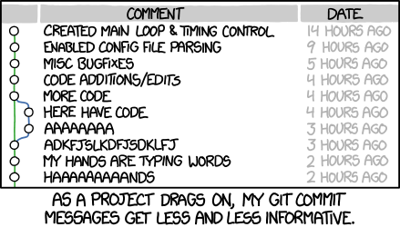

> <comment-title>Source</comment-title>
> This tutorial contains text from [this tutorial](https://github.com/rdadolf/git-tutorial/) by Robert Adolf ([@rdadolf](https://github.com/rdadolf)), which is licensed CC-BY.
{: .comment}

Version control is a way of tracking the change history of a project. Even if you have never used a version control tool, you've probably already done it manually: copying and renaming project folders ("paper-1.doc", "paper-2.doc", etc.) is a form of version control. Within bioinformatics (from research, to development, to sysadmin) a lot of us are using `git` as our primary method of source control for everything we do: notes, slides, tutorials, code, notebooks, ansible, system configuration, and more.

Git is a tool that automates and enhances a lot of the tasks that arise when dealing with larger, longer-living, and collaborative projects. It's also become the common underpinning to many popular online code repositories, GitHub being the most popular.

While it can be used collaboratively, this tutorial focuses on a single-user git repository for the most basic operations.

> <agenda-title></agenda-title>
>
> In this tutorial, you will learn how to create a git repo, and begin working with it.
>
> 1. TOC
> {:toc}
>
{: .agenda}

## Why should you use version control?

If you ask 10 people, you'll get 10 different answers, but one of the commonalities is that most people don't realize how integral it is to their development process until they've started using it. Still, for the sake of argument, here are some highlights:

- **You can undo anything**: Git provides a complete history of every change that has ever been made to your project, timestamped, commented, and attributed. If something breaks, you always have the choice of going back to a previous tate.
- **You won't need to keep undo-ing things**: One of the advantages of using git properly is that by keeping new changes separate from a stable base, you tend to avoid the massive rollbacks associated with constantly tinkering with a single code.
- **You can identify exactly when and where changes were made** (and by whom!): Git allows you to pinpoint when a particular piece of code was changed, so finding what other pieces of code a bug might affect or figuring out why a certain expression was added is easy.
- **Git forces teams to face conflicts directly**: On a team-based project, many people are often working with the same code. By having a tool which understands when and where files were changed, it's easy to see when changes might conflict with each other. While it might seem troublesome sometimes to have to deal with conflicts, the alternative—not knowing there's a conflict—is much more insidious.

## Pre-requisites

[You will need to install git, if you have not done so already.](https://git-scm.com/book/en/v2/Getting-Started-Installing-Git)

## Setting up a Repository

Let's create a new repository.

> <hands-on-title>Create a Repository</hands-on-title>
> 1. Make a new directory where you will store your files, and navigate into it.
>
>    > <code-in-title>Bash</code-in-title>
>    > ```bash
>    > mkdir git-tutorial; cd git-tutorial;
>    > ```
>    > {: data-cmd="true"}
>    {: .code-in}
>
> 2. Create or "initialise" the `git` repository with the `git init` command.
>
>    > <code-in-title>Bash</code-in-title>
>    > ```bash
>    > git init
>    > ```
>    > {: data-cmd="true"}
>    {: .code-in}
>
>    > <code-out-title></code-out-title>
>    > ```bash
>    > Initialized empty Git repository in /tmp/project/.git/
>    > ```
>    {: .code-out}
>
{: .hands_on}

This has created a folder `.git` in your project directory, here is where `git` stores all of it's data that it needs to track repository changes over time. It's not terribly interesting yet though!

> <hands-on-title>What's the status</hands-on-title>
> 1. You can always check the status of a repository with `git status`
>
>    > <code-in-title>Bash</code-in-title>
>    > ```bash
>    > git status
>    > ```
>    > {: data-cmd="true"}
>    {: .code-in}
>
>    > <code-out-title></code-out-title>
>    > ```bash
>    > On branch main
>    >
>    > No commits yet
>    >
>    > nothing to commit (create/copy files and use "git add" to track)
>    >
>    > ```
>    {: .code-out}
>
{: .hands_on}

## Adding Files

Let's add our first file, often a (pretty empty) readme file.

> <hands-on-title>What's the status</hands-on-title>
> 1. Create a new file, `readme.md` with some basic content
>
>    > <code-in-title>Bash</code-in-title>
>    > ```bash
>    > echo "My Project" > readme.md
>    > ```
>    > {: data-cmd="true"}
>    {: .code-in}
>
> 2. Add a file with `git add`. This adds it to git's staging area to be committed.
>
>    > <code-in-title>Bash</code-in-title>
>    > ```bash
>    > git add readme.md
>    > ```
>    > {: data-cmd="true"}
>    {: .code-in}
>
> 3. Commit the file! This will add it to git's log.
>
>    > <tip-title>What makes a good commit message?</tip-title>
>    > It depends a lot on the community, some have specific style guides they enforce, some don't, but in general
>    > - Keep the description short (<72 chars) and descriptive.
>    > - If you need, provide a long description as well, explaining your changes. (Use `git commit` without the `-m` flag!)
>    > [A lot has been written](https://tbaggery.com/2008/04/19/a-note-about-git-commit-messages.html) about good commit messages, search the internet and find ideas for what you think makes a good commit message!
>    >
>    > And beware of the trap we all fall into sometimes, [unhelpful commit messages](https://xkcd.com/1296/)
>    > 
>    > Even your author is [very](https://github.com/galaxyproject/gxadmin/commit/568adb703189d98da701e35c3414be35ea106184), [very](https://github.com/galaxyproject/training-material/commit/611f82d267f1426aa09863c2ac9c9006f38e3c4c) guilty of this, but you can do better!
>    {: .tip}
>
>    > <code-in-title>Bash</code-in-title>
>    > ```bash
>    > git commit -m "Add readme"
>    > ```
>    > {: data-cmd="true"}
>    {: .code-in}
>
>    > <code-out-title></code-out-title>
>    > ```bash
>    > [main (root-commit) f5ec14f] Add readme
>    >  1 file changed, 1 insertion(+)
>    >  create mode 100644 readme.md
>    > ```
>    {: .code-out}
>
> > <question-title>Is there anything left to do? Check the status</question-title>
> > Check `git status` to see if there's anything else left to resolve.
> > > <solution-title></solution-title>
> > > ```console
> > > $ git status
> > > On branch main
> > > nothing to commit, working tree clean
> > > ```
> > {: .solution}
> {: .question}
>
{: .hands_on}

Congratulations! You've made your first commit. The output of the commit command lists everything you've just done:

```
[main (root-commit) f5ec14f] Add readme
 1 file changed, 1 insertion(+)
 create mode 100644 readme.md
```

`f5ec14f` is the **commit id**, every commit you make is given a hash which uniquely refers to that specific commit. Next we see our commit message `Add readme`, a brief mention of how many files we've changed, and how many insertions or deletions we've made to the text, and lastly which files we've added.

### Exercise: Make some more commits

> <hands-on-title>Make some more commits</hands-on-title>
>
> 1. Add your name to the `readme.md` and commit your changes.
>
>    > <code-in-title>Bash</code-in-title>
>    > ```bash
>    > echo "Author: hexylena" >> readme.md
>    > git add readme.md
>    > git commit -m 'Add author name'
>    > ```
>    > {: data-cmd="true"}
>    {: .code-in}
>
> 2. Make up a project description, add it to the readme, and commit.
>
>    > <code-in-title>Bash</code-in-title>
>    > ```bash
>    > echo "This project enables stakeholders to experience synergistic effects and increase link up opportunities to improve quarterly and YOY ROI.\n" >> readme.md
>    > git add readme.md
>    > git commit -m 'Add project description'
>    > ```
>    > {: data-cmd="true"}
>    {: .code-in}
>
> 3. [Pick a license](https://spdx.org/licenses/) for your project, and mention it in the `readme.md`, and commit.
>
>    > <code-in-title>Bash</code-in-title>
>    > ```bash
>    > echo "# License\nAGPL-3.0" >> readme.md
>    > git add readme.md
>    > git commit -m 'Add project license'
>    > ```
>    > {: data-cmd="true"}
>    {: .code-in}
>
{: .hands_on}

After this step you should have ~3 commits to work with!

## Logs

One of the most helpful things about git is that, if you have written good commit messages, you can tell what you did and when!

> <hands-on-title>Check the Receipts</hands-on-title>
> 1. Check the `log` with `git log`. Notice that you can see each commit in reverse chronological order (newest at top), who made the commit, when, and what the commit message was.
>
>    > <code-in-title>Bash</code-in-title>
>    > ```bash
>    > git log
>    > ```
>    > {: data-cmd="true"}
>    {: .code-in}
>
>    > <code-in-title>Output</code-in-title>
>    > ```
>    > commit 5d05eb3ec22fd49282b585c60ef8f983d68c2fd7
>    > Author: Helena Rasche <hxr@hx42.org>
>    > Date:   Mon Jun 13 12:13:21 2022 +0200
>    >
>    >     Add project license
>    >
>    > commit 62f974ec5f538232f65b016cf073815349364efa
>    > Author: Helena Rasche <hxr@hx42.org>
>    > Date:   Mon Jun 13 12:13:16 2022 +0200
>    >
>    >     Add project description
>    >
>    > commit 10355c019c04052c15a95a817de04f9ea0ec336c
>    > Author: Helena Rasche <hxr@hx42.org>
>    > Date:   Mon Jun 13 12:13:11 2022 +0200
>    >
>    >     Add author name
>    >
>    > commit f5ec14f05384d76812fc0576df5e4af79336f4e6
>    > Author: Helena Rasche <hxr@hx42.org>
>    > Date:   Mon Jun 13 11:59:23 2022 +0200
>    >
>    >     Add readme
>    > ```
>    {: .code-in}
>
{: .hands_on}

The output of `git log` is a great way to help you remember what you were doing.

> <hands-on-title>`git log -p`</hands-on-title>
> 1. Use `git log -p` to see the log, along with which lines were changed in each commit.
{: .hands_on}

But currently this log is pretty boring, so let's replace a line and see how that looks.

> <hands-on-title>Replace a line</hands-on-title>
> 1. Update your project description in the `readme.md`, you've been told you need to support completely different features.
>
>    > <code-in-title>Bash</code-in-title>
>    > ```bash
>    > sed -i s'/enables.*ROI/creates baking recipes/g' readme.md
>    > git add readme.md
>    > git commit -m 'Update project description'
>    > ```
>    > {: data-cmd="true"}
>    {: .code-in}
>
> 2. Check what happened with the `git log -p`:
>
>    > <code-out-title>Output</code-out-title>
>    > ```bash
>    > $ git log -p
>    > commit 416a121dfcda14de0c2cb181f298b2c08950475f (HEAD -> main)
>    > Author: Helena Rasche <hxr@hx42.org>
>    > Date:   Mon Jun 13 12:18:00 2022 +0200
>    >
>    >     Update project description
>    >
>    > diff --git a/readme.md b/readme.md
>    > index befc0c9..3b8899e 100644
>    > --- a/readme.md
>    > +++ b/readme.md
>    > @@ -1,6 +1,6 @@
>    >  My Project
>    >  Author: hexylena
>    > -This project enables stakeholders to experience synergistic effects and increase link up opportunities to improve quarterly and YOY ROI.
>    > +This project creates baking recipes.
>    >
>    >  # License
>    >  AGPL-3.0
>    >
>    > ```
>    {: .code-out}
>
>    This is a diff, a comparison between two versions of a file.
>
>    
>
{: .hands_on}

### Who did that? `git blame` to the rescue

If you want to know who changed a specific line of a file, you can use `git blame` to find out it was probably your fault (as most of us experience when we check the logs.)

> <code-in-title>Bash</code-in-title>
> ```bash
> git blame readme.md
> ```
> {: data-cmd="true"}
{: .code-in}

> <code-in-title>Output</code-in-title>
> ```bash
> ^f5ec14f (Helena Rasche 2022-06-13 11:59:23 +0200 1) My Project
> 10355c01 (Helena Rasche 2022-06-13 12:13:11 +0200 2) Author: hexylena
> 416a121d (Helena Rasche 2022-06-13 12:18:00 +0200 3) This project creates baking recipes.
> 62f974ec (Helena Rasche 2022-06-13 12:13:16 +0200 4)
> 5d05eb3e (Helena Rasche 2022-06-13 12:13:21 +0200 5) # License
> 5d05eb3e (Helena Rasche 2022-06-13 12:13:21 +0200 6) AGPL-3.0
> ```
> here we can see for every line: which commit last affected it, who made that commit, and when.
{: .code-in}

## Branching

Git has the concept of branches which are most often used to manage development over time, before it's considered final. Until now you've seen `main` in your commits and commit logs (or maybe `master` if your git installation is a bit older.)

Oftentimes you'll see this pattern:

1. There is a main branch with a lot of history
1. You want to test out a new option, new configuration, new script you're working on
	1. So you make a branch
	1. Work on that branch
1. And merge it back into the `main` branch, once it's done.

This is especially relevant for any project that is shared with others, has a public view, or a deployed version of the code. There you don't want to affect anyone else using the project, or you don't want to affect the production deployment, until you're done making your changes.

> <hands-on-title>Create a new branch</hands-on-title>
>
> 1. `git switch -c <branch>` is the command used to create a new branch and switch to it.
>
>    > <code-in-title>Bash</code-in-title>
>    > ```bash
>    > git switch -c test
>    > ```
>    > {: data-cmd="true"}
>    {: .code-in}
>
>    > <code-in-title>Output</code-in-title>
>    > ```bash
>    > Switched to a new branch 'test'
>    > ```
>    {: .code-in}
>
{: .hands_on}

If you look around, you'll notice everything looks exactly the same! But in fact we are now on a different branch:

> <hands-on-title>See available branches</hands-on-title>
>
> 1. `git branch` lists our available branches, and puts an asterisk next to the one we're currently on.
>
>    > <code-in-title>Bash</code-in-title>
>    > ```bash
>    > git branch
>    > ```
>    > {: data-cmd="true"}
>    {: .code-in}
>
>    > <code-in-title>Output</code-in-title>
>    > ```bash
>    >   main
>    > * test
>    >	```
>    {: .code-in}
>
{: .hands_on}

We're now on the `test` branch, so let's make a commit.

> <hands-on-title>Add a new file</hands-on-title>
> 1. Add a new file, let's call it `docs.md`. Write something into it, it doesn't matter much what.
>
>    > <code-in-title>Bash</code-in-title>
>    > ```bash
>    > echo "# Project Documentation" > docs.md
>    > ```
>    > {: data-cmd="true"}
>    {: .code-in}
>
> 2. Add it, commit it.
>
>    > <code-in-title>Bash</code-in-title>
>    > ```bash
>    > git add docs.md
>    > git commit -m "Added documentation"
>    > ```
>    > {: data-cmd="true"}
>    {: .code-in}
>
{: .hands_on}

This file now only exists on the testing branch.

> <hands-on-title>Try Switching Branches</hands-on-title>
> 1. Try switching back and forth between the `main` and `test` branches, and check what's available on each!
>
>    > <code-in-title>Bash</code-in-title>
>    > ```bash
>    > git branch
>    > ```
>    > {: data-cmd="true"}
>    {: .code-in}
>
>    > <code-in-title>Bash</code-in-title>
>    > ```bash
>    > git switch main
>    > ls
>    > ```
>    > {: data-cmd="true"}
>    {: .code-in}
>
>    > <code-in-title>Output</code-in-title>
>    > ```console
>    > readme.md
>    > ```
>    {: .code-in}
>
>    > <code-in-title>Bash</code-in-title>
>    > ```bash
>    > git switch test
>    > ls
>    > ```
>    > {: data-cmd="true"}
>    {: .code-in}
>
>    > <code-in-title>Output</code-in-title>
>    > ```console
>    > docs.md   readme.md
>    > ```
>    {: .code-in}
>
{: .hands_on}

Each branch has a different view of the repository, and might have different changes on it. Branches are really useful to keep track of work in progress, until it's done. In a single user environment however, most people often don't use them, but once you're collaborating with other's they're incredibly important!

### Merging

Once you're done with a branch, you can merge it into the main branch. This will take all of the work you did on that branch, and make it part of the main branch.

First, let's compare the two branches, to see what changed.

> <hands-on-title>Replacing argv.</hands-on-title>
>
> 1. Compare your current branch against the `main` branch with `git diff main`
>
>    > <code-in-title>Bash</code-in-title>
>    > ```bash
>    > git diff main
>    > ```
>    > {: data-cmd="true"}
>    {: .code-in}
>
>    > <code-in-title>Output</code-in-title>
>    > ```bash
>    > diff --git a/docs.md b/docs.md
>    > new file mode 100644
>    > index 0000000..384aaaa
>    > --- /dev/null
>    > +++ b/docs.md
>    > @@ -0,0 +1 @@
>    > +# Project Documentation
>    > ```
>    {: .code-in}
>
{: .hands_on}

We can see the output shows all of our changes compared to the main branch and it looks like what we want, so, let's merge it in.

> <hands-on-title>Merge the `test` branch into `main`</hands-on-title>
> 1. Switch to the main branch
>
>    > <code-in-title>Bash</code-in-title>
>    > ```bash
>    > git switch main
>    > ```
>    > {: data-cmd="true"}
>    {: .code-in}
>
> 2. Merge in the test branch
>
>    > <code-in-title>Bash</code-in-title>
>    > ```bash
>    > git merge test
>    > ```
>    > {: data-cmd="true"}
>    {: .code-in}
>
>    > <code-in-title>Output</code-in-title>
>    > ```bash
>    > Updating 416a121..9a3387d
>    > Fast-forward
>    >  docs.md | 1 +
>    >  1 file changed, 1 insertion(+)
>    >  create mode 100644 docs.md
>    > ```
>    {: .code-in}
>
{: .hands_on}

This has merged all of the changes you made on the `test` branch into the `main` branch.

> <hands-on-title>Check the history</hands-on-title>
> 1. Check `git log -p` again to see the history.
{: .hands_on}

## Undo! Revert!

Oh no, you've decided you liked your original project description better. Let's find that commit and revert it.

> <hands-on-title>Find and revert the bad commit</hands-on-title>
>
> 1. Find the commit you want to revert, e.g. with `git log`, find the one named "Update project description" (or similar.)
>
>    > <code-in-title>Bash</code-in-title>
>    > ```bash
>    > git log
>    > ```
>    > {: data-cmd="true"}
>    {: .code-in}
>
> 2. We can use the `git revert` command to undo this commit.
>
>    > <code-in-title>Bash</code-in-title>
>    > ```bash
>    > git revert 416a121dfcda14de0c2cb181f298b2c08950475f
>    > ```
>    > {: data-cmd="true"}
>    {: .code-in}
>
{: .hands_on}

This generates a *new* commit, which reverts the older commit (and probably puts you in a text editor to edit the commit message).
This is not the only way to undo mistakes, but probably the easiest.

If you check your `git log` you'll see the change was undone in a second commit, reverting the first. So if you just look at the current files it appears we never undid it, but within the logs we can see the undo step.

With that you've got enough skills to track your own data/code/etc with git!

# Further Reading

- [git - the simple guide](https://rogerdudler.github.io/git-guide/index.html)
- [giteveryday(7) manual page, the most common commands most folks use every day](https://mirrors.edge.kernel.org/pub/software/scm/git/docs/giteveryday.html)
- [git flight rules, a convenient "how do I do X" guide](https://github.com/k88hudson/git-flight-rules)
- [do you prefer git tutorials as comics? (cw: language)](https://jvns.ca/blog/2018/10/27/new-zine--oh-shit--git-/)
