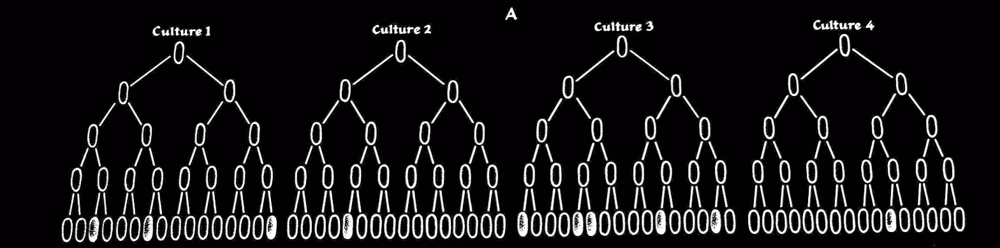
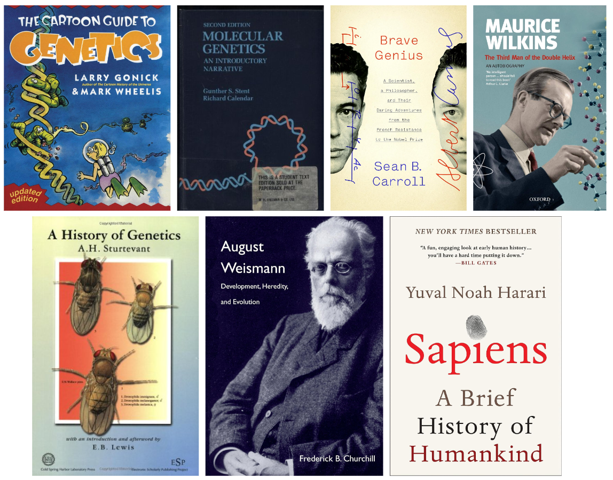

# What do you know?

This is the first lecture of the class. We will begin with a short quiz that is designed tio let me know what you do and do not know. This quiz will have no effect on your grade in this course. 

# Why history?

Knowing history is essential for understanding how we arrived to the current state of affairs in our field. It is also full of accidental discoveries and dramatic relationships making it quite interesting to read about. I strongly advise you to take a look at the manuscripts below:

## Classical publications

* 1965 : [A history of genetics](http://www.amazon.com/A-History-Genetics-A-H-Sturtevant/dp/0879696079)
* 1943 : [Delbruck & Luria](http://www.bx.psu.edu/~anton/bioinf1-2014/delbruck-luria-1943.pdf)
* 1944 : [Avery, MacLeod, & McCarty](http://www.bx.psu.edu/~anton/bioinf1-2014/avery-1944.pdf)
* 1952 : [Herhey & Chase](http://www.bx.psu.edu/~anton/bioinf1-2014/hershey-chase-1952.pdf)
* 1953 : [Watson & Crick](http://www.bx.psu.edu/~anton/bioinf1-2014/watsoncrick.pdf)
* 1958 : [Meselson & Stahl](http://www.bx.psu.edu/~anton/bioinf1-2014/Proc%20Natl%20Acad%20Sci%20USA%201958%20Meselson.pdf)
* 1960 : [Jacob and Monod](http://www.bx.psu.edu/~anton/bioinf1-2014/jacob-monod-1961.pdf)

## Popular (yet very informative) literature

------

# Let's get to it

Today's lecture will be organized as a, well, a lecture - we will be going over a set of slides linked at the beginning of this page. 

-----
