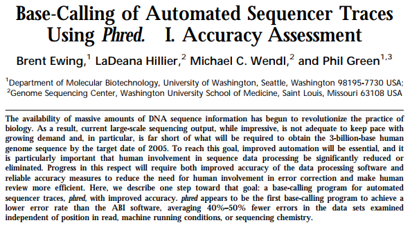
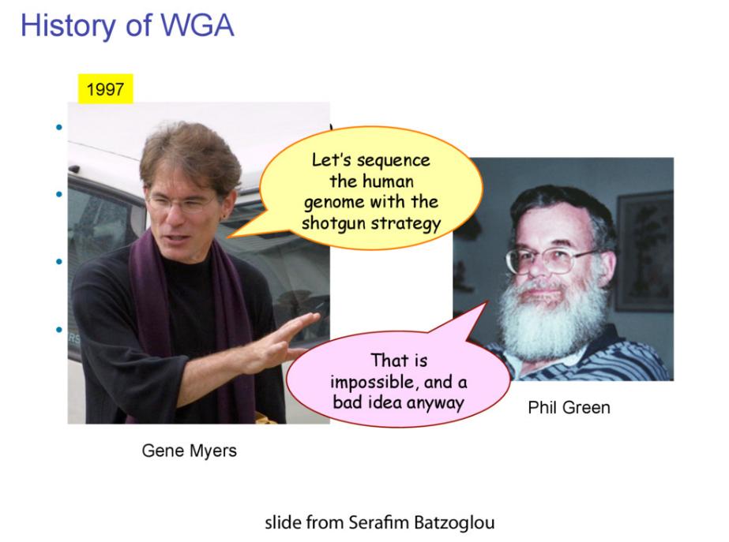

# The problem

The difficulty with sequencing nucleic acids is nicely summarized by [Hutchinson 2007](http://dx.doi.org/10.1093/nar/gkm688):

1. The chemical properties of different DNA molecules were so similar that it appeared difficult to separate them.
2. The chain length of naturally occurring DNA molecules was much greater than for proteins and made complete sequencing seems unapproachable.
3. The 20 amino acid residues found in proteins have widely varying properties that had proven useful in the separation of peptides. The existence of only four bases in DNA therefore seemed to make sequencing a more difficult problem for DNA than for protein.
4. No base-specific DNAases were known. Protein sequencing had depended upon proteases that cleave adjacent to certain amino acids.

It is therefore not surprising that protein-sequencing was developed before DNA sequencing by [Sanger and Tuppy 1951](https://www.ncbi.nlm.nih.gov/pmc/articles/PMC1197535/). 

tRNA was the first complete nucleic acid sequenced (see pioneering work of [Robert Holley and colleagues](http://www.jstor.org/stable/1715055) and also [Holley's Nobel Lecture](https://www.nobelprize.org/nobel_prizes/medicine/laureates/1968/holley-lecture.pdf)). Conceptually, Holley's approach was similar to Sanger's protein sequencing: break molecule into small pieces with RNases, determine sequences of small fragments, use overlaps between fragments to reconstruct (assemble) the final nucleotide sequence. 

The work on finding approaches to sequencing DNA molecules began in late 60s and early 70s. One of the earliest contributions has been made by Ray Wu (Cornell) and Dave Kaiser (Stanford), who used _E. coli_ DNA polymerase to [incorporate radioactively labelled nucleotides into protruding ends of bacteriphage lambda](http://www.sciencedirect.com/science/article/pii/S0022283668800129?via%3Dihub). It took several more years for the development of more "high throughput" technologies by Sanger and Maxam/Gilbert. The Sanger technique has ultimately won over Maxam/Gilbert's protocol due to its relative simplicity (once dideoxynucleotides has become commercially available) and the fact that it required smaller amount of starting material as the polymerase was used to generate fragments necessary for sequence determination. 

# Sanger/Coulson plus/minus method

><comment-title>Two Nobel prizes</comment-title>
>[Fred Sanger](https://www.nature.com/articles/505027a) is one of only [four people](https://en.wikipedia.org/wiki/Category:Nobel_laureates_with_multiple_Nobel_awards), who received two Nobel Prizes in their original form (for scientific, not societal, breakthroughs).
{: .comment}

This methods builds on idea of Wu and Kaiser (for *minus* part) and on special property of DNA polymerase isolated from phage T4 (for *plus* part). The schematics of the method is given in the following figure (from [Sanger & Coulson: 1975](http://www.sciencedirect.com/science/article/pii/0022283675902132?via%3Dihub)):

")

In this method a primer and DNA polymerase is used to synthesize DNA in the presence of P<sup>32</sup>-labeled nucleotides (only one of four is labeled). This generates P<sup>32</sup>-labeled copies of DNA being sequenced. These are then purified and (without denaturing) separated into two groups: *minus* and *plus*. Each group is further divided into four equal parts. 

In the case of *minus* polymerase and a mix of nucleotides minus one are added to each of the four aliquotes: ACG (-T), ACT (-G), CGT (-A), AGT (-C). As a result in each case DNA strand is extended up to a missing nucleotide. 

In the case of plus only one nucleotide is added to each of the four aliquotes (+A, +C, +G, and +T) and T4 DNA polymerase is used. T4 DNA polymerase acts as an exonuclease that would degrade DNA from 3'-end up to a nucleotide that is supplied in the reaction. 

The products of these are loaded into a denaturing polyacrylamide gel as a eight tracks (four for minus and four for plus; from [Sanger & Coulson: 1975](http://www.sciencedirect.com/science/article/pii/0022283675902132?via%3Dihub)):

")

# Maxam/Gilbert chemical cleavage method

In this method DNA is terminally labeled with P<sup>32</sup>, separated into four equal aliquotes.  Two of these are treated with [Dimethyl sulfate (DMSO)](https://en.wikipedia.org/wiki/Dimethyl_sulfate) and remaining two are treated with [hydrazine](https://en.wikipedia.org/wiki/Hydrazine). 

DMSO methylates G and A residues. Treatment of DMSO-incubated DNA with alkali at high temperature will break DNA chains at G and A with Gs being preferentially broken, while treatment of DMSO-incubated DNA with acid will preferentially break DNA at As. Likewise treating hydrazine-incubated DNA with [piperidine](https://en.wikipedia.org/wiki/Piperidine) breaks DNA at C and T, while DNA treated with hydrazine in the presence of NaCl preferentially brakes at Cs. The four reactions are then loaded on a gel generating the following picture (from [Maxam & Gilbert: 1977](https://www.ncbi.nlm.nih.gov/pmc/articles/PMC392330/pdf/pnas00024-0174.pdf)):

")

# Sanger dideoxy method

The original Sanger +/- method was not popular and had a number of technical limitations. In a new approach Sanger took advantage of inhibitors that stop the extension of a DNA strand at particular nucleotides. These inhibitors are dideoxy analogs of normal nucleotide triphosphates (from [Sanger et al. 1977](https://www.ncbi.nlm.nih.gov/pmc/articles/PMC431765/pdf/pnas00043-0271.pdf)):

")

# Original approaches were laborious

In the original [Sanger paper](https://www.ncbi.nlm.nih.gov/pmc/articles/PMC431765/pdf/pnas00043-0271.pdf) the authors sequenced bacteriophage phiX174 by using its own restriction fragments as primers. This was an ideal set up to show the proof of principle for the new method. This is because phiX174 DNA is homogeneous and can be isolated in large quantities. Now suppose that you would like to sequence a larger genome (say _E. coli_). Remember that the original version of Sanger method can only sequence fragments up to 200 nucleotides at a time. So to sequence the entire _E. coli_ genome (which by-the-way was not sequenced until [1997](http://science.sciencemag.org/content/277/5331/1453)) you would need to split the genome into multiple pieces and sequence each of them individually. This is hard, because to produce a readable Sanger sequencing gel each sequence must be amplified to a suitable amount (around 1 nanogram) and be homogeneous (you cannot mix multiple DNA fragments in a single reaction as it will be impossible to interpret the gel). Molecular cloning enabled by the availability of commercially available restriction enzymes and cloning vectors simplified this process. Until the onset of next generation sequencing in 2005 the process for sequencing looked something like this:

* (**1**) - Generate a collection of fragments you want to sequence. It can be a collection of fragments from a genome that was mechanically sheared or just a single fragment generated by PCR.
* (**2**) - These fragment(s) are then cloned into a plasmid vector (we will talk about other types of vectors such as BACs later in the course).
* (**3**) - Vectors are transformed into bacterial cells and positive colonies (containing vectors with insert) are picked from an agar plate.
* (**4**) - Each colony now represents a unique piece of DNA. 
* (**5**) - An individual colony is used to seed a bacterial culture that is grown overnight.
* (**6**) - Plasmid DNA is isolated from this culture and now can be used for sequencing because it is (1) homogeneous and (2) we now a sufficient amount.
* (**7**) - It is sequenced using universal primers. For example the image below shows a map for pGEM-3Z plasmid (a pUC18 derivative). Its multiple cloning site is enlarged and sites for **T7** and **SP6** sequencing primers are shown. These are the **pads** I'm referring to in the lecture. These provide universal sites that can be used to sequence any insert in between. 


")

Until the invention of NGS the above protocol was followed with some degree of automation. But you can see that it was quite laborious if the large number of fragments needed to be sequenced. This is because each of them needed to be subcloned and handled separately. This is in part why Human Genome Project, which will be discussed in future lectures in detail, took so much time to complete. 

# Evolution of sequencing machines

The simplest possible sequencing machine is a [gel rig with polyacrylamide gel](https://en.wikipedia.org/wiki/Polyacrylamide_gel_electrophoresis). Sanger used it is his protocol obtaining the following results (from [Sanger et al. 1977](https://www.ncbi.nlm.nih.gov/pmc/articles/PMC431765/pdf/pnas00043-0271.pdf)):

")

Here for sequencing each fragment four separate reactions are performed (with ddA, ddT, ggC, and ddG) and four lanes on the gel are used. [One simplification of this process](http://www.jstor.org/stable/pdf/2879539.pdf) that came in the 90s was to use fluorescently labeled dideoxy nucleotides. This is easier because everything can be performed in a single tube and uses a single lane on a gel (from Applied Biosystems [support site](https://www3.appliedbiosystems.com/cms/groups/mcb_support/documents/generaldocuments/cms_041003.pdf)):

")

However, there is still substantial labor involved in pouring the gels, loading them, running machines, and cleaning everything post-run. A significant improvement was offered by the development of capillary electrophoresis allowing automation of liquid handling and sample loading. Although several manufacturers have been developing and selling such machines a _de facto_ standard in this area was (and still is) the Applied Biosystems (ABI) Genetics and DNA Anlayzer systems. The highest throughput ABI system, 3730_xl_, had 96 capillaries and could automatically process 384 samples. 

# NGS!

384 samples may sound like a lot, but it is nothing if we are sequencing an entire genome. The beauty of NGS is that these technologies are not bound by sample handling logistics. They still require preparation of libraries, but once a library is made (which can be automated) it is processed more or less automatically to generate multiple copies of each fragment (in the case of 454, Illumina, Ion Torrent, PacBio, Oxford Nanopore, Element, Complete Genomics etc...) and loaded onto the machine, where millions of individual fragments are sequenced simultaneously. We will learn about these technologies later in this course.


# Reading

* 2001 [Overview of pyrosequencing methodology - Ronaghi](http://genome.cshlp.org/content/11/1/3)
* 2005 [Description of 454 process - Margulies et al.](http://www.nature.com/nature/journal/v437/n7057/pdf/nature03959.pdf)
* 2007 [History of pyrosequencing - Pål Nyrén](http://link.springer.com/protocol/10.1385/1-59745-377-3:1)
* 2007 [Errors in 454 data - Huse et al. ](http://genomebiology.com/content/pdf/gb-2007-8-7-r143.pdf)
* 2010 [Properties of 454 data - Balzer et al.](http://bioinformatics.oxfordjournals.org/content/26/18/i420.full.pdf+html)

## A few classical papers

In a series of now classical papers ([Paper 1](http://genome.cshlp.org/content/8/3/175.full), [Paper2](http://genome.cshlp.org/content/8/3/186.full)) Philip Green and co-workers have developed a quantitative framework for the analysis of data generated by automated DNA sequencers: 




In particular they developed a standard metric for describing the reliability of base calls:

An important technical aspect of our work is the use of log-transformed error probabilities rather than untransformed ones, which facilitates working with error rates in the range of most importance (very close to 0). Specifically, we define the quality value q assigned to a base-call to be
$$q = -10\times log_{10}(p)$$

where p is the estimated error probability for that base-call. Thus a base-call having a probability of 1/1000 of being incorrect is assigned a quality value of 30. Note that high quality values correspond to low error probabilities, and conversely.

We will be using the concept of "*quality score*" or "*phred-scaled quality score*" repeatedly in this course. 

## Myers - Green debate

Can we sequence a genome using the shotgun approach?



---
tags: BMMB554-23
---

 [](https://xkcd.com/1306)

# Lecture 5: Python 1 - Variables, expressions, statements, fuctions

----

## Quiz

The class will begin with a very short quiz. You will have results back to you today.

## Prep

1. Start [JupyterLab](https://mybinder.org/v2/gh/jupyterlab/jupyterlab-demo/try.jupyter.org?urlpath=lab)
2. Within JupyterLab start a new Python3 notebook
3. Open [this page](http://cs1110.cs.cornell.edu/tutor/#mode=edit) in a new browser tab


:::info
Preclass prep: Chapters [1](https://greenteapress.com/thinkpython2/html/thinkpython2002.html), [2](https://greenteapress.com/thinkpython2/html/thinkpython2003.html), [3](https://greenteapress.com/thinkpython2/html/thinkpython2004.html) from "Think Python"
:::

## [Indentation](https://peps.python.org/pep-0008/#indentation) is everything!

:::warning
Python is an indented language: code blocks are defined using indentation with [spaces](https://peps.python.org/pep-0008/#tabs-or-spaces)!
:::

In Python, indentation is used to indicate the scope of control structures such as `for` loops, `if` statements, and function and class definitions. The amount of indentation is not fixed, but it must be consistent within a block of code. The recommended amount of indentation is 4 spaces, although some developers prefer to use 2 spaces. Indenting is important in Python because it is used to indicate the level of nesting and structure of the code, which makes it easier to read and understand. Additionally, indentation is also used to indicate which lines of code are executed together as a block.

## The story line

In this lecture we will re-implement our Sanger sequencing simulator from the previous lecture and generate realistic gel images. 

## Generate a random sequence

First we import a module called [`random`](https://docs.python.org/3/library/random.html) which contains a number of functions for generating and working with random numbers 


```python=
import random
```

Next, we will write a simple loop that would generate a sequence of pre-set length:


```python=
seq = ''
for _ in range(100):
    seq += random.choice('ATCG')
```


```python=
seq
```


    'CTTGCGGCTATAGGAATAAAAGGCTTTGCGGGTAGTGACCGCGCCGCGTATGTAATTCATGGGTGTCGTCGCGCCCTCACAACTGCAAGGTCGTGGCACC'


## Simulate one polymerase molecule

The code below iterates through each element of a sequence `seq` (assumed to be a string containing nucleotides) and it checks if the current nucleotide is equal to 'A'. If it is, it generates a random number between 0 and 1 using the `random.random()` function.

It then checks if the random number is greater than 0.5. If it is, the code does nothing and proceeds to the next iteration. If the random number is less than or equal to 0.5, the code adds the lowercase version of the nucleotide ('a') to a string called `synthesized_strand` and then breaks out of the loop.

In every iteration of the loop, regardless of whether the nucleotide is 'A' or not, the code then adds the current nucleotide to the `synthesized_strand` string.

This means that when the current nucleotide is 'A', then the generated random number will decide whether the code will add the nucleotide 'A' or 'a' to the `synthesized_strand`, and it will break out of the loop after adding the nucleotide to the `synthesized_strand`. To get a good idea of what is going on let's visualize the code execution in 


```python=
synthesized_strand = ''

for nucleotide in seq:
    if nucleotide == 'A':
        d_or_dd = random.random()
        if d_or_dd > 0.5:
            None
        else:
            synthesized_strand += 'a'
            break
    synthesized_strand += nucleotide
```

This can be simplified by first removing `d_or_dd` variable:


```python=
synthesized_strand = ''
for nucleotide in seq:
    if nucleotide == 'A':
        if random.random() > 0.5:
            None
        else:
            synthesized_strand += 'a'
            break
    synthesized_strand += nucleotide
print(synthesized_strand)
```

    CTTGCGGCTATa


and removing unnecessary group of `if ... else` statements:


```python=
synthesized_strand = ''
for nucleotide in seq:
    if nucleotide == 'A' and random.random() > 0.5:
        synthesized_strand += 'a'
        break
    synthesized_strand += nucleotide
print(synthesized_strand)
```

    CTTGCGGCTATAGGAATa


finally let's make `synthesized_strand += 'a'` a bit more generic:


```python=
synthesized_strand = ''
for nucleotide in seq:
    if nucleotide == 'A' and random.random() > 0.5:
        synthesized_strand += nucleotide.lower()
        break
    synthesized_strand += nucleotide
print(synthesized_strand)
```

    CTTGCGGCTATAGGa


## Simulating multiple molecules

To simulate 10 polymerase molecules we simply wrap the code from above into a `for` loop:


```python=
for _ in range(10):
    synthesized_strand = ''
    for nucleotide in seq:
        if nucleotide == 'A' and random.random() > 0.5:
            synthesized_strand += nucleotide.lower()
            break
        synthesized_strand += nucleotide
    print(synthesized_strand)
```

    CTTGCGGCTa
    CTTGCGGCTa
    CTTGCGGCTa
    CTTGCGGCTa
    CTTGCGGCTa
    CTTGCGGCTa
    CTTGCGGCTATa
    CTTGCGGCTATAGGa
    CTTGCGGCTa
    CTTGCGGCTa


One problem with this code is that does not actually save the newly synthesized strand: it simply prints it. To fix this we will create a [list](https://greenteapress.com/thinkpython2/html/thinkpython2011.html) (or an array) called `new_strands` and initialize it by assigning an empty array to it:


```python=
new_strands = []
for _ in range(10):
    synthesized_strand = ''
    for nucleotide in seq:
        if nucleotide == 'A' and random.random() > 0.5:
            synthesized_strand += nucleotide.lower()
            break
        synthesized_strand += nucleotide
    new_strands.append(synthesized_strand)
```


```python=
new_strands
```


    ['CTTGCGGCTa',
     'CTTGCGGCTa',
     'CTTGCGGCTATAGGAATAa',
     'CTTGCGGCTATAGGAATa',
     'CTTGCGGCTATa',
     'CTTGCGGCTATAGGa',
     'CTTGCGGCTATAGGa',
     'CTTGCGGCTATa',
     'CTTGCGGCTATAGGa',
     'CTTGCGGCTa']


## Simulating multiple molecules and all nucleotides

And to repeat this for the remaining three nucleotides we will do the following crazy thing:


```python=
new_strands = []
for _ in range(10):
    synthesized_strand = ''
    for nucleotide in seq:
        if nucleotide == 'A' and random.random() > 0.5:
            synthesized_strand += nucleotide.lower()
            break
        synthesized_strand += nucleotide
    new_strands.append(synthesized_strand)
    
for _ in range(10):
    synthesized_strand = ''
    for nucleotide in seq:
        if nucleotide == 'C' and random.random() > 0.5:
            synthesized_strand += nucleotide.lower()
            break
        synthesized_strand += nucleotide
    new_strands.append(synthesized_strand)
    
for _ in range(10):
    synthesized_strand = ''
    for nucleotide in seq:
        if nucleotide == 'G' and random.random() > 0.5:
            synthesized_strand += nucleotide.lower()
            break
        synthesized_strand += nucleotide
    new_strands.append(synthesized_strand)
    
for _ in range(10):
    synthesized_strand = ''
    for nucleotide in seq:
        if nucleotide == 'T' and random.random() > 0.5:
            synthesized_strand += nucleotide.lower()
            break
        synthesized_strand += nucleotide
    new_strands.append(synthesized_strand)
```


```python=
len(new_strands)
```


    40


Repeating the same code four times is just plain stupid so instead we will write a function called `polymerase`. Here we need to worry about the scope of variables.  The scope of a variable refers to the regions of the code where the variable can be accessed or modified. Variables that are defined within a certain block of code (such as a function or a loop) are said to have a *local* scope, meaning that they can only be accessed within that block of code. Variables that are defined outside of any block of code are said to have a *global* scope, meaning that they can be accessed from anywhere in the code.

In most programming languages, a variable defined within a function has a local scope, and it can only be accessed within that function. If a variable with the same name is defined outside the function, it will have a global scope and can be accessed from anywhere in the code. However, if a variable with the same name is defined within the function, it will take precedence over the global variable and will be used within the function.

There are also some languages that have block scope, where a variable defined within a block (such as an if statement or a for loop) can only be accessed within that block and not outside of it.

In Python, variables defined in the main module have global scope and can be accessed from any function or module. Variables defined within a function have local scope, and they can only be accessed within that function. Variables defined within a loop or a block, can be accessed only within the scope of the loop or block.


```python=
def ddN(number_of_iterations, template, base, ddN_ratio):
    new_strands = []
    for _ in range(number_of_iterations):
        synthesized_strand = ''
        for nucleotide in template:
            if nucleotide == base and random.random() > ddN_ratio:
                synthesized_strand += nucleotide.lower()
                break
            synthesized_strand += nucleotide
        new_strands.append(synthesized_strand)
    return(new_strands)
```


```python=
ddN(10,seq,'A',0.5)
```


    ['CTTGCGGCTATAGGa',
     'CTTGCGGCTATa',
     'CTTGCGGCTATa',
     'CTTGCGGCTATAGGAATa',
     'CTTGCGGCTa',
     'CTTGCGGCTa',
     'CTTGCGGCTa',
     'CTTGCGGCTATa',
     'CTTGCGGCTATAGGa',
     'CTTGCGGCTATa']


To execute this function on all four types of ddNTPs with need to wrap it in a `for` loop iterating over the four possibilities:


```python=
for nt in 'ATCG':
    ddN(10,seq,nt,0.5)
```

## A bit about [lists](https://greenteapress.com/thinkpython2/html/thinkpython2011.html)

To store the sequences being generated in the previous loop we will create and initialize a list called `seq_run`:


```python=
seq_run = []
for nt in 'ATCG':
    seq_run.append(ddN(10,seq,nt,0.5))
```

you will see that the seq run is a two-dimensional list:


```python=
seq_run
```


    [['CTTGCGGCTa',
      'CTTGCGGCTATAGGa',
      'CTTGCGGCTa',
      'CTTGCGGCTATa',
      'CTTGCGGCTATAGGa',
      'CTTGCGGCTATa',
      'CTTGCGGCTa',
      'CTTGCGGCTATAGGAATAa',
      'CTTGCGGCTa',
      'CTTGCGGCTATa'],
     ['CTTGCGGCt', 'Ct', 'Ct', 'Ct', 'Ct', 'CTt', 'Ct', 'Ct', 'CTTGCGGCt', 'Ct'],
     ['CTTGc',
      'c',
      'c',
      'c',
      'c',
      'CTTGCGGCTATAGGAATAAAAGGCTTTGc',
      'c',
      'CTTGCGGCTATAGGAATAAAAGGc',
      'c',
      'CTTGc'],
     ['CTTg',
      'CTTGCg',
      'CTTg',
      'CTTg',
      'CTTGCg',
      'CTTGCGGCTATAGGAATAAAAg',
      'CTTGCGGCTATAGGAATAAAAg',
      'CTTg',
      'CTTg',
      'CTTg']]


as you will read in your next home assignment list elements can be addressed by "index". The first element has number 0:


```python=
seq_run[0]
```


    ['CTTGCGGCTa',
     'CTTGCGGCTATAGGa',
     'CTTGCGGCTa',
     'CTTGCGGCTATa',
     'CTTGCGGCTATAGGa',
     'CTTGCGGCTATa',
     'CTTGCGGCTa',
     'CTTGCGGCTATAGGAATAa',
     'CTTGCGGCTa',
     'CTTGCGGCTATa']


## A bit about [dictionaries](https://greenteapress.com/thinkpython2/html/thinkpython2012.html)

Another way to store these data is in a dictionary, which is a collection of key:value pairs where a key and value can be anything:


```python=
seq_run = {}
for nt in 'ATCG':
    seq_run[nt] = ddN(10,seq,nt,0.90)
```


```python=
seq_run
```


    {'A': ['CTTGCGGCTATAGGAATAAAAGGCTTTGCGGGTAGTGACCGCGCCGCGTATGTAATTCATGGGTGTCGTCGCGCCCTCACa',
      'CTTGCGGCTATAGGAATAAAAGGCTTTGCGGGTAGTGACCGCGCCGCGTATGTa',
      'CTTGCGGCTATAGGAATAa',
      'CTTGCGGCTATAGGAATAAAAGGCTTTGCGGGTa',
      'CTTGCGGCTa',
      'CTTGCGGCTATAGGAATAAAAGGCTTTGCGGGTAGTGACCGCGCCGCGTATGTAATTCATGGGTGTCGTCGCGCCCTCACAACTGCa',
      'CTTGCGGCTATAGGa',
      'CTTGCGGCTATAGGAATAAAa',
      'CTTGCGGCTATAGGAATAAAAGGCTTTGCGGGTAGTGACCGCGCCGCGTATGTAATTCATGGGTGTCGTCGCGCCCTCACAACTGCAa',
      'CTTGCGGCTATAGGAa'],
     'T': ['CTTGCGGCTAt',
      'CTTGCGGCTATAGGAATAAAAGGCTTt',
      'CTTGCGGCTATAGGAATAAAAGGCTTTGCGGGTAGTGACCGCGCCGCGTATGTAATTCATGGGTGTCGTCGCGCCCTCACAACt',
      'CTTGCGGCTATAGGAATAAAAGGCTTTGCGGGTAGTGACCGCGCCGCGTATGTAATTCATGGGTGTCGTCGCGCCCTCACAACTGCAAGGTCGTGGCACC',
      'CTTGCGGCTATAGGAATAAAAGGCTTTGCGGGTAGTGACCGCGCCGCGTATGTAATt',
      'CTTGCGGCTATAGGAATAAAAGGCTTTGCGGGTAGTGACCGCGCCGCGTAt',
      'CTTGCGGCTATAGGAATAAAAGGCTTTGCGGGTAGTGACCGCGCCGCGTATGTAATTCAt',
      'CTTGCGGCTATAGGAATAAAAGGCTTTGCGGGTAGTGACCGCGCCGCGTATGTAATTCATGGGTGTCGTCGCGCCCTCACAACTGCAAGGTCGTGGCACC',
      'CTTGCGGCTATAGGAATAAAAGGCTTTGCGGGTAGTGACCGCGCCGCGTATGTAATTCAt',
      'CTt'],
     'C': ['CTTGCGGCTATAGGAATAAAAGGc',
      'CTTGCGGCTATAGGAATAAAAGGc',
      'CTTGCGGCTATAGGAATAAAAGGCTTTGCGGGTAGTGACCGCGCCGCGTATGTAATTCATGGGTGTc',
      'CTTGCGGCTATAGGAATAAAAGGCTTTGCGGGTAGTGAc',
      'c',
      'CTTGCGGCTATAGGAATAAAAGGc',
      'CTTGCGGCTATAGGAATAAAAGGCTTTGCGGGTAGTGACCGCGCCGCGTATGTAATTCATGGGTGTc',
      'CTTGCGGc',
      'CTTGCGGCTATAGGAATAAAAGGCTTTGCGGGTAGTGAc',
      'CTTGCGGCTATAGGAATAAAAGGCTTTGCGGGTAGTGACCGCGCCGc'],
     'G': ['CTTGCGGCTATAGg',
      'CTTGCGGCTATAGGAATAAAAGGCTTTGCGGGTAGTGACCGCGCCGCGTATGTAATTCATGGGTg',
      'CTTGCg',
      'CTTGCGGCTATAGGAATAAAAGGCTTTGCGGGTAGTGACCGCGCCGCGTATGTAATTCATGGGTGTCGTCGCGCCCTCACAACTGCAAGGTCGTGGCACC',
      'CTTg',
      'CTTGCGGCTATAGGAATAAAAGg',
      'CTTGCGGCTATAGGAATAAAAGGCTTTg',
      'CTTGCGGCTATAGGAATAAAAGGCTTTGCGGGTAGTGACCGCg',
      'CTTGCGGCTATAGGAATAAAAGGCTTTGCGg',
      'CTTGCGGCTATAGGAATAAAAg']}


dictionary elements can be retrieved using a key:


```python=
seq_run['A']
```


    ['CTTGCGGCTATAGGAATAAAAGGCTTTGCGGGTAGTGACCGCGCCGCGTATGTAATTCATGGGTGTCGTCGCGCCCTCACa',
     'CTTGCGGCTATAGGAATAAAAGGCTTTGCGGGTAGTGACCGCGCCGCGTATGTa',
     'CTTGCGGCTATAGGAATAa',
     'CTTGCGGCTATAGGAATAAAAGGCTTTGCGGGTa',
     'CTTGCGGCTa',
     'CTTGCGGCTATAGGAATAAAAGGCTTTGCGGGTAGTGACCGCGCCGCGTATGTAATTCATGGGTGTCGTCGCGCCCTCACAACTGCa',
     'CTTGCGGCTATAGGa',
     'CTTGCGGCTATAGGAATAAAa',
     'CTTGCGGCTATAGGAATAAAAGGCTTTGCGGGTAGTGACCGCGCCGCGTATGTAATTCATGGGTGTCGTCGCGCCCTCACAACTGCAa',
     'CTTGCGGCTATAGGAa']


## Drawing a sequencing gel

Now that we can simulate and store newly synthesized sequencing strands terminated with ddNTPs let us try to draw a realistic representation of the sequencing gel. For this we will use several components that will be discussed in a much greater detail in the upcoming lectures. These components are:

- [`pandas`](https://pandas.pydata.org/) - a dataframe manipulation tool
- [`altair`](https://altair-viz.github.io/) - a statistical visualization library built on top of `vega-light` visualization grammar

These two libraries will be used in almost all lectures concerning Python in this class.

[Gel electophoresis](https://en.wikipedia.org/wiki/Gel_electrophoresis) separates molecules based on mass, shape, or charge. In case of DNA all molecules are universally negatively charges and thus will always migrate to (+) electrode. All our molecules are linear single stranded pieces (our gel is *denaturing*) and so the only physical/chemical characteristic that distinguishes them is *length*. Therefore the first thing we will do is to convert our sequences into their lengths. For this we will initialize a new dictionary called `seq_lengths`:


```python=
seq_lengths = {'base':[],'length':[]}
for key in seq_run.keys():
    for sequence in seq_run[key]:
        seq_lengths['base'].append(key)
        seq_lengths['length'].append(len(sequence))
```


```python=
seq_lengths
```


    {'base': ['A',
      'A',
      'A',
      'A',
      'A',
      'A',
      'A',
      'A',
      'A',
      'A',
      'T',
      'T',
      'T',
      'T',
      'T',
      'T',
      'T',
      'T',
      'T',
      'T',
      'C',
      'C',
      'C',
      'C',
      'C',
      'C',
      'C',
      'C',
      'C',
      'C',
      'G',
      'G',
      'G',
      'G',
      'G',
      'G',
      'G',
      'G',
      'G',
      'G'],
     'length': [81,
      54,
      19,
      34,
      10,
      87,
      15,
      21,
      88,
      16,
      11,
      27,
      84,
      100,
      57,
      51,
      60,
      100,
      60,
      3,
      24,
      24,
      67,
      39,
      1,
      24,
      67,
      8,
      39,
      47,
      14,
      65,
      6,
      100,
      4,
      23,
      28,
      43,
      31,
      22]}


now let's import `pandas`:


```python=
import pandas as pd
```

and inject `seq_lengths` into a pandas *dataframe*:


```python=
sequences = pd.DataFrame(seq_lengths)
```

it looks pretty:


```python=
sequences
```


<div>
<style scoped>
    .dataframe tbody tr th:only-of-type {
        vertical-align: middle;
    }

    .dataframe tbody tr th {
        vertical-align: top;
    }

    .dataframe thead th {
        text-align: right;
    }
</style>
<table border="1" class="dataframe">
  <thead>
    <tr style="text-align: right;">
      <th></th>
      <th>base</th>
      <th>length</th>
    </tr>
  </thead>
  <tbody>
    <tr>
      <th>0</th>
      <td>A</td>
      <td>81</td>
    </tr>
    <tr>
      <th>1</th>
      <td>A</td>
      <td>54</td>
    </tr>
    <tr>
      <th>2</th>
      <td>A</td>
      <td>19</td>
    </tr>
    <tr>
      <th>3</th>
      <td>A</td>
      <td>34</td>
    </tr>
    <tr>
      <th>4</th>
      <td>A</td>
      <td>10</td>
    </tr>
    <tr>
      <th>5</th>
      <td>A</td>
      <td>87</td>
    </tr>
    <tr>
      <th>6</th>
      <td>A</td>
      <td>15</td>
    </tr>
    <tr>
      <th>7</th>
      <td>A</td>
      <td>21</td>
    </tr>
    <tr>
      <th>8</th>
      <td>A</td>
      <td>88</td>
    </tr>
    <tr>
      <th>9</th>
      <td>A</td>
      <td>16</td>
    </tr>
    <tr>
      <th>10</th>
      <td>T</td>
      <td>11</td>
    </tr>
    <tr>
      <th>11</th>
      <td>T</td>
      <td>27</td>
    </tr>
    <tr>
      <th>12</th>
      <td>T</td>
      <td>84</td>
    </tr>
    <tr>
      <th>13</th>
      <td>T</td>
      <td>100</td>
    </tr>
    <tr>
      <th>14</th>
      <td>T</td>
      <td>57</td>
    </tr>
    <tr>
      <th>15</th>
      <td>T</td>
      <td>51</td>
    </tr>
    <tr>
      <th>16</th>
      <td>T</td>
      <td>60</td>
    </tr>
    <tr>
      <th>17</th>
      <td>T</td>
      <td>100</td>
    </tr>
    <tr>
      <th>18</th>
      <td>T</td>
      <td>60</td>
    </tr>
    <tr>
      <th>19</th>
      <td>T</td>
      <td>3</td>
    </tr>
    <tr>
      <th>20</th>
      <td>C</td>
      <td>24</td>
    </tr>
    <tr>
      <th>21</th>
      <td>C</td>
      <td>24</td>
    </tr>
    <tr>
      <th>22</th>
      <td>C</td>
      <td>67</td>
    </tr>
    <tr>
      <th>23</th>
      <td>C</td>
      <td>39</td>
    </tr>
    <tr>
      <th>24</th>
      <td>C</td>
      <td>1</td>
    </tr>
    <tr>
      <th>25</th>
      <td>C</td>
      <td>24</td>
    </tr>
    <tr>
      <th>26</th>
      <td>C</td>
      <td>67</td>
    </tr>
    <tr>
      <th>27</th>
      <td>C</td>
      <td>8</td>
    </tr>
    <tr>
      <th>28</th>
      <td>C</td>
      <td>39</td>
    </tr>
    <tr>
      <th>29</th>
      <td>C</td>
      <td>47</td>
    </tr>
    <tr>
      <th>30</th>
      <td>G</td>
      <td>14</td>
    </tr>
    <tr>
      <th>31</th>
      <td>G</td>
      <td>65</td>
    </tr>
    <tr>
      <th>32</th>
      <td>G</td>
      <td>6</td>
    </tr>
    <tr>
      <th>33</th>
      <td>G</td>
      <td>100</td>
    </tr>
    <tr>
      <th>34</th>
      <td>G</td>
      <td>4</td>
    </tr>
    <tr>
      <th>35</th>
      <td>G</td>
      <td>23</td>
    </tr>
    <tr>
      <th>36</th>
      <td>G</td>
      <td>28</td>
    </tr>
    <tr>
      <th>37</th>
      <td>G</td>
      <td>43</td>
    </tr>
    <tr>
      <th>38</th>
      <td>G</td>
      <td>31</td>
    </tr>
    <tr>
      <th>39</th>
      <td>G</td>
      <td>22</td>
    </tr>
  </tbody>
</table>
</div>


In our data there is a number of DNA fragments that have identical length (just look at the dataframe above). We can condense these by grouping dataframe entries first by nucleotide (`['base']`) and then by length (`['length']`). For each group we will then compute `count` and put it into a new column named, ..., `count`:


```python=
sequences_grouped_by_length = sequences.groupby(
    ['base','length']
).agg(
    count=pd.NamedAgg(
        column='length',
        aggfunc='count'
    )
).reset_index()
```


```python=
sequences_grouped_by_length
```


<div>
<style scoped>
    .dataframe tbody tr th:only-of-type {
        vertical-align: middle;
    }

    .dataframe tbody tr th {
        vertical-align: top;
    }

    .dataframe thead th {
        text-align: right;
    }
</style>
<table border="1" class="dataframe">
  <thead>
    <tr style="text-align: right;">
      <th></th>
      <th>base</th>
      <th>length</th>
      <th>count</th>
    </tr>
  </thead>
  <tbody>
    <tr>
      <th>0</th>
      <td>A</td>
      <td>10</td>
      <td>1</td>
    </tr>
    <tr>
      <th>1</th>
      <td>A</td>
      <td>15</td>
      <td>1</td>
    </tr>
    <tr>
      <th>2</th>
      <td>A</td>
      <td>16</td>
      <td>1</td>
    </tr>
    <tr>
      <th>3</th>
      <td>A</td>
      <td>19</td>
      <td>1</td>
    </tr>
    <tr>
      <th>4</th>
      <td>A</td>
      <td>21</td>
      <td>1</td>
    </tr>
    <tr>
      <th>5</th>
      <td>A</td>
      <td>34</td>
      <td>1</td>
    </tr>
    <tr>
      <th>6</th>
      <td>A</td>
      <td>54</td>
      <td>1</td>
    </tr>
    <tr>
      <th>7</th>
      <td>A</td>
      <td>81</td>
      <td>1</td>
    </tr>
    <tr>
      <th>8</th>
      <td>A</td>
      <td>87</td>
      <td>1</td>
    </tr>
    <tr>
      <th>9</th>
      <td>A</td>
      <td>88</td>
      <td>1</td>
    </tr>
    <tr>
      <th>10</th>
      <td>C</td>
      <td>1</td>
      <td>1</td>
    </tr>
    <tr>
      <th>11</th>
      <td>C</td>
      <td>8</td>
      <td>1</td>
    </tr>
    <tr>
      <th>12</th>
      <td>C</td>
      <td>24</td>
      <td>3</td>
    </tr>
    <tr>
      <th>13</th>
      <td>C</td>
      <td>39</td>
      <td>2</td>
    </tr>
    <tr>
      <th>14</th>
      <td>C</td>
      <td>47</td>
      <td>1</td>
    </tr>
    <tr>
      <th>15</th>
      <td>C</td>
      <td>67</td>
      <td>2</td>
    </tr>
    <tr>
      <th>16</th>
      <td>G</td>
      <td>4</td>
      <td>1</td>
    </tr>
    <tr>
      <th>17</th>
      <td>G</td>
      <td>6</td>
      <td>1</td>
    </tr>
    <tr>
      <th>18</th>
      <td>G</td>
      <td>14</td>
      <td>1</td>
    </tr>
    <tr>
      <th>19</th>
      <td>G</td>
      <td>22</td>
      <td>1</td>
    </tr>
    <tr>
      <th>20</th>
      <td>G</td>
      <td>23</td>
      <td>1</td>
    </tr>
    <tr>
      <th>21</th>
      <td>G</td>
      <td>28</td>
      <td>1</td>
    </tr>
    <tr>
      <th>22</th>
      <td>G</td>
      <td>31</td>
      <td>1</td>
    </tr>
    <tr>
      <th>23</th>
      <td>G</td>
      <td>43</td>
      <td>1</td>
    </tr>
    <tr>
      <th>24</th>
      <td>G</td>
      <td>65</td>
      <td>1</td>
    </tr>
    <tr>
      <th>25</th>
      <td>G</td>
      <td>100</td>
      <td>1</td>
    </tr>
    <tr>
      <th>26</th>
      <td>T</td>
      <td>3</td>
      <td>1</td>
    </tr>
    <tr>
      <th>27</th>
      <td>T</td>
      <td>11</td>
      <td>1</td>
    </tr>
    <tr>
      <th>28</th>
      <td>T</td>
      <td>27</td>
      <td>1</td>
    </tr>
    <tr>
      <th>29</th>
      <td>T</td>
      <td>51</td>
      <td>1</td>
    </tr>
    <tr>
      <th>30</th>
      <td>T</td>
      <td>57</td>
      <td>1</td>
    </tr>
    <tr>
      <th>31</th>
      <td>T</td>
      <td>60</td>
      <td>2</td>
    </tr>
    <tr>
      <th>32</th>
      <td>T</td>
      <td>84</td>
      <td>1</td>
    </tr>
    <tr>
      <th>33</th>
      <td>T</td>
      <td>100</td>
      <td>2</td>
    </tr>
  </tbody>
</table>
</div>


The following chart is created using the `alt.Chart()` function and passing the data as an argument. The `mark_tick()` function is used to create a tick chart with a thickness of 4 pixels.

The chart is encoded with two main axis:

- y-axis which represents the length of the data and it is encoded by the `'length'` field of the data.
- x-axis which represents the base of the data and it is encoded by the `'base'` field of the data.
The chart also encodes a color, it encodes the `'count'` field of the data and it sets the legend to `None` and it uses the `'greys'` scale from the Altair library.

Finally, the chart properties are set to a width of 100 pixels and a height of 800 pixels.


```python=
import altair as alt
alt.Chart(sequences_grouped_by_length).mark_tick(thickness=4).encode(
    y = alt.Y('length:Q'),
    x = alt.X('base'),
    color=alt.Color('count:Q',legend=None,
                    scale=alt.Scale(scheme="greys"))
).properties(
    width=100,
    height=800)
```

```vega
{
  "config": {"view": {"continuousWidth": 400, "continuousHeight": 300}},
  "data": {"name": "data-5650348fcc3dbf4a470160cf3ea573d2"},
  "mark": {"type": "tick", "thickness": 4},
  "encoding": {
    "color": {
      "field": "count",
      "legend": null,
      "scale": {"scheme": "greys"},
      "type": "quantitative"
    },
    "x": {"field": "base", "type": "nominal"},
    "y": {"field": "length", "type": "quantitative"}
  },
  "height": 800,
  "width": 100,
  "$schema": "https://vega.github.io/schema/vega-lite/v4.17.0.json",
  "datasets": {
    "data-5650348fcc3dbf4a470160cf3ea573d2": [
      {"base": "A", "length": 10, "count": 1},
      {"base": "A", "length": 15, "count": 1},
      {"base": "A", "length": 16, "count": 1},
      {"base": "A", "length": 19, "count": 1},
      {"base": "A", "length": 21, "count": 1},
      {"base": "A", "length": 34, "count": 1},
      {"base": "A", "length": 54, "count": 1},
      {"base": "A", "length": 81, "count": 1},
      {"base": "A", "length": 87, "count": 1},
      {"base": "A", "length": 88, "count": 1},
      {"base": "C", "length": 1, "count": 1},
      {"base": "C", "length": 8, "count": 1},
      {"base": "C", "length": 24, "count": 3},
      {"base": "C", "length": 39, "count": 2},
      {"base": "C", "length": 47, "count": 1},
      {"base": "C", "length": 67, "count": 2},
      {"base": "G", "length": 4, "count": 1},
      {"base": "G", "length": 6, "count": 1},
      {"base": "G", "length": 14, "count": 1},
      {"base": "G", "length": 22, "count": 1},
      {"base": "G", "length": 23, "count": 1},
      {"base": "G", "length": 28, "count": 1},
      {"base": "G", "length": 31, "count": 1},
      {"base": "G", "length": 43, "count": 1},
      {"base": "G", "length": 65, "count": 1},
      {"base": "G", "length": 100, "count": 1},
      {"base": "T", "length": 3, "count": 1},
      {"base": "T", "length": 11, "count": 1},
      {"base": "T", "length": 27, "count": 1},
      {"base": "T", "length": 51, "count": 1},
      {"base": "T", "length": 57, "count": 1},
      {"base": "T", "length": 60, "count": 2},
      {"base": "T", "length": 84, "count": 1},
      {"base": "T", "length": 100, "count": 2}
    ]
  }
}
```


And here is a color version of the same graph using just one line of the gel:


```python=
import altair as alt
alt.Chart(sequences_grouped_by_length).mark_tick(thickness=4).encode(
    y = alt.Y('length:Q'),
    color=alt.Color('base:N',#legend=None,
                    scale=alt.Scale(scheme="set1"))
).properties(
    width=20,
    height=800)
```

```vega
{
  "config": {"view": {"continuousWidth": 400, "continuousHeight": 300}},
  "data": {"name": "data-5650348fcc3dbf4a470160cf3ea573d2"},
  "mark": {"type": "tick", "thickness": 4},
  "encoding": {
    "color": {"field": "base", "scale": {"scheme": "set1"}, "type": "nominal"},
    "y": {"field": "length", "type": "quantitative"}
  },
  "height": 800,
  "width": 20,
  "$schema": "https://vega.github.io/schema/vega-lite/v4.17.0.json",
  "datasets": {
    "data-5650348fcc3dbf4a470160cf3ea573d2": [
      {"base": "A", "length": 10, "count": 1},
      {"base": "A", "length": 15, "count": 1},
      {"base": "A", "length": 16, "count": 1},
      {"base": "A", "length": 19, "count": 1},
      {"base": "A", "length": 21, "count": 1},
      {"base": "A", "length": 34, "count": 1},
      {"base": "A", "length": 54, "count": 1},
      {"base": "A", "length": 81, "count": 1},
      {"base": "A", "length": 87, "count": 1},
      {"base": "A", "length": 88, "count": 1},
      {"base": "C", "length": 1, "count": 1},
      {"base": "C", "length": 8, "count": 1},
      {"base": "C", "length": 24, "count": 3},
      {"base": "C", "length": 39, "count": 2},
      {"base": "C", "length": 47, "count": 1},
      {"base": "C", "length": 67, "count": 2},
      {"base": "G", "length": 4, "count": 1},
      {"base": "G", "length": 6, "count": 1},
      {"base": "G", "length": 14, "count": 1},
      {"base": "G", "length": 22, "count": 1},
      {"base": "G", "length": 23, "count": 1},
      {"base": "G", "length": 28, "count": 1},
      {"base": "G", "length": 31, "count": 1},
      {"base": "G", "length": 43, "count": 1},
      {"base": "G", "length": 65, "count": 1},
      {"base": "G", "length": 100, "count": 1},
      {"base": "T", "length": 3, "count": 1},
      {"base": "T", "length": 11, "count": 1},
      {"base": "T", "length": 27, "count": 1},
      {"base": "T", "length": 51, "count": 1},
      {"base": "T", "length": 57, "count": 1},
      {"base": "T", "length": 60, "count": 2},
      {"base": "T", "length": 84, "count": 1},
      {"base": "T", "length": 100, "count": 2}
    ]
  }
}
```

## Putting everything together


```python=
# Generate random sequences

seq = ''
for _ in range(300):
    seq += random.choice('ATCG')
```


```python=
seq
```
    'GTCGATGCCTGTTTGACCTAACTGGCGTGAAGGCTATATCAGTTATCCCAAGCGTAGGCTTTCAATTCGCCCGGTTGCGTCGCCCGATTATCAATCGCGGAAGGTGGGTGCGATTGGAAGTCCAAAACCTTTATCCTGACACACTTTCTGACTCGGCTTGGCAATGGGAAGTGTAGAACGTAGCGGGGACCTACATCATATCGTACATAACTGAGACGTGCTCACCCGCAGAGATAAGAACTGCAATACCCGGGTGAATACTTGGGGAGTCTCACCCAGATGGTTGGCCTGATCCTCCCC'


```python=
# Function silulating a single run of a single polymerase molecule

def ddN(number_of_iterations, template, base, ddN_ratio):
    new_strands = []
    for _ in range(number_of_iterations):
        synthesized_strand = ''
        for nucleotide in template:
            if nucleotide == base and random.random() > ddN_ratio:
                synthesized_strand += nucleotide.lower()
                break
            synthesized_strand += nucleotide
        new_strands.append(synthesized_strand)
    return(new_strands)
```


```python=
# Generating simulated sequencing run

seq_run = {}
for nt in 'ATCG':
    seq_run[nt] = ddN(100000,seq,nt,0.95)
```


```python=
# Computing lengths

seq_lengths = {'base':[],'length':[]}
for key in seq_run.keys():
    for sequence in seq_run[key]:
        seq_lengths['base'].append(key)
        seq_lengths['length'].append(len(sequence))
```


```python=
# Converting dictionaty into Pandas dataframe

sequences = pd.DataFrame(seq_lengths)
```


```python=
# Grouping by nucleotide and length

sequences_grouped_by_length = sequences.groupby(
    ['base','length']
).agg(
    count=pd.NamedAgg(
        column='length',
        aggfunc='count'
    )
).reset_index()
```


```python=
# Plotting (note the quadratic scale for realism)

import altair as alt
alt.Chart(sequences_grouped_by_length).mark_tick(thickness=4).encode(
    y = alt.Y('length:Q',scale=alt.Scale(type='sqrt')),
    x = alt.X('base'),
    color=alt.Color('count:Q',legend=None,
                    scale=alt.Scale(type='log',scheme="greys")),
    tooltip='count:Q'
).properties(
    width=100,
    height=800)
```


```vega
{
  "config": {"view": {"continuousWidth": 400, "continuousHeight": 300}},
  "data": {"name": "data-a64e05465e355c9b5ce6518085e8479a"},
  "mark": {"type": "tick", "thickness": 4},
  "encoding": {
    "color": {
      "field": "count",
      "legend": null,
      "scale": {"scheme": "greys", "type": "log"},
      "type": "quantitative"
    },
    "tooltip": {"field": "count", "type": "quantitative"},
    "x": {"field": "base", "type": "nominal"},
    "y": {"field": "length", "scale": {"type": "sqrt"}, "type": "quantitative"}
  },
  "height": 800,
  "width": 100,
  "$schema": "https://vega.github.io/schema/vega-lite/v4.17.0.json",
  "datasets": {
    "data-a64e05465e355c9b5ce6518085e8479a": [
      {"base": "A", "length": 5, "count": 4987},
      {"base": "A", "length": 16, "count": 4843},
      {"base": "A", "length": 20, "count": 4538},
      {"base": "A", "length": 21, "count": 4305},
      {"base": "A", "length": 30, "count": 4227},
      {"base": "A", "length": 31, "count": 3904},
      {"base": "A", "length": 36, "count": 3626},
      {"base": "A", "length": 38, "count": 3406},
      {"base": "A", "length": 41, "count": 3381},
      {"base": "A", "length": 45, "count": 3181},
      {"base": "A", "length": 50, "count": 2949},
      {"base": "A", "length": 51, "count": 2807},
      {"base": "A", "length": 56, "count": 2639},
      {"base": "A", "length": 64, "count": 2618},
      {"base": "A", "length": 65, "count": 2444},
      {"base": "A", "length": 87, "count": 2313},
      {"base": "A", "length": 90, "count": 2083},
      {"base": "A", "length": 93, "count": 2081},
      {"base": "A", "length": 94, "count": 1935},
      {"base": "A", "length": 101, "count": 1839},
      {"base": "A", "length": 102, "count": 1832},
      {"base": "A", "length": 113, "count": 1737},
      {"base": "A", "length": 118, "count": 1607},
      {"base": "A", "length": 119, "count": 1627},
      {"base": "A", "length": 124, "count": 1458},
      {"base": "A", "length": 125, "count": 1383},
      {"base": "A", "length": 126, "count": 1325},
      {"base": "A", "length": 127, "count": 1229},
      {"base": "A", "length": 133, "count": 1198},
      {"base": "A", "length": 139, "count": 1137},
      {"base": "A", "length": 141, "count": 1081},
      {"base": "A", "length": 143, "count": 1010},
      {"base": "A", "length": 151, "count": 984},
      {"base": "A", "length": 163, "count": 910},
      {"base": "A", "length": 164, "count": 887},
      {"base": "A", "length": 169, "count": 872},
      {"base": "A", "length": 170, "count": 828},
      {"base": "A", "length": 175, "count": 772},
      {"base": "A", "length": 177, "count": 714},
      {"base": "A", "length": 178, "count": 643},
      {"base": "A", "length": 182, "count": 617},
      {"base": "A", "length": 189, "count": 613},
      {"base": "A", "length": 193, "count": 582},
      {"base": "A", "length": 195, "count": 546},
      {"base": "A", "length": 198, "count": 490},
      {"base": "A", "length": 200, "count": 462},
      {"base": "A", "length": 205, "count": 490},
      {"base": "A", "length": 207, "count": 446},
      {"base": "A", "length": 209, "count": 408},
      {"base": "A", "length": 210, "count": 418},
      {"base": "A", "length": 214, "count": 396},
      {"base": "A", "length": 216, "count": 386},
      {"base": "A", "length": 224, "count": 327},
      {"base": "A", "length": 230, "count": 353},
      {"base": "A", "length": 232, "count": 331},
      {"base": "A", "length": 234, "count": 266},
      {"base": "A", "length": 236, "count": 256},
      {"base": "A", "length": 237, "count": 272},
      {"base": "A", "length": 239, "count": 268},
      {"base": "A", "length": 240, "count": 234},
      {"base": "A", "length": 245, "count": 241},
      {"base": "A", "length": 246, "count": 207},
      {"base": "A", "length": 248, "count": 208},
      {"base": "A", "length": 257, "count": 200},
      {"base": "A", "length": 258, "count": 193},
      {"base": "A", "length": 260, "count": 200},
      {"base": "A", "length": 268, "count": 158},
      {"base": "A", "length": 274, "count": 169},
      {"base": "A", "length": 278, "count": 149},
      {"base": "A", "length": 280, "count": 157},
      {"base": "A", "length": 292, "count": 138},
      {"base": "A", "length": 300, "count": 2479},
      {"base": "C", "length": 3, "count": 5043},
      {"base": "C", "length": 8, "count": 4712},
      {"base": "C", "length": 9, "count": 4504},
      {"base": "C", "length": 17, "count": 4268},
      {"base": "C", "length": 18, "count": 4174},
      {"base": "C", "length": 22, "count": 3963},
      {"base": "C", "length": 26, "count": 3648},
      {"base": "C", "length": 34, "count": 3415},
      {"base": "C", "length": 40, "count": 3415},
      {"base": "C", "length": 47, "count": 3189},
      {"base": "C", "length": 48, "count": 2993},
      {"base": "C", "length": 49, "count": 2828},
      {"base": "C", "length": 53, "count": 2685},
      {"base": "C", "length": 59, "count": 2504},
      {"base": "C", "length": 63, "count": 2419},
      {"base": "C", "length": 68, "count": 2382},
      {"base": "C", "length": 70, "count": 2097},
      {"base": "C", "length": 71, "count": 2072},
      {"base": "C", "length": 72, "count": 2041},
      {"base": "C", "length": 78, "count": 1863},
      {"base": "C", "length": 81, "count": 1781},
      {"base": "C", "length": 83, "count": 1694},
      {"base": "C", "length": 84, "count": 1659},
      {"base": "C", "length": 85, "count": 1505},
      {"base": "C", "length": 92, "count": 1483},
      {"base": "C", "length": 96, "count": 1342},
      {"base": "C", "length": 98, "count": 1345},
      {"base": "C", "length": 111, "count": 1339},
      {"base": "C", "length": 122, "count": 1219},
      {"base": "C", "length": 123, "count": 1184},
      {"base": "C", "length": 128, "count": 1089},
      {"base": "C", "length": 129, "count": 1012},
      {"base": "C", "length": 135, "count": 935},
      {"base": "C", "length": 136, "count": 904},
      {"base": "C", "length": 140, "count": 846},
      {"base": "C", "length": 142, "count": 790},
      {"base": "C", "length": 144, "count": 776},
      {"base": "C", "length": 148, "count": 771},
      {"base": "C", "length": 152, "count": 698},
      {"base": "C", "length": 154, "count": 654},
      {"base": "C", "length": 157, "count": 653},
      {"base": "C", "length": 162, "count": 593},
      {"base": "C", "length": 179, "count": 609},
      {"base": "C", "length": 184, "count": 537},
      {"base": "C", "length": 190, "count": 509},
      {"base": "C", "length": 191, "count": 510},
      {"base": "C", "length": 194, "count": 495},
      {"base": "C", "length": 197, "count": 416},
      {"base": "C", "length": 202, "count": 380},
      {"base": "C", "length": 206, "count": 408},
      {"base": "C", "length": 211, "count": 386},
      {"base": "C", "length": 217, "count": 350},
      {"base": "C", "length": 221, "count": 321},
      {"base": "C", "length": 223, "count": 321},
      {"base": "C", "length": 225, "count": 318},
      {"base": "C", "length": 226, "count": 314},
      {"base": "C", "length": 227, "count": 300},
      {"base": "C", "length": 229, "count": 259},
      {"base": "C", "length": 241, "count": 241},
      {"base": "C", "length": 244, "count": 230},
      {"base": "C", "length": 249, "count": 248},
      {"base": "C", "length": 250, "count": 231},
      {"base": "C", "length": 251, "count": 224},
      {"base": "C", "length": 261, "count": 210},
      {"base": "C", "length": 271, "count": 195},
      {"base": "C", "length": 273, "count": 179},
      {"base": "C", "length": 275, "count": 186},
      {"base": "C", "length": 276, "count": 161},
      {"base": "C", "length": 277, "count": 151},
      {"base": "C", "length": 288, "count": 145},
      {"base": "C", "length": 289, "count": 125},
      {"base": "C", "length": 294, "count": 121},
      {"base": "C", "length": 295, "count": 108},
      {"base": "C", "length": 297, "count": 118},
      {"base": "C", "length": 298, "count": 99},
      {"base": "C", "length": 299, "count": 111},
      {"base": "C", "length": 300, "count": 1997},
      {"base": "G", "length": 1, "count": 5066},
      {"base": "G", "length": 4, "count": 4797},
      {"base": "G", "length": 7, "count": 4535},
      {"base": "G", "length": 11, "count": 4367},
      {"base": "G", "length": 15, "count": 4031},
      {"base": "G", "length": 24, "count": 3866},
      {"base": "G", "length": 25, "count": 3731},
      {"base": "G", "length": 27, "count": 3440},
      {"base": "G", "length": 29, "count": 3285},
      {"base": "G", "length": 32, "count": 3168},
      {"base": "G", "length": 33, "count": 2950},
      {"base": "G", "length": 42, "count": 2903},
      {"base": "G", "length": 52, "count": 2643},
      {"base": "G", "length": 54, "count": 2454},
      {"base": "G", "length": 57, "count": 2543},
      {"base": "G", "length": 58, "count": 2297},
      {"base": "G", "length": 69, "count": 2163},
      {"base": "G", "length": 73, "count": 2089},
      {"base": "G", "length": 74, "count": 1969},
      {"base": "G", "length": 77, "count": 1883},
      {"base": "G", "length": 79, "count": 1745},
      {"base": "G", "length": 82, "count": 1695},
      {"base": "G", "length": 86, "count": 1653},
      {"base": "G", "length": 97, "count": 1547},
      {"base": "G", "length": 99, "count": 1444},
      {"base": "G", "length": 100, "count": 1467},
      {"base": "G", "length": 103, "count": 1299},
      {"base": "G", "length": 104, "count": 1294},
      {"base": "G", "length": 106, "count": 1214},
      {"base": "G", "length": 107, "count": 1123},
      {"base": "G", "length": 108, "count": 1075},
      {"base": "G", "length": 110, "count": 1006},
      {"base": "G", "length": 112, "count": 978},
      {"base": "G", "length": 116, "count": 916},
      {"base": "G", "length": 117, "count": 830},
      {"base": "G", "length": 120, "count": 846},
      {"base": "G", "length": 138, "count": 824},
      {"base": "G", "length": 150, "count": 740},
      {"base": "G", "length": 155, "count": 701},
      {"base": "G", "length": 156, "count": 630},
      {"base": "G", "length": 160, "count": 654},
      {"base": "G", "length": 161, "count": 610},
      {"base": "G", "length": 166, "count": 561},
      {"base": "G", "length": 167, "count": 532},
      {"base": "G", "length": 168, "count": 505},
      {"base": "G", "length": 171, "count": 526},
      {"base": "G", "length": 173, "count": 456},
      {"base": "G", "length": 176, "count": 439},
      {"base": "G", "length": 180, "count": 462},
      {"base": "G", "length": 183, "count": 385},
      {"base": "G", "length": 185, "count": 373},
      {"base": "G", "length": 186, "count": 361},
      {"base": "G", "length": 187, "count": 306},
      {"base": "G", "length": 188, "count": 342},
      {"base": "G", "length": 203, "count": 346},
      {"base": "G", "length": 213, "count": 287},
      {"base": "G", "length": 215, "count": 302},
      {"base": "G", "length": 218, "count": 265},
      {"base": "G", "length": 220, "count": 250},
      {"base": "G", "length": 228, "count": 241},
      {"base": "G", "length": 231, "count": 237},
      {"base": "G", "length": 233, "count": 214},
      {"base": "G", "length": 238, "count": 203},
      {"base": "G", "length": 243, "count": 211},
      {"base": "G", "length": 252, "count": 209},
      {"base": "G", "length": 253, "count": 164},
      {"base": "G", "length": 254, "count": 173},
      {"base": "G", "length": 256, "count": 178},
      {"base": "G", "length": 264, "count": 166},
      {"base": "G", "length": 265, "count": 156},
      {"base": "G", "length": 266, "count": 139},
      {"base": "G", "length": 267, "count": 119},
      {"base": "G", "length": 269, "count": 133},
      {"base": "G", "length": 279, "count": 101},
      {"base": "G", "length": 282, "count": 117},
      {"base": "G", "length": 283, "count": 109},
      {"base": "G", "length": 286, "count": 105},
      {"base": "G", "length": 287, "count": 96},
      {"base": "G", "length": 291, "count": 80},
      {"base": "G", "length": 300, "count": 1680},
      {"base": "T", "length": 2, "count": 5054},
      {"base": "T", "length": 6, "count": 4775},
      {"base": "T", "length": 10, "count": 4464},
      {"base": "T", "length": 12, "count": 4272},
      {"base": "T", "length": 13, "count": 3993},
      {"base": "T", "length": 14, "count": 3904},
      {"base": "T", "length": 19, "count": 3671},
      {"base": "T", "length": 23, "count": 3538},
      {"base": "T", "length": 28, "count": 3263},
      {"base": "T", "length": 35, "count": 3192},
      {"base": "T", "length": 37, "count": 2950},
      {"base": "T", "length": 39, "count": 2871},
      {"base": "T", "length": 43, "count": 2626},
      {"base": "T", "length": 44, "count": 2569},
      {"base": "T", "length": 46, "count": 2472},
      {"base": "T", "length": 55, "count": 2318},
      {"base": "T", "length": 60, "count": 2290},
      {"base": "T", "length": 61, "count": 2059},
      {"base": "T", "length": 62, "count": 2051},
      {"base": "T", "length": 66, "count": 1922},
      {"base": "T", "length": 67, "count": 1809},
      {"base": "T", "length": 75, "count": 1608},
      {"base": "T", "length": 76, "count": 1638},
      {"base": "T", "length": 80, "count": 1609},
      {"base": "T", "length": 88, "count": 1405},
      {"base": "T", "length": 89, "count": 1370},
      {"base": "T", "length": 91, "count": 1321},
      {"base": "T", "length": 95, "count": 1252},
      {"base": "T", "length": 105, "count": 1205},
      {"base": "T", "length": 109, "count": 1133},
      {"base": "T", "length": 114, "count": 1108},
      {"base": "T", "length": 115, "count": 966},
      {"base": "T", "length": 121, "count": 955},
      {"base": "T", "length": 130, "count": 920},
      {"base": "T", "length": 131, "count": 870},
      {"base": "T", "length": 132, "count": 809},
      {"base": "T", "length": 134, "count": 721},
      {"base": "T", "length": 137, "count": 761},
      {"base": "T", "length": 145, "count": 746},
      {"base": "T", "length": 146, "count": 685},
      {"base": "T", "length": 147, "count": 615},
      {"base": "T", "length": 149, "count": 642},
      {"base": "T", "length": 153, "count": 592},
      {"base": "T", "length": 158, "count": 549},
      {"base": "T", "length": 159, "count": 553},
      {"base": "T", "length": 165, "count": 468},
      {"base": "T", "length": 172, "count": 517},
      {"base": "T", "length": 174, "count": 461},
      {"base": "T", "length": 181, "count": 446},
      {"base": "T", "length": 192, "count": 408},
      {"base": "T", "length": 196, "count": 360},
      {"base": "T", "length": 199, "count": 334},
      {"base": "T", "length": 201, "count": 338},
      {"base": "T", "length": 204, "count": 321},
      {"base": "T", "length": 208, "count": 336},
      {"base": "T", "length": 212, "count": 277},
      {"base": "T", "length": 219, "count": 314},
      {"base": "T", "length": 222, "count": 243},
      {"base": "T", "length": 235, "count": 257},
      {"base": "T", "length": 242, "count": 260},
      {"base": "T", "length": 247, "count": 225},
      {"base": "T", "length": 255, "count": 243},
      {"base": "T", "length": 259, "count": 208},
      {"base": "T", "length": 262, "count": 176},
      {"base": "T", "length": 263, "count": 178},
      {"base": "T", "length": 270, "count": 154},
      {"base": "T", "length": 272, "count": 147},
      {"base": "T", "length": 281, "count": 168},
      {"base": "T", "length": 284, "count": 157},
      {"base": "T", "length": 285, "count": 149},
      {"base": "T", "length": 290, "count": 130},
      {"base": "T", "length": 293, "count": 133},
      {"base": "T", "length": 296, "count": 125},
      {"base": "T", "length": 300, "count": 2371}
    ]
  }
}
```


```python=
# Plotting using color

import altair as alt
alt.Chart(sequences_grouped_by_length).mark_tick(thickness=4).encode(
    y = alt.Y('length:Q',scale=alt.Scale(type="sqrt")),
    color=alt.Color('base:N',#legend=None,
                    scale=alt.Scale(scheme="set1")),
    opacity=alt.Opacity('count:N',legend=None),
    tooltip='count:Q'
).properties(
    width=20,
    height=800)
```

```vega
{
  "config": {"view": {"continuousWidth": 400, "continuousHeight": 300}},
  "data": {"name": "data-a64e05465e355c9b5ce6518085e8479a"},
  "mark": {"type": "tick", "thickness": 4},
  "encoding": {
    "color": {"field": "base", "scale": {"scheme": "set1"}, "type": "nominal"},
    "opacity": {"field": "count", "legend": null, "type": "nominal"},
    "tooltip": {"field": "count", "type": "quantitative"},
    "y": {"field": "length", "scale": {"type": "sqrt"}, "type": "quantitative"}
  },
  "height": 800,
  "width": 20,
  "$schema": "https://vega.github.io/schema/vega-lite/v4.17.0.json",
  "datasets": {
    "data-a64e05465e355c9b5ce6518085e8479a": [
      {"base": "A", "length": 5, "count": 4987},
      {"base": "A", "length": 16, "count": 4843},
      {"base": "A", "length": 20, "count": 4538},
      {"base": "A", "length": 21, "count": 4305},
      {"base": "A", "length": 30, "count": 4227},
      {"base": "A", "length": 31, "count": 3904},
      {"base": "A", "length": 36, "count": 3626},
      {"base": "A", "length": 38, "count": 3406},
      {"base": "A", "length": 41, "count": 3381},
      {"base": "A", "length": 45, "count": 3181},
      {"base": "A", "length": 50, "count": 2949},
      {"base": "A", "length": 51, "count": 2807},
      {"base": "A", "length": 56, "count": 2639},
      {"base": "A", "length": 64, "count": 2618},
      {"base": "A", "length": 65, "count": 2444},
      {"base": "A", "length": 87, "count": 2313},
      {"base": "A", "length": 90, "count": 2083},
      {"base": "A", "length": 93, "count": 2081},
      {"base": "A", "length": 94, "count": 1935},
      {"base": "A", "length": 101, "count": 1839},
      {"base": "A", "length": 102, "count": 1832},
      {"base": "A", "length": 113, "count": 1737},
      {"base": "A", "length": 118, "count": 1607},
      {"base": "A", "length": 119, "count": 1627},
      {"base": "A", "length": 124, "count": 1458},
      {"base": "A", "length": 125, "count": 1383},
      {"base": "A", "length": 126, "count": 1325},
      {"base": "A", "length": 127, "count": 1229},
      {"base": "A", "length": 133, "count": 1198},
      {"base": "A", "length": 139, "count": 1137},
      {"base": "A", "length": 141, "count": 1081},
      {"base": "A", "length": 143, "count": 1010},
      {"base": "A", "length": 151, "count": 984},
      {"base": "A", "length": 163, "count": 910},
      {"base": "A", "length": 164, "count": 887},
      {"base": "A", "length": 169, "count": 872},
      {"base": "A", "length": 170, "count": 828},
      {"base": "A", "length": 175, "count": 772},
      {"base": "A", "length": 177, "count": 714},
      {"base": "A", "length": 178, "count": 643},
      {"base": "A", "length": 182, "count": 617},
      {"base": "A", "length": 189, "count": 613},
      {"base": "A", "length": 193, "count": 582},
      {"base": "A", "length": 195, "count": 546},
      {"base": "A", "length": 198, "count": 490},
      {"base": "A", "length": 200, "count": 462},
      {"base": "A", "length": 205, "count": 490},
      {"base": "A", "length": 207, "count": 446},
      {"base": "A", "length": 209, "count": 408},
      {"base": "A", "length": 210, "count": 418},
      {"base": "A", "length": 214, "count": 396},
      {"base": "A", "length": 216, "count": 386},
      {"base": "A", "length": 224, "count": 327},
      {"base": "A", "length": 230, "count": 353},
      {"base": "A", "length": 232, "count": 331},
      {"base": "A", "length": 234, "count": 266},
      {"base": "A", "length": 236, "count": 256},
      {"base": "A", "length": 237, "count": 272},
      {"base": "A", "length": 239, "count": 268},
      {"base": "A", "length": 240, "count": 234},
      {"base": "A", "length": 245, "count": 241},
      {"base": "A", "length": 246, "count": 207},
      {"base": "A", "length": 248, "count": 208},
      {"base": "A", "length": 257, "count": 200},
      {"base": "A", "length": 258, "count": 193},
      {"base": "A", "length": 260, "count": 200},
      {"base": "A", "length": 268, "count": 158},
      {"base": "A", "length": 274, "count": 169},
      {"base": "A", "length": 278, "count": 149},
      {"base": "A", "length": 280, "count": 157},
      {"base": "A", "length": 292, "count": 138},
      {"base": "A", "length": 300, "count": 2479},
      {"base": "C", "length": 3, "count": 5043},
      {"base": "C", "length": 8, "count": 4712},
      {"base": "C", "length": 9, "count": 4504},
      {"base": "C", "length": 17, "count": 4268},
      {"base": "C", "length": 18, "count": 4174},
      {"base": "C", "length": 22, "count": 3963},
      {"base": "C", "length": 26, "count": 3648},
      {"base": "C", "length": 34, "count": 3415},
      {"base": "C", "length": 40, "count": 3415},
      {"base": "C", "length": 47, "count": 3189},
      {"base": "C", "length": 48, "count": 2993},
      {"base": "C", "length": 49, "count": 2828},
      {"base": "C", "length": 53, "count": 2685},
      {"base": "C", "length": 59, "count": 2504},
      {"base": "C", "length": 63, "count": 2419},
      {"base": "C", "length": 68, "count": 2382},
      {"base": "C", "length": 70, "count": 2097},
      {"base": "C", "length": 71, "count": 2072},
      {"base": "C", "length": 72, "count": 2041},
      {"base": "C", "length": 78, "count": 1863},
      {"base": "C", "length": 81, "count": 1781},
      {"base": "C", "length": 83, "count": 1694},
      {"base": "C", "length": 84, "count": 1659},
      {"base": "C", "length": 85, "count": 1505},
      {"base": "C", "length": 92, "count": 1483},
      {"base": "C", "length": 96, "count": 1342},
      {"base": "C", "length": 98, "count": 1345},
      {"base": "C", "length": 111, "count": 1339},
      {"base": "C", "length": 122, "count": 1219},
      {"base": "C", "length": 123, "count": 1184},
      {"base": "C", "length": 128, "count": 1089},
      {"base": "C", "length": 129, "count": 1012},
      {"base": "C", "length": 135, "count": 935},
      {"base": "C", "length": 136, "count": 904},
      {"base": "C", "length": 140, "count": 846},
      {"base": "C", "length": 142, "count": 790},
      {"base": "C", "length": 144, "count": 776},
      {"base": "C", "length": 148, "count": 771},
      {"base": "C", "length": 152, "count": 698},
      {"base": "C", "length": 154, "count": 654},
      {"base": "C", "length": 157, "count": 653},
      {"base": "C", "length": 162, "count": 593},
      {"base": "C", "length": 179, "count": 609},
      {"base": "C", "length": 184, "count": 537},
      {"base": "C", "length": 190, "count": 509},
      {"base": "C", "length": 191, "count": 510},
      {"base": "C", "length": 194, "count": 495},
      {"base": "C", "length": 197, "count": 416},
      {"base": "C", "length": 202, "count": 380},
      {"base": "C", "length": 206, "count": 408},
      {"base": "C", "length": 211, "count": 386},
      {"base": "C", "length": 217, "count": 350},
      {"base": "C", "length": 221, "count": 321},
      {"base": "C", "length": 223, "count": 321},
      {"base": "C", "length": 225, "count": 318},
      {"base": "C", "length": 226, "count": 314},
      {"base": "C", "length": 227, "count": 300},
      {"base": "C", "length": 229, "count": 259},
      {"base": "C", "length": 241, "count": 241},
      {"base": "C", "length": 244, "count": 230},
      {"base": "C", "length": 249, "count": 248},
      {"base": "C", "length": 250, "count": 231},
      {"base": "C", "length": 251, "count": 224},
      {"base": "C", "length": 261, "count": 210},
      {"base": "C", "length": 271, "count": 195},
      {"base": "C", "length": 273, "count": 179},
      {"base": "C", "length": 275, "count": 186},
      {"base": "C", "length": 276, "count": 161},
      {"base": "C", "length": 277, "count": 151},
      {"base": "C", "length": 288, "count": 145},
      {"base": "C", "length": 289, "count": 125},
      {"base": "C", "length": 294, "count": 121},
      {"base": "C", "length": 295, "count": 108},
      {"base": "C", "length": 297, "count": 118},
      {"base": "C", "length": 298, "count": 99},
      {"base": "C", "length": 299, "count": 111},
      {"base": "C", "length": 300, "count": 1997},
      {"base": "G", "length": 1, "count": 5066},
      {"base": "G", "length": 4, "count": 4797},
      {"base": "G", "length": 7, "count": 4535},
      {"base": "G", "length": 11, "count": 4367},
      {"base": "G", "length": 15, "count": 4031},
      {"base": "G", "length": 24, "count": 3866},
      {"base": "G", "length": 25, "count": 3731},
      {"base": "G", "length": 27, "count": 3440},
      {"base": "G", "length": 29, "count": 3285},
      {"base": "G", "length": 32, "count": 3168},
      {"base": "G", "length": 33, "count": 2950},
      {"base": "G", "length": 42, "count": 2903},
      {"base": "G", "length": 52, "count": 2643},
      {"base": "G", "length": 54, "count": 2454},
      {"base": "G", "length": 57, "count": 2543},
      {"base": "G", "length": 58, "count": 2297},
      {"base": "G", "length": 69, "count": 2163},
      {"base": "G", "length": 73, "count": 2089},
      {"base": "G", "length": 74, "count": 1969},
      {"base": "G", "length": 77, "count": 1883},
      {"base": "G", "length": 79, "count": 1745},
      {"base": "G", "length": 82, "count": 1695},
      {"base": "G", "length": 86, "count": 1653},
      {"base": "G", "length": 97, "count": 1547},
      {"base": "G", "length": 99, "count": 1444},
      {"base": "G", "length": 100, "count": 1467},
      {"base": "G", "length": 103, "count": 1299},
      {"base": "G", "length": 104, "count": 1294},
      {"base": "G", "length": 106, "count": 1214},
      {"base": "G", "length": 107, "count": 1123},
      {"base": "G", "length": 108, "count": 1075},
      {"base": "G", "length": 110, "count": 1006},
      {"base": "G", "length": 112, "count": 978},
      {"base": "G", "length": 116, "count": 916},
      {"base": "G", "length": 117, "count": 830},
      {"base": "G", "length": 120, "count": 846},
      {"base": "G", "length": 138, "count": 824},
      {"base": "G", "length": 150, "count": 740},
      {"base": "G", "length": 155, "count": 701},
      {"base": "G", "length": 156, "count": 630},
      {"base": "G", "length": 160, "count": 654},
      {"base": "G", "length": 161, "count": 610},
      {"base": "G", "length": 166, "count": 561},
      {"base": "G", "length": 167, "count": 532},
      {"base": "G", "length": 168, "count": 505},
      {"base": "G", "length": 171, "count": 526},
      {"base": "G", "length": 173, "count": 456},
      {"base": "G", "length": 176, "count": 439},
      {"base": "G", "length": 180, "count": 462},
      {"base": "G", "length": 183, "count": 385},
      {"base": "G", "length": 185, "count": 373},
      {"base": "G", "length": 186, "count": 361},
      {"base": "G", "length": 187, "count": 306},
      {"base": "G", "length": 188, "count": 342},
      {"base": "G", "length": 203, "count": 346},
      {"base": "G", "length": 213, "count": 287},
      {"base": "G", "length": 215, "count": 302},
      {"base": "G", "length": 218, "count": 265},
      {"base": "G", "length": 220, "count": 250},
      {"base": "G", "length": 228, "count": 241},
      {"base": "G", "length": 231, "count": 237},
      {"base": "G", "length": 233, "count": 214},
      {"base": "G", "length": 238, "count": 203},
      {"base": "G", "length": 243, "count": 211},
      {"base": "G", "length": 252, "count": 209},
      {"base": "G", "length": 253, "count": 164},
      {"base": "G", "length": 254, "count": 173},
      {"base": "G", "length": 256, "count": 178},
      {"base": "G", "length": 264, "count": 166},
      {"base": "G", "length": 265, "count": 156},
      {"base": "G", "length": 266, "count": 139},
      {"base": "G", "length": 267, "count": 119},
      {"base": "G", "length": 269, "count": 133},
      {"base": "G", "length": 279, "count": 101},
      {"base": "G", "length": 282, "count": 117},
      {"base": "G", "length": 283, "count": 109},
      {"base": "G", "length": 286, "count": 105},
      {"base": "G", "length": 287, "count": 96},
      {"base": "G", "length": 291, "count": 80},
      {"base": "G", "length": 300, "count": 1680},
      {"base": "T", "length": 2, "count": 5054},
      {"base": "T", "length": 6, "count": 4775},
      {"base": "T", "length": 10, "count": 4464},
      {"base": "T", "length": 12, "count": 4272},
      {"base": "T", "length": 13, "count": 3993},
      {"base": "T", "length": 14, "count": 3904},
      {"base": "T", "length": 19, "count": 3671},
      {"base": "T", "length": 23, "count": 3538},
      {"base": "T", "length": 28, "count": 3263},
      {"base": "T", "length": 35, "count": 3192},
      {"base": "T", "length": 37, "count": 2950},
      {"base": "T", "length": 39, "count": 2871},
      {"base": "T", "length": 43, "count": 2626},
      {"base": "T", "length": 44, "count": 2569},
      {"base": "T", "length": 46, "count": 2472},
      {"base": "T", "length": 55, "count": 2318},
      {"base": "T", "length": 60, "count": 2290},
      {"base": "T", "length": 61, "count": 2059},
      {"base": "T", "length": 62, "count": 2051},
      {"base": "T", "length": 66, "count": 1922},
      {"base": "T", "length": 67, "count": 1809},
      {"base": "T", "length": 75, "count": 1608},
      {"base": "T", "length": 76, "count": 1638},
      {"base": "T", "length": 80, "count": 1609},
      {"base": "T", "length": 88, "count": 1405},
      {"base": "T", "length": 89, "count": 1370},
      {"base": "T", "length": 91, "count": 1321},
      {"base": "T", "length": 95, "count": 1252},
      {"base": "T", "length": 105, "count": 1205},
      {"base": "T", "length": 109, "count": 1133},
      {"base": "T", "length": 114, "count": 1108},
      {"base": "T", "length": 115, "count": 966},
      {"base": "T", "length": 121, "count": 955},
      {"base": "T", "length": 130, "count": 920},
      {"base": "T", "length": 131, "count": 870},
      {"base": "T", "length": 132, "count": 809},
      {"base": "T", "length": 134, "count": 721},
      {"base": "T", "length": 137, "count": 761},
      {"base": "T", "length": 145, "count": 746},
      {"base": "T", "length": 146, "count": 685},
      {"base": "T", "length": 147, "count": 615},
      {"base": "T", "length": 149, "count": 642},
      {"base": "T", "length": 153, "count": 592},
      {"base": "T", "length": 158, "count": 549},
      {"base": "T", "length": 159, "count": 553},
      {"base": "T", "length": 165, "count": 468},
      {"base": "T", "length": 172, "count": 517},
      {"base": "T", "length": 174, "count": 461},
      {"base": "T", "length": 181, "count": 446},
      {"base": "T", "length": 192, "count": 408},
      {"base": "T", "length": 196, "count": 360},
      {"base": "T", "length": 199, "count": 334},
      {"base": "T", "length": 201, "count": 338},
      {"base": "T", "length": 204, "count": 321},
      {"base": "T", "length": 208, "count": 336},
      {"base": "T", "length": 212, "count": 277},
      {"base": "T", "length": 219, "count": 314},
      {"base": "T", "length": 222, "count": 243},
      {"base": "T", "length": 235, "count": 257},
      {"base": "T", "length": 242, "count": 260},
      {"base": "T", "length": 247, "count": 225},
      {"base": "T", "length": 255, "count": 243},
      {"base": "T", "length": 259, "count": 208},
      {"base": "T", "length": 262, "count": 176},
      {"base": "T", "length": 263, "count": 178},
      {"base": "T", "length": 270, "count": 154},
      {"base": "T", "length": 272, "count": 147},
      {"base": "T", "length": 281, "count": 168},
      {"base": "T", "length": 284, "count": 157},
      {"base": "T", "length": 285, "count": 149},
      {"base": "T", "length": 290, "count": 130},
      {"base": "T", "length": 293, "count": 133},
      {"base": "T", "length": 296, "count": 125},
      {"base": "T", "length": 300, "count": 2371}
    ]
  }
}
```


```python=

```

