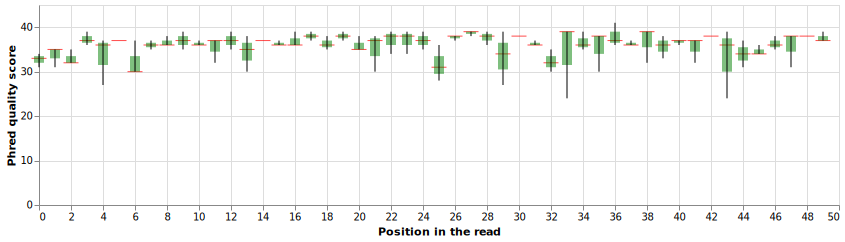

[](https://xkcd.com/353/)

Preclass prep: Chapters [8](https://greenteapress.com/thinkpython2/html/thinkpython2009.html) and [10](https://greenteapress.com/thinkpython2/html/thinkpython2011.html) from "Think Python"

> This material uses examples from notebooks developed by [Ben Langmead](https://langmead-lab.org/teaching-materials/)
{: .quote cite="https://langmead-lab.org/teaching-materials" }

# Prep

1. Start [JupyterLab](https://mybinder.org/v2/gh/jupyterlab/jupyterlab-demo/try.jupyter.org?urlpath=lab)
2. Within JupyterLab start a new Python3 notebook
3. Open [this page](http://cs1110.cs.cornell.edu/tutor/#mode=edit) in a new browser tab

# Strings in Python

In Python, strings are sequences of characters enclosed in quotation marks (either single or double quotes). They can be assigned to a variable and manipulated using various string methods. For example:

string1 = "Hello World!"
string2 = 'Hello World!'

print(string1)  # Output: Hello World!
print(string2)  # Output: Hello World!

You can also use the + operator to concatenate strings, and the * operator to repeat a string a certain number of times:


```python
string3 = "Hello " + "World!"
print(string3)  # Output: Hello World!

string4 = "Hello " * 3
print(string4)  # Output: Hello Hello Hello
```

    Hello World!
    Hello Hello Hello 


There are also many built-in string methods such as `upper()`, `lower()`, `replace()`, `split()`, `find()`, `len()`, etc. These can be used to manipulate and extract information from strings:


```python
string5 = "Hello World!"
print(string5.upper())   # Output: HELLO WORLD!
print(string5.lower())   # Output: hello world!
print(string5.replace("H", "J"))  # Output: Jello World!
print(string5.split(" "))  # Output: ['Hello', 'World!']
```

    HELLO WORLD!
    hello world!
    Jello World!
    ['Hello', 'World!']


You can also use indexing, slicing and string formatting to access or manipulate substrings or insert dynamic data into a string.


```python
name = "John"
age = 30

print("My name is {} and I am {} years old.".format(name, age))
```

    My name is John and I am 30 years old.

You can also use f-strings, or formatted string literals, to embed expressions inside string literals.

```python
name = "John"
age = 30

print(f"My name is {name} and I am {age} years old.")
```

    My name is John and I am 30 years old.

## String indexing

In Python, strings are sequences of characters, and each character has a corresponding index, starting from 0.
This means that we can access individual characters in a string using their index. This is called "string indexing".

Here is an example:

```python
string = "Hello World!"
print(string[0])  # Output: H
print(string[1])  # Output: e
print(string[-1])  # Output: !
```

    H
    e
    !

You can also use negative indexing to access characters from the end of the string, with -1 being the last character, -2 the second to last and so on.

You can also use slicing to extract a substring from a string. The syntax is `string[start:end:step]`, where `start` is the starting index, `end` is the ending index (not included), and step is the number of characters to skip between each index.

```python
string = "Hello World!"
print(string[0:5])  # Output: Hello
print(string[6:11])  # Output: World
print(string[::2])  # Output: HloWrd
```

    Hello
    World
    HloWrd

You can also use the string formatting method to get the string at the specific index.

```python
string = "Hello World!"
index = 3
print(f"The character at index {index} is: {string[index]}")
```

    The character at index 3 is: l


## String functions

In Python, many built-in string methods can be used to manipulate and extract information from strings. Here are some of the most commonly used ones:

- `upper()`: Converts the string to uppercase
- `lower()`: Converts the string to lowercase
- `replace(old, new)`: Replaces all occurrences of the old substring with the new substring
- `split(separator)`: Splits the string into a list of substrings using the specified separator
- `find(substring)`: Returns the index of the first occurrence of the substring, or -1 if the substring is not found
- `index(substring)`: Returns the index of the first occurrence of the substring or raises a ValueError if the substring is not found
- `count(substring)`: Returns the number of occurrences of the substring
- `join(iterable)`: Concatenates the elements of an iterable (such as a list or tuple) with the string as the separator
- `strip()`: Removes leading and trailing whitespaces from the string
- `lstrip()`: Removes leading whitespaces from the string
- `rstrip()`: Removes trailing whitespaces from the string
- `startswith(substring)`: Returns True if the string starts with the specified substring, False otherwise
- `endswith(substring)`: Returns True if the string ends with the specified substring, False otherwise
- `isalpha()`: Returns True if the string contains only alphabetic characters, False otherwise
- `isdigit()`: Returns True if the string contains only digits, False otherwise
- `isalnum()`: Returns True if the string contains only alphanumeric characters, False otherwise
- `format()`: Formats the string by replacing placeholders with specified values
- `len()`: Returns the length of the string

Here is an example of some of these methods:


```python
string = "Hello World!"

print(string.upper())  # Output: HELLO WORLD!
print(string.lower())  # Output: hello world!
print(string.replace("H", "J"))  # Output: Jello World!
print(string.split(" "))  # Output: ['Hello', 'World!']
print(string.find("World"))  # Output: 6
print(string.count("l"))  # Output: 3
print(string.strip())  # Output: "Hello World!"
print(string.startswith("Hello"))  # Output: True
print(string.endswith("World!"))  # Output: True
print(string.isalpha())  # Output: False
print(string.isalnum())  # Output: False
print(string.format())  # Output: Hello World!
print(len(string))  # Output: 12
```

    HELLO WORLD!
    hello world!
    Jello World!
    ['Hello', 'World!']
    6
    3
    Hello World!
    True
    True
    False
    False
    Hello World!
    12


## Playing with strings

```python
st = 'ACGT'
```


```python
len(st) # getting the length of a string
```

    4

```python
'' # empty string (epsilon)
```
    ''

```python
len('')
```

    0

```python
import random
random.choice('ACGT') # generating a random nucleotide
```
    'G'

```python
# now I'll make a random nucleotide string by concatenating random nucleotides
st = ''.join([random.choice('ACGT') for _ in range(40)])
st
```

    'GCTATATCAATGTTATCCGTTTTCTGATGTCGCGAGGACA'


```python
st[1:3] # substring, starting at position 1 and extending up to but not including position 3
# note that the first position is numbered 0
```

    'CT'


```python
st[0:3] # prefix of length 3
```

    'GCT'

```python
st[:3] # another way of getting the prefix of length 3
```

    'GCT'

```python
st[len(st)-3:len(st)] # suffix of length 3
```

    'ACA'

```python
st[-3:] # another way of getting the suffix of length 3
```

    'ACA'

```python
st1, st2 = 'CAT', 'ATAC'
```


```python
st1
```


    'CAT'


```python
st2
```

    'ATAC'


```python
st1 + st2 # concatenation of 2 strings
```

    'CATATAC'


# FASTQ

This notebook explores [FASTQ], the most common format for storing sequencing reads.

FASTA and FASTQ are rather similar, but FASTQ is almost always used for storing *sequencing reads* (with associated quality values), whereas FASTA is used for storing all kinds of DNA,
RNA or protein sequences (without associated quality values).

## Basic format
Here's a single sequencing read in FASTQ format:

    @ERR294379.100739024 HS24_09441:8:2203:17450:94030#42/1
    AGGGAGTCCACAGCACAGTCCAGACTCCCACCAGTTCTGACGAAATGATGAGAGCTCAGAAGTAACAGTTGCTTTCAGTCCCATAAAAACAGTCCTACAA
    +
    BDDEEF?FGFFFHGFFHHGHGGHCH@GHHHGFAHEGFEHGEFGHCCGGGFEGFGFFDFFHBGDGFHGEFGHFGHGFGFFFEHGGFGGDGHGFEEHFFHGE

It's spread across four lines.  The four lines are:

1. "`@`" followed by a read name
2. Nucleotide sequence
3. "`+`", possibly followed by some info, but ignored by virtually all tools
4. Quality sequence (explained below)

## Reading FASTQ with python

Download a sample small fastq file:

```
!wget https://zenodo.org/records/10602772/files/fastq_single_end_short.fq
```

Now we will use a very simple Python function to read this file and load fastq data into a list:

```python
def parse_fastq(fh):
    """ Parse reads from a FASTQ filehandle.  For each read, we
        return a name, nucleotide-string, quality-string triple. """
    reads = []
    while True:
        first_line = fh.readline()
        if len(first_line) == 0:
            break  # end of file
        name = first_line[1:].rstrip()
        seq = fh.readline().rstrip()
        fh.readline()  # ignore line starting with +
        qual = fh.readline().rstrip()
        reads.append((name, seq, qual))
    return reads

with open('fastq_single_end_short.fq','r') as fq:
    reads = parse_fastq(fq)

for read in reads:
    print(read)
```


```
('ERR294379.100739024 HS24_09441:8:2203:17450:94030#42/1', 'AGGGAGTCCACAGCACAGTCCAGACTCCCACCAGTTCTGACGAAATGATG', 'BDDEEF?FGFFFHGFFHHGHGGHCH@GHHHGFAHEGFEHGEFGHCCGGGF')
('ERR294379.136275489 HS24_09441:8:2311:1917:99340#42/1',  'CTTAAGTATTTTGAAAGTTAACATAAGTTATTCTCAGAGAGACTGCTTTT', '@@AHFF?EEDEAF?FEEGEFD?GGFEFGECGE?9H?EEABFAG9@CDGGF')
('ERR294379.97291341 HS24_09441:8:2201:10397:52549#42/1',  'GGCTGCCATCAGTGAGCAAGTAAGAATTTGCAGAAATTTATTAGCACACT', 'CDAF<FFDEHEFDDFEEFDGDFCHD=GHG<GEDHDGJFHEFFGEFEE@GH')
```


The nucleotide string can sometimes contain the character "`N`".  `N` essentially means "no confidence." The sequencer knows there's a nucleotide there but doesn't know whether it's an A, C, G or T.


> <comment-title>A note on <tt>while True</tt></comment-title>
>
>In Python, the while loop is used to repeatedly execute a block of code as long as a certain condition is true. The while True statement is a special case where the loop will run indefinitely until a break statement is encountered inside the loop.
>
>Here is an example of a while True loop:
>
>
>```python
>while True:
>    user_input = input("Enter 'q' to quit: ")
>    if user_input == 'q':
>        break
>    print("You entered:", user_input)
>
>print("Exited the loop")
>```
>```
>Enter 'q' to quit:  q
>Exited the loop
>```
>
>
>In this example, the loop will keep asking for user input until the user enters the 'q' character, which triggers the break statement, and the loop is exited.
>
>It is important to be careful when using while True loops, as they will run indefinitely if a break statement is not included. This can cause the program to crash or hang, if not handled properly.
>
>Also, It is recommended to use `while True` loop with a `break` statement, in case you want to execute the loop until some specific condition is met, otherwise, it's not a good practice to use `while True`.
>
>It's a good practice to include a way for the user to exit the loop, such as the break statement in the example above, or a counter variable to keep track of the number of iterations.
{: .comment}

## Read name

Read names often contain information about:

1. The scientific study for which the read was sequenced.  E.g. the string `ERR294379` (an [SRA accession number](http://www.ebi.ac.uk/ena/about/sra_format)) in the read names correspond to [this study](http://www.ncbi.nlm.nih.gov/sra/?term=ERR294379).
2. The sequencing instrument, and the exact *part* of the sequencing instrument, where the DNA was sequenced.  See the [FASTQ format](http://en.wikipedia.org/wiki/FASTQ_format#Illumina_sequence_identifiers) Wikipedia article for specifics on how the Illumina software encodes this information.
3. Whether the read is part of a *paired-end read* and, if so, which end it is.  Paired-end reads will be discussed further below.  The `/1` you see at the end of the read names above indicates the read is the first end from a paired-end read.

## Quality values

Quality values are probabilities.  Each nucleotide in each sequencing read has an associated quality value.  A nucleotide quality value encodes the probability that the nucleotide was *incorrectly called* by the sequencing instrument and its software.  If the nucleotide is `A`, the corresponding quality value encodes the probability that the nucleotide at that position is actually *not* an `A`.

Quality values are encoded in two senses: first, the relevant probabilities are re-scaled using the Phread scale, which is a negative log scale.
In other words if *p* is the probability that the nucleotide was incorrectly called, we encode this as *Q* where *Q* = -10 \* log10(*p*).

For example, if *Q* = 30, then *p* = 0.001, a 1-in-1000 chance that the nucleotide is wrong.  If *Q* = 20, then *p* = 0.01, a 1-in-100 chance.  If *Q* = 10, then *p* = 0.1, a 1-in-10 chance.  And so on.

Second, scaled quality values are *rounded* to the nearest integer and encoded using [ASCII printable characters](http://en.wikipedia.org/wiki/ASCII#ASCII_printable_characters).  For example, using the Phred33 encoding (which is by far the most common), a *Q* of 30 is encoded as the ASCII character with code 33 + 30 = 63, which is "`?`".  A *Q* of 20 is encoded as the ASCII character with code 33 + 20 = 53, which is "`5`".  And so on.

Let's define some relevant Python functions:

```python
def phred33_to_q(qual):
  """ Turn Phred+33 ASCII-encoded quality into Phred-scaled integer """
  return ord(qual)-33

def q_to_phred33(Q):
  """ Turn Phred-scaled integer into Phred+33 ASCII-encoded quality """
  return chr(Q + 33)

def q_to_p(Q):
  """ Turn Phred-scaled integer into error probability """
  return 10.0 ** (-0.1 * Q)

def p_to_q(p):
  """ Turn error probability into Phred-scaled integer """
  import math
  return int(round(-10.0 * math.log10(p)))
```


```python
# Here are the examples I discussed above

# Convert Qs into ps
q_to_p(30), q_to_p(20), q_to_p(10)
```

    (0.001, 0.01, 0.1)

```python=
p_to_q(0.00011) # note that the result is rounded
```

    40

```python=
q_to_phred33(30), q_to_phred33(20)
```

    ('?', '5')

To convert an entire string Phred33-encoded quality values into the corresponding *Q* or *p* values, I can do the following:


```python
# Take the first read from the small example above
name, seq, qual = parse_fastq(StringIO(fastq_string))[0]
q_string = list(map(phred33_to_q, qual))
p_string = list(map(q_to_p, q_string))
print(q_string)
print(p_string)
```

    [33, 35, 35, 36, 36, 37, 30, 37, 38, 37, 37, 37, 39, 38, 37, 37, 39, 39, 38, 39, 38, 38, 39, 34, 39, 31, 38, 39, 39, 39, 38, 37, 32, 39, 36, 38, 37, 36, 39, 38, 36, 37, 38, 39, 34, 34, 38, 38, 38, 37]
    [0.000501187233627272, 0.00031622776601683794, 0.00031622776601683794, 0.00025118864315095795, 0.00025118864315095795, 0.00019952623149688788, 0.001, 0.00019952623149688788, 0.00015848931924611126, 0.00019952623149688788, 0.00019952623149688788, 0.00019952623149688788, 0.0001258925411794166, 0.00015848931924611126, 0.00019952623149688788, 0.00019952623149688788, 0.0001258925411794166, 0.0001258925411794166, 0.00015848931924611126, 0.0001258925411794166, 0.00015848931924611126, 0.00015848931924611126, 0.0001258925411794166, 0.0003981071705534969, 0.0001258925411794166, 0.0007943282347242813, 0.00015848931924611126, 0.0001258925411794166, 0.0001258925411794166, 0.0001258925411794166, 0.00015848931924611126, 0.00019952623149688788, 0.000630957344480193, 0.0001258925411794166, 0.00025118864315095795, 0.00015848931924611126, 0.00019952623149688788, 0.00025118864315095795, 0.0001258925411794166, 0.00015848931924611126, 0.00025118864315095795, 0.00019952623149688788, 0.00015848931924611126, 0.0001258925411794166, 0.0003981071705534969, 0.0003981071705534969, 0.00015848931924611126, 0.00015848931924611126, 0.00015848931924611126, 0.00019952623149688788]


You might wonder how the sequencer and its software can *know* the probability that a nucleotide is incorrectly called.  It can't; this number is just an estimate.  To describe exactly how it's estimated is beyond the scope of this notebook; if you're interested, search for academic papers with "base calling" in the title.  Here's a helpful [video by Rafa Irizarry](http://www.youtube.com/watch?v=eXkjlopwIH4).

A final note: other ways of encoding quality values were proposed and used in the past.  For example, Phred64 uses an ASCII offset of 64 instead of 33, and Solexa64 uses "odds" instead of the probability *p*.  But Phred33 is by far the most common today and you will likely never have to worry about this.

><comment-title>A note in <tt>map()</tt></comment-title>
>
>In Python, the `map()` function is used to apply a given function to all elements of an iterable (such as a list, tuple, or string) and return an iterator (an object that can be iterated, e.g. in a `for`-loop) that yields the results.
>
>The `map()` function takes two arguments:
>
>A function that is to be applied to each element of the iterable
>An iterable on which the function is to be applied
>
>Here is an example:
>
>
>```python
># Using a function to square each element of a list
>numbers = [1, 2, 3, 4, 5]
>squared_numbers = map(lambda x: x**2, numbers)
>print(list(squared_numbers))  # Output: [1, 4, 9, 16, 25]
>```
>
>```
>[1, 4, 9, 16, 25]
>```
>
>In the example above, the `map()` function applies the lambda function `lambda x: x**2` to each element of the numbers list, and returns an iterator of the squared numbers. The `list()` function is used to convert the iterator to a list, so that the result can be printed.
>
>Another example is,
>
>
>```python
># Using the map() function to convert a list of strings to uppercase
>words = ["hello", "world"]
>uppercase_words = map(lambda word: word.upper(), words)
>print(list(uppercase_words))  # Output: ['HELLO', 'WORLD']
>```
>
>```
>['HELLO', 'WORLD']
>```
>
>It's important to note that the `map()` function returns an iterator, which can be used in a for loop, but is not a list, tuple, or any other iterable. If you want to create a list, tuple, or other iterable from the result of the `map()` function, you can use the `list()`, `tuple()`, or any other built-in function that creates an iterable.
>
>In Python 3, the `map()` function returns an iterator, which can be used in a for loop, but it's not iterable. If you want to create a list, tuple, or other iterable from the result of the `map()` function, you can use the `list()`, `tuple()`, or any other built-in function that creates an iterable.
>
>In Python 2, `map()` function returns a list, which can be used in a for loop, and it's iterable.
>
>In python 3.x, there is an alternative way to use map() function is `list(map(...))` or `tuple(map(...))` etc.
{: .comment}

## Paired-end reads

Sequencing reads can come in *pairs*.  Basically instead of reporting a single snippet of nucleotides from the genome, the sequencer might report a *pair* of
snippets that appear *close to each other* in the genome.  To accomplish this, the sequencer sequences *both ends* of a longer *fragment* of DNA.

Here is simple Python code that mimics how the sequencer obtains one paired-end read:

```python
# Let's just make a random genome of length 1K
import random
random.seed(637485)
genome = ''.join([random.choice('ACGT') for _ in range(1000)])
genome
```

    'AGTACGTCATACCGTTATGATCTAGGTGGGATCGCGGATTGGTCGTGCAGAATACAGCCTTGGAGAGTGGTTAACACGATAAGGCCGATAATATGTCTGGATAAGCTCAGGCTCTGCTCCGAGGCGCTAAGGTACATGTTATTGATTTGGAGCTCAAAAATTGCCATAGCATGCAATACGCCCGTTGATAGACCACTTGCCTTCAGGGGAGCGTCGCATGTATTGATTGTGTTACATAAACCCTCCCCCCCTACACGTGCTTGTCGACGCGGCACTGGACACTGATACGAGGAGGCACTTCGCTAGAAACGGCTTACTGCAGGTGATAAAATCAACAGATGGCACGCTCGCAACAGAAGCATAATATGCTTCCAACCAGGACCGGCATTTAACTCAATATATTAGCTCTCGAGGACAACGCACTACGTTTTCCAATTCAGCGGACTGGCGCCATTACAGTAAGTTGATTGTGCAGTGGTCTTTGACAGACAGCAGTTCGCTCCTTACTGACAATACCTGATACTTATAGTATGGCAGCGAGTCGTTGTCTAGGTTAGCCACCTCAGTCTACAGCAGGTAATGAAGCATTCCCACAAAGGCTGGTCCATACACCCGACTGCTACGATTCATGCTTCGCTCGAGAACTGCCCCTGCCTTAGATTCCCCCTCGTCTCCAATGAATACCCATTTTTTTAGATTGCTGAAAACCTTTCGTAAGACGCTTTCCAGTGATTACATGCCCTAACTGGGTACAGTTTGCCCAGGAGCTTTTTGGATGGAGGAGTATTAGTAGCGACCAAAACTCTTCCTCGACTGTTACTGTGTAGAGTCCCAAACGCTAAAGCGGTCCCAGAAAAACGGAACGGCCTACAGATTAAATTGCTCCGTGTTGCAGTTAAGGCGTACAAACCCCTCTGTGTATTAGTTTAAGTCTCTGAGTCTTCTTTGCTATGACGGATTGATGGGTGCCGGTTTGTAGTTCAAGAACCGTGAGTGAACC'

```python
# The sequencer draws a fragment from the genome of length, say, 250
offset = random.randint(0, len(genome) - 250)
fragment = genome[offset:offset+250]
fragment
```

    'GTATTGATTGTGTTACATAAACCCTCCCCCCCTACACGTGCTTGTCGACGCGGCACTGGACACTGATACGAGGAGGCACTTCGCTAGAAACGGCTTACTGCAGGTGATAAAATCAACAGATGGCACGCTCGCAACAGAAGCATAATATGCTTCCAACCAGGACCGGCATTTAACTCAATATATTAGCTCTCGAGGACAACGCACTACGTTTTCCAATTCAGCGGACTGGCGCCATTACAGTAAGTTGATT'

```python
# Then it reads sequences from either end of the fragment
end1, end2 = fragment[:75], fragment[-75:]
end1, end2
```

    ('GTATTGATTGTGTTACATAAACCCTCCCCCCCTACACGTGCTTGTCGACGCGGCACTGGACACTGATACGAGGAG',
     'CAATATATTAGCTCTCGAGGACAACGCACTACGTTTTCCAATTCAGCGGACTGGCGCCATTACAGTAAGTTGATT')

```python
# And because of how Illumina sequencing works, the
# second end is always from the opposite strand from the first
# (this is not the case for 454 and SOLiD data)

import string

# function for reverse-complementing
revcomp_trans = str.maketrans("ACGTacgt", "TGCAtgca")
def reverse_complement(s):
    return s[::-1].translate(revcomp_trans)

end2 = reverse_complement(end2)
end1, end2
```

    ('GTATTGATTGTGTTACATAAACCCTCCCCCCCTACACGTGCTTGTCGACGCGGCACTGGACACTGATACGAGGAG',
     'AATCAACTTACTGTAATGGCGCCAGTCCGCTGAATTGGAAAACGTAGTGCGTTGTCCTCGAGAGCTAATATATTG')

FASTQ can be used to store paired-end reads.  Say we have 1000 paired-end reads.  We should store them in a *pair* of FASTQ files.  The first FASTQ file (say, `reads_1.fq`) would contain all of the first ends and the second FASTQ file (say, `reads_2.fq`) would contain all of the second ends.  In both files, the ends would appear in corresponding order.  That is, the first entry in `reads_1.fq` is paired with the first entry in `reads_2.fq` and so on.

Here is a Python function that parses a pair of files containing paired-end reads.

```python
def parse_paired_fastq(fh1, fh2):
    """ Parse paired-end reads from a pair of FASTQ filehandles
        For each pair, we return a name, the nucleotide string
        for the first end, the quality string for the first end,
        the nucleotide string for the second end, and the
        quality string for the second end. """
    reads = []
    while True:
        first_line_1, first_line_2 = fh1.readline(), fh2.readline()
        if len(first_line_1) == 0:
            break  # end of file
        name_1, name_2 = first_line_1[1:].rstrip(), first_line_2[1:].rstrip()
        seq_1, seq_2 = fh1.readline().rstrip(), fh2.readline().rstrip()
        fh1.readline()  # ignore line starting with +
        fh2.readline()  # ignore line starting with +
        qual_1, qual_2 = fh1.readline().rstrip(), fh2.readline().rstrip()
        reads.append(((name_1, seq_1, qual_1), (name_2, seq_2, qual_2)))
    return reads

fastq_string1 = '''@509.6.64.20524.149722/1
AGCTCTGGTGACCCATGGGCAGCTGCTAGGGAGCCTTCTCTCCACCCTGA
+
HHHHHHHGHHHHHHHHHHHHHHHHHHHHHHHHHHHHHHHHIIHHIHFHHF
@509.4.62.19231.2763/1
GTTGATAAGCAAGCATCTCATTTTGTGCATATACCTGGTCTTTCGTATTC
+
HHHHHHHHHHHHHHEHHHHHHHHHHHHHHHHHHHHHHHDHHHHHHGHGHH'''

fastq_string2 = '''@509.6.64.20524.149722/2
TAAGTCAGGATACTTTCCCATATCCCAGCCCTGCTCCNTCTTTAAATAAT
+
HHHHHHHHHHHHHHHHHHHH@HHFHHHEFHHHHHHFF#FFFFFFFHHHHH
@509.4.62.19231.2763/2
CTCTGCTGGTATGGTTGACGCCGGATTTGAGAATCAANAAGAGCTTACTA
+
HHHHHHHHHHHHHHHHHHEHEHHHFHGHHHHHHHH>@#@=44465HHHHH'''

parse_paired_fastq(StringIO(fastq_string1), StringIO(fastq_string2))
```

    [(('509.6.64.20524.149722/1',
       'AGCTCTGGTGACCCATGGGCAGCTGCTAGGGAGCCTTCTCTCCACCCTGA',
       'HHHHHHHGHHHHHHHHHHHHHHHHHHHHHHHHHHHHHHHHIIHHIHFHHF'),
      ('509.6.64.20524.149722/2',
       'TAAGTCAGGATACTTTCCCATATCCCAGCCCTGCTCCNTCTTTAAATAAT',
       'HHHHHHHHHHHHHHHHHHHH@HHFHHHEFHHHHHHFF#FFFFFFFHHHHH')),
     (('509.4.62.19231.2763/1',
       'GTTGATAAGCAAGCATCTCATTTTGTGCATATACCTGGTCTTTCGTATTC',
       'HHHHHHHHHHHHHHEHHHHHHHHHHHHHHHHHHHHHHHDHHHHHHGHGHH'),
      ('509.4.62.19231.2763/2',
       'CTCTGCTGGTATGGTTGACGCCGGATTTGAGAATCAANAAGAGCTTACTA',
       'HHHHHHHHHHHHHHHHHHEHEHHHFHGHHHHHHHH>@#@=44465HHHHH'))]

><comment-title>A note on triple quotes</comment-title>
>
>In Python, triple quotes (either single or double) are used to create multi-line strings. They can also be used to create doc-strings, which are used to document a function, class, or module.
>
>For example:
>
>
>```python
>string1 = """This is a
>multiline string"""
>
>string2 = '''This is also
>a multiline string'''
>
>print(string1)
># Output:
># This is a
># multiline string
>
>print(string2)
># Output:
># This is also
># a multiline string
>```
>
>    This is a
>    multiline string
>    This is also
>    a multiline string
>
>
>Triple quotes can also be used to create docstrings, which are used to document a function, class, or module. The first line of a docstring is a brief summary of what the function, class, or module does, and the following lines provide more detailed information.
>
>
>```python
>def my_function():
>    """
>    This is a docstring for the my_function.
>    This function does not perform any operation.
>    """
>    pass
>
>print(my_function.__doc__)
># Output:
># This is a docstring for the my_function.
># This function does not perform any operation.
>```
>
>    
>        This is a docstring for the my_function.
>        This function does not perform any operation.
>        
{: .comment}

## How good are my reads?

Let's reuse the `parse_fastq` function from above:

```python
# Read the file into a list
with open('fastq_single_end_short.fq','r') as fq:
    reads = parse_fastq(fq)
```

☝️ This will load data into a list called `reads` containing individual reads (name, nucleotides, and quality values) represented as a [tuple](https://docs.python.org/3/tutorial/datastructures.html#tuples-and-sequences). 


```python
# Extract qualities and convert them into numerical values
run_qualities = []
for read in reads:
    read_qualities = []
    for quality in read[2]:
        read_qualities.append(phred33_to_q(quality))
    run_qualities.append(read_qualities)
```

☝️ This will take quality string only for each read from `reads` and convert it into a list of values. The end result, a list of lists called `run_qualities`, will contain as many elements as there as reads, where each element (also a list) contains all quality values for a read. We need to [transpose](https://en.wikipedia.org/wiki/Transpose) this list, so that instead of representing every reads as a list of quality values we represent every position as a list of quality values for all reads at that position. This can be easily done with [numpy](https://numpy.org/)'s [`T`](https://numpy.org/doc/stable/reference/generated/numpy.ndarray.T.html):

```python
# Transpose the quality values matrix

import numpy as np
base_qualities = np.array(run_qualities).T
```

Now we need to extract some key per-position statistics from the `base_qualities` list generated above. We, again, use numpy for this:

```python
# Prep data for plotting
plotting_data = {
    'base':[],
    'mean':[],
    'median':[],
    'q25':[],
    'q75':[],
    'min':[],
    'max':[]
}
for i,base in enumerate(base_qualities):
    plotting_data['base'].append(i)
    plotting_data['mean'].append(np.mean(base))
    plotting_data['median'].append(np.median(base))
    plotting_data['q25'].append(np.quantile(base,.25))
    plotting_data['q75'].append(np.quantile(base,.75))
    plotting_data['min'].append(np.min(base))
    plotting_data['max'].append(np.max(base))
```

☝️ The result of this, a dictionary called `plotting_data`, contains statistics types as *keys* and corresponding values as *lists*. Now we load these into Pandas:

```python
# Load into Pandas
import pandas as pd
plotting_data_df = pd.DataFrame(plotting_data)
```

And plot:

```python
# Plot!
import altair as alt

base = alt.Chart(plotting_data_df).encode(
    alt.X('base:Q', title="Position in the read")
).properties(
    width=800,
    height=200)

median = base.mark_tick(color='red',orient='horizontal').encode(
    alt.Y('median:Q', title="Phred quality score"),
)

q = base.mark_rule(color='green',opacity=.5,strokeWidth=10).encode(
    alt.Y('q25:Q'),
    alt.Y2('q75:Q')
)

min_max = base.mark_rule(color='black').encode(
        alt.Y('min:Q'),
        alt.Y2('max:Q')
)

median + q + min_max
```

Below is the same thing as just one code blob:

```python
# Read the file into a list
with open('fastq_single_end_short.fq','r') as fq:
    reads = parse_fastq(fq)

# Extract qualities and convert them into numerical values
run_qualities = []
for read in reads:
    read_qualities = []
    for quality in read[2]:
        read_qualities.append(phred33_to_q(quality))
    run_qualities.append(read_qualities)

# Transpose the quality values matrix

import numpy as np
base_qualities = np.array(run_qualities).T

# Prep data for plotting
plotting_data = {
    'base':[],
    'mean':[],
    'median':[],
    'q25':[],
    'q75':[],
    'min':[],
    'max':[]
}
for i,base in enumerate(base_qualities):
    plotting_data['base'].append(i)
    plotting_data['mean'].append(np.mean(base))
    plotting_data['median'].append(np.median(base))
    plotting_data['q25'].append(np.quantile(base,.25))
    plotting_data['q75'].append(np.quantile(base,.75))
    plotting_data['min'].append(np.min(base))
    plotting_data['max'].append(np.max(base))

# Load into Pandas
import pandas as pd
plotting_data_df = pd.DataFrame(plotting_data)

# Plot!
import altair as alt

base = alt.Chart(plotting_data_df).encode(
    alt.X('base:Q', title="Position in the read")
).properties(
    width=800,
    height=200)

median = base.mark_tick(color='red',orient='horizontal').encode(
    alt.Y('median:Q', title="Phred quality score"),
)

q = base.mark_rule(color='green',opacity=.5,strokeWidth=10).encode(
    alt.Y('q25:Q'),
    alt.Y2('q75:Q')
)

min_max = base.mark_rule(color='black').encode(
        alt.Y('min:Q'),
        alt.Y2('max:Q')
)

median + q + min_max
```



## Other comments

In all the examples above, the reads in the FASTQ file are all the same length.  This is not necessarily the case though it is usually true for datasets generated by sequencing-by-synthesis instruments.  FASTQ files can contain reads of various lengths.

FASTQ files often have the extension `.fastq` or `.fq`.

## Other resources

- [BioPython](http://biopython.org/wiki/Main_Page)
- [SeqIO](http://biopython.org/wiki/SeqIO)
- [SAMtools](http://samtools.sourceforge.net/)
- [FASTX](http://hannonlab.cshl.edu/fastx_toolkit/)
- [FASTQC](http://www.bioinformatics.babraham.ac.uk/projects/fastqc/)
- [seqtk](https://github.com/lh3/seqtk)

