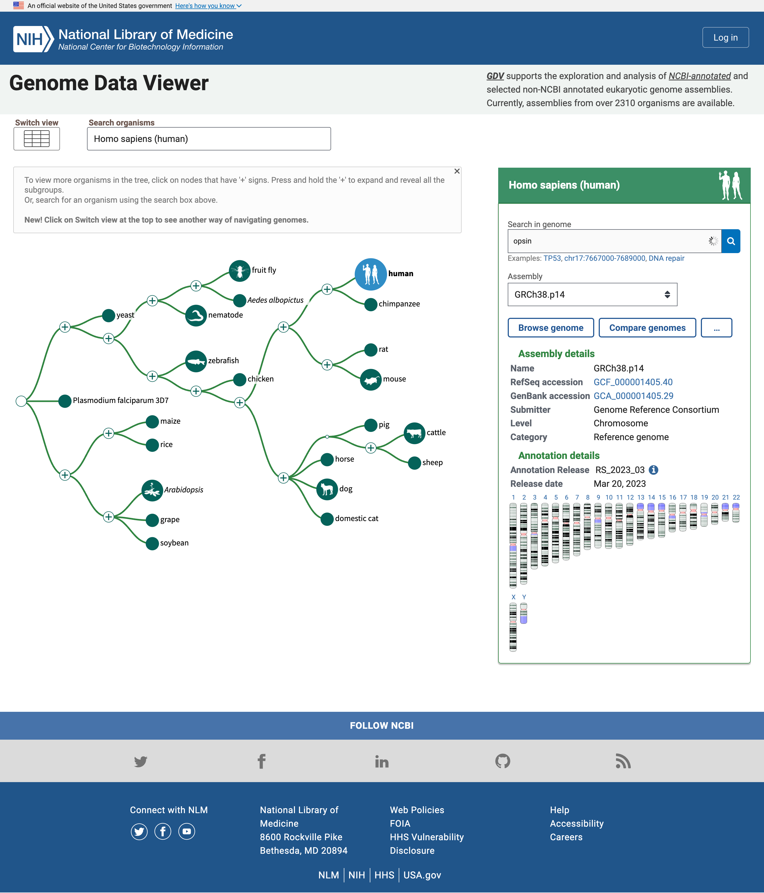
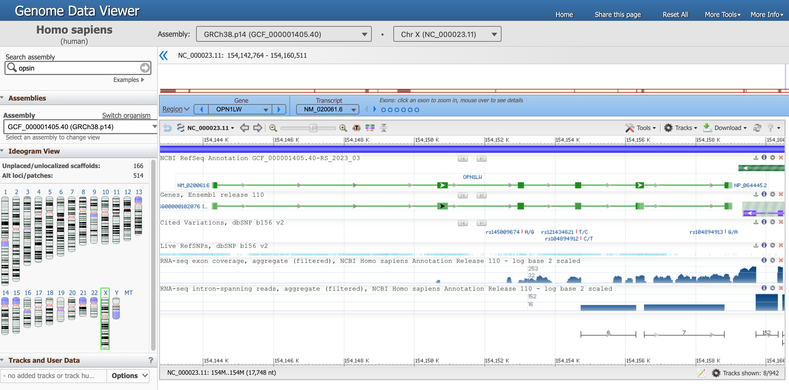
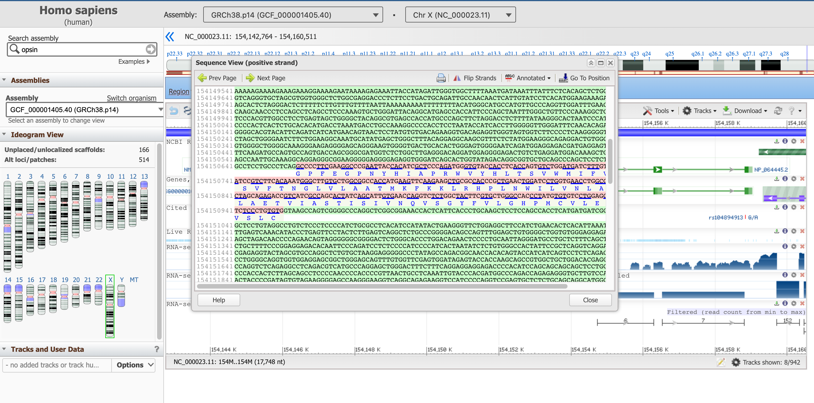
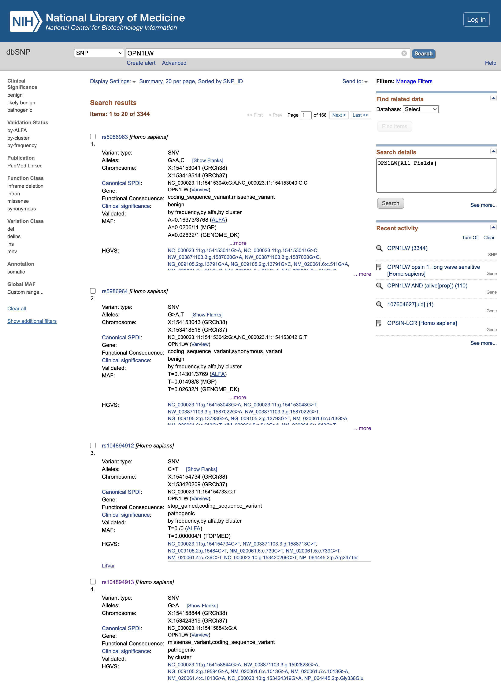
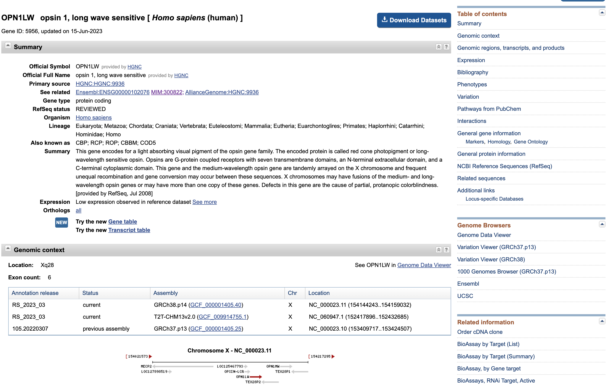
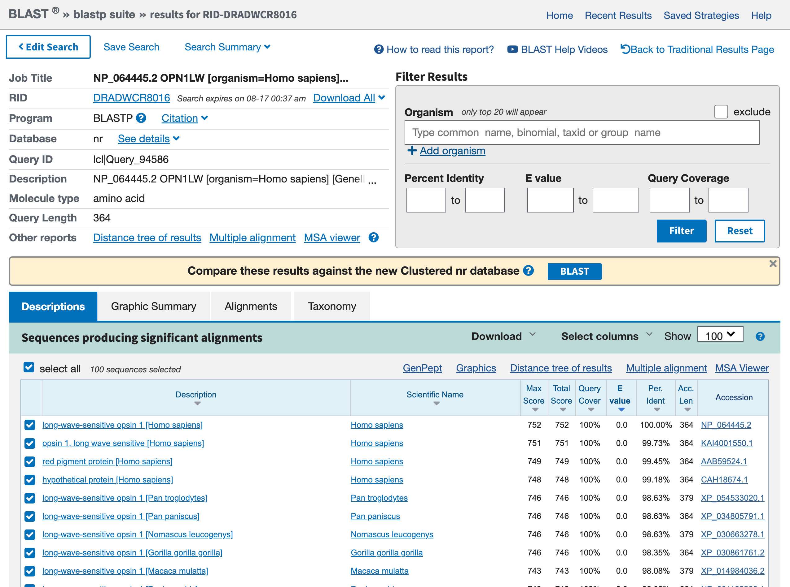
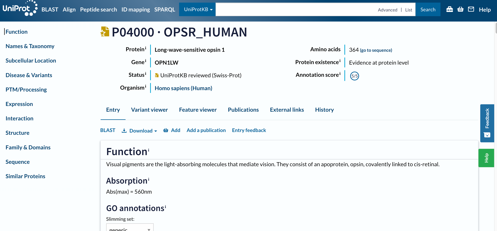

When we do a bioinformatics analysis, e.g. RNA-seq, we might end up with a list of gene names. We then need to explore these genes. But how can we do that? What are the resources available for that? And how to navigate through them?

The aim of this tutorial is to familiarize ourselves with that, using Human opsins as an example.

Human opsins are found in the cells of your retina. Opsins catch light and begin the sequence of signals that result in vision. We will proceed by asking questions about opsins and opsin genes, and then using different bioinformatics databases and resources to answer them.

> <comment-title></comment-title>
> This tutorial is a bit atypical: we will not work in Galaxy but mostly outside of it, navigating databases and tools through their own web interfaces. The scope of this tutorial is to illustrate several sources of biological data in different file formats, and representing different information.
{: .comment}

> <agenda-title></agenda-title>
>
> In this tutorial we will deal with:
>
> 1. TOC
> {:toc}
{: .agenda}

# Searching Human Opsins

To seach Human Opsins, we will start by checking the [NCBI Genome Data Viewer](https://www.ncbi.nlm.nih.gov/genome/gdv). The NCBI Genome Data Viewer (GDV) () is a genome browser supporting the exploration and analysis of annotated eukaryotic genome assemblies. The GDV browser displays biological information mapped to a genome, including gene annotation, variation data, BLAST alignments, and experimental study data from the NCBI GEO and dbGaP databases. GDV release notes describe new features relating to this browser. 

> <hands-on-title>Open NCBI Genome Data Viewer</hands-on-title>
>
> 1. Open the NCBI Genome Data Viewer at [www.ncbi.nlm.nih.gov/genome/gdv](https://www.ncbi.nlm.nih.gov/genome/gdv/)
>
{: .hands-on}

The homepage includes a simple "tree of life" where the human node is highlighted because it is the default organism to search. We can change that in the *Search organisms* box but we will leave for now as we are interested in Human Opsins. 



The panel on the right reports multiple assemblies of the genome of interest, and a map of the chromosomes in that genome. We can search for Opsins there.

> <hands-on-title>Search for OpsinsOpen NCBI Genome Data Viewer</hands-on-title>
>
> 1. Type `opsin` in the *Search in genome* box
> 2. Click on the magnifier icon or press <kbd>Enter<kbd>
>
{: .hands-on}

Below the box is now displayed a table with genes related to opsin together with their names and location, i.e. the chromosome number, as well ass the start and end position

In the list of genes related to the search term opsin, there are the rhodopsin gene (RHO), and three cone pigments, short-, medium-, and long-wavelength sensitive opsins (for blue, green, and red light detection). There are other entities, e.g. a -LCR (Locus Control region), putative genes and receptors. 

Multiple hits are on the X chromosome, one of the sex-determining chromosomes.

> <question-title></question-title>
>
> 1. How many genes have been found in Chromosome X?
> 2. How many are protein coding genes?
>
> > <solution-title></solution-title>
> >
> > 1. The hits in ChrX are: 
> > - OPSIN-LCR
> > - OPN1LW
> > - OP1MW
> > - OPN1MW2
> > - OPN1MW3
> >
> > 2. By hovering over each gene, a box open and we can click on *Details* to learn more about each gene. Then we learn that the first (OPSIN-LCR) is not protein coding but a gene regulatory region and the other are protein coding genes. So there are 4 protein coding genes related to opsins in Chromosome X. In particular, Chromosome X includes one red pigment gene (OPN1LW) and three green pigment genes (OPN1MW, OPN1MW2 and OPN1MW3 in the reference genome assembly).
> >
> {: .solution}
{: .question}

Let's now focus on one specific opsin, the gene OPN1LW. 

> <hands-on-title>Open Genome Browser for gene OPN1LW</hands-on-title>
>
> 1. Click on the blue arrow that appears in the results table when you hover your mouse on the OPN1LW row
>
{: .hands-on}

You should have landed in [this page](https://www.ncbi.nlm.nih.gov/genome/gdv/browser/genome/?id=GCF_000001405.40), that is the genome view of gene OPN1LW. 



There is a lot of information in this page, let's focus on one section at the time. 

1. The Genome Data Viewer, on the top, tells us that we are looking at the data from the organism `Homo sapiens`, assembly `GRCh38.p14` and in particular at `Chr X` (Chromosome X). Each of these information has a unique ID.
2. The entire Chromosome is represented directly below, and the positions along the short (`p`) and long (`q`) arms are highlihgted.
3. Below, a blue box highlights that we are now focusing on the Region corresponding to the Gene `OPN1LW`. 

    There are multiple ways to interact with the viewer below. Try for example to hover with the mouse on the dots representing exons in the blue box. 

4. In the graph below, the gene requence is a green line with the exons (protein coding fragments) represented by green rectangles. 

    Hover with the mouse on the green line corresponding to `NM_020061.6` (our gene of interest) to get more detailed information.

    > <question-title></question-title>
    >
    > 1. What is the location of the OPN1LW segment?
    > 2. What is the length of the OPN1LW segment?
    > 3. What are introns and exons?
    > 4. How many exons and introns are in the OPN1LW gene?
    > 5. What is the total length of the coding region?
    > 6. What is the distribution between coding and non coding regions? What does that mean in term of biology?
    > 7. What is the lenght of the protein in number of amino acids?
    >
    > > <solution-title></solution-title>
    > >
    > > 1. From 154,144,243 to 154,159,032
    > > 2. 1,4790 nucleotides, found at *Span on 14790 nt, nucleotides)*
    > > 3. Eukaryotic genes are often interrupted by non-coding regions called intervening sequences or introns. The coding regions are called exons. 
    > > 4. From this diagram, you can see that the OPN1LW gene consists of 6 exons and 5 introns, and that the introns are far larger than the exons. 
    > > 5. The CDS length is 1,095 nucleotides. 
    > > 6. Of the 14790 nt in the gene, only 1095 nt code for protein, which means that less than 8% of the base pairs contain the code. When this gene is expressed in cells in the human retina, an RNA copy of the entire gene is synthesized. Then the intron regions are cut out, and the exon regions joined together to produce the mature mRNA (a process called splicing). which will be translated by ribosomes as they make the red opsin protein. In this case, 92% of the initial RNA transcript is tossed out, leaving the pure protein code. 
    > > 7. The length of the resulting protein is 364 aa, amino acids.
    > {: .solution}
    {: .question}

But what is the sequence of this gene? There are multiple ways to retrieve this information, we will go through what we think is one of the most intituitive. 

> <hands-on-title>Open Genome Browser for gene OPN1LW</hands-on-title>
>
> 1. Click on the  *Tools* section on the top right of the box showing the gene
> 2. Click on *Sequence Text View*
{: .hands-on}

This panel reports the DNA sequence of the introns (in green), as well as the one of the exons (in pink, including the translated protein sequence below). 



This sequence box is not showing the entire gene at the moment, but a subsequence of it. You can move upstream and downstream the genetic code with the arrows *Prev Page* and *Next Page*, or start from a specific position with the *Go To Position* button. We suggest to start with the start of the coding part of the gene, which as we learned earlier is at position 154,144,243. 

> <hands-on-title>Go to a specific position in Sequence View</hands-on-title>
>
> 1. Click on *Go To Position*
> 2. Type on `154144243`
> 
>    We have to remove the commas to validate the value
{: .hands-on}

The sequence highlighted in purple here signals a regulatory region. 

> <question-title></question-title>
>
> 1. What is the first amino acid of the resulting protein product?
> 2. What is the last one?
> 3. Can you keep a note of the first three and last three AAs of this protein?
>
> > <solution-title></solution-title>
> >
> > 1. The correspondent protein starts with Methionine, M (they all do).
> > 2. The last AA of the last exon (found in the 2nd page) is Alanine (A). After that, the stop codon TGA comes, which is not translated into an AA.
> > 3. The first three AAs are: M,A,Q; the last three: S,P,A.
> >
> {: .solution}
{: .question}

We can now close the *Sequence View*. 

From this resource, we can also get files, in different format, describing the gene. They are available from the *Download* section. 

1. *Download FASTA* will allow us to download the simplest file format to represent the nucleotide sequence of all the visible range of the genome (longer than the gene only).
2. *Download GenBank flat file* will allow us to access the annotation avaible on this page (and beyond) in a flat text format.
3. *Download Track Data* allows us to inpect two of the file formats we presented in the slides: the GFF (GFF3) and BED formats. If you change the tracks, each one may or may not be available. 

# Finding more information about our gene

Let's now get an overview of the information we have (in the literature) about our gene, using the NCBI resources

> <hands-on-title>Go to a specific position in Sequence View</hands-on-title>
>
> 1. Open the NCBI search at [www.ncbi.nlm.nih.gov/search](https://www.ncbi.nlm.nih.gov/search/)
> 2. Type `OPN1LW` in the *Search NCBI* search box
> 
{: .hands-on}

.

## Literature

Let's start with the literature and in particular *PubMed* or *PubMed Central* results

> <details-title>What's the difference between PubMed and PubMed Central? </details-title>
>
> PubMed is a biomedical literature database which contains the abstracts of publications in the database. 
>
> PubMed Central is a full text repository, which contains the full text of publications in the database.
>
> While the exact number of hits may vary in time from the screenshot above, any gene name should have more hits in PubMed Central (searched in the full texts of publications) than in PubMed (searched only in the abstracts).  
>
{: .details}

> <hands-on-title>Open PubMed</hands-on-title>
>
> 1. Click on *PubMed* in the *Literature* box
> 
{: .hands-on}

You have entered PubMed, a free database of scientific literature, to the results of a complete search for articles directly associated with this gene locus. 

By clicking on the title of each article, you can see abstracts of the article. If you are on a university campus where there is online access to specific journals, you might also see links to full articles. PubMed is your entry point to a wide variety of scientific literature in the life sciences. On the left side of any PubMed page, you will find links to a description of the database, help, and tutorials on searching. 

> <question-title></question-title>
>
> 1. Can you guess which type of conditions are associated to this gene?
>
> > <solution-title></solution-title>
> >
> > 1. We will answer this question later
> >
> {: .solution}
{: .question}

> <hands-on-title>Back to NCBI Search page</hands-on-title>
>
> 1. Go back the [NCBI Search page](https://www.ncbi.nlm.nih.gov/search/all/?term=OPN1LW)
> 
{: .hands-on}

## Clinical

Let's now focus on the *Clinical* box, and specially on *OMIM*. OMIM, the Online Mendeliam Inheritance in Man (and woman!), is a catalog of human genes and genetic disorders. 

> <hands-on-title>Open OMIM</hands-on-title>
>
> 1. Click on *OMIM* in the *Clinical* box
> 
{: .hands-on}

Each OMIM entry is a genetic disorder (here mostly types of colorblindness) associated with mutations in this gene. 

> <hands-on-title>Read as much as your interest dictates</hands-on-title>
>
> 1. Follow links to get more information about each entry
> 
{: .hands-on}

> <comment-title>Read as much as your interest dictates</comment-title>
>
> For more information about OMIM itself, click the OMIM logo at the top of the page. Through OMIM, a wealth of information is available for countless genes in the human genome, and all information is backed up by references to the latest research articles.
> 
{: .comment}

How do variations in the gene affect the protein product, and its functions? Let's go back to the NIH page and investigate access the list of Single Nucleotide Polymorphisms (SNPs) that were detected by genetics studies in the gene. 

> <hands-on-title>Open dbSNP</hands-on-title>
>
> 1. Go back the [NCBI Search page](https://www.ncbi.nlm.nih.gov/search/all/?term=OPN1LW)
> 2. Click on *dbSNP* in the *Clinical* box
> 
{: .hands-on}



> <question-title></question-title>
>
> 1. What is the clinical significance of the rs5986963 and rs5986964 (first 2 variants listed at the time of creation of this tutorial)?
> 2. What is the functional consequence of rs104894912?
> 3. What is the functional consequence of rs104894913?
>
> > <solution-title></solution-title>
> >
> > 1. The Clinical significance is `benign` so it seems that they have no effect on the final protein product
> > 2. rs104894912 mutation leads to a `stop_gained` variant, which truncates the resulting protein too early and is therefore `pathogenic`
> > 3. rs104894913 mutation leads to a `missense_variant`, also `pathogenic`.
> >
> {: .solution}
{: .question}

Let's investigate about more on the rs104894913 variant

> <hands-on-title>Learn more about a variant dbSNP</hands-on-title>
>
> 1. Click on `rs104894913` to open its [dedicated page](https://www.ncbi.nlm.nih.gov/snp/rs104894913)
> 2. Click on *Clinical Significance* 
>
>    > <question-title></question-title>
>    > 
>    > What type of condition is associated with the rs104894913 variant? 
>    > 
>    > > <solution-title></solution-title>
>    > >
>    > > The name of the associated disease is "Protan defect". A quick internet search with your search engine will clarify that this is a type of color blindness.
>    > >
>    > {: .solution}
>    {: .question}
>
> 3. Click on the *Variant details*
>
>    > <question-title></question-title>
>    > 
>    > 1. Which substitution is associated with this variant?
>    > 2. What is impact of this subtitution in term of codon and amino acid?
>    > 3. At which position of the protein is this substitution?
>    > 
>    > > <solution-title></solution-title>
>    > >
>    > > 1. The substitution `NC_000023.10:g.153424319G>A` corresponds to change from a Guanine (G) to an Adenine (A)
>    > > 2. This substitution change the codon `GGG`, a Glycine, into `GAG`, a Glutathione
>    > > 3. `p.Gly338Glu` means that the substitution is at position 338 of the protein.
>    > {: .solution}
>    {: .question}
{: .hands-on}

What does this mean this substitution for the protein? Let's have a deeper look at this protein. 

## Protein

> <hands-on-title>Open Protein</hands-on-title>
>
> 1. Go back the [NCBI Search page](https://www.ncbi.nlm.nih.gov/search/all/?term=OPN1LW)
> 2. Click on *Protein* in the *Proteins* box
> 3. Click on `OPN1LW – opsin 1, long wave sensitive` in the box on top
> 
{: .hands-on}



This page presents once again some data that we are familiar with (e.g. distribution of the exons along the gene sequence). 

> <hands-on-title>Download the protein sequences</hands-on-title>
>
> 1. Click on *Download Datasets*
> 2. Select 
>    - `Gene Sequences (FASTA)`
>    - `Transcript sequences (FASTA)`
>    - `Protein sequences (FASTA)`
> 3. Click on *Download* button
> 4. Open the downloaded ZIP file
{: .hands-on}

> <question-title></question-title>
>
> 1. What does the folder contain? 
> 2. Do you think they implemented good data practices?
>
> > <solution-title></solution-title>
> >
> > 1. The folder includes
> >    - a folder `ncbi_datasets` with different subfolders in it leadig some data files (multiple formats),
> >    - a `README.md` (a Markdown file), which is designed to "travel" together with the data and explain how was the data retreived, what is the structure of the data containing subfolder, and where to find extensive documentation. 
> > 2. It is definitely a good data management practice to guide users (not only your collaborators, but also yourself in the not-so-far future, when you will forget where does that file in your Downloads folder come from) to the data source and the data structure.
> >
> {: .solution}
{: .question}

# Searching by sequence

What could we do with these sequences that we just downloaded? Let's assume that we just sequenced the transcripts that we isolated through an experiment - so we know the sequence of our entity of interest, but don't know what it is. What we need to do in this case is to search the entire database of sequences known to science and match our unknown entity with an entry that has some annotation. Let's do it. 

> <hands-on-title>Search the protein sequence against all protein sequences</hands-on-title>
>
> 1. Open (with the simplest text editor you have installed) the `protein.faa` file that you just downloaded.
> 2. Copy its contents
> 3. Open BLAST [blast.ncbi.nlm.nih.gov](https://blast.ncbi.nlm.nih.gov/Blast.cgi)
> 4. Click on the `Protein BLAST, protein > protein`
> 
>     We will indeed use a protein sequence to search against a database of proteins
>
> 5. Paste the protein sequence into the big text box
> 6. Check the rest of parameters
> 7. Click the blue button `BLAST`
{: .hands-on}

This phase will take some time, there is afterall some server somewhere that is comparing the entirety of known sequences to your target.  When the search is complete, the result should look similar to the one below: 



> <hands-on-title>Graphic Summary of the protein sequences</hands-on-title>
>
> 1. Click on the tab *Graphic Summary*
{: .hands-on}

We access a box containing lots of colored lines. Each line represents a hit from your blast search. If you click on a red line, the narrow box just above the box gives a brief description of the hit. 

> <hands-on-title>Descriptions of the protein sequences</hands-on-title>
>
> 1. Click on the tab *Descriptions*
{: .hands-on}

> <question-title></question-title>
>
> 1. What is the first hit? Is it expected?
> 2. What are the other hits? For which organisms?
>
> > <solution-title></solution-title>
> >
> > 1. The first hit is our red opsin. That's encouraging, because the best match should be to the query sequence itself, and you got this sequence from that gene entry. 
> > 2. Other hits are other opsins. They include entries from other primates (e.g. `Pan troglogytes`). 
> >
> >
> {: .solution}
{: .question}

The hits are for our red opsin in human but also other opsins in other primates. We could want that, for example if we wanted to use this data to build a phylogenetic tree. If we instead are pretty sure that our sequence of interest is human, we could also have filtered the search only in human sequences.

> <hands-on-title>Filter a BLAST Search</hands-on-title>
>
> 1. Click on *Edit Search*
> 2. Type `Homo sapiens` in *Organism* field
> 3. Click the blue button `BLAST`
{: .hands-on}

With this new search, we find the other opsins (green, blue, rod-cell pigment) in the list. Other hits have lower numbers of matching residues. If you click on any of the colored lines in the *Graphic Summary*, you'll open more information about that hit, and you can see how much similarity each one has to the red opsin, our original query sequence. As you go down the list, each succeeding sequence has less in common with red opsin. Each sequence is shown in comparison with red opsin in what is called a pairwise sequence alignment. Later, you'll make multiple sequence alignments from which you can discern relationships among genes.

> <details-title>More details on BLAST scores</details-title>
>
> The displays contain two prominent measures of the significance of the hit:
>
> 1. the BLAST Score - lableled Score (bits)
>
>    The BLAST Score indicates the quality of the best alignment between the query sequence and the found sequence (hit). The higher the score, the better the alignment. Scores are reduced by mismatches and gaps in the best alignment. Calculation of the score is complex, involving a substitution matrix, which is a table that assigns a score to each pair of residues aligned. The most widely used matrix for protein alignment is known as BLOSUM62.
>
> 2. the Expectation Value (labeled Expect or E)
>
>     The expectation value E of a hit tells whether the hit is likely be result from chance likeness between hit and query, or from common ancestry of hit and query. () 
>
>     > <comment-title>Filter a BLAST Search</comment-title>
>     > 
>     > If E is smaller than $$10\mathrm{e}{-100}$$, it is sometimes given as 0.0.
>     {: .comment}
>
>     The expectation value is the number of hits you would expect to occur purely by chance if you searched for your sequence in a random genome the size of the human genome. 
>
>      $$E = 25$$ means that you could expect to find 25 matches in a genome of this size, purely by chance. So a hit with $$E = 25$$ is probably a chance match, and does not imply that the hit sequence shares common ancestry with your search sequence. 
>
>      Expectation values of around 0.1 may or may not be biologically significant (other tests would be needed to decide).
>
>      But very small values of E mean that the hit is biologically significant. The correspondence between your search sequence and this hit must arise from common ancestry of the sequences, because the odds are are simply too low that the match could arise by chance. For example, $$E = 10\mathrm{e}{-18}$$ for a hit in the human genome means that you would expect only one chance match in one billion billion different genomes the same size of the human genome.
>
>      The reason we believe that we all come from common ancestors is that massive sequence similarity in all organisms is simply too unlikely to be a chance occurrence. Any family of similar sequences across many organisms must have evolved from a common sequence in a remote ancestor.
>
{: .details}

> <hands-on-title>Dowloading </hands-on-title>
>
> 1. Click on *Descriptions* tab
> 2. Click at any sequence hit
> 3. Click on *Download*
> 4. Select `FASTA (aligned sequences)`
{: .hands-on}

It will download a new, slightly different, type of file: an aligned FASTA. If you want, explore it before the next section. 

While in the previous sections of this tutorial we extensively used the web interfaces of the tools (genomic viewers, quick literature scanning, reading annotations, etc.), this BLAST search is an example of a step that you could fully automate with Galaxy. 

> <hands-on-title> Similarity search with BLAST in Galaxy </hands-on-title>
>
> 1. Create a new history for this analysis
>
>    
>
> 2. Rename the history
>
>    
>
> 3. Import the protein sequence via link from [Zenodo]({{ page.zenodo_link }}) or Galaxy shared data libraries:
>
>    ```text
>    {{ page.zenodo_link }}/files/protein.faa
>    ```
>
>    
>
>    
>
> 1.  with the following parameters:
>    - *"Protein query sequence(s)"*: `protein.faa`
>    - *"Subject database/sequences"*: `Locally installed BLAST database`
>    - *"Protein BLAST database"*: `SwissProt`
>
>      To search against only annotated sequences in UniProt, we need select the latest release of `SwissProt`
>
>    - *"Set expectation value cutoff"*: `0.001`
>    - *"Output format"*: `Tabular (extended 25 columns)` 
>
{: .hands_on}

> <question-title></question-title>
>
> Do you think we are looking at exactly the same results as our original search for `opsin` in [www.ncbi.nlm.nih.gov/genome/gdv](https://www.ncbi.nlm.nih.gov/genome/gdv/)? Why?
>
> > <solution-title></solution-title>
> >
> > The results might be similar, but there are definitely some differences. Indeed, not only a text search is different than a sequence search in terms of method, but also this second round we started from the sequence of one specific opsin, so one branch of the entire protein family tree. Some of the family members are more similar between each other, so this type of search looks at the whole family from a quite biased perspective. 
> >
> {: .solution}
{: .question}

# More information about our protein

So far, we explored this information about opsins:
- how to know which proteins of a certain type exist in a genome,
- how to know where they are along the genome,
- how to get more information about a gene of interest,
- how to download their sequences in different formats,
- how to use these files to perform a similarity search.

You might be curious about how to know more about the proteins they code for, now. We have already collected some information (e.g. diseases associated), but in the next steps we will cross it with data about the protein structure, localisation, interactors, functions, etc.

The portal to visit to obtain all information about a protein is [UniProt](https://www.uniprot.org/). We can search it using a text search, or the gene or protein name. Let's go for our usual `OPN1LW` keyword. 

> <hands-on-title>Searching on UniProt</hands-on-title>
>
> 1. Open  [UniProt](https://www.uniprot.org/)
> 2. Type `OPN1LW` in the search bar
> 3. Select the card view
{: .hands-on}

The first hit should be `P04000 · OPSR_HUMAN`. Before opening the page, two things to notice: 

1. The name of the protein `OPSR_HUMAN` is different than the gene name, as well as their IDs are. 
2. This entry has a golden star, which means that was manually annotated and curated. 

> <hands-on-title>Open a result on UniProt</hands-on-title>
>
> 1. Click on `P04000 · OPSR_HUMAN`
{: .hands-on}



This is a long page with a lot of information, we designed an [entire tutorial]() to go through it.  
