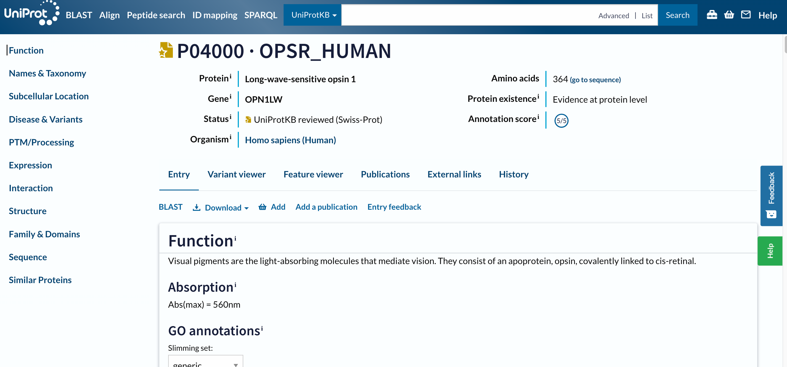

When doing a biological data analysis, we might end up with some interesting proteins, that we need explore these genes. But how can we do that? What are the resources available for that? And how to navigate through them?

The aim of this tutorial is to familiarize ourselves with that, using Human opsins as an example.

> <comment-title></comment-title>
> This tutorial is a bit atypical: we will not work in Galaxy but mostly outside of it, in the [UniProt](https://uniprot.org) database pages.
{: .comment}

> <comment-title></comment-title>
> This tutorial  designed to be the continuation of the tutorial ["One gene across file formats"](), but it can also be consulted as a stand-alone module. 
{: .comment}

Opsins are found in the cells of your retina. They catch light and begin the sequence of signals that result in vision, and that is the reason why, when compromised, they are associated to color-blindness and other visual impairments. 

> <comment-title>Sources of information from this tutorial</comment-title>
>
> The tutorial you are consulting was mainly developed consulting UniProtKB resources, in particular the [Explore UniProtKB entry](https://www.uniprot.org/help/explore_uniprotkb_entry) tutorial. 
> Some sentences are reported from there with no modifications.
> 
> In addition, the topic was chosen based Gale Rhodes' [Bioinformatics Tutorial](https://spdbv.unil.ch/TheMolecularLevel/Matics/index.html). Although the tutorial cannot be anymore be followed step by step due to how the mentioned resources changed in time, it could provide additional insights on opsins and in particular how one could build structural models of proteins based on evolutionary information. 
>
{: .comment}

> <agenda-title></agenda-title>
>
> In this tutorial we will deal with:
>
> 1. TOC
> {:toc}
{: .agenda}

# The UniProtKB Entry page

The portal to visit to obtain all information about a protein is [UniProtKB](https://www.uniprot.org/). We can search it using a text search, or the gene or protein name. Let's try first a set of generic keywords, like `Human opsin`. 

> <hands-on-title>Search for Human opsin on UniProtKB</hands-on-title>
>
> 1. Open the [UniProtKB](https://www.uniprot.org/)
> 2. Type `Human opsin` in the search bar
> 3. Launch the search
>
{: .hands-on}

> <question-title></question-title>
>
> How many results did we get?
>
> > <solution-title></solution-title>
> >
> > 410 results (at the time of preparation of this tutorial)
> >
> {: .solution}
{: .question}

These 410 results give us the feeling that we need to be more specific (although - spoiler - our actual target is among the first hits).

To be specific enough, we suggest to use an unique identifier. From the [previous tutorial]() we know the gene name of the protein that we are looking for, `OPN1LW`.

> <hands-on-title>Search for OPN1LW on UniProtKB</hands-on-title>
>
> 1. Type `OPN1LW` in the top search bar
> 2. Launch the search
>
{: .hands-on}

> <question-title></question-title>
>
> 1. How many results did we get?
> 2. What should we do to reduce this number?
>
> > <solution-title></solution-title>
> >
> > 1. 200+ results (at the time of preparation of this tutorial)
> > 2. We need to clarify what we are looking for: Human OPN1LW
> {: .solution}
{: .question}

We need to add `Human` to clarify what we are looking for.

> <hands-on-title>Search for Human OPN1LW on UniProtKB</hands-on-title>
>
> 1. Type `Human OPN1LW` in the top search bar
> 2. Launch the search
>
{: .hands-on}

> <question-title></question-title>
>
> 1. How many results did we get?
> 2. Do we have one result including OPN1LW as gene name?
>
> > <solution-title></solution-title>
> >
> > 1. 7 results (at the time of preparation of this tutorial)
> > 2. The first result is labeled with `Gene: OPN1LW (RCP)`
> {: .solution}
{: .question}

The first result, labeled with `Gene: OPN1LW (RCP)`, is our target, `P04000 · OPSR_HUMAN`. Before opening the page, two things to notice: 

1. The name of the protein `OPSR_HUMAN` is different than the gene name, as well as their IDs are. 
2. This entry has a golden star, which means that was manually annotated and curated. 

# Inspecting a UniProt entry

> <hands-on-title>Open a result on UniProt</hands-on-title>
>
> 1. Click on `P04000 · OPSR_HUMAN`
{: .hands-on}

To navigate this long page, the menu (navigation bar) on the left will be extremely useful. Just from it, we understand that this database contains information about the entry on: 
- the known functions, 
- the taxonomy, 
- the location,
- variants and associated diseases, 
- Post Translational Modification (PTMs), 
- the expression, 
- the interactions, 
- the structure, 
- the domains and their classification, 
- the sequences
- similar proteins. 

The navigation bar stays in the same place on the screen as you move up and down in an entry, so that you can quickly navigate to sections of interest. We will consult all the mentioned sections separately, but let's first focus on the headers on the left. 

At the top of the page, you can see the UniProt entry accession and name, the name of the protein and gene, the organism, whether the protein entry has been manually reviewed by a UniProt curator, its annotation score, and the evidence level for its existence.

Below the main header, you find a series of tabs (*Entry*, *Variant viewer*, *Feature viewer*, *Publications*, *External links*, *History*). The tabs allow you to switch between the entry, a graphical view of sequence features (Feature viewer), publications, and external links, but ignore them for the moment and do not move from the *Entry* tab. 

## Entry

The next menu is already part of the *Entry* tab. It allows us to run a BLAST sequence similarity search on the entry, align it with all its isoforms, download the entry in various formats, or add it to the basket to save for later.

> <question-title></question-title>
>
> 1. What are the available formats in the *Download* drop-down menu? 
> 2. What type of information would we download through these file formats?
>
> > <solution-title></solution-title>
> > 
> > 1. The formats are: `Text`, `FASTA (canonical)`, `FASTA (canonical & isoform`, `JSON`, `XML`, `RDF/XML`, `GFF`
> > 2. The`FASTA` formats should sound familiar (after the preliminary tutorial), and include the protein sequence, eventually with its isoforms (in which case it will be a multi-FASTA). Besides these, all the other formats are not protein- or even biology-specific. These are general file formats extensively used by websites to include the information included in the page. Hence, by downloading `text` (or even better the `json`) file, we would download the same annotation that we access in this page, but in a format that is easier to parse programmatically.  
> >
> {: .solution}
{: .question}

Let's now scroll the entry page, section by section. 

### Function

This section summarises the functions of this protein as follows: 

Visual pigments are the light-absorbing molecules that mediate vision. They consist of an apoprotein, opsin, covalently linked to cis-retinal.

Regardless of the level of details that you understand (depending on your background), this is impressively short and specific considering the enourmous amount of literature and studies that exist beyond the determination of a protein function. Anyway, someone did the work for us, and this protein is already fully classified in the Gene Ontology (GO), which describes any classified protein's molecular function, biological process and cellular component. 

GO is a perfect example of database / resource that builds on a very complex universe of knowledge and translates it into a simpler graph, at the risk of losing  details. This has the great advantage of organising the information, making it countable and analysable and programmatically accessible, ultimately allowing us to have this long summary pages and KnowledgeBases. 

> <question-title></question-title>
>
> 1. To which molecular functions is this protein annotated?
> 2. To which cellular components is this protein annotated?
> 3. To which biological processes this protein annotated?
>
> > <solution-title></solution-title>
> > 
> > 1. Photoreceptor protein, G-protein coupled receptor
> > 2. Photoreceptor disc membrane
> > 2. Sensory transduction, Vision 
> >
> {: .solution}
{: .question}

### Names and Taxonomy

Other examples of structured information are available in the next section, e.g. in the taxonomy. This section also reports other unique identifiers that refer to the same biological entity or to linked entities (e.g. associated diseases in the `MIM` menu).

> <question-title></question-title>
>
> 1. What is the taxonomic identifier associated with this protein?
> 2. What is the proteome identifier associated with this protein?
>
> > <solution-title></solution-title>
> > 
> > 1. 9606, i.e. Homo sapiens
> > 2. UP000005640, componenent of Chromosome Xs
> {: .solution}
{: .question}

## Subcellular location

We already know where our protein is in the human body (in the retina, as specified by the function summary), but where is it in the cell? 

> <question-title></question-title>
>
> 1. Where is our protein in the cell?
> 2. Is it consistent with the GO annotation observed before?
>
> > <solution-title></solution-title>
> > 
> > 1. The section explains that it is a "Multi-pass membrane protein", which means that it is a protein inserted in the cell membrane and goin through it multiple times.
> > 2. The GO Annotation on the top mentions that we are referring to the photoreceptor (cell) membrane in particular. 
> {: .solution}
{: .question}

The Subcellular location section includes a *Features* area detailing which sections, along the protein sequence, are inserted in the membrane (Transmembrane) and which not (Topological domain). 

> <question-title></question-title>
>
> How many Transmembrane domains and Topological domains are there?
>
> > <solution-title></solution-title>
> > 
> > 8 Transmembrane and 7 Topological domains
> {: .solution}
{: .question}

### Disease & Variants

As we know from the previous tutorial, this gene/protein is associated to multiple diseases. This section details this association also listing the specific variants that have been detected as disease-related. 

> <question-title></question-title>
>
> What types of scientific studies allow to assess the association of a genetic variant to diseases?
>
> > <solution-title></solution-title>
> > 
> > Three commonly used methods for assessing the association of a genetic variant with a disease are:
> >
> > - Genome-Wide Association Studies (GWAS)
> >
> >   GWAS are widely used to identify common genetic variants associated with diseases. They involve scanning the entire genome of a large number of individuals to identify variations linked to a particular disease or trait.
> >
> > - Case-Control Studies
> >
> >   Case-control studies are frequently employed to compare individuals with a disease to those without it, focusing on the presence or frequency of specific genetic variants in both groups.
> >
> > - Family Studies
> >
> >   Family-based studies involve analyzing genetic variants within families where multiple members are affected by a disease. By studying the inheritance patterns of genetic variants and their association with the disease within families, researchers can identify potential disease-associated genes.
> >
> >
> > These type of studies would imply extensive usage of the file types to manage genomic data, such as: SAM (Sequence Alignment Map), BAM (Binary Alignment Map), VCF (Variant Calling Format) etc.  
> >
> {: .solution}
{: .question}

This section also includes a *Features* area, where the natural variants are mapped along the sequence. Below, it also highlights that a more detailed view of features along the sequence is provided in the *Disease & Variants* tab, but let's not open it for now. 

### PTM/Processing

A post-translational modification (PTM) is a covalent processing event resulting from a proteolytic cleavage or from the addition of a modifying group to one amino acid. 

> <question-title></question-title>
>
> What are the post-translational modifications for our protein?
>
> > <solution-title></solution-title>
> > 
> > Chain, glycosylation, disulfide bond, modified residue
> {: .solution}
{: .question}

### Expression

We already know where the protein is in the cell, but for human proteins we often have information on where it is in the human body, i.e. in which tissues. This information can come from the Human [ExpressionAtlas](https://www.ebi.ac.uk/gxa/home) or other similar resources. 

> <question-title></question-title>
>
> In which tissue is the protein found?
>
> > <solution-title></solution-title>
> > 
> > The three color pigments are found in the cone photoreceptor cells.
> {: .solution}
{: .question}

### Interaction

Proteins perform their function through their interaction with the surroundings, in particular with other proteins. This section reports the interactors of our protein of interest, in a table that we can also filter by subcellular location, diseases, and type of interaction. 

The source of this information are databases like STRING, and the entry page for our protein is directly linked from this section. 

> <hands-on-title>Search for Human OPN1LW on UniProtKB</hands-on-title>
>
> 1. Click on the [STRING link](https://string-db.org/network/9606.ENSP00000358967) in a different tab 
>
{: .hands-on}

> <question-title></question-title>
>
> 1. How many different file formats can you download from there?
> 2. What kind of information will be conveyed in each file?
>
> > <solution-title></solution-title>
> > 
> >  STRING provides data in downloadable file formats to support further analyses. 
> >  The primary file format used by STRING is the 'TSV' (Tab-Separated Values) format, which presents protein interaction data in a structured, tabular layout. This format is well-suited for easy integration into various data analysis tools and software. 
> >  Additionally, STRING offers data in PSI-MI (Proteomics Standards Initiative Molecular Interactions) XML format, a standard for representing protein interaction data that allows for compatibility with other interaction databases and analysis platforms. These file formats enable researchers to harness the wealth of protein interaction information in STRING for their own studies and analyses. Researchers can also download visual representations of protein networks in image formats such as PNG and SVG, which are suitable for presentations and publications. For advanced analysis, STRING offers 'flat files' containing detailed interaction information, and 'MFA' (Multiple Alignment Format) files, which are useful for comparing multiple protein sequences. These diverse downloadable file formats enable researchers to harness the wealth of protein interaction information in STRING for their own studies and analyses.
> >
> {: .solution}
{: .question}

### Structure

Are you curious about the intricate three-dimensional structures of proteins? The *Structure* section on the UniProtKB entry page is your gateway to exploring the fascinating world of protein architecture. 

In this section, you'll find information about experimentally determined protein structures. These structures provide crucial insights into how proteins function and interact with other molecules. You will discover interactive views of the protein's structure that you can explore directly within the UniProtKB entry. This feature provides an engaging way to navigate through the protein's domains, binding sites, and other functional regions. By delving into the *Structure* section, you'll gain a deeper understanding of the physical basis of protein function and discover the wealth of information that structural data can unlock.

> <question-title></question-title>
>
> 1. What is the variant associated to color blindness?
> 2. Can you find that specific amino acid in the structure? 
> 3. Can you formulate a guess of why this mutation is disruptive?
>
> > <solution-title></solution-title>
> >
> > 1. In the *Disease & Variants* section, we discover that the change from Glycine (G) to Glutamic acid (E) at position 338 along the protein sequence is associated to Colorblindness. 
> > 2. In the structure viewer, we can move the molecule around and hover the mouse on the structure to find the AA in position 338. It might take some time to follow through the multiple helical arrangements of these structures. The Glycine at 338 is not in a helix, but in what looks like a loop just before a low confidence area in the structure. 
> > 3. Based on the information we collected so far, we could make a hypothesis of why this is distruptive. It is not in a helix (usually, in transmembrane proteins, helices are inserted in the membrane), hence, it is in one of the bigger domains that protrude from the membrane, in or out of the cell. This mutation probably doesn't distrupt the structure in its intra-membrane segments, but rather one of the functional domain. If you want to dig deeper, you can check if this is the extra- or intra-cellular segment in the **Feature viewer**.
> >
> {: .solution}
{: .question}

Where does the information in the structure viewer come from?

> <hands-on-title>Search for Human OPN1LW on UniProtKB</hands-on-title>
>
> 1. Click on the download icon below the structure
> 2. Check the file that has been downloaded
>
{: .hands-on}

This is a PDB (Protein Data Bank) file, allowing you to visualize and analyze the protein's arrangement of atoms and amino acids. 

However, there is no reference to the PDB database in the links among the *3D structure databases*. Instead, the first link refers to the AlphaFoldDB. The AlphaFold Database is a comprehensive resource that provides predicted 3D structures for a wide range of proteins. Using deep learning techniques and evolutionary information, AlphaFold accurately predicts the spatial arrangement of atoms within a protein, contributing to our understanding of protein function and interactions. 

Hence, this is a *prediction* of the structure, not a structure experimentally validated. This is the reason why it is colored by confidence: the sections in blue are those with a high confidence value, so the ones for which the prediction is very reliable, while the ones in orange are less reilable or have a disordered (more flexible and mobile) structure. Nevertheless, this information is represented through a PDB file, because it is still structural. 

### Family and Domains

The *Family and Domains* section on the UniProtKB entry page provides a comprehensive view of the evolutionary relationships and functional domains within a protein. This section offers insights into the protein's membership in protein families, superfamilies, and domains, shedding light on its structural and functional characteristics. 

The *Features* area confirms indeed that at least one of the two domains protruding from the membrane (the N-terminal one) is disordered. This area usually includes information about conserved regions, motifs, and important sequence features that contribute to the protein's role in various biological processes. The section confirms once again that we are looking at a transmembrane protein, and links to several resources of phylogenetic, protein families or domains data - guiding us on understading how proteins share common ancestry, evolve, and acquire specialized functions.

### Sequence

All this information about the protein's evolution, function, structure, is ultimately encoded in its sequence. Once again, in this section we have the opportunity to download the FASTA file transcribing it, as well as to access the source of this data: the genomic sequencing experiments that assessed it. This section also reports when isoforms have been detected. 

> <question-title></question-title>
>
> How many potential isoforms are mapped to this entry?
>
> > <solution-title></solution-title>
> >
> > 1: H0Y622
> >
> {: .solution}
{: .question}

### Similar proteins

The last section of the UniProt Entry page reports similar proteins (this is basically the result of a clustering, with 100%, 90% and 50% identity thresholds).

> <question-title></question-title>
>
> 1. How many similar proteins at 100% identity?
> 2. How many similar proteins at 90% identity?
> 3. How many similar proteins at 50% identity?
>
> > <solution-title></solution-title>
> >
> > 1. 0
> > 2. 83
> > 3. 397
> >
> {: .solution}
{: .question}

As you might have guessed while looking at this page, a lot of the processing of biological data about a protein actually consists of mapping different types of information along the sequence, and understand how they influence each other. A visual mapping (and a table with the same information) is provided by the two alternative tabs to view this entry, that is the *Variant viewer* and the *Feature viewer*. 

## Variant viewer

> <hands-on-title>Variant viewer</hands-on-title>
>
> 1. Click on *Variant viewer* tab
>
{: .hands-on}

The *Variant viewer* maps all the known alternative versions of this sequence. For some of them the effect (pathogenic or benign) is known, for others not. 

> <question-title></question-title>
>
> How many variant are likely pathogenic?
>
> > <solution-title></solution-title>
> >
> > By zooming out in the variant view, we see that we have 5 red points, so 5 variants that are likely pathogenic.
> >
> {: .solution}
{: .question}

The high number of variants that you find in this section suggests that "protein sequences" (as well as gene sequences, protein structures etc.) are actually less fixed entities than what we would think.

## Feature viewer

> <hands-on-title>Feature viewer</hands-on-title>
>
> 1. Click on *Feature viewer* tab
>
{: .hands-on}

The *Feature viewer* is basically a merged version of all the *Features* areas that we found in the *Entry* page, including *Domains & sites*, *Molecule processing*, *PTMs*, *Topology*, *Proteomics*, *Variants*. If in the viewer you click on any feature, the correspondent region in the structure will be focused, as the variant of interest

> <hands-on-title>Variant viewer</hands-on-title>
>
> 1. Expand the *Variants* part
> 2. Zoom out
> 3. Click on our variant of interest (the red point at position 338)
>
{: .hands-on}

> <question-title></question-title>
>
> What is the topology at this location?
>
> > <solution-title></solution-title>
> >
> > A topological cytoplasmic domain
> >
> {: .solution}
{: .question}

Finally, let's have a quick look at the other tabs. 

## Publications

> <hands-on-title>Publication</hands-on-title>
>
> 1. Click on *Publication* tab
>
{: .hands-on}

The *Publications* one lists scientific publications related to the protein. These are collected by merging a fully curated list in UniProtKB/Swiss-Prot and automatically imported ones. In this tab, you can filter the publications list by source and categories that are based on the type of data a publication contains about the protein (such as function, interaction, sequence, etc.), or by the number of proteins in the corresponding study it describes ("small scale" vs "large scale").

> <question-title></question-title>
>
> 1. How many publications are associated with this protein?
> 2. How many publications contains information about its function?
>
> > <solution-title></solution-title>
> >
> > 1. 57
> > 2. 23
> >
> {: .solution}
{: .question}

## External links

> <hands-on-title>External links</hands-on-title>
>
> 1. Click on *External links* tab
>
{: .hands-on}

The *External links* tab puts together all the references to external databases and resources of information that we found in each Entry page section. The links text often reports the unique identifiers that represent the same biological entity in other databases. To get a feeling of this compexity, check the following image (that is already partially outdated).

")

## History

Finally, the *History* tab is also an interesting one. It reports and makes available for download all the previous versions of this entry annotations, that is: all the "evolution" of its annotation, in this case dating back to 1988. 

> <question-title></question-title>
>
> Was this entry ever not manually annotated?
>
> > <solution-title></solution-title>
> >
> > To answer this question you can scroll back in time through the table and check the `Database` column. Was this ever in TrEMBL instead that in SwissProt? No, so this entry was manually annotated since its beginning.
> >
> {: .solution}
{: .question}
