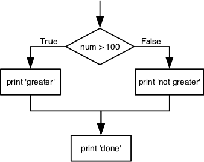
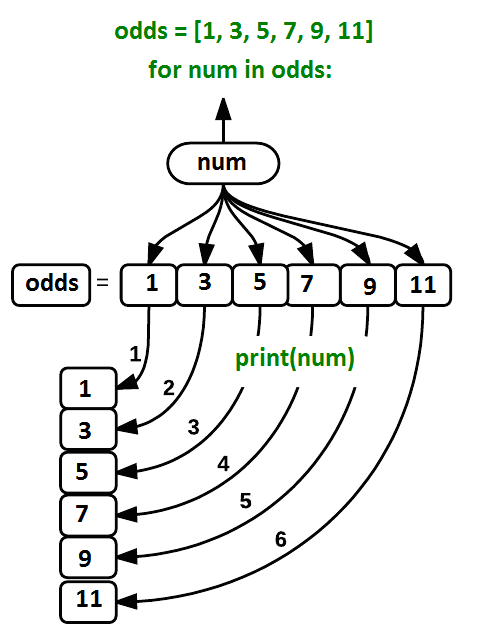

In this lesson, we will be using Python 3 with some of its most popular scientific libraries. We will be using JupyterNotebook, a Python interpreter that comes with everything we need for the lesson.

> ###  Comment
> This tutorial is **significantly** based on [the Carpentries](https://carpentries.org) [Programming with Python](https://swcarpentry.github.io/python-novice-inflammation/) and [Plotting and Programming in Python](https://swcarpentry.github.io/python-novice-gapminder/), which is licensed CC-BY 4.0.
>
> Adaptations have been made to make this work better in a GTN/Galaxy environment.
{: .comment}

> ### Agenda
>
> In this tutorial, we will cover:
>
> 1. TOC
> {:toc}
>
{: .agenda}


# Overview

Python was developed by Guido van Rossum. Guido van Rossum started implementing Python in 1989. Python is a very simple programming language so even if you are new to programming, you can learn python without facing any issues.

Features of Python language:
1. **Readable**: Python is a very readable language.

2. **Easy to Learn**: Learning python is easy as this is a expressive and high level programming language, which means it is easy to understand the language and thus easy to learn.

3. **Cross platform**: Python is available and can run on various operating systems such as Mac, Windows, Linux, Unix etc. This makes it a cross platform and portable language.

4. **Open Source**: Python is a open source programming language.

5. **Large standard library**: Python comes with a large standard library that has some handy codes and functions which we can use while writing code in Python.

6. **Free**: Python is free to download and use. This means you can download it for free and use it in your application.

7. **Supports exception handling**: Python supports exception handling which means we can write less error prone code and can test various scenarios that can cause an exception later on.

8. **Automatic memory management**: Python supports automatic memory management which means the memory is cleared and freed automatically. You do not have to bother clearing the memory.


> ###  Why Jupyter?
>
> JupyterLab is a User Interface including notebooks. A user can open several notebooks or files as tabs in the same window, like an IDE. JupyterNotebook is a web-based interactive computational environment for creating Jupyter notebook documents. It supports several languages like Python (IPython), Julia, R etc. and is largely used for data analysis, data visualization and further interactive, exploratory computing.
>
> JupyterNotebook has several advantages:
>
> - You can easily type, edit, and copy and paste blocks of code.
> - Tab complete allows you to easily access the names of things you are using and learn more about them.
> - It allows you to annotate your code with links, different sized text, bullets, etc. to make it more accessible to you and your collaborators.
> - It allows you to display figures next to the code that produces them to tell a complete story of the analysis.
>
> Each notebook contains one or more cells that contain code, text, or images. Each notebook can be exported (File, Export as, Executable script) as Python script that can be run from the command line.
>
> We will be using JupyterNotebook in Galaxy and as a result you need to frequently save the notebook in the workspace. This is both for good practice and to protect you in case you accidentally close the browser. Your environment will still run, so it will contain the last saved notebook you have.  Furthermore, you need to download a notebook, before you delete or close a notebook in your history or you will lose it.
{: .tip}


# Python Fundamentals

## Variables

Any Python interpreter can be used as a calculator:

```python
3 + 5 * 4
```

This is great but not very interesting. To do anything useful with data, we need to assign its value to a variable. In Python, we can assign a value to a variable, using the equals sign ```=```. For example, we can track the weight of a patient who weighs 60 kilograms by assigning the value 60 to a variable ```weight_kg```:

```python
weight_kg = 60
```

From now on, whenever we use `weight_kg`, Python will substitute the value we assigned to it.

In Python, variable names:

- can include letters, digits, and underscores
- cannot start with a digit
- are case sensitive

This means that, for example:

- `weight0` is a valid variable name, whereas `0weight` is not
- `weight` and `Weight` are different variables


### Types of data

Python knows various types of data. Three common ones are:

- integer numbers
- floating point numbers, and
- strings.

In the example above, variable `weight_kg` has an integer value of `60`. If we want to more precisely track the weight of our patient, we can use a floating point value by executing:

```python
weight_kg = 60.3
```

To create a string, we add single or double quotes around some text. To identify and track a patient throughout our study, we can assign each person a unique identifier by storing it in a string:

```python
patient_id = '001'
```

### Using Variables in Python

Once we have data stored with variable names, we can make use of it in calculations. We may want to store our patient’s weight in pounds as well as kilograms:

```python
weight_lb = 2.2 * weight_kg
```

We might decide to add a prefix to our patient identifier:

```python
patient_id = 'inflam_' + patient_id
```

### Variables Persist Between Cells
Be aware that it is the order of execution of cells that is important in a Jupyter notebook, not the order in which they appear. Python will remember all the code that was run previously, including any variables you have defined, irrespective of the order in the notebook. Therefore if you define variables lower down the notebook and then (re)run cells further up, those defined further down will still be present. As an example, create two cells with the following content, in this order:

```python
print(myval)
myval = 1
```
If you execute this in order, the first cell will give an error. However, if you run the first cell after the second cell, it will print out 1. To prevent confusion, it can be helpful to use the Kernel -> Restart & Run All option which clears the interpreter and runs everything from a clean slate going top to bottom.


> ###  Question: Variables and values
>
> What values do the variables `mass` and `age` have after each of the following statements? Test your answer by executing the lines.
> ```
> mass = 47.5
> age = 122
> mass = mass * 2.0
> age = age - 20
> ```
>
> > ###  Solution
> >
> > `mass` holds a value of 47.5, `age` does not exist
> > `mass` still holds a value of 47.5, `age` holds a value of 122
> > `mass` now has a value of 95.0, `age`'s value is still 122
> > `mass` still has a value of 95.0, `age` now holds 102
> >
> {: .solution}
{: .question}


> ###  Question: Variables
>
> Python allows you to assign multiple values to multiple variables in one line by separating the variables and values with commas. What does the following program print out?
> ```
> first, second = 'Grace', 'Hopper'
> third, fourth = second, first
> print(third, fourth)
> ```
>
> > ###  Solution
> >
> > Hopper Grace
> >
> {: .solution}
{: .question}


> ###  Question: Variables and data types
>
> What are the data types of the following variables?
>
> ```
> planet = 'Earth'
> apples = 5
> distance = 10.5
> ```
>
> > ###  Solution
> >
> > ```
> > type(planet)
> > type(apples)
> > type(distance)
> > ```
> >
> {: .solution}
{: .question}


## Lists

Lists are built into the language so we do not have to load a library to use them. We create a list by putting values inside square brackets and separating the values with commas:

```python
odds = [1, 3, 5, 7]
print('odds are:', odds)
```


We can access elements of a list using indices – numbered positions of elements in the list. These positions are numbered starting at 0, so the first element has an index of 0.

```python
print('first element:', odds[0])
print('last element:', odds[3])
print('"-1" element:', odds[-1])
```

Yes, we can use negative numbers as indices in Python. When we do so, the index `-1` gives us the last element in the list, `-2` the second to last, and so on. Because of this, `odds[3]` and `odds[-1]` point to the same element here.

There is one important difference between lists and strings: we can change the values in a list, but we cannot change individual characters in a string. For example:

```python
names = ['Curie', 'Darwing', 'Turing']  # typo in Darwin's name
print('names is originally:', names)
names[1] = 'Darwin'  # correct the name
print('final value of names:', names)
```


works, but the following does not:

```python
name = 'Darwin'
name[0] = 'd'
```

Lists in Python can contain elements of different types. Example:

```python
sample_ages = [10, 12.5, 'Unknown']
```

There are many ways to change the contents of lists besides assigning new values to individual elements:

We can append new elements to a list

```python
odds.append(11)
print('odds after adding a value:', odds)
```

We can pop an element off the end of a list

```python
removed_element = odds.pop(0)
print('odds after removing the first element:', odds)
print('removed_element:', removed_element)
```

Or we can reverse the list

```python
odds.reverse()
print('odds after reversing:', odds)
```


### Mutable vs Immutable data
Data which can be modified in place is called mutable, while data which cannot be modified is called immutable. Strings and numbers are immutable. This does not mean that variables with string or number values are constants, but when we want to change the value of a string or number variable, we can only replace the old value with a completely new value.

Lists and arrays, on the other hand, are mutable: we can modify them after they have been created. We can change individual elements, append new elements, or reorder the whole list. For some operations, like sorting, we can choose whether to use a function that modifies the data in-place or a function that returns a modified copy and leaves the original unchanged.

Be careful when modifying data in-place. If two variables refer to the same list, and you modify the list value, it will change for both variables!

```python
salsa = ['peppers', 'onions', 'cilantro', 'tomatoes']
my_salsa = salsa        # <-- my_salsa and salsa point to the *same* list data in memory
salsa[0] = 'hot peppers'
print('Ingredients in my salsa:', my_salsa)
```

If you want variables with mutable values to be independent, you must make a copy of the value when you assign it.

```python
salsa = ['peppers', 'onions', 'cilantro', 'tomatoes']
my_salsa = salsa.copy()        # <-- makes a *copy* of the list
salsa[0] = 'hot peppers'
print('Ingredients in my salsa:', my_salsa)
```


Because of pitfalls like this, code which modifies data in place can be more difficult to understand. However, it is often far more efficient to modify a large data structure in place than to create a modified copy for every small change. You should consider both of these aspects when writing your code.

### Nested lists
Since a list can contain any Python variables, it can even contain other lists.

For example, we could represent the products in the shelves of a small grocery shop:

```python
x = [['pepper', 'zucchini', 'onion'],
   ['cabbage', 'lettuce', 'garlic'],
   ['apple', 'pear', 'banana']]
```

Here is an example of how indexing a list of lists `x` works:

```python
print([x[0]])
print(x[0])
print(x[0][0])
```


### Slicing
Subsets of lists can be accessed by specifying ranges of values in brackets. This is commonly referred to as “slicing” the list.

```python
chromosomes = ['X', 'Y', '2', '3', '4']
autosomes = chromosomes[2:5]
print('autosomes:', autosomes)
last = chromosomes[-1]
print('last:', last)
```


> ###  Question: Negative indices
>
> Use slicing to access only the last four characters of a string or entries of a list.
>
> ```
> string_for_slicing = 'Observation date: 02-Feb-2013'
> list_for_slicing = [['fluorine', 'F'], ['chlorine', 'Cl'], ['bromine', 'Br'], ['iodine', 'I'], ['astatine', 'At']]
> ```
> Your output should be:
> '2013'
> [['chlorine', 'Cl'], ['bromine', 'Br'], ['iodine', 'I'], ['astatine', 'At']]
>
> Would your solution work regardless of whether you knew beforehand the length of the string or list (e.g. if you wanted to apply the solution to a set of lists of different lengths)? If not, try to change your approach to make it more robust.
> Hint: Remember that indices can be negative as well as positive.
>
> > ###  Solution
> >
> > Use negative indices to count elements from the end of a container (such as list or string):
> > ```
> > string_for_slicing[-4:]
> > list_for_slicing[-4:]
> > ```
> >
> {: .solution}
{: .question}


> ###  Question: Slicing
>
> So far we’ve seen how to use slicing to take single blocks of successive entries from a sequence. But what if we want to take a subset of entries that aren’t next to each other in the sequence?
>
> You can achieve this by providing a third argument to the range within the brackets, called the step size. The example below shows how you can take every third entry in a list:
>
> ```
> primes = [2, 3, 5, 7, 11, 13, 17, 19, 23, 29, 31, 37]
> subset = primes[0:12:3]
> print('subset', subset)
> ```
>
> Notice that the slice taken begins with the first entry in the range, followed by entries taken at equally-spaced intervals (the steps) thereafter. What if you wanted to begin the subset with the third entry? Use the previous example to write your solution that gives the following output.
>
> > ###  Solution
> >
> > You would need to specify that as the starting point of the sliced range:
> >
> > ```
> > subset = primes[2:12:3]
> > print('subset', subset)
> > ```
> >
> {: .solution}
{: .question}


## Strings

### Use an index to get a single character from a string.

The characters (individual letters, numbers,and so on) in a string are ordered. For example, the string 'AB' is not the same as 'BA'. Because of this ordering, we can treat the string as a list of characters. Each position in the string (first, second, etc.) is given a number. This number is called an index or sometimes a subscript. Indices are numbered from 0.You can use the position’s index in square brackets to get the character at that position.

```python
atom_name = 'helium'
print(atom_name[0])
```

### Use a slice to get a substring.
A part of a string is called a substring. A substring can be as short as a single character. An item in a list is called an element. Whenever we treat a string as if it were a list, the string’s elements are its individual characters. A slice is a part of a string (or, more generally, any list-like thing). We take a slice by using [start:stop], where start is replaced with the index of the first element we want and stop is replaced with the index of the element just after the last element we want. Mathematically, you might say that a slice selects [start:stop). The difference between stop and start is the slice’s length. Taking a slice does not change the contents of the original string. Instead, the slice is a copy of part of the original string.

```python
atom_name = 'sodium'
print(atom_name[0:3])
```

You can use the built-in function `len` to find the length of a string.

```python
print(len('helium'))
```

Nested functions are evaluated from the inside out, like in mathematics.

> ###  Question: Slicing
>
> Use what you have learnt in this tutorial to answer the following questions:
> a. What does the following program print?
> ```
> atom_name = 'carbon'
> print('atom_name[1:3] is:', atom_name[1:3])
> ```
> b. What does `thing[low:high]` do?
> c. What does `thing[low:]` (without a value after the colon) do?
> d. What does `thing[:high]` (without a value before the colon) do?
> e. What does `thing[:]` (just a colon) do?
> f. What does `thing[number:some-negative-number]` do?
> g. What happens when you choose a high value which is out of range? (i.e., try `atom_name[0:15]`)
>
> > ###  Solution
> >
> > a. `atom_name[1:3] is: ar`
> > b. `thing[low:high]` returns a slice from low to the value before high
> > c. `thing[low:]` returns a slice from low all the way to the end of thing
> > d. `thing[:high]` returns a slice from the beginning of thing to the value before high
> > e. `thing[:]` returns all of thing
> > f. `thing[number:some-negative-number]` returns a slice from number to some-negative-number values from the end of thing
> > g. If a part of the slice is out of range, the operation does not fail. `atom_name[0:15]` gives the same result as `atom_name[0:]`.
> >
> {: .solution}
{: .question}


### You can use the “+” and “*” operators on strings/lists.

“Adding” character strings concatenates them.

```python
full_name = 'Ahmed' + ' ' + 'Walsh'
print(full_name)
```


Multiplying a character string by an integer "N" creates a new string that consists of that character string repeated N times.

Since multiplication is repeated addition.

```python
separator = '=' * 10
print(separator)
```


The same rules apply for lists. Consider the following example:

```python
counts = [2, 4, 6, 8, 10]
repeats = counts * 2
print(repeats)
```


It’s equivalent to:

```python
counts + counts
```

Strings have a length (but numbers don’t).The built-in function `len` counts the number of characters in a string.

```python
print(len(full_name))
```


But numbers don’t have a length (not even zero). For example, the following command returns an error message.

```python
print(len(52))
```


## Type conversion

Python converts automatically integers to floats, when needed, but you must convert numbers to strings or vice versa when operating on them.
It is not allowed to add numbers and strings. For example `print(1 + '2')` is ambiguous: should `1 + '2'` be `3` or `'12'`?

Some types can be converted to other types by using the type name as a function.

```python
print(1 + int('2'))
print(str(1) + '2')
```

> ###  Question: Data types
>
> What type of value is 3.25 + 4?
>
> > ###  Solution
> >
> > It is a float: integers are automatically converted to floats as necessary.
> {: .solution}
{: .question}

> ###  Question: Division
>
> In Python 3, the `//` operator performs integer (whole-number) floor division, the `/` operator performs floating-point division, and the `%` (or *modulo*) operator calculates and returns the remainder from integer division:
>
> > ###  Python
> > ```
> > print('5 // 3:', 5 // 3)
> > print('5 / 3:', 5 / 3)
> > print('5 % 3:', 5 % 3)
> > ```
> {: .code-in}
>
> > ###  Output
> > ```
> > 5 // 3: 1
> > 5 / 3: 1.6666666666666667
> > 5 % 3: 2
> > ```
> {: .code-out}
>
> If `num_subjects` is the number of subjects taking part in a study, and `num_per_survey` is the number that can take part in a single survey, write an expression that calculates the number of surveys needed to reach everyone once.
>
> > ###  Solution
> >
> > We want the minimum number of surveys that reaches everyone once, which is the rounded up value of `num_subjects/ num_per_survey`. This is equivalent to performing a floor division with `//` and adding 1. Before the division we need to subtract 1 from the number of subjects to deal with the case where `num_subjects` is evenly divisible by `num_per_survey`.
> >
> > ```
> > num_subjects = 600
> > num_per_survey = 42
> > num_surveys = (num_subjects - 1) // num_per_survey + 1
> >
> > print(num_subjects, 'subjects,', num_per_survey, 'per survey:', num_surveys)
> > ```
> >
> {: .solution}
{: .question}


> ###  Question: Typecasting
>
> Where reasonable, `float()` will convert a string to a floating point number, and `int()` will convert a floating point number to an integer:
>
> > ###  Python
> > ```
> > print("string to float:", float("3.4"))
> > print("float to int:", int(3.4))
> > ```
> {: .code-in}
>
> > ###  Output
> > ```
> > string to float: 3.4
> > float to int: 3
> > ```
> {: .code-out}
>
> If the conversion doesn’t make sense, however, an error message will occur.
> Given this information, what do you expect the following program to do? What does it actually do? Why do you think it does that?
> ```
> print("fractional string to int:", int("3.4"))
> ```
>
> > ###  Solution
> >
> > Python 3 throws an error. If you ask Python to perform two consecutive typecasts, you must convert it explicitly in code.
> >
> > ```
> > int(float("3.4"))
> > ```
> >
> {: .solution}
{: .question}

> ###  Question: Typecasting
>
> Which of the following will return the floating point number `2.0`? Note: there may be more than one right answer.
> ```
> first = 1.0
> second = "1"
> third = "1.1"
> ```
>
> 1. `first + float(second)`
> 2. `float(second) + float(third)`
> 3. `first + int(third)`
> 4. `first + int(float(third))`
> 5. `int(first) + int(float(third))`
> 6. `2.0 * second`
>
> > ###  Solution
> >
> > Answer: 1 and 4
> {: .solution}
{: .question}


> ###  Question: Imaginary numbers
>
> Python provides complex numbers, which are written as `1.0+2.0j`. If `val` is a complex number, its real and imaginary parts can be accessed using dot notation as `val.real` and `val.imag`.
>
> ```
> complex = 6 + 2j
> print(complex.real)
> print(complex.imag)
> ```
>
> Output:
> 6.0
> 2.0
>
> 1. Why do you think Python uses `j` instead of i for the imaginary part?
> 2. What do you expect `1+2j + 3` to produce?
> 3. What do you expect `4j` to be? What about `4 j` or `4 + j`?
>
> > ###  Solution
> >
> >1. Standard mathematics treatments typically use i to denote an imaginary number. However, from media reports it was an early convention established from electrical engineering that now presents a technically expensive area to change.
> >2. `(4+2j)`
> >3. `4j` and Syntax Error: invalid syntax. In the latter cases, `j` is considered a variable and the statement depends on if `j` is defined and if so, its assigned value.
> >
> {: .solution}
{: .question}


## Built-in Python functions

To carry out common tasks with data and variables in Python, the language provides us with several built-in functions. To display information to the screen, we use the `print` function:

```python
print(weight_lb)
print(patient_id)
```


When we want to make use of a function, referred to as calling the function, we follow its name by parentheses. The parentheses are important: if you leave them off, the function doesn’t actually run! Sometimes you will include values or variables inside the parentheses for the function to use. In the case of `print`, we use the parentheses to tell the function what value we want to display. `print` automatically puts a single space between outputs to separate them and wraps around to a new line at the end.

We can display multiple things at once using only one `print` call:

```python
print(patient_id, 'weight in kilograms:', weight_kg)
```


We can also call a function inside of another function call. For example, Python has a built-in function called `type` that tells you a value’s data type:

```python
print(type(60.3))
print(type(patient_id))
```


Moreover, we can do arithmetic with variables right inside the `print` function:

```python
print('weight in pounds:', 2.2 * weight_kg)
```

The above command, however, did not change the value of `weight_kg`:

```python
print(weight_kg)
```

To change the value of the `weight_kg` variable, we have to assign `weight_kg` a new value using the equals `=` sign:

```python
weight_kg = 65.0
print('weight in kilograms is now:', weight_kg)
```

A function may take zero or more arguments.  An *argument* is a value passed into a function. You must always use parentheses, even if they’re empty, so that Python knows a function is being called.

Every function call produces some result. If the function doesn’t have a useful result to return, it usually returns the special value `None`. `None` is a Python object that stands in anytime there is no value.

```python
result = print('example')
print('result of print is', result)
```

Commonly-used built-in functions include `max`, `min`, and `round`. `max` and `min` work on character strings as well as numbers. From “larger” and “smaller”, they use the order: (0-9, A-Z, a-z) to compare letters.
```python
print(max(1, 2, 3))
print(min('a', 'A', '0'))
```

Functions may have default values for some arguments. `round` will round off a floating-point number. By default, it rounds to zero decimal places.
```python
round(3.712)
```

We can specify the number of decimal places we want.
```python
round(3.712, 1)
```


### Functions attached to objects are called methods

Methods have parentheses like functions, but come after the variable. Some methods are used for internal Python operations, and are marked with double underlines.

```python
my_string = 'Hello world!'  # creation of a string object

print(len(my_string))       # the len function takes a string as an argument and returns the length of the string

print(my_string.swapcase()) # calling the swapcase method on the my_string object

print(my_string.__len__())  # calling the internal __len__ method on the my_string object, used by len(my_string)
```


You might even see them chained together. They operate left to right.

```python
print(my_string.isupper())          # Not all the letters are uppercase
print(my_string.upper())            # This capitalizes all the letters

print(my_string.upper().isupper())  # Now all the letters are uppercase
```

### Use the built-in function `help` to get help for a function.

Every built-in function has online documentation.

```python
help(round)
```


## Conditionals

An if statement (more properly called a conditional statement) controls whether some block of code is executed or not.
The first line opens with if and ends with a colon and the block of code to be executed is indented. An example is showed below.

```python
num = 37
if num > 100:
    print('greater')
else:
    print('not greater')
print('done')
```

If the expression that follows the if statement is true, the body of the `if` (i.e., the set of lines indented underneath it) is executed, and `“greater”` is printed. If it is false, the body of the `else` is executed instead, and `“not greater”` is printed. Only one or the other is ever executed before continuing on with program execution to print `“done”`:



Conditional statements don’t have to include an `else`.  If there isn’t one, Python simply does nothing if the expression is false:

```python
num = 53
print('before conditional...')
if num > 100:
    print(num, 'is greater than 100')
print('...after conditional')
```

We can also chain several expressions together using `elif`, which is short for “else if”. The following Python code uses `elif` to print the sign of a number.

```python
num = -3

if num > 0:
    print(num, 'is positive')
elif num == 0:
    print(num, 'is zero')
else:
    print(num, 'is negative')
```


### Comparison operators in Python
The operators used for comparing values in conditionals are the following:

- `>` : greater than
- `<` : less than
- `==` : equal to
- `!=` : does not equal
- `>=` : greater than or equal to
- `<=` : less than or equal to


### Logical operators in Python
We can also combine expressions using `and` and `or`. `and` is only true if both parts are true:

```python
if (1 > 0) and (-1 >= 0):
    print('both parts are true')
else:
    print('at least one part is false')
```


while `or` is true if at least one part is true:

```python
if (1 < 0) or (1 >= 0):
    print('at least one test is true')
```


### True and False
`True` and `False` are special words in Python called booleans, which represent truth values. A statement such as `1 < 0` returns the value `False`, while `-1 < 0` returns the value `True`.


> ###  Question: Conditionals
>
> What does this program print?
>
> ```
> pressure = 71.9
> if pressure > 50.0:
>     pressure = 25.0
> elif pressure <= 50.0:
>     pressure = 0.0
> print(pressure)
> ```
>
> > ###  Solution
> >
> > 25
> {: .solution}
{: .question}


> ###  Question: Conditionals
>
> Write some conditions that print `True` if the variable `a` is within 10% of the variable `b` and `False` otherwise. Compare your implementation with your partner’s: do you get the same answer for all possible pairs of numbers?
> Hint: There is a built-in function `abs()` that returns the absolute value of a number.
>
> > ###  Solution
> >
> > ```
> > a = 5
> > b = 5.1
> > if abs(a - b) <= 0.1 * abs(b):
> >    print('True')
> > else:
> >    print('False')
> > ```
> >
> {: .solution}
{: .question}


## For loops

Doing calculations on the values in a list one by one is very time consuming.

```python
odds = [1, 3, 5, 7, 9, 11]
print(odds[0])
print(odds[1])
print(odds[2])
print(odds[3])
print(odds[4])
print(odds[5])

```


A for loop tells Python to execute some statements once for each value in a list, a character string, or some other collection.
“for each thing in this group, do these operations”. The for loop equivalent to the previous code is:

```python
for num in odds:
    print(num)
```
The improved version uses a for loop to repeat an operation — in this case, printing — once for each thing in a sequence. The general form of a loop is:

```python
for variable in collection:
    # do things using variable, such as print
```

Using the odds example above, the loop might look like this:


where each number (`num`) in the variable odds is looped through and printed one number after another. The other numbers in the diagram denote which loop cycle the number was printed in (1 being the first loop cycle, and 6 being the final loop cycle).

We can call the loop variable anything we like, but there must be a colon at the end of the line starting the loop, and we must indent anything we want to run inside the loop. Unlike many other languages, there is no command to signify the end of the loop body (e.g. end for); what is indented after the for statement belongs to the loop. Python uses indentation to show nesting. Any consistent indentation is legal, but almost everyone uses four spaces.

When looping through a list, the position index and corresponding value can be retrieved at the same time using the `enumerate()` function.

```python
for i, v in enumerate(['tic', 'tac', 'toe']):
... print(i, v)
```


To loop over two or more lists at the same time, the entries can be paired with the `zip()` function.

```python
questions = ['name', 'quest', 'favorite color']
answers = ['lancelot', 'the holy grail', 'blue']
for q, a in zip(questions, answers):
   print('What is your {0}?  It is {1}.'.format(q, a))
```


We can choose any name we want for variables. It is a good idea to choose variable names that are meaningful, otherwise it would be more difficult to understand what the loop is doing.

Here’s another loop that repeatedly updates a variable:

```python
length = 0
names = ['Curie', 'Darwin', 'Turing']
for value in names:
    length = length + 1
print('There are', length, 'names in the list.')
print('After the loop, name is', name)
```

It is worth tracing the execution of this little program step by step. Since there are three names in `names`, the statement on line 4 will be executed three times. The first time around, `length` is `0` (the value assigned to it on line 1) and `value` is `Curie`. The statement adds 1 to the old value of `length`, producing 1, and updates `length` to refer to that new value. The next time around, `value` is `Darwin` and `length` is `1`, so `length` is updated to be `2`. After one more update, `length` is `3`; since there is nothing left in `names` for Python to process, the loop finishes and the print function on line 5 tells us our final answer.

Note that a loop variable is a variable that is being used to record progress in a loop. It still exists after the loop is over, stores the value assigned to it last, and we can re-use variables previously defined as loop variables as well.


> ###  Question: range of numbers
>
> Python has a built-in function called `range()` that generates a sequence of numbers. `range` can accept 1, 2, or 3 parameters.
> If one parameter is given, `range` generates a sequence of that length, starting at zero and incrementing by 1. For example, `range(3)` produces the numbers `0, 1, 2`.
> If two parameters are given, `range` starts at the first and ends just before the second, incrementing by one. For example, `range(2, 5)` produces `2, 3, 4`.
> If `range` is given 3 parameters, it starts at the first one, ends just before the second one, and increments by the third one. For example, `range(3, 10, 2)` produces `3, 5, 7, 9`.
> Using `range`, write a loop that uses `range` to print the first 3 natural numbers:
> ```
> 1
> 2
> 3
> ```
>
> > ###  Solution
> >
> >  ```
> >  for i in range(1, 4):
> >     print(i)
> >  ```
> {: .solution}
{: .question}


> ###  Question: Number of iterations
>
> Given the following loop:
> ```
> word = 'oxygen'
> for char in word:
>    print(char)
> ```
> How many times is the for loop executed?
>
> > ###  Solution
> >
> > The body of the loop is executed 6 times.
> {: .solution}
{: .question}


> ###  Question: Exponentiation
>
> Exponentiation is built into Python:
>
> ```
> print(5 ** 3)
> ```
>
> Output:
> 125
>
> Write a loop that calculates the same result as `5 ** 3` using multiplication (and without exponentiation).
>
> > ###  Solution
> >
> > ```
> > result = 1
> > for number in range(0, 3):
> >     result = result * 5
> > print(result)
> > ```
> {: .solution}
{: .question}


> ###  Question: Iterations over a list
>
> Write a loop that calculates the sum of elements in a list by adding each element and printing the final value, so `[124, 402, 36]` prints `562`
>
> > ###  Solution
> >
> > ```
> > numbers = [124, 402, 36]
> > summed = 0
> > for num in numbers:
> >     summed = summed + num
> > print(summed)
> > ```
> >
> {: .solution}
{: .question}


> ###  Question: Polynomial
>
> Suppose you have encoded a polynomial as a list of coefficients in the following way: the first element is the constant term, the second element is the coefficient of the linear term, the third is the coefficient of the quadratic term, etc.
>
> ```
> x = 5
> coefs = [2, 4, 3]
> y = coefs[0] * x**0 + coefs[1] * x**1 + coefs[2] * x**2
> print(y)
> ```
>
> Output:
> 97
>
> Write a loop using `enumerate(coefs)` which computes the value `y` of any polynomial, given `x` and `coefs`.
>
> > ###  Solution
> >
> > ```
> > y = 0
> > for idx, coef in enumerate(coefs):
> >     y = y + coef * x**idx
> > ```
> >
> {: .solution}
{: .question}


> ###  Question: For loops and conditionals
>
> Fill in the blanks so that this program creates a new list containing zeroes where the original list’s values were negative and ones where the original list’s values were positive.
> ```
> original = [-1.5, 0.2, 0.4, 0.0, -1.3, 0.4]
> result = ____
> for value in original:
>     if ____:
>         result.append(0)
>     else:
>         ____
>     print(result)
> ```
>
> Output:
> [0, 1, 1, 1, 0, 1]
>
> > ###  Solution
> >
> > ```
> > original = [-1.5, 0.2, 0.4, 0.0, -1.3, 0.4]
> > result = []
> > for value in original:
> >     if value < 0:
> >         result.append(0)
> >     else:
> >         result.append(1)
> >     print(result)
> > ```
> >
> {: .solution}
{: .question}


## While loops
With the while loop we can execute a set of statements as long as an expression is true. The following example prints `i` as long as `i` is less than 6:

```python
odds = [1, 3, 5, 7, 9, 11]
i = 0
while odds[i] < 6:
  print(odds[i])
  i = i + 1
```


Remember to increment `i`, or else the loop will continue forever. The while loop requires relevant variables to be ready, in this example we need to define an indexing variable, `i`, which we set to 0.

With the `break` statement we can stop the loop even if the while condition is true:

```python
odds = [1, 3, 5, 7, 9, 11]
i = 0
while odds[i] < 6:
  print(odds[i])
  if odds[i] == 3:
    break
  i = i + 1
```


With the `continue` statement we can stop the current iteration, and continue with the next:

```python
odds = [1, 3, 5, 7, 9, 11]
i = 0
while odds[i] < 6:
  i = i + 1
  if odds[i] == 3:
    continue
  print(odds[i])

```


With the `else` statement we can run a block of code once when the condition no longer is true:

```python
odds = [1, 3, 5, 7, 9, 11]
i = 0
while odds[i] < 6:
  print(odds[i])
  i = i + 1
else:
  print("condition is no longer True")
```


## Create Functions
Human beings can only keep a few items in working memory at a time. Breaking down larger/more complicated pieces of code in functions helps in understanding and using it. A function can be re-used. Write one time, use many times.

```python
def fahr_to_celsius(temp):
    return ((temp - 32) * (5/9))
```


The function definition opens with the keyword `def` followed by the name of the function `fahr_to_celsius` and a parenthesized list of parameter names `temp`. The body of the function — the statements that are executed when it runs — is indented below the definition line. The body concludes with a `return` keyword followed by the return value.

When we call the function, the values we pass to it are assigned to those variables so that we can use them inside the function. Inside the function, we use a return statement to send a result back to whoever asked for it.

Let’s try running our function.

```python
fahr_to_celsius(32)
print('freezing point of water:', fahr_to_celsius(32), 'C')
print('boiling point of water:', fahr_to_celsius(212), 'C')
```


We’ve successfully called the function that we defined, and we have access to the value that we returned.

Now that we’ve seen how to turn Fahrenheit into Celsius, we can also write the function to turn Celsius into Kelvin:

```python
def celsius_to_kelvin(temp_c):
    return temp_c + 273.15

print('freezing point of water in Kelvin:', celsius_to_kelvin(0.))
```


What about converting Fahrenheit to Kelvin? We could write out the formula, but we don’t need to. Instead, we can compose the two functions we have already created:

```python
def fahr_to_kelvin(temp_f):
    temp_c = fahr_to_celsius(temp_f)
    temp_k = celsius_to_kelvin(temp_c)
    return temp_k

print('boiling point of water in Kelvin:', fahr_to_kelvin(212.0))
```


This is our first taste of how larger programs are built: we define basic operations, then combine them in ever-larger chunks to get the effect we want. Real-life functions will usually be larger than the ones shown here — typically half a dozen to a few dozen lines — but they shouldn’t ever be much longer than that, or the next person who reads it won’t be able to understand what’s going on.

### Variable Scope
In composing our temperature conversion functions, we created variables inside of those functions, `temp`, `temp_c`, `temp_f`, and `temp_k`. We refer to these variables as local variables because they no longer exist once the function is done executing. If we try to access their values outside of the function, we will encounter an error:

```python
print('Again, temperature in Kelvin was:', temp_k)
```

If you want to reuse the temperature in Kelvin after you have calculated it with fahr_to_kelvin, you can store the result of the function call in a variable:

```python
temp_kelvin = fahr_to_kelvin(212.0)
print('temperature in Kelvin was:', temp_kelvin)
```


### Defining Default parameters
If we usually want a function to work one way, but occasionally need it to do something else, we can allow people to pass a parameter when they need to but provide a default to make the normal case easier. The example below shows how Python matches values to parameters:

```python
def display(a=1, b=2, c=3):
    print('a:', a, 'b:', b, 'c:', c)

print('no parameters:')
display()
print('one parameter:')
display(55)
print('two parameters:')
display(55, 66)
```


As this example shows, parameters are matched up from left to right, and any that haven’t been given a value explicitly get their default value. We can override this behavior by naming the value as we pass it in:

```python
print('only setting the value of c')
display(c=77)
```

> ###  Question: Variable scope
>
> What does the following piece of code display when run — and why?
>
> ```
> f = 0
> k = 0
>
> def f2k(f):
>     k = ((f - 32) * (5.0 / 9.0)) + 273.15
> return k
>
> print(f2k(8))
> print(f2k(41))
> print(f2k(32))
> print(k)
> ```
>
> > ###  Solution
> >
> > Output:
> > 259.81666666666666
> > 278.15
> > 273.15
> > 0
> >
> > `k` is 0 because the `k` inside the function `f2k` doesn’t know about the `k` defined outside the function. When the `f2k` function is called, it creates a local variable `k`. The function does not return any values and does not alter `k` outside of its local copy. Therefore the original value of `k` remains unchanged.
> >
> {: .solution}
{: .question}


## Libraries

A library is a collection of files (called modules) that contains functions for use by other programs. It may also contain data values (e.g., numerical constants) and other things. A library’s contents are supposed to be related, but there’s no way to enforce that. The Python standard library is an extensive suite of modules that comes with Python itself. Many additional libraries are available from PyPI (the Python Package Index).

### Libraries and modules
A library is a collection of modules, but the terms are often used interchangeably, especially since many libraries only consist of a single module, so don’t worry if you mix them.

### A program must import a library module before using it.
You can use `import` to load a library module into a program’s memory, then refer to things from the `module as module_name.thing_name`. Python uses `.` to mean “part of”. For example, using `math`, one of the modules in the standard library:

```python
import math

print('pi is', math.pi)
print('cos(pi) is', math.cos(math.pi))
```


You can use `help` to learn about the contents of a library module. it works just like help for a function.
```python
help(math)
```
You can import specific items from a library module to shorten programs. You can use `from ... import ...` to load only specific items from a library module. Then refer to them directly without library name as prefix.

```python
from math import cos, pi

print('cos(pi) is', cos(pi))
```


You can create an alias for a library module when importing it to shorten programs. Use `import ... as ...` to give a library a short alias while importing it. Then refer to items in the library using that shortened name.

```python
import math as m

print('cos(pi) is', m.cos(m.pi))
```


# Programming style
A consistent coding style helps others (including our future selves) read and understand code more easily. Code is read much more often than it is written, and as the [Zen of Python](https://www.python.org/dev/peps/pep-0020/) states, “Readability counts”. Python proposed a standard style through one of its first Python Enhancement Proposals (PEP), [PEP8](https://www.python.org/dev/peps/pep-0008/).

Some points worth highlighting:

* document your code and ensure that assumptions, internal algorithms, expected inputs, expected outputs, etc., are clear
* use clear, semantically meaningful variable names
* use white-space, not tabs, to indent lines (tabs can cause problems across different text editors, operating systems, and version control systems)

# Python community

Python supports a large and diverse community across academia and industry.

* The [Python 3 documentation](https://docs.python.org/3/) covers the core language and the standard library.
* [PyCon](https://pycon.org/) is the largest annual conference for the Python community.
* [SciPy](https://scipy.org/) is a rich collection of scientific utilities. It is also the name of [a series of annual conferences](https://conference.scipy.org/).
* [Jupyter](https://jupyter.org/) is the home of Project Jupyter.
* [Pandas](https://pandas.pydata.org/) is the home of the Pandas data library.
* [Stack Overflow’s](https://stackoverflow.com/questions/tagged/python?tab=Votes) general Python section can be helpful, as well as the sections on [NumPy](https://stackoverflow.com/questions/tagged/numpy?tab=Votes), [SciPy](https://stackoverflow.com/questions/tagged/scipy?tab=Votes), and [Pandas](https://stackoverflow.com/questions/tagged/pandas?tab=Votes).
