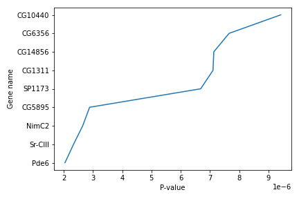
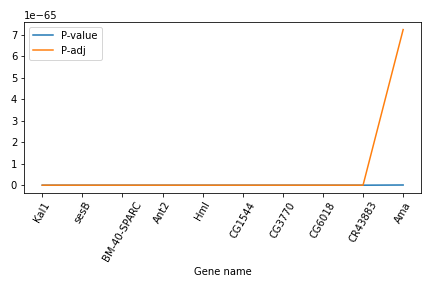
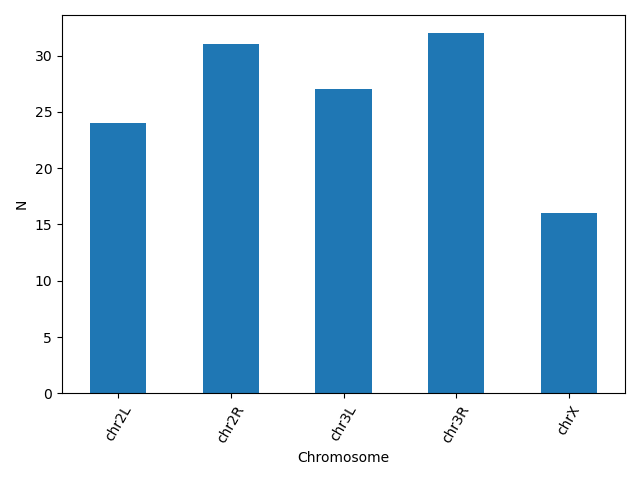
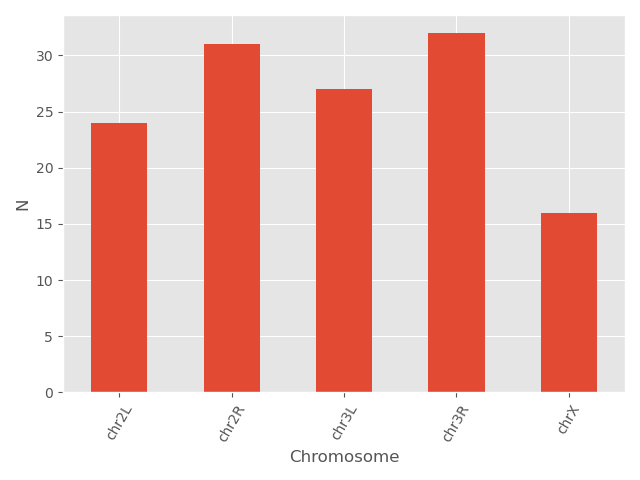
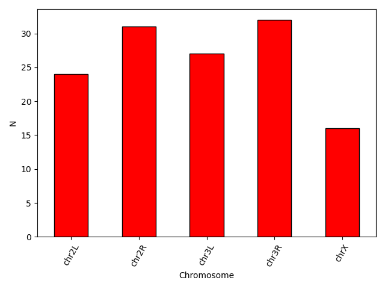
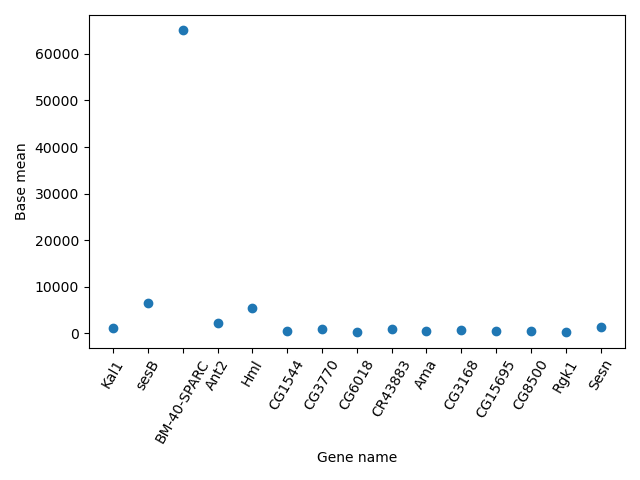
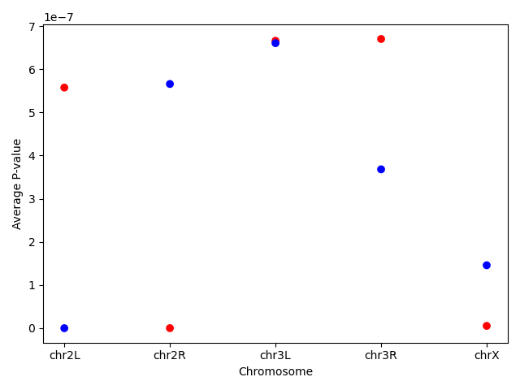

In this lesson, we will be using Python 3 with some of its most popular scientific libraries. This tutorial assumes that the reader is familiar with the fundamentals of data analysis using the Python programming language, as well as, how to run Python programs using Galaxy. Otherwise, it is advised to follow the "Introduction to Python" and "Advanced Python" tutorials available in the same platform. We will be using JupyterNotebook, a Python interpreter that comes with everything we need for the lesson.

> <comment-title></comment-title>
> This tutorial is **significantly** based on [the Carpentries](https://carpentries.org) [Programming with Python](https://swcarpentry.github.io/python-novice-inflammation/) and [Plotting and Programming in Python](https://swcarpentry.github.io/python-novice-gapminder/), which is licensed CC-BY 4.0.
>
> Adaptations have been made to make this work better in a GTN/Galaxy environment.
{: .comment}

> <agenda-title></agenda-title>
>
> In this tutorial, we will cover:
>
> 1. TOC
> {:toc}
>
{: .agenda}


# Plot data using matplotlib

For the purposes of this tutorial, we will use a file with the annotated differentially expressed genes that was produced in the [Reference-based RNA-Seq data analysis]() tutorial.

Firstly, we read the file with the data.

```python
data = pd.read_csv("https://zenodo.org/record/3477564/files/annotatedDEgenes.tabular", sep = "\t", index_col = 'GeneID')
print(data)
```

We can now use the `DataFrame.info()` method to find out more about a dataframe.

```python
data.info()
```

We learn that this is a DataFrame. It consists of 130 rows and 12 columns. None of the columns contains any missing values. 6 columns contain 64-bit floating point `float64` values, 2 contain 64-bit integer `int64` values and 4 contain character `object` values. It uses 13.2KB of memory.

We now have a basic understanding of the dataset and we can move on to creating a few plots and further explore the data. `matplotlib` is the most widely used scientific plotting library in Python, especially the `matplotlib.pyplot` module.

```python
import matplotlib.pyplot as plt
```
Simple plots are then (fairly) simple to create. You can use the `plot()` method and simply specify the data to be displayed in the x and y axis, by passing the data as the first and second argument. In the following example, we select a subset of the dataset and plot the P-value of each gene, using a lineplot.

```python
subset = data.iloc[121:, :]

x = subset['P-value']
y = subset['Gene name']

plt.plot(x, y)
plt.xlabel('P-value')
plt.ylabel('Gene name')
```



We use Jupyter Notebook and so running the cell generates the figure directly below the code. The figure is also included in the Notebook document for future viewing. However, other Python environments like an interactive Python session started from a terminal or a Python script executed via the command line require an additional command to display the figure.

Instruct matplotlib to show a figure:

```python
plt.show()
```
This command can also be used within a Notebook - for instance, to display multiple figures if several are created by a single cell.

If you want to save and download the image to your local machine, you can use the `plt.savefig()` command with the name of the file (png, pdf etc) as the argument. The file is saved in the Jupyter Notebook session and then you can download it. For example:

```python
plt.tight_layout()
plt.savefig('foo.png')
```

`plt.tight_layout()` is used to make sure that no part of the image is cut off during saving.

When using dataframes, data is often generated and plotted to screen in one line, and `plt.savefig()` seems not to be a possible approach. One possibility to save the figure to file is then to save a reference to the current figure in a local variable (with `plt.gcf()`) and then call the savefig class method from that variable. For example, the previous plot:

```python
subset = data.iloc[121:, :]

x = subset['P-value']
y = subset['Gene name']

fig = plt.gcf()
plt.plot(x, y)
fig.savefig('my_figure.png')
```


## More about plots

You can use the `plot()` method directly on a dataframe. You can plot multiple lines in the same plot. Just specify more columns in the x or y axis argument. For example:

```python
new_subset = data.iloc[0:10, :]
new_subset.loc[:, ['P-value', 'P-adj']].plot()
plt.xticks(range(0,len(new_subset.index)), new_subset['Gene name'], rotation=60)
plt.xlabel('Gene name')
```



In this example, we select a new subset of the dataset, but plot only the two columns `P-value` and `P-adj`. Then we use the `plt.xticks()` method to change the text and the rotation of the x axis.

Another useful plot type is the barplot. In the following example we plot the number of genes that belong to the different chromosomes of the dataset.

```python
bar_data = data.groupby('Chromosome').size()
bar_data.plot(kind='bar')
plt.xticks(rotation=60)
plt.ylabel('N')
```


`matplotlib` supports also different plot styles from ather popular plotting libraries such as ggplot and seaborn. For example, the previous plot in ggplot style.

```python
plt.style.use('ggplot')
bar_data = data.groupby('Chromosome').size()
bar_data.plot(kind='bar')
plt.xticks(rotation=60)
plt.ylabel('N')
```


You can also change different parameters and customize the plot.

```python
plt.style.use('default')
bar_data = data.groupby('Chromosome').size()
bar_data.plot(kind='bar', color = 'red', edgecolor = 'black')
plt.xticks(rotation=60)
plt.ylabel('N')
```



Another useful type of plot is a scatter plot. In the following example we plot the Base mean of a subset of genes.

```python
scatter_data = data[['Base mean', 'Gene name']].head(n = 15)

plt.scatter(scatter_data['Gene name'], scatter_data['Base mean'])
plt.xticks(rotation = 60)
plt.ylabel('Base mean')
plt.xlabel('Gene name')
```



> <question-title>Plotting</question-title>
>
>  Using the same dataset, create a scatterplot of the average P-value for every chromosome for the "+" and the "-" strand.
>
> > <solution-title></solution-title>
> >
> > First find the data and save it in a new dataframe. Then create the scatterplot. You can even go one step further and assign different colors for the different strands.Note the use of the `map` method that assigns the different colors using a dictionary as an input.
> >
> > ```
> > exercise_data = data.groupby(['Chromosome', 'Strand']).agg(mean_pvalue = ('P-value', 'mean')).reset_index()
> >
> > colors = {'+':'red', '-':'blue'}
> > plt.scatter(x = exercise_data['Chromosome'], y = exercise_data['mean_pvalue'], c = exercise_data['Strand'].map(colors))
> > plt.ylabel('Average P-value')
> > plt.xlabel('Chromosome')
> > ```
> > 
> >
> {: .solution}
{: .question}


## Making your plots accessible
Whenever you are generating plots to go into a paper or a presentation, there are a few things you can do to make sure that everyone can understand your plots.

Always make sure your text is large enough to read. Use the `fontsize` parameter in `xlabel`, `ylabel`, `title`, and `legend`, and `tick_params` with `labelsize` to increase the text size of the numbers on your axes.
Similarly, you should make your graph elements easy to see. Use `s` to increase the size of your scatterplot markers and `linewidth` to increase the sizes of your plot lines.
Using `color` (and nothing else) to distinguish between different plot elements will make your plots unreadable to anyone who is colorblind, or who happens to have a black-and-white office printer. For lines, the `linestyle` parameter lets you use different types of lines. For scatterplots, `marker` lets you change the shape of your points.
