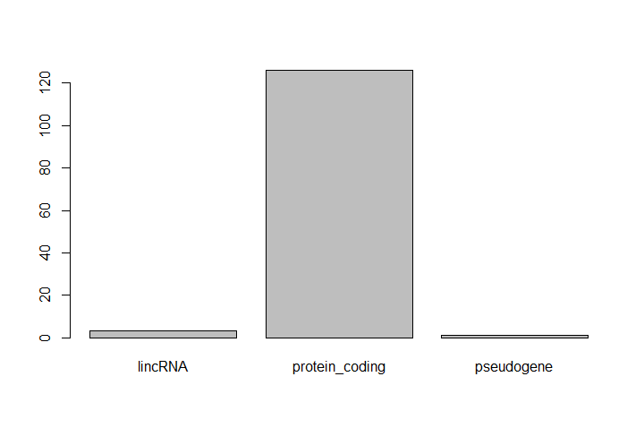

# Introduction

With HTS-Seq data analysis, we generated tables containing list of DE genes, their expression, some statistics, etc. We can manipulate these tables using Galaxy, as we saw in some tutorials, e.g. ["Reference-based RNA-Seq data analysis"](), and create some visualisations.

Sometimes we want to have some customizations on visualization, some complex table manipulations or some statistical analysis. If we can not find a Galaxy tools for that or the right parameters, we may need to use programming languages as R or Python.

<!-- Keeping this here because people may be familiar enough with R, that they go directly to this tutorial, and it is still useful information. -->




In this tutorial, we will take the list of DE genes extracted from DESEq2's output that we generated in the ["Reference-based RNA-Seq data analysis" tutorial](), manipulate it and create some visualizations.

> <agenda-title></agenda-title>
>
> In this tutorial, we will cover:
>
> 1. TOC
> {:toc}
>
{: .agenda}


# Get familiar with the annotated DE genes table in R

A substantial amount of the data we work with in science is tabular data, i.e. data arranged in rows and columns - also known as spreadsheets.

> <comment-title>Few principles when working with data</comment-title>
> We want to remind you of a few principles before we work with our first set of example data:
>
> 1. **Keep raw data separate from analyzed data**
>
>    This is principle number one, because if you can't tell which files are the original raw data, you risk making some serious mistakes (e.g. drawing conclusion from data which have been manipulated in some unknown way).
>
>    When you work with data in R, you are not changing the original file which you loaded the data from. This is different than (for example) working with a spreadsheet program where changing the value of the cell leaves you one "save"-click away from overwriting the original file. You have to purposely use a writing function (e.g. `write.csv()`) to save data loaded into R. In that case, be sure to save the manipulated data into a new file. More on this later in the lesson.
>
> 2. **Keep spreadsheet data Tidy**
>
>    The simplest principle of *Tidy* data is that we have one row in our spreadsheet for each observation or sample, and one column for every variable that we measure or report on. As simple as this sounds, it’s very easily violated. Most data scientists agree that significant amounts of their time is spent tidying data for analysis.
>
> 3. **Trust but verify**
>
>    Finally, while you don't need to be paranoid about data, you should have a plan for how you will prepare it for analysis. **This a focus of this lesson**. You probably already have a lot of intuition, expectations, assumptions about your data - the range of values you expect, how many values should have been recorded, etc. Of course, as the data get larger our human ability to keep track will start to fail (and yes, it can fail for small data sets too). R will help you to examine your data so that you can have greater confidence in your analysis, and its reproducibility.
>
{: .comment}

## Import tabular data into R

There are several ways to import data into R. For our purpose here, we will focus on using the tools every R installation comes with (so called "base" R) to import a comma-delimited file containing the results of our variant calling workflow. We will need to load the sheet using a function called `read.csv()`.

> <question-title>Review the arguments of the `read.csv()` function</question-title>
>
> Before using the `read.csv()` function, use R's help feature to answer the following questions.
>
> > <tip-title>Getting help in R</tip-title>
> > Entering `?` before the function name and then running that line will bring up the help documentation. Also, when reading this particular help be careful to pay attention to the `read.csv` expression under the **Usage** heading. Other answers will be in the **Arguments** heading.
> {: .tip}
>
> 1. What is the default parameter for `header` in the `read.csv()` function?
> 2. What argument would you have to change to read a file that was delimited by semicolons (`;`) rather than commas?
> 3. What argument would you have to change to read file in which numbers used commas for decimal separation (i.e. 1,00)?
> 4. What argument would you have to change to read in only the first 10,000 rows of a very large file?
>
> > <solution-title></solution-title>
> >
> > 1. The `read.csv() `function has the argument `header` set to `TRUE` by default, this means the function always assumes the first row is header information, (i.e. column names)
> > 2. The `read.csv()` function has the argument 'sep' set to ",". This means the function assumes commas are used as delimiters, as you would expect. Changing this parameter (e.g. `sep=";"`) would now interpret semicolons as delimiters.
> > 3. Although it is not listed in the `read.csv()` usage, `read.csv()` is a "version" of the function `read.table()` and accepts all its arguments. If you set `dec=","` you could change the decimal operator. We'd probably assume the delimiter is some other character.
> > 4. You can set `nrow` to a numeric value (e.g. `nrow=10000`) to choose how many rows of a file you read in. This may be useful for very large files where not all the data is needed to test some data cleaning steps you are applying.
> >
> > Hopefully, this exercise gets you thinking about using the provided help documentation in R. There are many arguments that exist, but which we wont have time to cover. Look here to get familiar with functions you use frequently, you may be surprised at what you find they can do.
> >
> {: .solution}
{: .question}

Now, let's read the file with the annotated differentially expressed genes that was produced in the "[Reference-based RNA-Seq data analysis]()" tutorial.

<!--
> <hands-on-title>Import dataset into Galaxy</hands-on-title>
> 1. In Galaxy, upload the following file from Zenodo:
>    ```
>    https://zenodo.org/record/3477564/files/annotatedDEgenes.tabular
>    ```
> 2. Remember the dataset number (e.g. `2` in the example below)
>    
>
{: .hands_on}
-->

> <hands-on-title>Read the annotated differentially expressed genes</hands-on-title>
> 1. Create a new script (if needed)
> 2. Read the tabular file in an object called `annotatedDEgenes`. We can import directly by URL:
>
>    ```R
>    ## read in a CSV file and save it as 'annotatedDEgenes'
>    annotatedDEgenes <- read.csv("https://zenodo.org/record/3477564/files/annotatedDEgenes.tabular")
>    ```
>
>    The first argument to pass to our `read.csv()` function is the file path for our data. The file path must be in quotes and now is a good time to remember to use tab autocompletion. If you use tab autocompletion you avoid typos and errors in file paths. Use it!
>
> 3. Inspect the **Environment** panel
>
>  > <tip-title>Upload files from a Galaxy history to RStudio</tip-title>
>  > Rstudio in Galaxy provides some special functions to import and export from your history.
>  >
>  > ```R
>  > gx_get(2) # will import dataset number 2 from your history
>  > ```
>  {: .tip}
{: .hands_on}

In the **Environment** panel, you should have the `annotatedDEgenes` object, listed as 130 obs. (observations/rows) of 1 variable (column) - so the command worked (sort of)!

> <hands-on-title>Inspect the annotatedDEgenes file</hands-on-title>
> 1. Double-click on the name of the object in the **Environment** panel
>
{: .hands_on}

It will open a view of the data in a new tab on the top-left panel.

As you can see, there is a problem with how the data has been loaded. The table should contain 130 observations of 13 variables.

> <question-title>Identify the issue with data</question-title>
>
> 1. What is wrong?
> 2. How should you adjust the parameters for `read.csv()` in order to produce the intended output?
>
> > <solution-title></solution-title>
> >
> > 1. The data file was not delimited by commas (`,`) which is the default expected delimiter for `read.csv()`. Instead it seems like it's delimited by "white space", i.e. spaces and/or tabs.
> > 2. We need to set the correct delimiter using the parameter `sep`. Given that we are not sure what the actual delimiter is, we could try both options, i.e. `sep=" "` (*space*) and `sep="\t"` (*tab*).
> >
> {: .solution}
{: .question}

> <hands-on-title>Read correctly tabular file</hands-on-title>
> 1. Read the file given it's a tabular file
>
>    ```R
>    annotatedDEgenes <- read.csv("https://zenodo.org/record/3477564/files/annotatedDEgenes.tabular", sep = "\t")
>    ```
>
> 2. Inspect the object in the **Environment** panel
> 3. Open the object
>
>    You should have now a nice table
>
> 3. Check the column names
>
>    ```R
>    > colnames(annotatedDEgenes)
>    [1] "GeneID"     "Base.mean"  "log2.FC."   "StdErr"     "Wald.Stats"
>    [6] "P.value"    "P.adj"      "Chromosome" "Start"      "End"
>    [11] "Strand"     "Feature"    "Gene.name"
>    ```
>
{: .hands_on}

Congratulations! You've successfully loaded your data into RStudio!

## Summarize and determine the structure of a data frame

Tabular data are stored in R using **data frame**. A data frame could also be thought of as a collection of vectors, all of which have the same length.

> <hands-on-title>Learn more about our data frame</hands-on-title>
> 1. Get summary statistics of `annotatedDEgenes` using `summary` function
>
>    ```R
>    ## get summary statistics on a data frame
>    > summary(annotatedDEgenes)
>    GeneID            Base.mean          log2.FC.          StdErr            Wald.Stats
>    FBgn0000071:  1   Min.   :   19.15   Min.   :-4.1485   Min.   :0.08433   Min.   :-30.741
>    FBgn0000079:  1   1st Qu.:  100.29   1st Qu.:-1.3363   1st Qu.:0.12849   1st Qu.:-10.005
>    FBgn0000116:  1   Median :  237.99   Median :-1.0272   Median :0.16370   Median : -4.982
>    FBgn0000406:  1   Mean   : 1911.27   Mean   :-0.2074   Mean   :0.16432   Mean   : -1.901
>    FBgn0000567:  1   3rd Qu.:  948.66   3rd Qu.: 1.2203   3rd Qu.:0.19866   3rd Qu.:  7.692
>    FBgn0001137:  1   Max.   :65114.84   Max.   : 2.6999   Max.   :0.23292   Max.   : 27.566
>    (Other)    :124
>    P.value             P.adj               Seqname    Start              End                Strand
>    Min.   :0.000e+00   Min.   :0.000e+00   chr2L:24   Min.   :  127448   Min.   :  140340   -:58
>    1st Qu.:0.000e+00   1st Qu.:0.000e+00   chr2R:31   1st Qu.: 7277516   1st Qu.: 7279063   +:72
>    Median :0.000e+00   Median :0.000e+00   chr3L:27   Median :13161546   Median :13166253
>    Mean   :4.201e-07   Mean   :9.321e-06   chr3R:32   Mean   :13436843   Mean   :13446444
>    3rd Qu.:7.000e-12   3rd Qu.:3.700e-10   chrX :16   3rd Qu.:19250429   3rd Qu.:19284637
>    Max.   :9.418e-06   Max.   :1.951e-04              Max.   :31196915   Max.   :31203722
>
>    Feature              Gene.Name
>    lincRNA       :  3   Ama        :  1
>    protein_coding:126   Amy-p      :  1
>    pseudogene    :  1   Ant2       :  1
>                         Argk       :  1
>                         BM-40-SPARC:  1
>                         bou        :  1
>                         (Other)    :124
>    ```
>
> 2. Get the structure of `annotatedDEgenes` using `str` function
>
>    ```R
>    ## get the structure of a data frame
>    > str(annotatedDEgenes)
>    'data.frame':	130 obs. of  13 variables:
>     $ GeneID    : Factor w/ 130 levels "FBgn0000071",..: 87 12 28 26 31 96 65 62 125 1 ...
>     $ Base.mean : num  1087 6410 65115 2192 5430 ...
>     $ log2.FC.  : num  -4.15 -3 -2.38 2.7 -2.11 ...
>     $ StdErr    : num  0.1349 0.1043 0.0843 0.0979 0.0925 ...
>     $ Wald.Stats: num  -30.7 -28.7 -28.2 27.6 -22.7 ...
>     $ P.value   : num  1.62e-207 9.42e-182 2.85e-175 2.85e-167 1.57e-114 ...
>     $ P.adj     : num  1.39e-203 4.04e-178 8.15e-172 6.10e-164 2.70e-111 ...
>     $ Seqname   : Factor w/ 5 levels "chr2L","chr2R",..: 4 5 4 5 3 4 2 2 3 4 ...
>     $ Start     : int  24141394 10780892 26869237 10778953 13846053 31196915 24945138 22550093 820758 >    6762592 ...
>     $ End       : int  24147490 10786958 26871995 10786907 13860001 31203722 24946636 22552113 821512 >    6765261 ...
>     $ Strand    : Factor w/ 2 levels "-","+": 2 1 1 1 2 2 2 2 2 2 ...
>     $ Feature   : Factor w/ 3 levels "lincRNA","protein_coding",..: 2 2 2 2 2 2 2 2 1 2 ...
>     $ Gene.Name : Factor w/ 130 levels "Ama","Amy-p",..: 88 113 5 3 84 26 41 53 69 1 ...
>    ```
{: .hands_on}

Ok, thats a lot to unpack! Some things to notice:

- the object type `data.frame` is displayed in the first row along with its dimensions, in this case 130 observations (rows) and 13 variables (columns)
- Each variable (column) has a name (e.g. `GeneID`). This is followed by the object mode (e.g. `factor`, `int`, `num`, etc.). Notice that before each variable name there is a `$` - this will be important later.

So from both `summary` and `str`, we know that our data frame had 13 variables that summarize the data.

- `Base.mean`, `log2.FC.` and `P.value` variables (and several others) are numerical data

    We get summary statistics on the min and max values for these columns, as well as mean, median, and interquartile ranges

- Many of the other variables (e.g. `Strand`) are treated as categorical data

    This type has special treatment in R - more on this in a bit. The most frequent 6 different categories and the number of times they appear (e.g. the `Strand` called `-` appeared 58 times) are displayed. Another example is the `protein_coding` value for `Feature` which appeared in 126 observations.

## Factors

Factors, the final major data structure we will introduce, can be thought of as vectors which are specialized for categorical data. Given R's specialization for statistics, this make sense since categorial and continuous variables usually have different treatments. Sometimes you may want to have data treated as a factor, but in other cases, this may be undesirable.

Since some of the data in our data frame are factors, lets see how factors work.

> <hands-on-title>Inspect a factor object</hands-on-title>
> 1. Extract the `feature` column to a new object called `feature`
>
>    ```R
>    ## extract the "feature" column to a new object
>    feature <- annotatedDEgenes$Feature
>    ```
>
> 2. Inspect the first few items in our  using `head` function
>
>    ```R
>    > head(feature)
>    [1] protein_coding protein_coding protein_coding protein_coding
>    [5] protein_coding protein_coding
>    Levels: lincRNA protein_coding pseudogene
>    ```
{: .hands_on}

What we get back are the items in our factor, and also something called "Levels". **Levels are the different categories contained in a factor**. By default, R will organize the levels in a factor in alphabetical order. So the first level in this factor is "lincRNA".

> <hands-on-title>Get the structure of a factor object</hands-on-title>
> 1. Get the structure of the `feature` object
>
>    ```R
>    > str(feature)
>    Factor w/ 3 levels "lincRNA","protein_coding",..: 2 2 2 2 2 2 2 2 1 2 ...
>    ```
{: .hands_on}

For the sake of efficiency, R stores the content of a factor as a vector of integers, which an integer is assigned to each of the possible levels. Recall levels are assigned in alphabetical order. In this case, the first item in our "Feature" object is "protein_coding", which happens to be the 2nd level of our factor, ordered alphabeticaly. The 9th item in the list is "lincRNA", which is the 1st level of our factor.

One of the most common uses for factors is to plot categorical values. For example, suppose we want to know how many of our differentially expressed genes correspond to different features.

> <hands-on-title>Plot a factor object</hands-on-title>
> 1. Plot the number of levels in the `feature` object using `plot` function
>
>    ```R
>    plot(feature)
>    ```
{: .hands_on}



This isn't a particularly pretty example of a plot. We'll be learning much more about creating nice, publication-quality graphics later.

## Subset a data frame

Now we would like to know how to get specific values from data frames, and where necessary, change the mode of a column of values.

The first thing to remember is that a data frame is two-dimensional (rows and columns). Therefore, to select a specific value we will once again use `[]` (bracket) notation, but we will specify more than one value (except in some cases where we are taking a range).

> <question-title>Subsetting a data frame</question-title>
>
> Run the following indices and functions to figure out what they return
>
> 1. `annotatedDEgenes[1, 1]`
> 2. `annotatedDEgenes[2, 4]`
> 3. `annotatedDEgenes[130, 13]`
> 4. `annotatedDEgenes[2, ]`
> 5. `annotatedDEgenes[-1, ]`
> 6. `annotatedDEgenes[1:4, 1]`
> 7. `annotatedDEgenes[1:10, c("Feature", "Gene.Name")]`
> 8. `annotatedDEgenes[, c("Gene.Name")]`
> 9. `head(annotatedDEgenes)`
> 10. `tail(annotatedDEgenes)`
> 11. `annotatedDEgenes$GeneID`
> 12. `annotatedDEgenes[annotatedDEgenes$Feature == "pseudogene", ]`
>
> > <solution-title></solution-title>
> >
> > 1. `annotatedDEgenes[1, 1]`
> >
> >     ```R
> >     > annotatedDEgenes[1,1]
> >     [1] FBgn0039155
> >     130 Levels: FBgn0000071 FBgn0000079 FBgn0000116 FBgn0000406 FBgn0000567 FBgn0001137 ... FBgn0267635
> >     ```
> >
> > 2. `annotatedDEgenes[2, 4]`
> >
> >     ```R
> >     > annotatedDEgenes[2, 4]
> >     [1] 0.1043451
> >     ```
> >
> > 3. `annotatedDEgenes[130, 13]`
> >
> >     ```R
> >     > annotatedDEgenes[130,13]
> >     [1] CG10440
> >     130 Levels: Ama Amy-p Ant2 Argk BM-40-SPARC bou bves CAHbeta cbt CG10063 CG10365 CG10440 ... zye
> >     ```
> >
> > 4. `annotatedDEgenes[2, ]`
> >
> >     ```R
> >     > annotatedDEgenes[2, ]
> >            GeneID Base.mean   log2.FC.   StdErr Wald.Stats       P.value         P.adj Seqname    Start
> >     2 FBgn0003360  6409.577 -2.999777 0.1043451  -28.74863 9.422382e-182 4.040788e-178    chrX 10780892
> >            End Strand        Feature Gene.Name
> >     2 10786958      - protein_coding      sesB
> >     ```
> >
> > 5. `annotatedDEgenes[-1, ]`
> >
> >     ```R
> >     > annotatedDEgenes[-1, ]
> >             GeneID   Base.mean  log2.FC.     StdErr Wald.Stats       P.value         P.adj Seqname
> >     2  FBgn0003360  6409.57713 -2.999777 0.10434506 -28.748628 9.422382e-182 4.040788e-178    chrX
> >     3  FBgn0026562 65114.84056 -2.380164 0.08432692 -28.225437 2.850473e-175 8.149503e-172   chr3R
> >     4  FBgn0025111  2192.32237  2.699939 0.09794457  27.565988 2.846764e-167 6.104174e-164    chrX
> >     5  FBgn0029167  5430.06728 -2.105062 0.09254660 -22.745964 1.573283e-114 2.698810e-111   chr3L
> >     6  FBgn0039827   390.90178 -3.503014 0.16002962 -21.889786 3.250384e-106 4.646424e-103   chr3R
> >     7  FBgn0035085   928.26381 -2.414074 0.11518516 -20.958204  1.579343e-97  1.935147e-94   chr2R
> >     8  FBgn0034736   330.38302 -3.018179 0.15815418 -19.083774  3.444661e-81  3.693107e-78   chr2R
> >     9  FBgn0264475   955.45445 -2.334486 0.12423003 -18.791643  8.840041e-79  8.424559e-76   chr3L
> >     10 FBgn0000071   468.05793  2.360017 0.13564397  17.398615  8.452137e-68  7.249398e-65   chr3R
> >     # ... with 120 more rows
> >
> >           Start      End Strand        Feature   Gene.Name
> >     2  10780892 10786958      - protein_coding        sesB
> >     3  26869237 26871995      - protein_coding BM-40-SPARC
> >     4  10778953 10786907      - protein_coding        Ant2
> >     5  13846053 13860001      + protein_coding         Hml
> >     6  31196915 31203722      + protein_coding      CG1544
> >     7  24945138 24946636      + protein_coding      CG3770
> >     8  22550093 22552113      + protein_coding      CG6018
> >     9    820758   821512      +        lincRNA     CR43883
> >     10  6762592  6765261      + protein_coding         Ama
> >     # ... with 120 more rows
> >     ```
> >
> > 6. `annotatedDEgenes[1:4,1]`
> >
> >     ```R
> >     > annotatedDEgenes[1:4,1]
> >     [1] FBgn0039155 FBgn0003360 FBgn0026562 FBgn0025111
> >     130 Levels: FBgn0000071 FBgn0000079 FBgn0000116 FBgn0000406 FBgn0000567 FBgn0001137 ... FBgn0267635
> >     ```
> >
> > 7. annotatedDEgenes[1:10,c("Feature","Gene.Name")]
> >
> >     ```R
> >     > annotatedDEgenes[1:10,c("Feature","Gene.Name")]
> >               Feature   Gene.Name
> >     1  protein_coding        Kal1
> >     2  protein_coding        sesB
> >     3  protein_coding BM-40-SPARC
> >     4  protein_coding        Ant2
> >     5  protein_coding         Hml
> >     6  protein_coding      CG1544
> >     7  protein_coding      CG3770
> >     8  protein_coding      CG6018
> >     9         lincRNA     CR43883
> >     10 protein_coding         Ama
> >     ```
> >
> > 8. `annotatedDEgenes[,c("Gene.Name")]`
> >
> >     ```R
> >     > annotatedDEgenes[,c("Gene.Name")]
> >     [1] Kal1         sesB         BM-40-SPARC  Ant2         Hml          CG1544       CG3770
> >     [8] CG6018       CR43883      Ama          CG3168       CG15695      CG8500       Rgk1
> >     [15] Sesn         CG9119       Sema-2a      l(1)G0196    lectin-28C   Sox100B      Hsp27
> >     [22] CG34330      Ugt58Fa      Src64B       Tequila      CG32407      LpR2         CG12290
> >     [29] ps           CG8157       nemy         bves         CG8468       CR43855      CG13315
> >     [36] CG1124       Reg-2        CG5261       Treh         Hsp23        Gale         PPO1
> >     [43] Picot        RpS24        CG14946      CG10365      NimC4        CG42694      CG33307
> >     [50] CG6006       grk          CG42369      GILT1        CG5001       Hsp26        MtnA
> >     [57] CG6330       l(3)neo38    Cyt-b5-r     CG12116      PPO2         zye          tnc
> >     [64] CG14257      GstE2        olf413       CG31642      Nxf3         CG8292       CG5397
> >     [71] Mctp         CG7777       CG4019       ChLD3        Argk         bou          Mct1
> >     [78] CG9416       CG12512      CG32625      Npc2b        CG30463      Eip74EF      CAHbeta
> >     [85] CG14326      Cyp6w1       CG3457       wdp          cbt          CrebA        Cyp4d20
> >     [92] CR45973      Sr-CIV       SPH93        Cyp9h1       sug          CG14516      Ggamma30A
> >     [99] CG4297       CG9503       CG10063      CG8501       CG43336      stet         CG8852
> >     [106] CG15080      Amy-p        sn           CG9989       mlt          CG2444       CG17189
> >     [113] RhoGAP1A     CG13743      TwdlU        Galphaf      CG32335      E(spl)m3-HLH CG16749
> >     [120] CG34434      CG43799      Pde6         Sr-CIII      NimC2        CG5895       SP1173
> >     [127] CG1311       CG14856      CG6356       CG10440
> >     130 Levels: Ama Amy-p Ant2 Argk BM-40-SPARC bou bves CAHbeta cbt CG10063 CG10365 CG10440 ... zye
> >     ```
> >
> > 9. `head(annotatedDEgenes)`
> >
> >     ```R
> >     > head(annotatedDEgenes)
> >            GeneID  Base.mean  log2.FC.      StdErr Wald.Stats       P.value         P.adj Seqname    Start
> >     1 FBgn0039155  1086.9743 -4.148450 0.13494887  -30.74090 1.617921e-207 1.387691e-203   chr3R 24141394
> >     2 FBgn0003360  6409.5771 -2.999777 0.10434506  -28.74863 9.422382e-182 4.040788e-178    chrX 10780892
> >     3 FBgn0026562 65114.8406 -2.380164 0.08432692  -28.22544 2.850473e-175 8.149503e-172   chr3R 26869237
> >     4 FBgn0025111  2192.3224  2.699939 0.09794457   27.56599 2.846764e-167 6.104174e-164    chrX 10778953
> >     5 FBgn0029167  5430.0673 -2.105062 0.09254660  -22.74596 1.573283e-114 2.698810e-111   chr3L 13846053
> >     6 FBgn0039827   390.9018 -3.503014 0.16002962  -21.88979 3.250384e-106 4.646424e-103   chr3R 31196915
> >
> >     End Strand        Feature   Gene.Name
> >     1 24147490      + protein_coding        Kal1
> >     2 10786958      - protein_coding        sesB
> >     3 26871995      - protein_coding BM-40-SPARC
> >     4 10786907      - protein_coding        Ant2
> >     5 13860001      + protein_coding         Hml
> >     6 31203722      + protein_coding      CG1544
> >     ```
> >
> > 10. `tail(annotatedDEgenes)`
> >
> >      ```R
> >      > tail(annotatedDEgenes)
> >               GeneID Base.mean  log2.FC.    StdErr Wald.Stats      P.value        P.adj Seqname    Start
> >      125 FBgn0036560  27.71424  1.089000 0.2327527   4.678786 2.885785e-06 6.671531e-05   chr3L 16035484
> >      126 FBgn0035710  26.16177  1.048979 0.2329221   4.503559 6.682472e-06 1.436480e-04   chr3L  6689326
> >      127 FBgn0035523  70.99820  1.004819 0.2237625   4.490560 7.103600e-06 1.523189e-04   chr3L  4277961
> >      128 FBgn0038261  44.27058  1.006264 0.2241243   4.489756 7.130482e-06 1.525141e-04   chr3R 14798985
> >      129 FBgn0039178  23.55006  1.040917 0.2326264   4.474631 7.654326e-06 1.629061e-04   chr3R 24283954
> >      130 FBgn0034636  24.77052 -1.028531 0.2321678  -4.430119 9.418101e-06 1.951185e-04   chr2R 21560245
> >
> >      End Strand        Feature Gene.Name
> >      125 16037227      + protein_coding    CG5895
> >      126  6703521      - protein_coding    SP1173
> >      127  4281585      + protein_coding    CG1311
> >      128 14801163      + protein_coding   CG14856
> >      129 24288617      + protein_coding    CG6356
> >      130 21576035      - protein_coding   CG10440
> >      ```
> >
> > 11. `annotatedDEgenes$GeneID`
> >
> >      ```R
> >      > annotatedDEgenes$GeneID
> >      [1] FBgn0039155 FBgn0003360 FBgn0026562 FBgn0025111 FBgn0029167 FBgn0039827 FBgn0035085 FBgn0034736
> >      [9] FBgn0264475 FBgn0000071 FBgn0029896 FBgn0038832 FBgn0037754 FBgn0264753 FBgn0034897 FBgn0035189
> >      [17] FBgn0011260 FBgn0027279 FBgn0040099 FBgn0024288 FBgn0001226 FBgn0085359 FBgn0040091 FBgn0262733
> >      [25] FBgn0023479 FBgn0052407 FBgn0051092 FBgn0039419 FBgn0261552 FBgn0034010 FBgn0261673 FBgn0031150
> >      [33] FBgn0033913 FBgn0264437 FBgn0040827 FBgn0037290 FBgn0016715 FBgn0031912 FBgn0003748 FBgn0001224
> >      [41] FBgn0035147 FBgn0261362 FBgn0024315 FBgn0261596 FBgn0032405 FBgn0039109 FBgn0260011 FBgn0261584
> >      [49] FBgn0053307 FBgn0063649 FBgn0001137 FBgn0259715 FBgn0038149 FBgn0031322 FBgn0001225 FBgn0002868
> >      [57] FBgn0039464 FBgn0265276 FBgn0000406 FBgn0030041 FBgn0033367 FBgn0036985 FBgn0039257 FBgn0039479
> >      [65] FBgn0063498 FBgn0037153 FBgn0051642 FBgn0263232 FBgn0032004 FBgn0031327 FBgn0034389 FBgn0033635
> >      [73] FBgn0034885 FBgn0032598 FBgn0000116 FBgn0261284 FBgn0023549 FBgn0034438 FBgn0031703 FBgn0052625
> >      [81] FBgn0038198 FBgn0050463 FBgn0000567 FBgn0037646 FBgn0038528 FBgn0033065 FBgn0024984 FBgn0034718
> >      [89] FBgn0043364 FBgn0004396 FBgn0035344 FBgn0267635 FBgn0031547 FBgn0032638 FBgn0033775 FBgn0033782
> >      [97] FBgn0039640 FBgn0267252 FBgn0031258 FBgn0030598 FBgn0035727 FBgn0033724 FBgn0263041 FBgn0020248
> >      [105] FBgn0031548 FBgn0034391 FBgn0000079 FBgn0003447 FBgn0039593 FBgn0265512 FBgn0030326 FBgn0039485
> >      [113] FBgn0025836 FBgn0033368 FBgn0037223 FBgn0010223 FBgn0063667 FBgn0002609 FBgn0037678 FBgn0250904
> >      [121] FBgn0264343 FBgn0038237 FBgn0020376 FBgn0028939 FBgn0036560 FBgn0035710 FBgn0035523 FBgn0038261
> >      [129] FBgn0039178 FBgn0034636
> >      130 Levels: FBgn0000071 FBgn0000079 FBgn0000116 FBgn0000406 FBgn0000567 FBgn0001137 ... FBgn0267635
> >      ```
> >
> > 12. `annotatedDEgenes[annotatedDEgenes$Feature == "pseudogene",]`
> >
> >     ```R
> >     > annotatedDEgenes[annotatedDEgenes$Feature == "pseudogene",]
> >     GeneID Base.mean   log2.FC.    StdErr Wald.Stats      P.value        P.adj Seqname   Start
> >     115 FBgn0037223  37.00783 -1.161706 0.2297393  -5.056627 4.267378e-07 1.192225e-05   chr3R 4243605
> >     End Strand    Feature Gene.Name
> >     115 4245511      + pseudogene     TwdlU
> >     ```
> >
> {: .solution}
{: .question}

The subsetting notation is very similar to what we learned for vectors. The key differences include:
- 2 values, separated by commas: `data.frame[row, column]`
- Use of a colon between the numbers (`start:stop, inclusive`) for a continuous range of numbers
- Passing a vector using `c()` for a non continuous set of numbers, pass a vector
- Index using the name of a column(s) by passing them as vectors using `c()`

> <hands-on-title>Create a new data frame by subsetting an existing one</hands-on-title>
> 1. Create a new data frame containing only observations from the "+" strand
>
>    ```R
>    # create a new data frame containing only observations from the "+" strand
>    annotatedDEgenes_plusStrand <- annotatedDEgenes[annotatedDEgenes$Strand == "+",]
>    ```
>
> 2. Check the dimension of the new data frame
>
>    ```R
>    # check the dimension of the data frame
>    > dim(annotatedDEgenes_plusStrand)
>    [1] 72 13
>    ```
>
> 3. Get a summary of the data frame
>
>    ```R
>    # get a summary of the data frame
>    > summary(annotatedDEgenes_plusStrand)
>    GeneID           Base.mean           log2.FC.         StdErr            Wald.Stats
>    FBgn0000071: 1   Min.   :   23.55   Min.   :-4.1485   Min.   :0.08603   Min.   :-30.741
>    FBgn0001224: 1   1st Qu.:   96.04   1st Qu.:-1.3664   1st Qu.:0.12523   1st Qu.:-11.223
>    FBgn0001226: 1   Median :  275.91   Median :-1.0739   Median :0.15648   Median : -5.290
>    FBgn0002609: 1   Mean   : 1365.34   Mean   :-0.3133   Mean   :0.16087   Mean   : -2.729
>    FBgn0003447: 1   3rd Qu.:  988.33   3rd Qu.: 1.1856   3rd Qu.:0.19743   3rd Qu.:  7.592
>    FBgn0003748: 1   Max.   :28915.90   Max.   : 2.3600   Max.   :0.23275   Max.   : 17.399
>    (Other)    :66
>
>    P.value             P.adj              Seqname    Start              End               Strand
>    Min.   :0.000e+00   Min.   :0.000e+00   chr2L:12   Min.   :  127448   Min.   :  140340   -: 0
>    1st Qu.:0.000e+00   1st Qu.:0.000e+00   chr2R:14   1st Qu.: 7377082   1st Qu.: 7379907   +:72
>    Median :0.000e+00   Median :0.000e+00   chr3L:15   Median :14068548   Median :14070644
>    Mean   :4.556e-07   Mean   :1.013e-05   chr3R:24   Mean   :14422245   Mean   :14431849
>    3rd Qu.:6.000e-12   3rd Qu.:3.200e-10   chrX : 7   3rd Qu.:21339535   3rd Qu.:21378634
>    Max.   :7.654e-06   Max.   :1.629e-04              Max.   :31196915   Max.   :31203722
>
>    Feature             Gene.Name
>    lincRNA       : 2   Ama    : 1
>    protein_coding:69   bou    : 1
>    pseudogene    : 1   bves   : 1
>                        CAHbeta: 1
>                        CG10365: 1
>                        CG1124 : 1
>                        (Other):66
>    ```
{: .hands_on}

## Change type of columns

Sometimes, it is possible that R will misinterpret the type of data represented in a data frame, or store that data in a mode which prevents you from operating on the data the way you wish. For example, a long list of gene names isn't usually thought of as a categorical variable, the way that your experimental condition (e.g. control, treatment) might be. More importantly, some R packages you use to analyze your data may expect characters as input, not factors. At other times (such as plotting or some statistical analyses) a factor may be more appropriate. Ultimately, you should know how to change the mode of an object.

First, its very important to recognize that coercion happens in R all the time. This can be a good thing when R gets it right, or a bad thing when the result is not what you expect.

> <hands-on-title>Format gene names</hands-on-title>
> 1. Check the structure of the `Gene.name` column
>
>    ```R
>    > str(annotatedDEgenes$Gene.name)
>    Factor w/ 130 levels "Ama","Amy-p",..: 88 113 5 3 84 26 41 53 69 1 ...
>    ```
>
> 2. Try to coerce the column into numeric
>
>    ```R
>    > as.numeric(annotatedDEgenes$Gene.name)
>    [1]  88 113   5   3  84  26  41  53  69   1  33  27  60 109 114  63 112
>    [18]  89  91 116  87  38 128 121 124  35  92  15 107  57  97   7  59  68
>    [35]  18  13 108  49 126  85  78 105 104 111  24  11  99  44  37  52  82
>    ...
>    ```
>
>    Strangely, it works! Almost. Instead of giving an error message, R returns numeric values, which in this case are the integers assigned to the levels in this factor. This kind of behavior can lead to hard-to-find bugs, for example when we do have numbers in a factor, and we get numbers from a coercion. If we don’t look carefully, we may not notice a problem.
>
> 3. Coerce the column into character (which makes sense for gene names)
>
>    ```R
>    annotatedDEgenes$Gene.name = as.character(annotatedDEgenes$Gene.name)
>    ```
>
{: .hands_on}

R will sometimes coerce without you asking for it (implicit coercion). You can explicitly change it (explicit coercion).

> <tip-title>Avoiding needless coercion</tip-title>
> One way to avoid needless coercion when importing a data frame using functions such as `read.csv()` is to set the argument `StringsAsFactors` to `FALSE`. By default, this argument is `TRUE`. Setting it to `FALSE` will treat any non-numeric column to a character type. Going through the `read.csv() `documentation, you will also see you can explicitly type your columns using the `colClasses` argument. Other R packages (such as the Tidyverse `readr`) don't have this particular conversion issue, but many packages will still try to guess a data type.
{: .tip}

## Inspect a numerical column using math, sorting, renaming

Here are a few operations that don't need much explanation, but which are good to know. There are lots of arithmetic functions you may want to apply to your data frame. For example, you can use functions like `mean()`, `min()`, `max()` on an individual column.

Let's look at the `Base.mean` column, i.e. the mean of normalized counts of all samples, normalizing for sequencing depth and library composition.

> <hands-on-title>Inspect the `Base.mean` column and sort</hands-on-title>
> 1. Get the maximum value of `Base.mean` column
>
>    ```R
>    max(annotatedDEgenes$Base.mean)
>    [1] 65114.84
>    ```
>
> 2. Sort the data frame by values in the `Base.mean` column
>
>    ```R
>    > sorted_by_BaseMean <- annotatedDEgenes[order(annotatedDEgenes$Base.mean), ]
>    > head(sorted_by_BaseMean$Base.mean)
>    [1] 19.15076 23.55006 24.77052 26.16177 27.71424 31.58769
>    ```
>
>    > <question-title>Changing the order</question-title>
>    > The `order()` function lists values in increasing order by default. Look at the documentation for this function and change `sorted_by_BaseMean` to start with differentially expressed means with the greatest base mean.
>    >
>    > > <solution-title></solution-title>
>    > >
>    > > ```R
>    > > > sorted_by_BaseMean <- annotatedDEgenes[order(annotatedDEgenes$Base.mean, decreasing = TRUE), ]
>    > > > head(sorted_by_BaseMean$Base.mean)
>    > > [1] 65114.841 28915.903 24584.306 22435.886  8903.630  8573.815
>    > > ```
>    > >
>    > {: .solution}
>    {: .question}
>
> 3. Coerce the column into character (which makes sense for gene names)
>
>    ```R
>    annotatedDEgenes$Gene.name = as.character(annotatedDEgenes$Gene.name)
>    ```
>
{: .hands_on}

## Save the data frame to a file

We can save data frame as table in our Galaxy history to use it as input for other tools.

> <hands-on-title>Save data frame in Galaxy history</hands-on-title>
>
> 1. Save the `annotatedDEgenes_plusStrand` object to a `.csv` file using the `write.csv()` function:
>
>    ```R
>    > write.csv(annotatedDEgenes_plusStrand, file = "annotatedDEgenes_plusStrand.csv")
>    ```
>
> 2. ***TODO***: *Description on how to save a file from RStudio to Galaxy*
{: .hands_on}

The `write.csv()` function has some additional arguments listed in the help, but at a minimum you need to tell it what data frame to write to file, and give a path to a file name in quotes (if you only provide a file name, the file will be written in the current working directory).

# Aggregate and Analyze with dplyr

Selecting columns and rows using bracket subsetting is handy, but it can be cumbersome and difficult to read, especially for complicated operations.

The functions we've been using so far, like `str()`, come built into R. By using packages, we can access more functions. Here, we would like to use [`dplyr`](https://cran.r-project.org/package=dplyr) package provides a number of very useful functions for manipulating data frames in a way that will reduce repetition, reduce the probability of making errors, and probably even save you some typing. As an added bonus, you might even find the `dplyr` grammar easier to read.

> <comment-title>What is dplyr?</comment-title>
>
> The package `dplyr` is a fairly new (2014) package that tries to provide easy tools for the most common data manipulation tasks. It is built to work directly with data frames. The thinking behind it was largely inspired by the package `plyr` which has been in use for some time but suffered from being slow in some cases.` dplyr` addresses this by porting much of the computation to C++. An additional feature is the ability to work with data stored directly in an external database. The benefits of doing this are that the data can be managed natively in a relational database, queries can be conducted on that database, and only the results of the query returned.
>
> This addresses a common problem with R in that all operations are conducted in memory and thus the amount of data you can work with is limited by available memory. The database connections essentially remove that limitation in that you can have a database of many 100s GB, conduct queries on it directly and pull back just what you need for analysis in R.
{: .comment}

To use `dplyr`, we need first to install the package and then load it to be able to use it.

> <hands-on-title>Install and load dyplr</hands-on-title>
>
> 1. Load dyplr
>
>    ```R
>    ## load dyplr package
>    library("dplyr")
>    ```
>
>    > <tip-title>Didn't work?</tip-title>
>    > You might need to install dyplr first
>    >
>    > ```R
>    > > install.packages("dplyr")
>    > ```
>    >
>    > You might get asked to choose a CRAN mirror -- this is asking you to choose a site to download the package from. The choice doesn't matter too much.
>    {: .tip}
>
{: .hands_on}

We only need to install a package once per computer, but we need to load it every time we open a new R session and want to use that package.

## Select columns and filter rows

To select columns, instead with bracket, we could use the `select` function of `dplyr`

> <hands-on-title>Select column</hands-on-title>
>
> 1. Select `GeneID`, `Start`, `End`, `Strand` columns in `annotatedDEgenes`
>
>    ```R
>    > select(annotatedDEgenes, GeneID, Start, End, Strand)
>             GeneID    Start      End Strand
>    1   FBgn0039155 24141394 24147490      +
>    2   FBgn0003360 10780892 10786958      -
>    3   FBgn0026562 26869237 26871995      -
>    4   FBgn0025111 10778953 10786907      -
>    5   FBgn0029167 13846053 13860001      +
>    6   FBgn0039827 31196915 31203722      +
>    7   FBgn0035085 24945138 24946636      +
>    8   FBgn0034736 22550093 22552113      +
>    9   FBgn0264475   820758   821512      +
>    10  FBgn0000071  6762592  6765261      +
>    # ... with 120 more rows
>    ```
>
>    The first argument to this function is the data frame (`annotatedDEgenes`), and the subsequent arguments are the columns to keep.
>
> 2. Select all columns *except* certain ones
>
>    ```R
>    > select(annotatedDEgenes, -Chromosome)
>             GeneID   Base.mean  log2.FC.     StdErr Wald.Stats       P.value         P.adj    Start End Strand    Feature    Gene.Name
>    1   FBgn0039155  1086.97430 -4.148450 0.13494887 -30.740902 1.617921e-207 1.387691e-203 24141394  24147490      +  protein_coding         Kal1
>    2   FBgn0003360  6409.57713 -2.999777 0.10434506 -28.748628 9.422382e-182 4.040788e-178 10780892  10786958      -  protein_coding         sesB
>    3   FBgn0026562 65114.84056 -2.380164 0.08432692 -28.225437 2.850473e-175 8.149503e-172 26869237  26871995      -  protein_coding  BM-40-SPARC
>    4   FBgn0025111  2192.32237  2.699939 0.09794457  27.565988 2.846764e-167 6.104174e-164 10778953  10786907      -  protein_coding         Ant2
>    5   FBgn0029167  5430.06728 -2.105062 0.09254660 -22.745964 1.573283e-114 2.698810e-111 13846053  13860001      +  protein_coding          Hml
>    6   FBgn0039827   390.90178 -3.503014 0.16002962 -21.889786 3.250384e-106 4.646424e-103 31196915  31203722      +  protein_coding       CG1544
>    7   FBgn0035085   928.26381 -2.414074 0.11518516 -20.958204  1.579343e-97  1.935147e-94 24945138   24946636      + protein_coding       CG3770
>    8   FBgn0034736   330.38302 -3.018179 0.15815418 -19.083774  3.444661e-81  3.693107e-78 22550093   22552113      + protein_coding       CG6018
>    9   FBgn0264475   955.45445 -2.334486 0.12423003 -18.791643  8.840041e-79  8.424559e-76   820758   821512      +   lincRNA      CR43883
>    10  FBgn0000071   468.05793  2.360017 0.13564397  17.398615  8.452137e-68  7.249398e-65  6762592   6765261      +  protein_coding          Ama
>    # ... with 120 more rows
>    ```
{: .hands_on}

`dplyr` also provides useful functions to select columns based on their names. For instance, `starts_with()` allows you to select columns that starts with specific letters.

> <hands-on-title>Select columns that start with the letter "P"</hands-on-title>
>
> 1. Select columns that start with the letter "P"
>
>    ```R
>    > select(annotatedDEgenes, starts_with("P."))
>
>              P.value         P.adj
>    1   1.617921e-207 1.387691e-203
>    2   9.422382e-182 4.040788e-178
>    3   2.850473e-175 8.149503e-172
>    4   2.846764e-167 6.104174e-164
>    5   1.573283e-114 2.698810e-111
>    6   3.250384e-106 4.646424e-103
>    7    1.579343e-97  1.935147e-94
>    8    3.444661e-81  3.693107e-78
>    9    8.840041e-79  8.424559e-76
>    10   8.452137e-68  7.249398e-65
>    # ... with 120 more rows
>    ```
{: .hands_on}

> <question-title>Selecting on multiple conditions</question-title>
>
> Create a table that contains all the columns with the letter "s" in their name except for the column "Wald.Stats", and that contains the column "End".
>
> Hint: look at the help for the function `starts_with()` we've just covered.
>
> > <solution-title></solution-title>
> >
> > ```R
> > select(annotatedDEgenes, contains("s"), -Wald.Stats, End)
> > ```
>  {: .solution}
{: .question}

Similarly to choose rows, we can use the `filter()` function.

> <hands-on-title>Filter rows</hands-on-title>
>
> 1. Filter for rows on the forward strand
>
>    ```R
>    > filter(annotatedDEgenes, Strand == "+")
>            GeneID   Base.mean  log2.FC.     StdErr Wald.Stats       P.value         P.adj Chromosome Start      End Strand        Feature    Gene.Name
>    1  FBgn0039155  1086.97430 -4.148450 0.13494887 -30.740902 1.617921e-207 1.387691e-203      chr3R 24141394 24147490      + protein_coding         Kal1
>    2  FBgn0029167  5430.06728 -2.105062 0.09254660 -22.745964 1.573283e-114 2.698810e-111      chr3L 13846053 13860001      + protein_coding          Hml
>    3  FBgn0039827   390.90178 -3.503014 0.16002962 -21.889786 3.250384e-106 4.646424e-103      chr3R 31196915 31203722      + protein_coding       CG1544
>    4  FBgn0035085   928.26381 -2.414074 0.11518516 -20.958204  1.579343e-97  1.935147e-94      chr2R 24945138 24946636      + protein_coding       CG3770
>    5  FBgn0034736   330.38302 -3.018179 0.15815418 -19.083774  3.444661e-81  3.693107e-78      chr2R 22550093 22552113      + protein_coding       CG6018
>    6  FBgn0264475   955.45445 -2.334486 0.12423003 -18.791643  8.840041e-79  8.424559e-76      chr3L 820758   821512      +        lincRNA      CR43883
>    7  FBgn0000071   468.05793  2.360017 0.13564397  17.398615  8.452137e-68  7.249398e-65      chr3R 6762592  6765261      + protein_coding          Ama
>    8  FBgn0038832   429.85033 -2.340711 0.15483651 -15.117308  1.245307e-51  8.900828e-49      chr3R 20842139 20844981      + protein_coding      CG15695
>    9  FBgn0037754   394.46410 -2.071994 0.14494069 -14.295459  2.335613e-46  1.540966e-43      chr3R 9784652  9789323      + protein_coding       CG8500
>    10 FBgn0034897  1340.88978 -1.795107 0.12629203 -14.213934  7.508655e-46  4.293449e-43      chr2R 23713899 23734846      + protein_coding         Sesn
>    # ... with 120 more rows
>    ```
>
>    > <comment-title>Equivalent in base R code</comment-title>
>    > Note that this is equivalent to the base R code below, but is easier to read!
>    >
>    > ```R
>    > > annotatedDEgenes[annotatedDEgenes$Strand == "+",]
>    > ```
>    {: .comment}
>
>    `filter()` keeps all the rows that match the conditions that are provided
>
> 2. Filter for rows corresponding to genes in Chromosome X or 2R
>
>    ```R
>    ## rows for genes in Chromosome X or 2R
>    filter(annotatedDEgenes, Chromosome %in% c("chrX", "chr2R"))
>    ```
>
> 3. Filter for rows where the log2 fold change is greater than 2
>
>    ```R
>    ## rows where the log2 fold change is greater than 2
>    filter(annotatedDEgenes, log2.FC. >= 2)
>    ```
{: .hands_on}

`filter()` allows to combine multiple conditions. They need to be separated using a `,` as arguments to the function, they will be combined using the `&` (AND) logical operator. If you need to use the `|` (OR) logical operator, you can specify it explicitly:

> <hands-on-title>Filter rows for multiple conditions</hands-on-title>
>
> 1. Filter for genes on chrX and with adjusted p-value <= 1e-100
>
>    ```R
>    ## both are equivalent
>    filter(annotatedDEgenes, Chromosome == "chrX" & P.adj <= 1e-100)
>    filter(annotatedDEgenes, Chromosome == "chrX", P.adj <= 1e-100)
>    ```
>
> 2. Filter for genes on chrX and with log2 Fold Change smaller than -2 or larger than 2
>
>    ```R
>    filter(annotatedDEgenes, Chromosome == "chrX", (log2.FC. <= -2 | log2.FC. >= 2))
>    ```
{: .hands_on}

> <question-title>Practising with conditionals</question-title>
>
> Select all the rows for genes that:
> - start after position $$1e^6$$ (one million) and before position $$2e^6$$ (included) in their chromosome
> - have a log2 fold change greater than 1 or an adjusted p-value less than $$1e^{-75}$$.
>
> > <solution-title></solution-title>
> >
> > ```R
> > filter(annotatedDEgenes, Start >= 1e6 & End <= 2e6, (log2.FC. > 1 | P.adj < 1e-75)
> > ```
> {: .solution}
{: .question}

But what if you wanted to select and filter?

We can do this with **pipes**. Pipes, are a fairly recent addition to R. They let you take the output of one function and send it directly to the next, which is useful when you need to do many things to the same data set. It was possible to do this before pipes were added to R, but it was much messier and more difficult. Pipes in R look like `%>%` and are made available via the `magrittr` package, which is installed as part of `dplyr`.

> <comment-title>Pipes on RStudio</comment-title>
>
> With RStudio, you can type the pipe with
> - <kbd>Ctrl</kbd> + <kbd>Shift</kbd> + <kbd>M</kbd> if you're using a PC
> - <kbd>Cmd</kbd> + <kbd>Shift</kbd> + <kbd>M</kbd> if you're using a Mac
{: .comment}

> <hands-on-title>Select and filter</hands-on-title>
>
> 1. Filter for genes on forward strand, select `GeneID`, `Start`, `End`, `Chromosome` and display the first results using pipes
>
>    ```R
>    > annotatedDEgenes %>%
>       filter(Strand == "+") %>%
>       select(GeneID, Start, End, Chromosome) %>%
>       head()
>
>           GeneID    Start      End Chromosome
>    1 FBgn0039155 24141394 24147490      chr3R
>    2 FBgn0029167 13846053 13860001      chr3L
>    3 FBgn0039827 31196915 31203722      chr3R
>    4 FBgn0035085 24945138 24946636      chr2R
>    5 FBgn0034736 22550093 22552113      chr2R
>    6 FBgn0264475   820758   821512      chr3L
>    ```
>
{: .hands_on}

In the above code, we use the pipe to
1. Send the `annotatedDEgenes` dataset through `filter()`
2. Keep rows for genes on the '+' strand of their chromosome
3. Select through `select()` to keep only the `GeneID`, `Start`, `End`, and `Chromosome` columns
4. Show only the first 6 rows with `head`

> <comment-title>No need to give 1st argument to the functions</comment-title>
>
> Since `%>%` takes the object on its left and passes it as the first argument to the function on its right, we don't need to explicitly include the data frame as an argument to the `filter()` and `select()` functions any more.
>
{: .comment}

Some may find it helpful to read the pipe like the word "then". For instance, in the above example, we took the data frame `annotatedDEgenes`, *then* we `filter`ed for rows where `Strand` was +, *then* we `select`ed the `GeneID`, `Start`, `End`, and `Chromosome` columns, *then* we showed only the first six rows.

The `dplyr` functions by themselves are somewhat simple, but by combining them into linear workflows with the pipe, we can accomplish complex manipulations of data frames.

If we want to create a new object with this smaller version of the data we can do so by assigning it to a new object.

> <hands-on-title>Select and filter to create new object</hands-on-title>
>
> 1. Create an `plus_strand_genes` from `annotatedDEgenes` after filter for genes on forward strand and selection of `GeneID`, `Start`, `End`, `Chromosome`
>
>    ```R
>    plus_strand_genes <- annotatedDEgenes %>%
>     filter(Strand == "+") %>%
>     select(GeneID, Start, End, Chromosome)
>    ```
>
> 2. Check the first 6 rows
>
>     ```R
>     > head(plus_strand_genes)
>            GeneID    Start      End Chromosome
>     1 FBgn0039155 24141394 24147490      chr3R
>     2 FBgn0029167 13846053 13860001      chr3L
>     3 FBgn0039827 31196915 31203722      chr3R
>     4 FBgn0035085 24945138 24946636      chr2R
>     5 FBgn0034736 22550093 22552113      chr2R
>     6 FBgn0264475   820758   821512      chr3L
>     ```
{: .hands_on}

This new object includes all of the data from this sample.

> <question-title>Pipes and up-regulation</question-title>
>
> Starting with the `annotatedDEgenes` data frame, use pipes to
> - subset the data to include only observations from chromosome 3L,with the log2 fold change is at least 2
> - retain only the columns `GeneID`, `P.adj`, and `log2.FC.`.
>
> > <solution-title></solution-title>
> > ```R
> >  > annotatedDEgenes %>%
> >     filter(Chromosome == "chr3L" & log2.FC. >= 2) %>%
> >     select(GeneID, P.adj, log2.FC.)
> > ```
> {: .solution}
{: .question}

## Create columns

Frequently we want to create new columns based on the values in existing columns, e.g. to do unit conversions or find the ratio of values in two columns. For this we can use the `dplyr` function `mutate()`.

In the data frame, there is a column titled `log2.FC.`. This is the logarithmically-adjusted representation of the fold-change observed in expression of the genes in the transcriptomic experiment from which this data is derived. We can calculate the observed expression level relative to the reference according to the formula: $$FC = 2^{log2.FC.}$$

Let's create a column `FC` to our `annotatedDEgenes` data frame that show the observed expression as a multiple of the reference level.

> <hands-on-title>Select and filter to create new object</hands-on-title>
>
> 1. Create a a column `FC` that show the observed expression as a multiple of the reference level
>
>     ```R
>     > annotatedDEgenes %>%
>        mutate(FC = 2 ** log2.FC.) %>%
>        head()
>            GeneID  Base.mean  log2.FC.     StdErr Wald.Stats       P.value         P.adj Chromosome  Start      End Strand        Feature   Gene.Name   FC
>     1 FBgn0039155  1086.9743 -4.148450 0.13494887  -30.74090 1.617921e-207 1.387691e-203      chr3R 24141394 24147490      + protein_coding        Kal1 0.05638871
>     2 FBgn0003360  6409.5771 -2.999777 0.10434506  -28.74863 9.422382e-182 4.040788e-178       chrX 10780892 10786958      - protein_coding        sesB 0.12501930
>     3 FBgn0026562 65114.8406 -2.380164 0.08432692  -28.22544 2.850473e-175 8.149503e-172      chr3R 26869237 26871995      - protein_coding BM-40-SPARC 0.19208755
>     4 FBgn0025111  2192.3224  2.699939 0.09794457   27.56599 2.846764e-167 6.104174e-164       chrX 10778953 10786907      - protein_coding        Ant2 6.49774366
>     5 FBgn0029167  5430.0673 -2.105062 0.09254660  -22.74596 1.573283e-114 2.698810e-111      chr3L 13846053 13860001      + protein_coding         Hml 0.23244132
>     6 FBgn0039827   390.9018 -3.503014 0.16002962  -21.88979 3.250384e-106 4.646424e-103      chr3R 31196915 31203722      + protein_coding      CG1544 0.08820388
>     ```
>
{: .hands_on}

> <question-title>Selected mutation</question-title>
>
> Create a column with the gene length and just look at the `GeneID`, `Chromosome`, `Start`, `End`, and `Length` columns
>
>> <solution-title></solution-title>
>> ```R
>> annotatedDEgenes %>%
>>    mutate(Length = End-Start) %>%
>>    select(GeneID, Chromosome, Start, End, Length)
>> ```
> {: .solution}
{: .question}

## Group and summarize data

Many data analysis tasks can be approached using the "split-apply-combine" paradigm: split the data into groups, apply some analysis to each group, and
then combine the results.

`dplyr` makes this very easy through the use of the `group_by()` function, which splits the data into groups. When the data is grouped in this way `summarize()` can be used to collapse each group into a single-row summary, by applying an aggregating or summary function to each group.

> <hands-on-title>Group and summarize data</hands-on-title>
>
> 1. Group by `Chromosome` and extract the number rows of data for each chromosome
>
>     ```R
>     > annotatedDEgenes %>%
>        group_by(Chromosome) %>%
>        summarize(n())
>     # A tibble: 5 x 2
>       Chromosome `n()`
>       <fct>      <int>
>     1 chr2L         24
>     2 chr2R         31
>     3 chr3L         27
>     4 chr3R         32
>     5 chrX          16
>     ```
>
{: .hands_on}

Here the summary function used was `n()` to find the count for each group. Because it's a common operation, the `dplyr` verb, `count()` is a "shortcut" that combines both `group_by` and `summarize`.

We can also apply many other functions to individual columns to get other summary statistics.

> <hands-on-title>Group and summarize data</hands-on-title>
>
> 1. View the highest fold change (`log2.FC.`) for each chromsome
>
>     ```R
>     > annotatedDEgenes %>%
>        group_by(Chromosome) %>%
>        summarize(max(log2.FC.))
>     # A tibble: 5 x 2
>       Chromosome `max(log2.FC.)`
>       <fct>               <dbl>
>     1 chr2L                2.15
>     2 chr2R                2.41
>     3 chr3L                2.43
>     4 chr3R                2.36
>     5 chrX                 2.70
>     ```
>
{: .hands_on}

> <question-title>Summarizing groups</question-title>
>
> What are the longest genes in each chromosome?
>
> Hint: the function `abs()` returns the absolute value.
>
> > <solution-title></solution-title>
> >
> > ```R
> > > annotatedDEgenes %>%
> >    mutate(GeneLength = abs(End-Start)) %>%
> >    group_by(Chromosome) %>%
> >    summarize(max_length = max(GeneLength)))
> > # A tibble: 5 x 2
> >   Chromosome max_length
> >   <fct>           <int>
> > 1 chr2L           45932
> > 2 chr2R           59682
> > 3 chr3L          111613
> > 4 chr3R           44404
> > 5 chrX            28429
> > ```
> {: .solution}
{: .question}

> <comment-title>Missing data and base functions</comment-title>
>
> R has many base functions like `mean()`, `median()`, `min()`, and `max()` that are useful to compute summary statistics. These are also called "built-in functions" because they come with R and don't require that you install any additional packages.
>
> By default, all **R functions operating on vectors that contains missing data will return NA**. It's a way to make sure that users know they have missing data, and make a conscious decision on how to deal with it. When dealing with simple statistics like the mean, the easiest way to ignore `NA` (the missing data) is to use `na.rm = TRUE` (`rm` stands for remove).
{: .comment}

`group_by()` can also take multiple column names.

> <question-title>Counting</question-title>
>
> How many genes are found on each strand of each chromosome?
>
> > <solution-title></solution-title>
> >
> > ```R
> > > annotatedDEgenes %>%
> >    count(Chromosome, Strand)
> > # A tibble: 10 x 3
> >    Chromosome Strand     n
> >    <fct>      <fct>  <int>
> >  1 chr2L      -         12
> >  2 chr2L      +         12
> >  3 chr2R      -         17
> >  4 chr2R      +         14
> >  5 chr3L      -         12
> >  6 chr3L      +         15
> >  7 chr3R      -          8
> >  8 chr3R      +         24
> >  9 chrX       -          9
> > 10 chrX       +          7
> > ```
> {: .solution}
{: .question}

## Reshape data frames

While the tidy format is useful to analyze and plot data in R, it can sometimes be useful to transform the "long" tidy format, into the wide format. This transformation can be done with the `spread()` function provided by the `tidyr` package (also part of the `tidyverse`).

`spread()` takes a data frame as the first argument, and two subsequent arguments:
1. the name of the column whose values will become the column names
2. the name of the column whose values will fill the cells in the wide data

> <hands-on-title>Spread a key-value pair across multiple columns</hands-on-title>
>
> 1. Install and load `tidyr` library
>
>    ```R
>    ## load dyplr package
>    library("tidyr")
>    ```
>
>    > <tip-title>Didn't work?</tip-title>
>    > You might need to install tidyr first
>    >
>    > ```R
>    > > install.packages("tidyr")
>    > ```
>    {: .tip}
>
> 2. Create `annotatedDEgenes_wide` with chromosomes as row, strand as column and number of genes as values
>
>     ```R
>     > annotatedDEgenes_wide <- annotatedDEgenes %>%
>        group_by(Chromosome, Strand) %>%
>        summarize(n = n()) %>%
>        spread(Strand, n)
>     > annotatedDEgenes_wide
>     # A tibble: 5 x 3
>     # Groups:   Chromosome [5]
>       Chromosome   `+`   `-`
>       <fct>      <int> <int>
>     1 chr2L         12    12
>     2 chr2R         14    17
>     3 chr3L         15    12
>     4 chr3R         24     8
>     5 chrX           7     9
>     ```
>
{: .hands_on}

The opposite operation of `spread()` is taken care by `gather()`.

> <hands-on-title>Gather columns into key-value pairs</hands-on-title>
>
> 1. Create a data frame with chromosomes, strand and number as columns from `annotatedDEgenes_wide`
>
>     ```R
>     > annotatedDEgenes_wide %>%
>        gather(Strand, n, -Chromosome)
>     # A tibble: 10 x 3
>     # Groups:   Chromosome [5]
>        Chromosome Strand     n
>        <fct>      <chr>  <int>
>      1 chr2L      -         12
>      2 chr2R      -         17
>      3 chr3L      -         12
>      4 chr3R      -          8
>      5 chrX       -          9
>      6 chr2L      +         12
>      7 chr2R      +         14
>      8 chr3L      +         15
>      9 chr3R      +         24
>     10 chrX       +          7
>     ```
>
{: .hands_on}

We specify the names of the new columns, and here add `-Chromosome` as this column shouldn't be affected by the reshaping:

> <question-title>Categorising expression levels</question-title>
>
> 1. Classify each gene as either "up-regulated" (fold change > 1) or "down-regulated" (fold change < 1) and create a table with `Chromosome` as rows, the two new labels as columns, and the number of genes in the cells.
>
>    > <solution-title></solution-title>
>    >
>    > ```R
>    > > annotatedDEgenes %>%
>    >    mutate(exp_cat = case_when(
>    >      log2.FC. >=  1 ~ "up-regulated",
>    >      log2.FC. <= -1 ~ "down-regulated"
>    >    )) %>%
>    >    count(Chromosome, exp_cat) %>%
>    >    spread(exp_cat, n)
>    > # A tibble: 5 x 3
>    >   Chromosome `down-regulated` `up-regulated`
>    >   <fct>                 <int>          <int>
>    > 1 chr2L                    17              7
>    > 2 chr2R                    16             15
>    > 3 chr3L                    11             16
>    > 4 chr3R                    18             14
>    > 5 chrX                      8              8
>    > ```
>    >
>    {: .solution}
>
> 2. How could the code above be improved?
>
>    Hint: think about the assumptions that we made about the data when writing this solution.
{: .question}

