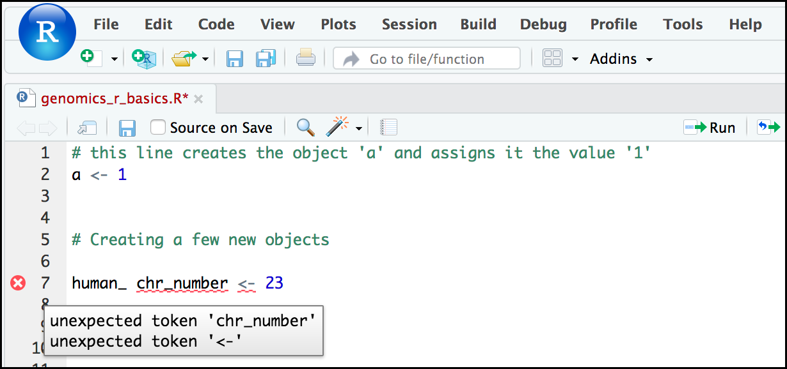

# Introduction
{:.no_toc}







> ### Agenda
>
> In this tutorial, we will cover:
>
> 1. TOC
> {:toc}
>
{: .agenda}

Before diving in the tutorial, we need to open . If you do not know how or never interacted with RStudio, please follow the [dedicated tutorial]().



# Creating objects in R

> ###  Reminder
> At this point you should be coding along in the `r_basics.R` script we created in the last episode. Writing your commands in the script(and commenting it) will make it easier to record what you did and why.
{: .comment}

What might be called a variable in many languages is called an **object** in R.

To create an object you need:

- a name (e.g. `a`)
- a value (e.g. `1`)
- the assignment operator (`<-`)

> ###  Hands-on: Create a first object
>
> 1. Assign `1` to the object `a` using the R assignment operator `<-` in your script
> 2. Write a comment in the line above
>
>    ```R
>    # this line creates the object 'a' and assigns it the value '1'
>    a <- 1
>    ```
>
> 3. Select the lines
> 4. Execute them
>
>    > ###  Tip: Execute from a script
>    > - Click on the **Run the current line or selection**
>    > - Type <kbd>CTRL</kbd>+<kbd>Enter</kbd> (or <kbd>CMD</kbd>+<kbd>Enter</kbd>)
>    {: .tip}
>
> 5. Check the **Console** and **Environment** panels
>
{: .hands_on}

The **Console** displays the lines of code run from the script and any outputs or status/warning/error messages (usually in red).

In the **Environment**, we have now a table:

Values | |
--- | ---
 a | 1

This **Environment** window allows you to keep track of the objects you have created in R.

> ###  Exercise: Create some objects in R
>
> Create the following objects, with an appropriate name (your best guess at what name to use is fine):
>
> 1. Create an object that has the value of number of pairs of human chromosomes
> 2. Create an object that has a value of your favorite gene name
> 3. Create an object that has this URL as its value (`ftp://ftp.ensemblgenomes.org/pub/bacteria/release-39/fasta/bacteria_5_collection/escherichia_coli_b_str_rel606/`)
> 4. Create an object that has the value of the number of chromosomes in a diploid human cell
>
> > ###  Solution
> >
> > Here as some possible answers to the challenge:
> >
> > 1. `human_chr_number <- 23`
> > 2. `gene_name <- 'pten'`
> > 3. `ensemble_url <- 'ftp://ftp.ensemblgenomes.org/pub/bacteria/release-39/fasta/bacteria_5_collection/escherichia_coli_b_str_rel606/'`
> > 4. `human_diploid_chr_num <-  36`
> >
> {: .solution}
{: .question}

#  Naming objects in R

Here are some important details about naming objects in R.

- **Avoid spaces and special characters**

    Object names cannot contain spaces or the minus sign (`-`). You can use `_` to make names more readable. You should avoid using special characters in your object name (e.g. `!`, `@`, `#`, `.` , etc.). Also, object names cannot begin with a number.

- **Use short, easy-to-understand names**

    You should avoid naming your objects using single letters (e.g. `n`, `p`, etc.). This is mostly to encourage you to use names that would make sense to anyone reading your code (a colleague, or even yourself a year from now). Also, avoiding excessively long names will make your code more readable.

- **Avoid commonly used names**

    There are several names that may already have a definition in the R language (e.g. `mean`, `min`, `max`). One clue that a name already has meaning is that if you start typing a name in RStudio and it gets a colored highlight or RStudio gives you a suggested autocompletion you have chosen a name that has a reserved meaning.

- **Use the recommended assignment operator**

    In R, we use `<-` as the preferred assignment operator. `=` works too, but is most commonly used in passing arguments to functions (more on functions later). There is a shortcut for the R assignment operator:
    - Windows execution shortcut: <kbd>Alt</kbd>+<kbd>-</kbd>
    - Mac execution shortcut: <kbd>Option</kbd>+<kbd>-</kbd>

There are a few more suggestions about naming and style you may want to learn more about as you write more R code. There are several "style guides" that have advice, and one to start with is the [tidyverse R style guide](http://style.tidyverse.org/index.html).

> ###  Pay attention to warnings in the script console
>
> If you enter a line of code in your script that contains an error, RStudio may give you an error message and underline this mistake. Sometimes these messages are easy to understand, but often the messages may need some figuring out. Paying attention to these warnings will help you avoid mistakes.
>
> In the example below, the object name has a space, which is not allowed in R. The error message does not say this directly, but R is "not sure" about how to assign the name to `human_ chr_number` when the object name we want is `human_chr_number`.
>
> 
{: .comment}

# Reassigning object names or deleting objects

Once an object has a value, you can change that value by overwriting it. R will not give you a warning or error if you overwriting an object, which may or may not be a good thing depending on how you look at it.

> ###  Hands-on: Overwrite an object
>
> 1. Overwrite the `gene_name` with the `tp53`
>
>    ```R
>    # gene_name has the value 'pten' or whatever value you used in the challenge.
>    # We will now assign the new value 'tp53'
>    gene_name <- 'tp53'
>    ```
>
> 2. Check the new value in the **Environment** panel
> 3. Type `gene_name` in the **Script** panel
> 4. Check in the **Console** panel
>
>    ```R
>    > gene_name
>    [1] "tp53"
>    ```
>
>    If you run a line of code that has only an object name, R will normally display the contents of that object.
{: .hands_on}

You can also remove an object from R's memory entirely

> ###  Hands-on: Remove an object
>
> 1. Delete the `gene_name` object
>
>    ```R
>    # delete the object 'gene_name'
>    rm(gene_name)
>    ```
>
> 2. Check that `gene_name` is not displayed in the **Environment** panel
> 3. Type `gene_name` only in **Script** and check the **Console**
>
>    ```R
>    > gene_name
>    Error: object 'gene_name' not found
>    ```
>
>    R tells us that the object no longer exists.
{: .hands_on}

# Understanding object data types or modes

In R, **every object has two properties**:

- **Length**: how many distinct values are held in that object
- **Mode**: what is the classification (type) of that object.

    The **"mode" property** corresponds to the **type of data an object represents**. The most common modes you will encounter in R are:

    - **Numeric (num)**: numbers such floating point/decimals (1.0, 0.5, 3.14)

        > ###  More specific types
        > There are also more specific numeric types (dbl - Double, int - Integer). These differences are not relevant for most beginners and pertain to how these values are stored in memory
        {: .comment}

    - **Character (chr)**: a sequence of letters/numbers in single `''` or double `" "` quotes
    - **Logical**: boolean values, `TRUE` or `FALSE`

    There are a few other modes (i.e. "complex", "raw" etc.) but these are the three we will work with in this lesson.

Data types are familiar in many programming languages, but also in natural language where we refer to them as the parts of speech, e.g. nouns, verbs, adverbs, etc. Once you know if a word - perhaps an unfamiliar one - is a noun, you can probably guess you can count it and make it plural if there is more than one (e.g. 1 [Tuatara](https://en.wikipedia.org/wiki/Tuatara), or 2 Tuataras). If something is a adjective, you can usually change it into an adverb by adding "-ly" (e.g. [jejune](https://www.merriam-webster.com/dictionary/jejune) vs. jejunely). Depending on the context, you may need to decide if a word is in one category or another (e.g "cut" may be a noun when it's on your finger, or a verb when you are preparing vegetables). These concepts have important analogies when working with R objects.

> ###  Hands-on: Create an object and check its mode
>
> 1. Assign `'chr02'` to a `chromosome_name` object
>
>    ```R
>    chromosome_name <- 'chr02'
>    ```
>
> 2. Check the mode of the object
>
>    ```R
>    mode(chromosome_name)
>    ```
>
> 3. Check the result in the console
>
{: .hands_on}

The created object seems to a character object.

> ###  Create objects and check their modes
>
> 1. Create the following objects in R
>    1. `od_600_value` with value `0.47`
>    2. `chr_position` with value `'1001701'`
>    3. `spock` with value `TRUE`
>    4. `pilot` with value `Earhart`
> 2. Guess their mode
> 3. Check them using `mode()`
>
> > ###  Solution
> >
> > 1. Object creation
> >
> >    ```R
> >    > od_600_value <- 0.47
> >    > chr_position <- '1001701'
> >    > spock <- TRUE
> >    > pilot <- Earhart
> >    [1] Error in eval(expr, envir, enclos): object 'Earhart' not found
> >    ```
> >
> >    We cannot take a string of alphanumeric characters (e.g. `Earhart`) and assign as a value for an object. In this case, R looks for an object named `Earhart` but since there is no object, no assignment can be made.
> >
> > 2. Modes
> >    1. `od_600_value`: numeric
> >    2. `chr_position`: character
> >
> >       If a series of numbers are given as a value R will consider them to be in the "character" mode if they are enclosed as single or double quotes
> >
> >    3. `spock`: logical
> >    4. `pilot`
> >
> >       ```R
> >       > mode(pilot)
> >       Error in mode(pilot) : object 'pilot' not found
> >       ```
> >
> >       If `Earhart` did exist, then the mode of `pilot` would be whatever the mode of `Earhart` was originally.
> >
> {: .solution}
{: .question}

# Mathematical and functional operations on objects

Once an object exists (which by definition also means it has a mode), R can appropriately manipulate that object. For example, objects of the numeric modes can be added, multiplied, divided, etc. R provides several mathematical (arithmetic) operators including:

- `+`: addition
- `-`: subtraction
- `*`: multiplication
- `/`: division
- `^` or `**`: exponentiation
- `a%%b`: modulus (the remainder after division)

> ###  Hands-on: Execute mathematical operations
>
> 1. Execute `(1 + (5 ** 0.5))/2`
>
>    ```R
>    > (1 + (5 ** 0.5))/2
>    [1] 1.618034
>    ```
>
> 2. Multiply the object `human_chr_number` by 2
>
>    ```R
>    > human_chr_number <- 23
>    # multiply the object 'human_chr_number' by 2
>    > human_chr_number * 2
>    [1] 46
>    ```
>
{: .hands_on}

> ###  Exercise: Compute the golden ratio
>
> One approximation of the golden ratio ($$\varphi$$) is
>
> $$\frac{1 + \sqrt{5}}{2}$$
>
> Compute the golden ratio to 3 digits of precision using the `sqrt()` and `round()` functions.
>
> Hint: remember the `round()` function can take 2 arguments.
>
> > ###  Solution
> >
> > ```R
> > > round((1 + sqrt(5))/2, digits = 3)
> > [1] 1.618
> > ```
> >
> > Notice that you can place one function inside of another.
> >
> {: .solution}
{: .question}

# Vectors

Vectors are probably the most used commonly used object type in R. **A vector is a collection of values that are all of the same type (numbers, characters, etc.)**.

One of the most common ways to create a vector is to use the `c()` function - the "concatenate" or "combine" function. Inside the function you may enter one or more values, separated by a comma.

> ###  Hands-on: Create a vector
>
> 1. Create a `snp_genes` object containing "OXTR", "ACTN3", "AR", "OPRM1"
>
>    ```R
>    # Create the SNP gene name vector
>    > snp_genes <- c("OXTR", "ACTN3", "AR", "OPRM1")
>    ```
>
> 2. Check how this object is stored in the **Environment** panel
{: .hands_on}

Vectors always have a **mode** and a **length**. In the **Environment** panel, we could already have an insight on these properties: `chr [1:4]` may indicate character and 4 values.

> ###  Hands-on: Check vector properties
>
> 1. Check the mode of `snp_genes` object
>
>    ```R
>    # Check the mode of 'snp_genes'
>    > mode(snp_genes)
>    [1] "character"
>    ```
>
> 2. Check the mode of `snp_genes` length
>
>    ```R
>    # Check the mode of 'snp_genes'
>    > length(snp_genes)
>    [1] "4"
>    ```
>
> 3. Check both properties using `str` function
>
>    ```R
>    # Check the structure of 'snp_genes'
>    > str(snp_genes)
>    [1] chr [1:4] "OXTR" "ACTN3" "AR" "OPRM1"
>    ```
{: .hands_on}

The `str()` (structure) function is giving the same information as the **Environmnent** panel.

Vectors are quite important in R. Another data type that we will not work in this tutorial but in extra tutorial: data frames, are collections of vectors. What we learn here about vectors will pay off even more when we start working with data frames.

## Creating and subsetting vectors

Once we have vectors, one thing we may want to do is specifically retrieve one or more values from our vector. To do so, we use **bracket notation**. We type the name of the vector followed by square brackets. In those square brackets we place the index (e.g. a number) in that bracket.

> ###  Hands-on: Get values from vectors
>
> 1. Create several vectors
>    - `snps` object with "rs53576", "rs1815739", "rs6152", "rs1799971"
>    - `snp_chromosomes` object with "3", "11", "X", "6"
>    - `snp_positions` object with 8762685, 66560624, 67545785, 154039662
>
>    ```R
>    # Some interesting human SNPs
>    # while accuracy is important, typos in the data won't hurt you here
>    snps <- c('rs53576', 'rs1815739', 'rs6152', 'rs1799971')
>    snp_chromosomes <- c('3', '11', 'X', '6')
>    snp_positions <- c(8762685, 66560624, 67545785, 154039662)
>    ```
>
> 2. Get the 3rd value in the `snp_genes` vector
>
>    ```R
>    # get the 3rd value in the snp_genes vector
>    > snp_genes[3]
>    [1] "AR"
>    ```
{: .hands_on}

In R, every item your vector is indexed, starting from the first item (1) through to the final number of items in your vector.

You can also retrieve a range of numbers:

> ###  Hands-on: Retrieve a range of values from vectors
> 1. Get the 1st through 3rd value in the `snp_genes` vector
>
>    ```R
>    # get the 1st through 3rd value in the snp_genes vector
>    > snp_genes[1:3]
>    [1] "OXTR"  "ACTN3" "AR"
>    ```
>
> 2. Get the 1st, 3rd, and 4th value in the `snp_genes` vector
>
>    ```R
>    # get the 1st, 3rd, and 4th value in the snp_genes vector
>    > snp_genes[c(1, 3, 4)]
>    [1] "OXTR"  "AR"    "OPRM1"
>    ```
{: .hands_on}

To retrieve several (but not necessarily sequential) items from a vector, you pass a **vector of indices**, a vector that has the numbered positions you wish to retrieve.

There are additional (and perhaps less commonly used) ways of subsetting a vector (see [these
examples](https://thomasleeper.com/Rcourse/Tutorials/vectorindexing.html)). Also, several of these subsetting expressions can be combined.

> ###  Hands-on: Retrieve a complex range of values from vectors
> 1. Get the 1st through the 3rd value, and 4th value in the `snp_genes` vector
>
>    ```R
>    # get the 1st through the 3rd value, and 4th value in the snp_genes vector
>    # yes, this is a little silly in a vector of only 4 values.
>    > snp_genes[c(1:3,4)]
>    [1] "OXTR"  "ACTN3" "AR"    "OPRM1"
>    ```
{: .hands_on}

## Adding to, removing, or replacing values in existing vectors

Once you have an existing vector, you may want to add a new item to it. To do so, you can use the `c()` function again to add your new value.

> ###  Hands-on: Add values to vectors
> 1. Add "CYP1A1", "APOA5" to `snp_genes` vector
>
>    ```R
>    # add the gene 'CYP1A1' and 'APOA5' to our list of snp genes
>    # this overwrites our existing vector
>    snp_genes <- c(snp_genes, "CYP1A1", "APOA5")
>    ```
>
> 2. Check the content of `snp_genes`
>
>    ```R
>    > snp_genes
>    [1] "OXTR"   "ACTN3"  "AR"     "OPRM1"  "CYP1A1" "APOA5"
>    ```
{: .hands_on}

To remove a value from a vection, we can use a negative index that will return a version a vector with that index's value removed.

> ###  Hands-on: Remove values to vectors
> 1. Check value corresponding to `-6` in `snp_genes`
>
>    ```R
>    > snp_genes[-6]
>    [1] "OXTR"   "ACTN3"  "AR"     "OPRM1"  "CYP1A1"
>    ```
>
> 2. Remove the 6th value of `snp_genes`
>
>    ```R
>    > snp_genes <- snp_genes[-6]
>    > snp_genes
>    [1] "OXTR"   "ACTN3"  "AR"     "OPRM1"  "CYP1A1"
>    ```
{: .hands_on}

We can also explicitly rename or add a value to our index using double bracket notation.

> ###  Hands-on: Rename values in vectors
> 1. Rename the 7th value to "APOA5"
>
>    ```R
>    > snp_genes[[7]]<- "APOA5"
>    > snp_genes
>    [1] "OXTR"   "ACTN3"  "AR"     "OPRM1"  "CYP1A1" NA       "APOA5"
>    ```
{: .hands_on}

Notice in the operation above that R inserts an `NA` value to extend our vector so that the gene "APOA5" is an index 7. This may be a good or not-so-good thing depending on how you use this.

> ###  Exercise: Examining and subsetting vectors
>
> Which of the following are true of vectors in R?
> 1. All vectors have a mode **or** a length
> 2. All vectors have a mode **and** a length
> 3. Vectors may have different lengths
> 4. Items within a vector may be of different modes
> 5. You can use the `c()` to one or more items to an existing vector
> 6. You can use the `c()` to add a vector to an exiting vector
>
> > ###  Solution
> >
> > 1. False: vectors have both of these properties
> > 2. True
> > 3. True
> > 4. False: vectors have only one mode (e.g. numeric, character) and all items in a vector must be of this mode.
> > 5. True
> > 6. True
> >
> {: .solution}
{: .question}

## Logical Subsetting

There is one last set of cool subsetting capabilities we want to introduce. It is possible within R to retrieve items in a vector based on a logical evaluation or numerical comparison.

For example, let's say we wanted get

> ###  Hands-on: Subset logically vectors
> 1. Extract all of the SNPs in our vector of SNP positions (`snp_positions`) that were greater than 100,000,000
>
>    ```R
>    > snp_positions[snp_positions > 100000000]
>    [1] 154039662
>    ```
{: .hands_on}

In the square brackets you place the name of the vector followed by the comparison operator and (in this case) a numeric value. Some of the most common logical operators you will use in R are:

- `<`: less than
- `<=`: less than or equal to
- `>`: greater than
- `>=`: greater than or equal to
- `==`: exactly equal to
- `!=`: not equal to
- `!x`: not x
- `a | b`: a or b
- `a & b`: a and b

The reason why the expression `snp_positions[snp_positions > 100000000]` works can be better understood if you examine what the expression `snp_positions > 100000000` evaluates to:

```R
> snp_positions > 100000000
[1] FALSE FALSE FALSE  TRUE
```

The output above is a logical vector, the 4th element of which is `TRUE`. When you pass a logical vector as an index, R will return the true values:

```R
> snp_positions[c(FALSE, FALSE, FALSE, TRUE)]
[1] 154039662
```

If you have never coded before, this type of situation starts to expose the "magic" of programming. We mentioned before that in the bracket notation you take your named vector followed by brackets which contain an index: `named_vector[index]`. The "magic" is that the index needs to *evaluate to* a number. So, even if it does not appear to be an integer (e.g. 1, 2, 3), as long as R can evaluate it, we will get a result. That our expression `snp_positions[snp_positions > 100000000]` evaluates to a number can be seen in the following situation.

How to know which **index** (1, 2, 3, or 4) in our vector of SNP positions was the one that was greater than 100,000,000?

> ###  Hands-on: Getting which indices of any item that evaluates as TRUE
> 1. Return the indices in our vector of SNP positions (`snp_positions`) that were greater than 100,000,000
>
>    ```R
>    > which(snp_positions > 100000000)
>    [1] 4
>    ```
{: .hands_on}

**Why this is important?** Often in programming we will not know what inputs and values will be used when our code is executed. Rather than put in a pre-determined value (e.g 100000000) we can use an object that can take on whatever value we need.

> ###  Hands-on: Subset logically vectors
> 1. Create a `snp_marker_cutoff` containing `100000000`
> 1. Extract all of the SNPs in `snp_positions` that were greater than `snp_marker_cutoff`
>
> ```R
> > snp_marker_cutoff <- 100000000
> > snp_positions[snp_positions > snp_marker_cutoff]
> [1] 154039662
> ```
>
{: .hands_on}

Ultimately, it's putting together flexible, reusable code like this that gets at the "magic" of programming!

## A few final vector tricks

Finally, there are a few other common retrieve or replace operations you may want to know about. First, you can check to see if any of the values of your vector are missing (i.e. are `NA`). Missing data will get a more detailed treatment later, but the `is.NA()` function will return a logical vector, with TRUE for any NA value:

> ###  Hands-on: Check for missing values
> 1. Check what are the missing values in `snp_genes`
>
>    ```R
>    # current value of 'snp_genes':
>    # chr [1:7] "OXTR" "ACTN3" "AR" "OPRM1" "CYP1A1" NA "APOA5"
>    > is.na(snp_genes)
>    [1] FALSE FALSE FALSE FALSE FALSE  TRUE FALSE
>    ```
>
{: .hands_on}

Sometimes, you may wish to find out if a specific value (or several values) is present a vector. You can do this using the comparison operator `%in%`, which will return TRUE for any value in your collection that is in the vector you are searching.

> ###  Hands-on: Check for presence of values
> 1. Check if "ACTN3" and "APOA5" are in `snp_genes`
>
>    ```R
>    # current value of 'snp_genes':
>    # chr [1:7] "OXTR" "ACTN3" "AR" "OPRM1" "CYP1A1" NA "APOA5"
>    # test to see if "ACTN3" or "APO5A" is in the snp_genes vector
>    # if you are looking for more than one value, you must pass this as a vector
>    > c("ACTN3","APOA5") %in% snp_genes
>    [1] TRUE TRUE
>    ```
>
{: .hands_on}

> ###  Questions
>
> 1. What data types/modes are the following vectors?
>    1. `snps`
>    2. `snp_chromosomes`
>    3. `snp_positions`
>
>    > ###  Solution
>    >
>    > ```R
>    > > mode(snps)
>    > [1] "character"
>    > > mode(snp_chromosomes)
>    > [1] "character"
>    > > mode(snp_positions)
>    > [1] "double"
>    > ```
>    {: .solution}
>
> 2. Add the following values to the specified vectors:
>    1. Add "rs662799" to the `snps` vector
>    2. Add 11 to the `snp_chromosomes` vector
>    3. Add 116792991 to the `snp_positions` vector
>
>    > ###  Solution
>    >
>    > ```R
>    > > snps <- c(snps, 'rs662799')
>    > > snps
>    > [1] "rs53576"   "rs1815739" "rs6152"    "rs1799971" "rs662799"
>    > > snp_chromosomes <- c(snp_chromosomes, "11") # did you use quotes?
>    > > snp_chromosomes
>    > [1] "3"  "11" "X"  "6"  "11"
>    > > snp_positions <- c(snp_positions, 116792991)
>    > > snp_positions
>    > [1]   8762685  66560624  67545785 154039662 116792991
>    > ```
>    {: .solution}
>
> 3. Make the following change to the `snp_genes` vector:
>    1. Create a new version of `snp_genes` that does not contain CYP1A1
>    2. Add 2 NA values to the end of `snp_genes`
>
>    > ###  Solution
>    >
>    > ```R
>    > > snp_genes <- snp_genes[-5]
>    > > snp_genes <- c(snp_genes, NA, NA)
>    > > snp_genes
>    > [1] "OXTR"  "ACTN3" "AR"    "OPRM1" NA      "APOA5" NA      NA
>    > ```
>    >
>    {: .solution}
>
> 4. Using indexing, create a new vector named `combined` that contains:
>    - 1st value in `snp_genes`
>    - 1st value in `snps`
>    - 1st value in `snp_chromosomes`
>    - 1st value in `snp_positions`
>
>    > ###  Solution
>    >
>    > ```R
>    > > combined <- c(snp_genes[1], snps[1], snp_chromosomes[1], snp_positions[1])
>    > > combined
>    > [1] "OXTR"    "rs53576" "3"       "8762685"
>    > ```
>    >
>    {: .solution}
>
> 5. What type of data is `combined`?
>
>    > ###  Solution
>    >
>    > ```R
>    > > typeof(combined)
>    > [1] "character"
>    > ```
>    >
>    {: .solution}
{: .question}

## Coercing values

Sometimes, it is possible that R will misinterpret the type of data represented in a vector, or store that data in a mode which prevents you from operating on the data the way you wish. For example, a long list of gene names isn't usually thought of as a categorical variable, the way that your experimental condition (e.g. control, treatment) might be. More importantly, some R packages you use to analyze your data may expect characters as input, not factors. At other times (such as plotting or some statistical analyses) a factor may be more appropriate. Ultimately, you should know how to change the mode of an object.

First, its very important to recognize that coercion happens in R all the time. This can be a good thing when R gets it right, or a bad thing when the result is not what you expect. Consider:

```R
> chromosomes <- c('3', '11', 'X', '6')
> mode(chromosomes)
[1] "character"
```

Although there are several numbers in our vector, they are all in quotes, so we have explicitly told R to consider them as characters. However, even if we removed the quotes from the numbers, R would coerce everything into a character:

```R
> chromosomes_2 <- c(3, 11, 'X', 6)
> typeof(chromosomes_2)
[1] "character"
> chromosomes_2[1]
[1] "3"
```

We can use the `as.` functions to explicitly coerce values from one form into another.

> ###  Hands-on: Coerce values
> 1. Create a `positions` object with "8762685", "66560624", "67545785", "154039662"
>
>    ```R
>    positions <- c("8762685", "66560624", "67545785", "154039662")
>    ```
>
> 2. Check the type and first element
>
>    ```R
>    > typeof(positions)
>    [1] "character"
>    > positions[1]
>    [1] "8762685"
>    ```
>
> 3. Coerce into a numeric type using `as.numeric()`
>
>    ```R
>    > positions <- as.numeric(positions)
>    > typeof(snp_positions_2)
>    [1] "double"
>    > snp_positions_2[1]
>    [1] 8762685
>    ```
{: .hands_on}

Here the coercion is straight forward, but what would happen if we tried using `as.numeric()` on `snp_chromosomes_2`

> ###  Hands-on: Issue with coercing values
> 1. Create a `chromosomes_2` object with 3, 11, 'X', 6
>
>    ```R
>    chromosomes_2 <- c(3, 11, 'X', 6)
>    ```
>
> 2. Coerce into a numeric type using `as.numeric()`
>
>    ```R
>    > snp_chromosomes_2 <- as.numeric(snp_chromosomes_2)
>    Warning message:
>    NAs introduced by coercion
>    ```
>
> 3. Check the content of `chromosomes_2`
>
>    ```R
>    > snp_chromosomes_2
>    [1]  3 11 NA  6
>    ```
{: .hands_on}

We see that an `NA` value (R's default value for missing data) has been introduced.

Let's summarize this section on coercion with a few take home messages:

- Be careful to check the result when you explicitly coerce one data type into another (this is known as **explicit coercion**)

    Ideally, you should try to see if its possible to avoid steps in your analysis that force you to coerce.

- Check the structure (`str()`) of your data before working with them!

    R will sometimes coerce without you asking for it. This is called (appropriately) **implicit coercion**. For example when we tried to create a vector with multiple data types, R chose one type through implicit coercion.

# Lists

Lists are quite useful in R. You may come across lists in the way that some bioinformatics programs may store and/or return data to you. One of the key attributes of a list is that, unlike a vector, a list may contain data of more than one mode.

> ###  Learning more about lists
> Learn more about creating and using lists using this [nice tutorial](https://r4ds.had.co.nz/vectors.html#lists). In this one example, we will create a named list and show you how to retrieve items from the list.
{: .comment}

> ###  Hands-on: Create and manipulate list objects
> 1. Create a named list containing the genes, reference SNPs, chromomosome and position objects we create before
>
>    ```R
>    # Create a named list using the 'list' function and our SNP examples
>    snp_data <- list(genes = snp_genes,
>                     reference_snp = snps,
>                     chromosome = snp_chromosomes,
>                     position = snp_positions)
>    ```
>
>    > ###  Easy reading
>    > For easy reading we have placed each item in the list on a separate line. Nothing special about this, you can do this for any multiline commands. Just make sure the entire command (all 4 lines) are highlighted before running.
>    >
>    > As we are doing all this inside the list() function use of the `=` sign is good style
>    {: .comment}
>
> 2. Examine the structure of the list
>
>    ```R
>    > str(snp_data)
>    List of 4
>     $ genes         : chr [1:8] "OXTR" "ACTN3" "AR" "OPRM1" ...
>     $ refference_snp: chr [1:5] "rs53576" "rs1815739" "rs6152" "rs1799971" ...
>     $ chromosome    : chr [1:5] "3" "11" "X" "6" ...
>     $ position      : num [1:5] 8.76e+06 6.66e+07 6.75e+07 1.54e+08 1.17e+08
>    ```
>
> 3. Get all values for the `position` object in the list
>
>    ```R
>    > snp_data$position
>    [1]   8762685  66560624  67545785 154039662 116792991
>    ```
>
> 4. Get the first value in the `position` object
>
>    ```R
>    > snp_data$position[1]
>    [1] 8762685
>    ```
{: .hands_on}

# Conclusion
{:.no_toc}

This tutorial
