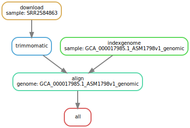
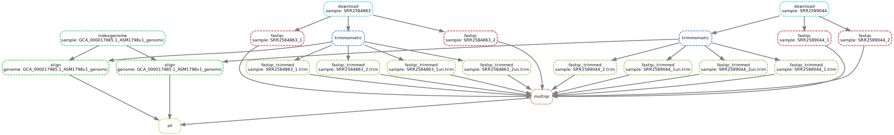

Here you will learn to write both Make and Snakemake workflows. We teach two workflow engines because Snakemake uses a lot of the concepts of Make, and these concepts are somewhat complex and a very different way of thinking than you might be used to with workflow design.

This tutorial is aimed at students and Galaxy community members who might want to convert Snakemake workflows into Galaxy workflows, but need to understand how Snakemake workflows work.

> <agenda-title></agenda-title>
>
> In this tutorial, we will cover:
>
> 1. TOC
> {:toc}
>
{: .agenda}

We're going to go through this tutorial as "the evolution of a pipeline" from a simple bash script that we might run as individual commands on the command line, all the way up to a Snakemake workflow. This should give you some perspective of why the systems exist, and what benefits each system brings.

# Bash

We've set up a simple bash pipeline. It downloads some read files from a website, decompresses them, builds an index for a `genome.fa` we already have, and then does the alignment against that genome.

```bash
# Downloading our datasets
wget https://zenodo.org/record/5562251/files/GCA_000017985.1_ASM1798v1_genomic.fna.gz
wget https://zenodo.org/record/5562251/files/SRR2584866_1.fq.gz
wget https://zenodo.org/record/5562251/files/SRR2584866_2.fq.gz
wget https://zenodo.org/record/5562251/files/SRR2589044_1.fq.gz
wget https://zenodo.org/record/5562251/files/SRR2589044_2.fq.gz

# Generate FastQC Report
fastqc *.fq

# Run Trimmomatic to trim the bad reads out.
trimmomatic PE SRR2589044_1.fq.gz SRR2589044_2.fq.gz \
               SRR2589044_1.trim.fq SRR2589044_1un.trim.fq \
               SRR2589044_2.trim.fq SRR2589044_2un.trim.fq \
               SLIDINGWINDOW:4:20 MINLEN:25 ILLUMINACLIP:NexteraPE-PE.fa:2:40:15

trimmomatic PE SRR2584866_1.fq.gz SRR2589044_2.fq.gz \
               SRR2584866_1.trim.fq SRR2589044_1un.trim.fq \
               SRR2584866_2.trim.fq SRR2589044_2un.trim.fq \
               SLIDINGWINDOW:4:20 MINLEN:25 ILLUMINACLIP:NexteraPE-PE.fa:2:40:15

# Generate Updated FastQC Report
fastqc *.trim.fq

# Generate the genome index
bwa index GCA_000017985.1_ASM1798v1_genomic.fna

# Align reads to the genome
bwa mem GCA_000017985.1_ASM1798v1_genomic.fna SRR2589044_1.trim.fq SRR2589044_2.trim.fq | samtools sort -O bam -o SRR2589044.bam
bwa mem GCA_000017985.1_ASM1798v1_genomic.fna SRR2584866_1.trim.fq SRR2584866_2.trim.fq | samtools sort -O bam -o SRR2584866.bam
```

This is a fine start to our analysis pipeline, and might simply be summarising
the commands we executed interactively at the command line.

# Make

Make is a build automation tool that has been around since 1976. It lets you describe build processes, writing down the individual processes which will occur, and then providing you a single entrypoint to run your workflow, a lot like how {SciWMS} work! But importantly it is declarative, rather than imperative which is a big change if you're familiar with programming languages like bash or python.

Instead of defining step by step all of the steps that should be executed like the bash example above,
you instead write more general rules on how to produce individual files. We'll look at them one-by-one.

In bash scripts you write something like:
- `command input` and it implicitly creates the output file automatically, often by adding a suffix (e.g. `bwa index genome.fa` produces an index you refer to with `genome`)
- `command input > output` redirecting output of the command to a file
- `command input -O output` where we explicitly state where the output is

In Make you'll need to do that, but you'll also need to declare the inputs and outputs of every step!

<pre class="highlight"><code><span class="nb">output</span>: <span class="kt">input</span>
	<span class="s2">command [and here the correct variant from above]</span>
</code></pre>

This may seem tedious, to annotate the inputs and outputs of each step, but because Make knows what input files need to exist before it can execute this step, and it knows precisely which output files you will generate. It needs this information so that when you have multiple rules, it can decide which dependencies need to be executed.

## Line-By-Line Comparison

### Downloading Data

> <code-in-title>Bash</code-in-title>
> <pre class="highlight"><code><span class="s2">wget https://.../GCA_000017985.1_ASM1798v1_genomic.fna.gz
> wget https://.../SRR2584866_1.fq.gz</span>
> </code></pre>
> With bash we download each read file one by one
{: .code-in}
> <code-out-title>Make</code-out-title>
> <pre class="highlight"><code><span class="nb">%.gz</span>:
> 	<span class="s2">wget https://.../$@ -O $@</span>
> </code></pre>
> But with Make we write is a generic rule which can be used any time you need to download a file for this project. `$@` is used as the name of the output file and in the templated source url we will download from. If you ran `make SRR2584866_1.fq.gz` it would template out the `wget` command and run it. **Speed bonus**: It can parallelise these download jobs for us!
{: .code-out}

### FastQC

> <code-in-title>Bash</code-in-title>
> <pre class="highlight"><code><span class="s2">fastqc *.fq</span></code></pre>
> Generate ALL of the FastQC reports
{: .code-in}
> <code-out-title>Make</code-out-title>
> <pre class="highlight"><code><span class="nb">%.fastqc.html</span>: <span class="kt">%.fq</span>
> 	<span class="s2">fastqc $<</span>
> </code></pre>
> Here is a rule to generate a single FastQC report from a single FastQ file
{: .code-out}

### Trimming Data

> <code-in-title>Bash</code-in-title>
> <pre class="highlight"><code><span class="s2">trimmomatic PE</span> <span class="kt">SRR2589044_1.fq.gz SRR2589044_2.fq.gz</span> \
>                <span class="nb">SRR2589044_1.trim.fq SRR2589044_1un.trim.fq \
>                SRR2589044_2.trim.fq SRR2589044_2un.trim.fq</span> \
>                <span class="s2">SLIDINGWINDOW:4:20 MINLEN:25 ILLUMINACLIP:NexteraPE-PE.fa:2:40:15</span>
>
> <span class="s2">trimmomatic PE</span> <span class="kt">SRR2584866_1.fq.gz SRR2584866_2.fq.gz</span> \
>                <span class="nb">SRR2584866_1.trim.fq SRR2584866_1un.trim.fq \
>                SRR2584866_2.trim.fq SRR2584866_2un.trim.fq</span> \
>                <span class="s2">SLIDINGWINDOW:4:20 MINLEN:25 ILLUMINACLIP:NexteraPE-PE.fa:2:40:15</span>
> </code></pre>
> Run these two individual trimmomatic commands with these hardcoded filenames. If you need to run a new file make sure to carefully change all of the uses of it!
{: .code-in}
> <code-out-title>Make</code-out-title>
> <pre class="highlight"><code><span class="nb">%_1.trim.fq %_2.trim.fq %_1un.trim.fq %_2un.trim.fq</span>: <span class="kt">%_1.fq.gz %_2.fq.gz</span>
> 	<span class="s2">trimmomatic PE $^ \
> 		$(shell basename $(word 1,$^) .fq).trim.fq \
> 		$(shell basename $(word 1,$^) .fq)un.trim.fq \
> 		$(shell basename $(word 2,$^) .fq).trim.fq \
> 		$(shell basename $(word 2,$^) .fq)un.trim.fq \
> 		SLIDINGWINDOW:4:20 MINLEN:25 ILLUMINACLIP:NexteraPE-PE.fa:2:40:15</span>
> </code></pre>
>
> A more generic rule to generate the trimmed fastq files from whichever pair of sequence identifiers were provided. By using `%` we also get some safety in this function that we didn't have in the bash version! We know for sure those are identical values, and no one accidentally made a small typo in any one of the **6** times the same identifier was repeated. <u>But it comes at the cost</u> of using some complex Make statements like `$(shell)` which lets us execute arbitrary shell commands inside our pipeline.
>
> You'll notice that what we're really doing is extracting the inputs and outputs from the command and making them much more uniform
{: .code-out}

So when we translated from Bash to Make, every time

- we annotated inputs
- we annotated outputs
- we made the command a 'template'

> <comment-title>DO NOT REMEMBER THIS</comment-title>
> There is a lot of Make specific things going on in the above examples. You do not need to know it! We just wanted to provide working, correct examples. This tutorial is focused on Snakemake, so read these for context and understanding of why we use Snakemake, not reading them to learn Makefiles.
{: .comment}

## Why Make?

So now comes the question, why Make? Why would you want to write the rules in this declarative way, rather than the imperative way that is so much easier and requires so much less work? *Speed!* Why would you want to write these generic rules that require learning a lot of Make's syntax? *Reusability*.

Speed
:  Every time you want to run your declarative pipeline, you either need to run it from start to finish every time (re-downloading sequence data, re-building genome indicies, re-mapping reads) or to write a lot of bash code to check if those files exist and only downloading/indexing/alinging as-needed.

Reusability
:  That pipeline can only download those specific files, unless you write additional code to template out the name of the reads and genome you want to align. By writing more generic rules, as soon as someone gives you new datasets, you can immediately start processing those with your re-usable pipeline.

However with `make`, you've written generic rules which can be used to download any fastq files. And best of all, make can check if the files already exist, and if they do, it skips the step and goes on to the next step, rather than re-creating the file. Make does this by checking the

Aspect | Bash | Make
--- |--- | ---
Language style | Individual steps performed line-by-line | Generic rules are written which say how to do the operation, but not on which data
Partial re-run | You must run the entire script every time (or write extra code) | Files are only created when you ask for them
How it is invoked | `bash script.sh` | `make`
Running with different data? | Edit the script to replace the identifiers, or support templated identifiers. | `make read1111.sam read2222.sam read3333.same read4444.sam`
Paralellisation? | None by default, you must edit the script to add it. | `make -j 8` runs each build step on one thread, with 8 threads available, until all tasks are finished.
Filename | Anything ending in `.sh` | `Makefile` is the default name, and you should name your makefile this, unless you want people to have to type `make -f other-file.mk`
Dependencies | Up to you to manage | Up to you to manage
Multiple output files per step | n/a | [Very tricky to get completely right](https://www.gnu.org/software/automake/manual/html_node/Multiple-Outputs.html), Makefiles really expect one rule produces one output file (and can only check e.g. update times of a single file.)
Cluster/HPC Friendliness | Everything is manual | Everything is manual

## Backwards

A full makefile example

```
all: SRR2589044.bam

# Here we've hardcoded the genome name because it's less likely to change for a
# single pipeline than the individual data files are.
%.bam: %_1.trim.fq %_1.trim.fq GCA_000017985.1_ASM1798v1_genomic.fna.gz.bwt
	bwa mem GCA_000017985.1_ASM1798v1_genomic.fna $(word 1,$^) $(word 2,$^) | \
		samtools sort -O bam -o $@

# This indexing step however will work for any possible
%.fna.gz.bwt: %.fna.gz
	bwa index $<

# This handles ALL fastqc reporting, so we don't have to do it in two sections,
# but, unless we ask for these reports they won't be generated.
%.fastqc.html: %.fq
	fastqc $<

# This rule violates some Makefile internal expectations by having multiple
# outputs which is not handled well by all implementations
%_1.trim.fq %_2.trim.fq %_1un.trim.fq %_2un.trim.fq: %_1.fq.gz %_2.fq.gz
	trimmomatic PE $^ \
		$(shell basename $(word 1,$^) .fq).trim.fq \
		$(shell basename $(word 1,$^) .fq)un.trim.fq \
		$(shell basename $(word 2,$^) .fq).trim.fq \
		$(shell basename $(word 2,$^) .fq)un.trim.fq \
		SLIDINGWINDOW:4:20 MINLEN:25 ILLUMINACLIP:NexteraPE-PE.fa:2:40:15

# And here's finally our download step
%:
	https://zenodo.org/record/5562251/files/$(shell basename $@) \
		-O $@
```

You'll notice a couple things about this above example:

1. There is a new rule called `all`. In a makefile, by default, the very first rule is executed when you run `make`. If you want to execute other rules you can, but it defaults to the first one. By convention, many people name it `all`.
2. Inside there we've also written a file we'd like created, `SRR2589044.bam`, which doesn't exist yet. Make sees this as a dependency to finishing the (empty) all rule, and then goes on to figure out how to create it.
3. It is written backwards, we've started with what we want to output, and for each line, we figured out what we needed for that, and wrote a rule on how to create it. This is relatively common in makefiles.

You'll also notice some weird additional things we've had to do like `$(word 2,$^)` to get the second input file to that rule, this is really kind of ugly and hard to understand and is a great motivation for learning Snakemake which helps address these issues.

Make will read the above makefile like so:

1. You're running `make` so I will find the first task and run it
2. `all` is the first task and it depends on this BAM file
3. The BAM file needs me to run bwa-mem and bwa-index, in two separate steps
	1. For bwa index I need to index the genome
	2. And I need to download it first!
4. Also I need the trimmed fastq files, both forward and reverse files.
5. And I need to have the untrimmed files to trim them
6. And I need to download those first!

Notice that Make isn't running every task, it's reading the one task you asked for, and seeing what's required for that based on your annotations of inputs and outputs.

> <question-title>Check your understanding</question-title>
>
> 1. If a file is not part of the final output, or not the requested task, will it be created?
> 2. Do you spot any omissions in the above pipeline?
>
> > <solution-title></solution-title>
> > 1. No, Make only runs the tasks for files it needs, it won't run any of the other tasks. This is part of what makes `make` fast and easily parallelisable.
> > 2. Yes! FastQC is missing, it won't be created unless we ask for it.
> {: .solution}
{: .question}

Reading the above you should be able to imagine a tree of tasks that Make is creating internally:

TODO

This is called a {DAG}, it is a graph of nodes (tasks that need to be executed), with connections between nodes that have a direction (this task depends on outputs of that task), and there are no cycles (no outputs depend on inputs.) These are very common in {SciWMS}s because they make computation faster. Instead of executing step-by-step, we can build this graph of what work needs to be done, and then starting with the leaves of the graph (the end nodes without other dependencies) we can start executing and removing them.

This also how we can really easily parallelise workflows: because we know the dependencies of each step, we know which can be executed right now, and we can execute them in parallel because we know for sure they do not depend on each other.

# Snakemake

> The Snakemake workflow management system is a tool to create reproducible and scalable data analyses. Workflows are described via a human readable, Python based language. They can be seamlessly scaled to server, cluster, grid and cloud environments, without the need to modify the workflow definition. Finally, Snakemake workflows can entail a description of required software, which will be automatically deployed to any execution environment. [source](https://snakemake.readthedocs.io/en/stable/index.html)
{: .quote}

Snakemake addresses a lot of the issues with make for use in scientific contexts: clearer pipelines and dependencies. We did not talk about it in the previous section, but where did `bowtie2` and `bowtie2-build` come from? How did those get installed? What versions are they? None of that information is included in the Makefile

Snakemake rules are a bit more complex, in Snakemake you will write rules that follow this form:

<pre class="highlight"><code>rule my-rule-name
	<span class="kt">input:
		"something",
		"something-else"</span>
	<span class="nb">output:
		"output-1",
		"output-2"</span>
	<span class="s2">shell:
		"cat {input} > {output}"</span>
</code></pre>

## Line-By-Line Comparison

### Downloading Data

> <code-in-title>Make</code-in-title>
> <pre class="highlight"><code><span class="nb">%.fq.gz</span>:
> 	<span class="s2">wget https://zenodo.org/record/5562251/files/$@</span>
> </code></pre>
>
> Generic download rule, the <code>$@</code> and <code>%</code> used are a bit opaque, you need to know what they mean to understand how the rule works.
{: .code-in}
> <code-out-title>Snakemake</code-out-title>
> <pre class="highlight"><code>rule download:
> 	<span class="nb">output:
> 		"{sample}.fq.gz"</span>
> 	<span class="s2">shell:
> 		"wget https://zenodo.org/record/5562251/files/{wildcards.sample}.fq.gz -O {output}"</span>
> </code></pre>
>
> This is much more explicit, the outputs are listed and `{sample}` is used as the variable to be templated out, a lot like you might recognise from Python's `format` function or `f""` strings. The rule also has a name which serves as really nice documentation for what that step does, you don't have to read the command to figure it out.
{: .code-out}

### FastQC

> <code-in-title>Mask</code-in-title>
> <pre class="highlight"><code><span class="nb">%.fastqc.html</span>: <span class="kt">%.fq</span>
> 	<span class="s2">fastqc $<</span>
> </code></pre>
>
> Here is a rule to generate a single FastQC report from a single FastQ file
{: .code-in}
> <code-out-title>Snakemake</code-out-title>
> <pre class="highlight"><code>rule fastqc:
> 	<span class="kt">input:
> 		"{sample}.fq.gz"</span>
> 	<span class="nb">output:
> 		"{sample}_fastqc.html"</span>
> 	<span class="s2">shell:
> 		"fastqc {input} --outdir fastqc/"</span>
> </code></pre>
>
> Essentially the same, but now we've also added a Conda environment in which our job will run. This makes dependency management a lot simpler.
{: .code-out}


### Trimming Data


> <code-in-title>Make</code-in-title>
> <pre class="highlight"><code><span class="nb">%_1.trim.fq %_2.trim.fq %_1un.trim.fq %_2un.trim.fq</span>: <span class="kt">%_1.fq.gz %_2.fq.gz</span>
> 	<span class="s2">trimmomatic PE $^ \
> 		$(shell basename $(word 1,$^) .fq).trim.fq \
> 		$(shell basename $(word 1,$^) .fq)un.trim.fq \
> 		$(shell basename $(word 2,$^) .fq).trim.fq \
> 		$(shell basename $(word 2,$^) .fq)un.trim.fq \
> 		SLIDINGWINDOW:4:20 MINLEN:25 ILLUMINACLIP:NexteraPE-PE.fa:2:40:15</span>
> </code></pre>
>
> Here we take our very complicated and hard to understand Make rule (shell? basename? word?) with ugly and potentially quite broken multiple output syntax
>
{: .code-in}
> <code-out-title>Snakemake</code-out-title>
> <pre class="highlight"><code>rule trimmomatic:
> 	<span class="kt">input:
> 		r1="{sample}_1.fq.gz",
> 		r2="{sample}_2.fq.gz"</span>
> 	<span class="nb">output:
> 		o1="{sample}_1.trim.fq",
> 		o2="{sample}_2.trim.fq",
> 		o1un="{sample}_1un.trim.fq",
> 		o2un="{sample}_2un.trim.fq"</span>
> 	<span class="s2">shell:
> 		"trimmomatic PE "
> 		"{input.r1} {input.r2} "
> 		"{output.o1} {output.o1un} "
> 		"{output.o2} {output.o2un} "
> 		"SLIDINGWINDOW:4:20 MINLEN:25 "
> 		"ILLUMINACLIP:NexteraPE-PE.fa:2:40:15"</span>
> </code></pre>
>
> And turn it into a much more readable and clear Snakemake step! Now instead of using more opaque terms like `$(word 1,$^)` we can just declare "our output should have this name and use {sample} as part of the name" and Snakemake takes care of the rest. Then in our commandline we can clearly reference exactly what we want.
>
> Note: We also use `fq.gz` as our input file because trimmomatic we know can accept gzipped fastq files, but we output plain fastq files because re-compressing those is another step and it's not necessary right now for our small datasets. In a real world situation you might also choose not to compress intermediate datasets because you want better performance and you know you'll throw away the intermediates and keep the source and final datasets.
{: .code-out}

Now that you have seen a few rules, let's write the rest.

> <hands-on-title>Save this Snakefile to the filesystem</hands-on-title>
> From here on you are going to finish writing this Snakefile on your own! We'll give you the bits you have seen up until now, and future tasks will require you to add your own rules and get to actually test out the pipeline!
>
> ```Snakemake
> rule download:
> 	output:
> 		"{sample}.fq.gz"
> 	shell:
> 		"wget https://zenodo.org/record/5562251/files/{wildcards.sample}.fq.gz -O {output}"
>
> rule download_genome:
> 	output:
> 		"GCA_000017985.1_ASM1798v1_genomic.fna.gz"
> 	shell:
> 		"wget https://zenodo.org/record/5562251/files/GCA_000017985.1_ASM1798v1_genomic.fna.gz -O {output}"
>
> rule fastqc:
> 	input:
> 		"{sample}.fq.gz"
> 	output:
> 		"{sample}_fastqc.html"
> 	shell:
> 		"fastqc {input} --outdir fastqc/"
>
> rule trimmomatic:
> 	input:
> 		r1="{sample}_1.fq.gz",
> 		r2="{sample}_2.fq.gz"
> 	output:
> 		o1="{sample}_1.trim.fq",
> 		o2="{sample}_2.trim.fq",
> 		o1un="{sample}_1un.trim.fq",
> 		o2un="{sample}_2un.trim.fq"
> 	shell:
> 		"trimmomatic PE "
> 		"{input.r1} {input.r2} "
> 		"{output.o1} {output.o1un} "
> 		"{output.o2} {output.o2un} "
> 		"SLIDINGWINDOW:4:20 MINLEN:25 "
> 		"ILLUMINACLIP:NexteraPE-PE.fa:2:40:15"
> ```
{: .hands_on}

> <hands-on-title>Install Snakemake</hands-on-title>
> We're about to start doing things really with snakemake, so, it's time to install it.
> 1. [Install Miniconda](https://docs.conda.io/en/latest/miniconda.html)
> 2. Create an environment for Snakemake:
>
>    ```bash
>    conda create -n snakemake
>    ```
>
> 3. Activate it
>
>    ```bash
>    conda activate snakemake
>    ```
>
> 4. And install snakemake in this environment
>
>    ```bash
>    conda install snakemake=6.10.0
>    ```
>
{: .hands_on}


> <hands-on-title>Try running snakemake!</hands-on-title>
>
> 1. Try running snakemake
>
>    > <code-in-title>CLI</code-in-title>
>    > ```
>    > snakemake -c1
>    > ```
>    {: .code-in}
>
>    > <tip-title>"specify the maximum number of jobs"</tip-title>
>    > If you see an error like this it might be due to an outdated version of snakemake
>    > ```
>    > Error: you need to specify the maximum number of jobs to be queued or executed at the same time with --jobs.
>    > ```
>    {: .tip}
>
>    > <code-out-title></code-out-title>
>    > ```
>    > Building DAG of jobs...
>    > WorkflowError:
>    > Target rules may not contain wildcards. Please specify concrete files or a rule without wildcards at the command line, or have a rule without wildcards at the very top of your workflow (e.g. the typical "rule all" which just collects all results you want to generate in the end).
>    > ```
>    {: .code-out}
>
>    Wait, that didn't work! This is the `all` rule we also saw in the makefile. But we can use Snakemake to build individual rule outputs, so let's try that now.
>
> 2. Run snakemake to download `SRR2584866_1.fq.gz` and `SRR2584866_2.fq.gz`
>
>    > <code-in-title>CLI</code-in-title>
>    > ```
>    > snakemake -c1 SRR2584866_1.fq.gz SRR2584866_2.fq.gz
>    > ```
>    {: .code-in}
>
>    > <code-out-title></code-out-title>
>    > ```
>    > Building DAG of jobs...
>    > Using shell: /usr/bin/bash
>    > Provided cores: 1 (use --cores to define parallelism)
>    > Rules claiming more threads will be scaled down.
>    > Conda environments: ignored
>    > Job stats:
>    > job         count    min threads    max threads
>    > --------  -------  -------------  -------------
>    > download        2              1              1
>    > total           2              1              1
>    >
>    > Select jobs to execute...
>    >
>    > [Fri Oct  8 16:06:32 2021]
>    > rule download:
>    >     output: SRR2584866_2.fq.gz
>    >     jobid: 1
>    >     wildcards: sample=SRR2584866_2
>    >     resources: tmpdir=/tmp
>    >
>    > --2021-10-08 16:06:32--  https://zenodo.org/record/5562251/SRR2584866_2.fq.gz
>    > Resolving localhost (localhost)... 127.0.0.1
>    > Connecting to localhost (localhost)|127.0.0.1|:8000... connected.
>    > HTTP request sent, awaiting response... 200 OK
>    > Length: 6319969 (6,0M) [application/gzip]
>    > Saving to: ‘SRR2584866_2.fq.gz’
>    >
>    > 2021-10-08 16:06:32 (538 MB/s) - ‘SRR2584866_2.fq.gz’ saved [6319969/6319969]
>    >
>    > [Fri Oct  8 16:06:32 2021]
>    > Finished job 1.
>    > 1 of 2 steps (50%) done
>    > Select jobs to execute...
>    >
>    > [Fri Oct  8 16:06:32 2021]
>    > rule download:
>    >     output: SRR2584866_1.fq.gz
>    >     jobid: 0
>    >     wildcards: sample=SRR2584866_1
>    >     resources: tmpdir=/tmp
>    >
>    > --2021-10-08 16:06:32--  https://zenodo.org/record/5562251/SRR2584866_1.fq.gz
>    > Resolving localhost (localhost)... 127.0.0.1
>    > Connecting to localhost (localhost)|127.0.0.1|:8000... connected.
>    > HTTP request sent, awaiting response... 200 OK
>    > Length: 6586718 (6,3M) [application/gzip]
>    > Saving to: ‘SRR2584866_1.fq.gz’
>    >
>    > 2021-10-08 16:06:32 (537 MB/s) - ‘SRR2584866_1.fq.gz’ saved [6586718/6586718]
>    >
>    > [Fri Oct  8 16:06:32 2021]
>    > Finished job 0.
>    > 2 of 2 steps (100%) done
>    > Complete log: /tmp/snake.q5mqtdhfg6/.snakemake/log/2021-10-08T160632.213680.snakemake.log
>    > ```
>    {: .code-out.code-max-300}
>
> 3. Check that it worked. Do you see files in your directory?
{: .hands_on}


Now that we've got our pipeline started, let's do some more with it!

> <question-title></question-title>
>
> How would you write the following task in Snakemake?
>
> The command is
> <pre class="highlight"><code><span class="s2">bwa index</span> <span class="kt">GCA_000017985.1_ASM1798v1_genomic.fna</span></code></pre>
> and it creates `GCA_000017985.1_ASM1798v1_genomic.fna.gz.bwt`
>
> > <solution-title></solution-title>
> >
> > <pre class="highlight"><code>rule indexgenome:
> > 	<span class="kt">input:
> > 		"GCA_000017985.1_ASM1798v1_genomic.fna.gz"</span>
> > 	<span class="nb">output:
> > 		"GCA_000017985.1_ASM1798v1_genomic.fna.gz.bwt"</span>
> > 	<span class="s2">shell:
> > 		"bwa index {input}"</span>
> > </code></pre>
> {: .solution}
{: .question}

> <question-title></question-title>
>
> The command is `bwa mem GCA_000017985.1_ASM1798v1_genomic.fna SRR2584866_1.trim.fq SRR2584866_2.trim.fq | samtools sort -O bam -o SRR2584866.bam`
>
> 1. What are the inputs?
> 2. What are the outputs?
> 3.  How would you write the following task in Snakemake?
>
>
> > <solution-title></solution-title>
> >
> > 1. `GCA_000017985.1_ASM1798v1_genomic.fna.gz.bwt`, the index file (but beware it does not get passed in as-is, the indexing tool expects just the `GCA_000017985.1_ASM1798v1_genomic.fna` portion.)
> >
> >    Also we have our two sequence files `SRR2584866_1.trim.fq SRR2584866_2.trim.fq`
> >
> > 2. Our output is `SRR2584866.bam`
> >
> > 3. There are a couple of options we have here, we can supply both the `.fna` and the `.fna.gz.bwt` file as inputs (not strictly true, we don't need the fasta file) and then just use the `fna` file in the command line, or we can pass in just the `.fna.gz.bwt` file and try and calculate the `.fna` version that is expected as the index name. We will show the second option as it is more complicated.
> > <pre class="highlight"><code>rule align:
> > 	<span class="kt">input:
> > 		r1="{sample}_1.trim.fq",
> > 		r2="{sample}_1.trim.fq",
> > 		index="{genome}.fna.gz.bwt"</span>
> > 	<span class="nb">output:
> > 		"{genome}/{sample}.bam"</span>
> > 	<span class="s2">shell:
> > 		"bwa mem {wildcards.genome}.fna {input.r1} {input.r2} | "
> > 		"samtools sort -O bam -o {output}"</span>
> > </code></pre>
> >
> > Here we used a number of features to accomplish what we need, and we'll now go through them. First is [Wildcards](https://snakemake.readthedocs.io/en/stable/snakefiles/rules.html#wildcards) which can be used to take a portion of the output name or a portion of the input name and to re-use that in the command line. Here we declared that the first part of the index name up to `.fna.gz.bwt` was going to be the `genome` wildcard.
> >
> > Importantly, we also used this in our output. What would have happened if we didn't? It would be unresolvable! We would run `snakemake ... output.bam` and it would say "I don't know what value genome should be set to", so we need to have that value somewhere in our output filename in order to be able to figure that out.
> >
> > That isn't the only way to solve that problem, we could also hardcode this or write it in a [config file](https://snakemake.readthedocs.io/en/stable/snakefiles/configuration.html) that is used by snakemake.
> {: .solution}
{: .question}

> <hands-on-title>Add the above outputs to your Pipeline</hands-on-title>
> If you haven't already, add the above outputs to your Snakemake pipeline. You should now have a few rules:
>
> - download
> - fastqc
> - trimmomatic
> - indexgenome
> - align
{: .hands_on}

## Best Practices

But this was our very first attempt at a workflow, so what might a best practice workflow look like?

### Conda for reproducibility

If you're not already using conda, you should be! Much scientific software you might be interested in using is already in there, probably mostly provided by the [BioConda](https://anaconda.org/bioconda/repo) repository. Writing an environment file can be pretty simple, you just need a file like this, which we customarily put in a folder named `envs/`

> <code-in-title>`envs/bwa.yaml`</code-in-title>
> ```yaml
> channels:
>   - conda-forge
>   - bioconda
>   - defaults
> dependencies:
>   - bwa=0.7.17
>   - samtools=1.13
> ```
{: .code-in}

In the above code sample you can see `bwa=0.7.17`, that's the version of the `bwa` mapper we want to use which was found on [the conda repository page](https://anaconda.org/bioconda/bwa). You'll notice that after it is `=h5bf99c6_8`, this is a specific revision of the package that has been 'pinned' (i.e. we want to ensure conda installs specifically the version we know works.) That step is not necessary, but if you really care about reproducibility it can be good in a pipeline

> <hands-on-title>Add conda</hands-on-title>
> Now you should add Conda environments where appropriate. But where is appropriate? Unix built in tools (wget, curl, gzip, cat, head, tail) generally do not need to be in conda, because they're very standard across all unix environments.
>
> Bioinformatics tools on the other hand, these need conda envs.
>
> Try and add these yourself, and check your work below.
>
> Please use the following versions:
>
> Package     | Version
> ---         | --
> fastqc      | 0.11.9
> trimmomatic | 0.39
> bwa         | 0.7.17
> samtools    | 1.13
>
> *Hints*
> 1. see above for what a conda environment looks like.
> 2. You'll need to install both `bwa` and `samtools` into the environment for the alignment step.
> 3. Create the `envs/` directory if it does not exist.
>
> > <solution-title></solution-title>
> >
> > `envs/bwa.yaml` should look like this:
> >
> > ```yaml
> > channels:
> >   - conda-forge
> >   - bioconda
> >   - defaults
> > dependencies:
> >   - bwa=0.7.17
> >   - samtools=1.13
> > ```
> >
> > And here is the `envs/fastqc.yaml`:
> >
> > ```yaml
> > channels:
> >   - conda-forge
> >   - bioconda
> >   - defaults
> > dependencies:
> >   - fastqc=0.11.9
> > ```
> >
> > And here is the `envs/trimmomatic.yaml`:
> >
> > ```yaml
> > channels:
> >   - conda-forge
> >   - bioconda
> >   - defaults
> > dependencies:
> >   - trimmomatic=0.39
> > ```
> >
> >
> > > <comment-title>How to read diffs</comment-title>
> > > This is a 'diff', it shows you the difference between two versions of a text file. Everything added is highlighed in light blue. Anything deleted is shown in black with a strikethrough. Importantly it shows you the context, the bits that are not highlighted, and this helps you know where the changes should go.
> > > The first line shows the original file, and the second line shows the new file. If the names are different, it means the file has been renamed.
> > >
> > > The `@@ ... @@` line shows the position in the file and how that changes, and often it will also show you the name of the function or in the case of Snakemake, the name of the rule that change appears in.
> > {: .comment}
> >
> > ```diff
> > --- a/Snakefile
> > +++ b/Snakefile
> > @@ -9,6 +9,8 @@ rule fastqc:
> >  		"{sample}.fq.gz"
> >  	output:
> >  		"{sample}_fastqc.html"
> > +	conda:
> > +		"envs/fastqc.yaml"
> >  	shell:
> >  		"fastqc {input} --outdir fastqc/"
> >
> > @@ -21,6 +23,8 @@ rule trimmomatic:
> >  		o2="{sample}_2.trim.fq",
> >  		o1un="{sample}_1un.trim.fq",
> >  		o2un="{sample}_2un.trim.fq"
> > +	conda:
> > +		"envs/trimmomatic.yaml"
> >  	shell:
> >  		"trimmomatic PE "
> >  		"{input.r1} {input.r2} "
> > @@ -34,6 +38,8 @@ rule indexgenome:
> >  		"GCA_000017985.1_ASM1798v1_genomic.fna.gz"
> >  	output:
> >  		"GCA_000017985.1_ASM1798v1_genomic.fna.gz.bwt"
> > +	conda:
> > +		"envs/bwa.yaml"
> >  	shell:
> >  		"bwa index {input}"
> >
> > @@ -44,6 +50,8 @@ rule align:
> >  		index="{genome}.fna.gz.bwt"
> >  	output:
> >  		"{genome}/{sample}.bam"
> > +	conda:
> > +		"envs/bwa.yaml"
> >  	shell:
> >  		"bwa mem {wildcards.genome}.fna {input.r1} {input.r2} | "
> >  		"samtools sort -O bam -o {output}"
> > ```
> >
> > Here in the last two steps we used a single environment, this is a technical decision we made. We could have used a single environment for every step, but with conda the more packages you add, the more complicated it is for Conda to find a version of all of those packages that work together OK. So by isolating packages to single environments, you speed up the installation process. But in two out of four steps above, we have used a shared environment. This is because `bwa` was required in both, and one just needs the additional `samtools` package. For this there is no real technical reason, just a feeling of "it's probably ok and won't be too difficult to resolve".
> {: .solution}
{: .hands_on}

### Log Files

Saving log files is key to making sure that you have a complete log of the execution of sotware. If you don't save the log files, and you're running a pipeline with 100 samples, it can be very easy to get confused about what went wrong and where. Unfortunately this is not a completely automatic process, and you'll need to manually configure it:

> <code-in-title>`Snakefile`</code-in-title>
> ```
> rule indexgenome:
> 	input:
> 		"{sample}.fna.gz"
> 	output:
> 		"{sample}.fna.gz.bwt"
> 	conda:
> 		"envs/bwa.yaml"
> 	log:
> 		out="logs/bwa.index.{sample}.out",
> 		err="logs/bwa.index.{sample}.err"
> 	shell:
> 		"bwa index {input} >{log.out} 2>{log.err}"
> ```
{: .code-in}

In the above rule we setup an `out` and `err` log file because every program that executes on Linux has two output streams known as `stderr` and `stdout`. By default these are just printed to your screen, and can be mixed together which is unhelpful when your program writes a lot of logging messages and you have to dig through it to find the one error message. So we setup the `out` and `err` files in a `logs/` directory with the name of the tool that will be executed as well.

Additionally we need to change the `shell` step to redirect `stdout` and `stderr` to the appropriate files. Please see [this bash tutorial](https://wiki.bash-hackers.org/howto/redirection_tutorial) for more information on how redirecting outputs works.

But **don't just copy/paste** the above example because:

- Some tools produce output on stdout, e.g. `bwa mem .. | samtools`, there `bwa mem` is writing to `stdout` which is getting piped to `samtools`, so, you should not redirect its output into the logging file or your pipeline will break. There you would only want to redirect `2>{log.err}`.
- Sometimes you have multiple commands in a pipeline, these all should go to different log files or you will have more trouble figuring out where your error came from.


> <hands-on-title>Add log files to every step</hands-on-title>
>
> Try and add log files everywhere (err and out where appropriate) to all of your rules. And use them in the `shell` sections as well. Also put your logs under the `logs/` folder!
>
> > <solution-title></solution-title>
> >
> > This is again a diff, things in blue were added to the file named at the top, things with black highlight were deleted. Think "track changes" mode in Google Docs or Word, except harder to read.
> >
> > ```diff
> > --- a/Snakefile
> > +++ b/Snakefile
> > @@ -1,14 +1,20 @@
> >  rule download:
> >  	output:
> >  		"{sample}.fq.gz"
> > +	log:
> > +		out="logs/download.{sample}.out",
> > +		err="logs/download.{sample}.err"
> >  	shell:
> > -		"wget https://zenodo.org/record/5562251/files/{wildcards.sample}.fq.gz -O {output}"
> > +		"wget https://zenodo.org/record/5562251/files/{wildcards.sample}.fq.gz -O {output} >{log.out} 2>{log.err}"
> >
> >  rule download_genome:
> >  	output:
> >  		"GCA_000017985.1_ASM1798v1_genomic.fna.gz"
> > +	log:
> > +		out="logs/download.out",
> > +		err="logs/download.err"
> >  	shell:
> > -		"wget https://zenodo.org/record/5562251/files/GCA_000017985.1_ASM1798v1_genomic.fna.gz -O {output}"
> > +		"wget https://zenodo.org/record/5562251/files/GCA_000017985.1_ASM1798v1_genomic.fna.gz -O {output} >{log.out} 2>{log.err}"
> >
> >  rule fastqc:
> >  	input:
> > @@ -17,8 +23,11 @@ rule fastqc:
> >  		"{sample}_fastqc.html"
> >  	conda:
> >  		"envs/fastqc.yaml"
> > +	log:
> > +		out="logs/fastqc.{sample}.out",
> > +		err="logs/fastqc.{sample}.err"
> >  	shell:
> > -		"fastqc {input} --outdir fastqc/"
> > +		"fastqc {input} --outdir fastqc/ >{log.out} 2>{log.err}"
> >
> >  rule trimmomatic:
> >  	input:
> > @@ -31,13 +40,16 @@ rule trimmomatic:
> >  		o2un="{sample}_2un.trim.fq"
> >  	conda:
> >  		"envs/trimmomatic.yaml"
> > +	log:
> > +		out="logs/trimmomatic.{sample}.out",
> > +		err="logs/trimmomatic.{sample}.err"
> >  	shell:
> >  		"trimmomatic PE "
> >  		"{input.r1} {input.r2} "
> >  		"{output.o1} {output.o1un} "
> >  		"{output.o2} {output.o2un} "
> >  		"SLIDINGWINDOW:4:20 MINLEN:25 "
> > -		"ILLUMINACLIP:NexteraPE-PE.fa:2:40:15"
> > +		"ILLUMINACLIP:NexteraPE-PE.fa:2:40:15 >{log.out} 2>{log.err}"
> >
> >  rule indexgenome:
> >  	input:
> > @@ -46,8 +58,11 @@ rule indexgenome:
> >  		"GCA_000017985.1_ASM1798v1_genomic.fna.gz.bwt"
> >  	conda:
> >  		"envs/bwa.yaml"
> > +	log:
> > +		out="logs/bwa.index.out",
> > +		err="logs/bwa.index.err"
> >  	shell:
> > -		"bwa index {input}"
> > +		"bwa index {input} >{log.out} 2>{log.err}"
> >
> >  rule align:
> >  	input:
> > @@ -58,6 +73,10 @@ rule align:
> >  		"{genome}/{sample}.bam"
> >  	conda:
> >  		"envs/bwa.yaml"
> > +	log:
> > +		bwaerr="logs/bwa.{genome}.{sample}.err",
> > +		out="logs/samtools.{genome}.{sample}.out",
> > +		err="logs/samtools.{genome}.{sample}.err"
> >  	shell:
> > -		"bwa mem {wildcards.genome}.fna {input.r1} {input.r2} | "
> > -		"samtools sort -O bam -o {output}"
> > +		"bwa mem {wildcards.genome}.fna {input.r1} {input.r2} 2>{log.bwaerr} | "
> > +		"samtools sort -O bam -o {output} >{log.out} 2>{log.err}"
> > ```
> >
> > The last one is the most complicated. Here we have `bwa mem` which writes to `stdout`. We know that because a `|` character comes next which indicates we're piping the output from one program to another, so there we want to store the error. However `samtools` has a `-o {output}` so we can infer from this that it writes to that output file by name. Anything it writes on `stdout` or `stderr` migth be important.
> {: .solution}
{: .hands_on}


### Use Folders

You've seen a couple examples above but it's best to use folders to help keep your data organised. Separate individual pipeline steps into different folders so you can more easily keep track of e.g. whether you're working with trimmed or untrimmed data.

> <question-title></question-title>
> What sort of folders would you establish for the example pipeline in this tutorial?
>
> > <solution-title></solution-title>
> >
> > One possible solution you could consider is:
> >
> > Folder | Purpose
> > --- | ---
> > envs | Conda environment files
> > reads | Your sequencing data
> > trim | Your sequences after they have been trimmed and cleaned
> > fastqc | The FastQC reports
> > alignments | All of your final output alignments
> > reference | Any reference data, indicies, etc.
> {: .solution}
{: .question}

> <hands-on-title>Do it!</hands-on-title>
> Update your pipeline to have all of datasets stored nicely in folders.
>
> > <solution-title></solution-title>
> >
> > ```diff
> > diff --git a/Snakefile b/Snakefile
> > index 59b983c..31ebdff 100644
> > --- a/Snakefile
> > +++ b/Snakefile
> > @@ -1,6 +1,6 @@
> >  rule download:
> >  	output:
> > -		"{sample}.fq.gz"
> > +		"reads/{sample}.fq.gz"
> >  	log:
> >  		out="logs/download.{sample}.out",
> >  		err="logs/download.{sample}.err"
> > @@ -9,7 +9,7 @@ rule download:
> >
> >  rule download_genome:
> >  	output:
> > -		"GCA_000017985.1_ASM1798v1_genomic.fa.gz"
> > +		"reference/GCA_000017985.1_ASM1798v1_genomic.fa.gz"
> >  	log:
> >  		out="logs/download.{sample}.out",
> >  		err="logs/download.{sample}.err"
> > @@ -18,9 +18,9 @@ rule download_genome:
> >
> >  rule fastqc:
> >  	input:
> > -		"{sample}.fq"
> > +		"reads/{sample}.fq.gz"
> >  	output:
> > -		"{sample}_fastqc.html"
> > +		"fastqc/{sample}_fastqc.html"
> >  	conda:
> >  		"envs/fastqc.yaml"
> >  	log:
> > @@ -31,13 +31,13 @@ rule fastqc:
> >
> >  rule trimmomatic:
> >  	input:
> > -		r1="{sample}_1.fq",
> > -		r2="{sample}_2.fq"
> > +		r1="reads/{sample}_1.fq",
> > +		r2="reads/{sample}_2.fq"
> >  	output:
> > -		o1="{sample}_1.trim.fq",
> > -		o2="{sample}_2.trim.fq",
> > -		o1un="{sample}_1un.trim.fq",
> > -		o2un="{sample}_2un.trim.fq"
> > +		o1="trim/{sample}_1.trim.fq",
> > +		o2="trim/{sample}_2.trim.fq",
> > +		o1un="trim/{sample}_1un.trim.fq",
> > +		o2un="trim/{sample}_2un.trim.fq"
> >  	conda:
> >  		"envs/trimmomatic.yaml"
> >  	log:
> > @@ -53,9 +53,9 @@ rule trimmomatic:
> >
> >  rule indexgenome:
> >  	input:
> > -		"GCA_000017985.1_ASM1798v1_genomic.fna"
> > +		"reference/GCA_000017985.1_ASM1798v1_genomic.fa"
> >  	output:
> > -		"GCA_000017985.1_ASM1798v1_genomic.fna.bwt"
> > +		"reference/GCA_000017985.1_ASM1798v1_genomic.fa.bwt"
> >  	conda:
> >  		"envs/bwa.yaml"
> >  	log:
> > @@ -66,11 +66,11 @@ rule indexgenome:
> >
> >  rule align:
> >  	input:
> > -		r1="{sample}_1.trim.fq",
> > -		r2="{sample}_1.trim.fq",
> > -		index="{genome}.fna.bwt"
> > +		r1="trim/{sample}_1.trim.fq",
> > +		r2="trim/{sample}_1.trim.fq",
> > +		index="reference/{genome}.fna.bwt"
> >  	output:
> > -		"{genome}/{sample}.bam"
> > +		"alignments/{genome}/{sample}.bam"
> >  	conda:
> >  		"envs/bwa.yaml"
> >  	log:
> > @@ -78,5 +78,5 @@ rule align:
> >  		out="logs/samtools.{genome}.{sample}.out",
> >  		err="logs/samtools.{genome}.{sample}.err"
> >  	shell:
> > -		"bwa mem {wildcard.genome}.fna {input.r1} {input.r2} 2>{log.bwaerr} | "
> > +		"bwa mem reference/{wildcards.genome}.fna.gz {input.r1} {input.r2} 2>{log.bwaerr} | "
> >  		"samtools sort -O bam -o {output} >{log.out} 2>{log.err}"
> > ```
> {: .solution}
{: .hands_on}

Notice how while updating data location, we only had to update the input and output boxes of the Snakefile, we didn't need to change any commands because there we used `{input}` or `{output}` which are automatically templated for us. Except for the last command where we had to use a wildcard and manually construct the path to work around the issue of 'fake' inputs where the tool expected a filename that was the common subset of all of the files it would produce.


### Set a Default Task

In the Makefile we had an `all` rule which was the first and default action to take. Let's reproduce that.

> <hands-on-title>Add an all task</hands-on-title>
> It should build `alignments/GCA_000017985.1_ASM1798v1_genomic/SRR2584863.bam`
>
> > <solution-title></solution-title>
> > We add this to the very top of our file.
> > ```diff
> > --- a/Snakefile
> > +++ b/Snakefile
> > @@ -1,3 +1,7 @@
> > +rule all:
> > +	input:
> > +		"alignments/GCA_000017985.1_ASM1798v1_genomic/SRR2584863.bam"
> > +
> >  rule download:
> >  	output:
> >  		"reads/{sample}.fq.gz"
> > ```
> >
> > > <tip-title>Why Input and not Output?</tip-title>
> > > Because rule all is taking in some other outputs as an input to it. If we used outputs, rule all would do nothing (it has no pre-requisite steps), and since it produces nothing by itself, snakemake would see that the outputs you expected have not been created and flag it as an error.
> > {: .tip}
> >
> {: .solution}
{: .hands_on}


## Final Pipeline

This is starting to look like a pretty good workflow! Let's preview how it will run:


> <code-in-title></code-in-title>
> ```
> $ snakemake -np
> ```
{: .code-in}
> <code-out-title></code-out-title>
> ```
> Building DAG of jobs...
> Job stats:
> job                count    min threads    max threads
> ---------------  -------  -------------  -------------
> align                  1              1              1
> all                    1              1              1
> download               2              1              1
> download_genome        1              1              1
> indexgenome            1              1              1
> trimmomatic            1              1              1
> total                  7              1              1
>
>
> [Fri Oct  8 16:59:39 2021]
> rule download:
>     output: reads/SRR2584863_2.fq.gz
>     log: logs/download.SRR2584863_2.out, logs/download.SRR2584863_2.err
>     jobid: 4
>     wildcards: sample=SRR2584863_2
>     resources: tmpdir=/tmp
>
> wget https://zenodo.org/record/5562251/SRR2584863_2.fq.gz -O reads/SRR2584863_2.fq.gz >logs/download.SRR2584863_2.out 2>logs/download.SRR2584863_2.err
>
> [Fri Oct  8 16:59:39 2021]
> rule download:
>     output: reads/SRR2584863_1.fq.gz
>     log: logs/download.SRR2584863_1.out, logs/download.SRR2584863_1.err
>     jobid: 3
>     wildcards: sample=SRR2584863_1
>     resources: tmpdir=/tmp
>
> wget https://zenodo.org/record/5562251/SRR2584863_1.fq.gz -O reads/SRR2584863_1.fq.gz >logs/download.SRR2584863_1.out 2>logs/download.SRR2584863_1.err
>
> [Fri Oct  8 16:59:39 2021]
> rule download_genome:
>     output: reference/GCA_000017985.1_ASM1798v1_genomic.fna.gz
>     log: logs/download.out, logs/download.err
>     jobid: 6
>     resources: tmpdir=/tmp
>
> wget https://zenodo.org/record/5562251/GCA_000017985.1_ASM1798v1_genomic.fna.gz -O reference/GCA_000017985.1_ASM1798v1_genomic.fna.gz >logs/download.out 2>logs/download.err
>
> [Fri Oct  8 16:59:39 2021]
> rule trimmomatic:
>     input: reads/SRR2584863_1.fq.gz, reads/SRR2584863_2.fq.gz
>     output: trim/SRR2584863_1.trim.fq, trim/SRR2584863_2.trim.fq, trim/SRR2584863_1un.trim.fq, trim/SRR2584863_2un.trim.fq
>     log: logs/trimmomatic.SRR2584863.out, logs/trimmomatic.SRR2584863.err
>     jobid: 2
>     wildcards: sample=SRR2584863
>     resources: tmpdir=/tmp
>
> trimmomatic PE reads/SRR2584863_1.fq.gz reads/SRR2584863_2.fq.gz trim/SRR2584863_1.trim.fq trim/SRR2584863_1un.trim.fq trim/SRR2584863_2.trim.fq trim/SRR2584863_2un.trim.fq SLIDINGWINDOW:4:20 MINLEN:25 ILLUMINACLIP:NexteraPE-PE.fa:2:40:15 >logs/trimmomatic.SRR2584863.out 2>logs/trimmomatic.SRR2584863.err
>
> [Fri Oct  8 16:59:39 2021]
> rule indexgenome:
>     input: reference/GCA_000017985.1_ASM1798v1_genomic.fna.gz
>     output: reference/GCA_000017985.1_ASM1798v1_genomic.fna.gz.bwt
>     log: logs/bwa.index.out, logs/bwa.index.err
>     jobid: 5
>     resources: tmpdir=/tmp
>
> bwa index reference/GCA_000017985.1_ASM1798v1_genomic.fna.gz >logs/bwa.index.out 2>logs/bwa.index.err
>
> [Fri Oct  8 16:59:39 2021]
> rule align:
>     input: trim/SRR2584863_1.trim.fq, trim/SRR2584863_1.trim.fq, reference/GCA_000017985.1_ASM1798v1_genomic.fna.gz.bwt
>     output: alignments/GCA_000017985.1_ASM1798v1_genomic/SRR2584863.bam
>     log: logs/bwa.GCA_000017985.1_ASM1798v1_genomic.SRR2584863.err, logs/samtools.GCA_000017985.1_ASM1798v1_genomic.SRR2584863.out, logs/samtools.GCA_000017985.1_ASM1798v1_genomic.SRR2584863.err
>     jobid: 1
>     wildcards: genome=GCA_000017985.1_ASM1798v1_genomic, sample=SRR2584863
>     resources: tmpdir=/tmp
>
> bwa mem reference/GCA_000017985.1_ASM1798v1_genomic.fna.gz trim/SRR2584863_1.trim.fq trim/SRR2584863_1.trim.fq 2>logs/bwa.GCA_000017985.1_ASM1798v1_genomic.SRR2584863.err | samtools sort -O bam -o alignments/GCA_000017985.1_ASM1798v1_genomic/SRR2584863.bam >logs/samtools.GCA_000017985.1_ASM1798v1_genomic.SRR2584863.out 2>logs/samtools.GCA_000017985.1_ASM1798v1_genomic.SRR2584863.err
>
> [Fri Oct  8 16:59:39 2021]
> localrule all:
>     input: alignments/GCA_000017985.1_ASM1798v1_genomic/SRR2584863.bam
>     jobid: 0
>     resources: tmpdir=/tmp
>
> Job stats:
> job                count    min threads    max threads
> ---------------  -------  -------------  -------------
> align                  1              1              1
> all                    1              1              1
> download               2              1              1
> download_genome        1              1              1
> indexgenome            1              1              1
> trimmomatic            1              1              1
> total                  7              1              1
>
> This was a dry-run (flag -n). The order of jobs does not reflect the order of execution.
> ```
{: .code-out.code-max-300}

Gosh that's a lot of output! Let's build the {DAG} to see a more concise representation of what is going to happen:

> <code-in-title></code-in-title>
> ```bash
> snakemake --dag | dot -Tsvg > out.svg
> ```
{: .code-in}

> <code-out-title></code-out-title>
> 
{: .code-out}

But wait, where is FastQC? It's missing! 😱 Let's summarize the transition from a Makefile to a Snakemake file and then we'll cover the case of the missing FastQC.

## Why Snakemake

So now comes the question, why Snakemake? **Better for science**. While it is quite similar to good old `make`, Snakemake adds several features that are important for science like dependency management with Conda/Docker/Singularity, and better execution on HPCs and Clusters.

Aspect | Make | Snakemake
--- |--- | ---
Language style | Generic rules are written which say how to do the operation, but not on which data | Same
Partial re-run | Only the missing files are created | Same
How it is invoked | `make` | `snakemake`
Running with different data? | `make read1111.sam read2222.sam` | `snakemake read1111.sam read2222.sam`
Paralellisation? | `make -j 8` | `snakemake --cores 8`
Filename | `Makefile` | `Snakefile`
Dependencies | Up to you to manage | Built-in dependency management with Conda
Multiple output files per step | A bit tricky | Incredibly easy
Cluster/HPC Friendliness | Everything is manual | Very good support

## The Case of the Missing FastQC

If you were reading closely above you've noticed we mention several times:

> outputs are only created when they're needed
{: .quote}

This meant that if a file already existed on disk, Make and Snakemake would not re-run that step. Smart! But it *also* meant that if your `all` rule did not mention a file, or if any of the tasks that were required to make the final output didn't include or use the output of FastQC, then that file would not be created.

So naturally when we request the final `bam` file, and none of the steps leading up to it need that FastQC output, of course it doesn't run. To fix that, we need to declare FastQC as one of our pipeline's outputs. Let's look at how to solve this.

### expand

You can use this function in inputs and outputs to help you list all expected files, without having to write out or hardcode that list of files. Here we define a `sorted_reads/{sample}.bam` and then this is repeated for every value of samples


> <code-in-title>Snakemake Code</code-in-title>
> ```
> SAMPLES = ["a", "b", "c"]
> expand("sorted_reads/{sample}.bam", sample=SAMPLES)
> ```
{: .code-in}
> <code-out-title>Snakemake Output</code-out-title>
> ```
> ["sorted_reads/a.bam", "sorted_reads/b.bam", "sorted_reads/c.bam"]
> ```
{: .code-out}

This can also be used with multiple variables:

```
expand("sorted_reads/{sample}.{replicate}.bam", sample=SAMPLES, replicate=[0, 1])
```

We should use something exactly like this for our samples. We can have a `SAMPLES` variable representing our final output bam files we wish to generate, and then instead of `replicates` we'll have `_1` and `_2` or so. First let's make the change to use the `SAMPLES` and expand just for our final output.

> <hands-on-title>Update `all` task to use expand</hands-on-title>
> And while you're at it, define `SAMPLES` to be a list (like in python) with two elements:
> - `SRR2584863`
> - `SRR2589044`
>
> > <solution-title></solution-title>
> >
> > ```diff
> > --- a/Snakefile
> > +++ b/Snakefile
> > @@ -1,6 +1,8 @@
> > +SAMPLES = ['SRR2584863', 'SRR2589044']
> > +
> >  rule all:
> >  	input:
> > -		"alignments/GCA_000017985.1_ASM1798v1_genomic/SRR2584863.bam"
> > +		expand("alignments/GCA_000017985.1_ASM1798v1_genomic/{sample}.bam", sample=SAMPLES)
> >
> >  rule download:
> >  	output:
> > ```
> {: .solution}
{: .hands_on}

> <hands-on-title>Run the pipeline</hands-on-title>
> Run `snakemake -c4 --use-conda`. Did it work?
{: .hands_on}

### Adding all FastQC reports

Now that you've done one expand, let's do a more complicated one. The expand function can take multiple variables which we can use to expand both our samples AND our expected extensions

> <hands-on-title>Add FastQC outputs to `all`</hands-on-title>
> Which file extensions do we expect to see? (e.g. `_1.fastqc`) Make a single expand that uses two variables, `{sample}` and `{ext}`? Add an expand that uses our previously defined `SAMPLES` and now also a list of the extensions we expect.
>
> > <solution-title></solution-title>
> >
> > ```diff
> > --- a/Snakefile
> > +++ b/Snakefile
> > @@ -2,7 +2,8 @@ SAMPLES = ['SRR2584863', 'SRR2589044']
> >
> >  rule all:
> >  	input:
> > -		expand("alignments/GCA_000017985.1_ASM1798v1_genomic/{sample}.bam", sample=SAMPLES)
> > +		expand("alignments/GCA_000017985.1_ASM1798v1_genomic/{sample}.bam", sample=SAMPLES),
> > +		expand("fastqc/{sample}{ext}", sample=SAMPLES, ext=["_1_fastqc.html", "_2_fastqc.html"])
> >
> >  rule download:
> >  	output:
> > ```
> >
> > > <tip-title>Why not `_1.fastqc.html`?</tip-title>
> > >
> > > There's not always a good answer for this, some tools will mangle names in unexpected ways. The best way to discover this in a {SciWMS} like Snakemake is to just write what you expect, and run it, and see how it fails. Here the filenames were not as expected, so, we updated the `ext` to use `_1_fastqc.html` and everything works. This was done by `fastqc` so if we really wanted the other style of naming we could read the FastQC manual to maybe determine why.
> > >
> > > Here Snakemake failed, complaining "the output files weren't created", but we could ee they were, just not with the expected filename.
> > {: .tip}
> {: .solution}
{: .hands_on}

Success! We've got a bunch of FastQC reports. But something is wrong, we only have the pre-trimming reports, none of the post-trimming reports. You can see why in our FastQC rule:

```
rule fastqc:
	input:
		"reads/{sample}.fq.gz"
```

This rule only knows how to input files from the `reads` directory. We have some options:

1. We can probably most easily solve this by simply replacing our `trimmed` folder with the `reads` folder and making them the same. This way all fastq files will be in the same place, but perhaps it will be less clear later which files we can delete if we need to clean up. Right now we know we can remove the `trimmed` folder if we need some space, and our pipeline can re-create the data. If we mixed them, it would be slightly more complicated.
2. We could probably use `reads` as a wildcard (like our `{genome}` or `{sample}`), but here we'd have to have some additional complexity as a result, like the folder name would en up part of the `output` name, as is required by `Snakemake` to prevent accidental conflicts.

    > <tip-title>How would this look?</tip-title>
    > ```
    > --- a/Snakefile
    > +++ b/Snakefile
    > @@ -16,16 +16,16 @@ rule download:
    >
    >  rule fastqc:
    >         input:
    > -               "reads/{sample}.fq.gz"
    > +               "{folder}/{sample}.fq.gz"
    >         output:
    > -               "fastqc/{sample}_fastqc.html"
    > +               "fastqc/{folder}-{sample}_fastqc.html"
    >         conda:
    >                 "envs/fastqc.yaml"
    >         log:
    > -               out="logs/fastqc.{sample}.out",
    > -               err="logs/fastqc.{sample}.err"
    > +               out="logs/fastqc.{folder}-{sample}.out",
    > +               err="logs/fastqc.{folder}-{sample}.err"
    >         shell:
    >                 "fastqc {input} --outdir fastqc/ >{log.out} 2>{log.err}"
    > ```
    {: .tip}

3. Or, we could duplicate the fastqc rule, and have a separate rule for `fastqc-trimmed` that also outputs to a separate folder


So with that said, let's go with option three, duplicate our fastqc rule to have a `fastqc-trimmed` version

> <hands-on-title>Add FastQC outputs to `all`</hands-on-title>
> Copy the rule and rename it appropriately, changing all of the variables where necessary to take in trimmed fastq files.
>
> > <solution-title></solution-title>
> >
> > ```diff
> > --- a/Snakefile
> > +++ b/Snakefile
> > @@ -3,7 +3,8 @@ SAMPLES = ['SRR2584863', 'SRR2589044']
> >  rule all:
> >  	input:
> >  		expand("alignments/GCA_000017985.1_ASM1798v1_genomic/{sample}.bam", sample=SAMPLES),
> > -		expand("fastqc/{sample}{ext}", sample=SAMPLES, ext=["_1_fastqc.html", "_2_fastqc.html"])
> > +		expand("fastqc/{sample}{ext}", sample=SAMPLES, ext=["_1_fastqc.html", "_2_fastqc.html"]),
> > +		expand("fastqc-trim/{sample}{ext}", sample=SAMPLES, ext=["_1_fastqc.html", "_2_fastqc.html", "_1un_fastqc.html", "_2un_fastqc.html"])
> >
> >  rule download:
> >  	output:
> > @@ -36,6 +37,19 @@ rule fastqc:
> >  	shell:
> >  		"fastqc {input} --outdir fastqc/ >{log.out} 2>{log.err}"
> >
> > +rule fastqc_trim:
> > +	input:
> > +		"reads/{sample}.fq.gz"
> > +	output:
> > +		"fastqc/{sample}_fastqc.html"
> > +	conda:
> > +		"envs/fastqc.yaml"
> > +	log:
> > +		out="logs/fastqc.{sample}.out",
> > +		err="logs/fastqc.{sample}.err"
> > +	shell:
> > +		"fastqc {input} --outdir fastqc/ >{log.out} 2>{log.err}"
> > +
> >  rule trimmomatic:
> >  	input:
> >  		r1="reads/{sample}_1.fq.gz",
> > ```
> >
> {: .solution}
{: .hands_on}

Ok! That's hopefully went successfully. Run your pipeline to check.

> <hands-on-title></hands-on-title>
>
> 1. Dry-run snakemake
>    > <code-in-title>CLI</code-in-title>
>    > ```
>    > snakemake -np
>    > ```
>    {: .code-in}
>
>    > <code-out-title></code-out-title>
>    > ```
>    > Building DAG of jobs...
>    > AmbiguousRuleException:
>    > Rules fastqc_trim and fastqc are ambiguous for the file fastqc/SRR2584863_1_fastqc.html.
>    > Consider starting rule output with a unique prefix, constrain your wildcards, or use the ruleorder directive.
>    > Wildcards:
>    > 	fastqc_trim: sample=SRR2584863_1
>    > 	fastqc: sample=SRR2584863_1
>    > Expected input files:
>    > 	fastqc_trim: reads/SRR2584863_1.fq.gz
>    > 	fastqc: reads/SRR2584863_1.fq.gz
>    > Expected output files:
>    > 	fastqc_trim: fastqc/SRR2584863_1_fastqc.html
>    > 	fastqc: fastqc/SRR2584863_1_fastqc.html
>    > ```
>    {: .code-out}
>
> 2. Uhoh! There was an error. If we read the error message we see **Rules fastqc_trim and fastqc are ambiguous for the file fastqc/SRR2584863_1_fastq**, because both rules produce the same file. We should rename the folder, `fastqc-trimmed`.
>
>    ```diff
>    --- a/Snakefile
>    +++ b/Snakefile
>    @@ -28,7 +28,7 @@ rule fastqc:
>     	input:
>     		"reads/{sample}.fq.gz"
>     	output:
>    -		"fastqc/{sample}_fastqc.html"
>    +		"fastqc-trim/{sample}_fastqc.html"
>     	conda:
>     		"envs/fastqc.yaml"
>     	log:
>    ```
>
> 3. Re-run the dry-run.
>
>    > <code-in-title>CLI</code-in-title>
>    > ```
>    > snakemake -np
>    > ```
>    {: .code-in}
>
>    > <code-in-title>CLI</code-in-title>
>    > ```
>    > ...
>    > Job stats:
>    > job         count    min threads    max threads
>    > --------  -------  -------------  -------------
>    > all             1              1              1
>    > download        4              1              1
>    > fastqc          8              1              1
>    > total          13              1              1
>    >
>    > This was a dry-run (flag -n). The order of jobs does not reflect the order of execution.
>    > ```
>    {: .code-in}
>
> 4. That looks good!
{: .hands_on}

Now that we've got a pipeline successfully completing the dry-run, let's try it again.

> <hands-on-title>Run the pipeline!</hands-on-title>
> 4. Run the pipeline
>
>    > <code-in-title>CLI</code-in-title>
>    > ```
>    > snakemake --use-conda -c4
>    > ```
>    {: .code-in}
>
>    > <code-in-title>CLI</code-in-title>
>    > ```
>    > Error in rule download:
>    > Removing output files of failed job download since they might be corrupted:
>    > reads/SRR2584863_2un.fq.gz
>    >     jobid: 24
>    >     output: reads/SRR2589044_1un.fq.gz
>    >     log: logs/download.SRR2589044_1un.out, logs/download.SRR2589044_1un.err (check log file(s) for error message)
>    >     shell:
>    >         wget https://zenodo.org/record/5562251/SRR2589044_1un.fq.gz -O reads/SRR2589044_1un.fq.gz >logs/download.SRR2589044_1un.out 2>logs/download.SRR2589044_1un.err
>    >         (one of the commands exited with non-zero exit code; note that snakemake uses bash strict mode!)
>    >
>    > Removing output files of failed job download since they might be corrupted:
>    > reads/SRR2589044_1un.fq.gz
>    > [Fri Oct  8 17:15:46 2021]
>    > Error in rule download:
>    >     jobid: 26
>    >     output: reads/SRR2589044_2un.fq.gz
>    >     log: logs/download.SRR2589044_2un.out, logs/download.SRR2589044_2un.err (check log file(s) for error message)
>    >     shell:
>    >         wget https://zenodo.org/record/5562251/SRR2589044_2un.fq.gz -O reads/SRR2589044_2un.fq.gz >logs/download.SRR2589044_2un.out 2>logs/download.SRR2589044_2un.err
>    >         (one of the commands exited with non-zero exit code; note that snakemake uses bash strict mode!)
>    >
>    > Removing output files of failed job download since they might be corrupted:
>    > reads/SRR2589044_2un.fq.gz
>    > Waiting at most 5 seconds for missing files.
>    > MissingOutputException in line 55 of /tmp/snake.q5mqtdhfg6/Snakefile:
>    > Job Missing files after 5 seconds:
>    > fastqc-trim/SRR2589044_1_fastqc.html
>    > This might be due to filesystem latency. If that is the case, consider to increase the wait time with --latency-wait.
>    > Job id: 21 completed successfully, but some output files are missing. 21
>    > ```
>    {: .code-in}
>
> 2. Now it is complaining that it cannot download the requested files, we didn't even want to download new read files, we should have used the files from the `trimmed` folder. Let's fix our rule again.
>
>    ```diff
>    --- a/Snakefile
>    +++ b/Snakefile
>    @@ -26,7 +26,7 @@ rule download_genome:
>
>     rule fastqc:
>     	input:
>    -		"reads/{sample}.fq.gz"
>    +		"trim/{sample}.fq.gz"
>     	output:
>     		"fastqc-trim/{sample}_fastqc.html"
>     	conda:
>    ```
>
> 3. And dry-run
>
>    > <code-in-title>CLI</code-in-title>
>    > ```
>    > snakemake -np
>    > ```
>    {: .code-in}
>
>    > <code-out-title>CLI</code-out-title>
>    > ```
>    > Building DAG of jobs...
>    > MissingInputException in line 55 of /tmp/snake.q5mqtdhfg6/Snakefile:
>    > Missing input files for rule fastqc:
>    > trim/SRR2584863_1.fq.gz
>    > ```
>    {: .code-out}
>
> 4. Ok, now it says it can't find the input file. The `.gz` suffix wasn't part of the `trim` output filenames, and if we look there they all have `.trim.fq` as the suffix. Let's use that.
>
>    ```diff
>    --- a/Snakefile
>    +++ b/Snakefile
>    @@ -26,7 +26,7 @@ rule download_genome:
>
>     rule fastqc:
>     	input:
>    -		"trim/{sample}.fq.gz"
>    +		"trim/{sample}.trim.fq"
>     	output:
>     		"fastqc-trim/{sample}_fastqc.html"
>     	conda:
>    ```
>
> 5. And finally? Success?
>
>    > <code-in-title>CLI</code-in-title>
>    > ```
>    > snakemake --use-conda -c4
>    > ```
>    {: .code-in}
>
>    > <code-out-title>Output</code-out-title>
>    > ```
>    >    raise IOError(
>    >OSError: Missing files after 5 seconds:
>    >fastqc-trim/SRR2589044_1_fastqc.html
>    >
>    >During handling of the above exception, another exception occurred:
>    >
>    >Traceback (most recent call last):
>    >  File "/home/hxr/arbeit/deps/miniconda3.9/envs/gtn-test/lib/python3.9/site-packages/snakemake/scheduler.py", line 529, in _finish_jobs
>    >    self.get_executor(job).handle_job_success(job)
>    >  File "/home/hxr/arbeit/deps/miniconda3.9/envs/gtn-test/lib/python3.9/site-packages/snakemake/executors/__init__.py", line 608, in handle_job_success
>    >    super().handle_job_success(job)
>    >  File "/home/hxr/arbeit/deps/miniconda3.9/envs/gtn-test/lib/python3.9/site-packages/snakemake/executors/__init__.py", line 265, in handle_job_success
>    >    job.postprocess(
>    >  File "/home/hxr/arbeit/deps/miniconda3.9/envs/gtn-test/lib/python3.9/site-packages/snakemake/jobs.py", line 1011, in postprocess
>    >    self.dag.check_and_touch_output(
>    >  File "/home/hxr/arbeit/deps/miniconda3.9/envs/gtn-test/lib/python3.9/site-packages/snakemake/dag.py", line 500, in check_and_touch_output
>    >    raise MissingOutputException(
>    >snakemake.exceptions.MissingOutputException: Job Missing files after 5 seconds:
>    >fastqc-trim/SRR2589044_1_fastqc.html
>    >This might be due to filesystem latency. If that is the case, consider to increase the wait time with --latency-wait.
>    >Job id: 19 completed successfully, but some output files are missing. 19
>    > ```
>    {: .code-out}
>
>    Shoot! No, ok. If we read this message it says **Job Missing files after 5 seconds** which means it couldn't find the file. Specifically it tells us it is missing `fastqc-trim/SRR2589044_1_fastqc.html` and that makes sense, since all of our output fastqc reports had the full input name, so those should have `trim` in them too.
>
>    > <tip-title>Filesystem Latency?</tip-title>
>    > On servers with shared directories using Network File Systems, it can happen that when you run a job on one machine, it may take time for the files to be visible on other machines, it isn't instantaneous. In our case this is **not** the issue.
>    {: .tip}
>
> 5. Let's see what files are available, so we know how to fix the command.
>    > <code-in-title>CLI</code-in-title>
>    > ```
>    > ls fastqc-trim
>    > ```
>    {: .code-in}
>
>    > <code-out-title>Output</code-out-title>
>    > ```
>    > SRR2584863_1.trim_fastqc.html    SRR2584863_2.trim_fastqc.html
>    > SRR2589044_1.trim_fastqc.html    SRR2589044_2.trim_fastqc.html
>    > SRR2584863_1.trim_fastqc.zip     SRR2584863_2.trim_fastqc.zip
>    > SRR2589044_1.trim_fastqc.zip     SRR2589044_2.trim_fastqc.zip
>    > SRR2584863_1un.trim_fastqc.html  SRR2584863_2un.trim_fastqc.html
>    > SRR2589044_1un.trim_fastqc.html  SRR2589044_2un.trim_fastqc.html
>    > SRR2584863_1un.trim_fastqc.zip   SRR2584863_2un.trim_fastqc.zip
>    > SRR2589044_1un.trim_fastqc.zip   SRR2589044_2un.trim_fastqc.zip
>    > ```
>    {: .code-out}
>
> 6. So we need to adjust our `all` rule where we requested the files with the wrong names.
>
>    ```diff
>    --- a/Snakefile
>    +++ b/Snakefile
>    @@ -4,7 +4,7 @@ rule all:
>     	input:
>     		expand("alignments/GCA_000017985.1_ASM1798v1_genomic/{sample}.bam", sample=SAMPLES),
>     		expand("fastqc/{sample}{ext}", sample=SAMPLES, ext=["_1_fastqc.html", "_2_fastqc.html"]),
>    -		expand("fastqc-trim/{sample}{ext}", sample=SAMPLES, ext=["_1_fastqc.html", "_2_fastqc.html", "_1un_fastqc.html", "_2un_fastqc.html"])
>    +		expand("fastqc-trim/{sample}{ext}", sample=SAMPLES, ext=["_1.trim_fastqc.html", "_2.trim_fastqc.html", "_1un.trim_fastqc.html", "_2un.trim_fastqc.html"])
>
>     rule download:
>     	output:
>    ```
>
> 7. Maybe it works now? Yes! Huzzah!
>
>    ```
>    [Fri Oct  8 17:25:41 2021]
>    Finished job 0.
>    15 of 15 steps (100%) done
>    Complete log: /tmp/snake.q5mqtdhfg6/.snakemake/log/2021-10-08T172535.438752.snakemake.log
>    ```
>
{: .hands_on}

This interactive debugging of your pipeline is **very common**, if you need to write a pipeline expect to go through a development cycle like this, where you make a change or write a rule, dry-run, and run, and find errors that you need to fix.

This is why we always work with test datasets to confirm our pipeline works first, and then we scale up to big data.

### MultiQC

As a last step, we'll summarize all of the FastQC files. With all of the expands at the top, we're now receiving 4 trimmed FastQC reports plus 2 untrimmed FastQC reports per sample which is a lot of data to go through! So we can use MultiQC to aggregate all of these files and generate a single summary file which makes analysis much easier.

> <hands-on-title>Add the MultiQC step</hands-on-title>
> The command we need to run is: `multiqc --outdir multiqc *fastqc.zip`. You cannot use wildcards like that in Snakemake, so write this out as a proper rule that accepts all of the same inputs as you used in the `rule all`. It outputs a file named `multiqc/multiqc_report.html` (set by the `--outdir` flag)
>
> > <solution-title></solution-title>
> > You'll notice that we now need to replace our `.html` outputs from the FastQC rules with the `.zip` outputs which we need instead. We didn't have to update the command line, because the output file name was thankfully not part of it.
> >
> > ```diff
> > --- a/Snakefile
> > +++ b/Snakefile
> > @@ -3,8 +3,7 @@ SAMPLES = ['SRR2584863', 'SRR2589044']
> >  rule all:
> >  	input:
> >  		expand("alignments/GCA_000017985.1_ASM1798v1_genomic/{sample}.bam", sample=SAMPLES),
> > -		expand("fastqc/{sample}{ext}", sample=SAMPLES, ext=["_1_fastqc.html", "_2_fastqc.html"]),
> > -		expand("fastqc-trim/{sample}{ext}", sample=SAMPLES, ext=["_1.trim_fastqc.html", "_2.trim_fastqc.html", "_1un.trim_fastqc.html", "_2un.trim_fastqc.html"])
> > +		"multiqc/multiqc_report.html"
> >
> >  rule download:
> >  	output:
> > @@ -28,7 +27,7 @@ rule fastqc:
> >  	input:
> >  		"trim/{sample}.trim.fq"
> >  	output:
> > -		"fastqc-trim/{sample}_fastqc.html"
> > +		"fastqc-trim/{sample}_fastqc.zip"
> >  	conda:
> >  		"envs/fastqc.yaml"
> >  	log:
> > @@ -41,7 +40,7 @@ rule fastqc_trim:
> >  	input:
> >  		"reads/{sample}.fq.gz"
> >  	output:
> > -		"fastqc/{sample}_fastqc.html"
> > +		"fastqc/{sample}_fastqc.zip"
> >  	conda:
> >  		"envs/fastqc.yaml"
> >  	log:
> > @@ -50,6 +49,21 @@ rule fastqc_trim:
> >  	shell:
> >  		"fastqc {input} --outdir fastqc/ >{log.out} 2>{log.err}"
> >
> > +rule multiqc:
> > +	input:
> > +		expand("fastqc/{sample}{ext}", sample=SAMPLES, ext=["_1_fastqc.zip", "_2_fastqc.zip"]),
> > +		expand("fastqc-trim/{sample}{ext}", sample=SAMPLES, ext=["_1.trim_fastqc.zip", "_2.trim_fastqc.zip", "_1un.trim_fastqc.zip", "_2un.trim_fastqc.zip"])
> > +	output:
> > +		"multiqc/multiqc_report.html"
> > +	conda:
> > +		"envs/multiqc.yaml"
> > +	log:
> > +		out="logs/multiqc.out",
> > +		err="logs/multiqc.err"
> > +	shell:
> > +		"multiqc --outdir multiqc {input} >{log.out} 2>{log.err}"
> > +
> > +
> >  rule trimmomatic:
> >  	input:
> >  		r1="reads/{sample}_1.fq.gz",
> > ```
> >
> > And your new `envs/multiqc.yaml` should look like this:
> >
> > ```yaml
> > channels:
> >   - conda-forge
> >   - bioconda
> >   - defaults
> > dependencies:
> >   - multiqc=1.11
> > ```
> {: .solution}
{: .hands_on}

And with that, you should have a working pipeline! Test it out.

> <hands-on-title>Run the pipeline</hands-on-title>
> Run `snakemake -c4 --use-conda`
{: .hands_on}

Let's check our {DAG} again

> <code-in-title></code-in-title>
> ```bash
> snakemake --dag | dot -Tsvg > out.svg
> ```
{: .code-in}

> <code-out-title></code-out-title>
> 
{: .code-out}


# Conclusion

With this you've made a real pipeline in Snakemake and hopefully learned a bit about how to manage jobs on the command line. If you're going to work at the command line to do your bioinformatics or other analyses, this (or another {SciWMS}) is the way to do it! They all have pros and cons which you should evaluate.

But for those of you who have done Galaxy work before, you'll notice there is a **lot** of overhead, things you need to take care of yourself. Is the program installed, are the dependencies correct, how many cores would you like this job to use, what is precisely the command line you would like to run. How would you like to batch your data, by sample? By another method? And this is one of the major benefits of using a system like Galaxy, it abstracts away all of the command line, all of the resource management for you. Our administrators check things like how much memory each step should have, or how many cores, the tool developers work to make sure the interface has all of the options that are available on the command line. You get less control over your data and the processes, but in exchange you don't need to worry about these intricate details of low level bioinformatics.

Let's do a final comparison table for the systems, and since this is the Galaxy Training Network we'll include Galaxy in the comparison. Here we categorise features as 'manual' if you can accomplish those features with manual work, 'automatic' if they're built in parts of the system, `none` if the concept doesn't really apply


Aspect | Bash | Make | Snakemake | Galaxy
--- |--- | --- | --- | ---
Language style | Line-by-line | Custom Generic Rules | Custom Generic Rules | Pre-built rules via Galaxy Tools
Partial re-run | Manual | Manual | Automatic | Automatic (but requires a user preference.)
How it is invoked | `bash script.sh` | `make` | `snakemake` | Clicking 'execute'
Running with different data? | Manual | Automatic | Automatic | Automatic
Paralellisation? | Manual | Automatic | Automatic | Automatic
Memory / CPU core Management | Manual | Manual | Manual | Autoamtic
Filename | `*.sh` | `Makefile` | `Snakefile` or `*.snk` | Workflows stored in website, downloadable as `.ga` files.
Dependencies | None | None+Difficult | Conda is integrated | Automatic, done by tool devs for you.
Multiple output files per step | n/a | Complicated | Yes! | Automatic, done by tool devs for you.
Cluster/HPC Friendliness | None | None | Yes, but manual | Automatic, handled by Galaxy Admins
Installation/Maintenance | None | None | None | Requires regular updates and management.

The author's biases are probably quite clear in the above table, and you can find an alternative viewpoint from Snakemake's documentation, but it comes down to different audiences. If you care how many CPU cores a job receives and need precise control over the command line, or can't/don't want to deploy Galaxy and just want a quick command line tool.
