<!-- the first paragraph of text is used for generating previews etc -->

In this guide we focus on how to use the [ARCitect](https://github.com/nfdi4plants/ARCitect) to create your ARC and structure, store and share your data.

<!-- agenda is automatically filled, do not edit this box -->
> <agenda-title></agenda-title>
>
> In this tutorial, we will cover:
>
> 1. TOC
> {:toc}
>
{: .agenda}

## Before we can start

Please make sure

:ballot_box_with_check: The latest version of the [ARCitect](./../ARCitect-Manual/index.html) is installed on your computer  
:ballot_box_with_check: You have a [DataPLANT](https://register.nfdi4plants.org) account  
:bulb: Consider reading about the [ARC](./../implementation/AnnotatedResearchContext.html)  

## Preparation

Before creating your own ARC, invest some time to think about the following questions.

- What is my **investigation**?
- What is my **study**?
- Which **assay** did I perform?
- What is my (raw) **dataset**?
- What **protocols** did I use?

:bulb: It might help to have this info ready in a text file. In particular, try to think about useful names (identifiers) for investigation, study and assay.

## Initiate the ARC folder structure

1. Start the ARCitect
2. Create a **New ARC** (2)
3. Select a location and name for your ARC

### Your ARC's name

💡 By default, your ARC's name will be used:

1. for the ARC folder on your machine
2. to create your ARC in the DataHUB at `https://git.nfdi4plants.org/<YourUserName>/<YourARC>` (see next steps)
3. as the identifier for your investigation

💡 Make sure that no ARC exists at  `https://git.nfdi4plants.org/<YourUserName>/<YourARC>`. Otherwise you will sync to that ARC.

💡 Avoid spaces in your ARC's name

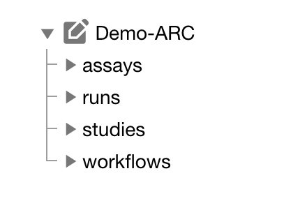

### Add details about your investigation

Click on your ARC's name to add details, such as

- a title
- a description

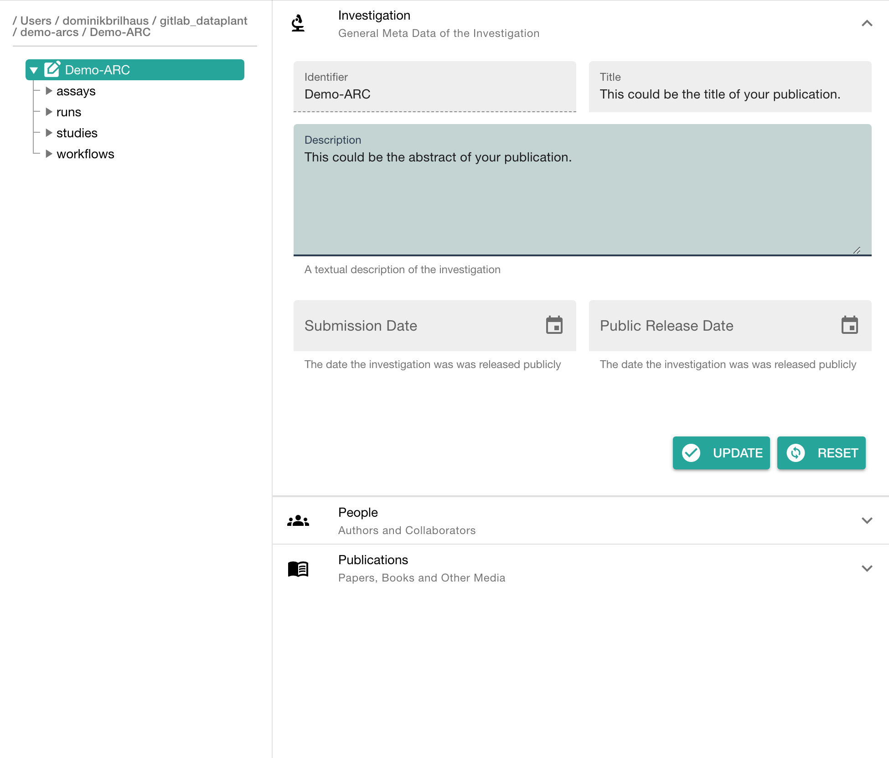

### Add contributors

In the section "People" click "ADD PERSON" to add at least one contributor

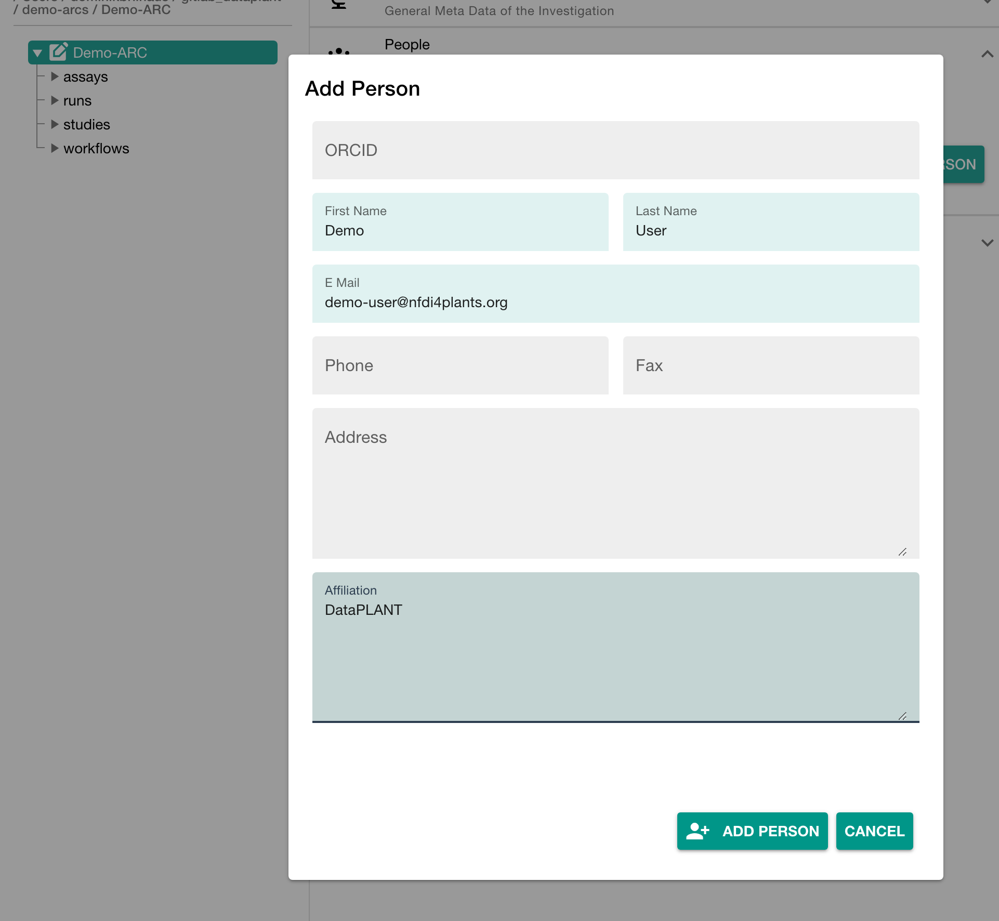

## Add a study to your ARC

Click "Add Study" in the sidebar and enter an identifier

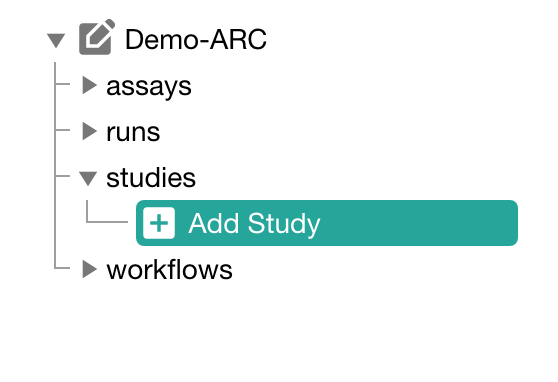

### Add details about your study

Click on your study's name to add details, such as

- general metadata,
- people,
- publications and
- factors

Here you can also link different assays to your study.

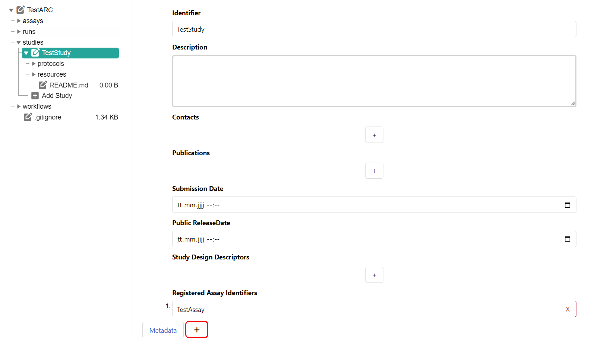

### Add an annotation table to your study

To add detailed metadata on your study, you can create an additional table sheet and create an annotation table. For this, click the plus symbol next to "Metadata" at the bottom of your window. The tool [Swate](https://nfdi4plants.org/nfdi4plants.knowledgebase/docs/implementation/Swate.html) is integrated into ARCitect and will automatically be used, when creating an annotation table. Please check the [Swate Quickstart](https://nfdi4plants.org/nfdi4plants.knowledgebase/docs/guides/swate_QuickStart.html) and the [Swate Manual](https://nfdi4plants.org/nfdi4plants.knowledgebase/docs/SwateManual/index.html) for detailed information and guides.

### Add a protocol to your study

Click "Add Protocol" in the sidebar to add a protocol to your study

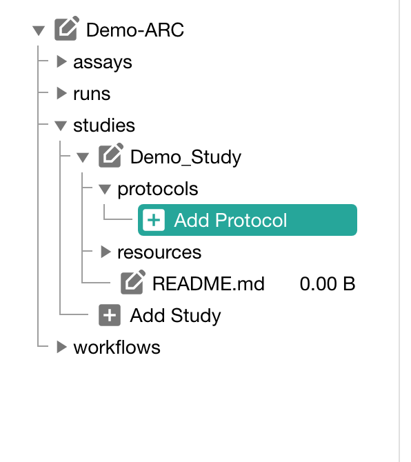

### Adding protocols

You can either

- directly write a **new protocol** within the ARCitect or
- **import** an existing one from your computer

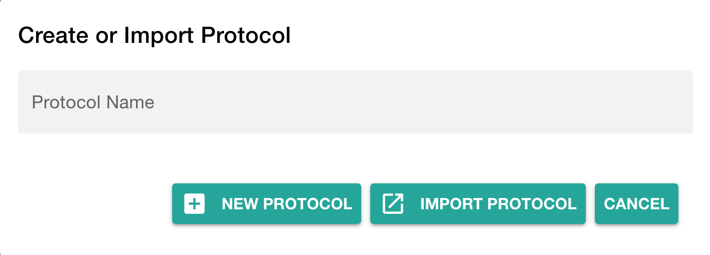

## Add an assay to your ARC

Click "Add Assay" in the sidebar and enter an identifier

### Link your assay to a study

You can either

- link your new assay to an existing study in your ARC or
- create a new one (with the same name as the assay)

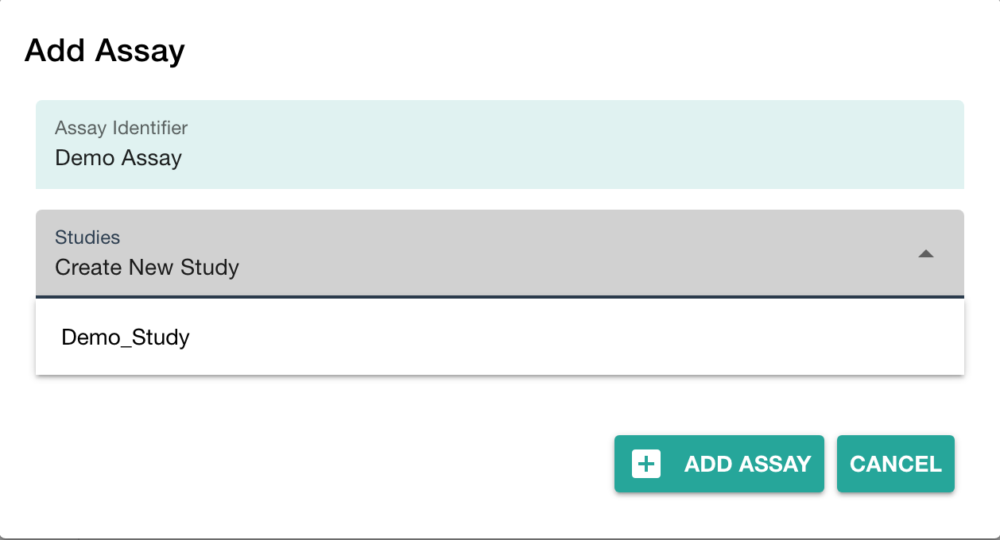

### Add information about your assay

In the assay panel you can define the assay's

- measurement type,
- technology type and
- technology platform.

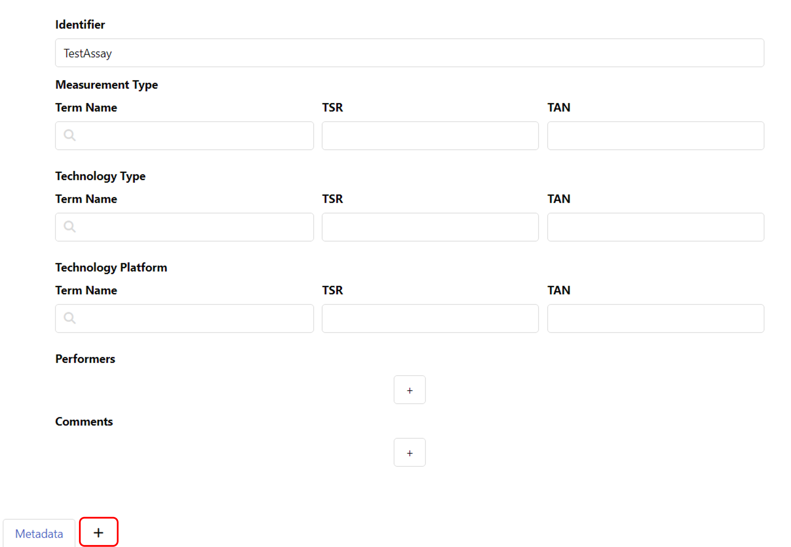

### Add an annotation table to your assay

To add detailed metadata about your assay, you can create an additional table sheet and add an annotation table. For this, click the plus symbol next to "Metadata" at the bottom of your window. You can find guides on creating and filling annotation tables in the [Swate Quickstart](https://nfdi4plants.org/nfdi4plants.knowledgebase/docs/guides/swate_QuickStart.html) and the [Swate Manual](https://nfdi4plants.org/nfdi4plants.knowledgebase/docs/SwateManual/index.html).

### Add protocols and datasets to your assay

In the file tree you can

- **add a dataset** and
- **protocols** associated to that dataset.

:bulb: **Add Dataset** allows to import data from any location on your computer into the ARC.  

:warning: Depending on the file size, this may take a while. Test this with a small batch of files first.

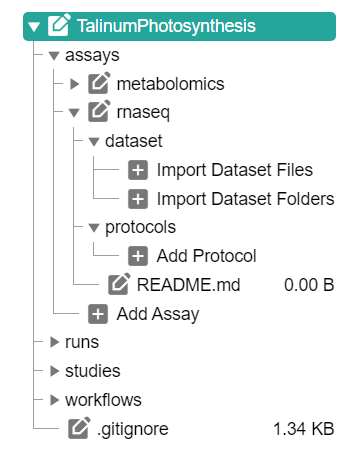

## Share your ARC

Click **Login** (1) in the sidebar to login to the DataHUB.

:bulb: This automatically opens your browser at the DataHUB (<https://git.nfdi4plants.org>) and asks you to login, if you are not already logged in.

### Versions: Connection to the DataHUB

To communicate with the DataHUB, navigate to **Versions** (6)

### Connection to the DataHUB

If you are logged in, the versions panel shows

- your DataHUB's *Full Name* and *eMail*
- the URL of the current ARC in the DataHUB  
`https://git.nfdi4plants.org/<YourUserName>/<YourARC>`

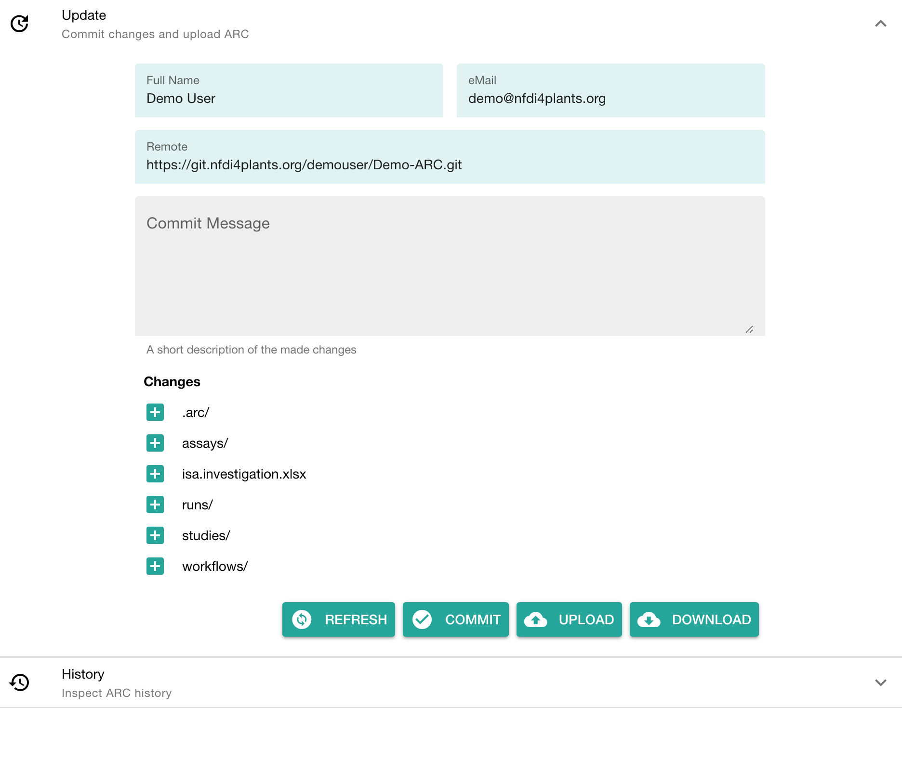

### Upload your ARC to the DataHUB

The versions panel allows you to

- store the local changes to your ARC in form of "commits",
- sync the changes to the DataHUB, and
- check the history of your ARC

To upload your ARC:

1. Enter a "commit message" to shortly describe the changes to your ARC
2. Click COMMIT to save your changes locally
3. Click UPLOAD to upload your ARC to the DataHUB

### Check if your ARC is successfully uploaded

1. [sign in](https://git.nfdi4plants.org) to the DataHUB
2. Check your projects
