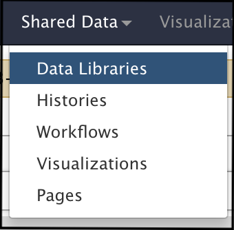
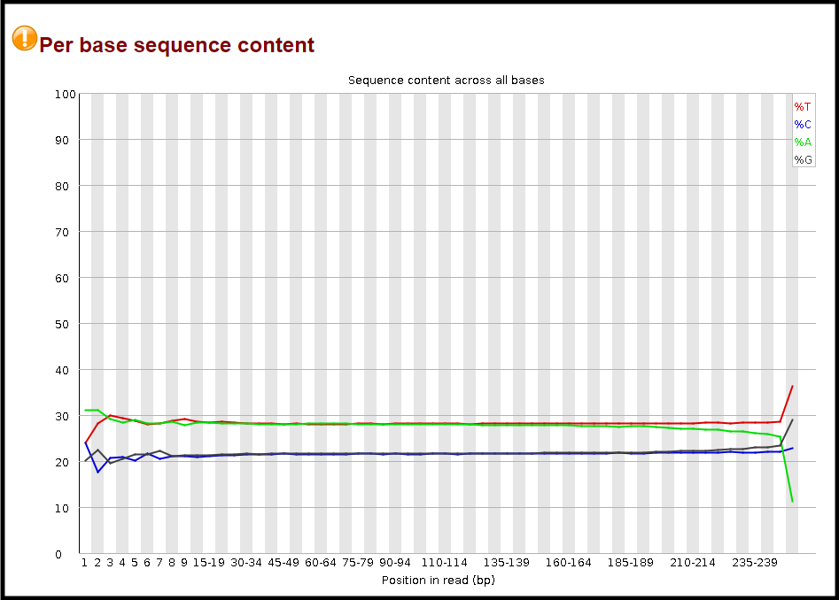
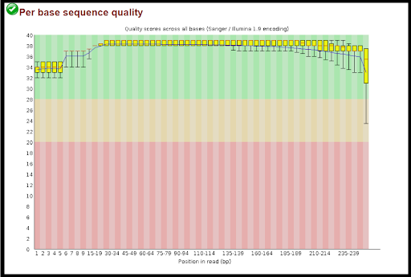
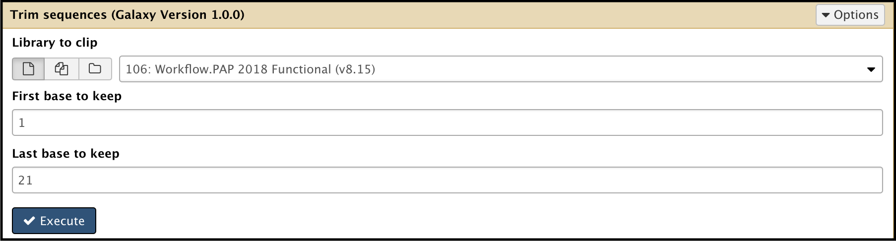
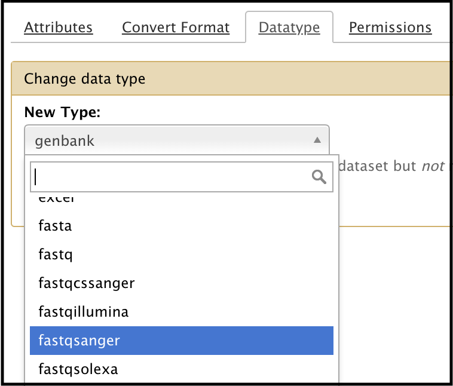
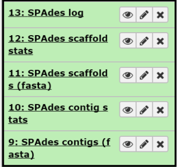
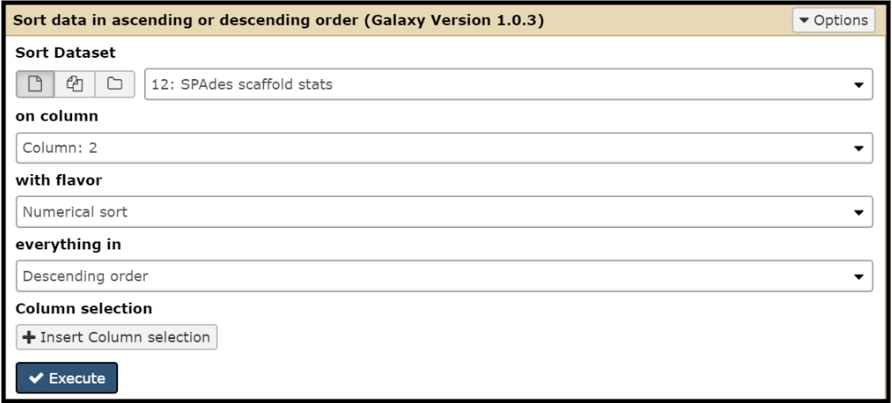
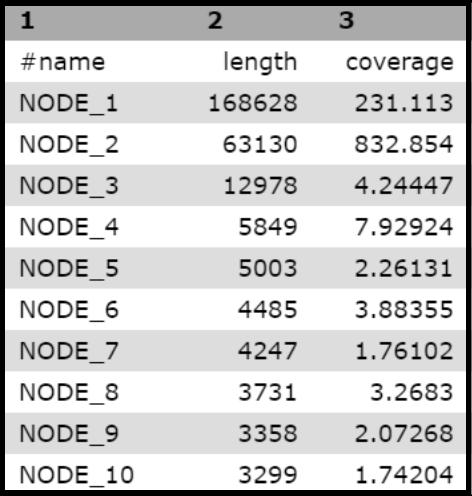
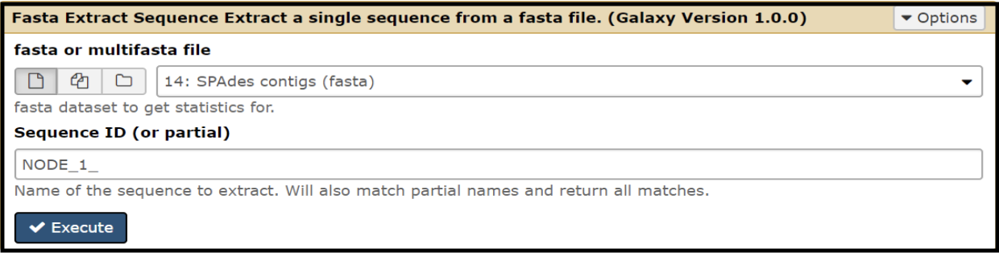
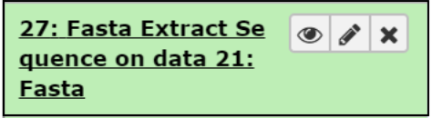

# Introduction

The CPT conducts routine phage genome sequencing runs using Illumina sequencing for our research. In this tutorial users will learn how to process the Illumina short reads sequences and assemble phage genomes. This starts from retrieving the raw read data stored in the CPT share data libraries into the CPT Galaxy, trimming those reads, and proceeds through assembly with SPAdes and initial analysis of the contig.

> ### Agenda
>
> 1. Import Sequencing Data into a New History in Galaxy
> 2. Running the Quality Control Report and Trimming the Reads
> 3. Assemble the Contig Using SPAdes
> 4. Preliminary Analysis
> {:toc}
>
{: .agenda}

# Import Sequencing Data into a New History in Galaxy

The CPT researcher performing the sequencing runs will upload the sequence reads data from Illumina BaseSpace into a shared data library in Galaxy.  The researcher performing the genome assembly will need to retrieve the sequence reads data from the shared data library into a new Galaxy history before conducting assembly. 

> ### 
> 1. Under the "Shared Data" drop-down menu at the top of the Galaxy home page, click on "Data Libraries".
>
> 
>
> 2. Click on "CPT Sequencing." On that page, the different sequencing runs are sorted by Year-Month.
>
> 3. Select the folder that contains your sequence data, identify which index contains the R1 and R2 reads (the forward and reverse reads, respectively) you need to assemble. Your data file should be a .fastq, fastqsanger, or .fastqsolexa/equivalent.
>
> 4. Impot your sequence reads data into a history.  This can be done by clicking the "to History" button at the top of the current index. You have the option of either transfering to an existing history or creating a new history.  If there are multiple samples across multiple indexes, it is a good practice to make sure each index gets its own history. 
>
> 
>
> 5. Once the data has been imported and it is ready to assemble, return to the Galaxy Homepage where all the tools can be accessed.
{: .hands_on}

# Running the Quality Control Report and Trimming the Reads

To learn about the quality control analysis (FASTQC), read the [FastQC Manual](http://bficores.colorado.edu/biofrontiers-core-facility-workshops/workshops-in-the-series/short-read-2016-course-materials/day-4-sequencing-qc/day-4-files-2016/fastqc-manual/view) and watch [this quick video](https://www.youtube.com/watch?v=bz93ReOv87Y) that explains each analysis module.

> ###  FastQC to Trimming
> 1. Using the Search bar in the **Tools** column on the left side of the Galaxy interface, search "FastQC." Find the *FastQC Read Quality reports* result.
>
>
> 
> 2. Run the [FastQC tool](https://cpt.tamu.edu/galaxy/root?tool_id=toolshed.g2.bx.psu.edu/repos/devteam/fastqc/fastqc/0.72+galaxy1) on both R1 and R2 reads separately. This tool results in two output entries in the history.
>
> 
>
> 3. Once the tool has run, click the eye  symbol on the resulting dataset under the History column to view the **Webpage** generated (*not* the RawData output).
>
> 4. Identify Trimming Parameters by observing two modules, beginning with the Per Base Sequence Content Module. The lines should be parallel and fairly consistent throughout. Take note of the base # where the lines diverge too much, as these will be the points to trim at. Below is an example in which one might trim after base 245.
>
> 
>
> 5. The second module to analyze is the Per base Sequence Quality Module. Ideally, the quality score for reads that are trimmed will remain high (at least above 20). To better understand what is and isn't a good quality score, watch [this short video.](https://www.youtube.com/watch?v=bz93ReOv87Y) Below is an example of a good report where the first 20 bases and the bases after 250 might be trimmed.
>
> 
>
> 6. Using the Galaxy [Trim sequences](https://cpt.tamu.edu/galaxy/root?tool_id=toolshed.g2.bx.psu.edu/repos/devteam/fastx_trimmer/cshl_fastx_trimmer/1.0.0) tool, set the base parameters, and execute for both R1 and R2.
>
> 
>
> 
>
>    > ###  Note that...
>    > The Trim sequences tool cannot use a .fastq file as input. If the data is in the .fastq format, it can be converted into the appropriate format in Galaxy. Under the history entry containing the .fastq file, find the dataset for the .fastq file, and click the  icon (**Edit Attributes**). When the attributes appear in the center panel, select "Datatype" at the top. Use the drop-down menu to select .fastqsanger (or equivalent), then click save.
>    > 
> {: .comment}
{: .hands_on}

# Assemble the Contig Using SPAdes

Search for SPAdes in the search bar underneath the Tools column on the left side of the Galaxy interface.

Selecting the Galaxy [spades tool](https://cpt.tamu.edu/galaxy/root?tool_id=toolshed.g2.bx.psu.edu/repos/lionelguy/spades/spades/1.0) and adjust the following parameters:

1. K-mers
> * All values must be *odd*, less than 128, listed in *ascending* order, and *smaller* than the read length.
> * Smaller values = more stringent (less contigs assembled, more accurate contigs)
> * Larger values = less stringent (more possible contigs, possible error in assembly)

2. Library type is **Paired-end/Single** reads

3. File format: can use one or both of the reads sets

**Unpaired/Single reads** assembly can be run using trimmed forward (R1) *or* reverse (R2) reads.

**Separate input files** assembly uses *both* forward and reverse reads and it usually gives the best output, assuming both reads data show good QC reports.

> ###  Note that...
> Single SPAdes run using one type of setting does not always yield the best output. It is recommended that muiltiple instances of spades assembly using different settings (different choices for K-mer values and data inputs) are carried out to compare the results.
{: .comment}

Once all of the parameters have been set, **execute** the spades tool by clicking the Execute button at the bottom of the tool. This could take up to a few hours; however, multiple spades assemblies can be run at once. 

After the tools have finished running, there will be 5 outputs from each SPAdes run in the history column.

The contigs from each SPAdes iteration can be organized based on size by running the [Sort tool.](https://cpt.tamu.edu/galaxy/root?tool_id=sort1)

Choosing "Spades scaffold stats" as the **Sort Dataset** option and "Column: 2" for **on column** will yield an outcome that looks something like this:

> ###  Note that...
> "SPAdes scaffold stats" and "SPAdes contig stats" should have very similar sorting results, though there can be a few differences between the two. If there is trouble finding a contig using one dataset, try checking the other dataset.
{: .comment}

> ###  What to Look For
> * Most of the time, there is a general idea of the expected size of the genome that has been sequenced, based on restriction digest or Pulse Field Gel Electrophoresis results. Look for contigs in that size range.
>
> * Look for contigs with a coverage much higher than the rest of the list. Often contigs with much higher coverage than the rest of the list represent the desired sequence.
> 
> * Look for contigs that are the same size in the assembly that came out of using R1 alone, R2 alone, and both R1 and R2 together
>
> * If unsure, extract a few candidate nodes and try BLAST them as outlined below.
>
> * In the end, the contig can only definitely be assigned to a specific sample (and shown that it is complete) after a confirmation PCR is attempted, and the genome is closed using PCR/Sanger sequencing. [Tutorial on Genome closure and re-opening](https://cpt.tamu.edu/training-material/topics/de-novo-assembly/tutorials/genome-close-reopen/tutorial.html).
{: . tip}

To extract the contig of interest from the assemled contig pool, run the [**Fasta Extract Sequence** tool](https://cpt.tamu.edu/galaxy/root?tool_id=toolshed.g2.bx.psu.edu/repos/simon-gladman/fasta_extract/fa-extract-sequence/1.0.0) and define the contig (node) of interest; this pulls out the FASTA file associated with the specific node.

Choose "SPAdes contigs (fasta)" as the data file. Under "Sequence ID (or partial)," type in the node you want to extract. **Be sure to type in an underscore after the node number!** Example: NODE_21_. If the underscore is left out, it will extract *the wrong node*

# Preliminary analysis

Now, [BLAST](https://blast.ncbi.nlm.nih.gov/Blast.cgi?PROGRAM=blastn&PAGE_TYPE=BlastSearch&LINK_LOC=blasthome) that contig sequence! The will help identify which genome from the index this sequence is most likely associated with (ideally, do PCR confirmations to be 100% sure).

> * Use BLASTn + megablast, as it will yield the most closely related organisms. For a broader net, choose a different algorithm.
>    > * Doing the analysis on the home BLAST website will give a quick answer, but this is not a result that can be saved. To save a record for later reference, doing BLAST in Galaxy is recommended.
> * Doing the BLAST in Galaxy will yield a permanent link that can be stored for reference. Choose the output as BLAST XML (later, the [blast2html tool** tool](https://cpt.tamu.edu/galaxy/root?tool_id=toolshed.g2.bx.psu.edu/repos/simon-gladman/fasta_extract/fa-extract-sequence/1.0.0) must be used to convert to html) or html. After the result is ready, right-click on the eye  icon and choose "open in a new tab." The hyperlink can be copied and subsequently shared with other researchers or pasted into a tracking sheet where confirmation and closure information is compiled.

Extracted sequences appear in the history as such:

> 1. First, click on the pencil  icon to bring upon the attributes of that dataset. Rename the dataset by editing the "Name" section of the attributes, and then select "Save." Example name: NODE_X:RawName ("raw" because this is the raw, unclosed contig).

> 2. Next, rename it using the ["Fasta Sequence Renamer" tool.](https://cpt.tamu.edu/galaxy/root?tool_id=edu.tamu.cpt.fasta.rename) Do NOT put "raw" in this name, because this is the identifier that Galaxy will use to identify the contig, no matter how it is edited. This changes the header in the FASTA file on the first line after the >

Another preliminary analysis you do is to run the [PhageTerm tool](https://cpt.tamu.edu/galaxy/root?tool_id=PhageTerm) to generate a report that suggests the type of genome ends.

> * Choose the input files based on which dataset gave the contig for the phage genome. For the FASTQ **mandatory input** use the better set (usually R1). For the **optional input**, use the other dataset (usually R2).
> * Name the output file with the phage name.
> * Execute.
> * When complete, open the output called report.

> ###  More Information
> * After the raw contig is assembled, the end sequences of the contig need to be verified and completed by PCR.  This is a process called genome closure. A protocol for genome closure is [here](https://cpt.tamu.edu/training-material/topics/de-novo-assembly/tutorials/genome-close-reopen/tutorial.html).
{: .tip}

