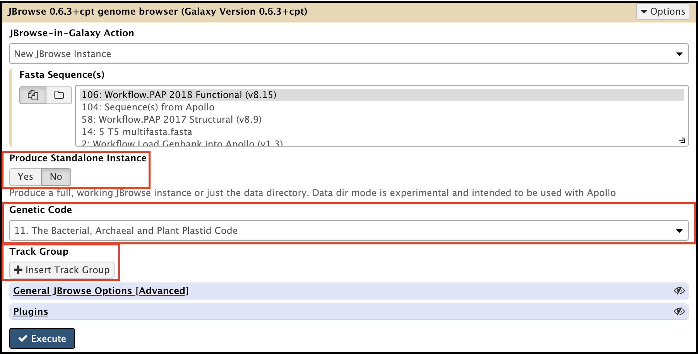
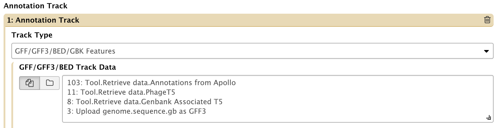
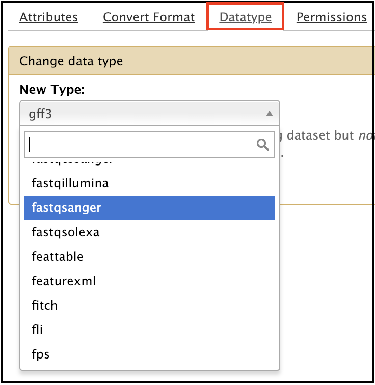
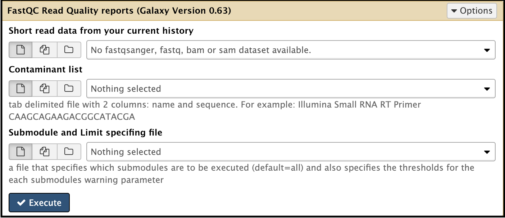
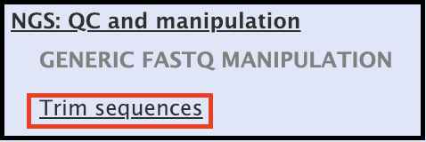
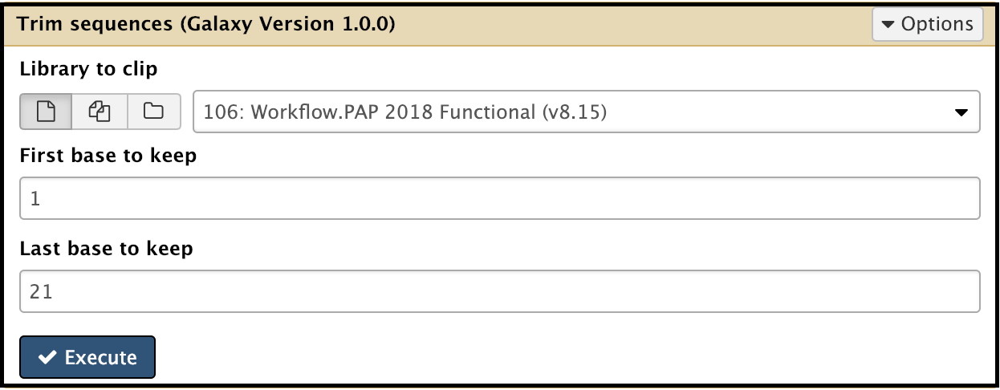
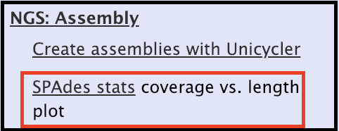
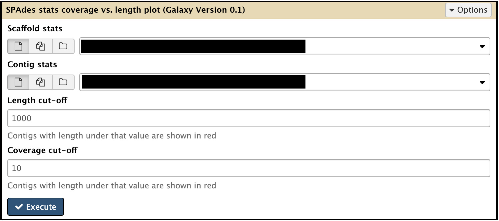
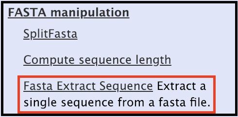

# Genome Closure from a Sequencing Run & Re-opening

> ### Agenda
>
> 1. Genome Closure
>    > * Confirmation PCR
>    > * Closure PCR
>    >    > * Background
>    > * Trimming
>    > * Re-naming
>
> 2. Contig Re-opening
>    > * Deciding Where to Re-open
>    >    > * BLASTn Analysis
>    >    > * PhageTerm Analysis
>    > * Re-opening in Galaxy
> {:toc}
>
{: .agenda}

# Genome Closure

======

## Confirmation PCR

### Primer design and reaction conditions

Open the sequencing results node for your genome and copy/paste it into a word processor.

Create there confirmation primers using the [IDT PrimerQuest Tool.](https://www.idtdna.com/Primerquest/Home/Index) Under the Tools drop-down menu, open the "Show Custom Design Parameters" tab.

Enter the following parameters:

*General*
> * Set Design Parameters for... **General PCR (primers only)**

*Results*
> * Results to Return - **50**

*Reaction Conditions*
> * Monovalent Salt (Na+)(mM) - **50**
> * Primer DNA Conc (nM) - **250**
> * Divalent Salt (Mg++)(mM) - **0**
> * dNTP Conc (mM) - **10**

*Primer Details*
> * Primer Tm (Celcius) - **Min = 54, Opt = 55, Max = 56**

*Amplicon Details*
> * Amplicon Size (bp) - **Opt = 500**

Copy sequence from the middle of the genome and paste it into the "Paste Sequence(s) here" textbox in the primer design tool and press the "Get Assays" button at there bottom of the screen.

When primers are received, then spin them down and prepare a solution with a final concentration of 100 mM (1 mol = 10 μL H20). Dilute to prepare a 10 mM working stock. A 25 μL PCR reaction consists of:

> * 12.5 μL Azura Taq 2x Mix (*keep on ice!*)
> * 9.5 μL H20
> * 1 μL of 10 mM forward primer
> * 1 μL of 10 mM reverse primer
> * 1 μL of genome DNA

The reaction conditions are as follows:

To visualize the PCR product, prepare a 1% agarose gel containing a visualizing agent (such as ethidium bromide or sybr safe). Mix 6x loading dye with the PCR product at the appropriate concentrations (5 μL of product with 1 μL of loading dye works well). Also, load a 100 bp ladder and perform electrophoresis set to a constant 100 V for approximately 45 minutes.

Image the gel and record the results (regardless if an amplicon is present or not) and save the result. If a confirmation product is identified, proceed to the closure PCR step.

> ###  Note for CPT Technicians
> Upload the annotated images to the appropriate Google Drive folder.
{: .comment}

### Closure PCR Primer Design and Reaction Conditions

Open the sequencing results node for your genome and copy/paste it into a word processor.

Create there confirmation primers using the [IDT PrimerQuest Tool.](https://www.idtdna.com/Primerquest/Home/Index) Under the Tools drop-down menu, open the "Show Custom Design Parameters" tab.

Enter the following parameters:

*General*
> * Set Design Parameters for... **General PCR (primers only)**

*Results*
> * Results to Return - **50**

*Reaction Conditions*
> * Monovalent Salt (Na+)(mM) - **50**
> * Primer DNA Conc (nM) - **250**
> * Divalent Salt (Mg++)(mM) - **0**
> * dNTP Conc (mM) - **10**

*Primer Details*
> * Primer Tm (Celcius) - **Min = 54, Opt = 55, Max = 56**

*Amplicon Details*
> * Amplicon Size (bp) - **Opt = 600**

From the genome saved in the word processor, copy and past approximately the last 500 bases from the 3' end and paste it into the "Paste Sequence(s) here" textbox. Then, copy approximately the first 500 bases from the 5' end and paste it below the earlier sequence (closure PCR should span from the 3' to the 5' end; using this process may be easier than finding individual primers). Press the "get Assays" button at the bottom of the screen.

### Background: Close the Assembled Contigs

Both T1 and T4-like phages do pac type packaging and, thus, are circularly per muted, so PCR closure should work; this means one should get a closure PCR product which will be sequenced to make sure no bases are missing at the random breakpoint.

T7-like phages are *not* permuted, but have short definite terminal direct repeats (similarly, T5-like phages have long terminal repeats (TR)). The assembler will collapse the two repeats so that there will be a random opening, as if it was pac type. Unless something unlucky occurs and the contig is opened by the assembler at or near the actual terminal repeats, the PCR closure should work.

Cos type phages have physical ends. The end sequence will need to be determined experimentally via direct sequencing (sequencing of the end using genomic DNA as the template), and/or ligation of the genomic DNA then sequencing the ligated region.

> ###  Further Reading
> A useful reading reference can be found here: https://bmcgenomics.biomedcentral.com/articles/10.1186/s12864-016-3018-2
{: .tip}

# Re-opening

### Background: Re-opening the Contigs

After the contigs are closed, the closed contigs should be re-opened properly according to their genome types. Without annotating and analyzing the entire genome, the genome type of a given contig could be predicted by running:

> 1. BLASTn against NCBI database, and
> 2. PhageTerm (a software using raw ends of a phage sequenced via a sequencing technology using random fragmentation and its genomic reference sequence to determine the termini position.

> ###  Note that...
> A prediction of genome type using BLASTn and/or PhageTerm is **not always** successful and accurate.
{: .comment}

**T4-like genomes** are from pac type phages, and there is no actual start site of the genome. They should be re-opened following the T4 genome, meaning re-open in between rIIA and rIIB (with rIIA being the first gene on the minus strand).

**T5-like genomes** have long TR. If PhageTerm does not predict the TR boundary, open the genome following the T5 genomes, right in front of dmp, followed by A1, A2. Long TR should be associated with the long non-coding region typically present in these types of genomes.

**T3/T7-like genomes** have short TR. If PhageTerm gives a prediction of TR boundaries, re-open at the TR boundary site. If PhageTerm does *not* give a TR prediction, follow the T7 genome (RNA polymerase being in the beginning of the genome, DNA maturation protein in the end of the genome, and a non-coding region in between. Additionally, search T7 TR sequence in your genome (if the two genome are close enough); *mostly*, the TR sequence will be found in the non-coding region close to RNA polymerase.

**T1/TLS-like genomes** are pac type phages thus, just like T4, there is no actual start site of the genome. Since the T1 genome is annotated backwards, the TLS annotation should be followed for re-opening: open at the first logical transcription breakpoint upstream of TerS and TerL, with TerS/TerL in the middle of the genome. The breakpoint is between two groups of genes transcribed in two opposite directions, upstream genes transcribed in the same direction as TerS and TerL, and TerS and TerL should be on the plus strand.

For all other genomes of unknown phage type leading to an unawareness of what to do next, open in front of TerL (or TerS, if it can be identified).

### Phage Annotation Pipeline

> ###  Using Workflows
> The detailed protocol of using workflows can be seen [here.](https://docs.google.com/document/d/1AoBG2qZ0EFbvvMCztG1hlIJzBgDLDUhukPS1iCYbDGc/edit)
> **_Note:_** As of January 4, 2019, this is *not* the most up-to-date protocol, and will be replaced with new GTN format documentation soon.
{: .tip}

### Edit and re-opening the existing annotated Apollo record

Before beginning anything, pick a new name for the organism and give everything in this workflow the same name; E.G. if the original phage was "Lambda," name the new phage "Lambda.v2" or "Lambda_reopen," and everything it requests a name, use the same one. The new name *cannot* have any spaces in it. For example, "Lambda 2" would not work.

Import data from Apollo into Galaxy using the [Retrieve Data](https://cpt.tamu.edu/galaxy/root?tool_id=edu.tamu.cpt2.webapollo.export) tool. Then, use the [Genome Editor](https://cpt.tamu.edu/galaxy/root?tool_id=edu.tamu.cpt.gff3.genome_editor) tool in Galaxy to concatenate the genome appropriately by deleting the unnecessary sequence and re-opening at the appropriate position. Evidence tracks and any annotation that is split by re-opening **will be lost.** After the organism is re-opened, it will need to be re-uploaded into Apollo. In order to do this, first use the [JBrowse 0.6.3+cpt](https://cpt.tamu.edu/galaxy/root?tool_id=jbrowse-cpt) tool with the new FASTA file. Set up the parameters for this tool as such:

> * *No* for the "Standalone Instance," and *11. Bacterial Code* for "Genetic Code." Then, click the *"Insert Track Group"* button.

> * Click the *"Insert Annotation Track,"* then point the tool to the reopened GFF3.

Following this, run the [Create or Update Organism](https://cpt.tamu.edu/galaxy/root?tool_id=edu.tamu.cpt2.webapollo.create_or_update) tool, using the *"Direct Entry"* option and indicating the new name of the organism.

> ###  Tool Failure
> If the **Create or Update Organism** tool (or any other tool) does not run correctly, e-mail [Cory](cory.maughmer@tamu.edu). Indicate that the tool failed and that access to the new organism (whatever it was named) is needed; Cory will give you access.
{: .tip}

Then, run the [GFF3 to Apollo Annotations](https://cpt.tamu.edu/galaxy/root?tool_id=edu.tamu.cpt2.webapollo.feat_from_gff3) tool to move the GFF3 to the new organism. This should upload the reopened organism into Apollo.

### Generate Apollo Records for Genbank Genomes

Click on the pencil  icon of the dataset and change the datatype of the uploaded reads to fastqsanger.

Run the [FastQC](https://cpt.tamu.edu/galaxy/root?tool_id=toolshed.g2.bx.psu.edu/repos/devteam/fastqc/fastqc/0.63) tool on the raw data to view the quality of the sequence.

Trim the sequence using the [Trim sequences](https://cpt.tamu.edu/galaxy/root?tool_id=toolshed.g2.bx.psu.edu/repos/devteam/fastx_trimmer/cshl_fastx_trimmer/1.0.0) tool under "NGS: QC and manipulation." Typically, the first 15-20 bases and last 10-20 bases are trimmed.

Search for and run the [Spades](https://cpt.tamu.edu/galaxy/root?tool_id=toolshed.g2.bx.psu.edu/repos/lionelguy/spades/spades/1.0) tool to assemble contigs using either trimmed single reads (usually R1) or trimmed paired reads (R1 and R2). Set the K-mer value to be 21,33,55 as the default, or other values of  choice.

After the assembly is finished, find the [SPAdes stats](https://cpt.tamu.edu/galaxy/root?tool_id=toolshed.g2.bx.psu.edu/repos/lionelguy/spades/plot_spades_stats/0.1) tool. Use this to sort the dataset via **Spades scaffold stats** or *Spades contig stats** based on column 2 (contig length) following descending order. Then, examine the sorted contig list to see if all the contigs are assembled correctly based on the sequencing sample input in a given index.

Extract the FASTA sequences of the assembled contigs using [Fasta Extract Sequence](https://cpt.tamu.edu/galaxy/root?tool_id=toolshed.g2.bx.psu.edu/repos/simon-gladman/fasta_extract/fa-extract-sequence/1.0.0) tool under **Fasta Manipulation**. Underneath **Sequence ID,** type in "NODE _X_." The extracted fasta sequences will be the assembled contigs.

