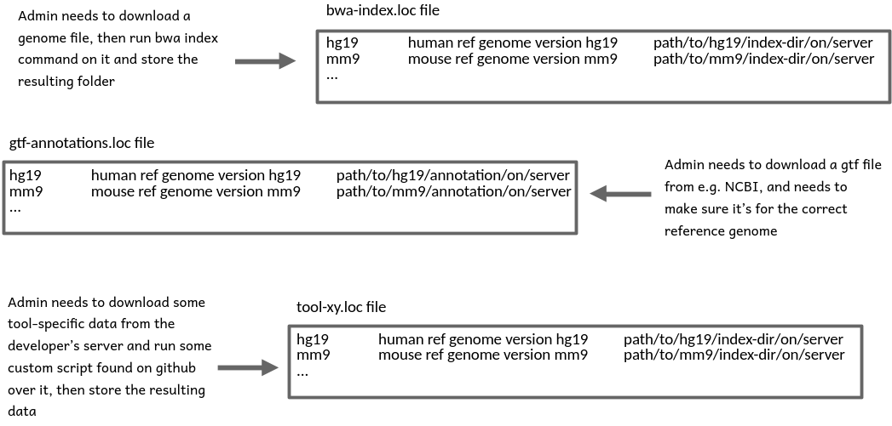
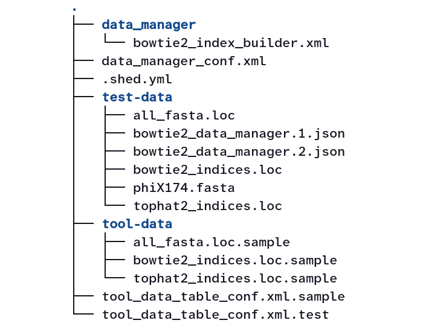

# What are data managers and why are they needed?

Many tools run with two kinds of input data: some experimental data specific to
the tool run (like, e.g., sequencing data) and another dataset, which stays the
same across a range of different tool runs (e.g. a reference genome, or some
genome annotations that are the same across runs for the same organism).

Forcing users to provide that second type of data for every tool run is undesireable
because:

- some of that data is complicated to gather from public sources or needs some pre-processing
- it leads to unnecessary copies of data that would better be reused across user accounts

One possible solution (which was actually used in the early days of Galaxy) is to have
Galaxy server admins collect and prepare commonly used data, store it on the server and
record the location in a so-called .loc file.

Tools can then declare select parameters that are populated with the records of specific .loc files,
can access the paths stored in them and, at tool run time, retrieve the data cached on the server.

While this is user-friendly, it shifts the burden of making cached data available to admins.
With more and more tools requiring data of very different formats, this approach becomes increasingly
unmanageable because, for each tool, an admin has to research where to obtain the data,
or how to calculate it, and whether it needs some reformatting or other pre-processing before being usable
by tools.



In principle, admins could automate some of this work through scripts, but it would be nice to not have each admin reinvent the wheel.

## The idea of data managers

Just like admin-installed data found via .loc files frees the *user* from having to care about all the details of how to obtain the data,
special tools, ideally written by people who know how to obtain and set up certain types of data, should automate data collection and preparation, and the writing of .loc file records, and make life easier for *admins*.
In other words, admins become users themselves, don't have to know all the details, but just run a tool that "knows" how to install a certain type of data on the server.

> <comment-title>Reference document</comment-title>
>
> This tutorial is an attempt to describe the different parts and functions of data managers in
> a way that is structured as logically as possible.
>
> An in-depth, technical explanation of this matter is provided at
> <https://docs.galaxyproject.org/en/latest/dev/data_managers.html>
> and, when in doubt, that material should be considered the reference document
> for data managers.
>
{: .comment}

> <agenda-title></agenda-title>
>
> In this tutorial, we will cover:
>
> 1. TOC
> {:toc}
>
{: .agenda}

# Components of a data manager

Here you see a tree view of the files that together constitute the widely used [bowtie2 data manager](https://github.com/galaxyproject/tools-iuc/tree/main/data_managers/data_manager_bowtie2_index_builder):

{:max-width="70%"}

Lets look at these components one-by-one:

1. There's a `data_manager` subfolder with the actual Data Manager **Tool** defined through a familiar tool xml file.

   This is what the admin is interacting with when installing new data (bowtie2 indices in this case).

2. In the root folder of the data manager, there is a **Data Manager Configuration** file.

   This file is always named `data_manager_conf.xml`. It declares, which .loc files the data manager will write to, defines how the output of the Data Manager Tool is to be translated into .loc file records, and where exactly Galaxy should store the data downloaded by the Data Manager Tool.

   When talking about Data Managers, their .loc files are called Data Tables.

3. A `.shed.yml` file that serves the same purpose (of declaring metadata for the Galaxy toolshed) as for regular tools.

   We will not discuss the contents of this file any further here.

4. A `test-data` folder with, you may guess it, data for testing the data manager.

   We will discuss testing data managers at the end of the tutorial.

5. A `tool-data` folder

   Here, tools can provide samples of the .loc files they are going to work with.

   In these .loc.sample files, tools can already define records that can point to data
   directly *shipping* with the tool, which would then also be stored in the `tool-data`
   folder (hence its name). Most tools and data managers do not ship data directly and
   provide "empty" .loc.sample files that have only comment lines describing the .loc file
   purpose.

   Data manager tools can both write to Data Tables and use other Data Tables as a source for populating select boxes in their tool interface,
   and there will be one (possibly empty) .loc.sample file for each of them.
   For example, the bowtie2 data manager lets the admin select the reference genome to build an index for
   from the list of installed genomes recorded in the `all_fasta` data table, and the index it builds is useful
   for both bowtie2 and tophat2 so the path to the installed index will get recorded in the corresponding two data tables.

6. A Data table configuration file

   This file is always named `tool_data_table_conf.xml.sample` and provides the *layout* information for all Data tables the Data manager operates on and uses.

   For the bowtie2 data manager, this file has the following content:

   ```
   <tables>
       <!-- Locations of all fasta files under genome directory -->
       <table name="all_fasta" comment_char="#">
           <columns>value, dbkey, name, path</columns>
           <file path="tool-data/all_fasta.loc" />
       </table>
       <!-- Locations of indexes in the Bowtie2 mapper format -->
       <table name="bowtie2_indexes" comment_char="#">
           <columns>value, dbkey, name, path</columns>
           <file path="tool-data/bowtie2_indices.loc" />
       </table>
       <!-- Locations of indexes in the Bowtie2 mapper format for TopHat2 to use -->
       <table name="tophat2_indexes" comment_char="#">
           <columns>value, dbkey, name, path</columns>
           <file path="tool-data/tophat2_indices.loc" />
       </table>
   </tables>
   ```

   The Data tables mentioned here are the same as the ones the `tool-data` folder has .loc.sample files for,
   but here we find the metadata for these tables, i.e. their name and .loc file name (which *could*,
   but probably shouldn't be different) and the identifiers for the different columns in each table.

7. A Data table configuration test file

   This file is always named `tool_data_table_conf.xml.test`, is very similar to the `tool_data_table_conf.xml.sample`,
   but exists only for testing purposes, which, again, will be discussed at the end of the tutorial.

# How are Data managers different from regular tools?

1. (Normally) only admins can run them through the Admin interface of Galaxy

2. They do create an output dataset in your history,
   but their **"side-effects"** are what really matters. As such side-effects
   data managers will:

   - typically, download or compute some data and tell Galaxy to store it
     in a special cached data folder somewhere
   - always instruct Galaxy to write at least one line of tab-separated info to
     at least one Data Table file
   - if data was downloaded or computed, instruct Galaxy to

     - move the data to a permanent storage location for cached data
     - record the path to that final data location in the newly created Data Table record

# How does a Data Manager communicate with Galaxy?

1. It declares itself a Data Manager:

   `<tool id="example_dm" name="An example Data manager" version="1.0" tool_type="manage_data" profile="23.0">`

   This has several consequences:

   1. The tool will only appear in the Admin user interface
   2. Galaxy will expect the output of the tool to be of `format="data_manager_json"`
      and its content to describe which columns should be added to new lines in which Data tables.
   3. Galaxy will expect any data downloaded or computed by the tool to live in that output's
      `extra_files_path`

      For example, if the output section of the Data manager looks like this:

      ```
      <outputs>
          <data name="out_file" format="data_manager_json" label="${tool.name}"/>
      </outputs>
      ```
      it should make sure that its command section deposits data to be stored
      by Galaxy in `'$out_file.extra_files_path'`.
   4. The `data_manager_json` output file that the wrapper declares will exist
      **before** the command section runs and will contain a mapping of the input
      parameters,
      [among other things](https://docs.galaxyproject.org/en/latest/dev/data_managers.html#example-json-input-to-tool).
      You do not have to use the file if you don't want to, but you will have to overwrite it!

   > <comment-title>Minimal profile version for data managers</comment-title>
   >
   > Data managers were executed in Galaxy's main environment until release 18.09!
   >
   > This means:
   >
   > - if you want to use `requirements` in a data manager tool, you should set
   >   `profile="18.09"` or higher
   > - if you are bumping the profile version of an existing data manager to
   >   beyond 18.09, you may have to add requirements to it that bring in things
   >   the old version happened to find in Galaxy's environment.
   >
   {: .comment}

2. In its command section (or in a helper script called from there), the data manager tool

   1. **overwrites** the already existing output file with a json of the items that should be
      added to one or more Data tables.

   2. **creates** the folder at `output.extra_files_path` and deposits any data
      there that Galaxy should move then to a permanent storage location

3. The data manager tool ships with a `data_manager_conf.xml` file,
   which forms the bridge between the `data_manager_json` file that it produces
   as output and the Data table files Galaxy is supposed to add lines to.

   An example config file:

    ```
    <?xml version="1.0"?>
    <data_managers>
      <data_manager tool_file="data_manager/data_manager_cat.xml" id="data_manager_cat" >
        <data_table name="cat_database">  <!-- Defines a Data Table to be modified. -->
          <output> <!-- Handle the output of the Data Manager Tool -->
            <column name="value" /> <!-- columns that are going to be specified by the Data Manager Tool -->
            <column name="name" />  <!-- columns that are going to be specified by the Data Manager Tool -->
            <column name="database_folder" output_ref="out_file" >
              <move type="directory" relativize_symlinks="True">
                <source>${database_folder}</source>
                <target base="${GALAXY_DATA_MANAGER_DATA_PATH}">CAT/${database_folder}</target>
              </move>
              <value_translation>${GALAXY_DATA_MANAGER_DATA_PATH}/CAT/${database_folder}</value_translation>
              <value_translation type="function">abspath</value_translation>
            </column>
            <column name="taxonomy_folder" output_ref="out_file" >
              <move type="directory" relativize_symlinks="True">
                <source>${taxonomy_folder}</source>
                <target base="${GALAXY_DATA_MANAGER_DATA_PATH}">CAT/${taxonomy_folder}</target>
              </move>
              <value_translation>${GALAXY_DATA_MANAGER_DATA_PATH}/CAT/${taxonomy_folder}</value_translation>
              <value_translation type="function">abspath</value_translation>
            </column>
          </output>
        </data_table>
      </data_manager>
    </data_managers>
    ```

   This file declares column names for a single Data table (`cat_database`) that
   Galaxy should add lines to based on the `data_manager_json` file returned by
   the `data_manager_cat` tool, and which might look like this:

   ```
   {'data_tables': {
       'cat_database': [
           {
               'database_folder': '<extra_files_path>/a_CAT_database',
               'name': '<extra_files_path>',
               'taxonomy_folder': '<extra_files_path>/a_taxonomy',
               'value': '<extra_files_path>'
           }
       ]
   }}
   ```

   Here, each innermost dictionary corresponds to one line that Galaxy should
   add to the Data table `cat_database` and the keys in it match the column names
   declared in the `data_manager_conf.xml` file so Galaxy knows which dict value
   it should write into which column of the Data table.

   The example tool downloads data, then extracts it into two folders, `a_CAT_database`
   and `a_taxonomy` under its output's `extra_files_path` folder. The tool wants
   Galaxy to record the `extra_files_path` folder name both in the value column and in the
   name column of the `cat_database` Data table.

   It also wants to store the paths to the extracted `database_folder` and `taxonomy_folder` so that tools that later want to use that data can discover
   it from the corresponding columns of the Data table.

   However, here's the issue:
   The Data manager tool at run time knows only the `extra_files_path`, but not the
   ultimate location that Galaxy will move the data to. This is where the more
   complicated parts of the above `data_manager_conf.xml` file enter the scene:

   ```
   <column name="database_folder" output_ref="out_file" >
       <move type="directory" relativize_symlinks="True">
           <source>${database_folder}</source>
           <target base="${GALAXY_DATA_MANAGER_DATA_PATH}">CAT/${database_folder}</target>
       </move>
       <value_translation>${GALAXY_DATA_MANAGER_DATA_PATH}/CAT/${database_folder}</value_translation>
       <value_translation type="function">abspath</value_translation>
   </column>
   <column name="taxonomy_folder" output_ref="out_file" >
       <move type="directory" relativize_symlinks="True">
           <source>${taxonomy_folder}</source>
           <target base="${GALAXY_DATA_MANAGER_DATA_PATH}">CAT/${taxonomy_folder}</target>
       </move>
       <value_translation>${GALAXY_DATA_MANAGER_DATA_PATH}/CAT/${taxonomy_folder}</value_translation>
       <value_translation type="function">abspath</value_translation>
   </column>
   ```

   The definitions of the `database_folder` column hold two types of instructions for Galaxy:

   1. The `<move>` element says that Galaxy should take (see the `<source>` element) the data that lives where the `${database_folder}` item of the `data_manager_json` output says it lives and move it to a destination `CAT/${database_folder}` under the base path indicated by `${GALAXY_DATA_MANAGER_DATA_PATH}` (which itself is the configured cached data storage path of the Galaxy instance).

   2. The first `<value_translation>` element says that Galaxy should not write the Data manager tool-provided value for `database_folder` directly, but instead first translate it to `${GALAXY_DATA_MANAGER_DATA_PATH}/CAT/${database_folder`. If you compare the resulting string with the `<move>` instructions, you will see that it will now be the same as the ultimate path to the folder after Galaxy has moved it.

      The second `<value_translation>` element simply says that Galaxy should turn the result of the first translation into an absolute path on the system. The result is then the value that will get written into the `database_folder` column of the `cat_database` table.

   The same logic is then used again to move the `taxonomy` folder to its final destination and to obtain the value to write to the corresponding Data table column.

# How to test data manager tools?

Unfortunately, the only automated tests you can run on a data manager tool are the ones available for regular tools, too.

This means that you can test assumptions about the tool's `data_manager_json` output, about the command line formed and the stdout and stderr generated, but you can **not** verify that the data manager framework detects any data in the `extra_files_path` and moves it to the intended location.

For this reason, `planemo serve` is a very important command to use during any work on data managers!

> <comment-title>Getting planemo to work on a data managers</comment-title>
>
> `planemo test` and `planemo serve` work just fine for data managers,
> if you keep in mind that a data manager is more than just the tool xml file.
> If you're following the standard layout of data managers with the tool xml
> file in a subfolder, you need to run planemo from the parent folder to have
> it discover all required files beyond the tool xml, but point it to the tool
> xml to test or serve like, e.g.: `planemo serve data_manager/my_dm.xml`
>
> With `planemo serve` specifically, don't be surprised if the tool doesn't show
> up in the tools panel - it's not supposed to, but it's accessible from the
> Admin interface under *"Local Data"*.
>
{: .comment}

With a correctly written `tool_data_table_conf.xml.test` the Data manager, during testing, will read from and write to the .loc files in its `test-data` folder.
This data is persistent across planemo runs as is the actual installed data, so after testing with `planemo serve`, you can inspect the .loc file records that have been written and check the path recorded there to see if the data has been installed the way you intended.

Before committing the test-data folder you may want to consider clearing the data tables you may have populated in it.

## Testing data managers and their client tools in combination

As said above, `planemo serve` and `planemo test` need to be run from the root folder of the data manager, but it's possible to point planemo to multiple xml files to test and you can use this to test both the data manager tool and a tool using its data table in one session through, e.g.:

`planemo serve data_manager/my_dm.xml ../../tools/my_client_tool.xml`

If you have previously served your data manager in isolation and installed some data, then, because this brings the data manager's test-data folder back into scope, that data will be immediately usable by the client tool.
