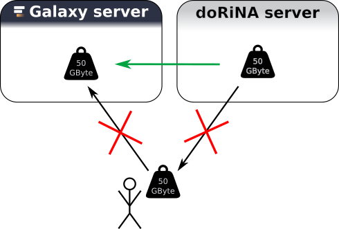

# Data Source Integration

An important goal of Galaxy is scalability. A major bottleneck when it comes to analysis of big data sets is the time and space it takes of copying these data sets.

Galaxy provides an interface such that it can communicate with other servers to get data directly into the Galaxy environment of a user without the need
of "downloading" the data. In this hands on, we will use the resource from [DoRiNA Server](http://dorina.mdc-berlin.de/) ().
but the main point about this short section is:
if you have a data source which you think is very important for your research with Galaxy let us know!

> <hands-on-title>Hands on!</hands-on-title>
>
> 1. Create a new history called "doRiNA"
> 2. Go to Get Data::doRiNA search
> 3. Choose hg19 from the drop-down list -> Search Database
> 4. Leave everything as is and choose from the Regulators (set A) drop-down list "hsa-let-7astar-CLASH" -> Search doRiNA
> 5. Use the "Send to Galaxy" button
> 6. Notice the new History Item
{: .hands_on}

You can see the [tutorial section ](http://dorina.mdc-berlin.de/tutorials) of the DoRiNA website for more detailed examples. That was very easy for all of you! If you want your database of choice to be accessible as easy as this **let us know**!
