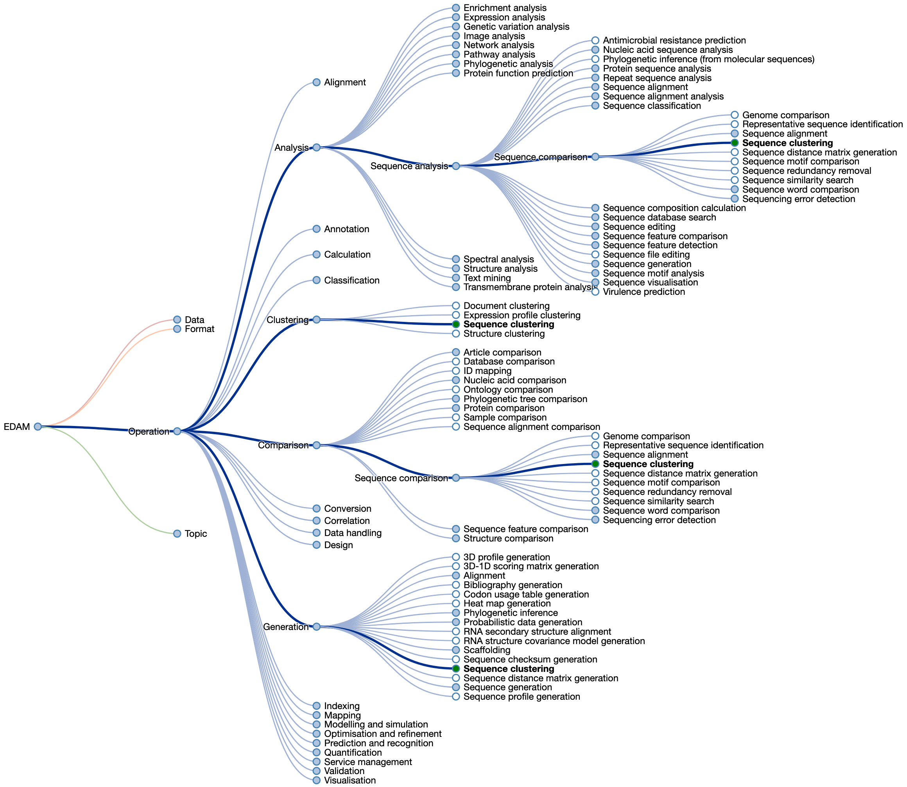

Galaxy offers thousands of tools. Many of these tools either have incomplete metadata or are not yet linked to sources of high-quality metadata such as [bio.tools](https://bio.tools/).

This prevents filtering for all tools in a specific research community or domain, and makes it all but impossible to employ advanced filtering with ontology terms like the ones from EDAM or to group tools based on an ontology to improve the Galaxy tool panel.

[EDAM](https://edamontology.org/page) () is a comprehensive ontology of well-established, familiar concepts that are prevalent within bioscientific data analysis and data management. It includes 4 main sections of concepts (sub-ontologies):

- **Topic**:  A category denoting a rather broad domain or field of interest, of study, application, work, data, or technology. Topics have no clearly defined borders between each other.
- **Operation**> A function that processes a set of inputs and results in a set of outputs, or associates arguments (inputs) with values (outputs).
- **Data**: Information, represented in an information artefact (data record) that is "understandable" by dedicated computational tools that can use the data as input or produce it as output.
- **Format**: A defined way or layout of representing and structuring data in a computer file, blob, string, message, or elsewhere.

, and lines indicate types of relations. Source: <a href="https://edamontology.org/page">EDAM website</a>")

The ontology can be navigated using [EDAM Browser](https://edamontology.github.io/edam-browser/):

<iframe id="edam" src="https://edamontology.github.io/edam-browser/#operation_0291" frameBorder="1" width="80%" height="600px">  </iframe>

A tool or software can then be characterized by different EDAM terms:
- A topic term, *e.g.*  [`Proteomics`](https://edamontology.github.io/edam-browser/#topic_0121),
- An operation (a specific scientific thing that a tool does) term, *e.g.* [`Peptide identification`](https://edamontology.github.io/edam-browser/#operation_3631),
- A data term for the type of biological data, *e.g.* [`Mass spectrum`](https://edamontology.github.io/edam-browser/#data_0943),
- A format term, *e.g.* [`Thermo RAW`](https://edamontology.github.io/edam-browser/#format_3712).

The annotation of tools can be done on [bio.tools](https://bio.tools/). bio.tools () is a global portal for bioinformatics resources that helps researchers to find, understand, compare, and select resources suitable for their work. It relies on the EDAM ontology for standardizing the annotations.

In Galaxy, tools can be annotated with EDAM concepts, either by adding them directly to the `XML` wrapper or extracting them from their corresponding bio.tools entry by linking to it in the wrapper. The advantage of the second approach is that there is one source of truth (i.e. the bio.tools entry), which centralises the location for storage and update of metadata, including EDAM concepts, as well as preventing replication of metadata across multiple platforms.

The aim of this tutorial is to improve the annotation of a given Galaxy tool by either:

- Linking it to an existing bio.tools identifier,
- Creating a new bio.tools identifier first and then linking the Galaxy tool, or
- Updating an existing bio.tools entry with the proper EDAM concepts

> <agenda-title></agenda-title>
>
> In this tutorial, we will cover:
>
> 1. TOC
> {:toc}
>
{: .agenda}

# Choose a tool without a bio.tools identifier

To start, we need to select a tool without a bio.tools identifier.

> <hands-on-title>Choose a tool without a bio.tools identifier</hands-on-title>
>
> 1. Open [the list of Galaxy tools](https://galaxyproject.github.io/galaxy_codex/)
> 2. Click on **Add Condition**
> 3. Select *bio.tool id* in **Data** drop-down
> 4. Select *Empty* in **Condition** drop-down
> 5. Select a tool in the list
>
{: .hands_on}

# Determine if a bio.tools entry exists for your chosen tool

Now let's search for our selected tool on bio.tools.

> <hands-on-title>Search for a tool in bio.tools</hands-on-title>
>
> 1. Open [bio.tools](https://bio.tools/)
> 2. Type the name of your tool in the "Search bio.tools" bar on the top
> 3. Try also other naming possibilities of your tool, e.g. sometimes the galaxy tool name is not identical to the name of the tool in the publication.
>
{: .hands_on}



<div class="No-existing-entry" markdown="1">

# Create a bio.tools entry for a tool

If the tool is not on bio.tools, we need to create a new entry and populate it with metadata. 

> <hands-on-title> Create a bio.tools entry with minimum metadata </hands-on-title>
>
> 1. Sign up to [bio.tools](https://bio.tools/)
> 2. Select **Add a tool** from the drop-down **Menu**
> 3. Fill in general information in the first tab of the wizard. Required information includes:
>    1. **Tool name** 
>    2. **Description**
>    3. **Homepage URL**
> 4. Add EDAM operation concepts, as well as EDAM data concepts for both inputs and outputs
>    
>    
> 
> 5. Add EDAM topic concepts
>    
>    
> 
> 6. Add the tool type, license, language, and other metadata as needed
> 7. In the Permissions tab, select **Make this resource editable by anyone**
> 8. Click on **Validate** on the top
> 9. Click on **Save** to create the bio.tools entry
> 10. Copy the bio.tools id
{: .hands_on}

</div>

<div class="Existing-entry" markdown="1">

# Review and update the EDAM terms for an existing bio.tools entry

Before linking a Galaxy tool with its corresponding bio.tools entry, we need to check if the tool is correctly annotated with EDAM concepts.

> <hands-on-title>Check EDAM terms in a bio.tools entry</hands-on-title>
>
> 1. Open the bio.tools entry for the tool
> 2. Check the EDAM **Topic** terms by looking at the green boxes (if they exist) below the tool name, URL, and available versions
> 3. Check the EDAM **Operation** terms by looking at the blue boxes (if they exist) below the tool description
{: .hands_on}



<div class="Terms-to-be-modified" markdown="1">

To modify EDAM terms in a bio.tools entry, we need to request editing rights and then modify this entry.

> <hands-on-title>Modify the EDAM concepts in a bio.tools entry</hands-on-title>
>
> 1. Sign up for [bio.tools](https://bio.tools/)
> 2. Click on **Request editing rights** at the bottom of the bio.tools entry page
> 3. Wait for the request to be approved
> 4. Click on **Update this record**
> 5. Update, or add, EDAM **Operation** term(s) and EDAM **Data** term(s) for both inputs and outputs
>    
>    
> 
> 6. Update, or add, EDAM **Topic** term(s)
>    
>    
> 7. Update, or add, the metadata for tool type, license, language, and other fields as needed
> 8. Click on **Validate** on the top
> 8. Click on **Save** to create the bio.tools entry
> 9. Copy the bio.tools ID
{: .hands_on}

</div>

</div>

# Linking a Galaxy tool to a bio.tools entry

To link a Galaxy tool to its corresponding bio.tools entry, we need to first find the source of the wrapper.

> <hands-on-title>Find the Galaxy wrapper</hands-on-title>
>
> 1. Go to the tool on any Galaxy server
> 2. Click on the drop-down menu next to the **Run tool** button
> 3. Select **See in Tool Shed**
> 4. Once in the Tool Shed, click on the link to the development repository
> 5. Fork the repository
>
> If the link to the development repository is not correct the column `Galaxy wrapper parsed folder` from the **Galaxy Codex** will also show you the location of the wrapper.
> 1. Open [Galaxy Codex](https://galaxyproject.github.io/galaxy_codex)
> 2. Search your tool
> 3. Expand the row
> 4. Open the link shown in the `Galaxy wrapper parsed folder` column
>
{: .hands_on}

Now we have the wrapper, and can add the bio.tools entry.

> <hands-on-title>Add bio.tools entry to the Galaxy wrapper</hands-on-title>
> 
> 1. Open the Galaxy tool XML file
> 2. Add the xref snippet indicated below:
>
>    ```
>    <xrefs>
>        <xref type="bio.tools">biotool-id</xref>
>    </xrefs>
>    ```
>
>    It should appear below the `macros` section and before the `requirements` section. If the tools already defines `xrefs` in the `macro.xml` file. The snipped should be placed there.
>
> 3. Replace `biotool-id` in the example snippet above with the bio.tools ID for your tool
> 4. Commit the change on a new branch
> 5. Make a pull request (PR) against the original repository
> 6. Wait patiently for the PR to be merged, at which point the new bio.tools reference will be added to the Galaxy tool wrapper
> 7. Make sure to respond to any feedback from the owner of the wrapper
>
{: .hands_on}

# Conclusion
