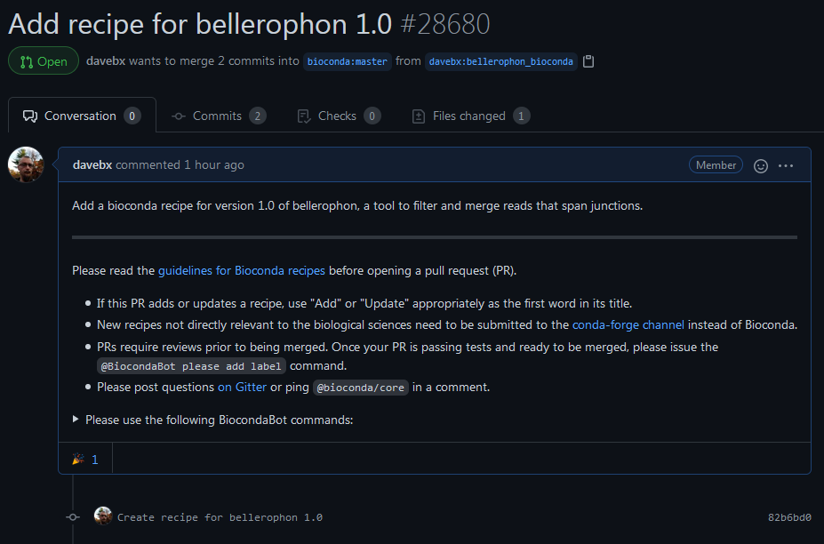
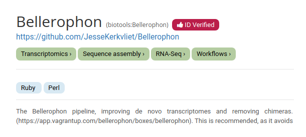
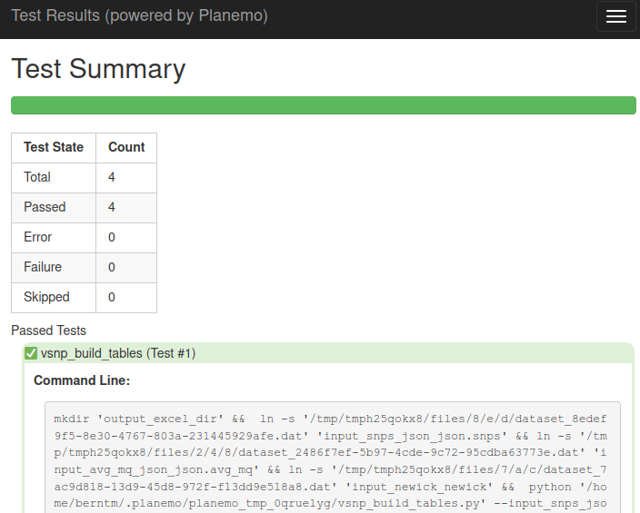
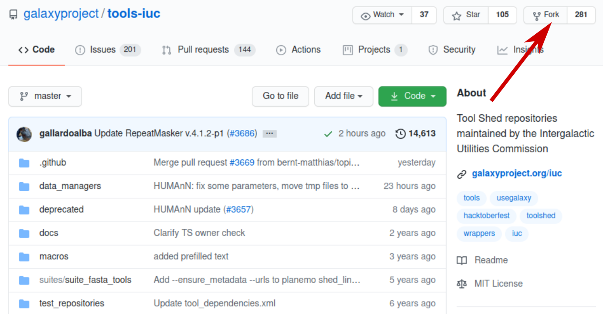
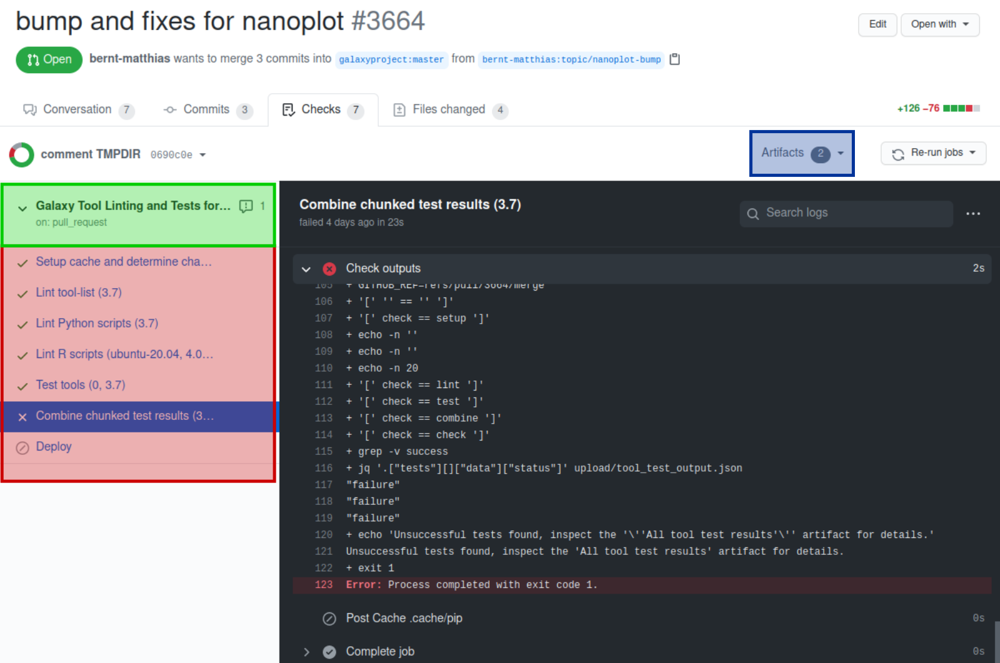

# Introduction


Tools wrappers allow any command line runnable code or programs to be run inside a galaxy environment.
Although Galaxy has thousands of tools readily available, new software and packages will always be useful.
This tutorial is designed to allow anyone to create, run, and deploy new tools in a Galaxy environment.

This tutorial is intended to instruct the reader in the full process of integrating a tool into Galaxy.
In three parts, it will cover the creation of a bioconda recipe for a new tool, writing a Galaxy tool
wrapper, and finally the testing and deployment of this tool into both a local and public Galaxy environment.
Although this will include specific tools, the training is generalizable.

> <agenda-title></agenda-title>
>
> In this tutorial, we will cover:
>
> 1. TOC
> {:toc}
>
{: .agenda}

# Galaxy Tools and Conda

Galaxy tools run within a conda environment, and are able to run any tool capable of running inside
that type of environment. The wrapper includes a set of conda packages available from either bioconda
or conda forge, and retrieves them on tool installation. Sometimes this may be a single package, as
with many command line tools, other times, there may be several. The first part of this tutorial discusses
the creation and deployment of these packages, making them available for Galaxy to retrieve.

## Writing a Bioconda Recipe

Bioconda is a repository of conda packages for software and tools relevant to the life sciences. Using conda
packages ensures better reproducibility, since each conda package is usually immutable, an exception being
if it is later discovered that the software in the package had always been non-functional and should be replaced.
Recipes should always define the following 6 sections in the `meta.yaml` file:

- package
- source
- build
- requirements
- test
- about

Let's write a Bioconda recipe for the tool we want to package: [bellerophon](https://github.com/davebx/bellerophon)

> <warning-title>Naming collision</warning-title>
> As this tool is already packaged in Bioconda, to prevent any naming collision, we will slightly modify its name from `bellerophon` to `bellerophon_bis` in the recipe.
> **This should never be done in real life, we only do it for this exercise!**
{: .warning}

> <hands-on-title>Writing a Bioconda Recipe</hands-on-title>
>
> 1. The first thing we should do is prepare our workspace. [Create a fork](https://help.github.com/articles/fork-a-repo/) of the [Bioconda repository](https://github.com/bioconda/bioconda-recipes/) on GitHub
>
> 2. Clone your fork of this repository to create a local copy on your computer
>
> 3. We create a branch in git, a conda environment with pip and
> conda-build preinstalled, and a folder for the meta.yaml file.
>
>    > <code-in-title>Bash</code-in-title>
>    > ```bash
>    > git checkout -b bellerophon_bioconda
>    > conda create -y --name bellerophon_bioconda pip python conda-build
>    > conda activate bellerophon_bioconda
>    > mkdir recipes/bellerophon_bis
>    > ```
>    {: .code-in}
>
> 4. Next we determine the SHA-256 checksum of the source tarball.
>
>    > <code-in-title>Bash</code-in-title>
>    > ```bash
>    > wget -O bellerophon.tar.gz https://github.com/davebx/bellerophon/archive/1.0.tar.gz
>    > sha256sum bellerophon.tar.gz # Copy the 64-character hexadecimal number that this outputs.
>    > ```
>    {: .code-in}
>
>    > <code-out-title></code-out-title>
>    > ```bash
>    > 036c5e23f53ed5b612525d3a32095acca073a9c8d2bf73883deb852c89f40dcf  bellerophon.tar.gz
>    > ```
>    {: .code-out}
>
> 5. Using the above information, we create the meta.yaml file where we'll then define the
> parameters that tell conda-build how to build this package, starting with variables for the name, version, and checksum.
> With these definitions, Bioconda's automatic version updater should recognize when a new version has been released and
> create a pull request to update the Bioconda package.
>
>    > <code-in-title>Bash</code-in-title>
>    > ```bash
>    > vim recipes/bellerophon_bis/meta.yaml # vim can of course be replaced with any other editor.
>    > ```
>    {: .code-in}
>
>    and set the following content:
>
>    
>    ```yaml
>    
>    
>    
>    ```
>    
>
> 6. Now we define the conda package metadata. This will be shown as bellerophon_bis-1.0 in anaconda and `conda search`. We
> plug in the relevant variables from the top of the file, lowering the name since conda package names should always be
> lowercase.
>
>    
>    ```yaml
>    package:
>      name: {{ name|lower }}
>      version: {{ version }}
>    ```
>    
>
> 7. Of course conda-build needs to know where to get the source code for bellerophon. Since the recipe we are creating is on
> github, updates can be automated with the variables we defined in the second step, while the SHA-256 checksum ensures
> that conda-build is getting the right source code every time.
>
>    
>
>    ```yaml
>    source:
>      url: https://github.com/davebx/bellerophon/archive/{{ version }}.tar.gz
>      sha256: {{ sha256 }}
>    ```
>
>    
>
> 8. Next, we move on to the build metadata. Since this is the first version of the conda recipe, the build number is 0.
> We use the externally defined `{{ PYTHON }}` variable, which defines which python conda-build is using, to install it
> to the build prefix. The --no-deps and --ignore-installed flags are needed to ensure that conda-build only packages
> bellerophon itself. In this section, if necessary, we can also define patches that should be applied to the source code,
> with the `patches:` token under `build:`, and specify that the package should not be built for a given architecture with
> the `skip:` directive.
>
>    ```yaml
>    build:
>      noarch: python
>      number: 0
>      script: {{ PYTHON }} -m pip install . --no-deps --ignore-installed -vv
>      #patches: /dev/null # Not used in this tutorial
>      #skip: True [osx] # Not used in this tutorial
>    ```
>
> 9. After the build metadata has been defined, we need to specify dependencies for at least building and running, with
> build-time dependencies specified in the `host:` section, and runtime dependencies in the `run:` section. With
> bellerophon, we know that it's a python package that uses pysam to operate on SAM/BAM files, so the only runtime
> dependencies we need are python and pysam.
>
>    ```yaml
>    requirements:
>      host:
>        - python
>        - pip
>      run:
>        - python
>        - pysam
>    ```
>
> 9. No recipe is complete without tests, and this recipe is no exception. Normally, it's sufficient to confirm that the
> program actually runs, e.g. with a `--version` command. Some software also has a self-test flag or parameter, though
> bellerophon is not among them, and we could even define a test script that uses test data either from the recipe or from
> the source archive.
>
>    ```yaml
>    test:
>      commands:
>        - bellerophon --version
>    ```
>
> 9. Finally, we add information about the software, such as code's is license type, the program's
> homepage, and optionally the github username of the person responsible for maintaining the recipe.
>
>    ```yaml
>    about:
>      home: https://github.com/davebx/bellerophon/
>      license: MIT
>      license_file: LICENSE
>      summary: "Filter reads that span a mapping junction, retaining the 5'-side."
>      maintainer: davebx # Optional
>    ```
>
> Putting all these parts together, we end up with a complete conda recipe for version 1.0 of bellerophon.
>
> > <question-title></question-title>
> >
> > What does your final file look like?
> >
> > > <solution-title></solution-title>
> > >
> > > 
> > >
> > > ```yaml
> > > 
> > > 
> > > 
> > >
> > > package:
> > >   name: {{ name|lower }}
> > >   version: {{ version }}
> > >
> > > source:
> > >   url: https://github.com/davebx/bellerophon/archive/{{ version }}.tar.gz
> > >   sha256: {{ sha256 }}
> > >
> > > build:
> > >   noarch: python
> > >   number: 0
> > >   script: {{ PYTHON }} -m pip install . --no-deps --ignore-installed -vv
> > >
> > > requirements:
> > >   host:
> > >     - python
> > >     - pip
> > >   run:
> > >     - python
> > >     - pysam
> > >
> > > test:
> > >   commands:
> > >     - bellerophon --version
> > >
> > > about:
> > >   home: https://github.com/davebx/bellerophon/
> > >   license: MIT
> > >   license_file: LICENSE
> > >   summary: "Filter reads that span a mapping junction, retaining the 5'-side."
> > >
> > > ```
> > >
> > > 
> > {: .solution}
> {: .question}
{: .hands_on}

> <comment-title>Using build.sh</comment-title>
>
> In this recipe, the command to execute for installing the package is very short, that's why we write it directly in the `meta.yaml` file. When you need to run more complex commands (like compilation steps), it is preferable to remove the `build > script` entry in the `meta.yaml` file, and write all the commands in a script named `build.sh` in the same directory.
>
{: .comment}

## Building the recipe locally

Now that your recipe is written, you can try to build it locally.

> <hands-on-title>Building the recipe locally</hands-on-title>
>
> 1. Run conda-build
>
>    > <code-in-title>Bash</code-in-title>
>    > ```bash
>    > conda build recipes/bellerophon_bis
>    > ```
>    {: .code-in}
>
> 2. Conda build will try to build the recipe locally and will run the the test to check if the package was successfully built.
> At the end, you should see something like this:
>
>    > <code-out-title></code-out-title>
>    >
>    > ```
>    > TEST END: /home/abretaud/miniconda3/conda-bld/noarch/bellerophon-1.0-py_0.tar.bz2
>    > Renaming work directory [...]
>    > # Automatic uploading is disabled
>    > # If you want to upload package(s) to anaconda.org later, type:
>    >
>    > # To have conda build upload to anaconda.org automatically, use
>    > # conda config --set anaconda_upload yes
>    > anaconda upload \
>    >    /home/xxxxx/miniconda3/conda-bld/noarch/bellerophon_bis-1.0-py_0.tar.bz2
>    > anaconda_upload is not set.  Not uploading wheels: []
>    > ```
>    {: .code-out}
>
> 3. In this example, the build was successful, and the resulting package is placed in `/home/xxxxx/miniconda3/conda-bld/noarch/bellerophon_bis-1.0-py_0.tar.bz2`. This is the file that gets uploaded to the bioconda channel when you create a Pull Request on the Bioconda GitHub repository.
{: .hands_on}

> <comment-title>Note on building locally</comment-title>
>
> While building locally is a quick way to check if a recipe is working, it's not the most reliable way.
> That's because the build is occurring directly on your system, which means you might get interference between the conda requirements in the recipe and your system-wide installed libraries and system configuration.
> The automatic testing of your recipe on GitHub when you create a Pull Request is more reliable as it is performed in a controlled and isolated environment.
>
{: .comment}

## Creating a Pull Request

After the recipe is complete, and when we have checked that it builds locally, we can commit and push to our fork, so that the recipe can eventually be integrated into Bioconda.

> <hands-on-title>Creating the PR</hands-on-title>
>
> 1. We start by making sure we're on a branch, and that `recipes/bellerophon/meta.yaml` is the only modified file.
>
>    > <code-in-title>Bash</code-in-title>
>    > ```bash
>    > git status
>    > ```
>    {: .code-in}
>
>    > <code-out-title></code-out-title>
>    >
>    > ```
>    > On branch bellerophon_bioconda
>    > Untracked files:
>    >   (use "git add <file>..." to include in what will be committed)
>    >
>    > 	recipes/bellerophon_bis/
>    >
>    > no changes added to commit (use "git add" and/or "git commit -a")
>    > ```
>    {: .code-out}
>
> 2. Add your recipes folder, commit, and push it.
>
>    > <code-in-title>Bash</code-in-title>
>    > ```bash
>    > git add recipes/bellerophon_bis
>    > git commit -m 'Add recipe for bellerophon 1.0'
>    > git push origin -u bellerophon_bioconda
>    > ```
>    {: .code-in}
>
>    Git will give you a url for creating the pull request, which can be clicked to be taken to github.
>
>    > <code-out-title></code-out-title>
>    > ```bash
>    > $ git push origin -u bellerophon_bioconda
>    > Total 0 (delta 0), reused 0 (delta 0)
>    > remote:
>    > remote: Create a pull request for 'bellerophon_bioconda' on GitHub by visiting:
>    > remote:      https://github.com/davebx/bioconda-recipes/pull/new/bellerophon_bioconda
>    > remote:
>    > To ssh://github.com/davebx/bioconda-recipes.git
>    >  * [new branch]      bellerophon_bioconda -> bellerophon_bioconda
>    > Branch bellerophon_bioconda set up to track remote branch bellerophon_bioconda from origin.
>    > ```
>    {: .code-out}
>
> > <warning-title>Don't create the Pull request for real!</warning-title>
> >
> > You can click on the link to see the diff of what would be included in the Pull Request, and how the form looks like. But please don't click on the `Create pull request` button! We don't want to get duplicate versions of this recipe integrated in bioconda everytime someone follows this tutorial!
> >
> {: .warning}
>
> Once on the github pull request page, you see a preview of the changes we propose, and you can write a short description of the recipe we want to merge. Have a look at the guidelines in the text box to understand how to properly fill the form, and get your Pull Request merged in the end. In real life, when creating a real new recipe, you would then click the `Create pull request` button.
>
> 
{: .hands_on}

## Installing a Conda Package

Once our new recipe has been merged, installing the package should be fairly painless. Galaxy, if configured to do so,
will automatically install any conda dependencies a tool asks for, whereas manual installation can be as easy as using
the `conda create` command to install python, bellerophon, and pysam into a conda environment named `bellerophon`. The
`-y` flag tells conda not to ask for confirmation before installing the software and its dependencies into the named
environment.


```bash
conda create -y --name bellerophon bellerophon=1.0 -c conda-forge -c bioconda
```

# Galaxy Tool Wrappers

Galaxy tool wrappers convert the available command line inputs and parameters of a given tool into a grapical
user interface, then translate the user's selections back into the command to be run. This section will focus
on writing a wrapper. Although this section will cover the full process and many of the options available to
anyone wrapping a tool, a more complete list is available in [the Galaxy tool docs](https://docs.galaxyproject.org/en/latest/dev/schema.html).

## Initializing a Tool Wrapper

Initializing a tool wrapper to be run in Galaxy is simple

> <hands-on-title>Creating a Tool Wrapper Skeleton</hands-on-title>
> 1. Go to the "tools" directory in your Galaxy instance.
> 2. Make a new directory for tools you will be wrapping.
> 3. Use `planemo` to initialize a new tool wrapper with basic formatting.
>     - Here we will be using bellerophon, but the parameters can be set for any tool.
>     - The tool ID is the internal reference id for the tool, and may contain no spaces or capitalized letters
>     - The tool name is the text that will be visible to the user.
>
>     ```bash
>     cd galaxy/tools
>     mkdir -p myTools/bellerophon
>     cd myTools/bellerophon
>     planemo tool_init --id bellerophon --name bellerophon
>     ```
>
> 4. You can now open the new xml file that has been generated to begin the wrapping. It should look something like this:
>
>    ```xml
>    <tool id="bellerophon" name="bellerophon" version="0.1.0" python_template_version="3.5">
>        <requirements>
>        </requirements>
>        <command detect_errors="exit_code"><![CDATA[
>            TODO: Fill in command template.
>        ]]></command>
>        <inputs>
>        </inputs>
>        <outputs>
>        </outputs>
>        <help><![CDATA[
>            TODO: Fill in help.
>        ]]></help>
>    </tool>
>    ```
>
{: .hands_on}

## Galaxy Tool Wrappers

Galaxy tool wrapper xml files are made up of several sections:

- Tool
- Description
- Requirements
- Macros
- Command
- Inputs
- Outputs
- Tests
- Citations
- Help

While many of those are present in the wrapper by default, others need to be added.

### Tool section

The tool section at the head of the file defines several key pieces of information for both the user and Galaxy.
The tool ID and name are defined here as well as which minimum version of Galaxy is required to run it.

> <hands-on-title>Defining the tool section:</hands-on-title>
> For this section, the following is necessary:
>
> - Tool ID
> - Tool name
> - Version (Version of the Galaxy wrapper)
>   - This is set as `'<Conda wrapper version>'+'galaxy<galaxy wrapper version>'`
> - Profile
>   - This is the minimum version of Galaxy required to run the tool
> - Unset python_template version
>
> when complete, the line should appear as follows:
>
> ```xml
> <tool id="bellerophon" name="bellerophon" version="@TOOL_VERSION@+galaxy@VERSION_SUFFIX@" profile="20.01">
> ```
{: .hands_on}

The @TOOL_VERSION@ and @VERSION_SUFFIX@ are what are referred to as "tokens", and will be furter discussed in the "Macros" section.

### Description section

This section adds help text to easily identify the tool. It is not intended as in-depth help, which should be in the `help` section.
The description is simply presented as plaintext between the tags. Bellerophon's would look like this:

> <hands-on-title>Adding a description</hands-on-title>
> Add the following description to your tool
> ```xml
> <description>chimeric reads from Arima Genomics</description>
> ```
{: .hands_on}

Which would present the tool's in the toolbar and at the top of the tool form as

```txt
bellerophon: chimeric reads from Arima Genomics
```

### Macros section

The macros section serves two functions -- to create meta-variables for inside both the xml text and the command text, called
tokens, and xml sections that can be slotted in repeatedly. In this section we will only use tokens, but xml macros are very
useful for tools which have multiple options/modes that reuse parameters. We will use a simple xml macro in the following section.

The @TOOL_VERSION@ and @VERSION_SUFFIX@ used in the Tool line are defined here. Each need their own 'token' line, resulting in

> <hands-on-title>Macros</hands-on-title>
> Add the following macros section to your tool:
> ```xml
> <macros>
>     <token name="@TOOL_VERSION@">1.0</token>
>     <token name="@VERSION_SUFFIX@">0</token>
> </macros>
> ```
{: .hands_on}

This will cause the version string at the beginning to read "1.0+galaxy0", and set the conda package that is pulled to be bellerophon version 1.0.
As versions are incremented, this will change. Any updates to the galaxy wrapper should iterate `@VERSION_SUFFIX@`, while any changes to the version
of the requirement would change the value for `@TOOL_VERSION@` (and reset the `@VERSION_SUFFIX@` to 0).

A basic example of the xml macros would look like this

```xml
<macros>
    <xml name="example_parameter">
        <param name="ex_1" type="integer" label="Example help text"/>
        <param name="ex_2" type="text" label="Example help text"/>
    </xml>
</macros>
```

One would then use that macro at any point in the xml it is relevant using the `<expand/>` tag like so:

```xml
<expand macro="example_parameter" />
```

This would add both of the `<param/>` tags at that location. Though inputs are used as an example macro here, any tag or group of tags can be made into a macro.


### Bio.tools ID

We will now add a useful macro entry. With the Galaxy ecosystem is becoming more reliant on metadata, a bio.tools ID can help Galaxy to pull standardized metadata for your tool. This enables users to find and use the tool more easily from across the web, so we highly recommend setting a bio.tools identifier. If an entry already exists on [https://bio.tools](https://bio.tools), it's a simple task.

> <hands-on-title>Setting a bio.tools ID:</hands-on-title>
>
> If we go to [https://bio.tools](https://bio.tools) and search "Bellerophon", we find that it already has a bio.tools entry:
>
> 
>
> We just have to add the biotools ID as a `<macro>` tag.
>
> Let's create a macro xml file next to our tool xml: `bellerophon_macros.xml`
>
> ```xml
> <macros>
>   <xml name="bio_tools">
>     <xrefs>
>         <xref type="bio.tools">Bellerophon</xref>
>     </xrefs>
>   </xml>
> </macros>
> ```
>
> Now we can expand the `bio_tools` macro in our tool XML, beneath the tokens:
>
> ```xml
> <macros>
>     <token name="@TOOL_VERSION@">1.0</token>
>     <token name="@VERSION_SUFFIX@">0</token>
> </macros>
>
> <import>bellerophon_macros.xml</import>
> <expand macro="bio_tools"/>
>
> ```
>
> If your tool does not yet have an entry in bio.tools, we highly encourage you to create one!
> It takes just 5 minutes to register with bio.tools to start contributing towards this global registry of computational resources.
>
{: .hands_on}

### Requirements section

The requirement section is where conda packages and docker/singularity containers are set. As this is a very basic tutorial,
the container requirements will not be discussed here.

For each conda package added to the environment in which the tool will run, a `<requirement/>` tag needs to be included in the `<requirements/>` section.
This specifies the

- Bioconda or Conda Forge package ID
  - This is set as plain text betweeh the `<requirement/>` tags
- Specific Bioconda/Conda Forge package version
  - This does not have to be the most recent version

> <hands-on-title>Adding requirements</hands-on-title>
> In the case of bellerophon, which requires two dependencies, bellerophon and samtools, the requirements section appears like so. Add them to your tool XML.
>
> ```xml
>   <requirements>
>         <requirement type="package" version="@TOOL_VERSION@">bellerophon</requirement>
>         <requirement type="package" version="1.12">samtools</requirement>
>   </requirements>
> ```
{: .hands_on}

This uses the macro token for @TOOL_VERSION@ for the Bioconda package version to retrieve the version number for bellerophon, while samtools' version is set manually.

> <question-title></question-title>
>
> If you wanted to add a requirement for the Seurat package of version 3.2, what would that look like?
>
> > <solution-title></solution-title>
> >
> > ```xml
> >   <requirements>
> >         <requirement type="package" version="3.2">seurat</requirement>
> >   </requirements>
> > ```
> >
> {: .solution}
{: .question}

### Input section

Although the next section in the tool script is actually be the command section, the input section will be discussed first, as it sets variables that are used in the command.
The input section has three possible xml tags at the highest level -- `<conditional/>`, ` <section/>`, and `<param/>`. Param will set any variable, conditional allows different available
parameters based on previous selections, and section simply breaks up the GUI into multiple parts that can be viewed or hidden at the user's discression.

#### *Param*

The param tag sets the value of variables, and has several attributes associated with it:

- Name
  - The name of the variable to be used in the command. Cannot include spaces.
- Argument
  - The actual flag being set in the tool. If the name and the flag is the same as what the name attribute would be, only Argument needs to be set.
- Label
  - The name of the parameter as shown to the user. Can include spaces.
- Type
  - Sets the variable type. Available options are:
    - Text
      - A string input with a built-in sanitizer.
    - Integer
      - Also allows for a minimum and maximum value to be set.
    - Float
      - Like integer, also allows for a minimum and maximum value to be set.
    - Select
      - Allows the user to choose from a pre-set list of options.
    - Boolean
      - Allows the user to select between two options, not simply True or False.
    - Data
      - Input file, with required file format specified.
- Help
  - Help text shown below the input for the parameter (optional).
- Optional
  - Boolean flag that allows the user to leave the parameter blank to either use the default value or to not use the parameter at all (optional).

#### *Conditional*

Conditionals are used alongside param tags to change available options based on what has been selected and is used with select-type params. Writing
conditionals, then, is a three-tag or four-tag process -- the `<conditional/>` tag, the `<param/>` of select type, and the `<when/>` tag,
used to specify the new paramaters available only on the selection of certain options. The param is of type "select", a tag `<option/>` is used to specify
each possible value. A very generic select-type conditional might look like this:

```xml
<conditional name="example_conditional">
    <param name="example_select" label="Example Select" type="select">
      <option value="ex1"/>
      <option value="ex2"/>
    </param>
    <when value="ex1">
        <param name="example_input" label="Example input" type="integer" min="0" help="Example help text"/>
    </when>
    <when value="ex2">
        <param name="example_input2" label="Example input 2" type="boolean" truevalue="--flag" falsevalue="--otherflag" help="Example help text"/>
    </when>
</conditional>
```

#### *Section*

Section tags are useful for visually separating the parameters. They can make a long tool with many parameters more simple to navigate by breaking it into
groups of parameters with similar functions. Alternatively, it can hide "advanced" or optional parameters, so that the user doesn't have to deal with
otherwise-irrelevant parameters if they don't need to. There are only 4 attributes:

- Name
  - Sets the internal reference name for the section. Cannot contain spaces.
- Title
  - Sets the visible name of the section for the user. Can contain spaces.
- Expanded
  - A boolean value that sets the default starting position of the section. If false, the section will begin collapsed, and only the title will be visible by default.
- Help
  - Help text visible to the user that explains the purpose of the section.

#### *Inputs Section in Practice*

The bellerophon tool's help section reads

```txt
optional arguments:
  -h, --help            show this help message and exit
  --forward FORWARD, -f FORWARD
                        SAM/BAM/CRAM file with the first set of reads.
  --reverse REVERSE, -r REVERSE
                        SAM/BAM/CRAM file with the second set of reads.
  --output OUTPUT, -o OUTPUT
                        Output BAM file for filtered and paired reads.
  --quality QUALITY, -q QUALITY
                        Minimum mapping quality.
  --threads THREADS, -t THREADS
                        Threads.
  --log-level {CRITICAL,ERROR,WARNING,INFO,DEBUG}, -l {CRITICAL,ERROR,WARNING,INFO,DEBUG}
                        Log level.
  --version             show program's version number and exit
```

This means that there are 6 total functional flags, --forward, --reverse, --output, --quality, --threads and --log-level.
Among these flags, two are file inputs, or 'data' type params, one is an integer type param, and three are parameters not
necessary for the user to have direct access to. As Galaxy uses specific file names or patterns to find output files, the
output file names need to be specific to the wrapper, not the actual running step. Since the user doesn't know the capability
of the resources on which the tool will be running, they should not be given access to the threads flag. And since the log level
goes to the stderr instead of an output file, this can also be skipped. All three of these flags can be coded in the command,
but not exposed to the user.

> <hands-on-title>Adding parameters to your tool</hands-on-title>
> 1. Using information in the above sections, add parameters for the forward, reverse, and quality flags to your tool xml.
>
> > <question-title></question-title>
> >
> > What does your `<inputs/>` section look like?
> >
> > > <solution-title></solution-title>
> > > To include all of the necessary parameters, then, the inputs section would appear like this
> > >
> > > ```xml
> > > <inputs>
> > >     <param argument="--forward" type="data" format="qname_sorted.bam,sam" label="First set of reads" help="This is usually the forward reads in your experiment." />
> > >     <param argument="--reverse" type="data" format="qname_sorted.bam,sam" label="Second set of reads" help="This is usually the reverse reads in your experiment." />
> > >     <param argument="--quality" type="integer" value="20" min="0" label="Minimum mapping quality"/>
> > > </inputs>
> > > ```
> > {: .solution}
> {: .question}
{: .hands_on}

This makes the variables "forward", "reverse" and "quality" available in the command section and lets the users set them in the Galaxy interface. The "min" attribute prevents
a user from inputting a value below a specified number. Here, the quality flag cannot be set below 0.

### Outputs section

The outputs section defines the files that Galaxy makes available in the history after running a tool using the `<data/>` and
`<collection/>` tags. In general, it tells Galaxy to look for a specific file after the job completes, and return it to the user.
It also defines the format of that file and the name shown to the user in the history.

> <hands-on-title>Adding your outputs</hands-on-title>
> As Bellerophon has a single output file, add the following outputs section to your tool:
>
> ```xml
> <outputs>
>     <data name="outfile" label="${tool.name} on ${on_string}" format="bam">
> </outputs>
> ```
{: .hands_on}

This generates a history item called "bellerophon on `<input file name>`", as the ${tool.name} and ${on_string} are reserved values
for the tool's label and the input file labels.

As the name is hard-set using the output flag, and is output into the working directory, the name attribute can be used for the file
search. Alternatively, the attribute "from_work_dir" allows a lower directory to be specified.

#### *Filtering the output*

In the case where a certain output only appears when certain parameters are set, the `<filter/>` flag can help. Though not used in this
tool, a user might have a boolean or select that generate new output files. In this case, the data tag would appear like this

```xml
      <data format="bam" label="example" name="output_bam">
          <filter>options['selection_mode'] == 'advanced' and options['bam_output']</filter>
      </data>
```

Meaning that file only appears in the history if the user specified the "advanced" mode of the tool, and requested a bam output file.

#### *Output collections*

Collections are also useful for groups of output files, or simply data meant to be kept together like paired-end files.
In this case, the data to be grouped in the history like this.

```xml
<collection name="paired_output" type="paired" label="Split Pair">
    <data name="forward" format="txt" />
    <data name="reverse" format_source="txt" from_work_dir="reverse.txt" />
</collection>
```

Though paired-end data is used here, the type can also be 'list' or 'paired list', specifying a larger group of data, or a group of
paired-end data respectively.

#### *Discover datasets*

Datasets can also be found automatically, in the case where the number of output files is unknown.

```xml
<data format="tsv" name="sample">
    <discover_datasets pattern="__name_and_ext__" directory="outputs"/>>
</data>
```

This, for example finds a tabuar dataset in a directory named "outputs" that follows the naming convention of "`<filename>.<extension>`",
where the extension is .tsv. This method is also able to be used in a collection, where the same function would find all datasets that
fit the pattern in the specified directory.

### Command section

Returning to before the inputs section, the command section is written in bash with a built-in python interpreter called Cheetah. Because of that, the command section is, for the most part,
a list of bash commands connected by '&&', with the conda packages listed in the requirement available to run.

#### *Cheetah commands*

Cheetah allows loops, logic gates, and assignments of variables in a command section. Creation of a logic gate is as simple as this

```bash
#if ${parameter} == "value":
  <command>
#end if
```

For an "else":

```bash
#if ${parameter} == "value":
    <command>
#else:
    <command_2>
#end if
```

For an "else if":

```bash
#if ${parameter} == "value":
    <command>
#else if ${parameter} == "other value":
    <command_2>
#else:
    <command_3>
#end if
```

Similarly, loops would appear as

```bash
#for value in ${param}
    <Loop commands>
#end for
```

For all open loops and gates, an "#end" must be used to close.

Finally, to define a variable within the command section, use

```bash
#set $variable = value
```

#### *Using other scripts*

In the case where languages other than bash are necessary, such as R or python, by listing the languages in the requirements,
they can be called in this section. Any scripts present in the tools folder can also be called.
For example

```bash
python helloworld.py &&
echo ${variable}
```

runs the helloworld.py script present in the same folder as the tool xml, then echoes the value of the param named "variable" from the input section.

#### *In practice*

> <hands-on-title>Writing the command block</hands-on-title>
>
> The bellerophon command section would, based on the variables set previously, would be as follows. Add it to your tool XML.
>
> ```xml
>     <command detect_errors="exit_code"><![CDATA[
>         #if $forward.is_of_type("sam"):
>             #set $forward_input = 'forward_input.sam'
>             ln -s '${forward}' '$forward_input' &&
>         #else:
>             #set $forward_input = 'forward_input.bam'
>             ln -s '${forward}' '$forward_input' &&
>         #end if
>         #if $reverse.is_of_type("sam"):
>             #set $reverse_input = 'reverse_input.sam'
>             ln -s '${reverse}' '$reverse_input' &&
>         #else:
>             #set $reverse_input = 'reverse_input.bam'
>             ln -s '${reverse}' '$reverse_input' &&
>         #end if
>         bellerophon
>         --forward $forward_input
>         --reverse $reverse_input
>         --quality $quality
>         --output 'merged_out.bam'
>         && samtools sort --no-PG -O BAM -o '$outfile' -@ \${GALAXY_SLOTS:-1} merged_out.bam
>         ]]>
>     </command>
> ```
{: .hands_on}

inputs the variables set in the inputs and output sections to generate a full command to be run inside the Galaxy environment. When inside a conditional or
section, the hierarchy is preserved using a period. For example

```txt
'$example.forward'
```

would look for the variable 'forward' within the section or conditional named 'example'.

This command will run, assuming two sam input files, as:

```bash
ln -s `<forward input sam file>` '$forward_input' &&
ln -s `<reverse input sam file>` '$reverse_input' &&
bellerophon --forward $forward_input --reverse $reverse_input --quality $quality --output 'merged_out.bam'
&& samtools sort --no-PG -O BAM -o `<outfile name generated by Galaxy>` -@ `<number of threads allocated>` merged_out.bam
```

### Test section

The test section is an easy way to ensure your tool wrapper functions as intended. It runs the tool and compares the output Galaxy returns against a
specified output. The output can be a specific file, a check against the stdout/err, or simply a search to see if the output contains specific
text. There can be any number of tests for a given tool, and it is preferred that all parameters are tested at some point in these tests.

When writing a test, the `<param>` tag functions slightly differently. It finds the variable with the same name, and then provides a value to be input
for the test. These params can also be placed inside a conditional, simulating the same conditional present in the inputs section.

As all parameters in bellerophon are accessible at once, and do not contradict one another, only one test is necessary.

> <hands-on-title>Adding a test</hands-on-title>
> Add the following test case to your tool:
> ```xml
>     <tests>
>         <test expect_num_outputs="1">
>             <param name="forward" value="forward.bam" />
>             <param name="reverse" value="reverse.bam" />
>             <output name="outfile" file="merged-out.bam" ftype="bam" />
>         </test>
>     </tests>
> ```
{: .hands_on}

This runs the tool with the files forward.bam and reverse.bam from a folder named test-data in the tool's directory. Since no quality parameter was specified, it uses the default of 20. The parameter can also be manually set with the same param tag and value attribute, just inputting an applicable value such as "21". It then
compares the defined output called "outfile" from the outputs section against a file called "merged-out.bam" in the same test-data directory. It also
double checks that Galaxy only finds one output to put in the history with the "expect_num_outputs" attribute. This is very useful for tests on tools
that have filtered outputs or that use 'discover_datasets'.

#### *Collections and sections in tests*

Though not used in this example, the sections and conditionals from the input section are used in tests as well. For example

```xml
<conditional name="example_conditional">
    <param name="select_example" value="first">
    <param name="when_first" value="1"/>
</conditional>
```

simulates the selection of value 1 inside of a conditional when the initial select parameter is set to "first".

### Help section

This is help text to be shown at the bottom of the tool form. It uses standard markdown format.

### Citations section

The citation section gives proper credit to the tool's writers. Here, using either DOI format or a bibtex citation, the tool form will automatically
link out to the relevant papers/repositories. The format in this section is simple, and as bellerophon was written by a Galaxy team member as a translation
of an Arima Genomics tool in association with the Vertebrate Genomes project, that is the paper that will be cited.

There are two ways to write this section

DOI:

```xml
<citations>
    <citation type="doi">10.1038/s41586-021-03451-0</citation>
</citations>
```

and Bibtex:


```xml
<citations>
    <citation type="bibtex">@article{Butler2018,
    abstract = {A new computational approach enables integrative analysis of disparate single-cell RNA–sequencing data sets by identifying shared patterns of variation between cell subpopulations.},
    author = {Butler, Andrew and Hoffman, Paul and Smibert, Peter and Papalexi, Efthymia and Satija, Rahul},
    doi = {10.1038/nbt.4096},
    issn = {1546-1696},
    journal = {Nature Biotechnology},
    number = {5},
    pages = {411--420},
    title = {{Integrating single-cell transcriptomic data across different conditions, technologies, and species}},
    url = {https://doi.org/10.1038/nbt.4096},
    volume = {36},
    year = {2018}
    }</citation>
</citations>
```


Multiple citations can be added by using additional citation tags.

> <hands-on-title>Adding a citation</hands-on-title>
> Add the citation above using either method (but not both!)
{: .hands_on}

## Final wrapper

With all sections complete, the final wrapper for bellerophon can be found [in the IUC GitHub repository](https://github.com/galaxyproject/tools-iuc/blob/master/tools/bellerophon/bellerophon.xml).

## Toolshed file

The .shed.yml file is placed in the same directory as the tool's xml file and saves metadata for the tool. It enables
toolshed organization and search by using tags and descriptions.

It is made up of the following sections:

Field               | YAML key                | Description
-----               | --------                | -----------
Name                | `name`                  | the tool's name
Owner               | `owner`                 | username of the person who wrapped the tool to be represented in the Galaxy Toolshed. If submitted through the Intergalactic Utilities Comission (IUC), can be set to `iuc`.
Description         | `description`           | short help text for the tool/package.
Homepage URL        | `homepage_url`          | URL of the tool's website. Can also just be the Github repository for the tool.
Long Description    | `long_description`      | longer, more in-depth help section.
Remote Reposity URL | `remote_repository_url` | link to the repository for the tool's files.
Type                | `type`                  | kind of files in the directory. Can be set as unrestricted (tool), tool_dependency_definition, or repository_suite_definition.
Categories          | `categories`            | toolshed categories that are relevant to the tool or package.

For Bellerophon, the .shed.yml file would be:

```yaml
name: bellerophon
owner: iuc
description: Filter mapped reads where the mapping spans a junction, retaining the 5-prime read.
homepage_url: https://github.com/davebx/bellerophon
long_description: |
  Filter mapped reads where the mapping spans a junction, retaining the 5-prime read.
remote_repository_url: https://github.com/davebx/bellerophon
categories:
- Sequence Analysis
```

In the case where the directory represents a group of tools or a 'suite', there are additional overarching sections into which the above tags fall:

- Auto Tool Repositories
- Suite

For more information on how to write automatic tool suites, visit the [Galaxy docs](https://galaxy-iuc-standards.readthedocs.io/en/latest/best_practices/shed_yml.html).

# Testing Galaxy tool with `planemo`

`planemo` is a command line utility that helps developing Galaxy tools.
Among many other tasks it can:

1. Lint the tool source errors and conformance to best practices.
2. Test tools, i.e. executing the tool with the tests described in the tool's test section.
3. Serve tools, i.e. crate an ad-hoc Galaxy server running the tool.

For more information on `planemo` see its extensive [documentation](https://planemo.readthedocs.io/).

In this part of the tutorial we will start with installing `planemo` and then
see it in action linting, testing, and serving the tool.

## Installing `planemo`

`planemo` is available via the python package manager `pip` and `conda`.
If you not have conda installed we suggest to use `pip` for installing `planemo`.

> <hands-on-title>Installing `planemo` via pip</hands-on-title>
>
> It is advised to install `planemo` in a virtual environment (step 1-2).
>
> 1. Create a virtual environment: `virtualenv -p python3 ~/.venv/`. Here `~/.venv/` is the path where the virtual environment should be crated and you may adapt the path to your needs. With `-p python3` we make sure that a `python` intepreter version 3 is used.
> 2. Activate the virtual environment: `. ~/.venv/bin/activate`
> 3. Install `planemo` `pip install planemo`
{: .hands_on}

> <hands-on-title>Installing `planemo` via conda</hands-on-title>
>
> 1. Install [miniconda](https://conda.io/projects/conda/en/latest/user-guide/install/index.html)
> 2. Create a conda environment with `planemo` installed `conda create -c conda-forge -c bioconda -n planemo planemo`
> 3. Activate the conda environment `conda activate planemo`
{: .hands_on}

Note that for using `planemo`from a new shell you will need to activate the python/conda environment again.

> <hands-on-title>Testing `planemo` and getting help</hands-on-title>
>
> 1. In order to test if the installation worked execute
>
>    > <code-in-title>Bash</code-in-title>
>    > ```bash
>    > planemo --version
>    > ```
>    {: .code-in}
>
>    > <code-out-title></code-out-title>
>    > This should output the version of `planemo`, e.g.
>    > ```bash
>    > planemo, version 0.74.3
>    > ```
>    {: .code-out}
>
> 2. `planemo --help` will show the available commands with a short desctiption (lint, test, and serve will be part of this tutorial)
> 3. `planemo SUBCOMMAND --help` will show the usage information for the corresponding subcommand. Try to obtain the information for the `lint` subcommand.
{: .hands_on}

## Using `planemo` to lint tools

When linting a Galaxy tool `planemo` checks the sources for common errors and violations of best practice rules. Examples are:

- Presence to "TODO" in the help section
- Absence of tests or citations
- Missing when clauses in conditionals or the use of a boolean parameter as the selector in a conditional

If `planemo` finds a problem it outputs warnings or errors depending on the severity of the problem.
By default `planemo` will fail if any warning or error is found, i.e. return a non-zero exit code.

> <hands-on-title>Lint a tool with `planemo`</hands-on-title>
>
> 1. Change into the directory containing the tool
> 2. Run `planemo lint`
> 3. Inspect the output for any warnings or errors
> 4. Fix the problem(s) and rerun from step 2 until all problems are solved
{: .hands_on}

By default `planemo` will lint all tools contained in the current working directory (including subdirectories).
You can also specify a directory or a tool by giving its path as additional argument.

## Using `planemo` to test tools

Using `planemo` to execute the tests defined in a tool is probably the most frequently used feature.
In order to do so `planemo` will:

- Start a local Galaxy instance
- Stage all input data defined in the tests
- Run the tool using the datasets and parameters defined in the tests (this also involves the installation of all requirements which is done with conda by default)
- Check if the test assumptions are met, e.g. non-zero exit code, equivalence of the output files, number of outputs, ...

> <hands-on-title>Test a tool with `planemo`</hands-on-title>
>
> 1. Change into the directory containing the tool
> 2. Run `planemo test` (as with `planemo lint` you can also specify a path to a tool explicitly as extra argument)
>
>    The most important output of `planemo` is found at the end and looks like:
>
>    ```
>    Testing complete. HTML report is in "PATH/tool_test_output.html".
>    All X test(s) executed passed.
>    TOOL_NAME (Test #1): passed
>    TOOL_NAME (Test #2): passed
>    ...
>    ```
>
>    The last part lists for each test if it failed or passed. In case of a failure you can open the file `tool_test_output.html` (the path to this file is in the output) with a browser to get more information.
>
> 3. Open the HTML report `firefox PATH/tool_test_output.html` (replace the PATH as in `planemo`'s output).
>
>    The HTML report contains a table on the top giving the number of executed, successful, and failed tests:
>
>    
>
>    If there are passed or failed tests you will find the text `Passed tests`, `Failed tests`, resp., below the table.
>    Clicking on this text will unfold the list of passed or failed tests, resp. Clicking again on one of the tests
>    Will show additional information like stdout, stderr and the executed command line. In most cases this is sufficient
>    to determine the source of the test failure.
{: .hands_on}


> <tip-title>Useful parameters for `planemo test`</tip-title>
>
> * `--failed` Will make `planemo` rerun only the tests that failed in the previous execution.
> * `--update_test_data` If there are differences to output files defined in the tests these will be updated (and the tests will run again).
> * `--no_cleanup` `Planemo` will not cleanup the created Galaxy clone or the job working dir (see the details box below).
{: .tip}


> <details-title>Understanding `planemo`'s output in more detail</details-title>
>
> Sometimes it can be helpful to understand the `planemo` output in more detail.
>
> - The first lines show some `git` commands that create a local clone of the Galaxy sources (by default the `master` branch) and the command to start Galaxy. The end of the part is marked by the line `Activated a virtualenv for Galaxy`.
> - Then the python virtual environment used to run Galaxy is created and the requirements are installed
> - Then the worker threads and the Galaxy database are initialized, look for lines containing `Initializing main Galaxy Queue Worker on` and `Install database targetting Galaxy's database configuration`. The completion of the startup of Galaxy is indicated by the line `INFO:     Application startup complete.`
>
> The first two steps can take a while on the first run of `planemo test` (in particular on slow internet connections). Subsequent runs will be faster since the Galaxy sources as well as the virtual environment are cached in your home directory (`~/.planemo/`).
>
> - After this `planemo` will execute one test after the other. The start of a test is indicted by a line `( TOOL_ID ) > Test-TEST_NUMBER`
> - For each test a number of Galaxy jobs are triggered (one upload job for each input dataset and the actual tool execution). Each job is indicated by a line `Built script [JOB_WORKING_DIR/tool_script.sh] for tool command [COMMAND_LINE]` which tell you the working directory of the job and the executed command line.
> - Suceccful tests will be marked with a line containing the text `ok`. Otherwise stdout and stderr and potentially a description of the test problem is shown.
>
> Note that the first execution of the tool job can take longer since also the conda environment containing the requirements of the tool is created.
>
> As an exercise
>
> - Start `planemo test` with the extra parameter `--no_cleanup` (this will prevent the deletion of the Galaxy clone and its job working directories after `planemo` finished).
> - Change into one job working directory (not an upload job)
> - Inspect `tool_script.sh` and find the command to activate the conda environment for the job and the executed command line.
> - Execute these commands from within the `working` dir in the jobs working dir (You may need to remove all files that are already existing there).
>
> This procedure can be really helpful for debugging Galaxy tools.
{: .details}

## Using `planemo` to serve tools

It can be very useful to check how Galaxy renders a tool and if this meets the expectations of the developer. For instance this is the best way to check if the help section is rendered as expected.

> <hands-on-title>Serve a tool with `planemo`</hands-on-title>
>
> 1. Change into the directory containing the tool
> 2. Run `planemo serve` (as with `lint` and test you can also specify a path to a tool explicitly as extra argument)
>
>    `Planemo` will again start a Galaxy instance that contains your tool. Note that starting the ad-hoc Galaxy might need longer than for `planemo test` since JavaScript components need to be initialized as well.
>
{: .hands_on}

> <tip-title>Useful parameters for `planemo test`</tip-title>
>
> In order to stop `planemo serve` just press <kbd>Ctrl-C</kbd>
{: .tip}

# Publishing Galaxy tools

Galaxy tools are installed from the [Galaxy toolshed](https://toolshed.g2.bx.psu.edu/). With the help of `planemo` tools can be added to the toolshed ([documentation](https://planemo.readthedocs.io/en/latest/publishing.html)). But usually the sources of the tools are maintained in public source code repositories, for instance:

- [IUC](https://github.com/galaxyproject/tools-iuc/)
- [devteam](https://github.com/galaxyproject/tools-devteam/)
- [Bjoern Gruenings repo](https://github.com/bgruening/galaxytools)
- [GalaxyP](https://github.com/galaxyproteomics/tools-galaxyp/) for proteomics tools
- [W4M](https://github.com/workflow4metabolomics/) for metabolomics tools

These tool source repositories have continuous integration workflows:

- lint and test tools
- lint supplementary python and R scripts
- and publish tools to the toolshed

In addition the repositories run weekly workflows testing all tools in order to keep them working.
Another advantage of these repositories is that new tools and improvements to tools are subject to review of experienced tool developers.

The repository is structured as follows:

- `tools/`: the main directory of the repository containing the tool descriptions. One directory for a tool repository (a directory with a `.shed.yaml` file that describes the tools) which can contain one or more set of tools.
- `tool_collections/` and `suites/`: Like `tools/` but reserved for larger collections of tools like `samtools` or `bedtools`.
- `data_managers/`: a directory containing data managers. These need to be in a separate directory since tool tests with `planemo` need to be ececuted slightly different from tests of normal tools.
- `deprecated/`: deprecated tools. Tools in this directory are excluded from weekly CI.
- `macros/`: macros that can be used by multiple tools.

In addition there are some important directories containing configurarion:

- `.github/`: contains the CI workflows and other documents for the maintenance of the repository.
- `.tt_skip`: a text file containing a list of tool repositories that are excluded from weekly CI as well as CI running in PR.
- `.tt_biocontainer_skip`: a text file containing a list of tool repositories that should not be tested with containerized tool tests but use `conda` for resolving tool requirements.
- `setup.cfg`: configuration for `flake8` python linting in CI.

Furthermore there are `README.md`, `CONTRIBUTING.md`, and `LICENSE` that might be worth considering as contributor or adapting if you use the repository as template.

The workflow to add or update a tool in such a repository to open a pull request (PR) from a branch of a personal fork of the repository. In the following it will be demonstrated how this is done for the IUC repository

## Fork and clone the github repository

For the following we will use a sandbox tool repository and not one of the main repositories.
But, the steps can be adapted easily by exchanging the repository URLs. Note that for some repositories
the development branch may have the name `master` instead of `main`.

> <hands-on-title>Fork and clone the IUC github repository</hands-on-title>
>
> 0. If you don't have an account on github you need to sign up at first.
> 1. Open the [Sandbox tool repository](https://github.com/mvdbeek/galaxy-tools-mvdbeek/) in a browser.
>
>   - Click the `fork` button on the top right
>     
>   - In the following dialog select your account
>   - After a short while you will be redirected to your fork of the sandbox repository
>     (i.e. a 1:1 copy of the original repository)
>
> 2. In order to obtain a clone (i.e. a local copy of your fork) click the green button with text "Code" and copy the link. And execute the following commands on your computer
>
>    > <code-in-title>Bash</code-in-title>
>    > ```bash
>    > cd A_DIR_WHERE_YOU_WANT_TO_CREATE_THE_CLONE
>    > git clone LINK_TO_YOUR_FORK
>    > cd tools-iuc/
>    > git remote add upstream https://github.com/mvdbeek/galaxy-tools-mvdbeek.git
>    > ```
>    {: .code-in}
>
>    The first command creates the clone in the current working dir, i.e. it will create a directory `galaxy-tools-mvdbeek` containing the copy.
>    The last command will add the original sandbox repository as a remote with the name `upstream`. This is necessary in order to keep your fork of the repository in sync with the original repository.
>
> 4. Check that `git remote -v` lists your fork under the name `origin` and the original repository unter the name `upstream`.
{: .hands_on}


> <hands-on-title>Keeping your fork in sync</hands-on-title>
>
> You should execute the following steps always before creating a new branch:
>
> 1. `git checkout main`: change to the main branch
> 2. `git pull upstream main`: get the most recent changes from the `upstream` repository to your local clone
> 3. `git push origin main`: publish the most recent changes from your local clone to your fork, i.e. `origin`
{: .hands_on}

## Create a pull request for a new tool

> <hands-on-title>Create a pull request</hands-on-title>
> 1. `git checkout main`
> 2. `git checkout -b NAME_OF_THE_BRANCH`: create a new feature branch and change to this branch. The branch name should not contain names and should be short and if possible descriptive, e.g. the tool name.
> 3. Introduce changes, e.g. created a directory under `tools/`, add the tool XML file, the `.shed.yml` file, and the `test-data` directory with the files needed for the test.
> 4. `git add TOOL_DIRECTORY` add all files in `TOOL_DIRECTORY` under version control
> 5. `git commit -m 'COMMIT MESSAGE'` commit the changes. The commit message should contain a short description of the changes. You can also use multiple lines: ommit the final quote and continue after pressing enter -- finish by adding the single quote again and press enter.
> 6. Push to your fork `git push --set-upstream origin NAME_OF_THE_BRANCH`
> 7. Create a Pull Request (PR): in the output of the previous command you will find an URL that you can copy paste to your browser. Add a suitable title to you PR and describe the changes. The PR will be created after you click the button "Create pull request"
{: .hands_on}

After you created a PR your changes will be reviewed and improvements will be requested. You can add changes to the PR as follows.

> <hands-on-title>Adding changes to a PR</hands-on-title>
> 1. `git checkout NAME_OF_THE_BRANCH`
> 2. Make changes as requested.
> 3. `git add SPACE_SEPARATED_LIST_OF_CHANGED_FILES`
> 4. `git commit -m 'COMMIT MESSAGE'`
> 5. `git push origin NAME_OF_THE_BRANCH`
{: .hands_on}

## The IUC style continuous integration workflows

When a new PR is created or new commits are added to the PR the [continuous integration workflow](https://github.com/bernt-matthias/galaxy-tool-repository-template/blob/main/.github/workflows/pr.yaml) starts and executes the following steps:

1. Setup: this mainly determines the list of changed tools and repositories (here repository refers to a set of tools with `.shed.yaml`). In addition some caches for `pip` and `planemo` are setup that are reused in the following jobs are maintained.
2. Tool linting: this essentially runs `planemo shed_lint` which does the same as `planemo lint` plus additional checks.
3. Python linting: run `flake8` linting on all python scripts contained in changed repositories
4. R linting: run `lintr` linting on all R scripts contained in changed repositories
5. Tool testing: this runs `planemo test` on all tested repositories using containerized tests, i.e. docker containers are used to execute the tool tests instead of `conda` environments. Depending on the number of changed tools up to four parallel jobs execute the tool tests. Note that these jobs will always be reported as sucessful even if tool tests failed. Tool test failures will be reported in the subsequent job. The same version of these tests can be run locally by adding `--docker` to the planemo test command.
6. Combine tool test results: the results of the parallel tool test jobs are merged.
7. Determine success of the steps: this is just an auxilliary step needed for PR that do not change tools, but the framework (e.g. the worflows).

The same workflow runs once again when the PR is merged. In addition another job runs which deploys the tool(s) to the toolshed (and testtoolshed).

The CI jobs are listed on the bottom of the PR. Colored icons indicate the state of the jobs:

- yellow circle: running
- grey circled /: skipped
- red x: failed job
- green checkmark: successful job

The link "Details" on the right of the job brings you to a page showing the detailed output of the jobs (Alternatively the "Checks" tab on top of the PR page brings you to the CI output page.)



The image above shows the CI page for a PR:

- Green box: clicking this brings you to an overview page showing the CI workflow and listing errors and produced artifacts below.
- Red box: the executed CI jobs. Clicking a job will show the outputs of the CI steps in the main (gray panel). The outputs of each step can be show by clicking on the corresponding step.
- Blue box: direct link to the artifacts. This is currently the output of the "Combine tool test results" job: "All tool test results" (and the outputs of the separate tool test jobs which are a technical necessity and usually not relevant). Clicking "All tool test results" will trigger the download of a zip file that contains the `planemo test` html output. If the linting jobs have found errors then also their output will be provided as additional output.

Most of the steps executed in the jobs are boilerplate and only one/two steps in each stop are really relevant for the users:

- Setup: show repository list -- show tool list: here you can check if all repositories and tools that are changed in the PR are listed.
Lint tool-list: planemo lint -- this contains the linter output of `planemo test`. Check here for non critical warning that would be good to fix.
Lint python scripts: flake8 -- contains the output of the python linter `flake8`.
Lint R scripts: lintr -- contains the output of the python linter `lintr`.
Test tools: planemo test -- contains the output of `planemo test`.

## Create your own IUC style tool repository

It is also easy to setup a github tool repository on your own that has the same structure and functionality as the IUC repository. This allows you to maintain the tools that you are developing on your own, but keep in mind the advantages of having tools in one of the community driven repositories (like long term support).

In order to setup your own tool repository the Galaxy community created a [template repository](https://github.com/bernt-matthias/galaxy-tool-repository-template). By clicking `Use this template` and follow the instructions in the README file you get you own tool repository.

# Conclusion

