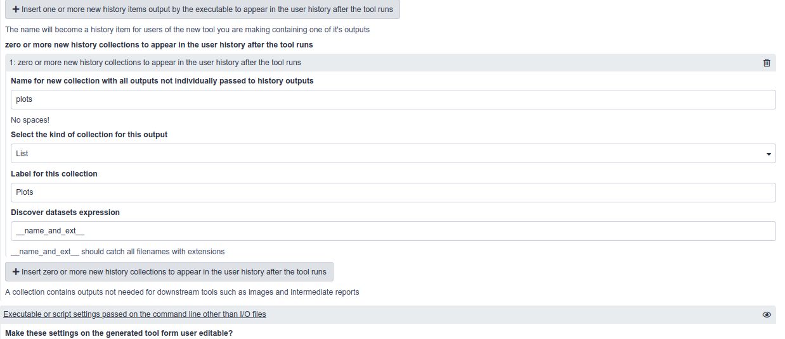
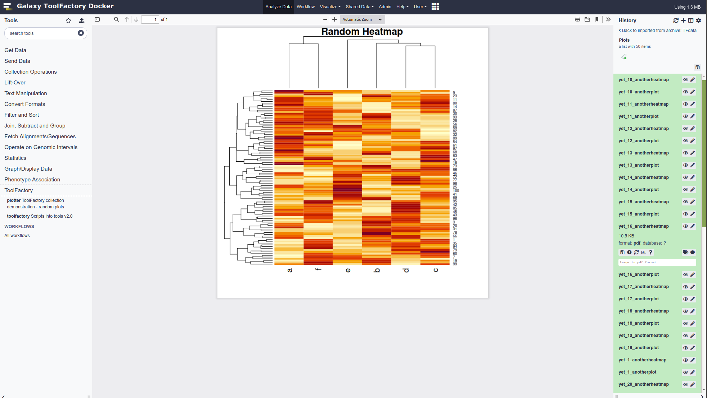
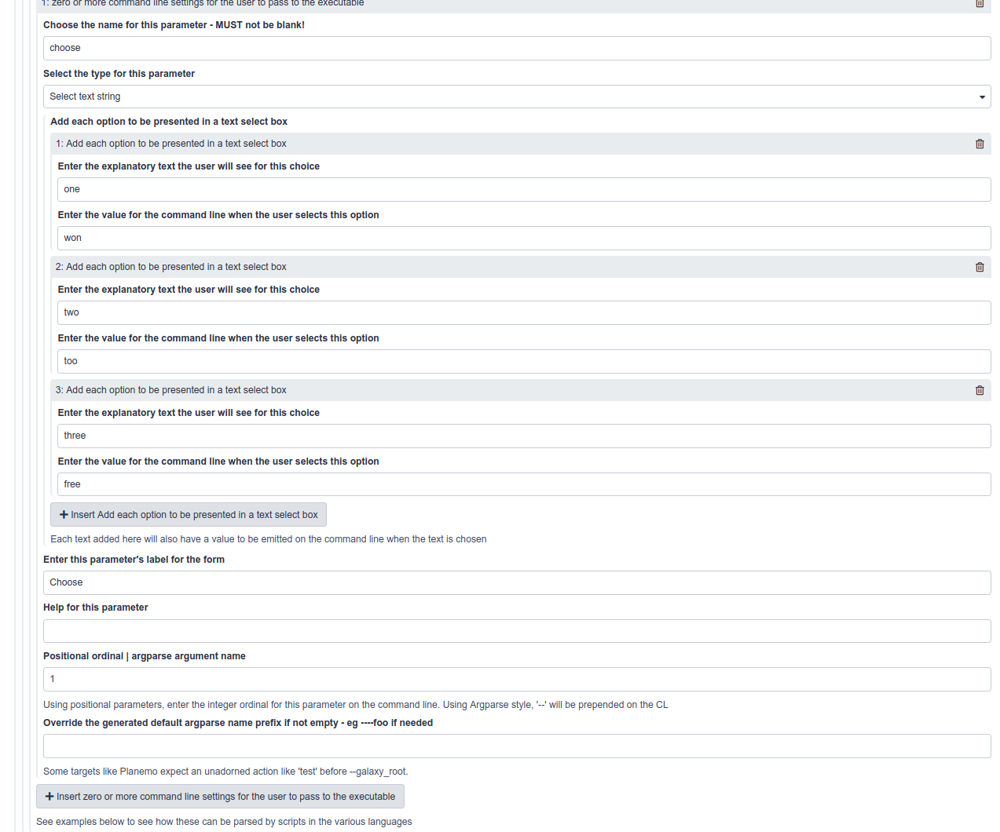
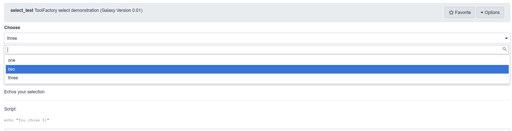

---

layout: tutorial_hands_on
title: "ToolFactory: Generating Tools From More Complex Scripts"
key_points:
  - The ToolFactory Appliance includes an automated form driven tool generator available as a pop-up Docker appliance.
  - It runs in a flavour of docker-galaxy-stable and produces new tools as Toolshed ready archives
  - It was designed for scientists and developers who routinely write scripts for their analyses.
  - It can quickly turn a working command line script into a working Galaxy tool.
  - It generates tools from information entered on a Galaxy form in the familiar UI.
  - The new tool is installed in the appliance after generation so can be used and explored immediately.
  - New tools can be adjusted as needed by re-running the job that generated the tool and updating the form settings to suit.
  - Adding a test to the toolshed archive takes a minute or so and is only needed when the new tool is ready to export for sharing.
  - Experimenting with the ToolFactory samples will help acquire insight and skills useful for manual tool building.

objectives:
 - Further develop your ToolFactory Skills

questions:
 - What else can I do with the ToolFactory?

subtopic: tooldev
time_estimation: 1H

requirements:
  - type: "internal"
    topic_name: introduction
    tutorials:
      - galaxy-intro-short
      - galaxy-intro-101-everyone
  - type: "internal"
    topic_name: dev
    tutorials:
      - tool-integration
      - interactive-environments
      - tool-generators

contributors:
  - fubar2

---

> <agenda-title></agenda-title>
>
> 1. TOC
> {:toc}
>
{: .agenda}

---

# Background and design of the training material

Only Galaxy users who write and perhaps share scripts for their own analyses are likely to be reading this profitably.
Presumably the "Hello Galaxy" demonstration looked interesting enough to learn more about what capabilities and limits the ToolFactory has.
It is hoped that this advanced tutorial will introduce some features that potentially make the ToolFactory useful in your work.

This training material is unlike most other GTN tutorials. There is no specific tool building curriculum on offer other than the introductory `Hello Galaxy` demonstrations and
hands-on. Tools are mostly domain specific but the ToolFactory has wide applicability.  Developers and the tools they might be interested in creating are so diverse
that it seems more useful to provide the infrastructure and environment to encourage "learning by doing". Developers are free to explore their own specific requirements.
The result of editing and regenerating a tool is immediately available in the ToolFactory for evaluation to encourage self-guided exploration.

Simple demonstration tools are provided as the functional documentation. They address specific features (such as the `plotter` illustrating collections),
and they cover many of the styles of tool building  that the ToolFactory supports. The `sed` example uses no script but the others all do.
The ToolFactory is probably more useful for scripts than directly driving individual Conda packages, but will work for Conda dependencies like `sed` where
no parameter dependent logic is required for the construction of the command line. Many Conda package interfaces have requirements that the ToolFactory cannot
currently address. They will probably always require a skilled tool document developer.
=======
# Welcome, background and a user's guide to this training material

Galaxy users who write and share scripts useful for scientific analyses are likely to be reading this material, perhaps after seeing the "Hello Galaxy"
demonstration. It was written to help you find out about the capabilities and limits of the ToolFactory by experimenting with it yourself.
It is hoped that this advanced tutorial will introduce some features that potentially make the ToolFactory useful in your work.

This training material is unlike most other GTN tutorials. There is no specific tool building curriculum on offer because it is hard to know how
that might be orgranised. The introductory `Hello Galaxy` demonstrations and
hands-on are the only formal attempt at explaining any tool's structure and construction.

The reason is that tools are mostly scientific domain specific, while the ToolFactory is applicable to any domain where Galaxy might be useful.
Developers and the tools they might be interested in creating are so diverse
that it was decided to provide the infrastructure and environment to encourage "learning by doing".
The result of editing and regenerating a tool is immediately available in the ToolFactory for evaluation to encourage self-guided exploration.
Developers are free to explore their own specific requirements.

Simple demonstration tools are provided. The are both the functional documentation, and useful models to adjust and explore.
They each address a specific feature (such as the `plotter` illustrating collections),
and they illustrate some of the styles of tool building supported by the ToolFactory. The `sed` example does not use a script. All the others do.
The ToolFactory is likely to be more useful for scripts than directly driving Conda packages. Many Conda package interfaces have requirements that the ToolFactory cannot
currently address. Those will probably always require a skilled tool document developer. Conda dependencies requiring minimal conditional parameter
logic for the construction of a command line or for adjusting outputs, such as the `sed` example, may be more tractable.

=======
## The ToolFactory Appliance for scientists and developers who write command line scripts in their work.

The ToolFactory is distributed as a Docker appliance, created as a "flavour" of the widely used `docker-galaxy-stable` infrastructure, so it includes a fully functional
Galaxy server. New tools can be generated locally or they can be added from any Toolshed. This is intended to make it easy to create
tailored private development Galaxy servers, so new tools, analyses and workflows can be developed to help speed uptake in areas of data-intensive science where
few Galaxy tools are currently available.

The ToolFactory automates much of the work needed to prepare a new Galaxy tool using information provided by the script writer
on a Galaxy tool form. It can generate XML to wrap any simple script that runs correctly on the linux command line with some small test input samples. This is potentially
handy for developers new to Galaxy, and for Galaxy users who are capable of correctly scripting on the command line for themselves, because those working scripts can
be wrapped and tested to make toolshed ready, shareable Galaxy tools, or if too trivial to be worth sharing, used on the host desktop Galaxy for real analyses.

Generated tools are immediately installed and ready to run. This provides instant feedback for the developer in an integrated tool
development environment for simple scripts. Jobs that generate tools can always be rerun using . The form reappears as it was
when the tool was generated. Data and user configurable parameters can be added or removed. Text that appears when the tool is run, such as user parameter or data input
labels and help, can be updated by editing the form. When the updated tool is generated, installed and run as a tool, the tool form will include all the changes, ready to run.

Tools can be tested and prepared for export as toolshed ready archives when the developer is ready using a companion `planemo_test` tool in the ToolFactory tool section.

The Appliance is a pop-up platform for a data intensive scientist to quickly learn how Galaxy tools work, in preparation for the more flexible and efficient
Galaxy project supported manual tool building infrastructure. At the same time, they can wrap and refine new tools from existing scripts
on their own workstations, preparing them for sharing and deployment to production servers. It also may be useful as a private sandbox for learning about tools and Galaxy administration or experimenting with code development. In the worst possible scenario where the
system is damaged, the Appliance can be rebuilt from scratch in a few minutes.


> <tip-title>Under the hood:</tip-title>
>
>  - It uses [galaxyml](https://github.com/hexylena/galaxyxml) to generate the tool XML from ToolFactory form settings.
>  - It uses [Planemo](https://github.com/galaxyproject/planemo) to generate the test outputs and then again to test newly generated code
>  - The Appliance is a flavour added to the base [docker-galaxy-stable](https://github.com/bgruening/docker-galaxy-stable/compose) infrastructure
{: .tip}

---

## Limits and scope

- The Appliance can generate, install and run new tools from scripts on your desktop.
    - It is a fully functional development Galaxy instance, so it can import any existing tool from a toolshed and can handle as much data as your desktop disks will fit.
    - It [can connect to a cluster for real work](https://github.com/bgruening/docker-galaxy-stable/compose) so potentially useful for development at scale.
    - It takes only a few minutes to install and can be completely removed even more quickly when no longer useful.
    - It lacks the data backup and security provided by an institutional Galaxy service.
    - The user is entirely responsible for securing and backing up all their work.
    - It is not recommended for production and is not supported by the Galaxy developers.
    - A well endowed modern workstation or laptop with plenty of cores, disk and RAM is needed. Older commodity hardware may struggle.
- The ToolFactory works best wrapping simple R/Bash/Python and other interpreted scripts, with a few user supplied parameters and a few I/O history files.
- XML macros, output filters and many other advanced features that are available when writing wrappers manually are not currently supported.
- Scripts are easier than some Conda packages
    - This is because the tool builder can modify the code to respond to default empty parameters as if they had not been passed.
    - This may not sound like much, but as a result, advanced tool building elements such as conditionals and related tricks requiring manual coding, can sometimes be avoided.
    - In contrast, some Conda dependencies or combinations will require output filters
or other complex tool XML constructs outside the `<command>` section, that are not easy to generate automatically and can only be coded in the document.
    - While some simple requirements may be manageable, complex ones will not be suitable for the ToolFactory.
- Compared to the more usual linux shell and text editor, the ToolFactory appliance is a rather clumsy way to debug scripts.
    - Starting a new ToolFactory tool with a know good command line and data is strongly recommended.
      - You will know exactly what to expect from the tool test for a first sanity check.
    - Corrolary: Unless there is a working script that needs to be wrapped into a toolshed-ready Galaxy tool, the ToolFactory is of little use
      - other than for learning about Galaxy tools.
- The ToolFactory Appliance is for developers and code-writing scientists not yet familiar with the more flexible and complex manual tools, and who need to wrap scripts that are simple
enough for the ToolFactory.
    - Compared to the more flexible manual Galaxy tool development software, there is far less to learn to get up to speed with a form driven,
automated code generator in a tailored, readily deployed appliance.
    - The cost of this convenience is that ToolFactory is limited to a subset of simple script and package wrappers.
    - Much can be learned in the process of trying things out in the ToolFactory that will help acquire skills for manually building tools.

---

# Getting your hands on a ToolFactory Appliance for some hands-on training.


## Installation

> <warning-title>Security advisory!</warning-title>
>- *Please do not install the ToolFactory on any public server*
>- Although it will only run for administrative users, it allows unlimited scripting and that exposes unwise security weakness for any public facing machine.
>- In fact, Galaxy is very good at isolating tools to stop them doing mischief. But that's no reason to chance your arm. They keep inventing better mice.
>- Please install it locally as described below.
>- For this reason, the training materials can't make use of existing public Galaxy infrastructure like most of the GTN material.
{: .warning}


> <hands-on-title>Launching the Appliance</hands-on-title>
>
> > <warning-title>`Pull` the images first as shown below to save time.</warning-title>
> >
> > If they are not found locally the first time you run `docker-compose up`, docker will build them, taking half an hour or more instead of a couple of minutes.
> >
> {: .warning}
>
> 1. [Install Docker](https://docs.docker.com/engine/install/) following the appropriate instructions for your platform.
>
> 2. Then, `pip3 install docker-compose`
>
> 3. Clone/Download, Change to the compose directory, and launch it:
>
>    > ###  Tip: Installing the docker files, pulling and launching the Appliance
>    > ```bash
>    > git clone https://github.com/fubar2/toolfactory-galaxy-server
>    > cd toolfactory-galaxy-server/compose
>    > mkdir export
>    > docker-compose pull
>    > docker-compose up
>    > ```
>    {: .tip}
>
>    > <tip-title>Appliance tips</tip-title>
>    >
>    >  - `docker-compose pull` and making the local export directory *are only needed the first time*.
>    >  - Add `-d` at the end of the `docker-compose up` command to detach the terminal so you can keep working - but only after watching the process the first time.
>    >      - It is important to wait until the server stops sending log messages before you first log in. That means everything is ready. The first startup is very complex and takes time.
>    >  - For the first time start, watching the startup process logs reveals a lot of interesting activity.
>    >      - You will learn a lot about how a Galaxy server works and see when the Appliance is ready to use.
>    >  - Expect a few minutes for the pull to complete.
>    >  - Expect another 5 to 10 minutes to complete the first startup. Subsequent starts are much faster but a lot has to be done the first time.
>    >  - The docker containers may not fit or run well on an underpowered machine. Multiple CPU cores, 8+GB of RAM and fast disk are needed for an enjoyable appliance.
>    >  - The demonstration history will only be available after logging in with the administrator credentials - `admin@galaxy.org` and password `password`. Check your histories if the smaller data-only history appears when you log in.
>    >  - Change your admin password.
>    >  - It is important that your appliance is not accessible to any potential miscreants on the local or public internet.
>    >  - It is recommended for use only as a private disposable desktop development environment.
>    >    - The Appliance keeps no backup of any work.
>    >    - The user can backup the export directory if desired.
>    >    - An institutional server is a safer bet for preserving real research.
>    >
>    {: .tip}
>
> 5. Your appliance should be running with a local Galaxy on [port 8080 of your workstation](http://localhost:8080) after a fair bit of activity.
>
>    -  Out of the box login is 'admin@galaxy.org' and the password is 'password'
>      - This is obviously insecure but convenient and easily changed at first login.
>      - Or more permanently in the docker-compose.yml if you prefer.
>    - The container `/export` directory is mounted locally at `compose/export` so you can find your generated and tested tools for sharing.
>
>    > <tip-title>Demonstration tools are the functional documentation</tip-title>
>    >
>    > - At first login you will find the demonstration history ready to explore if you waited for all the first run installation activity to die down
>    > - First run startup takes about 5 minutes. Subsequent starts take less than a minute.
>    > - First planemo_test run takes about 5 minutes - subsequently more like 1 minute depending on Conda dependency install time
>    > - To explore an example, open the toolshed XML history item by clicking on the name, and select the  `rerun` button from the expanded view
>    >    - The form that generated that tool will appear for you to examine
>    >    - Edit the form - add parameters and change the script to suit - and rerun to create an *updated* tool. The history has previous versions.
>    >    - Change the tool ID to change the tool name and generate a different tool. *Generating a same-name tool will overwrite the old version*.
>    {: .tip}
>
>    > <tip-title>Patience!</tip-title>
>    > When you run the ToolFactory for the first time inside the container and whenever you run a new tool with new dependencies, it will require some time to build the conda environment.
>    > Check for Conda or other processes if things seem stuck.
>    {: .tip}
>
> 6. Later, after you've finished:
>
>    To safely shut the appliance down
>    - If the console was not detached using the --detach/-d flag:
>         - `<ctrl><c>` in the console will gracefully shut the server down - takes time but your work will be preserved.
>    - If the -d flag was used:
>       - `docker-compose down` from the same directory it was started `.../compose`, should shut it down nicely
>
{: .hands_on}

> <hands-on-title>Brief Guide to ToolFactory Appliance Operation</hands-on-title>
>
> ## Generating new tools - what happens when you press `execute` on a completed ToolFactory form?
>
> - The form is processed and a new tool XML is generated, appearing in the history.
> - The generated tool is installed in the Appliance. It will appear in the `ToolFactory Generated Tools` tool menu.
>    - The tool generation process takes a few seconds.
>    - The `Home` or `Analysis` tab should be selected so the screen is refreshed after building.
>         - Otherwise the new tool menu will not be loaded so the newly generated tool will not be there
> - Choose tool names thoughtfully and be warned: *there are no checks on tool name duplicates*
> - Any existing installed tool XML with the same name will be overwritten permanently.
> - The history will retain all the generating jobs if you accidentally overwrite a tool.
> - Rerun the job and adjust the form. Rinse and repeat until ready.
>
> - Note that the generated tool has no test outputs yet so the test is broken until the tool is "finalised" with the companion tool tester.
>
> - To generate a "proper" tested toolshed archive, execute the `planemo_test` tool from the ToolFactory tool submenu after selecting the relevant tool XML from the history.
> - The appliance will run `planemo lint`, then `planemo test` to generate sample outputs, then again for final "real" test.
>     - A finalised archive will be available in the history after a while - testing takes time - with a collection containing the test run log, planemo lint and test reports.
>     - The archive can be downloaded and shared in the usual ways. It is a normal Galaxy tool that wraps the supplied script and contains a test to validate it.
>     - It will also be found in the `..compose/export/galaxy/testedTFtools/[tool name]` on your workstation, mounted as a volume in the container.
{: .hands_on}

---

# ToolFactory functional documentation - the demonstration tools.

> 
> Congratulations on acquiring a local instance of the ToolFactory Appliance
> - There is a sample history built in that shows some sample tools.
> - If there is an empty history when you first log in, check the histories after a minute - if still not there, follow the Welcome page instructions to install it manually.
> - They can be examined to learn how the ToolFactory form was configured to generate the tool.
{:.congratulations}

# Hands-on: Learning to use the ToolFactory

> <tip-title>Using an Appliance involves dependency installation that may cause long pauses...</tip-title>
> There will be delays as any new dependencies are installed for the first time
> - the first ToolFactory run after first starting a new Appliance will involve Conda installing the ToolFactory dependencies before running the job.
> - the first time any new tool with a new dependency is run, Conda must install it locally taking a variable amount of time depending on complexity.
> - the first time the planemo_test tool is run, there will be a 10+ minute delay as Conda grinds away.
> - Check for Conda and other running processes before assuming it has frozen.
{: .tip}


> <hands-on-title>Exploring the sample tools by regenerating their original ToolFactory forms</hands-on-title>
>
> * With the ToolFactory working and the sample history active as described above
> * Select any of the generated toolshed archive history items.
> * This should open the item details up, so you can see the circular "redo" button
> * Click that button - the ToolFactory form that generated that tool will appear.
> * Examine the form settings used to generate the tool.
> * Try changing names or prompts. Add new parameters or inputs/outputs; press `execute`; check the new version of the tool
> * For example, change the default for the Hello example to `Galaxy Training Network` and generate an updated version.
{: .hands_on}

The trivial `Hello World!` tool example is readily extended to suit many situations where a tool is needed quickly for a workflow. Try adding another parameter.
For example, the planemo `lint` tool example (described below) can be derived by adding a history toolshed archive as input, plus a few more lines of bash script.
In practice, it's a flexible basis for generating many simple tools.


## ToolFactory tips and tricks illustrated by some of the examples.

#### Before you begin a new tool

- Make sure it runs correctly on a command line with your sample inputs and default parameter settings. That is how the test will be generated.
- You cannot specify any inputs on the form without providing samples, and those samples must run correctly, with the supplied defaults.
- Easiest to make sure those samples are in the history before you begin.
- Be well prepared. The ToolFactory cannot do that preparation for  you.

#### STDIN and STDOUT

- Demonstration tools often capture output from a bash script using the special STDOUT designation for output files
- This can save sending the output path as a parameter to the script or executable
- STDIN is also available as a special designation for history inputs if the script takes input from STDIN when it runs.
- The option `Tool reads selected input file from STDIN and writes STDOUT with no parameters` in the parameter passing model
selection list will generate a simple filter tool, executing a script or Conda dependency with input on STDIN and output on STDOUT
for those rare situations where that's all you need. No i/o or other parameters for the user to set. Used in the tacrev demonstration tool.

#### Repeats in the ToolFactory form theoretically permit *any* number of parameters.

- Inputs, outputs and additional user parameters are all presented within repeat elements on the form.
- For any given tool, repeats allow an unlimited number of each of those tool elements - from a technical perspective.
- The practical limit is reached when your patience runs out as you add them in the current Galaxy forms UI.
- The form gets very long, very quickly.
- A handful is easily manageable.

#### Repeated parameters in generated tools allow the end user to supply multiple values

- Repeats *on the generated tool form* are supported for input and user edited parameters
- The generated tool form has the usual "Add..." button associated with the parameter, so the tool user can add any number of them.
- The script must be able to parse and deal correctly with multiple instances of the same parameter name.
- A Python sample script using argparse with `action="append"` parameters to deal with potentially any number of multiples of each parameter command
line will echo all the repeated parameters is shown in the example shown in the example below.
- Repeats do not make sense for `positional parameters` because their number is unpredictable. The ToolFactory will ignore repeats in positional mode. A warning is issued in the log.
- Repeats on `output parameters` are not supported - use a `collection` described below when an unpredictable number of output files are required.
- The sample shown below has one input data parameter and one text parameter. The `repeat` option is selected for both on the ToolFactory form.
- In the generated tool XML wrapper, these are embedded within `<repeat>` tags in the `<inputs>` and also in the `<tests>` sections automatically.
- Note that repeats are limited to *single parameters* - groups of parameters cannot currently be repeated. They will require manual tool writing.
- The end user sees the form with repeatable fields as shown at the end of the detail below.
- The demonstration returns whatever the user chose to repeat.


> ###  Repeats demonstration generated tool XML
> <details-title>Repeats demonstration generated tool XML</details-title>
>
>
> ```xml
> <tool name="repeats_demo" id="repeats_demo" version="2.00">
>   <!--Source in git at: https://github.com/fubar2/toolfactory-->
>   <!--Created by admin@galaxy.org at 29/05/2021 07:46:08 using the Galaxy Tool Factory.-->
>   <description>Repeated parameter demonstration</description>
>   <requirements/>
>   <stdio>
>     <exit_code range="1:" level="fatal"/>
>   </stdio>
>   <version_command><![CDATA[echo "2.00"]]></version_command>
>   <command><![CDATA[python
> $runme
> #for $rep in $R_mi:
> --mi "$rep.mi"
> #end for
> #for $rep in $R_mp:
> --mp "$rep.mp"
> #end for
> $repeats_out]]></command>
>   <configfiles>
>     <configfile name="runme"><![CDATA[#raw
>
> import argparse
> parser = argparse.ArgumentParser()
> a = parser.add_argument
> a("--mi", action="append")
> a("--mp", action="append")
> args = parser.parse_args()
> if args.mi:
>    print(" file and ".join(args.mi))
> if args.mp:
>    print(" string and ".join(args.mp))
> if not (args.mi or args.mp):
>    print('Nothing was selected')
>
> #end raw]]></configfile>
>   </configfiles>
>   <inputs>
>     <repeat name="R_mi" title="Add as many Multiple input files from your history - as many as you like as needed">
>       <param name="mi" type="data" optional="false" label="Multiple input files from your history - as many as you like" help="" format="html,txt,xml" multiple="false"/>
>     </repeat>
>     <repeat name="R_mp" title="Add as many Multiple user supplied text strings - as many different ones as you like as needed">
>       <param name="mp" type="text" value="Multiple user supplied text strings - as many different ones as you like" label="Multiple user supplied text strings - as many different ones as you like" help=""/>
>     </repeat>
>   </inputs>
>   <outputs>
>     <data name="repeats_out" format="txt" label="repeats_out" hidden="false"/>
>   </outputs>
>   <tests>
>     <test>
>       <output name="repeats_out" value="repeats_out_sample" compare="diff" lines_diff="6"/>
>       <repeat name="R_mi">
>         <param name="mi" value="mi_sample"/>
>       </repeat>
>       <repeat name="R_mp">
>         <param name="mp" value="Multiple user supplied text strings - as many different ones as you like"/>
>       </repeat>
>     </test>
>   </tests>
>   <help><![CDATA[
>
> **What it Does**
>
> Simple python Argparse sample to echo repeated user selections - how to use repeated inputs and user parameters.
>
> Unpredictable or messy "repeated" outputs can use a collection if they are not useful downstream but otherwise require manual wrapping - see the GTN advanced tutorial.
>
>
>
> ------
>
>
> Script::
>
>     import argparse
>     parser = argparse.ArgumentParser()
>     a = parser.add_argument
>     a("--mi", action="append")
>     a("--mp", action="append")
>     args = parser.parse_args()
>     if args.mi:
>        print(" file and ".join(args.mi))
>     if args.mp:
>        print(" string and ".join(args.mp))
>     if not (args.mi or args.mp):
>        print('Nothing was selected')
>
> ]]></help>
>   <citations>
>     <citation type="doi">10.1093/bioinformatics/bts573</citation>
>   </citations>
> </tool>
>
>
> ```
>
>  - The user sees the following form after adding 3 repeats for each of the two available items
>
>  
{: .details}

#### ToolFactory `collection` outputs are handy for hiding dozens of miscellaneous tool outputs in a single history item

- If the script writes a large number of different output file types (images, reports..) that are not in themselves useful for downstream analyses.
- A Collection can be used to hide them in an organised list as a single new history item.
- Collections are special kinds of Galaxy history items that can present a directory full of files arranged inside one single new history item.
- When viewed, that history item presents them all as a list, each a typical, viewable Galaxy history item.
- They don't clutter the user's history because they are all hidden in the collection.
- The plotter example uses an Rscript.
- It generates as many pairs of random plots as the parameter supplied requires.
- The script sends them into the the collection that appears in the history after the job runs.
- The user's history shows only one new item after it runs - it must be viewed to see all the individual contents.

> <warning-title>The default generated test for output collections always passes because it doesn't test anything.</warning-title>
>
>    - Supplying a test over-ride is recommended for collections.
>    - Example code is shown on the sample tool's form and in the original example code below - removed from the current sample.
>    - For a real test, one or more expected <element.../> tags must be provided so the test really does test something.
>    - Add your own file names to the sample to make a real test for your own collections.
>    - Otherwise, the generated test will be empty, because that is what the code generator knows about what's in the collection when the `<test>` code is generated. Nothing.
>    - Introspecting arbitrary scripts to reliably populate the test with actual file names?. Not likely any time soon.
>    - Introspecting the Planemo test result to write the test and then retest might be possible but is not planned.
>
{: .warning}

> <details-title>`plotter` collection output demonstration tool form, generated XML and outputs</details-title>
>
>  - The ToolFactory form for the plotter example tool
>  is configured as shown below, from "rerunning" the plotter job from the sample history.
>
> 
>
>  The Rscript is contained in a configfile so`#` is escaped - this is automatic.
>
> ```xml
> <tool name="plotter" id="plotter" version="0.01">
>   <!--Source in git at: https://github.com/fubar2/toolfactory-->
>   <!--Created by admin@galaxy.org at 24/01/2021 05:02:33 using the Galaxy Tool Factory.-->
>   <description>ToolFactory collection demonstration - random plots</description>
>   <requirements>
>     <requirement version="" type="package">r-base</requirement>
>   </requirements>
>   <stdio>
>     <exit_code range="1:" level="fatal"/>
>   </stdio>
>   <version_command><![CDATA[echo "0.01"]]></version_command>
>   <command><![CDATA[Rscript
> $runme
> "$nplot"]]></command>
>   <configfiles>
>     <configfile name="runme"><![CDATA[
> \# demo
> args = commandArgs(trailingOnly=TRUE)
> if (length(args)==0) {
>    n_plots = 3
> } else {
>    n_plots = as.integer(args[1]) }
> dir.create('plots')
> for (i in 1:n_plots) {
>     foo = runif(100)
>     bar = rnorm(100)
>     bar = foo + 0.05*bar
>     pdf(paste('plots/yet',i,"anotherplot.pdf",sep='_'))
>     plot(foo,bar,main=paste("Foo by Bar plot \#",i),col="maroon", pch=3,cex=0.6)
>     dev.off()
>     foo = data.frame(a=runif(100),b=runif(100),c=runif(100),d=runif(100),e=runif(100),f=runif(100))
>     bar = as.matrix(foo)
>     pdf(paste('plots/yet',i,"anotherheatmap.pdf",sep='_'))
>     heatmap(bar,main='Random Heatmap')
>     dev.off()
> }
>
> ]]></configfile>
>   </configfiles>
>   <inputs>
>     <param label="Number of random plots pairs to draw" help="" value="3" type="text" name="nplot" argument="nplot"/>
>   </inputs>
>   <outputs>
>     <collection name="plots" type="list" label="Plots">
>       <discover_datasets pattern="__name_and_ext__" directory="plots" visible="false"/>
>     </collection>
>   </outputs>
>
>
>   <tests>
>     <test>
>       <param name="nplot" value="3" />
>       <output_collection name="plots" type="list">
>      <element file="yet_1_anotherplot_sample" name="yet_1_anotherplot" ftype="pdf" compare="sim_size" delta_frac="0.05"/>
>     </output_collection>
>  </test>
>   </tests>
>
>
>
>   <help><![CDATA[
>
> **What it Does**
>
> Draws as many random plot pairs as you need
>
>
>
> ------
>
>
> Script::
>
>     # demo
>     args = commandArgs(trailingOnly=TRUE)
>     if (length(args)==0) {
>        n_plots = 3
>     } else {
>        n_plots = as.integer(args[1]) }
>     dir.create('plots')
>     for (i in 1:n_plots) {
>         foo = runif(100)
>         bar = rnorm(100)
>         bar = foo + 0.05*bar
>         pdf(paste('plots/yet',i,"anotherplot.pdf",sep='_'))
>         plot(foo,bar,main=paste("Foo by Bar plot #",i),col="maroon", pch=3,cex=0.6)
>         dev.off()
>         foo = data.frame(a=runif(100),b=runif(100),c=runif(100),d=runif(100),e=runif(100),f=runif(100))
>         bar = as.matrix(foo)
>         pdf(paste('plots/yet',i,"anotherheatmap.pdf",sep='_'))
>         heatmap(bar,main='Random Heatmap')
>         dev.off()
>     }
>
> ]]></help>
>   <citations>
>     <citation type="doi">10.1093/bioinformatics/bts573</citation>
>   </citations>
> </tool>
> ```
>  After requesting 25 pairs of plots from the sample tool, a collection appears in the history and is shown below.
>  One of them is displayed by clicking the "eye" icon.
>  Collections are ideal for messy analysis reporting outputs such as images, pdfs and other material that is not useful as an input to a downstream tool.
>  It is material that the user will want kept together, so a single history item is ideal to avoid unnecessary clutter.
>  As shown above, the script only has to write the files to a directory.
>  Note that the test is over-ridden in the ToolFactory form to generate this tool.
>  Without an over-ride to suit your script, an empty test will be generated that will not do any testing - see warning above.
>
>
> 
{: .details}

#### Selects as user supplied parameters

- Additional parameter types are selected from a drop down list. It includes text, numeric and select parameters.
- Selects offer a list of prespecified options to the user.
- There is a repeat on the ToolFactory form to collect options as pairs of names/values.
- It is clumsy and suitable only for a limited number of options.
- Galaxyxml generates appropriate select parameters on the generated tool as shown in the select demonstration tool.

> <details-title>`select_test` select field demonstration tool generated XML</details-title>
>
> The ToolFactory form section for user configurable command line settings is
>  configured as shown here for the select demonstration
>
> 
>
> The generated XML is shown below.
>
> ```xml
> <tool name="select_test" id="select_test" version="0.01">
>   <!--Source in git at: https://github.com/fubar2/toolfactory-->
>   <!--Created by admin@galaxy.org at 24/01/2021 05:03:21 using the Galaxy Tool Factory.-->
>   <description>ToolFactory select demonstration</description>
>   <stdio>
>     <exit_code range="1:" level="fatal"/>
>   </stdio>
>   <version_command><![CDATA[echo "0.01"]]></version_command>
>   <command><![CDATA[bash
> $runme
> "$choose"
> >
> $select_out]]></command>
>   <configfiles>
>     <configfile name="runme"><![CDATA[
> echo "You chose \$1"
> ]]></configfile>
>   </configfiles>
>   <inputs>
>     <param label="Choose" help="" type="select" name="choose" argument="choose">
>       <option value="won">one</option>
>       <option value="too">two</option>
>       <option value="free">three</option>
>     </param>
>   </inputs>
>   <outputs>
>     <data name="select_out" format="txt" label="select_out" hidden="false"/>
>   </outputs>
>   <tests>
>     <test>
>       <output name="select_out" value="select_out_sample" compare="diff" lines_diff="0"/>
>       <param name="choose" value="won"/>
>     </test>
>   </tests>
>   <help><![CDATA[
>
> **What it Does**
>
> Echoes your selection
>
>
>
> ------
>
>
> Script::
>
>     echo "You chose $1"
>
> ]]></help>
>   <citations>
>     <citation type="doi">10.1093/bioinformatics/bts573</citation>
>   </citations>
> </tool>
> ```
>  The generated tool form from the select demonstration shows the three options and returns the one selected.
>
> 
{: .details}


#### The ToolFactory can wrap some Conda packages correctly using a simple wrapper script to work around limitations.

- There are two tools that use Planemo as a Conda dependency
- One runs `planemo test...` and the other `planemo lint....` on toolshed archives in a history
- The linter XML is available below. It is a small python script that parses out the tool name from the XML input file and
runs planemo lint on the inferred tool path. STDOUT is captured with the linter output.

- The ToolFactory exposes the Planemo function as Galaxy tool that works on ToolFactory generated XML files.
  - Planemo test will not work as it involves planemo within planemo in a tool and this, unsurprisingly, does not seem to work.
  - Some other tractable Conda dependencies are also potential candidates for being wrapped as tools
- Many complex tools require manual coding to make them useable.
  - Often complex tools hide data being moved between multiple dependencies such as samtools in the bwa tool.
  - These are often not suitable for the simple automated tool generator in the ToolFactory.
     - Sometimes a suitable script may be able to perform the complications needed so a tool can be created.
     - A lot depends on the ingenuity and preferences of the developer.
     - For specialist use and complex tools, the project developer supported tool building infrastructure is recommended.

> <details-title>`planemo lint` demonstration tool generated XML</details-title>
> The labels for outputs have been edited to include the tool name in this sample - this is not possible at present in the ToolFactory.
>
> ```xml
> <tool name="planemo_lint" id="planemo_lint" version="0.01">
>   <!--Source in git at: https://github.com/fubar2/toolfactory-->
>   <!--Created by admin@galaxy.org at 18/05/2021 01:16:17 using the Galaxy Tool Factory.-->
>   <description>Runs Planemo lint on any ToolFactory xml history file</description>
>   <requirements>
>     <requirement version="0.74.3" type="package">planemo</requirement>
>     <requirement version="3.7" type="package">python</requirement>
>     <requirement type="package" version="4.6.3">lxml</requirement>
>   </requirements>
>   <stdio>
>     <exit_code range="1:" level="fatal"/>
>   </stdio>
>   <version_command><![CDATA[echo "0.01"]]></version_command>
>   <command><![CDATA[python
> $runme
> $ToolFactory_XML_to_be_linted
> >
> $lint_output]]></command>
>   <configfiles>
>     <configfile name="runme"><![CDATA[#raw
> 
> import lxml.etree as ET
> import os
> import subprocess
> import sys
> 
> def main():
>     assert len(sys.argv) >= 2, 'Must have input xml on command line'
>     xmlin = sys.argv[1]
>     tree = ET.parse(xmlin)
>     root = tree.getroot()
>     toolname = root.get('id')
>     toolxml = os.path.join('/export/galaxy/tools/TFtools', toolname, '%s.xml' % toolname)
>     cl = ['planemo', 'lint', toolxml]
>     print('Running', cl)
>     p = subprocess.run(cl, shell=False)
>     if p.returncode > 0:
>          print('Planemo lint call returned error %d')
>     else:
>          print('Lint report ends')
> main()
> 
> 
> #end raw]]></configfile>
>   </configfiles>
>   <inputs>
>     <param name="ToolFactory_XML_to_be_linted" type="data" optional="false" label="ToolFactory XML to be linted" help="" format="xml" multiple="false"/>
>   </inputs>
>   <outputs>
>     <data name="lint_output" format="txt" label="${ToolFactory_XML_to_be_linted.name}_lint_output" hidden="false"/>
>   </outputs>
>   <tests>
>     <test>
>       <output name="lint_output" value="lint_output_sample" compare="diff" lines_diff="5"/>
>       <param name="ToolFactory_XML_to_be_linted" value="ToolFactory_XML_to_be_linted_sample"/>
>     </test>
>   </tests>
>   <help><![CDATA[
> 
> **What it Does**
> 
> ToolFactory demonstration script using bash to run planemo lint from a history XML representing a tool.
> 
> 
> 
> ------
> 
> 
> Script::
> 
>     import lxml.etree as ET
>     import os
>     import subprocess
>     import sys
>     def main():
>         assert len(sys.argv) >= 2, 'Must have input xml on command line'
>         xmlin = sys.argv[1]
>         tree = ET.parse(xmlin)
>         root = tree.getroot()
>         toolname = root.get('id')
>         toolxml = os.path.join('/export/galaxy/tools/TFtools', toolname, '%s.xml' % toolname)
>         cl = ['planemo', 'lint', toolxml]
>         print('Running', cl)
>         p = subprocess.run(cl, shell=False)
>         if p.returncode > 0:
>              print('Planemo lint call returned error %d')
>         else:
>              print('Lint report ends')
>     main()
> #end raw
> ]]></help>
>   <citations>
>     <citation type="doi">10.1093/bioinformatics/bts573</citation>
>   </citations>
> </tool>
> 
> 
> 
> ```
{: .details}


#### Other languages such as Lisp and Prolog scripts in Galaxy.

- Any interpreted language in Conda can be used, as long as it will take a command line script path or read from STDIN.
- Trivial samples using Lisp and Prolog are included in the demonstration history.
- They may be old, but they show how it is easy to use any Conda scripting language package in Galaxy for long running applications.
- The Prolog tool has an inbuilt script. Substitute the sample script for real code and add inputs, user-configurable parameters and outputs to produce a tool wrapping a Prolog script if you ever need one in Galaxy.
- The Lisp tool will try to execute the selected input text file, hoping it contains a Lisp program like the `hello world` example supplied. This is a terrible idea for a public server and is shown only as a skeletal example of what is possible, not what is sensible.

> <details-title>`Prolog` and `Lisp` demonstration tools</details-title>
> ```xml
> <tool name="prolog_demo" id="prolog_demo" version="0.01">
>   <!--Source in git at: https://github.com/fubar2/toolfactory-->
>   <!--Created by admin@galaxy.org at 04/04/2021 17:21:32 using the Galaxy Tool Factory.-->
>   <description>Runs a prolog script</description>
>   <requirements>
>     <requirement version="" type="package">swi-prolog</requirement>
>   </requirements>
>   <stdio>
>     <exit_code range="1:" level="fatal"/>
>   </stdio>
>   <version_command><![CDATA[echo "0.01"]]></version_command>
>   <command><![CDATA[swipl
> -q
> -g
> main
> -s
> 
> $runme
> >
> $prolog_out]]></command>
>   <configfiles>
>     <configfile name="runme"><![CDATA[
> parent(pam,bob).
> parent(tom,bob).
> parent(tom,liz).
> parent(bob,ann).
> parent(bob,pat).
> parent(pat,jim).
> 
> main :-
>     parent(X,jim),
>     format('~a is the parent of jim~n', [X]),
>     halt.
> ]]></configfile>
>   </configfiles>
>   <inputs/>
>   <outputs>
>     <data name="prolog_out" format="txt" label="prolog_out" hidden="false"/>
>   </outputs>
>   <tests>
>     <test>
>       <output name="prolog_out" value="prolog_out_sample" compare="diff" lines_diff="0"/>
>     </test>
>   </tests>
>   <help><![CDATA[
> 
> **What it Does**
> 
> 
> 
> Prolog demonstration in the ToolFactory
> 
> 
> 
> ------
> 
> 
> Script::
> 
>     parent(pam,bob).
>     parent(tom,bob).
>     parent(tom,liz).
>     parent(bob,ann).
>     parent(bob,pat).
>     parent(pat,jim).
>     main :-
>         parent(X,jim),
>         format('~a is the parent of jim~n', [X]),
>         halt.
> 
> ]]></help>
>   <citations>
>     <citation type="doi">10.1093/bioinformatics/bts573</citation>
>   </citations>
> </tool>
> ```
> 
>  Lisp too!
>  In this case, the tool takes a lisp script as input
> 
>  A lisp expression was typed into the upload tool text box and saved as hello_lisp.txt ```(write-line "Hello, ToolFactory does Lisp!")```.
>  It or any other lisp script can be used as input to the SBCL Conda dependency.
> 
> ```xml
> <tool name="lisp_demo" id="lisp_demo" version="0.01">
>   <!--Source in git at: https://github.com/fubar2/toolfactory-->
>   <!--Created by admin@galaxy.org at 04/04/2021 16:38:47 using the Galaxy Tool Factory.-->
>   <description>Runs SBCL hello world demonstration</description>
>   <requirements>
>     <requirement version="" type="package">sbcl</requirement>
>   </requirements>
>   <stdio>
>     <exit_code range="1:" level="fatal"/>
>   </stdio>
>   <version_command><![CDATA[echo "0.01"]]></version_command>
>   <command><![CDATA[sbcl
> --script
> $script
> >
> $lisp_out]]></command>
>   <inputs>
>     <param optional="false" label="SBCL lisp script to execute" help="" format="txt" multiple="false" type="data" name="script" argument="--script"/>
>   </inputs>
>   <outputs>
>     <data name="lisp_out" format="txt" label="lisp_out" hidden="false"/>
>   </outputs>
>   <tests>
>     <test>
>       <output name="lisp_out" value="lisp_out_sample" compare="diff" lines_diff="0"/>
>       <param name="script" value="script_sample"/>
>     </test>
>   </tests>
>   <help><![CDATA[
> 
> **What it Does**
> 
> Lisp in the ToolFactory
> 
>  ]]></help>
>   <citations>
>     <citation type="doi">10.1093/bioinformatics/bts573</citation>
>   </citations>
> </tool>
> ```
{: .details}


#### Command over-ride and test over-ride

- If necessary, the automatically generated `<command>` section and/or the `<test>` section can be over-written by a developer supplied text.
- This is a hybrid solution.
  - Where the generated command needs to be embellished, logic can be placed directly in the tool document this way
  - Only useful for developers comfortable with writing Galaxy XML namespace template code.
- There are two simple BWA wrappers based on a Planemo documentation advanced example
- One uses a command over-ride pasted into the appropriate text box on the ToolFactory form
- This was based on the one shown in the example it is copied from.
- It allows templating - `${reference_fasta_filename}` is replaced by the current value of the `reference_fasta_filename` parameter on the tool form.
- The pasted over-ride completely replaces the galaxyxml generated ones.

> <details-title>`bwa_test_command_override` sample - the command override</details-title>
>  ToolFactory command over-ride section adapted from the Planemo BWA example.
> 
> ```
>  ## Build reference
> #set $reference_fasta_filename = "localref.fa"
> ln -s "${ref_file}" "${reference_fasta_filename}" ;
> bwa index -a is "${reference_fasta_filename}" ;
> bwa mem -t "2" -v 1 "${reference_fasta_filename}" "${fastq_input1}"  | samtools view -Sb - > temporary_bam_file.bam ;
> samtools sort -o "${bwa_test_commover_bam_output}" temporary_bam_file.bam
> ```
{: .details}

- There is another sample bwa_test tool that achieves the same results using a bash script.
- It does not need a command over-ride but is more typing because three positional parameters are named for readability.
- Bash is probably more familiar to many ToolFactory users than mako/cheetah templating.
- The effects of templating the command line can usually be achieved in a script, at the expense of needing to script the handling of parameters. It's just logic.
- The `<test>` section allows writing more useful tests than the automatically generated one, or for a real test when using collections as discussed above.
- At present, other embedded logic such as filters in output tags cannot be over-ridden.
  - These and other extensions are welcomed as pull requests if there is a need for them.
  - But if a tool needs them, it probably needs an experienced tool developer.


> ###  `bwa_test_toolfactory_positional_bash` sample alternative.
>> ToolFactory form bash script to replace above command over-ride section:
>>
>>```
>>REFFILE=$1
>>FASTQ=$2
>>BAMOUT=$3
>>ln -s "$REFFILE" "refalias"
>>bwa index -a is "refalias"
>>bwa mem -t "2" -v 1 "refalias" "$FASTQ"  | samtools view -Sb - > temporary_bam_file.bam
>>samtools sort -o "$BAMOUT" temporary_bam_file.bam
>>```
{: .details}


- Most users may never need to use the command over-ride option to access templating for wrapping their own scripts where they control the command line interpretation.
- Where the generated test is not sufficient, a hand written one can be substituted. Not needed for the simple BWA example.
- Test or command over-rides are likely to be edge cases more suited to the alternate, more powerful tools.

---

## Limits and workarounds

- The ToolFactory is an automated, form based code generator.
- A generator can replace manual editing by a skilled developer only in relatively constrained, simple cases.
- These are common enough in the daily work of most data intensive scientific fields to make a tool generator worth keeping handy.
- For simple scripts and appropriate Conda packages, it's potentially very useful.
- It is not hard to imagine using a Python wrapper to finesse some aspects of more complex tools just as bash was used in the `planemo lint` example.
- Logic in the `<command>` section can probably always be replaced by equivalent code in a script at the cost of extra work compared to templating.
- Other aspects of tool logic such as output filters based on other parameter values can only be implemented in the wrapper document, not in a tool script.
   - The ToolFactory relies on galaxyxml, so those kinds of extensions to galaxyxml will permit extensions to the ToolFactory. Pull requests are welcomed.
- The ToolFactory appliance is a convenient and efficient way to create and maintain simple Galaxy tools from simple working scripts.
- Tools can have command-override and test-override pasted in as in one of the BWA samples.
  - This can work around some of the current limitations on automation.
  - If the package requires that kind of complexity, it might be better to prepare the wrapper manually.

---

# Notes on common issues

#### First job I submitted remains grey or running for a long time - is it broken?

- Check with `top` or your system monitor - if Conda is running, things are working but it's slow the first time a dependency is installed.
- The first run generally takes a while to install all the needed dependencies.
- Subsequent runs should start immediately with all dependencies already in place.
- Installing new Conda dependencies just takes time so tools that have new Conda packages will take longer to run the first time if they must be installed.
- In general, a `planemo_test` job usually takes around a minute - planemo has to build and tear down a new Galaxy for generating test results and then
again for testing properly. Longer if the tool has Conda dependencies.
- The very first test in a fresh appliance may take 5 minutes so be patient.

#### My Rscript generates a strange R error on STDOUT about an invalid operation on a closure called 'args' ?

- Did your code declare the `args vector` with something like `args = commandArgs(trailingOnly=TRUE)` before it tried to access args[1] ?
- See the plotter tool for a sample

#### I want to use a collection for outputs but it always passes the test even when the script fails. What gives?

- Collections are tricky for generating tests.
  - The contents appear only after the tool has been run and even then may vary with settings.
- A manual test override is currently the only way to test collections properly.
- Automation is hard. If you can help, pull requests are welcomed.
- Until it's automated, please take a look at the plotter sample.
- It is recommended that you modify the test over-ride that appears in that sample form. Substitute one
or more of the file names you expect to see after the collection is filled by your new tool for the `<element.../>` used in the plotter sample's tool test.

#### `docker-compose up` fails and the last log message before the galaxy-server_1 exits is `/usr/bin/start.sh: line 133: /galaxy/.venv/bin/uwsgi: No such file or directory`

- This is why it's useful to watch the boot process without detaching
- This can happen if a container has become corrupt on disk after being interrupted
    - cured by a complete cleanup.
        - make sure no docker galaxy-server related processes are running - use docker ps to check and stop them manually
        - delete the `..compose/export` directory with `sudo rm -rf export/*` to clean out any corrupted files
        - enter "y" when you run `docker system prune` to clear out any old corrupted containers, images or networks.
        - run `docker-compose pull` again to ensure the images are correct
        - run `docker-compose up` to completely rebuild the appliance from scratch. Please be patient.

#### Only one Planemo test runs at a time. Why doesn't the server allow more than one at once?

- When a new dependency is being installed in the Planemo Conda repository, there is no locking to prevent a second process from overwriting or otherwise
interfering with it's own independent repository update. The result is not pretty.
- Allowing two tests to run at once has proven to be unstable so the Appliance is currently limited to one.

#### pip hangs inside the Docker container when I have my VPN turned on

- This affects Ross with a Private Internet Access client running. Other VPNs may be similarly affected. If the VPN is running, docker containers will
fail to download dependencies with timeouts on the pip web site. No idea why - some strange DNS problem - but I turn mine off and that solves the problem for me.
Toolfactory timeouts, particularly on the first test may be related or at least, was for me. Check your logs carefully or just try turning your VPN off since there are
situations where nothing is logged - pip will be seen running but with no obvious network activity.
Your mileage may vary...


#### The is the tool I just generated not in the tool menu?
- Did you refresh your browser's Galaxy page? Click on the "Analyse data" or "home" or the left side of the masthead to do that, then open the "ToolFactory Generated Tools" submenu.
It should be there if the XML for the new tool appeared without complaint. Please export and send me a copy of the history so I can see what's going on?


# Appendices - material of potential interest for those interested in details

## Appliance and ToolFactory functional test workflows

- There are two workflows supplied in the Appliance.
- One will make and install all the test tools and runs pretty fast.
- The other will do the same but also test each one.
  - It is the Appliance functional test and a good stress test for your installation if you need one.
  - It will take a long time to run because there is a deliberate bottleneck as only one planemo process runs at a time.
  - This is necessary to avoid damage to the Planemo Conda installation.
    - When two or more processes try to install new dependencies, Bad Things Happen.
    - Conda does a pretty good job of recovering if it can but it is not pretty. Best avoided.
  - Planemo takes a while because it is doing a lot. Planemo test builds a fresh Galaxy first, and it is run twice - first to generate the test outputs then to do the real test.


## Why is the form so complex?

> ###  Summary: details needed and how they are used to generate a new tool
>
> #### What information is needed to generate a tool ?
>
> - The code generator requires enough detail to be able to create the appropriate command line
> template to call the script or executable and pass the required file paths and other settings correctly.
> - Small input samples and default settings are used to construct a test for the newly generated tool. These should be known to work with the script, having been used to debug
> the script on the command line.
> - Upload the samples to the current history before
> starting a new tool in the ToolFactory. No tool will be generated without sample inputs. This test becomes part of the XML and of the toolshed archive.
> - The outputs from running the script during the first planemo run become sample outputs to be compared with test outputs in the archive.
>
> - In addition to an ID and name, a tool may have any combination of:
>
>     - Multiple dependencies. Conda is currently supported.
>     - Interpreters such as python, r-base and perl are typically used for ToolFactory tools.
>     - System utilities such as bash and sed can be used.
>     - The Appliance server always exposes them to tools, but this may/should not happen on production servers.
>         - It is recommended that they be added as dependencies after testing locally before testing and export of production ready toolshed archives.
>         - They can be added to the tool form like other Conda dependencies
>         - This will ensure that they are available when the script runs. Bash, sed and so on are all available in Conda.
>         - Versions may not matter as much as other packages. Latest will be selected by default but a version can be specified.
>     - Argparse (named) or positional (ordered) style parameter passing at tool execution time depending on the script requirements. Positional works well for bash scripts with only a handful of parameters. Argparse is preferred for clarity.
>     - Unlimited individual input data files to be selected from the user's history.
>     - Unlimited individual output files to be written to the user's history, paths determined at tool execution.
>     - Unlimited additional command line parameters that the user can control on the new tool form.
>     - an (optional) script to execute. Running a script to call an executable using parameters passed from the user can be useful to overcome some limitations of the ToolFactory for more complex tools.
>
> - Many of these generate parameter input boxes and history data selects on the new tool form.
> - Metadata about command line formatting together with text strings for the form seen by the user are needed.
>
> - Many of these are components of the generated command line template.
> - This can be seen in the new tool XML. Galaxy file paths for the script are only determined at generated tool execution. The generated template ensures that these are correct.
>
> #### The Galaxy UI imposes additional limits
>
> - The ToolFactory has limited flexibility and works best for simple tools.
> - Even then, the form becomes complicated as more parameters are added.
> - Tools can have unlimited numbers of some items, including input files, output files, citations and user parameters.
> - Each one has half a dozen metadata or text details. Galaxy form repeats are used for those.
> - As more repeats are added, the Galaxy UI becomes increasingly unwieldy.
> - In theory, the Toolfactory can potentially generate very complicated tools with large numbers if inputs, outputs and user modifiable parameters.
> - Great patience would be required.
> - That is why manual methods are likely more productive for complicated requirements.
>
>
{: .details}


## Food for thought and beer.

- Uptake of Galaxy in new quantitative scientific fields requiring complex computing for analyses is arguably rate-limited early on by the availability of domain specific tools.
   - many scientists routinely write their own analysis code in quantitative disciplines - probably more commonly than in biological domains where Galaxy started.
   - lowering the barriers to those scientists generating their own new tools may speed up adoption of Galaxy in their domains.
- Galaxy tool wrapping has a well established and growing range of project supported infrastructure.
- Much complex Galaxy tool logic is embedded in the tool document namespace.
  - Some document logic cannot be replaced by code in a script. These include output filters and other constructs and are hard to generate automatically.
  - Being in the namespace saves substantial effort compared to the alternative of writing the command  section logic in a script, as provided by the ToolFactory.
  - That extra effort is needed to pass those parameters on the command line and then to parse them in the script so the logic can be implemented.
- Manual templating is far more efficient of developer time and effort, particularly as conditional parameter and tool complexities grow.
  - It is widely preferred by dedicated developers.
  - It is the only way to satisfy some complex tool requirements.
    - An example is an output filter making an output datatype conditional on another parameter - that requires manual code in the output parameter.
  - The syntax requires some getting used to for newcomers.
  - Errors are not always pleasant or convenient to debug in the template.
- The ToolFactory may make it easier for some developers new to Galaxy to begin creating the tools needed for scientists from their new domain.
  - some may prefer a GUI tool form.
  - some may prefer the persistent IDE aspect.
  - some may feel more at home in their favourite scripting language.
  - any scripting language should be capable of implementing equivalent logic.
- Negatives include limited complexity and lower efficiency for complex tools.
  - Specialised manual development tools can make the process far more efficient.
  - ToolFactory form becomes increasingly unwieldy as complexity grows with many parameters and files.
    - sections help some but it requires determination.
- May be a convenient way to learn by building simple tools before diving into the project supported infrastructure.
- It extends the range of options available for creating new tools for new scientific domains.
- Developers can choose the method that suits them best for each new task.
  - For simple tools, the ToolFactory provides a convenient, pop-up, persistent but easily disposable integrated development environment.

## Learning more about security issues and the methods implemented in the Appliance.

For private desktop applications like the ToolFactory, it is sometimes convenient to be able to do things that normal Galaxy security does not permit, such
as allowing a tool to update a configuration file to install a new tool. The Appliance uses a readily adaptable model for private desktop applications that
allow tools to call exposed `rpyc` python functions in a companion container. These could, for example, offload calculation to GPU or other hardware and services.
Please see the documentation on the [Appliance's embedded `rpyc` server](https://github.com/fubar2/toolfactory-galaxy-server/tree/main/compose#readme). The
model is powerful and requires explicit security bypasses. These may be manageable and acceptable in a private development, but mitigate
strongly against deployment exposed to the public internet. Aside from that, allowing potentially hostile users to run the ToolFactory and thus unrestricted code as tools on your
production server seems like a bad idea to me.

---

# Your turn! Please help improve this community resource!
- tell Ross ([ross.lazarus@gmail.com](mailto:ross.lazarus@gmail.com)) what went well and what could be improved for the benefit of future students
- This tutorial has had almost no testing yet.
- Please use the fork at [fubar2/training-material](https://github.com/fubar2/training-material) for issues and pull requests for the nonce.
- The ToolFactory has had little testing in the present form so expect many bugs
- If the ToolFactory works well for you, please tell your friends.
- If you find bugs, please tell me by raising an issue at [fubar2/toolfactory](https://github.com/fubar2/toolfactory), or better, a pull request with the fix :)


# Acknowledgements

This tutorial is based on the work of thousands of individual contributers to the Galaxy project over the last 15 years or so.
Thanks all! It has been a lot of fun.

Special thanks to:

-  for
    - review and contribution to the tutorial and associated code.
    - the vision of instant installation of generated tools for developer feedback.
    - elegantly generated lint-free XML provided by [galaxyml code](https://github.com/hexylena/galaxyxml)
-  for making it easy to pop-up and flavour [docker-galaxy-stable](https://github.com/bgruening/docker-galaxy-stable)
  for thoughtful comments on the role of the ToolFactory that helped motivate the tutorial.
