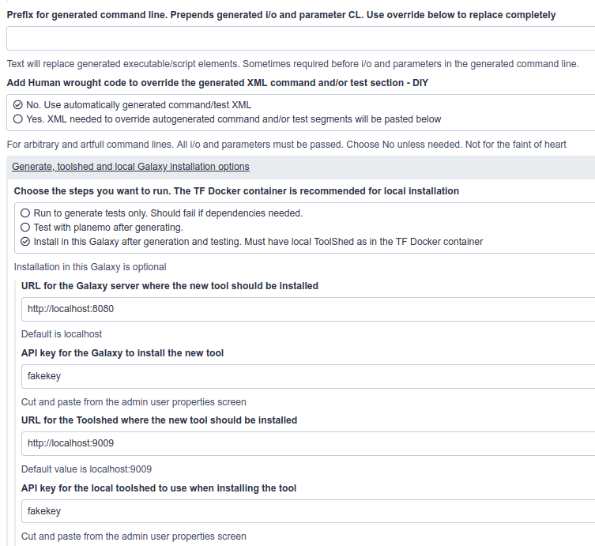
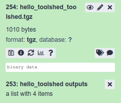
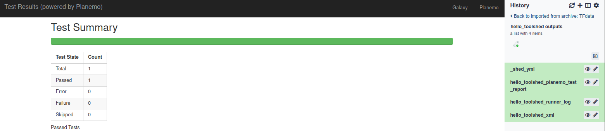

---

layout: tutorial_hands_on
logo: "GTN"
title: "Tool generation from simple scripts in Galaxy: the ToolFactory"
type: tutorial_hands_on
key_points:
  - The ToolFactory is a Galaxy tool for programmers and informaticians.
  - It can turn a working command line script into a proper Galaxy tool with a test in a few minutes.
  - It automatically generates simple, complete Galaxy tools from information provided by filling in a normal Galaxy form in the familiar UI.
  - Enjoy developing scripts in Galaxy using IEs but struggle to wrap even simple scripts at first because there is so much to learn and so little time? Try the TooLFactory (once you have a working command line version)
  - A script defines how parameters are read from the command line, allowing some of the ToolFactory's limited flexibility to be overcome.
  - The ToolFactory code generator is limited to relatively simple requirements but these are very common in small scale Galaxy analyses, particularly in new fields where few tools are already available.
  - Dedicated Galaxy tool developers use more powerful tools without limits but correspondingly more experience to master.
  - Those are needed to deal with many complicated Conda dependency requirements.
  - Please do not upload trivial tools to the main toolshed. Run your own local toolshed for trivial tools please.

objectives:
 - Learn why you might want to use the ToolFactory
 - Watch a video demonstration and explore the generated code - Hello Galaxy Training Network!
 - Run it locally using the option that best suits your needs and situation
 - Install and explore the simple examples provided
 - Modify and re-generate them to see how the changes affect the tool
 - Generate new simple Galaxy tools using your own scripts

questions:
 - What's the quickest way for a new-to-Galaxy developer to convert a functioning Galaxy IE script into a real workflow compatible, shareable tool?
 - Who might want to use the ToolFactory for quick tools from scripts?
 - How can I get the ToolFactory working locally, since you tell me it should never be exposed on a public server?

time_estimation: 1H

requirements:
  - type: "internal"
    topic_name: introduction
    tutorials:
      - galaxy-intro-short
      - galaxy-intro-101-everyone
    topic_name: dev
    tutorials:
      - tool-integration
      - interactive-environments

contributors:
  - fubar2

---

> ###  In need of pre-review sanity testing.
> - This is a beta tutorial release.
> - As yet unreviewed
> - Thank you for caring enough to take a look.
> - Sanity checking, testing and feedback are all needed. Please.
> - Fork is at https://github.com/fubar2/training-material
> - Introductory/passive material is now laid out for more comfortable reading - not in bullet-point form.
> - This is an aesthetic issue. It helps distinguish the passive/active tutorial sections. Advice appreciated.
> - enjoy....
>
{: .warning}


---

> ###  Check to see if this tutorial will be useful for your needs.
>
> * This tutorial is designed for informaticians and researchers working in Galaxy, who routinely develop their own analysis scripts.
> * It shows a quick way to bridge the gap between developing command line scripts and installing real tools in Galaxy
> * It is particularly useful for developers new to Galaxy from other scientific fields
> * Scientists using Galaxy who do not routinely use common scripting languages will find the hands-on part of this tutorial challenging.
> * Although the ToolFactory is a Galaxy tool, used through the Galaxy interface, bash and other command line scripting skills are needed to prepare the code that
generated tools run. No explicit instruction about scripting is offered.
> * Students will need to explore to find ways to use the ToolFactory for their work.  This tutorial is introductory and offers broad guidance only.
> * Experienced galaxy tool developers will not need this training because they already have specialised tools and training available to suit their needs.
{: .tip }


> ###  Brief note on tutorial design.
>
- This tutorial is suitable for Galaxy users who write code as part of their routine work.
- It is in 3 parts.
- The first part is all reading, with an optional demonstration video and a dissected `Hello World!` example
- It should help readers understand what the ToolFactory does so they can decide whether the training is relevant to their needs. A *sorting hat*.
- After that it's all hands on.
- The second part involves choosing how they would prefer to run the ToolFactory, installing it and importing the demonstrations in a sample history.
- The third part offers some tips and suggestions for exploring the demonstration tools and introduces some useful features.
- The sample tools are the core documentation. Hosting the ToolFactory on a public server is ill-advised, so an interactive tutorial is not possible.
- This is for developers and when they see the examples, they will be able to figure it out if they want to use it.
{: .tip}

# 1. Tools, tool wrappers and the ToolFactory in Galaxy.
{:.no_toc}


## Tools make Galaxy useful and attractive to scientists.
{: .no_toc}
Tools are the fundamental building blocks for analyses in Galaxy. Thousands are available in the project tool library. Tool execution is tightly constrained in that
user supplied parameters and data inputs exposed on the tool form are the only things that can be changed before execution. Everything else is fixed. The project supports
extensive software infrastructure for manually creating new tools including Planemo and the new Galaxy language server. These are complex and powerful.
New developers need time to come up to speed, but can then use them to generate new tools.

In stark contrast, Galaxy Interactive Environments allow unconstrained scripting in a Galaxy environment. They are popular and useful for skilled researchers
and developers, because they can write and run code inside Galaxy that is not available in any existing tool. Notebooks can be shared and reused but cannot run in
workflows and lack the formal reproducibility provided by dependency management built-in to real tools.

Working code developed in IE's can be converted into a command line script and tested using suitable small input data sets. Scripts for Galaxy tools can also be developed as
command line scripts from scratch. Once there is a working script and sample data, it may be possible to use them to create a new Galaxy tool in a few minutes, using a
special Galaxy tool that generates tools from scripts.

##### *The ToolFactory provides a quick route to a real Galaxy tool once a script is working correctly with test data on the command line.*

## The ToolFactory generates new Galaxy tools.
{: .no_toc}

The ToolFactory is an automated, form driven code generator. It runs in Galaxy as a typical Galaxy tool, except that it will only run for an administrative
user. This is a minimal security precaution (see warnings below). Any scripting language command line driven interpreter supported by Conda can be used. It was
developed for informaticians who need to create new "real" Galaxy tools for their users. Any user comfortable with scripting languages on a linux command
line may find it useful if they ever need a real Galaxy tool that wraps a working script.

Generated tools pass Planemo lint, and are functionally indistinguishable from equivalent manually written tools. They contain a test based on the test data provided
at tool generation. Working examples using Rscript, Python, bash, perl and sed are provided and described below. If you are a scientist/programmer or informatician new to Galaxy
and new to the dark arts of Galaxy tool building, this tutorial may be of help. It will show how to convert IE notebook or other scripts into real tools
quickly *inside* Galaxy using a Galaxy tool.


> ###  Note on alternatives to the ToolFactory:
>- Planemo can [generate tool XML](https://planemo.readthedocs.io/en/latest/writing_standalone.html) with an optional test.
>- Planemo is recommended for developers who will focus on Galaxy tools. Excellent documentation.
>- Widely used by experienced developers. Requires relatively little time to figure out - Galaxy tool syntax takes longer.
>- No GUI. Command line only. Can create archives with additional steps.
>- Need to pass all i/o and parameter details at once on the command line.
>- Takes longer to learn to use and less accessible to many users than a form driven GUI might be.
>- Manual XML editing required for selects and collections.
>- See the recommended next steps at the end of this tutorial for Planemo related training.
>- The ToolFactory uses planemo to generate test data and to run the test.
{: .tip }

---

## A dissected demonstration:`Hello World!` generated using the ToolFactory
{: .no_toc}

The ToolFactory can easily generate the ubiquitous `Hello World!` as a Galaxy tool. A parameter is added so the user can supply the text after "Hello..." and
the tool can write the combined string to a new history item. Trivial, but surprisingly useful as a model for more complex Galaxy tools so worth studying in detail. It is
implemented as a tool that wraps a bash script of one line - `echo "Hello $1!"` to echo the first parameter passed on the command line. This is surprisingly
useful as a model for many Galaxy tools with an extra parameter or two, as discussed below.

Watch a 6 minute [`Hello world` demonstration video](https://drive.google.com/file/d/1xpkcVGQ0jRdG78Kt-qLwqeFpE3RnSRsK/view?usp=sharing)
(Apologies for the poor quality - will try to make a shorter one.)

The form collects all the information needed for a new Galaxy tool. It is long and complex as a result. Much of what is collected is used to construct
a command line for the script when the generated tool runs. Other information such as the name and dependencies are needed to construct the relevant
sections of the generated XML file in the toolshed archive. The ToolFactory form configured to generate the `Hello` example can be viewed below.

> ###  ToolFactory form sections with annotation
>>>
>
> - **The first part of the form collects the new tool name and dependencies to be installed.**
> - In this case, no Conda dependency is used .
> - bash can be specified as a conda dependency, but it is not very version dependent and usually available on the
command line. Reproducibility is not an issue for this trivial example. When it is, specify the dependencies and their versions here and the generated tool will always use them.
> - The script pasted into the text box will emit a string including the first command line parameter - such as "Hello Galaxy Training Network"
> - This will be collected from STDOUT (configured below) into a new history output file (named and configured below)
> - Positional parameters are chosen so the first parameter on the command line will be emitted when the script runs.
>
> ---
>
>>> 
> - **The second section shows the new generated history output.**
> - It uses the special name `STDOUT` so the tool will take whatever the bash script writes and create a new text file called `Hello_output`
> - When the test is generated, the pass criterion is that the default value `Galaxy Training Network` should appear as the message in `hello_output`
with no difference. Other criteria including `sim_size` are available for the test applied to each output file.
> - There is no limit (other than your patience) to the number of new generated history outputs
> - Note that this example has no history input files. Again, any number of these can be specified on the form using the repeat
>
> ---
>
>>> 
> - **The third section shows the user supplied parameter to be passed in to the bash script on the command line**
> - It will be the first positional parameter because the ordinal position is 1. Argparse parameters are shown in other samples.
> - The help and label text for each input file and user defined parameter will appear on the generated tool form for the user so make them informative
> - This is where you can change the default from "World" to "Galaxy Training Network" on the sample provided and regenerate it to make a new tool later in the tutorial
>
> ---
>
>>> 
> - **The fourth section controls ToolFactory actions and optional outputs**
> - If you supply appropriate API keys, the ToolFactory can upload the newly generated tool to a toolshed. Optionally it can be installed
back into the Galaxy server specified.
> - *This is potentially annoying and dangerous if you have API keys you can misuse - so please be mindful*
>
{: .details }

Two new items are created in the history when the ToolFactory is executed - the new tool in an archive and a collection with log, XML and a planemo test report.

>###  History items created after a successful run
>> 
>> - The first item is a downloadable toolshed archive containing the tool and test ready to upload or install (see below on installing newly generated tools)
>> - The second item is a collection containing a test result, expanded in this image, the generated XML and log.
>> 
{: .details }


The generated tool XML (found in the collection and also in the archive) and the new tool form are well
worth some study. Text on the form is all in the XML and it all comes from the ToolFactory form.

>###  Generated XML and tool form
>
> [Galaxy XML documentation is here](https://docs.galaxyproject.org/en/latest/dev/schema.html)
>
> - Note how text from the form appears in the generated tool XML
>
>```xml
><tool name="hello_toolshed" id="hello_toolshed" version="0.01">
>  <!--Source in git at: https://github.com/fubar2/toolfactory-->
>  <!--Created by planemo@galaxyproject.org at 22/01/2021 13:48:27 using the Galaxy Tool Factory.-->
>  <description>Says hello</description>
>  <stdio>
>    <exit_code range="1:" level="fatal"/>
>  </stdio>
> <version_command><![CDATA[echo "0.01"]]></version_command>
> <command><![CDATA[bash
> $runme
> "$sayhelloto" > $Hello_output]]>
> </command>
>  <configfiles>
>    <configfile name="runme"><![CDATA[
> echo "Hello $1"
> ]]></configfile>
>  </configfiles>
>  <inputs>
>    <param label="Say hello to" help="" value="Galaxy Training Network!!" type="text" name="sayhelloto" argument="sayhelloto"/>
>  </inputs>
>  <outputs>
>    <data name="Hello_output" format="txt" label="Hello_output" hidden="false"/>
>  </outputs>
>  <tests>
>    <test>
>      <output name="Hello_output" value="Hello_output_sample" compare="diff" lines_diff="0"/>
>      <param name="sayhelloto" value="Galaxy Training Network!!"/>
>    </test>
>  </tests>
>  <help><![CDATA[
>
>**What it Does**
>
>ToolFactory demonstration - hello world in Galaxy
>
>
>
>------
>
>
>Script::
>
>    echo "Hello $1"
>
>]]></help>
>  <citations>
>    <citation type="doi">10.1093/bioinformatics/bts573</citation>
>  </citations>
></tool>
>```
> The form displayed when the generated Hello tool is executed is below.
> The user sees a text box to enter any string
> When executed, it will be echoed to a new history file called `Hello_output`
>
> 
{: .details}


> ###  If this is confusing...
>
> If you are not yet familiar with the basics of Galaxy tools covered in the `tool integration` tutorial, the example may seem confusing. You may gain more by reviewing that tutorial and then coming back here?
> It's a lot to learn and it is complicated. While a form driven code generator can hide much of the complexity of generating the code,
> the user must supply valid inputs for the code to be useful.
>
{: .tip}


---

## The ToolFactory supports users who routinely write command line scripts in their work.
{: .no_toc}

The ToolFactory can be found in the main ToolShed under the `tool-generators` category. It automates much of the work needed to prepare a
new Galaxy tool using information provided by the script writer,
on the ToolFactory form. The ToolFactory can wrap any simple script that runs correctly on the linux command line with some small test input samples. This is potentially
handy for developers new to Galaxy, and for Galaxy users who are capable of correctly scripting on the command line for themselves.


> ###  Under the hood:
>
>  - It uses galaxyxml to generate the tool XML from ToolFactory form settings.
>  - It uses Planemo to generate the test outputs
>  - Then again to test newly generated code
{: .tip}


> ###  Note on scope
> - Compared to the more usual shell and a text editor, The ToolFactory in Galaxy is a slow and clumsy way to debugging scripts. More than a minute per cycle because`planemo test` is run twice, building and tearing down a Galaxy each time.
> - **Starting a new ToolFactory tool with a know good command line and data** is strongly recommended. You will know exactly what to expect from the tool test for a first sanity check.
> - Corrolary: Unless there is a working script that needs to be wrapped into a toolshed-ready Galaxy tool, the ToolFactory is of little use.
{: .tip}


It works best wrapping simple R/Bash/Python and other interpreted scripts with a few user supplied parameters and a few i/o history files. Scripts are easier than some
Conda packages because they are easily modified to respond to default empty parameters as if they had not been passed. As a result, advanced tool building elements
such as conditionals and related tricks requiring manual coding, can often be avoided. On the other hand, many Conda dependencies will require XML conditionals
or other tool XML constructs that are not easy to generate automatically. While some simple requirements may be manageable, complex ones will not be suitable for the Toolfactory.

**The ToolFactory is for developers and informaticians not yet familiar with those far more flexible tools.**
**Scripts they need to wrap are frequently simple enough for the ToolFactory.**

Compared to other Galaxy tool development software, there is far less to learn in order to get up to speed when using a form driven, automated code generator. The
cost of this convenience is that ToolFactory is limited to automated generation of a large but limited subset of simple script and package wrappers.

---

# 2. Getting your hands on a ToolFactory for some hands-on training.
{: .no_toc}

#### Run the ToolFactory locally and adapt the sample tools

- If you found the introductory material presented so far relevant to your own needs, you may wish to start the DIY/hands-on part of the tutorial that follows
- Set up your own working ToolFactory, install the samples in a history and then start exploring it and figuring out how it might help your work.
- Depending on your preferences, install your own ToolFactory from one of the options described below.
- The sections after this can **only be completed with a working ToolFactory**.
- `persistence` is used in describing each option. It indicates whether the history recording all your ToolFactory work will still be there, next time you start working.
- Some options are not persistent. They are **recommended only for testing or teaching**.

>#### Active Tutorial content follows
>
> 1. TOC
> {:toc}
>
{: .agenda}

## Installation options

> ###  Security advisory!
>- *Please do not install the ToolFactory on a public server*
>- Although it will only run for administrative users, it allows unlimited scripting and that is a high security risk opportunity for any public facing machine.
>- In fact, Galaxy is very good at isolating tools to stop them doing mischief. But that's no reason to chance your arm. They keep inventing better mice.
>- Please install it locally as described below.
>- For this reason, the training materials can't make use of existing public Galaxy infrastructure like most of the GTN material.
>- Fortunately, there are a number of local installation alternatives to choose from, depending on how you prefer to work, described in the next section.
{: .warning}

#### 1. Install into an existing local non-docker development Galaxy

- Highly recommended if you already have, or want to start, a local disposable Galaxy server for development.
- Quick and easy.
- ToolFactory work will be persistent like any other jobs on that Galaxy.
    - Only local administrative users can successfully execute it
    - It will fail with an explanation for non-administrative users.
- If you have a private toolshed, you can configure the ToolFactory to upload new tools and then install them back to the host Galaxy.
- Provide the URL and API key for the toolshed and the Galaxy and choose the install after test option toward the end of the form.
    - This is good for seeing exactly what a user is going to work with.
    - It is quite feasible to rebuild the tool after edits to fix warts observed during testing.
- The Galaxy GUI is an odd choice for an IDE, but it works surprisingly well in practice for refining tools.

> ###  The normal ToolFactory will not run as a Galaxy tool in Docker!
> - The normal ToolFactory tool fails mysteriously when run as a tool in Galaxy under docker.
> - Option 2 uses a fork of Planemo. The ToolFactory works happily inside a Galaxy inside Planemo in Docker. Go Figure.
> - There is a [Docker compatible version of the ToolFactory you can use instead in Galaxy in Docker](https://github.com/fubar2/toolfactory_docker) that uses a biocontainer.
> - See option 4 below.
{: .warning}

See [the tutorial on installing tools from the toolshed](https://galaxyproject.org/admin/tools/add-tool-from-toolshed-tutorial)

> ###  Install the ToolFactory tool in an existing disposable development Galaxy
>
> 1. Log in to Galaxy as an administrative user
> 2. Select the`Admin` tab from the top bar in Galaxy;
> 3. Under the `Tool Management` option, select `Install and Uninstall - Search and install new tools and other Galaxy utilities from the Tool Shed. See the tutorial.`
> 2. Make sure the Main toolshed is selected so the entire category list is displayed. Choose the `Tool Generators` link.
> 3. Select `tool_factory_2 updated version of the tool factory`
> 3. Select `Install` for the first listed version - revision 119 at present.
> 4. Wait a few minutes - it takes some time for Conda to install all the dependencies
{: .details}

---

#### 2. Install in a virtual environment using the ToolFactory inside Planemo

- This method is recommended for testing the ToolFactory if :
    - you do not already run a development Galaxy
    - you do not wish to risk the health of your existing development Galaxy instance.
    - you have Python3, python3-venv, curl and git already installed. The script will complain until they are installed.
- Make a new (potentially throw away) directory for the Planemo installation - e.g. `mkdir tftute` and `cd tftute`
- Expose and copy the script below. Paste it into a file in the new directory and run it with `sh`.
- It will create a new Python virtual environment, download a fork of planemo and install a local copy of galaxy-dev.
- Edit the location of the galaxy directory `$GALDIR` and remove the code to download galaxy-dev if you already have a cloned Galaxy repository and wish to save time and space.
- It will take some time - so watch the Hello World demonstration while you wait.
- Your work is not persistent!
- The instance will be torn down when you exit Planemo
- Be sure to save your history - either as a history or exported as a workflow - before shutting down.
- After shutting down with `ctrl+C` only the last line of the script needs to be rerun to restart Planemo if the directory contents remain untouched.
- Newly generated tools can be tested in this setup as described below.
- It involves a restart of planemo and loss of all your unsaved work! Saving the new tool archive does not save the ToolFactory form settings.
- Saving the history or an extracted workflow for the new tool is necessary
- It is a good way to get a taste without much typing.

> ###  Sample script to install a local disposable ToolFactory in a planemo virtual environment
> > ###  Input: topics/dev/tutorials/tool-builders/docker/maketf.sh
> > ```bash
> > # GALDIR could be an existing dev directory, and the curl line could be commented out to save time
> > GALDIR="galaxy-central"
> > PDIR="planemo"
> > CDIR=`pwd`
> > git clone --recursive https://github.com/fubar2/planemo.git $PDIR
> > rm -rf $PDIR/docs
> > mkdir -p $GALDIR
> > curl -L -s https://github.com/galaxyproject/galaxy/archive/dev.tar.gz | tar xzf - --strip-components=1 -C $GALDIR
> > cp $PDIR/planemo_ext/welcome.html $GALDIR/static/welcome.html
> > cp $PDIR/planemo_ext/welcome.html $GALDIR/static/welcome.html.sample
> > mkdir -p $PDIR/mytools
> > cd $PDIR
> > python3 -m venv .venv
> > . .venv/bin/activate
> > python3 setup.py build
> > python3 setup.py install
> > cd $CDIR
> > planemo conda_init --conda_prefix $PDIR/con
> > planemo tool_factory --galaxy_root $GALDIR --port 9090 --host 0.0.0.0 --conda_prefix $PDIR/con
> > ```
> {: .code-in}
{: .details}

---

#### 3. Build a simple Docker container using the tutorial supplied Dockerfile

- This option may be attractive if you are comfortable with docker and do not have a handy development Galaxy
- Your work is not persistent so this is only useful for testing. Serious development needs persistence through a different method.
- The instance will be torn down when you stop the container.
- It might be possible to use a volume mount and persist Galaxy's data that way.
- Otherwise, when restarted, your previous work will all be gone.
- Be sure to save your history before shutting down or you will lose your work.
- The Docker script provided with this topic builds a different Galaxy from most GTN Docker containers.
- It does not include this tutorial.
- It runs planemo tool_factory for you and exposes it on `localhost:9090` so you can do all the same things as you
can with a local venv described above - but a little slower and isolated in a container.

> ###  Sample Dockerfile to build a simple version of the ToolFactory in Planemo
>
>  *See comments for build and run recipes*
>
> > ###  Input: topics/dev/tutorials/tool-generators/docker/Dockerfile
> > ```docker
> ># Galaxy - Using Galaxy tools to generate new Galaxy tools
> >#
> ># To build the docker image, go to root of the training repo and
> >#    docker build -t tool-generators -f topics/tool-generators/docker/Dockerfile .
> ># Take a break. Takes a while!
> ># To run image, make a mytools directory under where you want to run it regularly and then
> >#    docker run -p "9090:9090" -v mytools:/planemo/mytools/  -t tool-generators
> ># ToolFactory planemo will be available on localhost:9090
> ># Toolshed archives you generate can be unpacked under your mytools directory.
> ># They will be loaded by planemo into the Galaxy it runs and be available in the tool menu
> ># This allows you to load newly generated tools for testing and refinement.
> ># WARNING: Save your history as a history or lose your ToolFactory forms when you stop the container.
> ># `planemo --toolfactory` always starts with an empty history.
> ># A downloaded history can be imported into the new Planemo and the form regenerated by rerunning the job.
> ># Training material is not yet installed - not sure how to do that in Planemo ?
> >
> >FROM ubuntu:latest
> >
> >MAINTAINER Ross Lazarus
> >ENV TARGDIR "/galaxy-central"
> >ENV PDIR "/planemo"
> >RUN apt update -y -qq && apt install -y -qq python3-dev gcc python3-pip build-essential python3-venv python3-wheel nano curl wget git python3-setuptools gnupg curl mercurial \
> >&& python3 -m pip install --upgrade pip \
> >&& curl -sS https://dl.yarnpkg.com/debian/pubkey.gpg | apt-key add - \
> >&& apt upgrade -y \
> >&& mkdir -p $TARGDIR \
> >&& curl -L -s https://github.com/galaxyproject/galaxy/archive/dev.tar.gz | tar xzf - --strip-components=1 -C $TARGDIR \
> >&& git clone --recursive https://github.com/fubar2/planemo.git $PDIR \
> >&& cd $PDIR \
> >&& mkdir mytools \
> >&& rm -rf $PDIR/doc \
> >&& python3 setup.py build \
> >&& python3 setup.py install \
> >&& planemo conda_init --conda_prefix $PDIR/con \
> >&& hg clone https://fubar@toolshed.g2.bx.psu.edu/repos/fubar/tacrev  /planemo/tacrev \
> >&& planemo test --galaxy_root $TARGDIR /planemo/tacrev \
> >&& cp $TARGDIR/config/datatypes_conf.xml.sample $TARGDIR/config/datatypes_conf.xml \
> >&& sed -i 's/<\/registration>/<datatype extension="tgz" type="galaxy.datatypes.binary:Binary" subclass="true" mimetype="multipart\/x-gzip" display_in_upload="true"\/> <\/registration>/' $TARGDIR/config/datatypes_conf.xml \
> >&& sed -i 's/<datatype extension="html"/<datatype extension="html" display_in_upload="true"/' $TARGDIR/config/datatypes_conf.xml \
> >&& apt-get clean && apt-get purge \
> >&&  rm -rf /var/lib/apt/lists/* /tmp/* /var/tmp/*
> >ADD topics/tool-generators/docker/welcome.html $TARGDIR/static/welcome.html.sample
> >ADD topics/tool-generators/docker/welcome.html $TARGDIR/static/welcome.html
> >
> >
> >ENV GALAXY_CONFIG_BRAND "ToolFactory in Planemo"
> >EXPOSE 9090
> >ENTRYPOINT ["/usr/local/bin/planemo" ,"tool_factory", "--galaxy_root" ,"/galaxy-central", "--port", "9090", "--host", "0.0.0.0", "--conda_prefix", "/planemo/con", "--extra_tools", "/planemo/mytools"]
```
> {: .code-in}
{: .details}

---

#### 4. Install the ToolFactory docker container with integrated toolshed

- There is a more complex but integrated solution using the [ToolFactory docker container](https://github.com/fubar2/toolfactory-galaxy-docker).
- Installation is documented in the respository and bash scripts to build and run the Docker image are provided. They will probably need to be adjusted as described there.
- It provides an inbuilt toolshed and allows tools to be installed and used in the Galaxy used to run the ToolFactory.
- Like installation in a local Galaxy server, the docker container can be persisted as shown in the documentation for docker-galaxy-stable upon which it is based.

---

## Import ToolFactory functional documentation - the demonstration tools.

- Congratulations on getting this far and acquiring a local instance of the ToolFactory
- There is a history you should import that shows some sample tools
- You can examine how these were generated by using the Galaxy job redo button.
- This will show you the fully completed ToolFactory form used to generate the sample
- You can edit the form and regenerate a new tool with your changes incorporated.


> ###  Note!
> - This is the **first step** recommended after any of the installation options above until you are comfortable using the ToolFactory
> - It will give access to some sample ToolFactory tools that can be used to learn how the ToolFactory works
> - It provides functional documentation and is not needed once you are comfortable using the ToolFactory.
> - It is pre-installed in the [ToolFactory docker container](https://github.com/fubar2/toolfactory-galaxy-docker)
{: .comment}


- Use this [zenodo link](https://zenodo.org/record/4542837/files/planemo_demohistory_jan23.tar.gz?download=1).
- Copy it and paste it into the URL box on the screen for importing a remote history.
- The link is also on the welcome page of the virtualenv Planemo installation described above.

> ###  Hands-on: Steps to use that URL to import the history
>
> 1. Select the`User` tab from the top bar in Galaxy;
> 2. Select `Histories`
> 3. Select `Import`
> 4. Paste the URL into the URL field and press `import`
{: .hands_on}


- It will take a few minutes to import.
- Get up and have a stretch for a minute.
- When it's complete, select the link to view histories and switch to the new one.
- You will see a large number of pairs of history items and 4 data files used for testing.
- Each pair comprises a toolshed ready archive containing a generated tool and a test, and a collection including a Planemo test report, the tool XML and a job log.
- The archive history object has a circular "redo" button. Click that button and the ToolFactory form that generated the sample tool will appear. You can see how the tool was
built using the ToolFactory's limited capacities. Most of them are trivial of course. They are meant to be models rather than useful examples.

---

# 3. Hands-on: Learning to use the ToolFactory


> ###  Exploring the sample tools by regenerating their original ToolFactory forms
>
> * With the ToolFactory working and the sample history active as described above
> * Select any of the generated toolshed archive history items.
> * This should open the item details up, so you can see the circular "redo" button
> * Click that button - the ToolFactory form that generated that tool will appear.
> * Examine the form settings used to generate the tool.
> * Try changing names or prompts. Add new parameters or inputs/outputs; press `execute`; check the new version of the tool
> * For example, change the default for the Hello example to `Galaxy Training Network` and generate an updated version.
{: .hands_on}


The best way to explore the kinds of tasks that can be achieved with simple scripts is to take a look at each sample tool. Note how the various
options have been configured and what kinds of scripts this could be used for in your work. The example script can be swapped out for another one known to work and additional
new parameters added to suit, to extend the toy examples and create tools of use to your users. Change the tool name on the newly edited form, press `execute` and
rerun the job to generate a new toolshed archive and test report collection.

Consider the trivial `Hello World!` tool example. It is readily extended to suit many situations where a tool is needed quickly for a workflow. Try adding another parameter.
For example, the planemo `lint` and `test` tool examples (described below) can be derived by adding a history toolshed archive as input, plus a few more lines of bash script.
In practice, it's a flexible basis for generating many simple tools.

> ###  Summary: details needed and how they are used to generate a new tool
>
> #### What information is needed to generate a tool ?
>
> The code generator requires enough detail to be able to create the appropriate command line
> template to call the script or executable and pass the required file paths and other settings correctly.
> Small input samples and default settings are used to construct a test for the newly generated tool. These should be known to work with the script, having been used to debug
> the script on the command line. Upload the samples to the current history before
> starting a new tool in the ToolFactory. No tool will be generated without sample inputs. This test becomes part of the XML and of the toolshed archive.
> The outputs from running the script during the first planemo run become sample outputs to be compared with test outputs in the archive.
>
> In addition to an ID and name, a tool may have any combination of:
>
> - Multiple dependencies. Conda is currently supported. System utilities can be used assuming the target server exposes them to tools, or they can be provided as Conda dependencies to ensure they will always be available
> - Argparse (named) or positional (ordered) style parameter passing at tool execution time depending on the script requirements. Positional works well for bash scripts with only a handful of parameters. Argparse is preferred for clarity.
> - Unlimited individual input data files to be selected from the user's history.
> - Unlimited individual output files to be written to the user's history, paths determined at tool execution.
> - Unlimited additional command line parameters that the user can control on the new tool form.
> - an (optional) script to execute. Running a script to call an executable using parameters passed from the user can be useful to overcome some limitations of the ToolFactory for more complex tools.
>
> Many of these generate parameter input boxes and history data selects on the new tool form. Metadata about command line formatting together with text strings for the form seen by the user are needed.
>
> Many of these are components of the generated command line template. This can be seen in the new tool XML. Galaxy file paths for the script are only determined at generated tool execution. The generated template ensures that these are correct.
>
> #### The Galaxy UI imposes additional limits
>
> The ToolFactory has limited flexibility and works best for simple tools. Even then, the form becomes complicated as more parameters are added. Tools can have unlimited numbers of some items,
> including input files, output files, citations and user parameters. Each one has half a dozen metadata or text details. Galaxy form repeats are used for those.
> As more repeats are added, the Galaxy UI becomes increasingly unwieldy.
> In theory, the Toolfactory can potentially generate very complicated tools with large numbers if inputs, outputs and user modifiable parameters.
> Great patience would be required. That is why manual methods are likely more productive for complicated requirements.
>
>
{: .details}


Galaxy can be used as a tool development environment for users who can write their own scripts as shown in this process overview slide

> ###  Overview of the ToolFactory development cycle process
>
> - Start by confirming that your script correctly processes the sample inputs on the command line using the default parameters you will supply.
> - Upload all the sample inputs needed for your script. These *must be in the history* where you are working when you start the Toolfactory or you will not be able to add them as inputs to the form - they are required so make sure they are available before you start.
> - Create a tool by providing the information categories (bottom of the slide) represented on the ToolFactory form - dependencies, history i/o, help, additional parameters...
> - Execute the generator - fix errors and repeat if necessary
> - Examine the new tool and decide on edits or changes - see below for hints on installing new tools depending on how the ToolFactory has been deployed
> - Use the Redo button on the toolshed archive history item to recreate the ToolFactory form that generated the last version
> - Make changes and generate an updated version
> - Rinse, repeat...
> - Galaxy can be used as an Integrated Development Environment for tools - clunky but oddly satisfying. Note this is distinct from debugging the script - that is not at all satisfying in Galaxy unless you like waiting for jobs to finish. A shell is much better for that.
>
>> 
{: .details}

---

## ToolFactory tips and tricks illustrated by some of the examples.

#### Before you begin a new tool

- Make sure it runs correctly on a command line with your sample inputs and default parameter settings. That is how the test will be generated.
- You cannot specify any inputs on the form without providing samples, and those samples must run correctly, with the supplied defaults.
- Easiest to make sure those samples are in the history before you begin.
- Be well prepared. The ToolFactory cannot do that preparation for  you.

#### STDIN and STDOUT

- Demonstration tools often capture output from a bash script using the special STDOUT designation for output files
- This can save sending the output path as a parameter to the script or executable
- STDIN is also available as a special designation for history inputs if the script takes input from STDIN when it runs.
- The option `Tool reads selected input file from STDIN and writes STDOUT with no parameters` in the parameter passing model
selection list will generate a simple filter tool, executing a script or Conda dependency with input on STDIN and output on STDOUT
for those rare situations where that's all you need. No i/o or other parameters for the user to set. Used in the tacrev demonstration tool.

#### Repeats in the ToolFactory form permit any number of parameters.

- Inputs, outputs and additional user parameters are all presented within repeat elements on the form.
- Repeats are unlimited in number for any given tool from a technical perspective
- The limit is having the patience to create them in the relatively clumsy Galaxy UI.
- A handful is manageable but there are no technical limits to the actual total number
- Repeats *on the generated tool form* are not (at present) supported in the ToolFactory but should be doable if galaxyxml supports them.


#### Command over-ride and test over-ride

- There are two simple BWA wrappers based on a Planemo documentation advanced example
- One uses a command over-ride pasted into the appropriate text box on the ToolFactory form
- This was based on the one shown in the example it is copied from.
- It allows templating - `$foo` is interpreted by mako.
- The pasted over-ride completely replaces the galaxyxml generated ones.

> ###  `bwa_test_command_override` sample - the command override
>> ToolFactory command over-ride section adapted from the Planemo BWA example.
>>
>>```
>> ## Build reference
>>#set $reference_fasta_filename = "localref.fa"
>>ln -s "${ref_file}" "${reference_fasta_filename}" ;
>>bwa index -a is "${reference_fasta_filename}" ;
>>bwa mem -t "\${GALAXY_SLOTS:-4}" -v 1 "${reference_fasta_filename}" "${fastq_input1}"  | samtools view -Sb - > temporary_bam_file.bam ;
>>samtools sort -o "${bwa_test_commover_bam_output}" temporary_bam_file.bam
>>```
{: .details}

- There is another sample bwa_test tool that achieves the same results using a bash script.
- It does not need a command over-ride but is more typing because three positional parameters are named for readability.
- Bash is probably more familiar to many ToolFactory users than mako templating.
- The effects of templating the command line can usually be achieved using bash or Python at the expense of needing to script the handling of parameters.

> ###  `bwa_test_toolfactory_positional_bash` sample alternative.
>> ToolFactory form bash script to replace above command over-ride section:
>>
>>```
>>REFFILE=$1
>>FASTQ=$2
>>BAMOUT=$3
>>rm -f "refalias"
>>ln -s "$REFFILE" "refalias"
>>bwa index -a is "refalias"
>>bwa mem -t "2"  -v 1 "refalias" "$FASTQ"  > tempsam
>>samtools view -Sb tempsam > temporary_bam_file.bam
>>samtools sort -o "$BAMOUT" temporary_bam_file.bam
>>```
{: .details}


- Most users may never need to use the command over-ride option to access templating for wrapping their own scripts where they control the command line interpretation.
- Where the generated test is not sufficient, a hand written one can be substituted. Not needed for the simple BWA example.
- Test or command over-rides are likely to be edge cases more suited to the alternate, more powerful tools.

#### ToolFactory collection outputs are handy for hiding dozens of tool outputs in a single history item

- The plotter example uses an Rscript.
- It generates as many pairs of random plots as you want.
- The script sends them into the the collection that appears in the history after the job runs.
- The user's history shows only one new item after it runs.
- That is a collection. When selected, objects linked to each plot will be listed for viewing.

> ###  `plotter` collection output demonstration tool form, generated XML and outputs
> >
> >Collections are a special kind of new history output. The ToolFactory can only generate list collections - not structured collections. They can hide an
> > unlimited number of different kinds of script output files, such as images or reports, in a single history item to save clutter. Typically these are not used as
> > inputs to downstream analyses and belong together from the user's perspective. The ToolFactory form for the plotter example tool
> > is configured as shown below, from "rerunning" the plotter job from the sample history.
> >
> >
> >
> > The Rscript is contained in a configfile so`#` is escaped - this is automatic.
> >
> >```xml
> ><tool name="plotter" id="plotter" version="0.01">
> >  <!--Source in git at: https://github.com/fubar2/toolfactory-->
> >  <!--Created by admin@galaxy.org at 24/01/2021 05:02:33 using the Galaxy Tool Factory.-->
> >  <description>ToolFactory collection demonstration - random plots</description>
> >  <requirements>
> >    <requirement version="" type="package">r-base</requirement>
> >  </requirements>
> >  <stdio>
> >    <exit_code range="1:" level="fatal"/>
> >  </stdio>
> >  <version_command><![CDATA[echo "0.01"]]></version_command>
> >  <command><![CDATA[Rscript
> >$runme
> >"$nplot"]]></command>
> >  <configfiles>
> >    <configfile name="runme"><![CDATA[
> >\# demo
> >args = commandArgs(trailingOnly=TRUE)
> >if (length(args)==0) {
> >   n_plots = 3
> >} else {
> >   n_plots = as.integer(args[1]) }
> >dir.create('plots')
> >for (i in 1:n_plots) {
> >    foo = runif(100)
> >    bar = rnorm(100)
> >    bar = foo + 0.05*bar
> >    pdf(paste('plots/yet',i,"anotherplot.pdf",sep='_'))
> >    plot(foo,bar,main=paste("Foo by Bar plot \#",i),col="maroon", pch=3,cex=0.6)
> >    dev.off()
> >    foo = data.frame(a=runif(100),b=runif(100),c=runif(100),d=runif(100),e=runif(100),f=runif(100))
> >    bar = as.matrix(foo)
> >    pdf(paste('plots/yet',i,"anotherheatmap.pdf",sep='_'))
> >    heatmap(bar,main='Random Heatmap')
> >    dev.off()
> >}
> >
> >]]></configfile>
> >  </configfiles>
> >  <inputs>
> >    <param label="Number of random plots pairs to draw" help="" value="3" type="text" name="nplot" argument="nplot"/>
> >  </inputs>
> >  <outputs>
> >    <collection name="plots" type="list" label="Plots">
> >      <discover_datasets pattern="__name_and_ext__" directory="plots" visible="false"/>
> >    </collection>
> >  </outputs>
> >
> >
> >  <tests>
> >    <test>
> >      <param name="nplot" value="3" />
> >      <output_collection name="plots" type="list">
> >     <element file="yet_1_anotherplot_sample" name="yet_1_anotherplot" ftype="pdf" compare="sim_size" delta_frac="0.05"/>
> >    </output_collection>
> > </test>
> >  </tests>
>>
>>
> >
> >  <help><![CDATA[
> >
> >**What it Does**
> >
> >Draws as many random plot pairs as you need
> >
> >
> >
> >------
> >
> >
> >Script::
> >
> >    # demo
> >    args = commandArgs(trailingOnly=TRUE)
> >    if (length(args)==0) {
> >       n_plots = 3
> >    } else {
> >       n_plots = as.integer(args[1]) }
> >    dir.create('plots')
> >    for (i in 1:n_plots) {
> >        foo = runif(100)
> >        bar = rnorm(100)
> >        bar = foo + 0.05*bar
> >        pdf(paste('plots/yet',i,"anotherplot.pdf",sep='_'))
> >        plot(foo,bar,main=paste("Foo by Bar plot #",i),col="maroon", pch=3,cex=0.6)
> >        dev.off()
> >        foo = data.frame(a=runif(100),b=runif(100),c=runif(100),d=runif(100),e=runif(100),f=runif(100))
> >        bar = as.matrix(foo)
> >        pdf(paste('plots/yet',i,"anotherheatmap.pdf",sep='_'))
> >        heatmap(bar,main='Random Heatmap')
> >        dev.off()
> >    }
> >
> >]]></help>
> >  <citations>
> >    <citation type="doi">10.1093/bioinformatics/bts573</citation>
> >  </citations>
> ></tool>
>>```
>> After requesting 25 pairs of plots from the sample tool, a collection appears in the history and is shown below.
>> One of them is displayed by clicking the "eye" icon.
>> Collections are ideal for messy analysis reporting outputs such as images, pdfs and other material that is not useful as an input to a downstream tool.
>> It is material that the user will want kept together, so a single history item is ideal to avoid unnecessary clutter.
>> As shown above, the script only has to write the files to a directory.
>> Note that the test is over-ridden in the ToolFactory form to generate this tool because I could not get it to test correctly otherwise.
>>
>>
>>
{: .details}

#### Selects as user supplied parameters

- Additional parameter types are selected from a drop down list. It includes text, numeric and select parameters.
- Selects offer a list of prespecified options to the user.
- There is a repeat on the ToolFactory form to collect options as pairs of names/values.
- It is clumsy and suitable only for a limited number of options.
- Galaxyxml generates appropriate select parameters on the generated tool as shown in the select demonstration tool.

> ###  `select_test` select field demonstration tool generated XML
>>
>>The ToolFactory form section for user configurable command line settings is
>> configured as shown here for the select demonstration
>>
>>
> >
>>The generated XML is shown below.
> >
> >```xml
> ><tool name="select_test" id="select_test" version="0.01">
> >  <!--Source in git at: https://github.com/fubar2/toolfactory-->
> >  <!--Created by admin@galaxy.org at 24/01/2021 05:03:21 using the Galaxy Tool Factory.-->
> >  <description>ToolFactory select demonstration</description>
> >  <stdio>
> >    <exit_code range="1:" level="fatal"/>
> >  </stdio>
> >  <version_command><![CDATA[echo "0.01"]]></version_command>
> >  <command><![CDATA[bash
> >$runme
> >"$choose"
> >>
> >$select_out]]></command>
> >  <configfiles>
> >    <configfile name="runme"><![CDATA[
> >echo "You chose \$1"
> >]]></configfile>
> >  </configfiles>
> >  <inputs>
> >    <param label="Choose" help="" type="select" name="choose" argument="choose">
> >      <option value="won">one</option>
> >      <option value="too">two</option>
> >      <option value="free">three</option>
> >    </param>
> >  </inputs>
> >  <outputs>
> >    <data name="select_out" format="txt" label="select_out" hidden="false"/>
> >  </outputs>
> >  <tests>
> >    <test>
> >      <output name="select_out" value="select_out_sample" compare="diff" lines_diff="0"/>
> >      <param name="choose" value="won"/>
> >    </test>
> >  </tests>
> >  <help><![CDATA[
> >
> >**What it Does**
> >
> >Echos your selection
> >
> >
> >
> >------
> >
> >
> >Script::
> >
> >    echo "You chose $1"
> >
> >]]></help>
> >  <citations>
> >    <citation type="doi">10.1093/bioinformatics/bts573</citation>
> >  </citations>
> ></tool>
> >```
> > The generated tool form from the select demonstration shows the three options and returns the one selected.
> >
> >
{: .details}


#### The ToolFactory can wrap some Conda packages correctly using a simple wrapper script to work around limitations.

- There are two demonstration tools that use Planemo as a Conda dependency
- One runs `planemo test...` and the other `planemo lint....` on toolshed archives in a history
- The linter XML is available below. It's a variant of the Hello example in using a bash script.
- Instead of echo "Hello $1", it takes an input toolshed archive and writes the planemo lint output to STDOUT with this script pasted into the box:

```
cp \$1 foo.tar
tar -xvf foo.tar
TOOLNAME=`find . -name "*.xml"`
planemo lint $TOOLNAME >> $2
```

- The ToolFactory makes exposing these Planemo functions as Galaxy tools fairly easy.
- Similarly tractable Conda dependencies are also potential candidates for being quickly wrapped as tools

> ###  `planemo lint` demonstration tool generated XML
> >```xml
> ><tool name="planemo_lint" id="planemo_lint" version="0.01">
> >  <!--Source in git at: https://github.com/fubar2/toolfactory-->
> >  <!--Created by planemo@galaxyproject.org at 08/01/2021 17:34:35 using the Galaxy Tool Factory.-->
> >  <description>Lints a ToolFactory or other xml using planemo</description>
> >  <requirements>
> >    <requirement version="0.74.1" type="package">planemo</requirement>
> >  </requirements>
> >  <stdio>
> >    <exit_code range="1:" level="fatal"/>
> >  </stdio>
> >  <version_command><![CDATA[echo "0.01"]]></version_command>
> >  <command><![CDATA[bash
> >$runme
> >$input1
> >$lint_output]]></command>
> >  <configfiles>
> >    <configfile name="runme"><![CDATA[
> >cp \$1 foo.tar
> >tar -xvf foo.tar
> >TOOLNAME=`find . -name "*.xml"`
> >planemo lint \$TOOLNAME >> \$2
> >]]></configfile>
> >  </configfiles>
> >  <inputs>
> >    <param optional="false" label="Toolshed archive to be linted" help="" format="tgz" multiple="false" type="data" name="input1" argument="input1"/>
> >  </inputs>
> >  <outputs>
> >    <data name="lint_output" format="txt" label="lint_output" hidden="false"/>
> >  </outputs>
> >  <tests>
> >    <test>
> >      <output name="lint_output" value="lint_output_sample" compare="diff" lines_diff="5"/>
> >      <param name="input1" value="input1_sample"/>
> >    </test>
> >  </tests>
> >  <help><![CDATA[
> >
> >*What it Does**
> >
> >planemo lint
> >
> >-----
> >
> >Script::
> >
> >  cp $1 foo.tar
> >  tar -xvf foo.tar
> >  TOOLNAME=`find . -name "*.xml"`
> >  echo "$$$$$TOOLNAME = $TOOLNAME" > $2
> >  planemo lint $TOOLNAME >> $2
> >
> >]></help>
> ><citations>
> >  <citation type="doi">10.1093/bioinformatics/bts573</citation>
> ></citations>
> >/tool>
>>
>>```
{: .details}

---

## Limits and workarounds

- The ToolFactory is an automated code generator.
- No generator can replace manual editing by a skilled developer other than in constrained, simple cases.
- These are common enough in the daily work of most data intensive scientific fields to make a tool generator potentially worth keeping handy.
- For simple scripts and appropriate Conda packages, it's potentially very useful.
- It is not hard to imagine using a Python wrapper to finesse more complex tools just as bash was used in the `planemo lint` example.
- The ToolFactory, if in a persistent form, is a slightly clumsy but useable way to create and maintain Galaxy tools.
- Tools can have command-override and test-override pasted in as in one of the BWA samples. This can solve some of the limitations. However, if the package requires that kind of complexity, it might be better to prepare the wrapper manually.

---
## Running your newly generated tools

#### Using the ToolFactory installed directly into a development instance
- Requires a private toolshed.
- DO NOT use any public toolshed for trivial tools

> ###  Hands-on: Loading new generated tools in a normal development Galaxy
>
> - You need a local toolshed that the Galaxy server is configured to talk to in `config/tool_sheds_conf.xml`
> - Edit the default tool_shed.yml admin_users email to suit your needs - default is admin@galaxy.org.
> - From the Galaxy root, `sh run_tool_shed.sh` should start one on `localhost:9009`
> - The Galaxy config/tool_shed_conf.xml must include this local toolshed for it to appear on the administrative drop down available toolshed list
> - Register and login as the administrator and create some categories. Tools don't seem to appear without them.
> - Make a new repository, add categories and upload the new toolshed archive
> - In the `Admin` menu, search for the new tool in your local toolshed and then choose `install`
> - If the new tool does not appear in the Galaxy admin interface, you may need to get whoosh reindexing your toolshed. It's a pain.
       - This and other challenges are resolved in the specialised [ToolFactory docker container](https://github.com/fubar2/toolfactory-galaxy-docker)
> - Refresh the tool menu when installation is complete
{: .hands_on}


#### Using Planemo in a virtual environment or GTN docker container

> ###  Hands-on: Loading new generated tools in a venv or docker ToolFactory in Planemo
>
> - Download the toolshed archive from the Galaxy history where you generated the tool.
> - Unpack the archive into the planemo/mytools directory. It should appear as a single directory containing a test-data subdirectory and the new tool xml.
> - Stop planemo - `^c` will do it somewhat messily
> - Restart planemo with an additional parameter `--extra_tools planemo/mytools/`
> - The new tool should be ready to test on the tool menu
{: .hands_on}


---

## Uploading generated archives to toolsheds


> ###  Trivial tools do not belong in the public toolsheds!
>- *Please do not upload trivial tools to the main ToolShed!*
>- The ToolFactory provides an option to upload a newly built tool to a toolshed. This was designed for the persistent docker option but works in the
planemo tool_factory.
>- Please do not abuse it by adding trivial tools to confuse users looking for useful tools.
{: .warning}


- The [ToolFactory docker container](https://github.com/fubar2/toolfactory-galaxy-docker) includes a local toolshed
- This allows new tools to be automatically installed back into the Galaxy running the ToolFactory.
- Please run your own local toolshed for trivial tools that are so simple or specialised that they are not likely to ever be useful for other scientists
- Uploading them to the main ToolShed is unlikely to help anyone

---


# Please help improve this community resource
- tell Ross (ross.lazarus@gmail.com) what went well and what could be improved for the benefit of future students
- This tutorial has had almost no testing yet.
- It is in pre-review.
- A PR will soon appear once we get the showstoppers sorted.
- Please use the fork at https://github.com/fubar2/training-material for issues and pull requests for the nonce.
- The ToolFactory has had little testing in the present form so expect many bugs
- If the ToolFactory works well for you, please tell your friends.
- If you find bugs, please tell me by raising an issue at https://github.com/fubar2/toolfactory, or better, a pull request with the fix :)


# Acknowledgements
- Thanks to Marius van den Beek for thoughtful comments on the role of the ToolFactory that helped motivate the design and construction of this tutorial.

