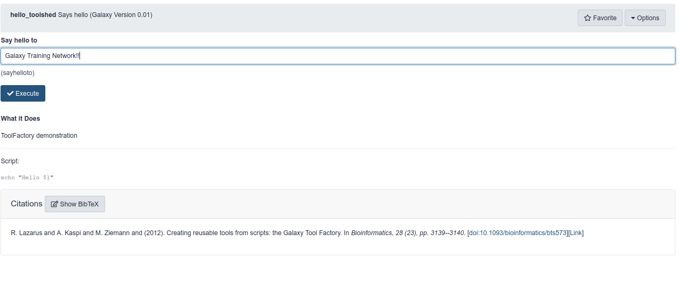
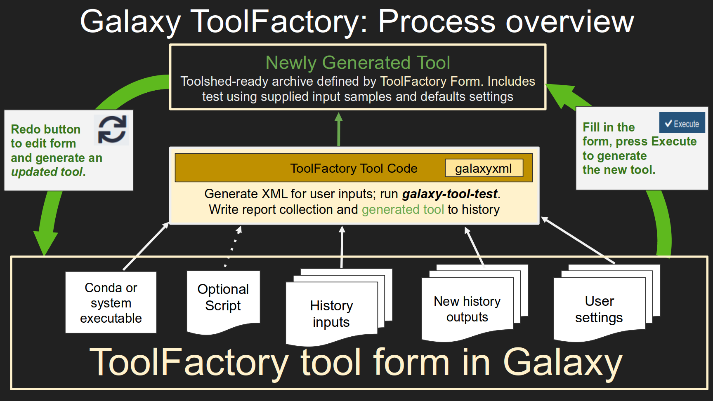

---

layout: tutorial_hands_on
title: "ToolFactory: Generating Tools From Simple Scripts"
key_points:
  - The ToolFactory is a fully automated Galaxy tool generator for scientists and developers who routinely write command line scripts.
  - It can turn a working command line script into a proper Galaxy tool with a test in a few minutes.
  - It automatically generates simple, complete Galaxy tools from information provided by filling in a normal Galaxy form in the familiar UI.
  - It is installed as a docker-galaxy-stable flavour - the ToolFactory Appliance.
  - The Appliance is a Galaxy server running in Docker, suited to any modern Linux workstation or high-end laptop.
  - Useful for learning about system administration or framework code, and for developing tools - all on your own private pop-up server.

objectives:
 - Learn why you might want to use the ToolFactory Appliance
 - Watch a video demonstration and explore the generated code - Hello Galaxy Training Network!
 - Run it locally in Docker.
 - Install and explore the simple examples provided.
 - Modify and re-generate them to see how the changes affect the tool
 - Generate new simple Galaxy tools using your own scripts

questions:
 - What options exist for new-to-Galaxy developers to convert functioning command line scripts into Galaxy tools?
 - Can any command line script I've written be wrapped as a Galaxy tool?
 - Can I make a tool from a script developed in a Galaxy Interactive Environment notebook?
 - How can I get the ToolFactory working locally, since you tell me it should never be exposed on a public server?
 - What is the difference between a hand-crafted tool and a ToolFactory generated one?

time_estimation: 1H
subtopic: tooldev

requirements:
  - type: "internal"
    topic_name: introduction
    tutorials:
      - galaxy-intro-short
      - galaxy-intro-101-everyone
  - type: "internal"
    topic_name: dev
    tutorials:
      - tool-integration
      - interactive-environments

follow_up_training:
  - type: "internal"
    topic_name: dev
    tutorials:
      - tool-generators-advanced

contributors:
  - fubar2
  - hexylena
---

The Toolfactory and these tutorials are for developers and researchers learning about Galaxy, who routinely develop their own analysis scripts using
bash, Python, Perl, Rscript or other common scientific scripting languages. The tutorials show a convenient way to bridge the gap between a
working command line script and a new tool that "wraps" that script so users can use it like any other tool in Galaxy.

The ToolFactory is a Galaxy tool. Tools are constructed through the normal Galaxy interface when it is run. It is distributed as the ToolFactory Appliance,
ready to run on a developer linux workstation using Docker. Generated tools are *immediately installed* and ready to run so you can see
what the end user will see. Jobs can be re-run to edit and update generated tools, so Galaxy becomes an integrated development environment for Galaxy tools.

A [`Hello Galaxy!` demonstration](https://youtu.be//DK1eKz5TRs4) using the ToolFactory is available if you'd like to see a walk-through of some of
the hands-on material in this tutorial. You can see whether it looks useful for your work and decide whether to read the material below.

This first tutorial is a slow introduction. For some developers, it may be too slow and the second tutorial may be a better place to start. This one steps
in some detail through the process of using the ToolFactory
to generate `Hello World!` style simple demonstration Galaxy tools.

The reader will soon learn if it might be adapted to their work. If so, an [Advanced ToolFactory tutorial]() is
available if the material here is relevant to your needs and you would like to learn more details about the different kinds of tools and features the ToolFactory offers.

Experienced galaxy tool developers already have specialised tools and training so may not gain much from this material.
Users new to Galaxy from other scientific disciplines not yet familiar with the manual tool development process,
may find the ToolFactory appliance useful for familiarising themselves with tool development in Galaxy.


> <agenda-title></agenda-title>
>
> 1. TOC
> {:toc}
>
{: .agenda}

# Tools, tool wrappers and the ToolFactory in Galaxy.

Tools are the fundamental building blocks for analyses in Galaxy. Thousands are available in the [project tool library](https://toolshed.g2.bx.psu.edu) from
many different kinds of science. Galaxy
tools can be created from almost any Linux command line software packages or interpreter scripts. What happens
at tool execution is decoupled from the framework itself, so the framework is indifferent to scientific discipline or coding language.
This is one reason for rapid uptake in new data intensive scientific areas. In many cases, growing sets of discipline specific tools are attracting
whole new communities of scientists into the Galaxy community.

Tool execution is tightly constrained and secured. The only things that can be changed
before execution are tool form exposed user-controlled settings, and data input selections. Everything else is fixed.
This is ideal for non-programmer Galaxy users who rely on prepared tools for their work. Tools are
utterly predictable, to the point of being about as reproducible as any useful complex computing component is likely to be.
This is one of the strengths of the Galaxy framework for users requiring reproducible and shareable scientific analyses.

## Galaxy Interactive Tools and Interactive Environments (GxIT/GIE)

In contrast to tools, GIE allow unconstrained scripting in a Galaxy environment. They offer complete freedom from the constraints of existing tools for
appropriately skilled researchers and developers, because they allow code to run inside Galaxy that is not available in any existing tool.
These can be shared and reused and GIE can now be run in workflows.

If a shareable tool that performs exactly the same functions as a GIE script is needed, the code can be extracted and turned into a parameterised command line script.
Any functional script can be turned into a typical Galaxy tool.

## Pathways from scripts to tools

Any command line script that runs correctly with sample test data input files and parameter settings can be turned into a Galaxy tool.
These may be derived from notebook scripts that have been consolidated and rewritten to take positional or argparse style parameters and tested
in a shell using small data input files. Alternatively, skilled users can develop scripts and test them using small input data files on the command line
without using Galaxy.

The Galaxy developers support extensive software infrastructure for manually creating new tools including Planemo and the new Galaxy language server.
These are complex and powerful with substantial
learning curves but can be used to turn almost any software package into a tool.

For those new to Galaxy, in many simple cases, it may be possible to generate a new tool "wrapping" a script in a few minutes, using a
specialised Galaxy tool for developers that generates tools.

This tutorial introduces that unusual tool.

---

# The ToolFactory Appliance

The ToolFactory implements an automated, form driven wrapper code generator, and an installer for newly generated tools so you can try them straight away
in Galaxy. The ToolFactory is distributed as a Docker appliance and can be "popped up" and ready to run in a few minutes - well, 5 or 10 perhaps.

> <tip-title>The ToolFactory appliance provides a fully featured Galaxy server.</tip-title>
> - It is a private local desktop Galaxy server, ideal for tinkering and experimentation, learning how the Galaxy server works and for developing new tools for new kinds of scientists using Galaxy.
> - Any Galaxy tool from the toolshed can be installed and used.
> - Any simple script can have a tool wrapper generated and installed as a new tool in the Appliance.
> - Newly generated tools appear in the tool menu after a refresh, and can be viewed and used as the user will see them.
> - Tool generation jobs can be rerun using the  button on the history item after editing the form to make changes to the tool the user will see in Galaxy.
> - The Appliance is a Toolfactory flavour of the [docker-galaxy-stable resource](https://github.com/bgruening/docker-galaxy-stable/tree/master/compose).
>    - Documentation on connecting the appliance to a cluster for getting real work done with newly generated tools can be found at that repository.
>    - It can be backed up and persisted for as long as required, or it can be treated as a throw-away instance and deleted when no longer needed.
>    - There is almost zero technical friction if Docker and docker-compose are already installed. Only time is required.
>    - Usefulness will depend on sufficient hardware. Plenty of cores, RAM and disk storage are needed.
>    - On a modern workstation or well-endowed laptop, it will perform well out of the box.
>    - It will struggle on older consumer hardware with limited RAM and CPU capacity.
>    - It is suitable only for development in a private deployment.
>    - Production is best done on a professionally maintained service, but please, not a public one.
{: .tip }

The Appliance was developed for programmers who need scripts they write turned in to new Galaxy tools for their own use and if sufficiently useful,
for others to share. Any user comfortable with scientific or general scripting languages on a Linux command
line may find it useful if they ever need a Galaxy tool that wraps a working script. Linux command line utilities and scripting language interpreters supported by Conda can be used.
Some Conda packages can also be used without a script, but the focus is on scripts.

Generated tools pass Planemo lint (if they take an input - some of the test tools do not!), and are functionally indistinguishable from equivalent
manually written tools. A second tool can be used to finalise ToolFactory untested archives. It uses Planemo.
The tested toolshed archives contain a test based on the test data provided at tool generation.

Working generated examples using bash, Python, Rscript, Lisp, Prolog, Perl and sed are provided and described below. Many demonstrate ToolFactory features.
All can be updated and changed easily, supporting learning by experimenting. More useful tools can be developed and tested using more complex scripts and as many inputs, outputs
and user supplied parameters as needed by that script.

If you are a scientist/programmer or software developer new to Galaxy and new to the dark arts of Galaxy tool building, this tutorial may be of help.
It introduces an automated way to convert any useful script into a toolshed ready tool, quickly *inside* Galaxy.


> <tip-title>Alternative ways to generate and see tools:</tip-title>
> - The [Galaxy Language Server](https://github.com/galaxyproject/galaxy-language-server)
>   - Undergoing rapid development.
>   - Specialised semi-automated tool building environment with VCS bindings.
> - Planemo can manually [generate and serve tool XML](https://planemo.readthedocs.io/en/latest/writing_standalone.html) with an optional test.
>    - Planemo is recommended for developers who will focus on Galaxy tools on the command line. Outstanding documentation.
>    - Widely used. Requires relatively little time to figure out - Galaxy tool syntax takes longer.
>    - No GUI. Command line only. Can create archives with additional steps.
>    - Need to pass all i/o and parameter details at once on the command line.
>    - Takes longer to learn to use and less accessible to many users than a form driven GUI might be.
>    - Manual XML editing required for selects and collections.
>    - See the recommended next steps at the end of this tutorial for Planemo related training.
>    - The ToolFactory uses planemo to generate test data and to run the test in the companion `planemo_test` tool.
> - Many Unix utilities (sed, awk...) are already available as IUC tools.
>    - They are `generic` in the sense that a script is supplied at **run time** by the tool user.
>    - The Lisp demonstration uses that model, but it may be desirable that one very specific script is "wrapped" as a reproducible tool.
>        - The user supplies only those I/O and parameter values specified on the ToolFactory form.
>        - Nothing else can be changed - just like with most Galaxy tools.
> - Choose whichever one fits best for the task at hand.
{: .tip }

---

# `Hello World!` with the ToolFactory Appliance

A `Hello World!` Galaxy tool is a good place to start, just like any other new programming environment. It requires planning
and preparation. The ToolFactory can automate the generation of a wrapper, but the developer must supply a working script and
configure the inputs, outputs, user supplied parameters and metadata for the tool to be useful.

### Planning the new tool

A very simple bash script can be used to say "hello" but we make it a little more like a real
Galaxy tool by adding a text box so the user may designate whatever they want to add after that
such as "Hello, Galaxy Training Network".

Save the following sample as `hello.sh`:

 > <code-in-title>Starting bash script: Hello World</code-in-title>
 > ```bash
 > #!/bin/bash
 > echo "Hello $1!"
 > ```
 {: .code-in}

Test it on the command line by running:

`bash hello.sh ToolFactory`

In this case, `ToolFactory` is the first command line parameter. `Hello ToolFactory!` should appear as the output.

Once the script works and produces the expected outputs, the next step is to plan how the generated tool form should look to the user when run as a Galaxy tool.

Tool definition involves configuring the major sections of the ToolFactory form for the new tool.

The following information about a script is needed:

- Conda dependency requirements
- History data inputs
- History outputs - data and collections
- User controlled parameters

For the `hello` tool case:
- There are no dependencies. Bash is always available and version is not important usually.
- This tool requires no history input files.
- It produces one text output file.
- The tool form should show a single input text field for the user to supply.
- Executing the tool is expected to write the combined string to a new history item.

At this point, the plan for this new tool is:

- The user should see a helpfully labelled text input field on the tool form, and the usual tool `execute` button.
- When the tool executes, that text should be passed to the script running under bash, as the first positional parameter.
- The script output should appear as a new output file in the history.
- It should contain the expected decorated input text.
- Galaxy tools need a test.
   - A simple test would be to supply a default value for the text string, run the tool and check that the output is correct.

Trivial, but an excellent model worth studying in detail because it is easily extended to do
more useful tasks. This is the simplest case of a very useful generic model for Galaxy tools. More useful tools will require input files and parameters, as discussed below.
Bash is used here but any scripting language available in Conda could probably be used.

### Putting the plan into action using the ToolFactory

The form collects all the information needed for a new Galaxy tool. It is long and complex as a result, particularly with many repeated form elements for more complex tools.
Much of what is collected is used to construct a command line for the script when the generated tool runs.
Other information such as the name and dependencies are needed to construct the relevant
sections of the generated XML file in the toolshed archive. The ToolFactory form configured to generate the `Hello` example can be viewed below.

> <details-title>Detail to explore: Annotated ToolFactory form for the `Hello World` example</details-title>
>  into a new history output file (named and configured below). Positional parameters are chosen so the first parameter on the command line will be emitted when the script runs.")
>
>  to the number of new generated history outputs. Note that this example has no history input files. Again, any number of these can be specified on the form using the repeat.")
>
> 
>
{: .details }


The generated tool XML appears in the history after the ToolFactory is executed and the tool itself is installed in the `ToolFactory Generated Tools` submenu.
Text on the form is specified in the XML and it all comes from the ToolFactory form.

> <details-title>Detail to explore: Generated XML and tool form</details-title>
>
> [Galaxy XML documentation is here](https://docs.galaxyproject.org/en/latest/dev/schema.html)
>
> Note how text from the form appears in the generated tool XML
>
> ```xml
> <tool name="hello_toolshed" id="hello_toolshed" version="0.01">
>   <!--Source in git at: https://github.com/fubar2/toolfactory-->
>   <!--Created by planemo@galaxyproject.org at 22/01/2021 13:48:27 using the Galaxy Tool Factory.-->
>   <description>Says hello</description>
>   <stdio>
>     <exit_code range="1:" level="fatal"/>
>   </stdio>
>  <version_command><![CDATA[echo "0.01"]]></version_command>
>  <command><![CDATA[bash
>  $runme
>  "$sayhelloto" > $Hello_output]]>
>  </command>
>   <configfiles>
>     <configfile name="runme"><![CDATA[
>  echo "Hello $1"
>  ]]></configfile>
>   </configfiles>
>   <inputs>
>     <param label="Say hello to" help="" value="Galaxy Training Network!!" type="text" name="sayhelloto" argument="sayhelloto"/>
>   </inputs>
>   <outputs>
>     <data name="Hello_output" format="txt" label="Hello_output" hidden="false"/>
>   </outputs>
>   <tests>
>     <test>
>       <output name="Hello_output" value="Hello_output_sample" compare="diff" lines_diff="0"/>
>       <param name="sayhelloto" value="Galaxy Training Network!!"/>
>     </test>
>   </tests>
>   <help><![CDATA[
>
> **What it Does**
>
> ToolFactory demonstration - hello world in Galaxy
>
>
>
> ------
>
>
> Script::
>
>     echo "Hello $1"
>
> ]]></help>
>   <citations>
>     <citation type="doi">10.1093/bioinformatics/bts573</citation>
>   </citations>
> </tool>
> ```
>
> Which, when seen loaded into Galaxy looks like an ordinary tool:
> 
> When a user runs the tool and enters some text in the text box, the decorated output will appear in a new history text dataset.
> This may not seem very exciting but it provides a useful pattern that can easily be adapted and extended.
> The script could do something far more interesting and could take unlimited input datasets, user configurable parameters and can produce as many outputs as needed in the history.
>
{: .details}


> <tip-title>If this is confusing</tip-title>
>
> If you are not yet familiar with the basics of Galaxy tools covered in the
> [tool integration training material](), the example form and XML
> will be confusing. You may gain more by reviewing the introductory part of that material, and then coming back here?
> It's a lot to learn and it is complicated. While a form driven code generator can hide much of the complexity of generating the code,
> the user must supply valid inputs for the code to be useful.
>
{: .tip}

> <comment-title>Limits and scope</comment-title>
>
> - It works best wrapping simple R/Bash/Python and other interpreted scripts, with few user supplied parameters and a few input and output files.
> - Scripts are easier than some Conda packages
>   - They can easily be modified to respond to default empty parameters as if they had not been passed.
>   - As a result, advanced tool building elements such as conditionals and related tricks requiring manual coding, can often be avoided.
> - On the other hand, many Conda dependencies will require XML conditionals or other tool XML constructs that are not easy to generate automatically.
> - While some simple requirements may be manageable, complex ones will not be suitable for the ToolFactory.
> - Compared to the more usual shell and a text editor, The ToolFactory in Galaxy is a slow and clumsy way to debugging scripts.
> - **Starting a new ToolFactory tool with a know good command line and data** is strongly recommended. You will know exactly what to expect from the tool test for a first sanity check.
> - Corrolary: Unless there is a working script that needs to be wrapped into a toolshed-ready Galaxy tool, the ToolFactory is of little use.
> - Generated tools are untested and not recommended for sharing.
>   - Testing is easy - use the Planemo test tool. It may take a while to run depending on Conda dependency installation. It will return the tested tool to your history and a report collection.
>   - The planemo_test tool creates a new tested toolshed archive ready for sharing, and a collection with reports.
>       - The Planemo test report is in the collection with a lint report and a log of the entire run.
>       - *Please check the html report to make sure it passed* before sharing your new tool.
{: .comment}

---

# Installation

> <hands-on-title>Launching the Appliance</hands-on-title>
>
> 1. [Install Docker](https://docs.docker.com/engine/install/) following the appropriate instructions for your platform.
>
> 2. Then, `pip3 install docker-compose`
>
> 2. Go to [the ToolFactory appliance github repository](https://github.com/fubar2/toolfactory-galaxy-server)
>
> 3. Clone it or download the zip and unzip it somewhere handy - such as `~/toolfactory-galaxy-server-main`
>
> 4. Change to the compose directory, pull the images from quay.io and launch it
>
> > <warning-title>`Pull` the images first as shown below to save time.</warning-title>
> >
> > If they are not found locally (`docker images`), the first time you run `docker-compose up`, docker will build them, taking much, much, much longer.
> >
> {: .warning}
>
>    > <code-in-title>Bash: Installing the docker files, pulling and launching the Appliance</code-in-title>
>    > ```bash
>    > git clone https://github.com/fubar2/toolfactory-galaxy-server
>    > cd toolfactory-galaxy-server/compose
>    > mkdir export
>    > docker-compose pull
>    > docker-compose up
>    > ```
>    {: .code-in}
>
>    > <tip-title>Appliance tips</tip-title>
>    >
>    >  - First time start takes 5-10 minutes after the pull completes.
>    >      - Watching the first startup process activity log is highly recommended.
>    >      - Subsequent starts will be much faster.
>    >  - The docker containers may not fit or run well on an underpowered machine.
>    >      - Multiple CPU cores, 8GB of RAM and fast disk are needed for an enjoyable appliance.
>    >  - This Appliance is recommended for use *only as a private disposable desktop development environment*.
>    >    - The Appliance keeps no backup of any work.
>    >    - The `export` directory has most of the changeable parts of the Appliance.
>    >    - The user can backup the export directory if desired.
>    >    - A professionally managed Galaxy server is a much safer bet for preserving real research.
>    >    - The Appliance is disposable if development goes awry.
>    >  - Even then, secure your Appliance against potential miscreants on the local or public internet.
>    >     - Change your admin password
>   {: .tip}
>
>    > <tip-title>Appliance disposal to free up desktop resources when no longer needed</tip-title>
>    > - Save any useful generated material from the `export` directory or from the running Appliance.
>    > - Delete the `...compose/export` directory - you will need `sudo rm -rf export/*` and perhaps `sudo rm -rf export/.d*`
>    >   - Then you can delete the parent `toolfactory-galaxy-server` directory
>    > - Use `docker system prune` and respond `y` to the prompt to clean up any damaged or dangling images and containers.
>    > - Use `docker volume prune` and respond `y` to the prompt to remove the shared galaxy-central and /etc/galaxy volumes.
>    > - Remove the 2 pulled `quay.io/fubar2/toolfactory*` docker images in the usual way.
>   {: .tip}
>
>
> 5. Your appliance should run a local Galaxy on [port 8080 of your workstation](http://localhost:8080) after about 5 minutes of activity on the logs.
>
>    - Login with the username `admin@galaxy.org` and the password `password`
>    - This is obviously insecure but convenient and easily changed at first login.
>    - The container `/export` directory is mounted locally at `compose/export` so you can find your generated and tested tools for sharing.
>
>    > <tip-title>Demonstration tools are the best functional documentation.</tip-title>
>    >
>    > - At first login you will find the demonstration history ready to explore if you waited for all the Conda activity to die down
>    > - It takes a minute or two to import because the dependencies for the ToolFactory must first be installed.
>    > - If it's not there, you can import it manually from Zenodo as described in the Welcome page text.
>    > - To explore an example, open the toolshed XML history item by clicking on the name, and select the  `rerun` button from the expanded view
>    >    - The form that generated that tool will appear for you to examine
>    >    - Edit the form - add parameters and change the script to suit - and rerun to create an *updated* tool. The history has previous versions.
>    >    - Change the tool ID to change the tool name and generate a different tool. *Generating a same-name tool will overwrite the old version*.
>    {: .tip}
>
>    > <tip-title>Patience!</tip-title>
>    > When you run the ToolFactory for the first time inside the container and whenever you run a new tool with new dependencies, it will require some time to build the conda environment.
>    > Check for Conda or other processes if things seem stuck.
>    {: .tip}
>
>
{: .hands_on}

## Exploring the ToolFactory in the running Appliance.

- The best way to explore the kinds of tasks that can be achieved with simple scripts is to take a look at each sample tool.
- Note how the various options have been configured and what kinds of scripts this could be used for in your work.
- The example script can be swapped out for another one known to work and additional new parameters added to suit, to extend the toy examples and create tools of use to your users.
- Change the tool name when you do this on the newly edited form, then press `execute`
  - The new wrapper XML will appear
  - The new tool will be installed in the `ToolFactory Generated Tools` submenu.
- If the tool name is not changed before re-generating a tool, the original installed tool will be updated with the new configuration.

---

# Hello World!

> <hands-on-title>Building the Hello World example</hands-on-title>
>
> 1. Run  with the following parameters:
>    - "Dependencies, optional script and script interpreter"
>      - *"Interpreter for the script"*: `bash`
>      - *"Script for executable above to interpret"*: `echo "Hello $1"`
>    - "Data file input, output and settings forming the executable or script command line"
>      - *"Command line parameter passing method to use"*: `positional`
>      - "Input and output files"
>        -  *"Insert Outputs"*
>          - *"Name for this output to appear in new history"*: `Hello_output`
>          - *"Select the datatype for this output"*: `txt`
>          - *"Position"*: `STDOUT`
>      - "Arguments"
>        -  *"Insert Command Line Parameters"*
>          - *"Choose the name for this parameter - MUST not be blank!"*: `say_hello_to`
>          - *"Enter this parameter's label for the form"*: `Say hello to`
>          - *"Positional ordinal \| argparse argument name"*: `1`
>
>    > <comment-title>First time use involves a long pause in some installations</comment-title>
>    > The first job takes longer in some installation scenarios because the ToolFactory dependencies are installed before the tool can run.
>    {: .comment}
>
> 2. Execute
>
> 2. Explore the outputs - do they match what you expected?
>
> 3. Refresh the page - click the home icon (or the "Analysis" tab) - to see the new tool in the `ToolFactory Generated Tools` section of the tools menu.
>
> 4. Run the tool that has been added - Select the new tool and examine the form. Check that all the changes are as they should be.
>
> 5. Test the tool using the `planemo_test` tool from the `ToolFactory` tool section. This may take 5 or 10 minutes if this is the first test on a new appliance. Subsequent startup will be quicker.
>     - Check the lint report
>     - View the planemo test report - is it ok? See if you can open up the details hidden when you first view the page.
>     - Take a look at what Planemo did in the report log. It is very, very long and usually involves popping up and tearing down a Galaxy server twice.
>     - This can take time, particularly if Conda dependencies are required as they can take a long time to initialise.
>
{: .hands_on}

## The Development Cycle

1. Test your script on the command line and confirm it works.
1. In the appliance, start a new history and upload all the input samples used on the command line.
1. Open the ToolFactory tool form.
1. Define the tool metadata, dependencies, interpreter and paste the script.
1. Add the required history inputs using the small samples as examples.
1. Specify all the output files to be created in the user's history.
1. Add any user adjustable command line parameters such as text fields. Look at the samples to see how the ToolFactory form can be used.
1. Execute the tool when the form is completed.
1. When the job is complete, refresh the page (Home icon or Analysis tab). The new tool will be found in the `ToolFactory Generated Tools` section, ready to run.
1. Run the new tool and check that it does what you expect, or re-generate after adjusting the form settings as needed.
1. If it needs any changes, open the XML history item created when the tool was generated and use the  rerun button to
recreate the ToolFactory form as it was when you last ran it. Adjust as needed and use the tool form`Execute` button to run the ToolFactory again with updated settings.
1. Rinse, repeat.
1. When everything is to your satisfaction, start the `planemo_test` tool in the ToolFactory menu and select the tool XML to finalise.
    1. A Planemo test will be run
    1. Time will depend on Conda dependencies. If none a minute or so.
    1. A new tested archive, Planemo test report, Planemo lint output and a log of the test run will be in a new collection in the history when the job finishes.
    1. The tested toolshed archive can be downloaded from the history or found in `...compose/export/galaxy/tested_TF_archives/[tool name]`
1. Warning: generating a tool with the tool id `mytool` will overwrite the installed version of any previously generated ToolFactory tool with the same id.
    1. Persisted jobs in user histories allow previous versions to be recreated if this is not wanted.

Galaxy can be used as an Integrated Development Environment for tools - clunky but oddly satisfying. Note this is distinct from debugging the script - that is not at all satisfying in Galaxy unless you like waiting for jobs to finish. A shell is much better for that.



## Hello World: Continued

> <hands-on-title>Modifying the Hello World example</hands-on-title>
>
> 1. Rerun the output of your previous job, and make the following changes
>
>    - "Dependencies, optional script and script interpreter"
>      - *"Script for executable above to interpret"*: `echo "Hello $1"; echo "Goodbye $2";`
>    - "Data file input, output and settings forming the executable or script command line"
>      - "Arguments"
>        - Add a second  *"Insert Command Line Parameters"*
>          - *"Choose the name for this parameter - MUST not be blank!"*: `say_bye_to`
>          - *"Enter this parameter's label for the form"*: `Say bye to`
>          - *"Positional ordinal \| argparse argument name"*: `2`
>
{: .hands_on}

## Hello Collections!

> <hands-on-title>Building a File Splitter</hands-on-title>
>
> 1. Run  with the following parameters:
>    - *"New tool ID and title for outputs"*: `file_splitter`
>    - "Dependencies, optional script and script interpreter"
>      - *"Interpreter for the script"*: `bash`
>      - *"Script for executable above to interpret"*:
>
>        ```bash
>        mkdir -p outputs/;
>        split --lines=$2 --additional-suffix=.txt $1 outputs/
>        ```
>
>    - "Data file input, output and settings forming the executable or script command line"
>      - *"Command line parameter passing method to use"*: `positional`
>      - "Input and output files"
>        -  *"Insert Inputs"*
>          - *"Select an input file from your history"*: Choose any XML file from your history, we'll use this as an example
>          - *"Select the datatype for this output"*: `txt`
>          - *"This will become the user prompt for the form so please make it informative"*: `File to split`
>          - *"Positional: ordinal integer. Argparse: argument name. STDIN if the executable/script expects it"*: `1`
>        -  *"Insert Output Collections"*
>          - *"Select the kind of collection for this output"*: `List`
>          - *"Label for this collection"*: `File Parts`
>      - "Arguments"
>        -  *"Insert Command Line Parameters"*
>          - *"Choose the name for this parameter - MUST not be blank!"*: `lines`
>          - *"Select the type for this parameter"*: `Integer`
>            - *"Enter this parameter's default integer value"*: `4`
>          - *"Enter this parameter's label for the form"*: `Number of lines in each split file`
>          - *"Positional ordinal \| argparse argument name"*: `2`
>
> 2. Execute
>
> 3. Refresh the Galaxy Page and locate your `collections_test` tool
>
> 4. Run the tool, selecting any text file in your history, e.g. the XML output from the ToolFactory that created this tool.
>
> 5. You should see a collection filled with files named `aa` to `ao` (or so), each with 4 lines from your file.
{: .hands_on}

This is presented as a motivating example. It is up to you to imagine what else you might be able to accomplish with collection outputs!
You could extend this example to split a `.fastq` file which could speed up your processing, or you could use collections to store extra images or plots produced by your tool.
They are also a convenient way to keep outputs together that are unlikely to be used downstream in a workflow, such as reports and images
that a user might want to be able to easily view if they want without cluttering up the history.

> <warning-title>Collection Testing</warning-title>
> The default generated test for output collections always passes because it doesn't test anything.
> Supplying a test over-ride is recommended for collections.
> For a real test, one or more expected <element.../> tags must be provided so the test really does test something.
{: .warning}

## Done!

> <hands-on-title>To safely shut the appliance down</hands-on-title>
>
> 1. Type <kbd>Ctrl-C</kbd> in the terminal where you ran `docker-compose`. Most things will still be there next time you start it.
>
> 2. Explore the `export/galaxy/tools/TFtools` directory. There you should find directories with the tools you created during this tutorial, as well as some others that are pre-loaded.
>
{: .hands_on}

### Limits, workarounds and value proposition

- The ToolFactory Appliance is a slightly clumsy but useable way to create, test and maintain Galaxy tools in a web GUI.
- The ToolFactory tool is an automated code generator installed in the appliance tool menu
- No generator can replace manual editing by a skilled developer other than in constrained simple cases.
- These are common enough in the daily work of most data intensive scientific fields to make a tool generator potentially worth keeping handy.
- For simple scripts and appropriate Conda packages, a professional Galaxy tool developer can probably do it quickly by hand, but those skills take time to acquire
and are not widely available, particularly in scientific fields coming to Galaxy.
- Tools can have command-override and test-override pasted in as in one of the BWA samples.
   - This can solve some of the limitations but if it is needed, it might be better to prepare the wrapper manually if a skilled developer is available.
   - Any logic in the `<command>` section can probably always be replaced by equivalent code in a script at the cost of time and effort compared to templating.
   - Other aspects of tool logic such as output filters based on other parameter values can only be implemented in the wrapper document, not in a tool script.
- The ToolFactory can help new scientists and developers to quickly get some simple tools working for their colleagues while awaiting help with the complex ones.

# Next Steps

Expand your knowledge further with the [Advanced ToolFactory tutorial]()

# Acknowledgements

This tutorial is based on the work of thousands of individual contributers to the Galaxy project over the last 15 years or so.
Thanks all! It has been a lot of fun.

Special thanks to:

-  for
    - review and contribution to the tutorial and associated code.
    - the vision of instant installation of generated tools for developer feedback.
    - elegantly generated lint-free XML provided by [galaxyml code](https://github.com/hexylena/galaxyxml)
-  for making it easy to pop-up and flavour [docker-galaxy-stable](https://github.com/bgruening/docker-galaxy-stable)
-  for thoughtful comments on the role of the ToolFactory that helped motivate the tutorial.
