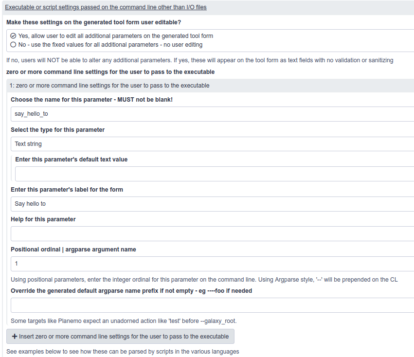

---

layout: tutorial_hands_on
logo: "GTN"
title: "Tools from simple scripts using a Galaxy tool - the ToolFactory"
type: tutorial_hands_on
key_points:
  - The ToolFactory is a Galaxy tool
  - It can turn any simple, working command line script into proper Galaxy tool with a test in a few minutes.
  - It generates complete Galaxy tools from information provided by filling in a normal Galaxy form in the familiar UI
  - Designed for bioinformaticians who enjoy developing scripts in Galaxy using IEs but struggle to wrap even simple scripts at first because there is so much to learn and so little time.
  - With a script, you can control the way parameters are read from the command line so you can usually bypass some of the ToolFactory's limited flexibility.
  - The ToolFactory is a code generator. It only deals with relatively simple situations. These are very common in small scale Galaxy analyses.
  - Dedicated Galaxy tool developers use more powerful tools without limits but correspondingly require time to master.
  - Those tools are suitable for a wide range of Conda dependencies.
  - Please do not upload trivial tools to the main toolshed!!

objectives:
 - Learn why you might want to use the ToolFactory
 - Watch a video demonstration - Hello Galaxy Training Network!
 - Run it locally using the option that best suits your needs and situation
 - Explore the form settings and generated XML for the Hello example
 - Install and explore the simple examples provided
 - Modify and re-generate them to see how the changes affect the tool
 - Generate new simple Galaxy tools using your own scripts

questions:
 - What's the quickest way for a new-to-Galaxy developer to convert a functioning Galaxy IE script into a `real` workflow compatible, shareable tool?
 - Who might want to use the ToolFactory for quick tools from scripts?
 - How can I get the ToolFactory working locally, since you say it should not be exposed on a public server?
time_estimation: 1H

requirements:
 -
    type: "internal"
    topic_name: introduction
    tutorials:
      - galaxy-intro-short
      - galaxy-intro-101-everyone

follow_up_training:
 -
    type: "internal"
    topic_name: dev
    tutorials:
      - tool-integration
      - interactive-environments
contributors:
  - fubar2

---

> ###  Before starting, check that this training will be useful for *your* work in Galaxy
>
> * Most non-programmer scientists using Galaxy *do not need this training*.
> * The ToolFactory is designed for bioinformaticians and researchers who develop scripts
> * It can help to bridge the gap between developing interactive environment notebook scripts and installing real tools in Galaxy
> * Galaxy tool developers who already have the tools they need *do not need this training*
> * It is particularly useful for developers coming to Galaxy from other scientific fields
> * Read the two subtopics below and decide if they seem interesting enough to continue.
> * Watch the [Hello world](https://drive.google.com/file/d/1xpkcVGQ0jRdG78Kt-qLwqeFpE3RnSRsK/view?usp=sharing) tool generation demonstration video to see if it might be useful for your work
{: .tip }


# Introduction: Why you might want to follow the rest of this tutorial about the ToolFactory
{:.no_toc}

#### Turning interactive environment notebooks and other scripts into real tools. Quickly and in Galaxy.

- Galaxy Interactive Environments are very popular and useful for skilled researchers and developers because they allow interactive
development in scripting languages such as Python or R in Galaxy.
    - Notebooks developed in IE's can be turned into command line scripts and tested using suitable small input data sets.
- Scripts needed for use as Galaxy tools can also be developed as command line scripts without using Galaxy
- No matter the source, once the script is working correctly with test data on the command line, **the ToolFactory provides a quick route to a real Galaxy tool**.
- *Any* scripting language interpreter supported by Conda can be used. Working R and Python, or system utilities like Bash examples are provided.
- An automated, form driven code generator that runs in Galaxy as a typical Galaxy tool.
- Developed for bioinformaticians needing to produce "real" Galaxy tools for their users from scripts they have developed.

#### The ToolFactory generates tools

- Quickly turns simple scripts that run correctly on the command line into real Galaxy tools.
- Scripts might be developed in Galaxy Interactive Environments for example.
- A bioinformatician or user who is comfortable with scripting languages on a linux command line might find it useful if they ever need a real Galaxy tool.
- Produces a new Galaxy tool that wraps the supplied script.
- They pass Planemo lint, and are no different from manually written tools.
- They contain a test based on the test data provided at tool generation.

---

#### Generating a trivial `Hello Galaxy Training Network` tool in Galaxy with the ToolFactory

- Watch a 6 minute [`Hello world` demonstration video](https://drive.google.com/file/d/1xpkcVGQ0jRdG78Kt-qLwqeFpE3RnSRsK/view?usp=sharing)

> ###  See ToolFactory form sections from the Hello demonstration with annotation here
>>>
>
> - **The first section of the completed form collects the new tool name and dependencies.**
> - In this case, no Conda dependency is used .
> - bash could be specified as a conda dependency, but it is not really version dependent and usually available on the
command line - reproducibility is not an issue here but when it is, specify the dependencies and their versions.
> - The script pasted into the text box will write a string including the first command line parameter.
> - This will be collected from STDOUT (configured below) into a new history output file (configured below)
> - Positional parameters are chosen so the first parameter on the command line will be emitted when the script runs.
>
>
>>> 
> - **The second section shows the new generated history output.**
> - It uses the special name `STDOUT` so the tool will take whatever the bash script writes and create a new text file called `hello_output`
> - When the test is generated, the pass criterion is that the default value `Galaxy Training Network` should appear as the message in `hello_output`
with no difference. Other criteria including `sim_size` are available for the test applied to each output file.
> - There is no limit (other than your patience) to the number of new generated history outputs
> - Note that this example has no history input files. Again, any number of these can be specified on the form using the repeat
>
>
>>> 
> - **The third section shows the user supplied parameter to be passed in to the bash script on the command line**
> - It will be the first positional parameter because the ordinal position is 1. Argparse parameters are shown in other samples.
> - The help and label text for each input file and user defined parameter will appear on the generated tool form for the user so make them informative
>
>
>
>>> 
> - **The fourth section controls ToolFactory actions and optional outputs**
> - If you supply appropriate API keys, the ToolFactory can upload the newly generated tool to a toolshed. Optionally it can be installed
back into the Galaxy server specified.
> - *This is potentially annoying and dangerous if you have API keys you can misuse - so please be mindful*
>
{: .details }

>###  See generated XML from the `Hello Galaxy Training Network` sample here
>```xml
><tool name="hello_toolshed" id="hello_toolshed" version="0.01">
>  <!--Source in git at: https://github.com/fubar2/toolfactory-->
>  <!--Created by planemo@galaxyproject.org at 22/01/2021 13:48:27 using the Galaxy Tool Factory.-->
>  <description>Says hello</description>
>  <stdio>
>    <exit_code range="1:" level="fatal"/>
>  </stdio>
> <version_command><![CDATA[echo "0.01"]]></version_command>
> <command><![CDATA[bash
> $runme
> ">$sayhelloto"
> $Hello_output]]></command>
>  <configfiles>
>    <configfile name="runme"><![CDATA[
> echo "Hello $1"
> ]]></configfile>
>  </configfiles>
>  <inputs>
>    <param label="Say hello to" help="" value="Galaxy Training Network!!" type="text" name="sayhelloto" argument="sayhelloto"/>
>  </inputs>
>  <outputs>
>    <data name="Hello_output" format="txt" label="Hello_output" hidden="false"/>
>  </outputs>
>  <tests>
>    <test>
>      <output name="Hello_output" value="Hello_output_sample" compare="diff" lines_diff="0"/>
>      <param name="sayhelloto" value="Galaxy Training Network!!"/>
>    </test>
>  </tests>
>  <help><![CDATA[
>
>**What it Does**
>
>ToolFactory demonstration - hello world in Galaxy
>
>
>
>------
>
>
>Script::
>
>    echo "Hello $1"
>
>]]></help>
>  <citations>
>    <citation type="doi">10.1093/bioinformatics/bts573</citation>
>  </citations>
></tool>
>```
{: .details }


#### A form driven Galaxy tool generator for programmers needing simple tools

- The ToolFactory is a Galaxy tool and can be found in the ToolShed.
- It runs in Galaxy like any other tool
- It automates much of the work needed to prepare a new Galaxy tool using information provided by the script writer, on the ToolFactory form.
- It can wrap any simple script that runs correctly on the command line with some small test input samples.
- This is exactly what the ToolFactory does best.
- It is potentially handy for developers and bioinformaticians new to Galaxy, and to Galaxy users who are capable of correctly scripting for themselves.
> ###  Under the hood:
>
>  - It uses galaxyxml to generate the tool XML from ToolFactory form settings.
>  - It uses Planemo to generate the test outputs
>  - Then again to test newly generated code
{: .comment}


> ###  Note!
> - *The ToolFactory does not do any of the hard work needed to prepare a script to run correctly on the command line.*
> - *Galaxy is far too clumsy as an IDE to be used for that purpose.*
> - Without a working script and test data that needs to be wrapped into a toolshed-ready Galaxy tool, the ToolFactory is of no benefit.
{: .comment}

---

#### *Simple* scripts

- Ideal for simple R/Bash/Python/.... scripts with a few user supplied parameters and a few i/o history files. The script can easily be modified to respond to default
empty parameters as if they had not been passed so conditionals and related tricks are not needed.
- For many Conda dependencies, wrappers need conditionals and other tool XML constructs that are not easy to generate automatically so while some may
be manageable, complex ones will often not be possible.
- Galaxy developer tools for building tools include Planemo and the new Galaxy Language Server in VCS. These are far more flexible than the ToolFactory
- They are recommended for full time tool developers in Galaxy willing to learn to use them and needing the flexibility and power.
- *The ToolFactory is for developers and bioinformaticians not yet familiar with those far more flexible tools. Sometimes the scripts they want to wrap are simple enough for the ToolFactory.*
- Compared to the recommended Galaxy developer tool development software
    - Much easier to learn to use a form driven automated code generator
    - Limits in terms of the complexity it can deal with.
- Training is available for the much more general tool development infrastructure in the "Development in Galaxy" section of the GTN - for example, "Tool development and integration into Galaxy" linked in the follow-up
training recommended at the end of this document


---

# Hands on with the ToolFactory - run the ToolFactory locally and adapt the examples
{: .no_toc}

 - If you are still reading, then perhaps the video and other introductory material above were interesting enough.
 - If you wish, you can now start the real work of the tutorial !
 - Set up your own working ToolFactory, install the samples in a history and then start exploring how it works.
- Depending on your preferences, install your own ToolFactory from one of the options described below.
- The sections after this can only be completed with a working ToolFactory.

>#### Actual Tutorial content
>
> 1. TOC
> {:toc}
>
{: .agenda}

## Installation options

> ###  Security advisory!
>- *Please do not install the ToolFactory on a public server*
>- Although it will only run for administrative users, it allows unlimited scripting and that is never a good idea on a public facing machine. Please install it locally as described below.
>- For this reason, the training materials can't make use of existing public Galaxy infrastructure like most of the GTN material. Fortunately, there are a number of local installation alternatives available, depending on how you prefer to work.
{: .warning}

#### 1. Install into an existing local non-docker development Galaxy

- Only useful if you have or want to start a local disposable Galaxy server for development
- Only administrators can use the ToolFactory. Normal users will see an error message saying that they are not allowed to use it.
- If you have a local disposable development Galaxy on your desktop or laptop, this is the easiest way to run a ToolFactory
- Your work will be persistent like any other jobs on that Galaxy.
- Please do not install on a public or production Galaxy server
- https://toolshed.g2.bx.psu.edu/view/fubar/tool_factory_2/f267ed4a3026
- Once installed, it appears on the tool menu for all users, **but only local administrative users can successfully execute it**
- It will fail with an explanation for non-administrative users.

> ###  The normal ToolFactory will not run as a Galaxy tool in Docker!
> - The normal ToolFactory tool fails mysteriously when run as a tool in Galaxy under docker.
> - Option 2 uses a fork of Planemo. The ToolFactory works happily inside a Galaxy inside Planemo in Docker. Go Figure.
> - There is a [Docker compatible version of the ToolFactory you can use instead in Galaxy in Docker](https://github.com/fubar2/toolfactory_docker) that uses a biocontainer.
> - Installation is documented in the respository and bash scripts to build and run the Docker image are provided. They will probably need to be adjusted as described there.
{: .warning}

See [the tutorial on installing tools from the toolshed](https://galaxyproject.org/admin/tools/add-tool-from-toolshed-tutorial)

> ###  Install the ToolFactory tool in an existing disposable development Galaxy
>
> 1. Log in to Galaxy as an administrative user
> 2. Select the`Admin` tab from the top bar in Galaxy;
> 3. Under the `Tool Management` option, select `Install and Uninstall - Search and install new tools and other Galaxy utilities from the Tool Shed. See the tutorial.`
> 2. Make sure the Main toolshed is selected so the entire category list is displayed. Choose the `Tool Generators` link.
> 3. Select `tool_factory_2 updated version of the tool factory`
> 3. Select `Install` for the first listed version - revision 119 at present.
> 4. Wait a few minutes - it takes some time for Conda to install all the dependencies
{: .details}

---

#### 2. Install in a virtual environment using the ToolFactory inside Planemo

- This method is recommended if:
    - you do not already run a development Galaxy
    - you do not wish to risk the wellbeing of your existing development Galaxy instance.
- Make a new (potentially throw away) directory for the Planemo installation - e.g. `mkdir tftute` and `cd tftute`
- Expose and copy the script below. Paste it into a file in the new directory and run it with `sh`.
- It will create a new Python virtual environment, download a fork of planemo and install a local copy of galaxy-dev.
- Edit the location of the galaxy directory `$GALDIR` and remove the code to download galaxy-dev if you already have a cloned Galaxy repository and wish to save time and space.
- It will take some time - so watch the Hello World demonstration while you wait.
- Your work is not persistent!
- The instance will be torn down when you exit Planemo
- Be sure to save your history - either as a history or exported as a workflow - before shutting down.
- After shutting down with `ctrl+C` only the last line of the script needs to be rerun to restart Planemo if the directory contents remain untouched.


> ###  Sample script to install a local disposable ToolFactory in a planemo virtual environment
> > ###  Input: topics/dev/tutorials/tool-builders/docker/maketf.sh
> > ```bash
> > GALDIR="galaxy-central"
> > PDIR="planemo"
> > git clone --recursive https://github.com/fubar2/planemo.git $PDIR
> > rm -rf $PDIR/docs
> > mkdir -p $GALDIR
> > curl -L -s https://github.com/galaxyproject/galaxy/archive/dev.tar.gz | tar xzf - --strip-components=1 -C $GALDIR
> > cp $PDIR/planemo_ext/welcome.html $GALDIR/static/welcome.html
> > cp $PDIR/planemo_ext/welcome.html $GALDIR/static/welcome.html.sample
> > mkdir -p $PDIR/mytools
> > cd $PDIR
> > python3 -m venv .venv
> > . .venv/bin/activate
> > python3 setup.py build
> > python3 setup.py install
> > planemo conda_init --conda_prefix ./con
> > planemo tool_factory --galaxy_root $GALDIR --port 9090 --host 0.0.0.0 --conda_prefix $PDIR/con
> > ```
> {: .code-in}
{: .details}

---

#### 3. Build a simple Docker container using the tutorial supplied Dockerfile

- This option may be attractive if you are comfortable with docker and do not have a handy development Galaxy
- Your work is not persistent!
- The instance will be torn down when you stop the container. When restarted, your previous work will be gone unless you download your work as a history
or export it as a workflow to be imported later.
-  Be sure to save your history - either as a history or exported as a workflow - before shutting down.
- The Docker script provided with this topic builds a different Galaxy from most GTN Docker containers.
- It does not include this tutorial.
- It runs planemo tool_factory for you and exposes it on port 9090 so you can do all the same things as you
can with a local venv described above - but a little slower and isolated in a container.

> ###  Sample Dockerfile to build a simple version of the ToolFactory in Planemo
> > ###  Input: topics/dev/tutorials/tool-generators/docker/Dockerfile
> > ```docker
> ># Galaxy - Using Galaxy tools to generate new Galaxy tools
> >#
> ># To build the docker image, go to root of the training repo and
> >#    docker build -t tool-generators -f topics/tool-generators/docker/Dockerfile .
> ># Take a break. Takes a while!
> ># To run image, make an export directory where you want to run it regularly and then
> >#    docker run -p "9090:9090" -v export:/export/  -t tool-generators
> ># ToolFactory planemo will be available on localhost:9090
> ># Training material is not yet installed - not sure how to do that in Planemo ?
> >
> >FROM ubuntu:latest
> >
> >MAINTAINER Ross Lazarus
> >ENV TARGDIR "/galaxy-central"
> >ENV PDIR "/planemo"
> >RUN apt update -y -qq && apt install -y -qq python3-dev gcc python3-pip build-essential python3-venv python3-wheel nano curl wget git python3-setuptools gnupg curl mercurial \
> >&& python3 -m pip install --upgrade pip \
> >&& curl -sS https://dl.yarnpkg.com/debian/pubkey.gpg | apt-key add - \
> >&& apt upgrade -y \
> >&& mkdir -p $TARGDIR \
> >&& curl -L -s https://github.com/galaxyproject/galaxy/archive/dev.tar.gz | tar xzf - --strip-components=1 -C $TARGDIR \
> >&& git clone --recursive https://github.com/fubar2/planemo.git $PDIR \
> >&& cd $PDIR \
> >&& mkdir mytools \
> >&& rm -rf $PDIR/doc \
> >&& python3 setup.py build \
> >&& python3 setup.py install \
> >&& planemo conda_init --conda_prefix $PDIR/con \
> >&& hg clone https://fubar@toolshed.g2.bx.psu.edu/repos/fubar/tacrev  /planemo/tacrev \
> >&& planemo test --galaxy_root $TARGDIR /planemo/tacrev \
> >&& cp $TARGDIR/config/datatypes_conf.xml.sample $TARGDIR/config/datatypes_conf.xml \
> >&& sed -i 's/<\/registration>/<datatype extension="tgz" type="galaxy.datatypes.binary:Binary" subclass="true" mimetype="multipart\/x-gzip" display_in_upload="true"\/> <\/registration>/' $TARGDIR/config/datatypes_conf.xml \
> >&& sed -i 's/<datatype extension="html"/<datatype extension="html" display_in_upload="true"/' $TARGDIR/config/datatypes_conf.xml \
> >&& apt-get clean && apt-get purge \
> >&&  rm -rf /var/lib/apt/lists/* /tmp/* /var/tmp/*
> >ADD topics/tool-generators/docker/welcome.html $TARGDIR/static/welcome.html.sample
> >ADD topics/tool-generators/docker/welcome.html $TARGDIR/static/welcome.html
> >
> >
> >ENV GALAXY_CONFIG_BRAND "ToolFactory in Planemo"
> >EXPOSE 9090
> >ENTRYPOINT ["/usr/local/bin/planemo" ,"tool_factory", "--galaxy_root" ,"/galaxy-central", "--port", "9090", "--host", "0.0.0.0", "--conda_prefix", "/planemo/con"]
```
> {: .code-in}
{: .details}

---

#### 4. Install the ToolFactory docker container with integrated toolshed

- There is a more complex but integrated solution using the [ToolFactory docker container](https://github.com/fubar2/toolfactory-galaxy-docker).
- It provides an inbuilt toolshed and allows tools to be installed and used in the Galaxy used to run the ToolFactory.
- Like installation in a local Galaxy server, the docker container can be persisted as shown in the documentation for docker-galaxy-stable upon which it is based.

---

# Once your ToolFactory is installed in a local Galaxy

- Congratulations on getting this far.
- Now things get more interesting
- There is a history you can import that shows some sample tools
- You can examine how these were generated by using the Galaxy redo button.
- This will show you the fully completed ToolFactory form used to generate the sample
- Those samples are the main ToolFactory usage documentation.

#### Import the demonstration history into to see some sample ToolFactory tools

> ###  Note!
> - This is the **first step** recommended after any of the installation options above until you are comfortable using the ToolFactory
> - It will give access to some sample ToolFactory tools that can be used to learn how the ToolFactory works
> - This is already done in the [ToolFactory docker container](https://github.com/fubar2/toolfactory-galaxy-docker)
{: .comment}


On the welcome page of the ToolFactory in Planemo, there is a [zenodo link](https://zenodo.org/record/4542837/files/planemo_demohistory_jan23.tar.gz?download=1).
Copy it and paste it into the URL box on the screen for importing a remote history.

> ###  Hands-on: Steps to get the URL box to paste into for history upload of the Zenodo link
>
> 1. Select the`User` tab from the top bar in Galaxy;
> 2. Select `Histories`
> 3. Select `Import`
{: .hands_on}


- It will take a few minutes to import.
- Get up and have a stretch for a minute.
- When it's complete, select the link to view histories and switch to the new one.
- You will see a large number of pairs of history items and 4 data files used for testing.
- Each pair comprises a toolshed ready archive containing a generated tool and a test, and a collection including a Planemo test report, the tool XML and a job log.
- The archive history object has a circular "redo" button. Click that button and the ToolFactory form that generated the sample tool will appear. You can see how the tool was
built using the ToolFactory's limited capacities. Most of them are trivial of course. They are meant to be models rather than real examples.

---

#### Learning to use the ToolFactory


> ###  Exploring the sample tool forms
>
> * Install the ToolFactory safely to suit your needs as described below
> * Import the sample history
> * Select any of the generated toolshed archive history items so you can see the circular "redo" button
> * Click "redo"
> * Examine the form settings used to generate the tool
> * Try changing things - add new parameters or inputs/outputs; press `execute`; check the new version of the tool
{: .hands_on}


Probably the best way is to take a look at each sample tool by rerunning the job. Think about how the options have been configured and try extending it or using the form
as the basis for a new tool - but remember to change the tool name before you press execute to rerun the job and generate a new toolshed archive and report.

The Hello tool is a model for any simple bash script requiring only a few parameters and is easily extended to many situations
where a tool is needed quickly for a workflow. Try adding another parameter

---

# Running your newly generated tools

#### Using the ToolFactory installed directly into a development instance
- Requires a private toolshed.
- DO NOT use any public toolshed for trivial tools

> ###  Hands-on: Loading new generated tools in a normal development Galaxy
>
> - You need a local toolshed that the Galaxy server is configured to talk to in `config/tool_sheds_conf.xml`
> - Edit the default tool_shed.yml admin_users email to suit your needs - default is admin@galaxy.org.
> - From the Galaxy root, `sh run_tool_shed.sh` should start one on `localhost:9009`
> - Register and login as the administrator and create some categories. Tools don't seem to appear without them.
> - Make a new repository, add categories and upload the new toolshed archive
> - In the `Admin` menu, search for the new tool in your local toolshed and then choose `install`
> - If the new tool does not appear in the Galaxy admin interface, you may need to get whoosh reindexing your toolshed. It's a pain.
> - Refresh the tool menu when installation is complete
{: .hands_on}


#### Using Planemo in a virtual environment or GTN docker container

> ###  Hands-on: Loading new generated tools in a venv or docker ToolFactory in Planemo
>
> - Download the toolshed archive from the Galaxy history where you generated the tool.
> - Unpack the archive into the planemo/mytools directory. It should appear as a single directory containing a test-data subdirectory and the new tool xml.
> - Stop planemo - `^c` will do it somewhat messily
> - Restart planemo with an additional parameter `--extra_tools planemo/mytools/`
> - The new tool should be ready to test on the tool menu
{: .hands_on}


---

# Uploading generated archives to toolsheds


> ###  Trivial tools do not belong in the public toolsheds!
>- *Please do not upload trivial tools to the main ToolShed!*
>- The ToolFactory provides an option to upload a newly built tool to a toolshed. This was designed for the persistent docker option but works in the
planemo tool_factory.
>- Please do not abuse it by adding trivial tools to confuse users looking for useful tools.
{: .warning}


- The [ToolFactory docker container](https://github.com/fubar2/toolfactory-galaxy-docker) includes a local toolshed
- This allows new tools to be automatically installed back into the Galaxy running the ToolFactory.
- Please run your own local toolshed for trivial tools that are so simple or specialised that they are not likely to ever be useful for other scientists
- Uploading them to the main ToolShed is unlikely to help anyone

---

# Conclusion
