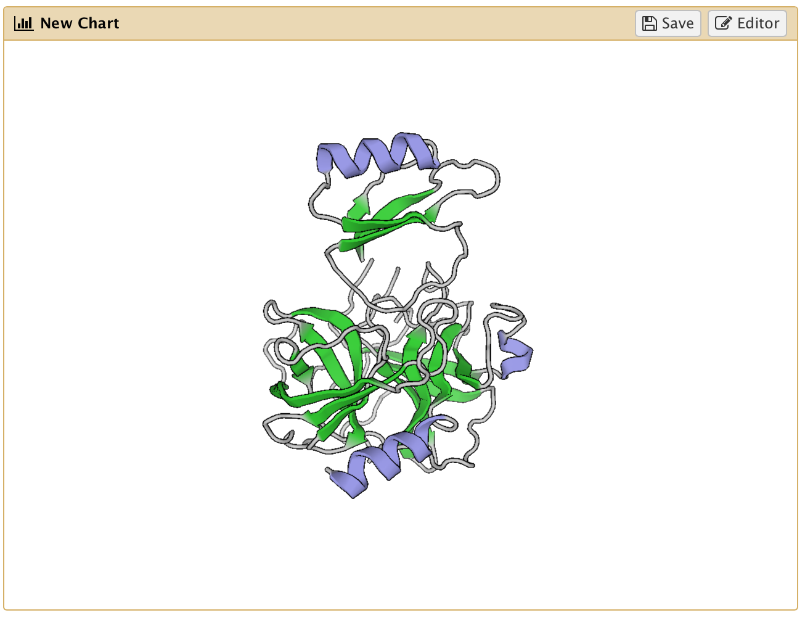

## Introduction
{:.no_toc}

In this tutorial we are going to demonstrate how to add a 3rd-party visualization to *Charts* and what the benefits are. The plugin we select for this purpose is the [*PV-Javascript Protein Viewer*](https://biasmv.github.io/pv/). It is an open source, protein structure viewer for `PDB`-files. There are many other popular protein structure viewers available for the visualization of `PDB`-files such as e.g. [NGL](https://arose.github.io/ngl/) (also available in *Charts*) and [JSMol](https://chemapps.stolaf.edu/jmol/jsmol/jsmol.htm).

> ###  Background: What is the PDB (Protein Data Bank) file format?
>
> The `PDB`-file format contains atomic coordinates of biomolecules derived through a range of experimental and computational methods. Most commonly the file contains a spatial cyrstallographic snapshot of a protein. There are 100s of thousands of protein structures publicly available at the Protein Databank (https://www.rcsb.org). Proteins are usually labeled by a four-letter code.
> Here is an example of a `PDB`-file for a hydrolase bond to its inhibitor (PDB: [1ACB](https://www.rcsb.org/pdb/explore/explore.do?structureId=1acb)):
>
> ```bash
> HEADER    HYDROLASE/HYDROLASE INHIBITOR           08-NOV-91   1ACB              
> TITLE     CRYSTAL AND MOLECULAR STRUCTURE OF THE BOVINE ALPHA-CHYMOTRYPSIN-EGLIN
> TITLE    2 C COMPLEX AT 2.0 ANGSTROMS RESOLUTION   
> ...
> KEYWDS    SERINE PROTEASE, HYDROLASE-HYDROLASE INHIBITOR COMPLEX                
> AUTHOR    R.Z.KRAMER,L.VITAGLIANO,J.BELLA,R.BERISIO,L.MAZZARELLA,
> AUTHOR   2 B.BRODSKY,A.ZAGARI,H.M.BERMAN
> ...
> REMARK   1 REFERENCE 1                                                          
> REMARK   1  AUTH   M.BOLOGNESI,L.PUGLIESE,G.GATTI,F.FRIGERIO,A.CODA,L.ANTOLINI,
> REMARK   1  AUTH 2 H.P.SCHNEBLI,E.MENEGATTI,G.AMICONI,P.ASCENZI                 
> REMARK   1  TITL   X-RAY CRYSTAL STRUCTURE OF THE BOVINE                        
> REMARK   1  TITL 2 ALPHA-CHYMOTRYPSIN(SLASH)EGLIN C COMPLEX AT 2.6 ANGSTROMS    
> ...
> SEQRES   1 E  245  CYS GLY VAL PRO ALA ILE GLN PRO VAL LEU SER GLY LEU          
> SEQRES   2 E  245  SER ARG ILE VAL ASN GLY GLU GLU ALA VAL PRO GLY SER          
> SEQRES   3 E  245  TRP PRO TRP GLN VAL SER LEU GLN ASP LYS THR GLY PHE          
> ...
> ATOM      1  N   CYS E   1       2.323 -16.405  18.812  1.00 43.48           N  
> ATOM      2  CA  CYS E   1       3.017 -15.136  18.786  1.00 35.11           C  
> ATOM      3  C   CYS E   1       4.134 -15.068  19.799  1.00 32.90           C  
> ATOM      4  O   CYS E   1       4.173 -15.810  20.772  1.00 41.38           O  
> ATOM      5  CB  CYS E   1       2.052 -13.969  19.139  1.00 31.14           C  
> ATOM      6  SG  CYS E   1       1.246 -14.085  20.788  1.00 34.72           S  
> ATOM      7  N   GLY E   2       4.993 -14.081  19.607  1.00 21.94           N  
> ...
> HETATM 2292  O   HOH E 406      12.343   1.842  12.901  0.86 18.70           O  
> HETATM 2293  O   HOH E 407      -4.767  17.237  10.630  1.00 59.78           O  
> HETATM 2294  O   HOH E 408      11.489  -6.278  18.740  0.96 20.00           O  
> ...
> ```
>
> More resources on this file format:
>
>   - [https://en.wikipedia.org/wiki/Protein_Data_Bank_(file_format) ](https://en.wikipedia.org/wiki/Protein_Data_Bank_(file_format))
>   - [https://www.wwpdb.org/documentation/file-format ](http://www.wwpdb.org/documentation/file-format)
{: .tip}

As mentioned above we will be focusing on the *PV-Javascript Protein Viewer* in this tutorial. Now that we have learned about the underlying file format, let us continue by visiting the viewers developer site at [https://biasmv.github.io/pv/ ](https://biasmv.github.io/pv/) to get familiar with the plugin.

> ###  Hands-on
>
> 1. View the plugin in action, rotate the molecule and change its style.
>
> 2. Under which license is this plugin distributed?
>
> 3. Can you find the minified code file of this plugin?
>
{: .hands_on}

> ### Agenda
>
> In this tutorial, we will deal with:
>
> 1. TOC
> {:toc}
>
{: .agenda}


## Section 1 - Basic plugin setup
### 1.1 Directory and plugin preparations

In this section we will download the viewer and add it to a local *Galaxy* instance. All development takes place within the *Galaxy* codebase. The first thing we are going to do is to clone a *Galaxy* instance and prepare the directory structure for the new visualization plugin.

> ###  Hands-on
>
> 1. Clone an instance of *Galaxy* in a path, further referred to as `$GALAXY_ROOT`:
>    ```bash
>    $ git clone https://github.com/galaxyproject/galaxy
>    ```
>
> 2. Navigate to the *Charts* repository root:
>    ```bash
>    $ cd $GALAXY_ROOT/config/plugins/visualizations/charts/static/repository
>    ```
>
> 3. Register your visualization by adding a new item to `registry.json`:
>    ```bash
>    "myviz" : [ "pdb" ]
>    ```
>
> 4. Create a new directory:
>    ```bash
>    $ mkdir -p visualizations/myviz/pdb
>    $ cd visualizations/myviz/pdb
>    ```
>
> 5. Download the minified plugin code for *PV-Viewer* from [Github](https://github.com/biasmv/pv):
>    ```bash
>    curl https://raw.githubusercontent.com/biasmv/pv/master/bio-pv.min.js -o plugin.js
>    ```
{: .hands_on}

Now that the directory structure is in place and the 3rd-party code has been made available, we will continue with building our *Chart* plugin. Each *Charts* visualization contains <b>3</b> files:

- Logo (`logo.png`) which will appear in *Chart*'s plugin selection interface.
- Configuration (`config.js`) describing input parameters and options.
- Wrapper (`wrapper.js`) which serves as a bridge between *Galaxy* and our 3rd-party plugin.

In the following sections we are going to discuss these files in more detail, create and place them into our plugin directory at `myviz/pdb`. Let's start with the logo for our visualization.

### 1.2 Your visualization needs a logo

Each visualization is represented by a logo in the *Charts* interface. This makes it easier for users to find and configure their visualization. The logo should be in the `png`-file format. It will appear with a width of 120 pixels.

Here's an example [logo](../../files/charts-plugins/pdb/logo.png):


> ###  Hands-on
>
> 1. Find an arbitrary image in `PNG`-file format. Possibly using *Google*'s [image search](https://images.google.com).
>
> 2. Copy it to the `myviz/pdb` directory and name it `logo.png`.
{: .hands_on}

### 1.3 Configure the visualization

Each visualization has a configuration file named `config.js`. This file has conceptual similarities with a Tool's XML-file. It allows developers to specify a variety of attributes and input parameters for their visualization. Throughout this tutorial we are going to gradually augment this file but for now we keep it simple.

> ###  Hands-on
>
> 1. Create a file named `config.js` with the following content:
>
>    ```js
>    define( [], function() {
>        return {
>            title       : 'A PDB viewer',
>            library     : 'My Visualization',
>            description : 'Displays Protein Structures.',
>            datatypes   : [ 'pdb' ],
>            keywords    : []
>        }
>    });
>    ```
>
> 2. Place it into your plugins directory at `myviz/pdb`.
>
{: .hands_on}

This configures the plugin's name and a description which will appear on the *Charts* selection interface. It also links the plugin to the `PDB`-file format, which means that for any history item of these file type the plugin will automatically become available. Keywords are optional and can help to improve the annotation.

### 1.4 Adding a wrapper

Now we will add a wrapper to connect *Charts* with the *PV-Viewer* plugin. The wrapper consists of a [*Backbone*](http://backbonejs.org) module written in *JavaScript*:
 The wrapper receives an `options` dictionary with the following <b>four</b> components:
 - *charts*: The model of the current visualization with attributes, settings etc.
 - *process*: A [jQuery.Deferred()](https://api.jquery.com/jquery.deferred/) object to allow asynchronous data requests within the wrapper
 - *dataset*: Details on the selected datasets such as url, ids etc. which can be used to access the dataset
 - *targets*: The DOM ids of the container elements to draw into

> ###  Hands-on
>
> 1. Create a file named `wrapper.js` which returns a *Backbone* model:
>  ```js
>    define( [ 'visualizations/myviz/pdb/plugin' ], function( pv ) {
>        return Backbone.Model.extend({
>            initialize: function( options ) {
>                // Add code to configure and execute the plugin here.
>            }
>        });
>    });
>  ```
> 2. Place it into your plugins directory at `myviz/pdb`.
>
{: .hands_on}

The above wrapper does not do much yet, except requesting the minified plugin code which we downloaded earlier. In order to execute a 3rd-party plugin we need to figure out how it works. This can be done by finding a working example or documentation. Fortunately the *PV-Viewer* comes with both. Let's take a look at the [documentation](https://pv.readthedocs.io/).

> ###  Hands-on
>
> 1. Identify the parameter which is needed to initialize the plugin when calling [*pv.Viewer()*](https://pv.readthedocs.io/en/v1.8.1/viewer.html#pv.Viewer).
>
> 2. Which of the wrapper option components represents this parameter?
>
> 3. Can you identify which `mode` settings are valid to render the structure with [*pv.Viewer.renderAs()*](https://pv.readthedocs.io/en/v1.8.1/viewer.html#pv.Viewer.renderAs)?
>
{: .hands_on}

Now that we have learned the basics on how the viewer plugin works, we can initialize and load it in `wrapper.js`.

> ###  Hands-on
>
> 1. Modify `wrapper.js` by adding the following code into the `initialize` call:
>
>    ```js
>    var viewer = pv.Viewer( document.getElementById( options.targets[ 0 ] ), {
>        width       : 'auto',
>        height      : 'auto',
>        antialias   : true,
>        outline     : true
>    });
>    $.ajax( {
>        url     : options.dataset.download_url,
>        success : function( response ) {
>            var structure = pv.io.pdb( response );
>            viewer.clear();
>            viewer.renderAs( 'protein', structure, 'cartoon', {} );
>            viewer.centerOn( structure );
>            viewer.autoZoom();
>            options.process.resolve();
>        }
>    });
>    ```
{: .hands_on}

### 1.5 Build the package

Now that we have completed the *Charts* plugin definition, it is time to bundle the scripts and libraries into a single module file using [*webpack*](https://webpack.github.io). Once packed the plugin will be accessible through *Galaxy*'s user interface. Packing modules does not require restarting your *Galaxy* instance, just make sure to properly refresh your browser.

> ###  Hands-on
>
> 1. Navigate to *Chart*'s root directory:
>    ```bash
>    $ cd $GALAXY_ROOT/config/plugins/visualizations/charts
>    ```
>
> 2. Install the necessary `node-modules`, unless already available:
>    ```bash
>    $ npm install
>    ```
>
> 3. Run `webpack` to build the plugin:
>    ```bash
>    $ webpack
>
>    # If webpack is not available on your PATH, use the following command:
>    $ node_modules/webpack/bin/webpack.js
>    ```
>
{: .hands_on}

Lets test this.

### 1.6 Test the visualization

In this section we will select a `PDB`-file from the Protein Databank and visualize it with our new plugin.

> ###  Hands-on
>
> 1. Visit [https://www.rcsb.org ](http://www.rcsb.org) and select a protein structure e.g. [1ACB](http://www.rcsb.org/pdb/explore/explore.do?structureId=1acb)
>
> 2. Copy the link to the raw `PDB`-file e.g.
>
>    ```bash
>    https://files.rcsb.org/view/1ACB.pdb
>    ```
>
> 3. Start your Galaxy instance
>
>    ```bash
>    $ cd $GALAXY_ROOT
>    $ run.sh
>    ```
>
> 4. Open the uploader dialog, paste the above link and click on *Start*.
>
> 5. Close the upload dialog, and select the file from the history panel on the right.
>
> 6. Click on the *diagram* icon. (You must be logged in)
>
> 7. Find your visualization and double-click on its logo.
>
{: .hands_on}



## Section 2 - Allow different rendering modes

In this section we are going to augment the visualization such that users may select different rendering modes. This is one of the major advantages of using the *Charts* framework. Similar to a Tool's XML file, developers may specify input parameters which then will be presented to the user. The definition of Tool and Visualization input parameters are similar, however the latter is provided in *JavaScript* and not as XML.
More information on parameters can be found in the [wiki](https://docs.galaxyproject.org/en/latest/dev/schema.html).

> ###  Hands-on
>
> 1. Add the following block into the `config.js` file:
>    ```js
>    settings : {
>        mode : {
>            label   : 'Render as:',
>            help    : 'Select the rendering mode.',
>            type    : 'select',
>            display : 'radio',
>            value   : 'cartoon',
>            data    : [ { label : 'Cartoon',        value : 'cartoon' },
>                        { label : 'Lines',          value : 'lines' },
>                        { label : 'Points',         value : 'points' },
>                        { label : 'Spheres',        value : 'spheres' },
>                        { label : 'Trace',          value : 'trace' },
>                        { label : 'Trace (line)',   value : 'lineTrace' },
>                        { label : 'Trace (smooth)', value : 'sline' },
>                        { label : 'Tube',           value : 'tube' } ]
>        }
>    }
>    ```
>
> 2. Change the following line in `wrapper.js`:
>    ```js
>    viewer.renderAs( 'protein', structure, 'cartoon', {} );
>    ```
>    to
>
>    ```js
>    var settings = options.chart.settings;
>    viewer.renderAs( 'protein', structure, settings.get( 'mode' ), settings.attributes );
>    ```
>
> 3. Rebuild the plugin
>
>    ```bash
>    $ rm static/repository/build/myviz_pdb.js
>    $ webpack
>    ```
>
> 4. Refresh your browser.
>
> 5. Load *Charts* and test different rendering modes in the *Customization* tab of your visualization.
>
{: .hands_on}

## Section 3 - Adding more options

From the *PV-Viewer* documentation we can see that there are more settings available such as e.g. 'pointSize', 'lineWidth' and 'radius'. In this section we are going to further enhance the visualizations user interface to incorporate these input parameters

> ###  Hands-on
>
> 1. Add the following block into the `settings` of your `config.js` file:
>    ```js
>    pointSize: {
>        label : 'Point size',
>        help  : 'Specify the point size.',
>        type  : 'float',
>        min   : 0.1,
>        max   : 10,
>        value : 1
>    },
>    lineWidth : {
>        label : 'Line width',
>        help  : 'Specify the line width.',
>        type  : 'float',
>        min   : 0.1,
>        max   : 10,
>        value : 4
>    },
>    radius : {
>        label : 'Radius',
>        help  : 'Radius of tube profile. Also influences the profile thickness for helix and strand profiles.',
>        type  : 'float',
>        min   : 0.1,
>        max   : 3,
>        value : 0.3
>    }
>    ```
>
> 2. Rebuild the plugin
>
>    ```bash
>    $ rm static/repository/build/myviz_pdb.js
>    $ webpack
>    ```
>
> 3. Refresh your browser.
>
> 4. Load *Charts* and test new options in the *Customization* tab of your visualization.
>
{: .hands_on}

## Conclusion
{:.no_toc}

First of all, thank you for completing this tutorial. We have learned how to add visualizations to the *Charts* framework and how to build a custom visualization form.
