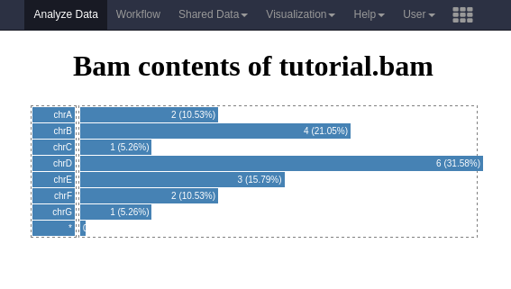

# Introduction


Visualizations may be very helpful in understanding data better. There is a whole
range of visualizations, from rather simple scatter and barplots up to projections
of high dimensional data or even entire genomes. Many of these visualizations often
require a lot of tweaking and changes in settings like zooming in and assigning colors, etc.
Therefore, visualizations are ideally interactive, and changing settings is often
an initial step in exploring data. For this reason it may be inconvenient to make use
of static galaxy tools because it lacks these interactive features. For these situations Galaxy
offers the option to create *visualizations plugins*, file format specific javascripts
that integrate with the history menu, without making redundant copies of data.

In this tutorial we shall go through how this system works and create a simple visualization
plugin. The tool will create a visualization of the number of aligned reads per
chromosome of a BAM file, and we will discuss possible optimizations and advantages
and disadvantages of the proposed implementation.

If you want to make visualizations ready for production, it is essential to have a good
understanding of HTML5 and JavaScript as these are the basic languages in which they are written.
However, for this tutorial we will keep it basic.

Additional documentation about Galaxy visualizations can be found here:

- [DataProviders](https://galaxyproject.org/data-providers)
- [DataProviders/Cookbook](https://galaxyproject.org/data-providers/cookbook)

> <agenda-title></agenda-title>
>
> In this tutorial, we will deal with:
>
> 1. TOC
> {:toc}
>
{: .agenda}

# Part 1

The visualization we are going to create in this tutorial, is a tool that shows the number of aligned
reads per chromosome of a BAM file. The first thing we need to do is to come up with a name.
Let's call it *alignment_rname_boxplot*. Note that the reference sequences (usually chromosomes)
to which we align are named `RNAME` in the BAM/SAM specification.

The development of a Galaxy visualization takes place within the Galaxy codebase.

> <hands-on-title>Data upload</hands-on-title>
>
> 1. Clone an instance of Galaxy in a path, further referred to as `$GALAXY_ROOT`
> 2. Explore the plugin directory as follows:
>
>    ```bash
>    $ cd $GALAXY_ROOT/config/plugins/visualizations
>    ```
>
> 3. Create a new directory for our new plugin project
>
>    ```bash
>    $ mkdir alignment_rname_boxplot
>    $ cd alignment_rname_boxplot
>    ```
>
> 4. Make three (sub-)directories to complete the structure of the project:
>
>    ```bash
>    $ mkdir config
>    $ mkdir static
>    $ mkdir templates
>    ```
{: .hands_on}

## Linking the plugin with Galaxy

To create a bridge between our not-yet-written plugin and Galaxy, we need to write a
configuration in XML format.

> <hands-on-title>Data upload</hands-on-title>
>
> Create the file  `config/alignment_rname_boxplot.xml` with the following contents:
>
> ```xml
> <?xml version="1.0" encoding="UTF-8"?>
> <!DOCTYPE visualization SYSTEM "../../visualization.dtd">
> <visualization name="alignment_rname_boxplot">
>     <data_sources>
>         <data_source>
>             <model_class>HistoryDatasetAssociation</model_class>
>
>             <test type="isinstance" test_attr="datatype" result_type="datatype">binary.Bam</test>
>             <test type="isinstance" test_attr="datatype" result_type="datatype">tabular.Sam</test>
>
>             <to_param param_attr="id">dataset_id</to_param>
>         </data_source>
>     </data_sources>
>     <params>
>         <param type="dataset" var_name_in_template="hda" required="true">dataset_id</param>
>     </params>
>     <template>alignment_rname_boxplot.mako</template>
> </visualization>
> ```
>
{: .hands_on}

This configures the plugin's name, which shall appear on pressing the visualization button in
the history menu. It also links the plugin to two file formats: BAM and SAM, which means that
for any history item of these file formats the plugin will automatically become available.

It also includes a reference to a mako template file (HTML + Python syntax), to be found in the
`templates` directory (we will create this file in the next section). The `var_name_in_template`
parameter is set to the value `hda`, which will be the name of the variable in the mako template
corresponding to the dataset to be visualized.

## Creating the visualization

We have linked our visualization to a mako file (which we have not yet created). This file is a
blueprint for the visualization. This means that for every invocation of the visualization, the
mako file will be compiled to render an HTML file.

Beause we would like the visualization to load quickly, computationally intensive tasks should
not be done prior to loading. A bit of server-side rendering in itself is not a problem, but the
visualizations (written in HTML and/or JS) should do most of the actual calculations and
conversions on the client side (in the browser). Therefore, unlike regular Galaxy tools, parsing
files does not take place on the server, but instead data will be downloaded by the client via an
exposed Galaxy URL prior to client-side rendering.

The most basic part of the mako file are the variables used for further web development, given
below.

```html
<!DOCTYPE HTML>
<%
    import os

    ## Generates hash (hdadict['id']) of history item
    hdadict = trans.security.encode_dict_ids( hda.to_dict() )

    ## Finds the parent directory of galaxy (/, /galaxy, etc.)
    root     = h.url_for( '/' )

    ## Determines the exposed URL of the ./static directory
    app_root = root + 'plugins/visualizations/'+visualization_name+'/static/'

    ## Actual file URL:
    file_url = os.path.join(root, 'datasets', hdadict['id'], "display?to_ext="+hda.ext)
%>
```

- `hdadict` is a variable that contains a file identifier that has been encoded to it's
   exposed uid.
- `root` indicates location of Galaxy on the webserver (e.g. `/`, `/galaxy/`, `/galaxy-pub/`, etc).
- `app_root` contains the exposed url of the static files for this visualization.
- `file_url` contains the exposed url of the dataset selected (by user) for visualization.

We could obtain the BAM file client-side by downloading the BAM/SAM file in its entirety via
*file_url*. However, BAM files can become quite large and it is usually not desired to transfer
such datasets over the network. In our case it is also rather inconvenient to parse the BAM file
with Javascript, just to count the number of reads.

Fortunately, BAM files have indices. These indices are brief summaries describing the
number of entries per chromosome, in order to be able to access the data contained in them more
quickly. In the mako template we can access a BAM index as *hda.metadata.bam_index*.
(Note that this is a file path on the server, not an exposed URL).

Samtools has a command named `idxstats` which is able to leverage this BAM index you. However,
since visualizations do not have dependency management, it is very tricky to let the mako template
do a system call to samtools. Fortunately, the Galaxy ecosystem ships with a built-in `pysam`
dependency, a library that can do any native samtools command within python.

The `*.metadata.bam_index` is a special kind of file in the Galaxy ecosystem. It is actually an
invisible file in Galaxy, linked to another history item, but does have a unique filename.
So, for the BAM file `./database/files/000/dataset_001.dat`, our BAI file (index) is **not**
`./database/files/000/dataset_001.dat.bai` but could be `./database/files/000/dataset_002.dat` or
`./database/files/000/dataset_003.dat`. We can create a symlink to this index file to ensure the
bam file and its index share the same prefix, as expected by samtools and pysam.

We can create this symlink as follows in our mako template:

```python
## Ensure BAI index is symlinked
bai_target = hda.file_name+'.bai'
import os

if not os.path.isfile(bai_target):
   os.symlink(hda.metadata.bam_index.file_name, bai_target)
```

Now the BAM file has a `.bai` file with the same prefix, and we can run the `idxstats`
as follows:

```python
## Extract idxstats
import pysam
bam_idxstats_data = pysam.idxstats(hda.file_name)
```

With the lines of python code above, the idxstats data is parsed into the RAM of python
during compilation on the server, but is not yet exported into the HTML page nor parsed by JS.
To do that, we add an HTML section to the end of the mako file.

```html
<html>
    <head>
        <title>${hda.name | h} | ${visualization_name | h}</title>
    </head>
    <body>
        ${bam_idxstats_data | h}
    </body>
</html>
```

Here you see `${bam_idxstats_data | h}`, which prints the python variable into
the HTML page and also does HTML escaping by providing the ` | h`-flag (for security reasons).

Let's put this all together.

> <hands-on-title>Data upload</hands-on-title>
>
> 1. Create the mako file `templates/alignment_rname_boxplot.mako`
> 2. Fill it with the following code:
>
>    ```html
>    <!DOCTYPE HTML>
>    <%
>        import os
>
>        ## Generates hash (hdadict['id']) of history item
>        hdadict = trans.security.encode_dict_ids( hda.to_dict() )
>
>        ## Finds the parent directory of galaxy (/, /galaxy, etc.)
>        root     = h.url_for( '/' )
>
>        ## Determines the exposed URL of the ./static directory
>        app_root = root + 'plugins/visualizations/'+visualization_name+'/static/'
>
>        ## Actual file URL:
>        file_url = os.path.join(root, 'datasets', hdadict['id'], "display?to_ext="+hda.ext)
>
>        ## Ensure BAI index is symlinked
>        bai_target = hda.file_name+'.bai'
>
>        if not os.path.isfile(bai_target):
>            os.symlink(hda.metadata.bam_index.file_name, bai_target)
>
>        ## Extract idxstats
>        import pysam
>        bam_idxstats_data = pysam.idxstats(hda.file_name)
>    %>
>    <html>
>        <head>
>            <title>${hda.name | h} | ${visualization_name | h}</title>
>        </head>
>        <body>
>            ${bam_idxstats_data | h}
>        </body>
>    </html>
>    ```
>
>    We are now ready to test this very basic visualization, we just need a (small) BAM file for it.
>
> 3. Download [the example BAM file](https://zenodo.org/record/248730/files/tutorial.bam)
> 4. Go the galaxy root directory and start Galaxy:
>
>    ```bash
>    $ cd $GALAXY_ROOT
>    $ ./run.sh
>    ```
>
> 5. Upload the example BAM file to your history
>
>    If everything went well, our plugin has appeared as a visualization option for the dataset
>
>    > <comment-title></comment-title>
>    > You must be logged in to be able to use visualizations
>    {: .comment}
>
{: .hands_on}

All the visualization does at the moment, is show the contents of idxstats, compiled to HTML:

```
['chrA\t5386\t2\t0\n', 'chrB\t5386\t4\t0\n', 'chrC\t5386\t1\t0\n', 'chrD\t5386\t6\t1\n',
'chrE\t5386\t3\t0\n', 'chrF\t5386\t2\t0\n', 'chrG\t5386\t1\t0\n', '*\t0\t0\t0\n']
```

It contains eight entries, one for each of our (made-up) chromosomes and one to `*`, which represents
the unmapped reads. Entries are tab delimited (`\t`) and for the `chrA` entry it indicates that the
length of the RNAME (chromosome) is 5386 bases and 2 reads are aligned to it.

To make the data a bit more usable for Javascript , we convert it into a simple dictionary
of the following syntax:

```python
{'chrA':2, 'chrB':4, 'chrC':1, 'chrD':6, 'chrE':3, 'chrF':2, 'chrG':1, '*': 0}
```

Although it is possible to do this in python we recommend doing this in JS.
The var dump provided by python/pysam is actually a valid syntax for Javascript too,
so getting the raw data into Javascript is rather easy:

```html
<script>
    bam_idxstats_data = ${bam_idxstats_data};
</script>
```

Converting the data is not the scope of the tutorial, so here we provide such a function:

```html
<script>
  bam_idxstats_data = ${bam_idxstats_data};
  function parse_data(bam_idxstats_data) {
    var output = {};

    for(var i = 0; i < data.length ; i++) {
      var line = data[i];
      var chunks = line.split("\t");

      if(chunks[0].split("_").length == 1) { // only if it does not contain underscore
        output[chunks[0]] = parseInt(chunks[2]);
      }
    }

   return output;
  }
  </script>
```

The great thing about the mako system is that it does not require to restart galaxy in order to make
functional changes to the mako files.

> <hands-on-title>Data upload</hands-on-title>
>
> 1. Change the mako file to the following:
>
>    ```html
>    <!DOCTYPE HTML>
>    <%
>        import os
>
>        ## Generates hash (hdadict['id']) of history item
>        hdadict = trans.security.encode_dict_ids( hda.to_dict() )
>
>        ## Finds the parent directory of galaxy (/, /galaxy, etc.)
>        root     = h.url_for( '/' )
>
>        ## Determines the exposed URL of the ./static directory
>        app_root = root + 'plugins/visualizations/'+visualization_name+'/static/'
>
>        ## Actual file URL:
>        file_url = os.path.join(root, 'datasets', hdadict['id'], "display?to_ext="+hda.ext)
>
>        ## Ensure BAI index is symlinked
>        bai_target = hda.file_name+'.bai'
>
>        if not os.path.isfile(bai_target):
>            os.symlink(hda.metadata.bam_index.file_name, bai_target)
>
>        ## Extract idxstats
>        import pysam
>        bam_idxstats_data = pysam.idxstats(hda.file_name)
>
>    %>
>    <html>
>        <head>
>           <title>${hda.name | h} | ${visualization_name | h}</title>
>            <script>
>                bam_idxstats_data = ${bam_idxstats_data};
>                function parse_data(data) {
>                    var output = {};
>                    for(var i = 0; i < data.length ; i++) {
>                        var line = data[i];
>                        var chunks = line.split("\t");
>
>                        if(chunks[0].split("_").length == 1) { // only if it does not contain underscore
>                            output[chunks[0]] = parseInt(chunks[2]);
>                        }
>                    }
>                    return output;
>                }
>            </script>
>        </head>
>        <body onload="bam_idxstats = parse_data(bam_idxstats_data);">
>            ${bam_idxstats_data | h}
>        </body>
>    </html>
>    ```
>
> 2. Retrigger the visualization and open the developers console of your browser: In the console, type: `bam_idxstats_data` and press <kbd>Enter</kbd>
>   This should give the parsed contents as a dictionary, which can directly be used in Javascript.
>
{: .hands_on}

From this point forward you are encouraged to continue on your own to see if you are able to create
a simple visualization from this dictionary. Think of tables, DIVs or even more complicated
solutions :).

Below is an example visualization, which creates a bar plot showing the number of reads per
chromosome.



The full contents of this plugin are provided in the [GitHub repository related to this material in `tree/master/topics/dev/files/hands_on-visualizations/alignment_rname_boxplot`]({{ site.github_repository }}/tree/{{ site.github_repository_branch }}/topics/dev/files/hands_on-visualizations/alignment_rname_boxplot).
To try out this example, simply copy this folder to the `$GALAXY_ROOT/config/plugins/visualizations/` folder
on your (local) Galaxy and restart Galaxy.

The contents of the mako file for this example are given below.

```html
<!DOCTYPE HTML>
<%
    import os

    ## Generates hash (hdadict['id']) of history item
    hdadict = trans.security.encode_dict_ids( hda.to_dict() )

    ## Finds the parent directory of galaxy (/, /galaxy, etc.)
    root     = h.url_for( '/' )

    ## Determines the exposed URL of the ./static directory
    app_root = root + 'plugins/visualizations/'+visualization_name+'/static/'

    ## Actual file URL:
    file_url = os.path.join(root, 'datasets', hdadict['id'], "display?to_ext="+hda.ext)

    ## Ensure BAI index is symlinked
    bai_target = hda.file_name+'.bai'

    if not os.path.isfile(bai_target):
        os.symlink(hda.metadata.bam_index.file_name, bai_target)

    ## Extract idxstats
    import pysam
    bam_idxstats_data = pysam.idxstats(hda.file_name)
%>
<html>
     <head>
        <title>${hda.name | h} | ${visualization_name | h}</title>

        <style>
             .chart div {
               font: 10px sans-serif;
               background-color: steelblue;
               text-align: right;
               padding: 3px;
               margin: 1px;
               color: white;
             }
        </style>
        <script>
            bam_idxstats_data = ${bam_idxstats_data};
            function parse_data(data) {
                 /*
                  Data comes in as tuple of unsplit lines:
                  ["chr1\t1000\t0\t0", "chr2\t2500\t0\t0"]

                  We need to split it up, and ideally only keep reference names without an underscore
                 */
                 var output = {};

                 for(var i = 0; i < data.length ; i++) {
                     var line = data[i];
                     var chunks = line.split("\t");

                     if(chunks[0].split("_").length == 1) { // only if it does not contain underscore
                         output[chunks[0]] = parseInt(chunks[2]);
                     }
                 }

                 return output;
            }

            function calc_stats(parsed) {
                max = 0;
                sum = 0;
                for (var key in parsed) {
                    if (parsed[key] > max){
                        max = parsed[key];
                    }
                    sum += parsed[key]
                }
                return [max, sum];
            }

            function plot_data(parsed) {
                var max = calc_stats(parsed)[0];
                var sum = calc_stats(parsed)[1];

                for (var key in parsed) {
                     var value = parsed[key];
                     var ratio = 100.0 * value / sum;
                     var ratio2 = 100.0 * value / max;

                     var div = document.createElement("div");
                     div.innerHTML = '<nobr>'+key+'</nobr>';
                     document.getElementById("chart_names").appendChild(div);

                     var div = document.createElement("div");
                     div.innerHTML = '<nobr>'+value+" ("+Math.round(ratio*100)/100+"%)</nobr>";
                     div.title = key+': '+value+" ("+Math.round(ratio*100)/100+"%)";
                     div.style.width =  ratio2+'%';
                     document.getElementById("chart").appendChild(div);
                }
            }
        </script>
     </head>
     <body onload="plot_data(parse_data(bam_idxstats_data));">
         <center>
             <h1>Bam contents of ${hda.name | h}</h1>

             <table border="0" borderpadding="0" borderpanning=")" style="width: 500px;">
                 <tr>
                     <td style="width:50px;">
                         <div id="chart_names" class="chart" style="width: 100%; border: 1px dashed gray;text-align: left;" />
                     </td>
                     <td style="width:450px;">
                         <div id="chart" class="chart" style="width:100%; border: 1px dashed gray;text-align: left;" />
                     </td>
                 </tr>
             </table>
         </center>
     </body>
</html>

```

In the given example, the `RNAME` queries containing an underscore were removed.
This is because there are many alternative chromosomes, making the list very large
for certain reference genomes. However, for certain studies it might be desired to
just look at those.

The current plot is a box plot, but one can imagine a pie-chart may be convenient too.
All of those additional settings can be implemented for interactive behaviour,
contributing to quicker understanding of the data which is generally not so convenient
using static Galaxy tools.

> <comment-title>Static files</comment-title>
>
> In the example we included Javascript and CSS into the HTML website.
> Remember that for every new invocation of the visualization the entire CSS en JS are copied
> and transferred as well. This is a waste of (redundant) bandwidth as we could save the
> files in the static directory and refer to them within the HTML. The browser shall check
> it's cache for the presence of libs and style sheets and only update them if they have changed.
{: .comment}

### Improvements

Another thing you may realize is that we still do the calculation (pysam.idxstats) server side.
Although this is a marginal calculation, it is causing delay and the bigger the files, the worse
this delay becomes. The underlying problem is that we did not obtain and parse the BAI file via
Javascript. This would be a more elaborate solution, but requires more development time as we
need to develop a function able to parse the binary file.

Another thing we could do is create a static `samtools idxstats` tool, that creates a file of
datatype `tabular.Idxstats` and include that datatype into Galaxy. We then make the visualization
specific for that datatype, just plotting the results of the `idxstats`.

A fundamental and more complicated problem is that BAM files are simply too big to transfer for
these kind of applications. It would be ideal to have web server integration that allows querying
of specific locations or metadata within or from a BAM file where indexing operations are taken
care of at the server side. This is what has been done in Trackster.


### More examples

For more examples of visualization plugins, you can browse this
[GitHub repo](https://github.com/bgruening/galaxytools/tree/master/visualisations)

# Conclusion


We have just created a visualization plugin in Galaxy to visualize the number of alignments
per `RNAME` (chromosome) in a BAM file.
