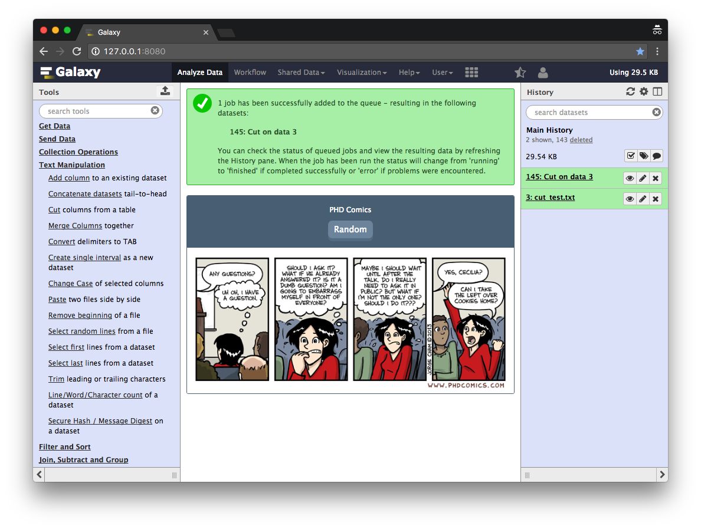

## Introduction

In this tutorial we are going to demonstrate how to add a webhook to the tool-execution endpoint. This is the web-page that appears
after you have executed a tool. As a more useful example we are going to ask [phdcomics](http://phdcomics.com) for a random comic that we can
display to entertain our users.


At first let's create a config file that defines the name and the type of your webhook. The `name` is `phdcomics` and with the type we define the entry-points
at which we modify the Galaxy user-interface. In our case we want to display an image at the `tool` and `workflow` entry-point.
The key `activate` gives you control per-webhook to activate or deactivate it.


> ###  Hands-on
>
> 1. Create a file named `config/phdcomics.yaml` with the following content:
>
>    ```yaml
>       name: phdcomics
>       type:
>         - tool
>         - workflow
>       activate: true
>    ```
{: .hands_on}


The next step is to define HTML/JS part which will control the part of the Galaxy UI. We create a new PHDComicsAppView view extended from Backbone.
Inside this view we define a simple `div`-container with a button and a placeholder for our image called `phdcomics-img`. You can add additional
functionality to your view, for example getting a new image on button click. The essential functionality however is stored getRandomComic.
The big problem with phdcomics is that there is no nice API to retrive the comics, so we need to fallback to parse the HTML pages. We decided to do this
in Python to demonstrate webhooks abilitity to call self-defined python functions. Please note the `url = galaxyRoot + 'api/webhooks/phdcomics/get_data';`, which
calls an REST endpoint defined by use in the next step. The return value of this endpoint is retrived in JS and can be displayed or modified.

> ###  Hands-on
>
> 1. Create a file named `static/script.js` with the following content:
>
>    ```js
>        $(document).ready(function() {
>
>            var galaxyRoot = typeof Galaxy != 'undefined' ? Galaxy.root : '/';
>
>            var PHDComicsAppView = Backbone.View.extend({
>                el: '#phdcomics',
>
>                appTemplate: _.template(
>                    '<div id="phdcomics-header">' +
>                       '<div id="phdcomics-name">PHD Comics</div>' +
>                        '<button id="phdcomics-random">Random</button>' +
>                    '</div>' +
>                    '<div id="phdcomics-img"></div>'
>                ),
>
>                imgTemplate: _.template('"">'),
>
>                events: {
>                    'click #phdcomics-random': 'getRandomComic'
>                },
>
>                initialize: function() {
>                    this.render();
>                },
>
>                render: function() {
>                    this.$el.html(this.appTemplate());
>                    this.$comicImg = this.$('#phdcomics-img');
>                    this.getRandomComic();
>                    return this;
>                },
>
>                getRandomComic: function() {
>                    var me = this,
>                        url = galaxyRoot + 'api/webhooks/phdcomics/get_data';
>
>                    this.$comicImg.html($('<div/>', {
>                        id: 'phdcomics-loader'
>                    }));
>
>                    $.getJSON(url, function(data) {
>                        if (data.success) {
>                            me.renderImg(data.src);
>                        } else {
>                            console.error('[ERROR] "' + url + '":\n' + data.error);
>                        }
>                    });
>                },
>
>                renderImg: function(src) {
>                    this.$comicImg.html(this.imgTemplate({src: src}));
>                }
>            });
>
>            new PHDComicsAppView();
>        });
>    ```
{: .hands_on}


The following hands-on will define an API endpoint that is called from the JS code of your webhook.
Make sure you name the python function `main` and that all third-party requirements are installed in your Galaxy virtual environment.
Please note that the `main()` can consume `params` from your client but also the Galaxy `trans` object, which will give you access to the
entire user-object, including histories and datasets.


> ###  Hands-on
>
> 1. Create a file named `helper/__init__.py` with the following content:
>
>    ```python
>    import urllib
>    import re
>    import random
>    import logging
>
>    log = logging.getLogger(__name__)
>
>
>    def main(trans, webhook, params):
>        error = ''
>        comic_src = ''
>
>        try:
>            # Third-party dependencies
>            try:
>                from bs4 import BeautifulSoup
>            except ImportError as e:
>                log.exception(e)
>                return {'success': False, 'error': str(e)}
>
>            # Get latest id
>            if 'latest_id' not in webhook.config.keys():
>                url = 'https://phdcomics.com/gradfeed.php'
>                content = urllib.urlopen(url).read()
>                soap = BeautifulSoup(content, 'html.parser')
>                pattern = '(?:https://www\.phdcomics\.com/comics\.php\?f=)(\d+)'
>                webhook.config['latest_id'] = max([
>                    int(re.search(pattern, link.text).group(1))
>                    for link in soap.find_all('link', text=re.compile(pattern))
>                ])
>
>            random_id = random.randint(1, webhook.config['latest_id'])
>            url = 'https://www.phdcomics.com/comics/archive.php?comicid=%d' % \
>                random_id
>            content = urllib.urlopen(url).read()
>            soup = BeautifulSoup(content, 'html.parser')
>            comic_img = soup.find_all('img', id='comic2')
>
>            try:
>                comic_src = comic_img[0].attrs.get('src')
>            except IndexError:
>                pattern = '                comic_src = re.search(pattern, content).group(1)
>
>        except Exception as e:
>            error = str(e)
>
>        return {'success': not error, 'error': error, 'src': comic_src}
>   ```
{: .hands_on}


To make your webhook appealing you can also add custom CSS which you can use in your HTML/JS code.


> ###  Hands-on
>
> 1. Create a file named `static/styles.css` with the following content:
>
>    ```css
>        #phdcomics {
>            border: 1px solid #52697d;
>            text-align: center;
>            border-radius: 3px;
>            overflow: hidden;
>        }
>
>        #phdcomics-header {
>            background: #52697d;
>            border-bottom: 1px solid #52697d;
>            padding: 15px 0;
>        }
>
>        #phdcomics-name {
>            color: #fff;
>            padding-bottom: 10px;
>        }
>
>        #phdcomics-header button {
>            color: #fff;
>            font-size: 14px;
>            background-color: #768fa5;
>            border: none;
>            border-radius: 7px;
>            box-shadow: 0 5px #5c768c;
>            padding: 5px 10px;
>        }
>
>        #phdcomics-header button:focus {
>            outline: 0;
>        }
>
>        #phdcomics-header button:hover {
>            background-color: #67839b;
>        }
>
>        #phdcomics-header button:active {
>            background-color: #67839b;
>            box-shadow: 0 0 #5c768c;
>            transform: translateY(5px);
>        }
>
>        #phdcomics-img {
>            background: #fff;
>        }
>
>        #phdcomics-img img {
>            padding: 10px;
>            max-width: 100%;
>            margin-bottom: -4px;
>        }
>
>        #phdcomics-loader {
>            border: 5px solid #f3f3f3;
>            border-top: 5px solid #52697d;
>            border-radius: 50%;
>            width: 25px;
>            height: 25px;
>            animation: spin 1.5s linear infinite;
>            margin: 15px auto;
>        }
>
>        @keyframes spin {
>            0% { transform: rotate(0deg); }
>            100% { transform: rotate(360deg); }
>        }
>    ```
{: .hands_on}


Please make sure you have activated webhooks in your `config/galaxy.ini` file by setting the `webhooks_dir` to the path in which your `phdcomics` folder is located.

> ###  Hands-on
>
> 1. Submit one tool and see if your webhook is working on the tool-submit page.
>
{: .hands_on}


If successful it should look like this:




## Conclusion

First of all, thank you for completing this tutorial. We have learned how to add webhooks to your Galaxy.
