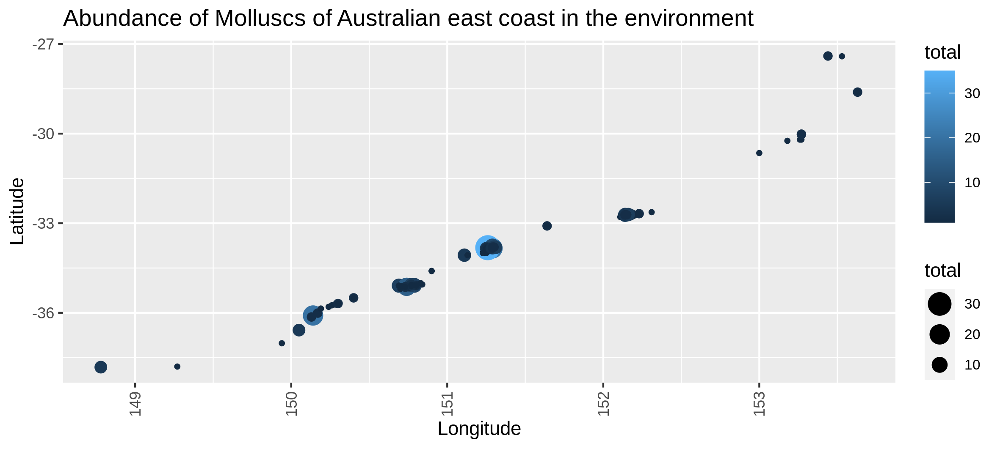

# Introduction
{:.no_toc}

This tutorial will guide you on the exploration of biodiversity data having taxonomic, spatial and temporal informations.

**Please follow our
[tutorial to learn how to fill the Markdown]({{ site.baseurl }}/topics/contributing/tutorials/create-new-tutorial-content/tutorial.html)**

> ### Agenda
>
> In this tutorial, we will cover:
>
> 1. TOC
> {:toc}
>
{: .agenda}

# Downloading biodiversity data

First step is to download biodiversity data on your Galaxy history. Here we will use a "classical" (containing taxonomic, spatial and temporal informations) biodiversity dataset from the well known ["Reef life survey" initiative](https://reeflifesurvey.com/).

## Get data

> ###  Hands-on: Data upload
>
> 1. Create a new history for this tutorial
> 2. Import the files from [Zenodo](https://zenodo.org/record/5930763/files/Reel_life_survey_fish_sample.tabular?download=1)
>
>    
>
>    
>
> 3. Rename the datasets "reef_life_fish" for example
> 4. Check that the datatype is tabular
>
>    
>
> 5. Add to each database a tag corresponding to ...
>
>    
>
{: .hands_on}

# Want to spatially anoymize your data 

A first step of this tutorial will show you how you can simply apply spatial coordinates anonymization if you want to share data without spatial context.

## Sub-step with **Spatial coordinates anonymization**

> ###  Hands-on: Task description
>
> 1.  with the following parameters:
>    -  *"Input table"*: `output` (Input dataset)
>    - *"Select column containing latitudes in decimal degrees"*: `c9`
>    - *"Select column containing longitudes in decimal degrees"*: `c10`
>
>
>
{: .hands_on}

# Descriptive statistical testing

## Sub-step with **Homoscedasticity and normality**

> ###  Hands-on: Here we will check homogeneity of variances (Levene test) for every species and represent it through multiple boxplots and the normal distribution (Kolmogorov-Smirnov test) represented by a distribution histogram and a Q-Q plot.

If the levene test is significant (P-value in column Pr < 0.5 and at least one * at the end of the 4th line), variances aren't homogeneous, the hypothesis of homoscedasticity is rejected.

If the K-S test is significant (p-value < 0.5), your numerical variable isn't normally distributed, the hypothesis of normality is rejected.
>
> 1.  with the following parameters:
>    -  *"Input table"*: `output` (Input dataset)
>    - *"Select column containing temporal data (year, date, ...)"*: `c11`
>    - *"Select column containing species"*: `c16`
>    - *"Select column containing numerical values (like abundances)"*: `c18`
>
>    ***TODO***: *Check parameter descriptions*
>
>    ***TODO***: *Consider adding a comment or tip box*
>
>    > ###  Comment
>    >
>    > A comment about the tool or something else. This box can also be in the main text
>    {: .comment}
>
{: .hands_on}

***TODO***: *Consider adding a question to test the learners understanding of the previous exercise*

> ###  Questions
>
> 1. Question1?
> 2. Question2?
>
> > ###  Solution
> >
> > 1. Answer for question1
> > 2. Answer for question2
> >
> {: .solution}
>
{: .question}

## Sub-step with **Variables exploration**

> ###  Hands-on: Task description
>
> 1.  with the following parameters:
>    -  *"Input table"*: `output` (Input dataset)
>    - *"Variables links exploration"*: `Collinearity between selected numerical variables for each species`
>        - *"Select column containing species"*: `c16`
>        - *"Select columns containing numerical values"*: `c['12', '17', '18']`
>
>    ***TODO***: *Check parameter descriptions*
>
>    ***TODO***: *Consider adding a comment or tip box*
>
>    > ###  Comment
>    >
>    > A comment about the tool or something else. This box can also be in the main text
>    {: .comment}
>
{: .hands_on}

***TODO***: *Consider adding a question to test the learners understanding of the previous exercise*

> ###  Questions
>
> 1. Question1?
> 2. Question2?
>
> > ###  Solution
> >
> > 1. Answer for question1
> > 2. Answer for question2
> >
> {: .solution}
>
{: .question}

  

## Sub-step with **Presence-absence and abundance**

> ###  Hands-on: Task description
>
> 1.  with the following parameters:
>    -  *"Input table"*: `output` (Input dataset)
>    - *"Variables presence, absence and abundance"*: `Abundance map in the environment `
>        - *"Select column containing latitudes "*: `c9`
>        - *"Select column containing longitudes"*: `c10`
>        - *"What do you study in this analysis ?"*: `fishes`
>        - *"Select column containing taxon "*: `c16`
>    - *"Select column containing abundances "*: `c18`
>
>
>    > ###  Comment
>    >
>    > A comment about the tool or something else. This box can also be in the main text
>    {: .comment}
>
{: .hands_on}

***TODO***: *Consider adding a question to test the learners understanding of the previous exercise*

> ###  Questions
>
> 1. Question1?
> 2. Question2?
>
> > ###  Solution
> >
> > 1. Answer for question1
> > 2. Answer for question2
> >
> {: .solution}
>
{: .question}

## Sub-step with **Statistics on presence-absence**

> ###  Hands-on: Task description
>
> 1.  with the following parameters:
>    -  *"Input table"*: `output` (Input dataset)
>    - *"Select a column containing numerical values (such as the abundance) "*: `c18`
>    - *"Select the column of the x-axis : most commonly species"*: `c16`
>    - *"Select column containing locations "*: `c8`
>    - *"Select column containing temporal data (year, date, ...) "*: `c11`
>
>    ***TODO***: *Check parameter descriptions*
>
>    ***TODO***: *Consider adding a comment or tip box*
>
>    > ###  Comment
>    >
>    > A comment about the tool or something else. This box can also be in the main text
>    {: .comment}
>
{: .hands_on}

***TODO***: *Consider adding a question to test the learners understanding of the previous exercise*

> ###  Questions
>
> 1. Question1?
> 2. Question2?
>
> > ###  Solution
> >
> > 1. Answer for question1
> > 2. Answer for question2
> >
> {: .solution}
>
{: .question}

## Sub-step with **Local Contributions to Beta Diversity (LCBD)**

> ###  Hands-on: Task description
>
> 1.  with the following parameters:
>    -  *"Input table"*: `output` (Input dataset)
>    - *"Select column with abundances"*: `c18`
>    - *"Select column with locations"*: `c8`
>    - *"Select column containing taxon"*: `c16`
>    - *"Select column containing dates"*: `c11`
>    - *"Other LCBD : spatialized representation or xy plot."*: `Spatialized representation`
>        - *"Select column containing latitudes in decimal degrees"*: `c9`
>        - *"Select column containing longitudes in decimal degrees"*: `c10`
>
>    ***TODO***: *Check parameter descriptions*
>
>    ***TODO***: *Consider adding a comment or tip box*
>
>    > ###  Comment
>    >
>    > A comment about the tool or something else. This box can also be in the main text
>    {: .comment}
>
{: .hands_on}

***TODO***: *Consider adding a question to test the learners understanding of the previous exercise*

> ###  Questions
>
> 1. Question1?
> 2. Question2?
>
> > ###  Solution
> >
> > 1. Answer for question1
> > 2. Answer for question2
> >
> {: .solution}
>
{: .question}

_Beta_diversity_through_space.png) 
_LCBD_sites_time.png) 
_Mean_LCBD_through_time.png) 
_SCBD_Species_Radar_plot.png) 

Final absence correlation plot:

## Re-arrange

To create the template, each step of the workflow had its own subsection.

***TODO***: *Re-arrange the generated subsections into sections or other subsections.
Consider merging some hands-on boxes to have a meaningful flow of the analyses*

# Conclusion
{:.no_toc}

Sum up the tutorial and the key takeaways here. We encourage adding an overview image of the
pipeline used.
