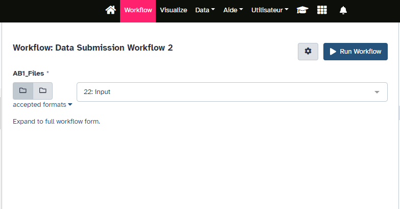
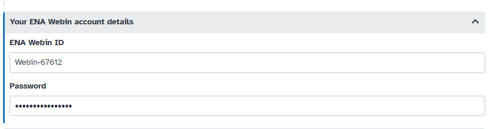
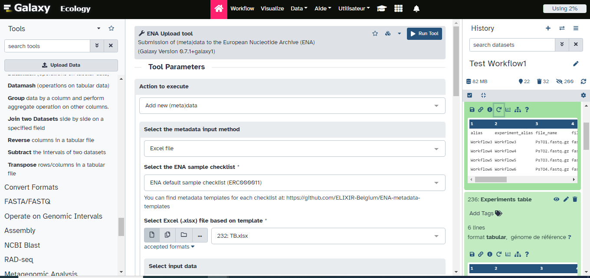

This tutorial will guide you through the necessary steps to manage and prepare sequencing files (AB1, FASTQ, FASTA) for submission to the genomic database ENA.
This workflow will take you from raw sequences in AB1 format through all the necessary steps to integrate these sequences into the ENA genomic database. We will convert the files into FASTQ and FASTA formats after performing quality control.
Additionally, we will perform alignments with the NCBI database to ensure the accuracy of your sequences.You will then need to fill a metadata Excel template to use the ENA upload Tool.
The worklow is made of 17 Galaxy tools, we will  present them and explain what they do.
The goal is to present an accessible and reproductible workflow for data submission.

> <agenda-title></agenda-title>
>
> In this tutorial, we will cover:
>
> 1. TOC
> {:toc}
>
{: .agenda}

# Prepare raw data with the Data Submission Workflow

> <hands-on-title> Data Upload </hands-on-title>
> 1. **Create a new history** for this tutorial
>
>    
>
> 2. **Import** the files.
>
>    ```
>    https://data.indores.fr/api/access/datafile/3673
>    https://data.indores.fr/api/access/datafile/3609
>    ```
>
>    
>
> 3. **Rename**  your datafiles
>    - `3673` becomes `A2_RC_8F2_B.pl_HCOI.ab1`
>    - `3609` becomes `A12_RC_9G4_B.md_HCOI.ab1`
>
>    
>
> 4. **Check the datatype**
>    - Make sure it is `ab1`, and change it if not.
>
>    
>
> 5. **Build a Collection** containing these two files
>
>    
>
{: .hands_on}


> <hands-on-title> Run "Prepare Data Submission" Workflow </hands-on-title>
> Workflow is accessible there:
>
> [https://ecology.usegalaxy.eu/u/najatamk/w/workflow-constructed-from-history-workflow-data-submission](https://ecology.usegalaxy.eu/u/najatamk/w/workflow-constructed-from-history-workflow-data-submission-1).
>
> 
>
> 
{: .hands_on}

## Tools used in the "Prepare Data submission" Workflow

### Converting Ab1 files to FASTQ

We use **Ab1 to Fastq converter** to convert the sequences from AB1 format to FASTQ format.

### Quality Control

We are doing a first Quality control on the raw files using FastQC and MultiQC.

> <hands-on-title> FastQC </hands-on-title>
> 1.  on the Fastq files:
>
> 2.  with the following parameters:
>    - In *"Results"*:
>        -  *"Insert Results"*
>            - *"Which tool was used generate logs?"*: `FastQC`
>
>    ***TODO***: *Check on the HTML files the general quality statistics of your sequences*
>
{: .hands_on}


> <question-title> Question </question-title>
>
> 1. What is the quality of your sequences?
> 2. Do you have adapters?
{: .question}

# Cleaning the Data

## Cutadapt
Cutadapt enables the removal of adapters, polyA tails, and other artifacts from sequences. The tool also filters reads based on quality.

> <hands-on-title> Cutadapt </hands-on-title>
>
> 1.  with the following parameters:
>
>     - **"Single-end or Paired-end reads?"**: `Single-end`
>     - In **"Read Modification Options"**:
>         - **"Quality cutoff"**: `30`
>         - **"Shortening reads to a fixed length"**: `Disabled`
>
> > <comment-title> Suggestions </comment-title>
> >
> > You may consider changing these parameters depending on the quality of your dataset.
> {: .comment}
>
{: .hands_on}

>    > <comment-title> Quality Control </comment-title>
>    >
>    > We do a second quality control similar to the first one to check the quality of the sequences after cleaning them.
>    {: .comment}

## Quality Control with FASTQC and MultiQC

> <hands-on-title> FastQC </hands-on-title>
>
> 1.  on the cutadapt output files>
>
>
> 2.  with the following parameters:
>    - In *"Results"*:
>        -  *"Insert Results"*
>            - *"Which tool was used generate logs?"*: `FastQC`
>
>
>    > <comment-title> Comment </comment-title>
>    >
>    > You should notice an improvement on the quality of your sequences.
>    {: .comment}
>
{: .hands_on}

## Filtering the collection

> <hands-on-title> Filter empty datasets </hands-on-title>
>
> 1. 
>
>
> 2.  with the following parameters:
>    - *"Minimum size"*: `300`
>
>    > <comment-title> Comment </comment-title>
>    >
>    > Here we descide to only keep sequences of 300bp or above, you may change this parameter depending on your dataset
>    {: .comment}
>
{: .hands_on}

### Changing files names

> <hands-on-title>Extract element identifiers </hands-on-title>
>
> 1. 
>
> 2.  with the following parameters:
>    - In *"Check"*:
>      -  *"Insert Check"*
>        - *"Find Regex"*: `.ab1`
>        - *"Replacement"*: `.fastq.gz`
>
>    > <comment-title> Comment </comment-title>
>    >
>    > This is to ensure that all your files names end with .fastq.gz
>    {: .comment}
>
>
> 3. 
> 4. **Check the datatype**
>    - should be 'tabular'. If not, change it now.
>
>    
>
{: .hands_on}


> <hands-on-title> Relabel identifiers </hands-on-title>
>
> 1.  with the following parameters:
>     - *"How should the new labels be specified?"*: `Map original identifiers to new ones using a two column table.`
>
{: .hands_on}

### Compress file(s)

> <hands-on-title> Compress files </hands-on-title>
>
> 1.  with the following parameters:
>
>    > <comment-title> short description </comment-title>
>    >
>    > The ENA Database only allows compressed files for submission
>    {: .comment}
>
{: .hands_on}

## Alignments on NCBI database


> <hands-on-title> NCBI BLAST alignment </hands-on-title>
>
> 1.  with the following parameters:
>
> 2.  with the following parameters:
>    - *"Subject database/sequences"*: `Locally installed BLAST database`
>        - *"Nucleotide BLAST database"*: `NCBI NT (01 Sep 2023)`
>    - *"Output format"*: `Tabular (extended 25 columns)`
>    - *"Advanced Options"*: `Hide Advanced Options`
{: .hands_on}


> <hands-on-title> Extracting best hits </hands-on-title>
>
> 1.  with the following parameters:
>    - *"Advanced Options"*: `Show Advanced Options`
>        - *"Column start"*: `c1`
>        - *"Column end"*: `c1`
>
{: .hands_on}

## Workflow Outputs

1. **Collection of raw FASTQ files:** Input AB1 files converted into FASTQ files.

2. **Collection of FASTQ files (after quality control)**: Renamed Fastq files ready for submission after quality control and filtering.

3. **Collection of FASTA files**: FASTQ files converted into FASTA format. Used for conducting BLAST alignments.

4. **FastQC Quality Control Results**: Both raw FastQC results and HTML reports are created

5. **MultiQC Quality Control Results**: Both raw MultiQC statistics and HTML report are created

6. **Raw Blast Results**: Results of BLAST alignments conducted on our sequences. Columns names are:

   | Column | NCBI name    | Description                                    |
   |--------|--------------|------------------------------------------------|
   | 1      | qaccver      | Query accession dot version                    |
   | 2      | saccver      | Subject accession dot version (database hit)   |
   | 3      | pident       | Percentage of identical matches                |
   | 4      | length       | Alignment length                               |
   | 5      | mismatch     | Number of mismatches                           |
   | 6      | gapopen      | Number of gap openings                         |
   | 7      | qstart       | Start of alignment in query                    |
   | 8      | qend         | End of alignment in query                      |
   | 9      | sstart       | Start of alignment in subject (database hit)   |
   | 10     | send         | End of alignment in subject (database hit)     |
   | 11     | evalue       | Expectation value (E-value)                    |
   | 12     | bitscore     | Bit score                                      |
   | 13     | sallseqid    | All subject Seq-id(s), separated by a ';'      |
   | 14     | score        | Raw score                                      |
   | 15     | nident       | Number of identical matches                    |
   | 16     | positive     | Number of positive-scoring matches             |
   | 17     | gaps         | Total number of gaps                           |
   | 18     | ppos         | Percentage of positive-scoring matches         |
   | 19     | qframe       | Query frame                                    |
   | 20     | sframe       | Subject frame                                  |
   | 21     | qseq         | Aligned part of query sequence                 |
   | 22     | sseq         | Aligned part of subject sequence               |
   | 23     | qlen         | Query sequence length                          |
   | 24     | slen         | Subject sequence length                        |
   | 25     | salltitles   | All subject title(s), separated by a '<>'      |

7. **Filtered Blast Results**
Files containing the closest homologous sequences.

8. **Collection of Fastq.gz_files**
Contains filtered, compressed sequences.

# How to use ENA upload Tool

## Adding ENA "Webin" credentials to your Galaxy user information

***TODO***: *Having an ENA Submission Account: Make sure you have a submission account with the European Nucleotide Archive (ENA). You will need the identifier and the password.*

>  <hands-on-title> Add your "WEBIN" credentials to your Galaxy account </hands-on-title>
>  **Instructions:**
>	- From the Menu, click on "User" > "Preferences". Click on "Manage Information". Scroll down to "Your ENA Webin account details" and enter your ENA "Webin" identifier and password.
>  
{: .hands_on}

## Submitting using a metadata template file

For this tutorial we will use the ENA default sample checklist.


**Note:** It is crucial to fill in all the fields marked "Mandatory" and ensure that the sequence names match exactly those indicated in the Excel file.

> <comment-title> ENA Metadata Templates </comment-title>
>
> You can find metadata templates for each checklist in the [ELIXIR-Belgium GitHub repository](https://github.com/ELIXIR-Belgium/ENA-metadata-templates)
>
> 1. Direct download link of the [ENA default sample checklist]( https://github.com/ELIXIR-Belgium/ENA-metadata-templates/raw/main/templates/ERC000011/metadata_template_ERC000011.xlsx)
>
> 2. Direct download link of the [ENA default sample checklist filled with elements fot the training](https://github.com/galaxyproject/training-material/raw/24776cf161e38ac0449755749d23e851400020aa/topics/ecology/tutorials/ENA_Biodiv_submission/metadata_GdBqCOI_ERC000011_Test.xlsx)
>
> You will need to import this file into your Galaxy history. Then, use the ENA Upload Tool to proceed with the submission.
>
{: .comment}


> <hands-on-title> Excel Metadata Template </hands-on-title>
>
> 1. Import the ENA default sample checklist file.
>
>    ```
>    https://github.com/galaxyproject/training-material/raw/24776cf161e38ac0449755749d23e851400020aa/topics/ecology/tutorials/ENA_Biodiv_submission/metadata_GdBqCOI_ERC000011_Test.xlsx
>    ```
>
>    
>
> 2.  with the following parameters:
>    - *"Action to execute"*: `Add new (meta)data`
>    - *"Select the metadata input method"*: `Excel file`
>    - *"Select the ENA sample checklist"*: `ENA default sample checklist (ERC000011)`
>    - *"Select input data"*: `Dataset or dataset collection`
>
>    > <comment-title> Datatype </comment-title>
>    >
>    > The ENA upload tool only allows .fastq.gz files for submission
>    {: .comment}
>
>    > <warning-title> Danger: Submit to ENA test server! </warning-title>
>    > We suggest you first submit to the test server before making a public submission!
>    {: .warning}
>
> 
>
{: .hands_on}


# Conclusion

This tutorial guides you through quality check and preparing raw data files for ENA submission. You can then verify that your sequences have been successfully sent by logging into the Test ENA portal (https://wwwdev.ebi.ac.uk/ena/submit/webin/login) and navigating to the Study Report section.
