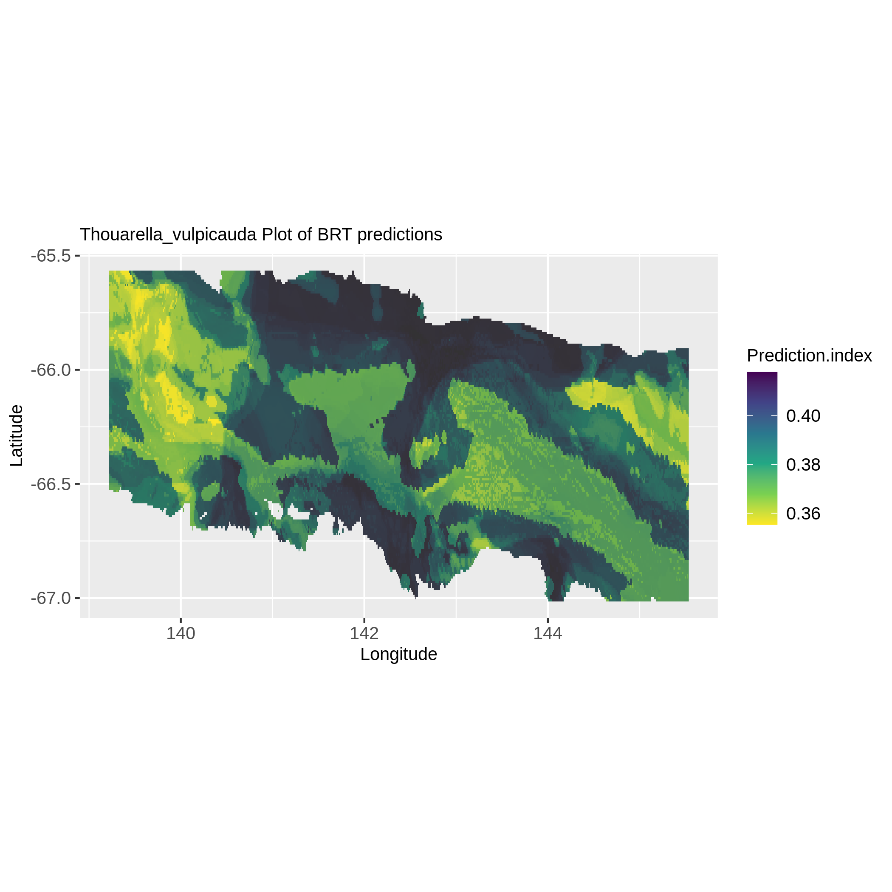

This tutorial is designed to guide you through the Ecoregionalization Galaxy workflow, demonstrating how to create an ecoregionalization map from occurrences and environmental data using a boosted regression trees model for predictions.

The workflow, consisting of five tools, is intended for processing occurrence data, which should include latitude, longitude, species presence or absence, and environmental characteristics. The tutorial will provide a detailed explanation of inputs, workflow steps, and outputs.

The primary goal of this workflow is to generate species distribution maps and identify eco-regions within the study area. The project's objective is to offer accessible, reproducible, and transparent IT solutions for processing and analyzing species occurrence data.

This workflow is therefore composed of 5 tools: 

- BRT prediction tool
- TaxaSeeker
- ClusterEstimate
- ClaraClust
- EcoMap

Let's delve into the tutorial, outlining each step and tool to manage the creation of ecoregionalization maps. 

> <details-title>Some definitions to start</details-title>
>
> Ecoregionalization: The process by which a territory is classified into a category of areas that respond to the same environmental factors (including species). 
>
> Occurrences data: Data showing the presence of a species at a particular location.
>
> Environemental data: Environmental data are any measurements or information that describe environmental processes, location, or conditions.
> 
> Boosted regression trees (BRT): Boosted Regression Trees is a kind of regression methodology based on Machine Learning. Unlike conventional regression methods (GLMs, GAMs), BRTs combine numerous basic decision trees to enhance the predictive performance. BRTs can handle complex relationships and interactions among predictors, and it is considered a robust technique that can control outliers and nonlinearity.
> 
> Clustering: Clustering is a machine learning method of grouping data points by similarity or distance.
>
> CLARA/PAM : CLARA (Clustering Large Applications), is an extension to k-medoids (PAM) methods to deal with data containing a large number of objects. PAM stands for “Partition Around Medoids”, the PAM algorithm searches for k representative objects in a data set (k medoids) and then assigns each object to the closest medoid in order to create clusters.
{: .details}

> <agenda-title></agenda-title>
>
> In this tutorial, we will cover:
>
> 1. TOC
> {:toc}
>
{: .agenda}

# Before starting 

This part will present the type of data you need to run the ecoregionalization workflow. 

## Environmental data

The first data you will need to run this workflow is environmental data. As defined above, environmental data are any measurements or information that describe environmental processes, location, or conditions. This workflow accepts several types of environmental parameters like temperature or soil type. However there is a mandatory file format, the tabular format (.tsv) and each pixel of the study area must be described in this file by associating latitude and longitude with environmental parameters.

This is an example of environmental file input in this workflow: 

+------+------+---------+------+------+
| long | lat  |  Carbo  | Grav | ...  |
+------+------+---------+------+------+
|139.22|-65.57|   0.88  |28.59 | ...  |
+------+------+---------+------+------+
|139.25|-65.63|   0.88  |28.61 | ...  |
+------+------+---------+------+------+
| ...  | ...  |   ...   | ...  | ...  |
+------+------+---------+------+------+

## Occurrence data

The second data file you will need to run this workflow is an occurrences data file. As defined above, occurrences data are showing the presence of a species at a particular location. This data file, also need to be in tabular format (.tsv) and need to be construct as following: 

- Columns latitude and longitude

- One column per taxon where each box corresponding to a geographical point is marked 1 if the taxon is present or 0 if the taxon is absent 

- The environmental characteristics corresponding to the geographical coordinates. 

This is an example of occurrence data file input in this workflow:

+---------+----------+-----------+------------------------+-----------+-----+------+--------------+-----+
| station |   lat    |   long    |Acanthorhabdus_fragilis | Acarnidae | ... | Grav |  Maxbearing  | ... |
+---------+----------+-----------+------------------------+-----------+-----+------+--------------+-----+
|1        |-65,9     |142,3      |1                       |0          | ... |28.59 |3.67          | ... |
+---------+----------+-----------+------------------------+-----------+-----+------+--------------+-----+
|10       |-66,3     |141,3      |0                       |1          | ... |28.61 |3.64          | ... |
+---------+----------+-----------+------------------------+-----------+-----+------+--------------+-----+
|   ...   |   ...    |   ...     |...                     |    ...    | ... | ...  |...           | ... |
+---------+----------+-----------+------------------------+-----------+-----+------+--------------+-----+

## Data upload

> <hands-on-title> Data Upload </hands-on-title>
>
> 1. Create a new history for this tutorial give it a name (example: “Ecoregionalization workflow”) for you to find it again later if needed.
>
>    
>
>    
>
> 2. Import the environement file and occurrence file(s) from your local environement.
>   
>    
>
> 3. Rename the datasets if needed. 
>
> 
>
> 4. Check that the datatype is tabular.
>
>    
>
> 5. Add to each occurrence data file (if you have multiple files) a tag to avoid mixing them.
>
>    
>
{: .hands_on}

# Predicting taxa distribution with **BRT**

This first step implements a commonly used approach in ecological studies, namely species distribution modelling (SDM). This allows to characterize the distribution of each taxon by giving an indicator of probability of taxon presence for each environmental layer pixel. Here, the method boosted regression trees (BRT) was used to adjust the relationship between the presence of a single taxon and the environmental conditions under which the taxon has been detected. BRT modelling is based on a learning algorithm automatic using iterative classification trees. 

## What it does ?

Two treatments are performed in this tool: the creation of the taxa distribution model and the use of this model to obtain a prediction index. The prediction index obtained from each BRT model for each pixel of the environmental layers is an approximation of the probability of detection of the presence of the taxon.

This tool gives in output a file containing the predictions of the probability of the presence of each taxon for each pixel (latitude, longitude) environmental, a visualization of these pixels for each taxon and graphs showing the percentage of model explanation for each environmental parameter. We'r gonna go back to this in the following workflow you have an example of these files below. 

## How to use it ?

> <hands-on-title> Run the BRT tool </hands-on-title>
>
> 1.  with the following parameters:
>    -  *"Environment Data"*: `env.tsv` (Input dataset containing your environement data)
>    - *"What's the decimal separator of your environment data file ?"*: `Dot`
>    -  *"Occurrences Data File"*: `occurrences.tsv` (Input dataset(s) containing your species occurrences. You can select multiple datasets)
>
>      
>
>    - *"What's the decimal separator of your occurrences data file(s) ?"*: `Comma`
>    - *"Choose column(s) where your abiotic parameter are in your environment data file."*: `c['3', '4', '5', '6', '7', '8', '9', '10', '11', '12', '13', '14', '15', '16', '17', '18', '19']`
>
> Remember : Your abiotic parameters must be present in your occurrence data file(s) and must be named the same as in your environment file. 
>    
> 2. Check your outputs. You must have four outputs collections.
>
>    - Prediction files
>    - Validation files (Taxa, AUC, Tree complexity, Total deviance explained)
>    - Species distribution prediction maps
>    - Partial dependence plots
>
{: .hands_on}

In the 'Prediction files' collection there must be a file containing predictions of the probability of the presence of each taxon for each environmental pixel (latitude, longitude) for each occurrence file you entered.

In the collection 'Validation files' there must be a file containing for each taxon the validation metrics of the associated model.

In the collection 'Species distribution prediction map' there must be for each taxon a map representing their probability of presence at each environmental layer pixel. 
Here is an example:

In the 'Partial dependence plots' collection there should be graphs showing the percentage explanation of the model for each environmental parameter.
Here is an example: 

# Collecting the list of taxa with **TaxaSeeker**

## What it does ?

This tool does three things:

- It allows obtaining a summary file for each taxon indicating whether a BRT model was obtained and the number of occurrences per taxon.

- It provides a list of taxons that obtained cleaned BRT models (without "_", "_sp", etc.) to propose the list to WoRMS (World Register Of Marine Species) and obtain more information about the taxons.

- It generates a list of taxons that obtained a BRT model that we need in the subsequent ecoregionalization workflow step.

## How to use it ?

> <hands-on-title> Run TaxaSeeker </hands-on-title>
>
> 1.  with the following parameters:
>
>    -  *"Environement file"*: `env.tsv` (Input dataset containing your environement data)
>
>    -  *"Occurences file"*: `occurrences.tsv` (Input dataset(s) containing your species occurrences. You can select multiple datasets)
>
>      
>
>    -  *"Predictions file"*: `Prediction files collection` (output of **BRT prediction tool** )
>
>      
>
> 2. Check your outputs. You must have three files:
>
>    - Summary of taxa model
>    - List of taxa
>    - List of taxa clean
>
{: .hands_on}

# Determine the optimal cluster number with **ClusterEstimate**

## What it does ?

This tool enables the determination of the optimal number of clusters for partition-based clustering, along with generating files used in the subsequent ecoregionalization workflow step.

The tool will produce three outputs. The first two are files that will be used in the following steps of the workflow: a file containing four pieces of information, latitude, longitude, presence prediction and corresponding taxon, and a file containing the data to be partitioned. 
The third output corresponds to the main information of the tool, a graph presenting the value of the SIH index according to the number of clusters. The silhouette index provides a measure of the separation between clusters and the compactness within each cluster. The silhouette index ranges from -1 to 1. Values close to 1 indicate that objects are well grouped and separated from other clusters, while values close to -1 indicate that objects are poorly grouped and may be closer to other clusters. A value close to 0 indicates a situation where objects are located at the border between two neighboring clusters. So the optimal number of clusters is the one that maximizes the value of the SIH index.

## How to use it ?

> <hands-on-title> Run ClusterEstimate </hands-on-title>
>
> 1.  with the following parameters:
>    -  *"Environment file"*: `env.tsv` (Input dataset containing your environement data)
>    -  *"Taxa selected file (List of taxa from TaxaSeeker tool)"*: `List_of_taxa.txt` (output of **TaxaSeeker** )
>    -  *"Prediction files"*: `Prediction files collection` (output of **BRT prediction tool** )
>
>      
>
>    - *"Number of Cluster to test"*: `10` (You can choose any number, but remember that the more cluster numbers to test the longer it will take)
>
>    > <comment-title> Two other parameters </comment-title>
>    > 
>    > The other two parameters can be left as is. If you need to change them here is a short description of what they do :
>    >
>    > The first one is metric used to calculate the dissimilarities between the observations: Manhattan (distance between two real-valued vectors), Euclidean (shortest distance between two 
>    > points) and Jaccard (defined as the size of the intersection divided by the size of the union of the sample sets)
>    >
>    > The second one is the sample size that will be used to perform clustering. 
>    > Indeed, the clara function is used to clustering large data using a representative sample rather than the entire data set. This will speed up the clustering process and make the calculation
>    > more efficient. A fairly high value representative of the data is recommended. It is important to note that using too small a sample may result in loss of information compared to using the
>    > entire data set.
>    > 
>    {: .comment}
>
> 2. Check your outputs. You must have three files:
>
>    - SIH index plot (See example below.)
>    - Data to cluster (Containing the data to be partitioned.)
>    - Data.bio table (Containing four pieces of information, latitude, longitude, presence prediction and corresponding taxon.)
>
{: .hands_on}

There is an example of an SIH index plot : 

With this graph you will be able to determine the optimal number of clusters that have retained for the construction of ecoregions. As said before, the optimal number of cluster is the one that
maximizes the SIH index. In this example, the number of clusters that optimizes the SIH index is two, however, splitting into two clusters produces *de facto* a high SIH value because partitioning
into two entities is very robust but is not necessarily a good indicator. Depending on your data, it may be better to take the second highest SIH score here six.

# Build ecoregional clusters with **ClaraClust**

## What it does ?

This tool is made to partition the pixels of the environmental layers according to the associated values of the BRT prediction index. Due to the large size of the datasets, the Clara function of the Cluster package was used to apply the Partitioning Around Medoids (PAM) algorithm on a representative sample of the data. This speeds up the clustering process and makes the calculation more efficient. 

## How to use it ?

> <hands-on-title> Run ClaraClust </hands-on-title>
>
> 1.  with the following parameters:
>    -  *"Prediction matrix (data to cluster from Cluster Estimate tool) "*: `Data_to_cluster.tsv` (output of **ClusterEstimate** )
>    -  *"Environmental file"*: `env.tsv` (Input dataset)
>    -  *"Prediction file (data.bio table from Cluster Estimate tool)"*: `Data.bio_table.tsv` (output of **ClusterEstimate** )
>    - *"Number of Cluster wanted"*: `6` (Number of cluster determined at the previous step of the workflow)
>
>    > <comment-title> Two other parameters </comment-title>
>    > 
>    > Like the previous step there is two more parameters that can be change. 
>    >
>    > The other two parameters can be left as is. If you need to change them here is a short description of what they do :
>    >
>    > The first one is metric used to calculate the dissimilarities between the observations: Manhattan (distance between two real-valued vectors), Euclidean (shortest distance between two 
>    > points) and Jaccard (defined as the size of the intersection divided by the size of the union of the sample sets)
>    >
>    > The second one is the sample size that will be used to perform clustering. 
>    > Indeed, the clara function is used to clustering large data using a representative sample rather than the entire data set. This will speed up the clustering process and make the calculation
>    > more efficient. A fairly high value representative of the data is recommended. It is important to note that using too small a sample may result in loss of information compared to using the
>    > entire data set.
>    > 
>    {: .comment}
>
> 2. Check your outputs. You must have three files:
>
>    - SIH index plot (See example below.)
>    - Cluster points (Contains the latitude and longitude of the environmental pixel and the associated cluster number. We will use it in the next step of the workflow)
>    - Cluster info (Contains all the information related to the clusters created, that is, in column: the latitude, the longitude, the corresponding cluster number and for each taxon the prediction value.)
>
{: .hands_on}

The tool will produce a silhouette plot that you can see below. A silhouette graph is a representation used to visualize the silhouette index of each observation in a clustered data set. It makes it possible to 
assess the quality of clusters and determine their coherence and separation. In a silhouette graph, each observation is represented by a horizontal bar whose length is proportional to its silhouette index. The longer
the bar, the better the consistency of the observation with its cluster and the separation from other clusters. As mentioned above, the silhouette index ranges from -1 to 1. Values close to 1 indicate that objects 
are well grouped and separated from other clusters, while values close to -1 indicate that objects are poorly grouped and may be closer to other clusters. A value close to 0 indicates a situation where objects are 
located at the border between two clusters. Here, in the graph below, there is a good distribution of the observations because the majority of the bars are above the average value of the silhouette index.

# Build a ecoregionalization map with **EcoMap**

> <hands-on-title> Run EcoMap </hands-on-title>
>
> 1.  with the following parameters:
>    -  *"Source file (cluster points from previous step)"*: `cluster_points.tsv` (output of **ClaraClust** )
>
> This tool simply need the previous step output "cluster points" file and can make a map representing ecoregions. 
>
> 2. Check output. You must have one Map representing ecoregions.
>
{: .hands_on}

This is an example of output map with our six cluster representing ecoregions.

# Conclusion

Congratulations! You have successfully completed the ecoregionalization workflow. Here is the end of this tutorial aiming in explaining the purpose of the ecoregionalization workflow and how to use it. This workflow provides a systematic and reproducible approach to ecoregionalization, allowing researchers to identify distinct ecological regions based on species occurrences and environmental data.This tutorial shows how to use this workflow and its tools step by step or separatly.It allow you to understand the ecoregion construction. You learn the use of the BRT algorithm for the modeling of species distribution as well as the cluster construction with the k-medoid clustering algorithms (CLARA/PAM). Feel free to explore and adapt this workflow for your specific research needs. If you have any questions or encounter issues during the workflow, refer to the provided documentation or seek assistance from the Galaxy community. Don't hesitate to contact us if you have any questions.
