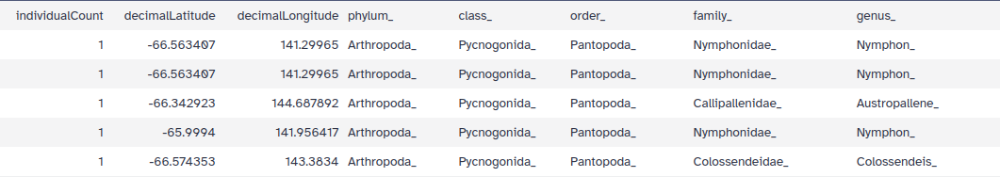
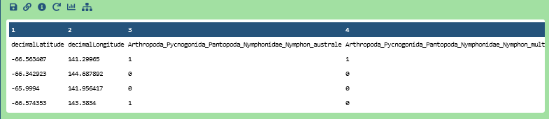
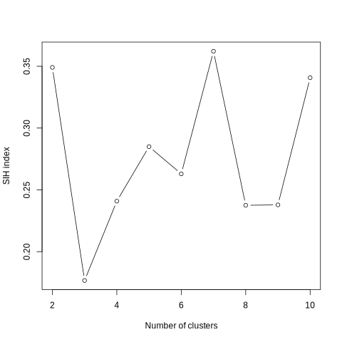
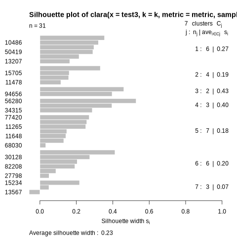
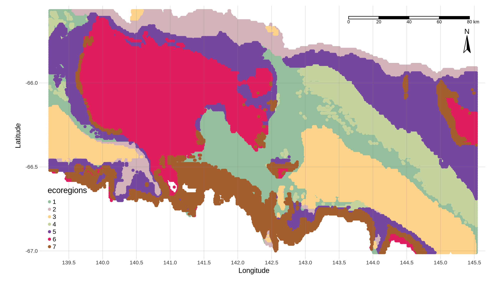

This tutorial is designed to guide you through the Ecoregionalization Galaxy workflow, demonstrating how to create an ecoregionalization map from occurrences and environmental data using a boosted regression trees model for predictions.

The workflow, consisting of six tools, is intended for processing occurrence data, which should include latitude, longitude and species presence or absence. The tutorial will provide a detailed explanation of inputs, workflow steps, and outputs. This tutorial gives a practical example, highlighting a use case centered on the Dumont d'Urville sea region and benthic invertebrates.

The primary goal of this workflow is to generate species distribution maps and identify ecoregions within the study area. The project's objective is to offer accessible, reproducible, and transparent IT solutions for processing and analyzing species occurrence data.

This workflow is therefore composed of 6 tools:

- GeoNearestNeighbor
- BRT prediction tool
- TaxaSeeker
- ClusterEstimate
- ClaraClust
- EcoMap

And in this tutorial we will be using 5 more tools to format data before running the ecoregionalization workflow:

- Advanced cut
- Column Regex Find And Replace
- Filter Tabular
- Merge Columns
- Interactive JupyterLab and notebook

Let's delve into the tutorial, outlining each step and tool to manage the creation of ecoregionalization maps.

> <details-title>Some definitions to start</details-title>
>
> Ecoregionalization: The process by which a territory is classified into a category of area that respond to the same environmental factors taking into account species information.
>
> Occurrences data: Data showing the presence of a species at a particular location.
>
> Environmental data: Environmental data are any measurement or information that describe environmental processes, location, or conditions.
>
> Boosted regression trees (BRT): Boosted Regression Trees is a kind of regression methodology based on Machine Learning. Unlike conventional regression methods (GLMs, GAMs), BRTs combine numerous basic decision trees to enhance the predictive performance. BRTs can handle complex relationships and interactions among predictors, and it is considered a robust technique that can control outliers and nonlinearity.
>
> Clustering: Clustering is a machine learning method of grouping data points by similarity or distance.
>
> CLARA/PAM : CLARA (Clustering Large Applications), is an extension to k-medoids (PAM) methods to deal with data containing a large number of objects. PAM stands for "Partition Around Medoids", the PAM algorithm searches for k representative objects in a data set (k medoids) and then assigns each object to the closest medoid in order to create clusters.
{: .details}

> <agenda-title></agenda-title>
>
> In this tutorial, we will cover:
>
> 1. TOC
> {:toc}
>
{: .agenda}

# Before starting

This part will present the type of data you need to run the ecoregionalization workflow. This data will be downloaded in the next part of the tutorial.

## Environmental data

To run this workflow, you will first need environmental data. This workflow accepts several types of environmental parameters like temperature or soil type. However, there is a mandatory file format, the tabular format (.tsv), and each pixel of the study area must be described in this file by associating latitude and longitude with environmental parameters.

In the use case presented in this tutorial, seventeen abiotic and physical parameters of the Dumont D'Urville sea region are used. They were taken from oceanographic models and in situ measurements . The physical oceanographic parameters are mean temperature and its standard deviation, mean salinity and its standard deviation, mean current magnitude and its standard deviation, maximum current bearing, maximum current magnitude and sea ice production. Bathymetric parameters are depth, slope, and rugosity. Finally, the seabed substrate composition was characterized by percentages of biogenic carbonate, biogenic silica, gravel, sand, and mud.

Here an example of environmental file input:


|------|------|---------|------|------|
| long | lat  |  Carbo  | Grav | ...  |
|------|------|---------|------|------|
|139.22|-65.57|   0.88  |28.59 | ...  |
|------|------|---------|------|------|
|139.25|-65.63|   0.88  |28.61 | ...  |
|------|------|---------|------|------|
| ...  | ...  |   ...   | ...  | ...  |
|------|------|---------|------|------|

## Occurrence data

The second data file you will need to run this workflow is an occurrences data file. As defined above, occurrences data are showing the presence (1) or absence (0) of a species at a particular location. This data file also needs to be in tabular format (.tsv) and need to be construct as following:

- latitude and longitude columns.

- One column per taxon where each box corresponding to a geographical point is marked 1 if the taxon is present or 0 if the taxon is absent.

Here an example of occurrences data file input:

|----------|-----------|------------------------|-----------|-----|
|   lat    |   long    |Acanthorhabdus_fragilis | Acarnidae | ... |
|----------|-----------|------------------------|-----------|-----|
|-65,9     |142,3      |1                       |0          | ... |
|----------|-----------|------------------------|-----------|-----|
|-66,3     |141,3      |0                       |1          | ... |
|----------|-----------|------------------------|-----------|-----|
|   ...    |   ...     |...                     |    ...    | ... |
|----------|-----------|------------------------|-----------|-----|

For this tutorial, occurrences data from the Dumont d'Urville sea region will be downloaded from the GBIF. These data were collected as part of the CEAMARC program (The Collaborative East Antarctic Marine Census ) between December 2007 and January 2008 . Prior to its inclusion in GBIF, these data originated from collections at the Muséum national d’Histoire naturelle (MNHN – Paris). A GBIF filter was used to download only the data of interest, namely the data from the CEAMARC expedition from the Aurora Australis icebreaker. The selected occurrences are invertebrates. In the GBIF query, five collections were selected: the cnidarians collection (IK), the echinoderm collection (IE), the crustaceans collection (IU), the molluscs collection (IM), and the tunicates collection (IT), and only occurrences recorded by “IPEV-AAD-MNHN" which correspond to the CEAMARC expedition.

## Jupyter notebook for the interactive JupyerLab and notebook tool

To switch from the occurrence data download from GBIF to the occurrence data supported by the ecoregionalisation workflow, the final step of data preparation use the "Interactive JupyterLab and notebook" tool who needs a jupyter notebook to work. In this Jupyter notebook, we used the pivot_wider function of the tidyr R package to transform our data into a wider format and adapt it to subsequent analyses as part of the Galaxy workflow for ecoregionalization. This transformation allowed us to convert our data to a format where each taxon becomes a separate column. We also took care to fill in the missing values with zeros and to sum the individual counts in case of duplications. Then all data >= 1 are replaced by 1 to have only presence (1) or abscence (0) data.

## Get data

> <hands-on-title> Data Upload </hands-on-title>
>
> 1. Create a new history for this tutorial and give it a name (example: “Ecoregionalization workflow”) for you to find it again later if needed.
>
>    
>
>    
>
> 2. Import occurrence data file from [GBIF](https://www.gbif.org/occurrence/download/0030809-240506114902167), environment file from [InDoRES](https://data.indores.fr/file.xhtml?persistentId=doi:10.48579/PRO/LQMHX9/CYSKQG&version=1.0#) and Jupyter notebook file from [InDoRES](https://data.indores.fr/file.xhtml?persistentId=doi:10.48579/PRO/LQMHX9/GIEAQN&version=1.0#)
>
>    Occurrence data file as a zip file where you will find "occurrence.txt"
>    ```
>    https://api.gbif.org/v1/occurrence/download/request/0030809-240506114902167.zip
>    ```
>    Environemental data : "ceamarc_env.tab"
>    ```
>    https://data.indores.fr/api/access/datafile/9777
>    ```
>    Jupyter notebook : "pivot_wider_jupytool_notebook.ipynb"
>    ```
>    https://data.indores.fr/api/access/datafile/9756
>    ```
>
>    
>
>    
>
> 3. The GBIF link allows you to download a zip file containing multiple information files about the dataset. The file that you need is the 'occurrence.txt' file that we will specifically extract on Galaxy in the following step.
>
> 4. Use   to create a data collection in your history where all GBIF archive files will be unzipped
>
> 5. Unhide the "occurence.txt" data file then modify datatype to select the "tabular" one
>
>    
>
>    
>
> 6. Rename the datasets if needed, notably "9756" by "pivot_wider_jupytool_notebook.ipynb" and "9777" by "ceamarc_env.tab".
>
>    
>
> 7. Check that the datatype of the environment file and occurrence file are tabular.
>
>    
>
{: .hands_on}

# Data formatting

The first step of this tutorial is data formatting because the GBIF species occurrence file download needs to be in a specific format to be included inside the Ecoregionalization workflow.

## Keep data columns that we need with **Advanced Cut**

> <hands-on-title> Select the columns we need </hands-on-title>
>
> 1.  with the following parameters:
>    -  *"File to cut"*: `occurrence` (Input dataset)
>    - *"Operation"*: `Keep`
>    - *"Cut by"*: `fields`
>    - *"Delimited by"*: `Tab`
>        - *"Is there a header for the data's columns ?"*: `Yes`
>            - *"List of Fields"*: `c['27', '98', '99', '158', '159', '160', '162', '166', '170']`
>
{: .hands_on}

> <question-title></question-title>
>
> 1. What are the kept columns ?
>
> > <solution-title></solution-title>
> >
> > 1. The columns we kept are : indivdualCount, decimalLatitude, decimalLongitude, phylum, class, order, family, genus, specificEpithet.
> >
> {: .solution}
>
{: .question}

## Replace empty space with NAs with **Column Regex Find And Replace**

This step is used to add NAs to replace empty space in the file. We will do that for the four first columns and then remove lines with NA to have a complete dataset.

> <hands-on-title> Replace empty space by NAs for the first column </hands-on-title>
>
> 1.  with the following parameters:
>    -  *"Select cells from"*: `output` (output of **Advanced Cut** )
>    - *"using column"*: `c1`
>    - In *"Check"*:
>        -  *"Insert Check"*
>            - *"Find Regex"*: `^$`
>            - *"Replacement"*: `NA`
>
> > <warning-title>Pay attention to the regex parameter</warning-title>
> >
> > The regular expression ("^$") is used to capture empty cells in the dataframe so that they can be replaced by NA (Not Available). It is not advised to modify this regular expression nor its replacement, as you will encounter problems while running the next parts of the workflow.
> >
> {: .warning}
>
{: .hands_on}

> <hands-on-title> Replace empty space by NAs for the second column </hands-on-title>
>
> 1.  with the following parameters:
>    -  *"Select cells from"*: `out_file1` (output of **Column Regex Find And Replace on the first column** )
>    - *"using column"*: `c2`
>    - In *"Check"*:
>        -  *"Insert Check"*
>            - *"Find Regex"*: `^$`
>            - *"Replacement"*: `NA`
>
{: .hands_on}

> <hands-on-title> Replace empty space by NAs for the third column </hands-on-title>
>
> 1.  with the following parameters:
>    -  *"Select cells from"*: `out_file2` (output of **Column Regex Find And Replace on the second column** )
>    - *"using column"*: `c3`
>    - In *"Check"*:
>        -  *"Insert Check"*
>            - *"Find Regex"*: `^$`
>            - *"Replacement"*: `NA`
>
{: .hands_on}

> <hands-on-title> Replace empty space by NAs for the fourth column </hands-on-title>
>
> 1.  with the following parameters:
>    -  *"Select cells from"*: `out_file3` (output of **Column Regex Find And Replace on the third column** )
>    - *"using column"*: `c4`
>    - In *"Check"*:
>        -  *"Insert Check"*
>            - *"Find Regex"*: `^$`
>            - *"Replacement"*: `NA`
> 2. Check your output. At the end of this step you must have NA instead of empty space. See example below.
>
>
>
{: .hands_on}

## Remove lines with NAs with **Filter Tabular**

> <hands-on-title> Remove lines with NAs </hands-on-title>
>
> 1.  with the following parameters:
>    -  *"Tabular Dataset to filter"*: `out_file4` (output of **Column Regex Find And Replace on the fourth column** )
>    - In *"Filter Tabular Input Lines"*:
>        -  *"Insert Filter Tabular Input Lines"*
>            - *"Filter By"*: `by regex expression matching`
>                - *"regex pattern"*: `NA`
>                - *"action for regex match"*: `exclude line if pattern found`
>
> 2. Check your output. All the lines with NAs must have been deleted.
>
{: .hands_on}

### Prepare column merging with **Column Regex Find And Replace**

This manipulation is made in order to merge properly columns “phylum”, “class”, "order", "family", "genus" and "specificEpithet" with a separation.

> <hands-on-title> Add "_" at the end of the phylum column </hands-on-title>
>
> 1.  with the following parameters:
>    -  *"Select cells from"*: `output` (output of **Filter Tabular** )
>    - *"using column"*: `c4`
>    - In *"Check"*:
>        -  *"Insert Check"*
>            - *"Find Regex"*: `(.$)`
>            - *"Replacement"*: `\1_`
> 2. Check your output. All phylum must have "_" at the end.
>
{: .hands_on}

> <hands-on-title> Add "_" at the end of the class column </hands-on-title>
>
> 1.  with the following parameters:
>    -  *"Select cells from"*: `out_file1` (output of **Column Regex Find And Replace on phylum column** )
>    - *"using column"*: `c5`
>    - In *"Check"*:
>        -  *"Insert Check"*
>            - *"Find Regex"*: `(.$)`
>            - *"Replacement"*: `\1_`
> 2. Check your output. All class must have "_" at the end.
>
{: .hands_on}

> <hands-on-title> Add "_" at the end of the order column </hands-on-title>
>
> 1.  with the following parameters:
>    -  *"Select cells from"*: `out_file2` (output of **Column Regex Find And Replace on class column** )
>    - *"using column"*: `c6`
>    - In *"Check"*:
>        -  *"Insert Check"*
>            - *"Find Regex"*: `(.$)`
>            - *"Replacement"*: `\1_`
> 2. Check your output. All order must have "_" at the end.
>
{: .hands_on}

> <hands-on-title> Add "_" at the end of the family column </hands-on-title>
>
> 1.  with the following parameters:
>    -  *"Select cells from"*: `out_file1` (output of **Column Regex Find And Replace on order column** )
>    - *"using column"*: `c7`
>    - In *"Check"*:
>        -  *"Insert Check"*
>            - *"Find Regex"*: `(.$)`
>            - *"Replacement"*: `\1_`
> 2. Check your output. All family must have "_" at the end.
>
{: .hands_on}

> <hands-on-title> Add "_" at the end of the genus column </hands-on-title>
>
> 1.  with the following parameters:
>    -  *"Select cells from"*: `out_file1` (output of **Column Regex Find And Replace on family column** )
>    - *"using column"*: `c8`
>    - In *"Check"*:
>        -  *"Insert Check"*
>            - *"Find Regex"*: `(.$)`
>            - *"Replacement"*: `\1_`
> 2. Check your output. All genus must have "_" at the end. See example below.
>
> 
>
{: .hands_on}

## Merge taxa columns with **Merge Columns**

> <hands-on-title> Merge columns “phylum”, “class”, "order", "family", "genus" and "specificEpithet" </hands-on-title>
>
> 1.  with the following parameters:
>    -  *"Select data"*: `out_file1` (output of **Column Regex Find And Replace on genus column** )
>    - *"Merge column"*: `c4`
>    - *"with column"*: `c5`
>    - In *"Columns"*:
>        -  *"Insert Columns"*
>            - *"Add column"*: `c6`
>        -  *"Insert Columns"*
>            - *"Add column"*: `c7`
>        -  *"Insert Columns"*
>            - *"Add column"*: `c8`
>        -  *"Insert Columns"*
>            - *"Add column"*: `c9`
> 2. Check your output. Your table must have a new column filled with the concatenation of “phylum”, “class”, "order", "family", "genus" and "specificEpithet" columns.
>
{: .hands_on}

## Remove columns no longer needed with **Advanced Cut**

> <hands-on-title> Remove columns that we don't need anymore </hands-on-title>
>
> 1.  with the following parameters:
>    -  *"File to cut"*: `out_file` (output of **Merge Columns** )
>    - *"Operation"*: `Discard`
>    - *"Cut by"*: `fields`
>    - *"Delimited by"*: `Tab`
>        - *"Is there a header for the data's columns ?"*: `Yes`
>            - *"List of Fields"*: `c['4', '5', '6', '7', '8', '9']`
> 2. Check your output. Columns “phylum”, “class”, "order", "family", "genus" and "specificEpithet" must have been deleted and your table must have four columns : "individualCount", "decimalLatitude", "DecimalLongitude" and "phylum_class_order_family_genus_specificEpithet". See example below.
>
> 
>
{: .hands_on}

## Obtain final data file with **Interactive JupyterLab Notebook**

The interactive JupyterLab Notebook allows to create, run, and share custom Galaxy tools based upon Jupyter Notebooks. Galaxy offers you to use Jupyter Notebooks directly in Galaxy accessing and interacting with Galaxy datasets as you like.
Here you will load an existing jupyter notebook ("pivot_wider_jupytool_notebook.ipynb" that you downloaded earlier) and run the code in it to get the final file that is needed for ecoregionalization workflow.

> <hands-on-title> Pivot_wider with Jupytool </hands-on-title>
>
> 1.  with the following parameters:
>    - *"Do you already have a notebook?"*: `Load a previous notebook`
>        -  *"IPython Notebook"*: `pivot_wider_jupytool_notebook.ipynb` (Input dataset)
>        - *"Execute notebook and return a new one."*: `Yes`
>    - In *"User inputs"*:
>        -  *"Insert User inputs"*
>            - *"Name for parameter"*: `Input file`
>            - *"Choose the input type"*: `Dataset`
>                -  *"Select value"*: `output` (output of previous step **Advanced Cut** )
>
> > <warning-title>Pay attention to the tool version</warning-title>
> >
> > It is possible to have specific troubleshoots with using interactive tools as, for now, we can't redirect to a specific version of the tool (as for classical tool) from the tutorial page. Here, if you encounter errors, you maybe need to specify the 1.0.0 version (the one used for the tuto) !
> >
> {: .warning}
>
> > <tip-title>How to launch the notebook</tip-title>
> >
> >   - The first parameter allows you to specify that you want to use a previous notebook ("pivot_wider_jupytool_notebook.ipynb") rather than create a new one.
> >   - Then you need to insert your ready to use jupyter notebook ("pivot_wider_jupytool_notebook.ipynb").
> >   - The third parameter is important to specify that you just want to execute a notebook and not dive into the web frontend (in this case).
> >   - Then you need to clik on "+ Insert User inputs"" button to add the next parameters.
> >   - After, you need to give a name to your input and choose its type.
> >   - Finally you have to input the occurrence data file that will be treated in the Jupyter Notebook.
> >
> > 
> >
>{: .tip}
>
> 2. Check your output ("Intercative JupyterLab Notebook on data (pivot_file)") in your galaxy history. You must have a tabular file with latitude and longitude in first two columns and the others columns must be taxa. See example below.
>
> 
>
> >  <warning-title>Galaxy can't display properly file with too many columns</warning-title>
> >
> > Too avoid having web interface issues, Galaxy is not displaying tabulated files with "beautifull" columns visualization when number of clumns is big. That's why here we are showing the preview of the dataset from the history.
> >
> {: .warning}
> 
{: .hands_on}

> <question-title></question-title>
>
> 1. How many columns have your data file now?
>
> > <solution-title></solution-title>
> >
> > 1. It must have 202 columns.
> >
> {: .solution}
>
{: .question}

# Ecoregionalization workflow

Now you have all you need to run the ecoregionalization Workflow :
 - Occurrence formatted file
 - Environment file

## Merge environment and occurence file with **GeoNearestNeighbor**

### What it does ?

This Galaxy tool allows you to merge two data tables (tabular format only) according to their latitude and longitude coordinates (in WGS84 projection), finding the closest points. This tool is used in the Ecoregionalization workflow to filter the occurence data file so it can be used on the BRT prediction tool.

### How to use it ?

> <hands-on-title> Run GeoNearestNeighbor </hands-on-title>
>
> 1.  with the following parameters:
>    - In *"Your environment file (or table 1)"*:
>        -  *"Input your environment data file (tabular format only)"*: `ceamarc_env.tsv` (Input dataset)
>        - *"Choose columns where your latitude is in your environment data file."*: `c2`
>        - *"Choose columns where your longitude is in your environment data file."*: `c1`
>    - In *"Your occurrence file (or table 2)"*:
>        -  *"Input your occurrence data file (tabular format only)"*: `pivot_file` (output of **Interactive JupyTool and notebook** )
>        - *"Choose columns where your latitude is in your occurrence data file."*: `c1`
>        - *"Choose columns where your longitude is in your occurrence data file."*: `c2`
>
>    > <comment-title> Coords precision </comment-title>
>    >
>    > It is recommended that, for optimal precision, the latitude and longitude values in both files should be of the same precision level. And, for the sake of relevance, the geographical coordinates in both files should be as close as possible to apply the most accurate environmental parameters to the correct species occurrences
>    >
>    {: .comment}
>
> 2. Check your outputs. You must have two files:
>       - Information file containing the coordinates of occurrence data, the coordinates retains from environmental data and the distances between the two.
>       - Occurrence and Environment merge file containing occurrence data and environmental data cooresponding.
>
{: .hands_on}

## Predicting taxa distribution with **BRT tool prediction**

This step implements a commonly used approach in ecological studies, namely species distribution modelling (SDM). This allows to characterize the distribution of each taxon by giving an indicator of probability of taxon presence for each environmental layer pixel. Here, the boosted regression trees (BRT) method was used to adjust the relationship between the presence of a single taxon and the environmental conditions under which the taxon has been detected. BRT modelling is based on an automatic learning algorithm using iterative classification trees.

### What it does ?

Two treatments are performed in this tool: the creation of the taxa distribution model and the use of this model to obtain a prediction index. The prediction index obtained from each BRT model for each pixel of the environmental layers is an approximation of the probability of detection of the presence of the taxon.

This tool gives as output a file containing the predictions of the probability of the presence of each taxon for each "environment pixel" (latitude, longitude), a visualization of these pixels for each taxon and graphs showing the percentage of model explanation for each environmental parameter. We're gonna go back to this in the following steps.

### How to use it ?

> <hands-on-title> Run the BRT tool </hands-on-title>
>
> 1.  with the following parameters:
>    -  *"Input your environment data file of your study area (tabular format only)"*: `ceamarc_env.tsv` (Input dataset)
>    -  *"Input your occurrences data file(s) containing also the environmental characteristics where the species has been observe (tabular format only)"*: `Merge table` (output of **GeoNearestNeighbor** )
>
>      
>
>    - *"Choose column(s) where your abiotic parameter are in your environment data file."*: `c['3', '4', '5', '6', '7', '8', '9', '10', '11', '12', '13', '14', '15', '16', '17', '18', '19']`
>
>    > <warning-title>You maybe can here prepare a cup of tea ;)</warning-title>
>    >
>    > This step is a first "long" one, and you have to wait something like 18 minutes and 34 sec to obtain the result. It is maybe the good moment to have a break and go outside to admirate biodiversity around you?
>    >
>    {: .warning}
>
>
> 2. Check your outputs. You must have four outputs collections.
>
>    - Prediction files
>    - Validation files (Taxa, AUC, Tree complexity, Total deviance explained)
>    - Species distribution prediction maps
>    - Partial dependence plots
>
{: .hands_on}

In the 'Prediction files' collection there must be a file containing predictions of the probability of the presence of each taxon for each "environmental pixel" (latitude, longitude) for each occurrence file you entered.

In the 'Validation files' collection there must be a file containing for each taxon the validation metrics of the associated model.

In the 'Species distribution prediction maps' collection there must be for each taxon a map representing their probability of presence at each environmental layer pixel.
Here is an example:


In the 'Partial dependence plots' collection there should be graphs showing the percentage explanation of the model for each environmental parameter.
Here is an example:


## Collecting the list of taxa with **TaxaSeeker**

### What it does ?

This tool does three things:

- It allows obtaining a summary file for each taxon indicating whether a BRT model was obtained and the number of occurrences per taxon.

- It provides a list of taxa that obtained cleaned BRT models (without "_", "_sp", etc.) to propose the list to WoRMS (World Register of Marine Species) or another taxonomic database and obtain more information about the taxa.

- It generates a list of taxa for which a BRT model was obtained, needed as input of following steps.
### How to use it ?

> <hands-on-title> Run TaxaSeeker </hands-on-title>
>
> 1.  with the following parameters:
>    -  *"Environment file (tabular format only)"*: `ceamarc_env.tsv` (Input dataset)
>    -  *"Occurences file(s) (tabular format only)"*: `Merged table` (output of **GeoNearestNeighbor** )
>    -  *"Predictions file(s)"*: `Prediction files collection` (output of **BRT tool prediction** )
>
>    
>
>    2. Check your outputs. You must have three files:
>
>    - Summary of taxa model
>    - List of taxa
>    - List of taxa clean
>
{: .hands_on}

## Determine the optimal number of clusters with **ClusterEstimate**

### What it does ?

This tool enables the determination of the optimal number of clusters for partition-based clustering, along with generating files used in the following anlaysis steps.

The tool will produce three outputs. The first two files that will be used in the following steps of the workflow: a file containing four pieces of information (latitude, longitude, presence prediction and corresponding taxon), and a file containing the data to be partitioned.
The third output corresponds to the main information of the tool, a graph presenting the value of the SIH index according to the number of clusters. The silhouette index provides a measure of the separation between clusters and the compactness within each cluster. The silhouette index ranges from -1 to 1. Values close to 1 indicate that objects are well grouped and separated from other clusters, while values close to -1 indicate that objects are poorly grouped and may be closer to other clusters. A value close to 0 indicates a situation where objects are located at the border between two neighboring clusters. Thus the optimal number of clusters is the one that maximizes the value of the SIH index.

### How to use it ?

> <hands-on-title> Run ClusterEstimate </hands-on-title>
>
> 1.  with the following parameters:
>    -  *"Environment file (tabular format only)"*: `ceamarc_env.tsv` (Input dataset)
>    -  *"Taxa selected file (File 'List of taxa' from TaxaSeeker tool)"*: `List_of_taxa` (output of **TaxaSeeker** )
>    -  *"Prediction files"*: `Prediction files collection` (output of **BRT tool prediction** )
>
>    
>
>    - *"Number of Cluster to test"*: `10` (You can choose any number, but remember that the more cluster numbers to test the longer it will take)
>
>    > <comment-title> Two other parameters </comment-title>
>    >
>    > The other two parameters can be left as is. If you need to change them here is a short description of what they do:
>    >
>    > The first one is metric used to calculate the dissimilarities between the observations: Manhattan (distance between two real-valued vectors), Euclidean (shortest distance between two
>    > points) and Jaccard (defined as the size of the intersection divided by the size of the union of the sample sets)
>    >
>    > The second one is the sample size that will be used to perform clustering.
>    > Indeed, the clara function is used to cluster large data using a representative sample rather than the entire data set. This will speed up the clustering process and make the calculation
>    > more efficient. A fairly high value representative of the data is recommended. It is important to note that using a too small sample size may result in loss of information compared to using the
>    > entire data set.
>    >
>    {: .comment}
>
> 2. Check your outputs. You must have three files:
>
>    - SIH index plot (See example below)
>    - Data to cluster (Containing the data to be partitioned)
>    - Data.bio table (Containing four pieces of information, latitude, longitude, presence prediction and corresponding taxon)
>
{: .hands_on}

> <question-title></question-title>
>
> 1. What is the optimal number of clusters in this use case ?
>
> > <solution-title></solution-title>
> >
> > 1. The optimal number of cluster is seven because it maximizes the value of the SIH index.
> >
> {: .solution}
>
{: .question}

Here is the SIH index plot you must obtained :



With this graph you will be able to determine the optimal number of clusters retained for the construction of ecoregions. As said before, the optimal number of cluster is the one that maximizes the SIH index. In this example, the number of clusters that optimizes the SIH index is seven.

## Build ecoregional clusters with **ClaraClust**

### What it does ?

After choosing an optimal number of clusters with the ClusterEstimate tool, we can now partition each latitude and longitude point according to their associated values of the BRT prediction index. Due to
the large size of the datasets, the Clara function of the Cluster package is used here to apply the Partitioning Around Medoids (PAM) algorithm on a representative sample of the data. This speeds up the
clustering process and makes the calculation more efficient.

### How to use it ?

> <hands-on-title> Run ClaraClust </hands-on-title>
>
> 1.  with the following parameters:
>    -  *"Environmental file (tabular only)"*: `ceamarc_env.tsv` (Input dataset)
>    -  *"Prediction matrix (file 'data to cluster' from Cluster Estimate tool)"*: `Data_to_cluster` (output of **ClusterEstimate** )
>    -  *"Prediction table (file 'data.bio table' from Cluster Estimate tool)"*: `Data.bio_table` (output of **ClusterEstimate** )
>    - *"Number of Cluster wanted"*: `7` (Number of cluster determined at the previous step of the workflow in "SIH index plot")
>
>    > <comment-title> Two other parameters </comment-title>
>    >
>    > The other two parameters can be left as is. If you need to change them here is a short description of what they do:
>    >
>    > The first one is metric used to calculate the dissimilarities between the observations: Manhattan (distance between two real-valued vectors), Euclidean (shortest distance between two
>    > points) and Jaccard (defined as the size of the intersection divided by the size of the union of the sample sets)
>    >
>    > The second one is the sample size that will be used to perform clustering.
>    > Indeed, the clara function is used to cluster large data using a representative sample rather than the entire data set. This will speed up the clustering process and make the calculation
>    > more efficient. A fairly high value representative of the data is recommended. It is important to note that using a too small sample size may result in loss of information compared to using the
>    > entire data set.
>    >
>    {: .comment}
>
> 2. Check your outputs. You must have three files:
>
>    - SIH index plot (See example below.)
>    - Cluster points (Contains the latitude and longitude of each "environmental pixel" and the associated cluster number. We will use it in the next step of the workflow)
>    - Cluster info (Contains all the information related to the clusters created, that is, in column: the latitude, the longitude, the corresponding cluster number and for each taxon the prediction value)
>
{: .hands_on}

The tool will produce a silhouette plot that you can see below. A silhouette graph is a representation used to visualize the silhouette index of each observation in a clustered data set. It makes it possible to
assess the quality of clusters and determine their coherence and separation. In a silhouette graph, each observation is represented by a horizontal bar whose length is proportional to its silhouette index. The longer
the bar, the better the consistency of the observation with its cluster and the separation from other clusters. As mentioned above, the silhouette index ranges from -1 to 1. Values close to 1 indicate that objects
are well grouped and separated from other clusters, while values close to -1 indicate that objects are poorly grouped and may be closer to other clusters. A value close to 0 indicates a situation where objects are
located at the border between two clusters. Here, in the graph below, there is a good distribution of the observations because the majority of the bars are above the average value of the silhouette index.



## Build a ecoregionalization map with **EcoMap**

> <hands-on-title> Run EcoMap </hands-on-title>
>
> 1.  with the following parameters:
>    -  *"Source file (File 'cluster points' from previous step)"*: `cluster_points` (output of **ClaraClust** )
>
> This tool simply need the previous step "Cluster points" output file to generate a map representing ecoregions.
>
> 2. Check output. You must have one Map representing ecoregions.
>
{: .hands_on}

This is the output map with our seven clusters representing ecoregions that you must have obtained.



# Conclusion

Congratulations! You have successfully completed the ecoregionalization workflow. Here is the end of this tutorial aiming to explain the purpose of the ecoregionalization workflow and how to use it. This workflow provides a systematic and reproducible approach to ecoregionalization, allowing researchers to identify distinct ecological regions based on species occurrences and environmental data. This tutorial shows how to use this workflow, step by step, or all in one using the Dumont D'Urville sea region use case with related datasets. It allows you to understand ecoregions construction. You learned the use of the BRT algorithm for modeling species distribution as well as the cluster construction with the k-medoid clustering algorithms (CLARA/PAM). Feel free to explore and adapt this workflow for your specific research needs. If you have any questions, or encounter issues during the workflow, refer to the provided documentation or seek assistance from the Galaxy community. Don't hesitate to contact us if you have any questions.
