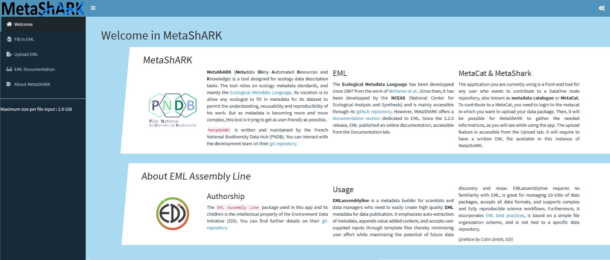
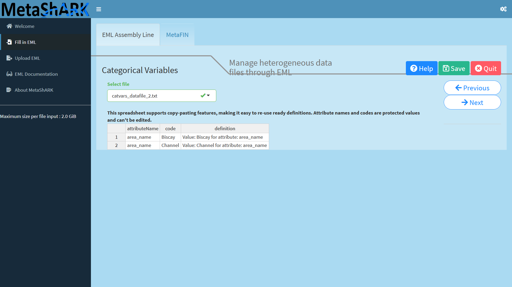
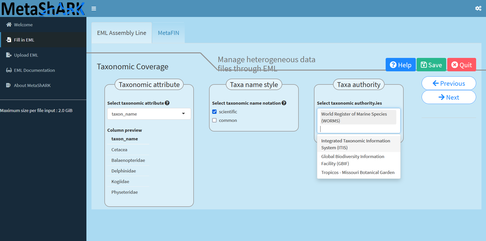
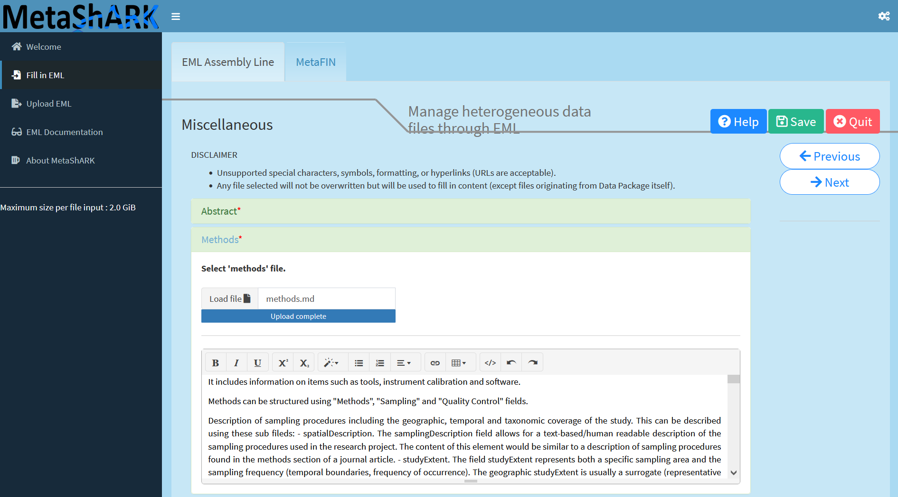
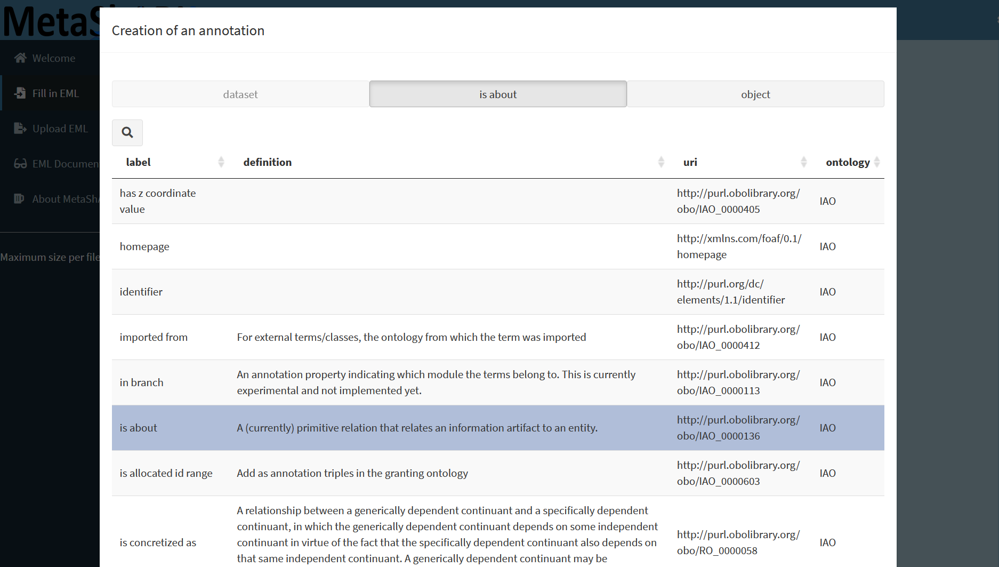
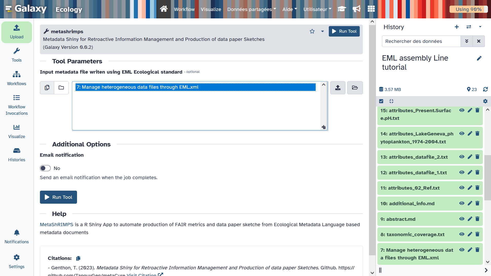
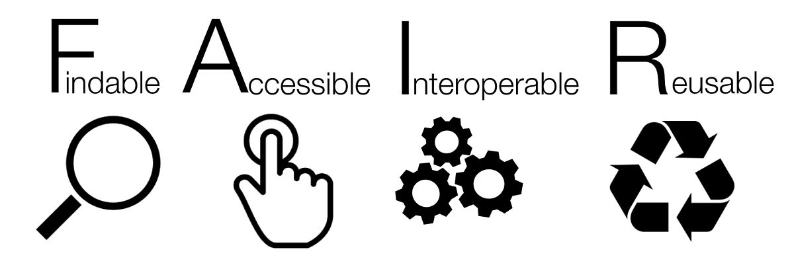
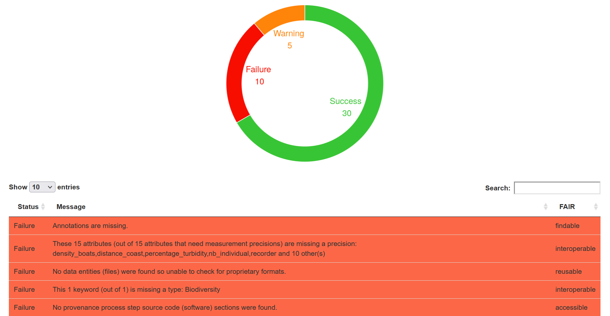

<p align="justify">This tutorial aims to teach <b>how to use functionalities of the EML Assembly Line R package to produce rich metadata</b> using the Ecological Metadata Language (EML) international metadata standard. Here, we will notably propose a concrete example on how to use <b>Galaxy Ecology tools to create, evaluate and modify EML metadata</b> content using both EML Assemby Line metadata template tabular files, easily readable and editable by humans, and XML file, devoted to machine.</p>

> <agenda-title></agenda-title>
>
> In this tutorial, we will cover:
>
> 1. TOC
> {:toc}
>
{: .agenda}

# 1] How can EML Assembly Line functionalities help producing rich metadata easily?

<p align="justify"> A major gap when a researcher is writing metadata documents is the fact that metadata international <b>standards often use formats not really human readable</b> and/or editable as XML or JSON. To answer this issue, <b>[Environmental Data Initiative](https://edirepository.org/) (EDI)</b> through the <b>EML Assembly Line R package</b> propose to generate intermediate metadata template files using classical tabular text format.
Another major issue regarding <b>metadata fill in</b>, is the fact that one <b>need to take a lot of time to write</b>, and often rewrite, metadata elements who can be already filled using automatic inferences or use of webservices. Here again, Environmental Data Initiaitve (EDI) through the <b>EML Assembly Line R</b> package propose to <b>generate automatically information</b> related to data attributes, geographic coverage, taxonomic coverage, using the content of provided datafiles.
<br><br>
Finally, through the MetaShARK R Shiny app, an R Shiny app in beta version for test, created by the french biodiversity data hub research infrastructure (Pôle national de données de Biodiversité (<b>PNDB</b>)), user can use a graphical user interface to apply the EML Assembly Line workflow and benefit from some additionnal functionnalities as:</p>

- Capacity to associate terminological resources terms coming from Bioportal ontologies to data attributes as keywords using CEDAR API
- Automatic fill in of personal information using ORCID API
- Automatic production of a data paper draft

<br>

> <comment-title>What is a <b>Data Paper</b> ?</comment-title>
> According to the [GBIF](https://www.gbif.org/data-papers) (Global Biodiversity Information Facility), 
> A data paper is a peer reviewed document describing a dataset, published in a peer reviewed journal. It takes effort to prepare, curate and describe data. 
> Data papers provide recognition for this effort by means of a scholarly article.
{: .comment}


# 2] Get data to describe 💾📂

> <hands-on-title> Data Upload </hands-on-title>
>
> 1. Create a new history for this tutorial. You can name it "EML assembly Line tutorial" for example
> 2. Download all files on your local computer from Zenodo: https://zenodo.org/api/records/10663465/files-archive. It is neccessary as for now, MetaShARK is deployed from Galaxy but without having a possibility to directly populate MetaShARK app with datafiles from Galaxy. You will thus then have to upload manually data files from your local computer to MetaShARK.
> 3. Unzip the donwloaded archive so you can access each file independently
> 4. Import tsv, netcdf and geotiff data files directly from [Zenodo]({{ page.zenodo_link }}) so it can be used on some steps of the tutorial.
>     -> Training Data for "Creating metadata using Ecological Metadata Language (EML) standard with EML Assembly Line functionalities" Galaxy tutorial:
>    ```
>    https://zenodo.org/records/10663465/files/datafile_1.tsv
>    https://zenodo.org/records/10663465/files/datafile_2.tsv
>    https://zenodo.org/records/10663465/files/LakeGeneva_phytoplankton_1974-2004.nc
>    https://zenodo.org/records/10663465/files/Present.Surface.pH.tif
>    ```
>    
> 6. Import shapefile related files into Galaxy using the Galaxy upload tool, then on the "composite" tab, specifying "shp" composite type, then uploading .dbf, .shp and .shx files on the dedicated spaces.
>    
{: .hands_on}

# 3] MetaShARK 🦈 : Write rapidly an EML document through a work in progress interactive app 

To deploy a MetaShARK app, you can go to the Galaxy tool  and click "Execute". Then, you have to wait the launch of the app, and when ready to be used, you will see the message "There is an InteractiveTool result view available," with an hyperlink on the "Open" statement allowing you to reach the app clicking on it.

> <comment-title>WARNING</comment-title>
> 🚧 Note that MetaShARK R shiny app is in beta version. You can thus encounter issues using it!
{: .comment}

When oppening MetaShARK, you will have an interface looking like this :



To start creating metadata, you need to reach the **Fill in EML** module, then specify or complete the automatic `Data package name` and mention the `Dataset title`. Here a title can be "Manage heterogeneous data files through EML". Finally, you can choose an open licence between CC-BY-4.0, default, or CC0 then click on "Create". 


Then you can upload datafiles. Here, you can import these files from the downloaded Zenodo archive (link : https://zenodo.org/api/records/10663465/files-archive):

📁 List of datasets : 
 - datafile_1.**tsv**
 - datafile_2.**tsv**
 - LakeGeneva_phytoplankton_1974-2004.**nc**
 - Present.Surface.pH.**tif**
 - 02_Ref.**shp**
 - 02_Ref.**shx**
 - 02_Ref.**dbf**

> <comment-title>NOTE</comment-title>
> The folder contains many files with different extensions but MetaShark will normally recognise several types of file extension (notably .tsv for tabulated text files, shapefiles, .geotiff and .geojson)!
{: .comment}


<p align="justify">MetaShARK will normally guess that the three `02_Ref` files are representing a uniq shapefile. MetaShARK will normally guess each data type and infer list of attributes for each file but the geotiff `Present.Surface.pH.tif` one. So now you need to select this datafile and upload the `attributes_Present.Surface.pH.txt` metadata template file so MetaShARK can fill attributes of this file (here the attribute is named "Present.Surface.pH").</p>


<p align="justify">Then you can provide a description for this attribute, for example "Present surface pH", then look at each attribute information of each data file so you can click on the "Next" button and go to the next step, to give informations on categorical variables!</p>



<p align="justify">Clicking "Next" button will then allows you to fill spatial informations about all GIS recognized datafiles, here the `Present.Surface.pH.tif` geotiff raster file and the `02_Ref` shapefile vector file. Geotiff is in pixel, accuracy can be set to unknown and shapefile is in Point, both are in `GCS_WGS_1984`spatial reference.</p>


<p align="justify">Next step is devoted to specifying geographic coverage.<br><br> You can use a method between "columns" or "custom". "Custom" allows you to create one to several geographical sites using a map widget where you can draw limits of each site or enter directly latitude and longitude coordinates. "Columns" method, used here, allows you to specify an attribute containing site names then associated latitude and longitudes attributes.</p>


<p align="justify">Now geographic coverage is set, one can specific taxonomic coverage.<br><br> To do so, you can select a data attribute containing taxonomic information then select kind of notation you want to have and finally on which taxonomic authority (or authorities) information will be compared. Note that this can take a while if you have a lot of taxons and time is duplicated for each selected additional authority.</p>



<p align="justify">Now we can fill personal informations.<br><br> To do so, the easiest way is to provide ORCID identifiers for each individual person involved as creator, contact and/or PI. Depending on the information filled in ORCID by each individual and on the level of accessibility of each, all field can be automatically filled. If "PI" is selected, you can specify a project name, funder name and related funding number.</p>


Then you can add final elements as:

- An abstract (writing directly on the dedicated field or uploading a text file containing the abstract)


- Methods (writing directly on the dedicated field or uploading a text file, can be in markdown, containing details of the methods used to create data files)



- Keywords, who can be linked to keyword thesaurus. This allows you to create "group" of keywords and/or refer to existing terms classifications as we can find in terminological resources such as ontologies or thesaurus.


> <comment-title>You can add Semantic Annotations</comment-title>
> **You can add [semantic annotations](https://eml.ecoinformatics.org/semantic-annotation-primer)!**
> 
>  
> <p align="justify"> To do so, you need to reach the MetaShARK parameters (upper right icon) then enter your CEDAR token. To create a CEDAR account, you can 1/ register here http://cedar.metadatacenter.org/ then 2/ go on the "profile" on http://cedar.metadatacenter.org/ and there 3/ you can find the API key.</p>
> 
>  API key format to enter is something like: 
> ```
> api 205b1e521f2eaf0ad4a361c438b63205b1e521f2eaf0ad4a361c438b63c438b63
> ```
> 
> <p align="justify">You then can  use the `+` button on the keyword space to **Add keyword with dataset annotation**. You will have to choose a "predicate", from IAO ontology, then an "object" from ontologies coming from Bioportal to add information concerning a "subject", the ‘thing’ being annotated, here, regarding keyword, "dataset", but you can also apply the same to datafiles "attributes".</p>
> 
> 
> 
> 
> 
{: .comment}

<p align="justify">Finally, you can specify a temporal coverage and go to the last step of this MetaShARK workflow: Generat an EML metadata file! If everything is ok, you will have creation of an EML metadata file.</p>


<p align="justify">Once EML written, you can <b>download the data package through the button</b> "Download Data Package". This will allow you to <b>download a zip archive</b> you can unzip on your local computer. Resulting files are organized through 2 main folders : </p>

- **A main folder with data_objects**
  -  `all datafiles ` you uploaded into MetaShARK
  -  `eml ` which is the EML metadata file written in XML format
  -  `metadata_templates ` with all metadata files written in text format, column separated by tabulations
  
- A **second folder called "emldown"** where a **draft of data paper** written in html format can be accessed

<hr>
<p align="center"><b>👏 Congratulations! You've just produced your first EML yourself!👏</b></p>
<hr>

> <warning-title>MetaShARK can Freeze</warning-title>
> **At this final stage, MetaShARK can freeze and show like a "front grey filter"**
> 
> If this is the case, you can refresh MetaShARK app pressing F5 button of your keyboard for example. To dowload the resutling data package, you can go to the "Fill In" module, select the data package you created and click on "Download.zip".
{: .warning}

> <tip-title>Returning on your MetaShARK instance</tip-title>
> If you close MetaShARK navigator window, you can reopen it clicking on Menu > User > Active InteractiveTools.
> You can here click on "metashark visualization" hyperlink. You can then go on the Fill In module, select 
> the data package you created and click **Load**.
{: .tip}


# 4] MetaShRIMPS 🦐 : Easily FAIRness assessment and data paper sketches creation

To evaluate and modify metadata elements you have created, you can upload the EML xml file on the Galaxy history you created and all MetaShARK metadata templates files.



Open the [MetaShRIMPS interactive tool form](https://ecology.usegalaxy.eu/root?tool_id=interactive_tool_metashrimps) and select the EML xml file you just generate with MetaShARK. Clicking on Execute will launch the MetaShRIMPS R Shiny app, the message `There is an InteractiveTool result view available, waiting for view to become active... ` is displayed until the app will be ready to use. After some time, the message `There is an InteractiveTool result view available` confirm the app is deployed and you can access it clicking on **Open**. You will then have an interface looking like this:


Click on the **Execute** Button, 2 new tabs called "Draft of Data Paper" and "Fair Assessment"  will appear.
You can access all of the tool outputs by clicking on each tab (it can take a little time for your results to be displayed).

# 5] Draft of Data Paper 📝

<p align="justify">By clicking on the <b>"Draft of Data Paper"</b> tab, you will have access to the draft of Data Paper presented in an HTML format. You can either navigate through the Data Paper with the tabs or with the scrollbar on the right and access different elements.</p>

- You can at the top of the page **download the draft** in either an _HTML format_ .... :


- .... or an editable _docx format_ :


<hr>
Voir comment mettre les deux photos côtés à côtes ou un truc mieux
<hr>

# 6] FAIR Quality Assessment report 📊✅

[FAIR](https://www.go-fair.org/fair-principles/) stand for **Findable, Accessible, Interoperable, Reusable**. 
<br> <br>



 <br>

<p align="justify">These principles were to <b>improve the access and usabiliy of data</b> by the machine and to help <b>making data reusable and shareable for users</b>. It covers the whole concept of why it is necessary to produce a rich and described metadata in order to permit external users to <b>understand and reuse data</b> for their own studies.
  
There are several ways of computing the FAIR index, for each letter of the word is associated with a degree of FAIRitude of the data.</p>

> <comment-title>Metadata Quality</comment-title>
> The aim is to propose a metadata quality index and to see how it is possible to improve, not to punish the user 👍
{: .comment}

By clicking on the `Fair Assessment` tab, you will access the FAIR Quality report of the metadata uploaded. 

You will have access to different figures such as a **table displaying the results of all checks tested for your metadata**:



You will also have acces to a graph presenting scores of Quality for each of the FAIR principles tested (Findable,
Acessible, Interoperable, Reusable) on a 100 point scale.


<hr>
Image un peu laide, je l'a modifierai un peu sur Paint pour optimiser sa taille vis à vis du vide/blanc occupé par certaines parties
<hr>

> <comment-title>How you can improve your FAIR score?</comment-title>
> 
> You can look at the lines of the table for FAILURE (red) and WARNING (yellow) status. Two WARNING 
> status lines  are related to an abstract content too short and an attribute definition too small.
> 
>  
{: .comment}

> <comment-title>Update metadata content to elevate FAIR score</comment-title>
>
> 1. Search "abstract" and "attributes_Present.Surface.pH.txt" metadarta files on your history
>
> 2. Modify each file using the Galaxy included text editor
>
>    To do so, you can go on the "visualize" functionnality of each datafile, clicking on the name of the dataset on your history then on the "visualize" button at the bottom of the dataset description. you can then select "Editor / Manually edit text" to update the content and generate a new version of the dataset.
>
> 3. Rename each datafile as original names ("abstract" and "attributes_Present.Surface.pH.txt"), you can add a "modified" tag / label so you can better remember in the future the modification state.
>
> 4. Recreate a data collection with all metadata template files, taking the new "abstract" and "attributes_Present.Surface.pH.txt" files instead of old ones.
>
> 5. You can recreate an EML metadata file with [**Make EML**](https://ecology.usegalaxy.eu/root?tool_id=toolshed.g2.bx.psu.edu/repos/ecology/makeeml/makeeml/0.1.1+galaxy1) EAL tool and then redeploy a metashrimps tool on the new EML. Before executing [**Make EML**](https://ecology.usegalaxy.eu/root?tool_id=toolshed.g2.bx.psu.edu/repos/ecology/makeeml/makeeml/0.1.1+galaxy1) EAL tool, one need to pay attention to the rename composite datafiles (as here the shapefile one) as named originally (so `02_Ref`) and then create a data collection gathering all "dataTable" datafiles (both .tsv files and .nc one), a data collection gathering all "spatialRaster" datafiles (here `Present.Surface.pH.tif`) and a data collection gathering all "spatialVector" datafiles (here `LakeGeneva_phytoplankton_1974-2004.nc`).
>
{: .comment}

# 7] Conclusion

Here is the end of this short tutorial aiming in explaining the purpose of MetaShARK and how to use it.

Don't hesitate to contact us if you have any questions ☺️
