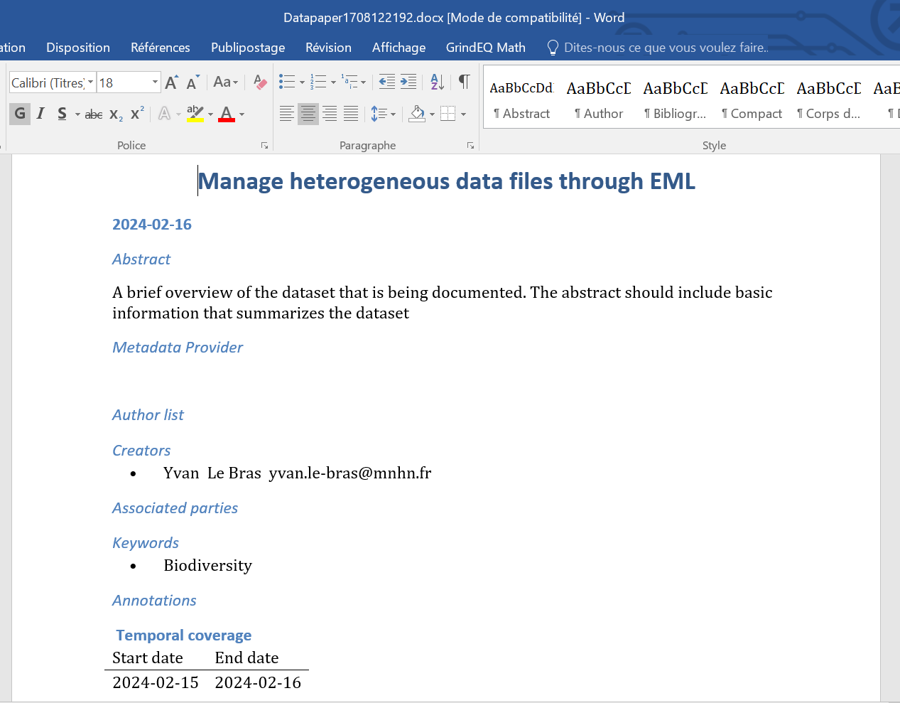

This tutorial aims to teach how to use functionalities of the EML Assembly Line R package to produce rich metadata using the Ecological Metadata Language (EML) international metadata standard. Here, we will notably propose a concrete example on how to use Galaxy Ecology tools to create, evaluate and modify EML metadata content using both EML Assemby Line metadata template tabular files, easily readable and editable by humans, and XML file, devoted to machine.


> <comment-title>What does FAIR mean?</comment-title>
> [FAIR](https://www.go-fair.org/fair-principles/) stand for **Findable, Accessible, Interoperable, Reusable**. 
>
>{:width="500"}
>These principles were to improve the access and usabiliy of data by the machine and to help making data reusable and shareable for users.
>Metadata is the data used to describe and explain all the context behind the production of data. It is necessary to produce a rich and FAIR metadata in order 
>to permit external users to understand and reuse data for their own studies.
{:  .comment}
> <agenda-title></agenda-title>
>
> In this tutorial, we will cover:
>
> 1. TOC
> {:toc}
>
{: .agenda}


# How can EML Assembly Line functionalities help producing rich metadata easily?

A major gap when a researcher is writing metadata documents is the fact that metadata international standards often use formats not really human readable and/or editable as XML or JSON. To answer this issue, Environmental Data Initiaitve (EDI) through the EML Assembly Line R package propose to generate intermediate metadata template files using classical tabular text format.

Another major issue regarding metadata fill in, is the fact that one need to take a lot of time to write, and often rewrite, metadata elements who can be already filled using automatic inferences or use of webservices. Here again, Environmental Data Initiaitve (EDI) through the EML Assembly Line R package propose to generate automatically information related to data attributes, geographic coverage, taxonomic coverage, using the content of provided datafiles.

Finally, through the MetaShARK R Shiny app created by the french biodiversity data hub research infrastructure (Pôle national de données de Biodiversité (PNDB)), user can use a graphical user interface to apply the EML Assembly Line workflow and benefit from some additionnal functionnalities as:
- The capacity to associate terminological resources terms coming from Bioportal ontologies to data attributes as keywords using CEDAR API,
- Automatic fill in of personal information using ORCID API,
- Automatic production of a data paper draft.


> <comment-title>What is a Data Paper?</comment-title>
> According to the [GBIF](https://www.gbif.org/data-papers) (Global Biodiversity Information Facility), 
>A data paper is a peer reviewed document describing a dataset, published in a peer reviewed journal. It takes effort to prepare, curate and describe data. 
>Data papers provide recognition for this effort by means of a scholarly article.
{:  .comment}

# Get data

> <hands-on-title> Data Upload </hands-on-title>
>
> 1. Create a new history for this tutorial. You can name it "EML assembly Line tutorial" for example
> 2. Download all files on your local computer from Zenodo: https://zenodo.org/api/records/10663465/files-archive . It is neccessary as for now, MetaShARK is deployed from Galaxy but without ahving a possibility to directly populate MetaShARK app with datafiles from Galaxy. You will thus then have to upload manually data files from your local computer to MetaShARK.
> 3. Unzip the donwloaded archive so you can access each file independently
> 4. Import tsv, netcdf and geotiff data files directly from [Zenodo]({{ page.zenodo_link }}) so it can be used on some steps of the tutorial.
>     -> Training Data for "Creating metadata using Ecological Metadata Language (EML) standard with EML Assembly Line functionalities" Galaxy tutorial:
>    ```
>    https://zenodo.org/records/10663465/files/datafile_1.tsv
>    https://zenodo.org/records/10663465/files/datafile_2.tsv
>    https://zenodo.org/records/10663465/files/LakeGeneva_phytoplankton_1974-2004.nc
>    https://zenodo.org/records/10663465/files/Present.Surface.pH.tif
>    ```
> 5. Import shapefile related files into Galaxy using the Galaxy upload tool, then on the "composite" tab, specifying "shp" composite type, then uploading .dbf, .shp and .shx files on the dedicated spaces.
>    
{: .hands_on}


# MetaShARK

When oppening MetaShRIMPS, you will have an interface looking like this :

{:width="500"}

To upload data on MetaShRIMPS, if you was selecting the xml file as input of the tool, it is already launched, if not, you have to click on the browse button and select in your local folders, the file
you want to use. 
> <warning-title>Select the right format</warning-title>
> The file uploaded in this tool must be a metadata in XML format using EML metadata standard.
{: .warning}

{:width="500"}

After uploading the file, or if you have indicate it as input data if the tool, you just have to click on **Execute** to launch the tool with the file.

# Outputs

After clicking the **Execute** button, 2 new tabs called "Draft of Data Paper" and "Fair Assessment"  will appear.
You can access all of the tool outputs by clicking on each tab (it can take a little time for your results to be displayed).

## Draft of Data Paper

By clicking on the "Draft of Data Paper" tab, you will have access to the draft of Data Paper presented in an HTML format.
You can either navigate through the Data Paper with the tabs or with the scrollbar on the right and access different elements.

You can at the top of the page download the draft in either an HTML format or an editable docx format.



## Fair Quality Assessment report

By clicking on the "Fair Assessment" tab, you will access the FAIR Quality report of the metadata uploaded.
You will have access to different figures such as a table displaying the results of all checks tested for your metadata.


You will also have acces to a graph presenting scores of Quality for each of the FAIR principles tested (Findable,
Acessible, Interoperable, Reusable) on a 100 point scale.


# Conclusion

Here is the end of this short tutorial aiming in explaining the purpose of MetaShRIMPS and how to use it.
Don't hesitate to contact us if you have any questions :)
