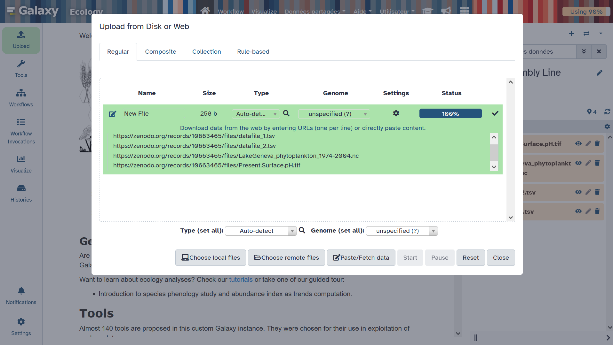
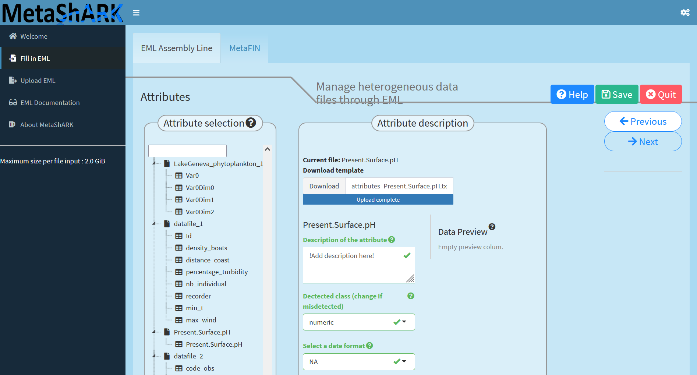
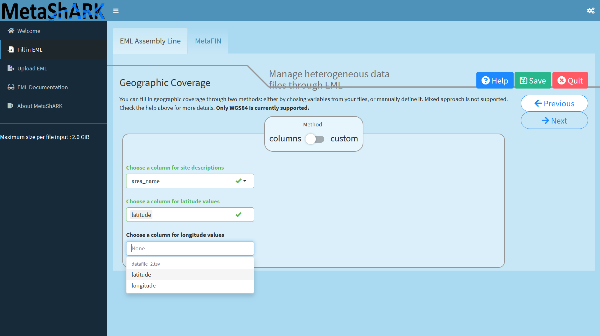
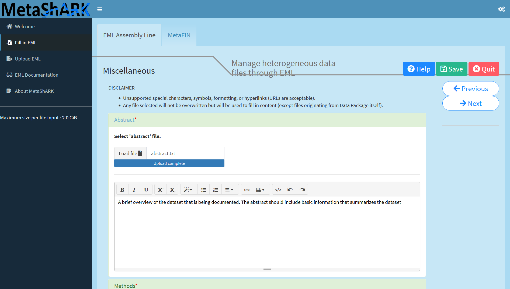
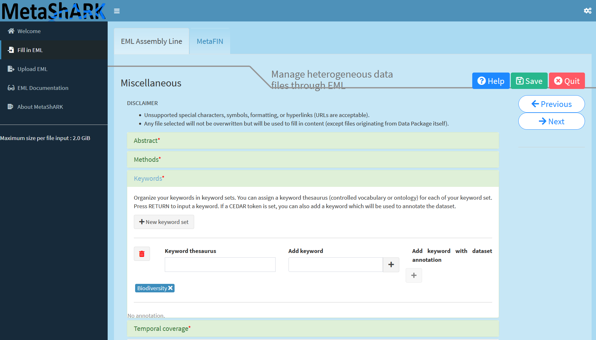
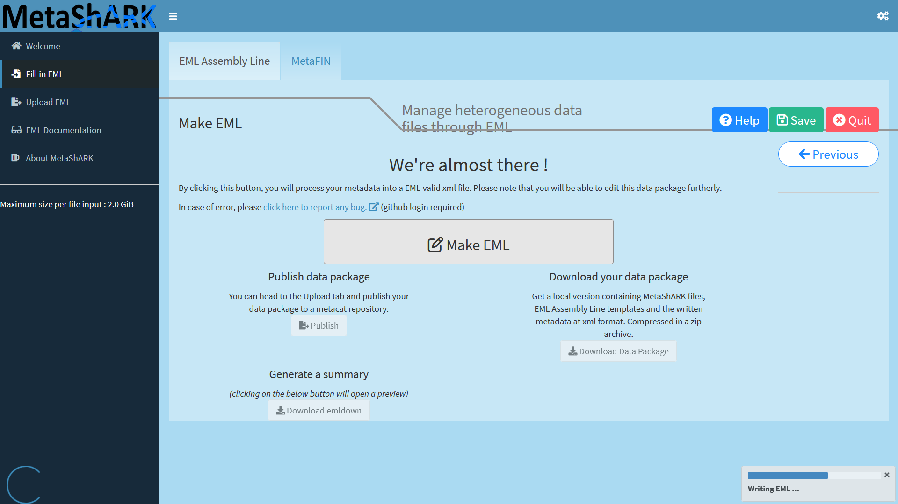

This tutorial aims to teach how to use functionalities of the EML Assembly Line R package to produce rich metadata using the Ecological Metadata Language (EML) international metadata standard. Here, we will notably propose a concrete example on how to use Galaxy Ecology tools to create, evaluate and modify EML metadata content using both EML Assemby Line metadata template tabular files, easily readable and editable by humans, and XML file, devoted to machine.


> <comment-title>What does FAIR mean?</comment-title>
> [FAIR](https://www.go-fair.org/fair-principles/) stand for **Findable, Accessible, Interoperable, Reusable**. 
>
>{:width="500"}
>These principles were to improve the access and usabiliy of data by the machine and to help making data reusable and shareable for users.
>Metadata is the data used to describe and explain all the context behind the production of data. It is necessary to produce a rich and FAIR metadata in order 
>to permit external users to understand and reuse data for their own studies.
{:  .comment}
> <agenda-title></agenda-title>
>
> In this tutorial, we will cover:
>
> 1. TOC
> {:toc}
>
{: .agenda}


# How can EML Assembly Line functionalities help producing rich metadata easily?

A major gap when a researcher is writing metadata documents is the fact that metadata international standards often use formats not really human readable and/or editable as XML or JSON. To answer this issue, Environmental Data Initiaitve (EDI) through the EML Assembly Line R package propose to generate intermediate metadata template files using classical tabular text format.

Another major issue regarding metadata fill in, is the fact that one need to take a lot of time to write, and often rewrite, metadata elements who can be already filled using automatic inferences or use of webservices. Here again, Environmental Data Initiaitve (EDI) through the EML Assembly Line R package propose to generate automatically information related to data attributes, geographic coverage, taxonomic coverage, using the content of provided datafiles.

Finally, through the MetaShARK R Shiny app created by the french biodiversity data hub research infrastructure (Pôle national de données de Biodiversité (PNDB)), user can use a graphical user interface to apply the EML Assembly Line workflow and benefit from some additionnal functionnalities as:
- The capacity to associate terminological resources terms coming from Bioportal ontologies to data attributes as keywords using CEDAR API,
- Automatic fill in of personal information using ORCID API,
- Automatic production of a data paper draft.


> <comment-title>What is a Data Paper?</comment-title>
> According to the [GBIF](https://www.gbif.org/data-papers) (Global Biodiversity Information Facility), 
>A data paper is a peer reviewed document describing a dataset, published in a peer reviewed journal. It takes effort to prepare, curate and describe data. 
>Data papers provide recognition for this effort by means of a scholarly article.
{:  .comment}

# Get data

> <hands-on-title> Data Upload </hands-on-title>
>
> 1. Create a new history for this tutorial. You can name it "EML assembly Line tutorial" for example
> 2. Download all files on your local computer from Zenodo: https://zenodo.org/api/records/10663465/files-archive. It is neccessary as for now, MetaShARK is deployed from Galaxy but without having a possibility to directly populate MetaShARK app with datafiles from Galaxy. You will thus then have to upload manually data files from your local computer to MetaShARK.
> 3. Unzip the donwloaded archive so you can access each file independently
> 4. Import tsv, netcdf and geotiff data files directly from [Zenodo]({{ page.zenodo_link }}) so it can be used on some steps of the tutorial.
>     -> Training Data for "Creating metadata using Ecological Metadata Language (EML) standard with EML Assembly Line functionalities" Galaxy tutorial:
>    ```
>    https://zenodo.org/records/10663465/files/datafile_1.tsv
>    https://zenodo.org/records/10663465/files/datafile_2.tsv
>    https://zenodo.org/records/10663465/files/LakeGeneva_phytoplankton_1974-2004.nc
>    https://zenodo.org/records/10663465/files/Present.Surface.pH.tif
>    ```
>    
>    {:width="500"}
> 6. Import shapefile related files into Galaxy using the Galaxy upload tool, then on the "composite" tab, specifying "shp" composite type, then uploading .dbf, .shp and .shx files on the dedicated spaces.
>    {:width="500"}
{: .hands_on}


# MetaShARK

To deploy a MetaShARK app, you can go to the Galaxy tool [MetaShARK](https://ecology.usegalaxy.eu/root?tool_id=interactive_tool_metashark) and click "Execute". Then, you have to wait the launch of the app, and when ready to be used, you will see the message "There is an InteractiveTool result view available," with an hyperlink on the "Open" statement allowing you to reach the app clicking on it.

WARNING! Note that it is a beta version of MetaShARK R shiny app. You can thus encounter issues using it!

When oppening MetaShARK, you will have an interface looking like this :

{:width="500"}

To start creating metadata, you need to reach the "Fill in EML" module, then specify or complete the automatic "Data package name" and mention the "Dataset title". Here a title can be "Manage heterogeneous data files through EML". Finally, you can choose an open licence between CC-BY-4.0, default, or CC0 then click on "Create". 

{:width="500"}

Then you can upload datafiles. Here, you can import these files from the downloaded Zenodo archive:
- datafile_1.tsv
- datafile_2.tsv
- LakeGeneva_phytoplankton_1974-2004.nc
- Present.Surface.pH.tif
- 02_Ref.shp
- 02_Ref.shx
- 02_Ref.dbf

{:width="500"}

MetaShARK will normally guess that the three `02_Ref` files are representing a uniq shapefile. MetaShARK will normally guess each data type and infer list of attributes for each file but the geotiff `Present.Surface.pH.tif` one. So now you need to select this datafile and upload the `attributes_Present.Surface.pH.txt` metadata template file so MetaShARK can fill attributes of this file (here the attribute is named "Present.Surface.pH").

{:width="500"}

Then you can provide a description for this attribute, for example "Present surface pH", then look at each attribute information of each data file so you can click on the "Next" button and go to the next step, to give informations on categorical variables!

{:width="500"}

Clicking "Next" button will then allows you to fill spatial informations about all GIS recognized datafiles, here the `Present.Surface.pH.tif` geotiff raster file and the `02_Ref` shapefile vector file. Geotiff is in pixel, accuracy unknown and shepfile is in Point, both are in `GCS_WGS_1984`spatial reference.

{:width="500"}

Next step is devoted to specifying geographic coverage. You can use a method between "columns" or "custom". "Custom" allows you to create one to several geographical sites using a map widget where you can draw limits of each site or enter directly latitude and longitude coordinates. "Columns" method, used here, allows you to specify an attribute containing site names then associated latitude and longitudes attributes.

{:width="500"}

Now geographic coverage is set, one can specific taxonomic coverage. To do so, you can select a data attribute conatining taxonomic information then select kind of notation you want to have and finally on which taxonomic authority (or authorities) information will be compared. Note that this can take a while if you have a lot of taxons and time is duplicated for each selected additional authority.

{:width="500"}

Now we can fill personal informations. To do so, the easiest way is to provide ORCID identifiers for each individual person involved as creator, contact and/or PI. Depending on the information filled in ORCID by each individual and on the level of accessibility of each, all field can be automatically filled. If "PI" is selected, you can specify a project name, funder name and related funding number.

{:width="500"}

Then you can add final elements as:

- An abstract (writing directly on the dedicated field or uploading a text file containing the abstract)

{:width="500"}

- Methods (writing directly on the dedicated field or uploading a text file, can be in markdown, containing details of the methods used to create data files)

{:width="500"}

- Keywords, who can be linked to keyword thesaurus. This allows you to create "group" of keywords and/or refer to existing terms classifications as we can find in terminological resources such as ontologies or thesaurus.

{:width="500"}

Finally, you can specify a temporal coverage and go to the last step of this MetaShARK workflow: Generat an EML metadata file! If everything is ok, you will have creation of an EML metadata file.

{:width="500"}

Once EML written, you can download the data package through the button "Download Data Package". This will allow you to download a zip archive you can unzip on your local computer. Resulting files are organized through 2 main folders. A main folder with data_objects (all datafiles you uploaded into MetaShARK), eml (EML metadata file written in XML format), and metadata_templates (all metadata files written in text format, column separated by tabulations). A second one called "emldown" where a draft of data paper written in html format can be accessed. 

# MetaShRIMPS

To evaluate and modify metadata elements you have created, you can upload the EML xml file on the Galaxy history you created and all MetaShARK metadata templates files.

Open the [MetaShRIMPS interactive tool form](https://ecology.usegalaxy.eu/root?tool_id=interactive_tool_metashrimps) and select the EML xml file you just generate with MetaShARK. you will have an interface looking like this :

{:width="500"}

Click on the **Execute** Button, 2 new tabs called "Draft of Data Paper" and "Fair Assessment"  will appear.
You can access all of the tool outputs by clicking on each tab (it can take a little time for your results to be displayed).

## Draft of Data Paper

By clicking on the "Draft of Data Paper" tab, you will have access to the draft of Data Paper presented in an HTML format.
You can either navigate through the Data Paper with the tabs or with the scrollbar on the right and access different elements.

You can at the top of the page download the draft in either an HTML format or an editable docx format.


## Fair Quality Assessment report

By clicking on the "Fair Assessment" tab, you will access the FAIR Quality report of the metadata uploaded.
You will have access to different figures such as a table displaying the results of all checks tested for your metadata.


You will also have acces to a graph presenting scores of Quality for each of the FAIR principles tested (Findable,
Acessible, Interoperable, Reusable) on a 100 point scale.


# Conclusion

Here is the end of this short tutorial aiming in explaining the purpose of MetaShARK and how to use it.
Don't hesitate to contact us if you have any questions :)
