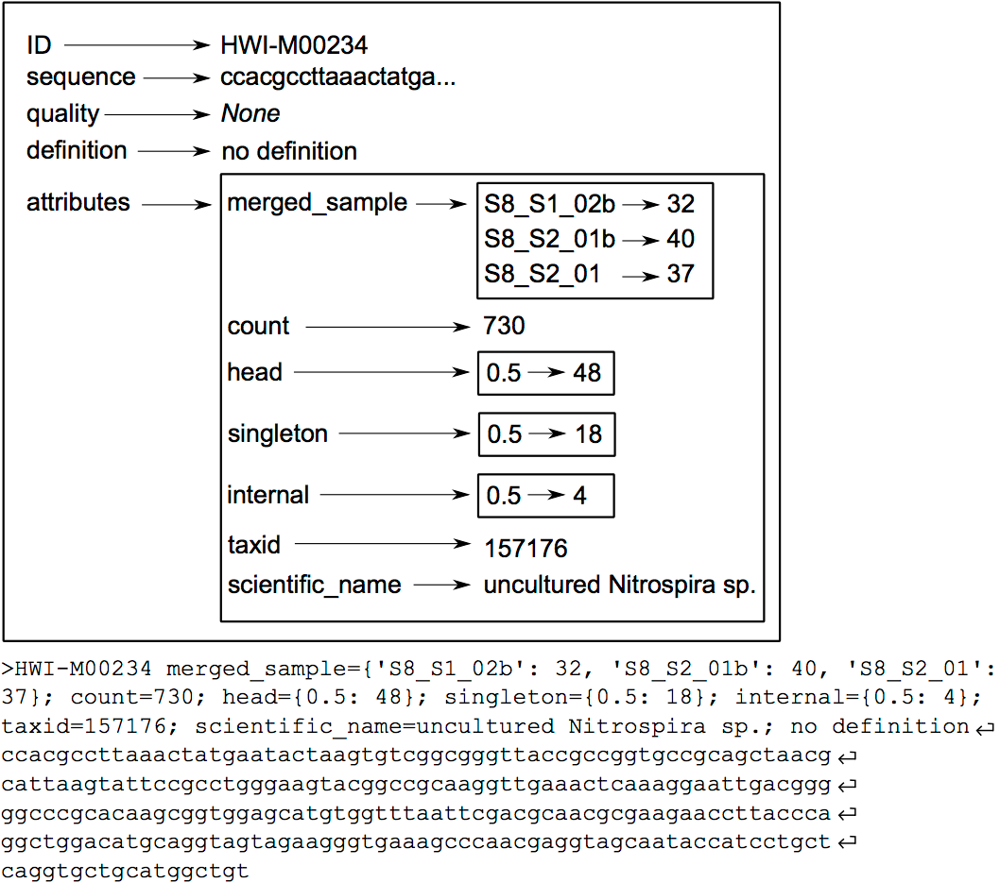

# Introduction


Based on this [OBITools official tutorial](https://pythonhosted.org/OBITools/wolves.html), you will learn here how to analyze DNA metabarcoding data produced on Illumina sequencers using:
 * the OBITools on Galaxy
 * some classical Galaxy tools

The data used in this tutorial correspond to the analysis of four wolf scats, using the protocol published in  for assessing carnivore diet. After extracting DNA from the faeces, the DNA amplifications were carried out using the primers TTAGATACCCCACTATGC and TAGAACAGGCTCCTCTAG amplifying the 12S-V5 region (), together with a wolf blocking oligonucleotide.

It is always a good idea to have a look at the intermediate results or to evaluate the best parameter for each step. Some commands are designed for that purpose, for example you can use :

- obicount to count the number of sequence records in a file
- obihead and obitail to view the first or last sequence records of a file
- obistat to get some basic statistics (count, mean, standard deviation) on the attributes (key=value combinations) in the header of each sequence record (see The [extended OBITools fasta format in the fasta format description](https://pythonhosted.org/OBITools/fasta.html))
- any Galaxy tools corresponding to classical unix command such as less, awk, sort, wc to check your files.

The OBITools programs imitate Unix standard programs because they usually act as filters. The main difference with classical Unix programs is that text files are not analyzed line per line but sequence record per sequence record (see below for a detailed description of a sequence record). Compared to packages for similar purposes like mothur () or QIIME (), the OBITools mainly rely on filtering and sorting algorithms. This allows users to set up versatile data analysis pipelines


Most of the OBITools commands read sequence records from a file or from the stdin, make some computations on the sequence records and output annotated sequence records. As inputs, the OBITools are able to automatically recognize the most common sequence file formats (i.e. FASTA, FASTQ, EMBL, and GenBank). They are also able to read ecoPCR () result files and ecoPCR/ecoPrimers formatted sequence databases () as ordinary sequence files. File format outputs are more limited. By default, sequences without and with quality information are written in FASTA and FASTQ formats, respectively. However, dedicated options allow enforcing the output format, and the OBITools are also able to write sequences in the ecoPCR/ecoPrimers database format, to produce reference databases for these programs. In FASTA or FASTQ format, the attributes are written in the header line just after the id, following a key=value; format.



> <agenda-title></agenda-title>
>
> In this tutorial, we will cover:
>
> 1. TOC
> {:toc}
>
{: .agenda}

# Manage input data
The data needed to run the tutorial are the following:

- FASTQ files resulting from a GA IIx (Illumina) paired-end (2 x 108 bp) sequencing assay of DNA extracted and amplified from four wolf faeces:
    - wolf_F.fastq
    - wolf_R.fastq
- the file describing the primers and tags used for all samples sequenced:
    - wolf_diet_ngsfilter.txt
- the tags correspond to short and specific sequences added on the 5’ end of each primer to distinguish the different samples
- the file containing the reference database in a fasta format:
    -db_v05_r117.fasta This reference database has been extracted from the release 117 of EMBL using ecoPCR

## Get data

> <hands-on-title>Data upload</hands-on-title>
>
> 1. Create a new history for this tutorial
> 2. Import the zip archive containing input files from [Zenodo](https://zenodo.org/record/5932108/files/wolf_tutorial.zip?download=1)
>
>    ```
>    https://zenodo.org/record/5932108/files/wolf_tutorial.zip
>    ```
>
>    
>
>    
>
> 3. Rename the dataset, here a zip archive, if needed
> 4. Check that the datatype is `zip`
>
>    
>
{: .hands_on}

## **Unzip** the downloaded archive

> <hands-on-title>Unzip the downladed .zip archive and prepare unzipped files to be used by OBITools</hands-on-title>
>
> 1.  with the following parameters:
>    - *"Extract single file"*: `All files`
>
>    > <comment-title></comment-title>
>    >
>    > To work properly, this unzip Galaxy tool is waiting "simple" archive as input, this means without sub directory.
>    {: .comment}
>
> 2. Add to each datafile a tag and/or modify names (*optional*)
>
>    
>
> 3. Unhide all dataset from the resulting data collection so you can use these files independently.
>
> 4. Modify datatype from txt to tabular for the `wolf_diet_ngsfilter` dataset
{: .hands_on}


> <question-title></question-title>
>
> 1. Why do we need to unhide manually datasets from the data collection?
>
> > <solution-title></solution-title>
> >
> > 1. Data collection is a functionality often used to deal with multiple datasets on the same format who can be analysed in batch mode. Here, the data collection is populated with heterogenous datafiles, coming from an archive. We thus need to treat separately each dataset of the collection, and to do so, we need to unhide corresponding datasets from the history, as datasets inside collections are just like "symbolic link" to "classical" history datasets hidden by default.
> >
> {: .solution}
>
{: .question}


# Use OBITools

OBITools () is a set of programs specifically designed for analyzing NGS data in a DNA metabarcoding context, taking into account taxonomic information. It is distributed as an open source software available on the following website: [http://metabarcoding.org/obitools](http://metabarcoding.org/obitools).

The OBITools commands consider a sequence record as an entity composed of five distinct elements. Two of them are mandatory, the identifier (id) and the DNA or protein sequence itself. The id is a single word composed of characters, digits, and other symbols like dots or underscores excluding spaces. Formally, the ids should be unique within a dataset and should identify each sequence record unambiguously, but only a few OBITools actually rely on this property. The three other elements composing a sequence record are optional. They consist in a sequence definition, a quality vector, and a set of attributes. The last element is a set of attributes qualifying the sequence, each attribute being described by a key=value pair. The set of attributes is the central concept of the OBITools system. When an OBITools command is run on the sequence records included in a dataset, the result of the computation often consist in the addition of new attributes completing the annotation of each sequence record. This strategy of sequence annotation allows the OBITools to return their results as a new sequence record file that can be used as the input of another OBITools program, ultimately creating complex pipelines (source: [OBITools Welcome](https://pythonhosted.org/OBITools/welcome.html)).


## Micro assembly of paired-end sequences with **illuminapairedend**

When using the result of a paired-end sequencing assay with supposedly overlapping forward and reverse reads, the first step is to recover the assembled sequence.

The forward and reverse reads of the same fragment are at the same line position in the two FASTQ files obtained after sequencing. Based on these two files, the assembly of the forward and reverse reads is done with the **illuminapairedend** utility that aligns the two reads and returns the reconstructed sequence.

> <hands-on-title>Recover consensus sequences from overlapping forward and reverse reads.</hands-on-title>
>
> 1.  with the following parameters:
>    - *"Read from file"*: `wolf_F` for the 3p file
>    - *"Read from file"*: `wolf_R` for the 5p file
>    - *"minimum score for keeping aligment"*: `40.0`
>
>    > <comment-title></comment-title>
>    >
>    > Sequence records corresponding to the same read pair must be in the same order in the two files !
>    >
>    > If the alignment score is below the defined score, here 40, the forward and reverse reads are not aligned but concatenated, and the value of the mode attribute in the sequence header is set to joined instead of alignment
>    {: .comment}
>
{: .hands_on}


## Remove unaligned sequence records with **obigrep**


In this step we are going to use the value of the mode attribute in the sequence header of the illuminapairedend output file to discard sequences indicated as "joined", so not assembled ("alignment") (see explanation about this mode on the previous step)

> <hands-on-title>Remove unaligned sequence records</hands-on-title>
>
> 1.  with the following parameters:
>    - *"Input sequences file"*: `ilumimnapairedend fastq groomer output file`
>    - *"Choose the sequence record selection option"*: `predicat`
>        - *"Python boolean expression to be evaluated for each sequence record."*: `mode!="joined"`
>
>
>    > <tip-title>Verifying FastQ format and converting it</tip-title>
>    >
>    > * You can use  to look at the format of the sequencing encoding score then  to specify the guessed sequencing encoding score and create a fastqsanger file.
>    >
>    {: .tip}
>
>    > <comment-title></comment-title>
>    >
>    > The obigrep command is in some way analog to the standard Unix grep command. It selects a subset of sequence records from a sequence file.
>    >
>    > A sequence record is a complex object composed of an identifier, a set of attributes (key=value), a definition, and the sequence itself.
>    >
>    > Instead of working text line by text line as the standard Unix tool, selection is done sequence record by sequence record. A large set of options allows refining selection on any of the sequence record elements.
>    >
>    > Moreover obigrep allows specifying simultaneously several conditions (that take the value TRUE or FALSE) and only the sequence records that fulfill all the conditions (all conditions are TRUE) are selected. You can refer to [https://pythonhosted.org/OBITools/scripts/obigrep.html](https://pythonhosted.org/OBITools/scripts/obigrep.html) for more details
>    {: .comment}
>
{: .hands_on}


> <question-title></question-title>
>
> 1. How do you verify the operation is successful?
> 2. How many sequences are kept? Discarded?
>
> > <solution-title></solution-title>
> >
> > 1. you can search in the input file content the presence of `mode=joined` and same on the output file (just clicking the eye to visualize the content of each file and typing CTRL+C for example to search `mode=joined` in the file, or using a regex Galaxy tool for example). You can also at least look at the size of the output file, if smaller than input file, this is a first good indication.
> > 2. You can use a Galaxy tool like `Line/Word/Character count of a dataset` to count the number of lines of each dataset (input and output of obigrep) and divided by 4 (as in a FastQ file, each sequence is represented by a block of 4 lines). 45 276 sequences for input file. 44 717 for output file. Thus 559 sequences discarded.
> >
> {: .solution}
>
{: .question}

## Assign each sequence record to the corresponding sample/marker combination with **NGSfilter**

> <hands-on-title>Assigns sequence records to the corresponding experiment/sample based on DNA tags and primers</hands-on-title>
>
>
>    > <comment-title></comment-title>
>    >
>    > Each sequence record is assigned to its corresponding sample and marker using the data provided in a text file (here wolf_diet_ngsfilter.txt). This text file contains one line per sample, with the name of the experiment (several experiments can be included in the same file), the name of the tags (for example: aattaac if the same tag has been used on each extremity of the PCR products, or aattaac:gaagtag if the tags were different), the sequence of the forward primer, the sequence of the reverse primer, the letter T or F for sample identification using the forward primer and tag only or using both primers and both tags, respectively.
>    {: .comment}
>
> 1.  with the following parameters:
>    - *"Parameter file"*: `wolf_diet_ngsfilter`
>    - *"Read from file"*: `obigrep output`
>    - *"Number of errors allowed for matching primers"*: `2`
>    - *"Output data type"*: `fastq`
>
>
>    > <tip-title>Be sure the text file is in tabular datatype</tip-title>
>    >
>    > * If you are sure the format is compatible with a tabular datatype, as this is the case here ;), you can manually change it, clicking on the eye of the "wolf_diet_ngsfilter.txt" dataset, then selecting the "Datatypes" section then affecting manually tabular and saving the operation
>    >
>    {: .tip}
>
{: .hands_on}

> <question-title></question-title>
>
> 1. How many sequences are not assigned?
>
> > <solution-title></solution-title>
> >
> > 1. 1391
> >
> {: .solution}
>
{: .question}

## Dereplicate reads into uniq sequences with **obiuniq**

> <hands-on-title>Groups together sequence records</hands-on-title>
>
>
>    > <comment-title></comment-title>
>    >
>    > The same DNA molecule can be sequenced several times. In order to reduce both file size and computations time, and to get easier interpretable results, it is convenient to work with unique sequences instead of reads. To dereplicate such reads into unique sequences, we use the obiuniq command.
>    > Definition: Dereplicate reads into unique sequences
>    > * compare all the reads in a data set to each other
>    > * group strictly identical reads together
>    > * output the sequence for each group and its count in the original dataset (in this way, all duplicated reads are removed)
>    > *Definition adapted from Seguritan and Rohwer (2001)*
>    {: .comment}
>
> 1.  with the following parameters:
>    - *"Input sequences file"*: `Trimmed and annotated file by NGSfilter`
>    - *"Attribute to merge"*: `sample`
>    - *"Use specific option"*: `merge`
>
{: .hands_on}

> <question-title></question-title>
>
> 1. How many sequences you had and how many you finally obtain?
>
> > <solution-title></solution-title>
> >
> > 1. From 43 326 to 3 962
> >
> {: .solution}
>
{: .question}


## Limit number of informations with **obiannotate**

> <hands-on-title>Adds/Edits sequence record annotations</hands-on-title>
>
>    > <comment-title></comment-title>
>    >
>    > obiannotate is the command that allows adding/modifying/removing annotation attributes attached to sequence records.
>    > Once such attributes are added, they can be used by the other OBITools commands for filtering purposes or for statistics computing.
>    >
>    > Here, the goal is to keep only `count` and `merged_sample` key=value attributes!
>    {: .comment}
>
> 1.  with the following parameters:
>    - *"Input sequences file"*: `obiuniq output file`
>    - In *"Keep only attribute with key"*:
>        - *"key"*: `count`
>        - *"if you want to specify a second key"*: `merged_sample`
>
{: .hands_on}


## Computes basic statistics for attribute values with **obistat**

> <hands-on-title>Computes basic statistics for attribute values</hands-on-title>
>
>
>    > <comment-title></comment-title>
>    >
>    > stats computes basic statistics for attribute values of sequence records. The sequence records can be categorized or not using one or several -c options. By default, only the number of sequence records and the total count are computed for each category. Additional statistics can be computed for attribute values in each category, like:
>    > * minimum value (-m option)
>    > * maximum value (-M option)
>    > * mean value (-a option)
>    > * variance (-v option)
>    > * standard deviation (-s option)
>    >
>    > The result is a contingency table with the different categories in rows, and the computed statistics in columns.
>    {: .comment}
>
> 1.  with the following parameters:
>    - *"Input sequences file"*: `obiannotate output file`
>    - In *"Category attribute"*:
>        -  *"Insert Category attribute"*
>            - *"How would you specify the category attribute key?"*: `simply by a key of an attribute`
>                - *"Attribute used to categorize the sequence records"*: `count`
>    - *"Use a specific option"*: `no`
>
{: .hands_on}


> <question-title></question-title>
>
> 1. Can you use this result to say how many sequences occuring only once? You would need to use Galaxy tools like `Sort data in ascending or descending order` and ` Select first lines from a dataset` to answer the question
>
> > <solution-title></solution-title>
> >
> > 1. 3131 sequences are occuring once.
> >
> {: .solution}
>
{: .question}

## Filtering sequances by count and length with **obigrep**

In this step, we are going to use *obigrep* in order to keep only the sequences having a count greater or equal to 10 and a length shorter than 80 bp.

> <hands-on-title>filter sequences with <b>obigrep</b></hands-on-title>
>
> 1.  with the following parameters:
>    - *"Input sequences file"*: `obiannotate output file`
>    - *"Choose the sequence record selection option"*: `predicat`
>        - *"Python boolean expression to be evaluated for each sequence record."*: `count>=10`
>
> 2.  with the following parameters:
>    - *"Input sequences file"*: `obigrep output file`
>    - *"Choose the sequence record selection option"*: `lmin`
>        - *"lmin"*: `80`
>
>    > <comment-title></comment-title>
>    > Based on the previous observation, we set the cut-off for keeping sequences for further analysis to a count of 10
>    > Based on previous knowledge we also remove sequences with a length shorter than 80 bp (option -l) as we know that the amplified 12S-V5 barcode for vertebrates must have a length around 100bp
>    {: .comment}
>
{: .hands_on}

> <question-title></question-title>
>
> 1. How many sequences are kept following the "count" filter?
> 2. How many sequences are kept following the "length" filter?
>
> > <solution-title></solution-title>
> >
> > 1. 178
> > 2. 175
> >
> {: .solution}
>
{: .question}

## Clean the sequences for PCR/sequencing errors (sequence variants) with **obiclean**

> <hands-on-title>Clean the sequences for PCR/sequencing errors (sequence variants)</hands-on-title>
>
> As a final denoising step, using the obiclean program, we keep the head sequences that are sequences with no variants with a count greater than 5% of their own count
>
>
> 1.  with the following parameters:
>    - *"Input sequences file"*: `obigrep output file`
>    - *"attribute containing sample definition"*: `merged_sample`
>    - *"Maximum numbers of differences between two variant sequences (default: 1)"*: `1`
>    -  *"Threshold ratio between counts (rare/abundant counts) of two sequence records so that the less abundant one is a variant of the more abundant (default: 1, i.e. all less abundant sequences are variants)"*: `0.05`
>    - *"Do you want to select only sequences with the head status in a least one sample?"*: `Yes`
>
>
{: .hands_on}


## Taxonomic assignment of sequences with **NCBI BLAST+ blastn**

> <hands-on-title>Search nucleotide database with nucleotide query sequence(s) from OBITools treatments</hands-on-title>
>
> Once denoising has been done, the next step in diet analysis is to assign the barcodes to the corresponding species in order to get the complete list of species associated to each sample. Taxonomic assignment of sequences requires a reference database compiling all possible species to be identified in the sample. Assignment is then done based on sequence comparison between sample sequences and reference sequences. We here propose to use BLAST+ blastn.
>
> 1.  with the following parameters:
>    - *"Nucleotide query sequence(s)"*: `obiclean output file`
>    - *"Subject database/sequences"*: `FASTA file from your history`
>    - *"Nucleotide FASTA subject file to use instead of a database"*: `db_v05_r117`
>    - *"Set expectation value cutoff"*: `0.0001`
>    - *"Output format"*: `Tabular (extended 25 columns)`
>    - *"Advanced Options"*: `Show Advanced Options`
>    - *"Maximum hits to consider/show": `1`
>
>
>    > <comment-title></comment-title>
>    >
>    > Here we directly use the `db_v05_r117` fasta file proposed on the [original obitools tutorial](https://pythonhosted.org/OBITools/wolves.html#step-by-step-analysis). One can mention you can create such a fasta file using same obitools workflow describe before (using obigrep/obiuniq/obigrep/obiannotate) on downloaded EMBL datrabases and taxonomy treated by obitools ecoPCR tool.
>    {: .comment}
>
{: .hands_on}


## Filter database and query sequences by ID to re associate informations with **Filter sequences by ID**

> <hands-on-title>Filter Blast results</hands-on-title>
>
> > <comment-title></comment-title>
> >
> > This tool allows you to re-associate all the reference sequences information, notably the `species_name` one so you can see which species are potentially seen on the sample.
> > We will also use it to re-associate all the query sequences information, notably the `merged_sample` and `obiclean_count` attributes so we can better evaluate quality of the results.
> {: .comment}
>
> 1.  with the following parameters:
>    - *"Sequence file to be filtered"*: `db_v05_r117`
>    - *"Filter using the ID list from"*: `tabular file`
>    - *"Tabular file containing sequence identifiers"*: `megablast on obiclean output`
>    - *"Column(s) containing sequence identifiers"*: `Column 2`
>    - *"Output positive matches, negative matches, or both?"*: `just positive match`
>
>
> 2.  with the following parameters:
>    - *"Sequence file to be filtered"*: `obiclean output data`
>    - *"Filter using the ID list from"*: `tabular file`
>    - *"Tabular file containing sequence identifiers"*: `megablast on obiclean output`
>    - *"Column(s) containing sequence identifiers"*: `Column 1`
>    - *"Output positive matches, negative matches, or both?"*: `just positive match`
>
>
>
{: .hands_on}


## From FASTA to tabular with **Obitab**

> <hands-on-title>Convert fasta filtered files in tabular ones</hands-on-title>
>
> 1.  with the following parameters:
>    - *"Input sequences file"*: `db_v05_r117 with matched ID`
>
>    > <comment-title></comment-title>
>    >
>    > This tool allows you to convert a fasta file into a tabular one so it is easier to read sequences definitions.
>    {: .comment}
>
> 2.  with the following parameters:
>    - *"Input sequences file"*: `obiclean on data 61 with matched ID`
>
>
{: .hands_on}

## create a final synthesis as a tabular file

> <hands-on-title>Join blast and obitab files then cut relevant column and apply filters</hands-on-title>
>
> 1.  with the following parameters:
>    - *"Join"*: `obitab on obiclean output file`
>    - *"using column"*: `Column 1`
>    - *"with"*: `megablast output file`
>    - *"using column"*: `Column 1`
>    - *"Fill empty columns"*: `Yes`
>    - *"Fill Columns by"*: `Single fill value`
>    - *"Fill value"*: `NA`
>
> 2.  with the following parameters:
>    - *"Join"*: last `Join two Datasets output file`
>    - *"using column"*: `Column 26`
>    - *"with"*: `obitab on db_v05_r117 with matched ID output file`
>    - *"using column"*: `Column 1`
>    - *"Fill empty columns"*: `Yes`
>    - *"Fill Columns by"*: `Single fill value`
>    - *"Fill value"*: `NA`
>
>
>    > <comment-title></comment-title>
>    >
>    > To have something easier to read and understand, we create a tabular file containing only columns with important informations (c1: query sequences names / c3-7: query counts / c50: reference sequences names / c54: family / c59: genus / c51: reference annotations).
>    {: .comment}
>
>
> 3.  with the following parameters:
>    - *"Cut columns"*: `c1,c3,c4,c5,c6,c7,c50,c54,c59,c51`
>    - *"From"*: last `Join two Datasets output file`
>
> 4.  with the following parameters:
>    - *"Filter"*: `Cut output file`
>    - *"With following condition"*: `c3>1000 or c4>1000 or c5>1000 or c6>1000`
>    - *"Number of header lines to skip"*: `1`
>
>    > <comment-title></comment-title>
>    >
>    > To keep only data with significative counts.
>    {: .comment}
{: .hands_on}


> <question-title></question-title>
>
> 1. How many species are identified? You can use `Cut columns from a table` and `unique occurences of each record` to isolate the `species name` column of obitab results.
> 2. Can you deduce the diet of each sample? You can use tools like `obitab` and `Join two Datasets side by side on a specified field` to join megablast results to obigrep one and `db_v05_r117 with matched ID`
>
> > <solution-title></solution-title>
> >
> > 1. 1O
> > 2. If we remove human sequences ;), some squirrel (sample:26a_F040644), deer (sample:15a_F730814 + sample:29a_F260619), stag (sample:29a_F260619 + sample:13a_F730603), marmot (sample:26a_F040644), doe (sample:29a_F260619), Grimm's duiker (sample:29a_F260619).
> >
> {: .solution}
>
{: .question}


# Conclusion


You just did a ecological analysis, finding diet from wolves faeces ! So now you know how to preprocess metabarcoding data on Galaxy, producing quantitative informations with quality checks and filtering results to interpret it and to have a synthesis table you can share broadly!
