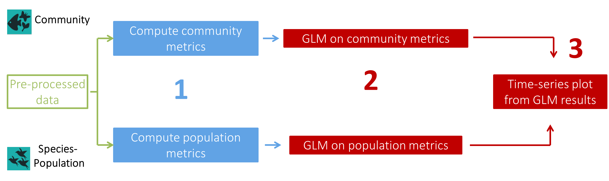
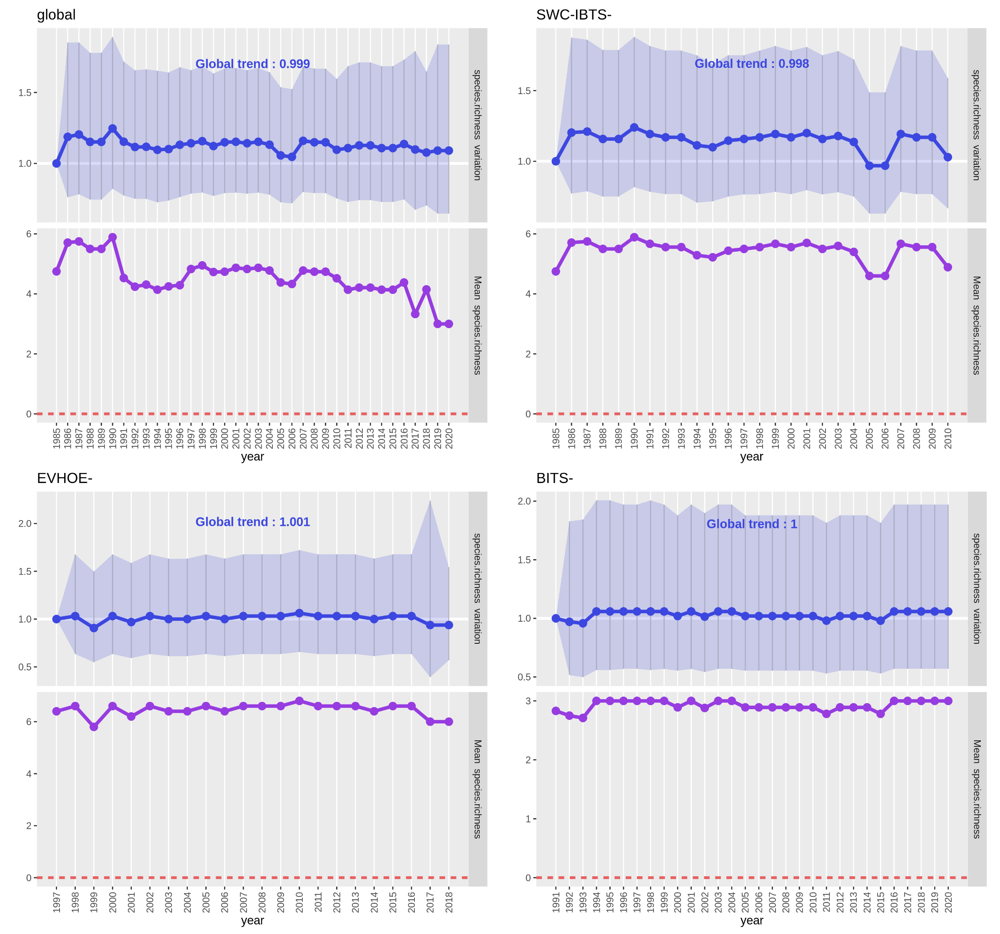
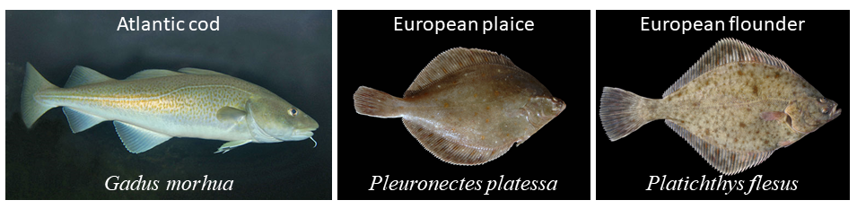
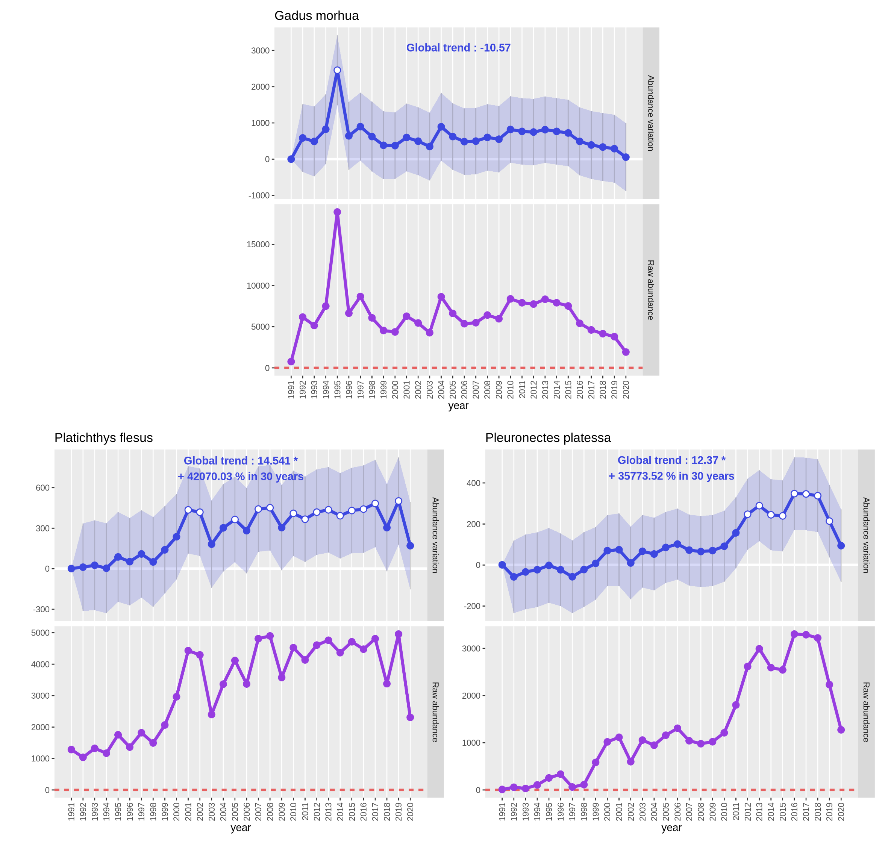
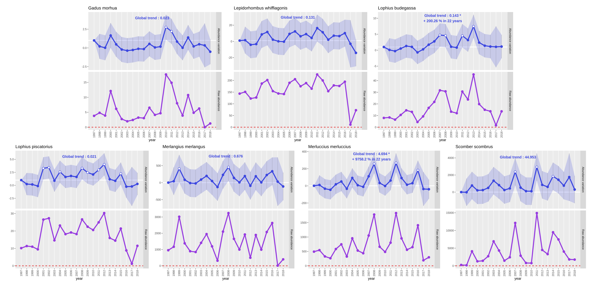
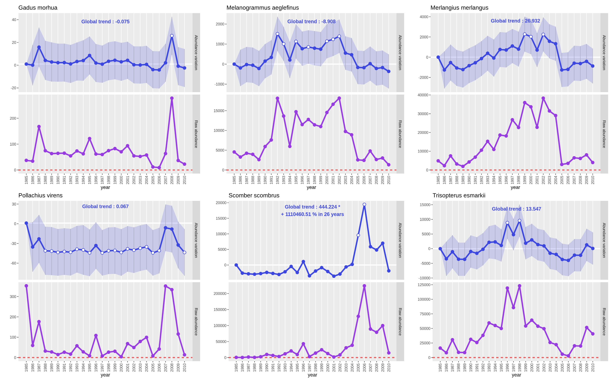

# Introduction


This tutorial aims to present the PAMPA Galaxy workflow, how to use it to compute common
biodiversity metrics from species abundance data and analyse it through generalized
linear (mixed) models (GLM and GLMM). This workflow made up of 5 tools will allow you to process
temporal series data that include at least year, location and species sampled along with
abundance value and, finally, generate article-ready data products.

The PAMPA workflow is an ecological analysis workflow, like so, it is divided as to do a Community
analysis and a Population analysis separately in accordance with the biodiversity level described.
Only the last tool to create a plot from your GLM results is common to the two parts of this workflow.
Thus, in this tutorial, we'll start by the Community analysis followed by the Population analysis.

> <details-title>Ecological definitions of Population and Community</details-title>
>
> Population: group of individuals of the same species interacting with each other.
>
> Community: group of several species interacting with each other.
>
{: .details}



Each part of this workflow has the same elementary steps :
 - **A first tool** to compute metrics:
   - Community metrics ():
     Total abundance, Species richness, Shannon index, Simpson index, Hill index and Pielou index
   - Population metrics ():
   Abundance, Presence-absence
 - **A second tool** to compute Generalized Linear (Mixed) Models, testing the effect of ```'site'```, ```'year'``` and/or
   ```'habitat'``` on a metric selected by the user:
   - Community analysis ():
     The GLM(M) is computed on the whole dataset and, if a separation factor is selected by the user, GLM(M)s are computed on subsets
     of the dataset (example: one GLM(M) per ecoregion)
   - Population analysis ():
     One GLM(M) is computed on each species separately
 - **A third tool** common for Community and Population analyses with at least ```'year'``` as a fixed effect to
   create time-series plots from your GLM(M) results ().
   Two plots will be created for each GLM(M): one from the *"Estimate"* values of the GLM(M) and one from raw values from metrics file.

> <details-title>Details about Generalized Linear (Mixed) Models</details-title>
>
> Generalized Linear Models (GLMs) and Generalized Linear Mixed Models (GLMMs) are two extensions of Linear Models (LMs).
> As LMs uses only Gaussian distribution (for continuous variables), GLMs permits to analyse a wide spectrum of data
> with various probability distributions (including Poisson distribution for count data and binomial distribution for
> presence-absence data). To go further, GLMMs permits to handle pseudo-replication generated by non-independant
> repeated observations by defining one or more random effect in your model.
> Here, GLM(M) tools allows you to define ```'year'``` and/or ```'site'``` as random effects to take account of temporal
> and/or spatial replicas. The other effects taken into account in the model that aren't random are defined as 'fixed'.
>
{: .details}

In this tutorial, we'll be working on data extracted from the data portal DATRAS (Database of Trawls Surveys) of the
International Council for the Exploration of the Sea (ICES). After pre-processing to fit the input format of the tools,
we'll see how to calculate biodiversity metrics and construct properly, easily and with good practice, several GLMMs
to test the effect of ```'year'``` and ```'site'``` on the species richness of each survey studied and on the abundance
of each species.

> <agenda-title></agenda-title>
>
> In this tutorial, we will cover:
>
> 1. TOC
> {:toc}
>
{: .agenda}

# Upload and pre-processing of the data

This first step consist of downloading and properly prepare the data to use it in PAMPA toolsuite.

## Data upload

> <hands-on-title>Data upload</hands-on-title>
>
> 1. Create a new history for this tutorial and give it a name (example: "DATRAS data analysis through PAMPA workflow")
>    for you to find it again later if needed.
>
>    
>    
>
> 2. Import the CSV files from [Zenodo](https://doi.org/10.5281/zenodo.4264936) via link with the three following links
>    ```
>    https://zenodo.org/record/4264936/files/CPUE%20per%20length%20per%20area_A.csv?download=1
>    https://zenodo.org/record/4264936/files/CPUE%20per%20length%20per%20area_B.csv?download=1
>    https://zenodo.org/record/4264936/files/CPUE%20per%20length%20per%20area_C.csv?download=1
>    ```
>
>    
>
>    You may as well use the shared data library or directly download the data from the DATRAS data portal but the previous
>    method is preferred.
>
>    
>
>    The files used for this tutorial have been imported from DATRAS data portal in October 2020. Those files are
>    often updated on the data portal. So if you choose to download files directly from DATRAS there may be
>    some differences with the files on Zenodo and the final results of this tutorial.
>
>    > <tip-title>Importing data from DATRAS data portal</tip-title>
>    >
>    > * Go to link: https://datras.ices.dk/Data_products/Download/Download_Data_public.aspx
>    > * In the field 'Data products' choose 'CPUE per length per area'
>    > * In the field 'Survey' choose the survey of interest. Here, we chose to use 'EVHOE', 'BITS'
>    >   and 'SWC-IBTS' surveys but you can't select the three surveys at once in this field.
>    >   So, you'll have to select one survey at a time ('EVHOE', 'BITS' and 'SWC-IBTS') and then
>    >   repeat the six following steps for each of the three surveys.
>    > * In the field 'Quarter(s)' we chose to tick 'All'
>    > * In the field 'Year(s)' we chose to tick 'All'
>    > * In the field 'Area(s)' we chose to tick 'All'
>    > * In the field 'Species' we chose to tick 'Standard species' and 'All'
>    > * Click on 'Submit'
>    > * Tick 'I accept the documents and their associated restrictions and agree to acknowledge the data source'
>    > * Open the Galaxy Upload Manager ( on the top-right of the tool panel)
>    > * Drop files on the dedicated area or click 'Choose local files'
>    > * Click on 'Start'
>    > * Click on 'Close' to return to Galaxy tools interface
>    >
>    {: .tip}
>
> 3. Make sure that each datasets has the following header ```"Survey","Year","Quarter","Area","AphiaID",
>    "Species","LngtClass","CPUE_number_per_hour"``` and that separator are ","
>
> 4. In order to avoid mixing up the data files, we'll add a tag to each file:
>       - tag `#EVHOE` to the tabular data file of the EVHOE survey : "CPUE per length per area_A.csv"
>       - tag `#SWCIBTS` to the tabular data file of the SWC-IBTS survey : "CPUE per length per area_B.csv"
>       - tag `#BITS` to the tabular data file of the BITS survey : "CPUE per length per area_C.csv"
>
>    
>
>    If tags doesn't display directly on your history, refresh the page.
>
> 5. Convert datatype CSV to tabular for each data file
>
>    
>
{: .hands_on}

These three data files gather Catch Per Unit Effort (CPUE) observations, a relative abundance measure mostly used
to assess exploited fish species populations :
 - EVHOE () is a French survey on Southern Atlantic Bottom Trawl, the extracted file available on Zenodo goes from
   1997 to 2018 and records CPUE for seven exploited fish species
 - BITS () is an international survey on Trawl in Baltic sea, the extracted file available on Zenodo goes from 1991
   to 2020 and records CPUE for three exploited fish species
 - SWC-IBTS () is a Scottish survey on bottom trawl in the west coast, the extracted file available on Zenodo goes
   from 1985 to 2010 and records CPUE for six exploited fish species

## Prepare the data

Before starting the preparation of the data, we need to identify which inputs we need for the tools and their format
(same for Community or Population analyses except for a few details):
 - Input for the tools to compute metrics: Observation data file containing at least ```'year'``` and "location" sampled
   that might be represented in one field "observation.unit", "species.code" to name the species sampled,
   and ```'number'``` as the abundance value
 - Supplementary input for the tools to compute a GLM(M) analysis: Observation unit data file containing at least
   "observation.unit" and ```'year'```. It might also contain ```'habitat'```, ```'site'``` and any other information
   about the location at a given ```'year'``` that seems useful (examples: "temperature", "substrate type", "plant cover")

> <details-title>What is the 'observation.unit' field?</details-title>
>
> The 'observation.unit' field is a primary key linking the observation data file and the metrics data file to an observation
> unit data file. An unique 'observation.unit' identifier represents an unique sampling event at a given year and location.
> Such a file permits to reduce the size of data files, if all informations about the sampling event (examples:
> "temperature","substrate type","plant cover") are gathered in the same dataframe as the observations data
> ("species sampled","count") same informations will be unnecessarily repeated in many lines.
>
{: .details}

> <tip-title>The 'observation.unit' nomenclature</tip-title>
>
> For this workflow, two nomenclatures are advised :
> * The PAMPA file nomenclature:
>   ```[Two first letters of 'site'][Two last numbers of 'year'][Identifier of the precise sampled location in four numbers]```
>
>   The fields ```'year'``` and "location" will be automatically infered from this nomenclature in the first tools to
>   compute metrics
>
> * The automatic nomenclature: ```['year' in four numbers]_[Identifier of the precise sampled location in any character chain]```
>
>   This nomenclature will be automatically constructed in the first tools to compute metrics if the input file doesn't already
>   have a "observation.unit" field but only ```'year'``` and "location"
>
> If you already have your own nomenclature for the primary key linking your files, it will remain untouched by the tools but the
> output data table from the first tools to compute metrics won't contain ```'year'``` and "location" fields.
> In this case and if you want to add such informations to your metrics data file, you can use the tool
> 
> with the metrics data file and the observation unit data file.
>
{: .tip}

> <details-title>The difference between fields ```'site'``` and "location"?</details-title>
>
> Those two fields both inform a geographical indication.
>
> "location" is the finest geographical level and ```'site'``` may represent a wider geographical range but can also
> represent the same geographical level as "location". This choice is up to your discretion, depending which geographical
> level you want to take into account in your statistical analysis.
>
{: .details}

### Concatenation of data files

> <hands-on-title>Data files concatenation</hands-on-title>
>
> 1.  select the three `#BITS`, `#EVHOE` and `#SWCIBTS`
>    datasets in  *"Datasets to concatenate"*
>
>    
>
> 2. Suppress the `#BITS`, `#EVHOE` and `#SWCIBTS` tags and add the `#Concatenate` tag to the Concatenated data file
>
>    
>
> 3. Verify if the three header lines have been included in the concatenate with 
>    and following parameters :
>    -  *"from dataset"*: `#Concatenate` Concatenated data file
>    -  *"Count occurrences of values in column(s)"*: `Column: 1`
>    -  *"Delimited by"*: `Tab`
>    -  *"How should the results be sorted?"*: `With the rarest value first` so multiple occurences can be seen directly at first lines of the resulting file
>
> 4. If the value `Survey` has more than `1` occurrence use 
>    with following parameters :
>    -  *"Filter"*: `#Concatenate` Concatenated data file
>    -  *"With following condition"*: `c1!='Survey'`
>    -  *"Number of header lines to skip"*: `1`
>
>    > <question-title></question-title>
>    > How many header line(s) is left?
>    >
>    > Use  and following parameters :
>    >   -  *"from dataset"*: `#Concatenate` Filtered data file
>    >   -  *"Count occurrences of values in column(s)"*: `Column: 1`
>    >   -  *"Delimited by"*: `Tab`
>    >   -  *"How should the results be sorted?"*: `With the rarest value first`
>    >
>    > **Tip:** Hit the rerun button  on the output of the previous run of ,
>    > and change the input dataset.
>    >
>    > > <solution-title></solution-title>
>    > > One header line is left as the value `Survey` has only `1` occurrence in the first column.
>    > >
>    > {: .solution}
>    >
>    {: .question}
>
{: .hands_on}

### Formating of data files

Here we have data from the three surveys in one datatable (Filtered data file) with the following fields ```"Survey",
"Year","Quarter","Area", "AphiaID","Species","LngtClass","CPUE_number_per_hour"```. We now need to define the proper
columns needed for the PAMPA workflow considering there is no primary key close to "observation.unit" :
 - "location" from "Area" associated with "Survey" to avoid mixing up areas from different surveys
 - ```'year'``` from "Year"
 - "species.code" from "Species"
 - ```'number'``` from "CPUE_number_per_hour"

This `#Concatenate` Filtered data file containing the three surveys will be used to create the observation unit data file and
compute Community metrics as the Community analysis can be automatically processed on each survey separately.
However, this file can't be used as it is to compute Population metrics as it may contain data for several
populations of the same species that do not interact with each other. Therefore, we have to work on the three
`#BITS`, `#EVHOE` and `#SWCIBTS` original tabular files for the Population analysis.

Hence, the following manipulations will be applied not only on `#Concatenate` Filtered data file but also on
the three `#BITS`, `#EVHOE` and `#SWCIBTS` original tabular files used for the concatenation.


> <hands-on-title>Create the "location" field</hands-on-title>
>
> 1.  with following parameters:
>    -  *"Select cells from"*: `#Concatenate` Filtered data file +
>      three `#BITS`, `#EVHOE` and `#SWCIBTS` tabular data files
>    -  *"using column"*: `Column: 1`
>    -  Click *"+ Insert Check"*:
>         -  *"Find Regex"*: `([A-Z]{3}[A-Z]+)`
>         -  *"Replacement"*: `\1-`
>
>    
>
>    > <question-title></question-title>
>    > What did we do with this tool?
>    > > <solution-title></solution-title>
>    > > We searched for every character chain matching the extended regular expression (Regex) `([A-Z]{3}[A-Z]+)`
>    > > in the first column "Survey" meaning every character chain of 4 or more capital letters. With the replacement `\1-`
>    > > we indicated to add `-` after the bracketed character chain. This manipulation is made in order to merge
>    > > properly columns "Area" and "Survey" with a separation.
>    > >
>    > {: .solution}
>    >
>    {: .question}
>
>
> 2.  with following parameters :
>    -  *"Select data"*: four `#Concatenate`, `#BITS`, `#EVHOE` and `#SWCIBTS`
>      Column Regex Find And Replace data files
>    -  *"Merge column"*: `Column: 1`
>    -  *"with column"*: `Column: 4`
>
>    Check if the output data files has a supplementary column called "SurveyArea" and values with the survey ID and area ID
>    separated with `-`.
>
{: .hands_on}

> <hands-on-title>Change column names</hands-on-title>
>
>  with following parameters :
>    -  *"Select lines from"*: four `#Concatenate`, `#BITS`, `#EVHOE` and `#SWCIBTS` Merged data files
>    -  Click *"+ Insert Check"*:
>         -  *"Find Regex"*: `Year`
>         -  *"Replacement"*: `year`
>    -  Click *"+ Insert Check"*:
>         -  *"Find Regex"*: `Species`
>         -  *"Replacement"*: `species.code`
>    -  Click *"+ Insert Check"*:
>         -  *"Find Regex"*: `CPUE_number_per_hour`
>         -  *"Replacement"*: `number`
>    -  Click *"+ Insert Check"*:
>         -  *"Find Regex"*: `SurveyArea`
>         -  *"Replacement"*: `location`
>
> Check if the columns are corresponding to ```"Survey","year","Quarter","Area","AphiaID","species.code","LngtClass",
> "number","location"``` (pay attention to case).
>
{: .hands_on}

> <details-title>Other tools that could be useful to pre-process data</details-title>
>
> ; 
>; ; 
>; ; ; 
>; ; 
>; ; 
>; ; ...
>
{: .details}

# Compute Community and Population metrics

In this part of the tutorial, we're starting to use tools from the PAMPA toolsuite to compute Community
and Population metrics. Then, we'll be creating the observation unit file.

> <hands-on-title>Compute Community metrics</hands-on-title>
>
> 1.  with following parameters:
>    -  *"Input file"*: `#Concatenate` Regex Find And Replace data file
>    -  *"Choose the community metrics you want to compute"*: `All`
>
>    Check if the output Community metrics data file has the following column names ```"year","location","number",
>    "species_richness","simpson","simpson_l","shannon","pielou","hill","observation.unit"```.
>
> 2. Tag the output Community metrics with `#Community`
>
{: .hands_on}

> <hands-on-title>Compute Population metrics</hands-on-title>
>
>  with  *"Input file"*: `#EVHOE`, `#BITS` and `#SWCIBTS` Regex Find And Replace data files
>
> Check if the outputs Population metrics data files has the following column names ```"year","location",
> "species.code","number","presence_absence","observation.unit"```.
>
{: .hands_on}

## Creation of the observation unit file


Now that we have the "observation.unit" fields automatically created in the Community and Population
metrics files we can create the observation unit file from the `#Concatenate` Regex Find And Replace data file with the same
nomenclature for the "observation.unit" fields, namely:

```['year' in four numbers]_[Identifier of the precise sampled location in any character chain]```

> <hands-on-title>Create the observation unit file</hands-on-title>
>
> 1.  with following parameters:
>    -  *"Select cells from"*: `#Concatenate` Regex Find And Replace data file
>    -  *"using column"*: `Column: 2`
>    -  Click *"+ Insert Check"*:
>         -  *"Find Regex"*: `([0-9]{4})`
>         -  *"Replacement"*: `\1_`
>
> 2.  with following parameters :
>    -  *"Select data"*: `#Concatenate` Column Regex Find And Replace data file
>    -  *"Merge column"*: `Column: 2`
>    -  *"with column"*: `Column: 9`
>
>    Check if the output data file has a supplementary column called "yearlocation" and values with the ```'year'``` and "location" ID
>    separated with `_`.
>
>
> 3.  with following parameters:
>    -  *"Select cells from"*: `#Concatenate` Merge Columns data file
>    -  *"using column"*: `Column: 2`
>    -  Click *"+ Insert Check"*:
>         -  *"Find Regex"*: `([0-9]{4})_`
>         -  *"Replacement"*: `\1`
>
>    > <question-title></question-title>
>    > What did we do with this tool?
>    >
>    > > <solution-title></solution-title>
>    > > We removed the `_` we added in the first part of this "Hands_on" from the values of the second column
>    > > ```'year'``` to get proper numeric values back.
>    > >
>    > {: .solution}
>    >
>    {: .question}
>
> 4. 
>    with following parameters :
>    -  *"File to cut"*: `#Concatenate` Column Regex Find And Replace data file
>    -  *"Operation"*: `Keep`
>    -  *"Delimited by"*: `Tab`
>    -  *"Cut by"*: `fields`
>      -  *"List of Fields"*: `Column: 1` `Column: 2` `Column: 3` `Column: 4` `Column: 9` `Column: 10`
>
>    Check if the output `#Concatenate` Advanced Cut data file has the following column names ```"Survey","year","Quarter",
>    "Area","location","yearlocation"```.
>
>
> 5. 
>     with following parameters :
>    -  *"Sort Query"*: `#Concatenate` Advanced Cut data file
>    -  *"Number of header lines"*: `1`
>    - *"1: Column selections"*
>      -  *"on column"*: `Column: 6`
>      -  *"in"*: `Ascending order`
>      -  *"Flavor"*: `Alphabetical sort`
>    -  *"Output unique values"*: `Yes`
>    -  *"Ignore case"*: `No`
>
>    The output `#Concatenate` Sort data file must have fewer lines than the `#Concatenate` Advanced Cut data file.
>
>
> 6.  with following parameters :
>    -  *"Select lines from"*: `#Concatenate` Sort data file
>    -  Click *"+ Insert Check"*:
>         -  *"Find Regex"*: `yearlocation`
>         -  *"Replacement"*: `observation.unit`
>    -  Click *"+ Insert Check"*:
>         -  *"Find Regex"*: `location`
>         -  *"Replacement"*: `site`
>
>    Here, we define ```'site'``` represents the same geographical level as "location".
>
>
> 7. Tag the output `#Concatenate` Regex Find And Replace data file with `#unitobs`
>
>    Check if the output `#Concatenate #unitobs` data file has the following column names ```"Survey","year","Quarter",
>    "Area","site","observation.unit"```.
>
{: .hands_on}

# GLMMs and plots on Community and Population metrics

Now that we have all our input files for GLM(M) tools ready, we can start computing statistical models to make
conclusions on our surveys. But before starting to use the 
and the  tools, we have to think about the model we want to compute.
The tools allows to test the effects ```Year'```, ```Site``` and/or ```Habitat``` on one interest variable at a time.
As we don't have data about the ```Habitat``` we can't test its effect. It is always better to take a temporal and a
geographical variable into account in an ecological model so we'll test the effect of ```Year``` and ```Site``` with
a random effect of ```Site``` to take geographical pseudo-replication into account.

## Compute GLMMs and create plots on Community metrics

For the Community analysis we have the choice to test the effect of ```Year``` and ```Site``` on:
 - "Total abundance"
 - or "Species richness"
 - or "Simpson index"
 - or "1 - Simpson index"
 - or "Shannon index"
 - or "Pielou index"
 - or "Hill index"

As a GLM(M) permits to take into account only one interest variable at a time, we choose to take "Species richness"
as the interest variable, namely the quantity of different species at a given time and location.
This metric is located on the fourth column of the `#Concatenate #Community` metrics data file.

However, if you're interested to test the effects of ```Year``` and ```Site``` on another metric you may compute
the GLM(M) tool again and choose any column of the `#Concatenate #Community` metrics data file containing one of
the metrics cited above.

As said above, analyses will be separated by the field "Survey" (first column) to avoid bias.

> <hands-on-title>Compute GLMM on Community metrics</hands-on-title>
>
> 1.  with following parameters:
>     -  *"Input metrics file"*: `#Concatenate #Community` metrics data file
>     -  *"Unitobs informations file"*: `#Concatenate #unitobs` data file
>     -  *"Interest variable from metrics file"*: `Column: 4`
>     -  *"Separation factor of your analysis from unitobs file"*: `Column: 1`
>     -  *"Response variables"*: `Year` `Site`
>     -  *"Random effect?"*: `Site`
>     -  *"Specify advanced parameters"*: `No, use program defaults`
>
> The three outputs must have three tags `#Concatenate #Community #unitobs` and the first one named 'GLM - results
> from your community analysis' must contain five lines. This file is formated to have one line per GLM processed,
> it has been formated this way to make GLM results easier to represent and modify if needed. However, this format is
> often not suited to read directly the results on Galaxy as Galaxy handles better tabular files with a lot of lines
> rather than files with a lot of columns. So, if your file doesn't display properly on Galaxy as a data table, we advise
> to do the following optional step.
>
>
> 2. (optional)  with `#Concatenate #Community #unitobs` 'GLM - results from your community analysis' data file
>
{: .hands_on}

> <details-title>Details on advanced parameters of GLM tools</details-title>
>
> For now, there are two advanced parameters you can setup in the GLM tools:
>  -  *"Distribution for model"* permits you to choose a probability distribution for your
>    model. When `Auto` is selected, the tool will automatically set the distribution on `Gaussian`, `Binomial`
>    or `Poisson` depending on the type of your interest variable but it may exist a better probability distribution
>    to fit your model. Mind that if you choose to use a random effect, "quasi" distribution can't be used for your model.
>
>  -  *"GLM object(s) as .Rdata output?"* permits you to get .Rdata file of your GLM(M)s if you
>    want to use it in your own R console.
>
{: .details}

> <details-title>How to choose a proper distribution family for your model?</details-title>
>
> The distribution family for a model is mainly selected by looking at the interest variable of the model:
>  - If your interest variable is a continuous numeric variable (weigth, size, mean, ...) it follows a
>    `Gaussian` distribution so you should select `Gaussian`.
>  - If your interest variable is a discrete numeric variable (count) it follows a `Poisson` distribution
>    so you should select `Poisson`.
>  - If your interest variable is a binary variable (0-1, presence-absence) it follows a `Binomial` distribution
>    so you should select `Binomial`.
>
> These three distributions are the most commonly used, the other distributions are used when the interest variable
> , the data and/or the model has specifics:
>  - When the model is over-dispersed, use a `Quasi-Poisson` (when interest variable is discrete) or a `Quasi-Binomial`
>    (when interest variable is binary) distribution.
>  - If your model doesn't fit well and your interest variable is a **positive** continuous variable, you may try
>    with `Gamma` or `Inverse-Gaussian` distribution.
>
{: .details}

### Read and interpret raw GLMM outputs

The GLM tool has three outputs:
 - The first output, 'GLM - results from your community analysis' data file, contains the summary of each GLMMs
   on each lines.
 - The second output, 'Simple statistics on chosen variables' file, contains descriptive statistics (mean, median, ...)
   of the interest variable for the whole input data table and for each selected factor levels combinations.
   Here, each ```Site``` at each ```Year```.
 - The third output, 'Your analysis rating file', contains a notation for all analyses performed and notations for
   each GLMMs processed. This rate is based on nine criterias commonly used in ecology to estimate wether a Linear
   Model has been constructed properly or not. At the end of the file, red flags and advices to improve your model
   are displayed also depending on the same criterias. This file is really useful to look at the bigger picture

> <details-title>Details on criterias used in 'Your analysis rating file'</details-title>
>
> For now, there are nine criterias taken into account to rate GLM(M)s in the Galaxy tools:
>  - *Plan completeness*: If part of factor levels combinations are inexistant, bias can be induced. (0.5)
>  - *Plan balance*: If factor levels combinations aren't present in same quantity, bias can be induced. (0.5)
>  - *NA proportion*: Lines with one or more NA value are ignored in Linear Models. If many NA values, there are
>    less observations taken in account in the model than expected. (1)
>  - *Residuals dispersion* (DHARMa package): If the dispersion of residuals isn't regular, the model is either under- or
>    over-dispersed. The distribution selected for the model isn't right. (1.5)
>    To know if it is under- or over-dispersion, compute *"deviance"*/*"df.resid"* : if the result is > 1 it is
>    over-dispersion, if the result is < 1 it is under-dispersion.
>  - *Residuals uniformity* (DHARMa package): If the residuals aren't uniform, the distribution selected for the model
>    isn't right. (1)
>  - *Outliers proportion* (DHARMa package): If too much outliers, the distribution selected for the model isn't right
>    or data is biased. (0.5)
>  - *Zero-inflation* (DHARMa package): If too much zeros in data, bias can be induced. (1)
>  - *Observations / factors ratio*: If the number of factors taken into account in the model exceeds 10% of the number
>    of observations (ex: 10 factors for 90 observations), bias can be induced. (1)
>  - *Number of levels of the random effect*: If no random effect in the model or if the factor selected as random effect
>    has less than 10 levels. (1)
>
{: .details}

#### First output: 'GLM - results from your community analysis'

First, on the 'GLM - results from your community analysis' data file, we see four analyses: `global` on the whole dataset
and one analysis for each of the three surveys `BITS`, `EVHOE` and `SWC-IBTS`. We also see the `Poisson` distribution has been
automatically selected by the tool. It seems right as the interest variable "Species richness" is a count.

Then, we see five fields that gives indexes to evaluate the quality of a model in comparison to another model performed
on the same data, so they can't be used to compare the four models performed here :
 - *"AIC"* Akaike information criterion. It is based on the number of factors. The lower AIC is better.
 - *"BIC"* Bayesian information criterion, is a derivate of AIC. It is based on the number of factors selected and on the
   sample size. The lower BIC is better.
 - *"logLik"* log-likelihood, is an index that estimates the likelihood of obtaining the sample of observations used
   for the model in the selected distribution. The higher logLik is better.
 - *"deviance"*, evaluates the model's goodness of fit. The lower deviance is better.
 - *"df.resid"*, degrees of freedom in residuals used to calculate the adjusted R-square that indicates the fit quality.

Three statistics about the random effect ```Site``` are given in this first file: standard deviation, number of observations taken
into account in the model and number of levels in the random effect.
As ```Site``` have been set as a random effect, pseudo-replication caused by the factor ```Site``` variable is taken into account to
fit the model as well as its effects on the interest variable but it is not tested so we can't make any conclusion regarding
its effects on species richness.

At this point on, elements on fixed effects are displayed :
 - *"Estimate"* is the mean value of the interest variable estimated by the model for a given factor.
 - *"Std.Err"* standard error, is the standard deviation of the *"Estimate"*. It measures uncertainty of the *"Estimate"*.
 - *"Zvalue"* (or *"Tvalue"* depending on the distribution) is the *"Estimate"* divided by the *"Std.Err"*.
 - *"Pvalue"* is the probability that the interest variable is not impacted by a given factor. If this probability is under a
   certain value (commonly 5% in ecology so a p-value under 0.05), we determine the factor has a significant effect on the
   interest variable.
 - *"IC_up"* and *"IC_inf"* are the upper and lower values of the confidence interval at 95% of the *"Estimate"*. The confidence
   interval is the range of values that your *"Estimate"* may take 95% of the time if you re-sample your data.
 - *"signif"* significativity, "yes" if the *"Pvalue"* is inferior to 0.05. Tells you wether the tested factor has a significant
   effect on your interest variable.

If the factor used as fixed effect is defined as a qualitative variable, those seven fields will be provided for each factor's level
and if it is a continuous variable they will be provided only once for the whole factor.

Here, the factor ```'year'``` may be considered a continuous variable as well as a qualitative variable. Only, it doesn't provide the same
informations :
 - If we consider ```'year'``` as a continuous variable the model will inform on the trend of the interest variable on the whole time-series.
   Making it more interesting to know about the global behaviour of the interest variable over time.
 - If we consider ```'year'``` as a qualitative variable the model will inform on the relative mean of interest variable for each year
   individually. Making it more interesting to know about each year individually and plot a detailed curve.

As both these solutions are interesting, the tool is computing two GLMMs when ```Year``` is selected as a fixed effect:
 - one GLMM with ```Year``` as a continuous variable with results on fields *"year Estimate"*, *"year Std.Err"*, *"year Zvalue"*,
   *"year Pvalue"*, *"year IC_up"*, *"year IC_inf"* and *"year signif"*.
 - one GLMM with ```Year``` as a qualitative variable in the same fields with each ```Year```'s levels as *"YYYY Estimate"*,
   *"YYYY Std.Err"*, *"YYYY Zvalue"*, *"YYYY Pvalue"*, *"YYYY IC_up"*, *"YYYY IC_inf"* and *"YYYY signif"*.

The *"(Intercept)"* value represents the reference value, it is rarely used for interpretations.
We see no significant effect on the 'global' model which seems logical as it considers the three surveys that are in
three geographical areas so three distinct communities. However, we observe the same thing with models on each of
the three surveys separately.

> <question-title></question-title>
> What does this result with no significant effect found mean? How can we explain it?
>
> > <solution-title></solution-title>
> > This result would mean that the communities sampled in this dataset haven't change in the whole
> > time series. However, this result can't be really trusted because the interest variable we selected is
> > the species richness and for the need of this tutorial we downloaded only part of the dataset with
> > a limited number of species. Hence, this dataset isn't really suited to perform a community analysis
> > as only a little part of the community is considered.
> >
> {: .solution}
>
{: .question}

#### Second output: 'Simple statistics on chosen variables'

The second output file doesn't tell much about the statistic models, it contains details for you to have an outlook on
the interest variable of the input data file containing the community metrics. We can see in the 'Base statistics'
part that the maximum species richness in the data file is 7 which is very low for trawl surveys and confirms this dataset
isn't suited to perform community analyses.

#### Third output: 'Your analysis rating file'

Here, we already pointed out a major issue with the original data file for community analyses and we know they
aren't robust. The third output will help us get a supplementary layer of understanding and take a step back on
the quality of the models performed.
We see the global rate is 3.5 out of 10 so it seems the analyses aren't of good quality but we need to see
each analysis individually to make real conclusions. The best rate is for the analysis on `EVHOE` survey 4 out
of 8 which is a medium rate, the model isn't necessarily bad but it can be improved. Indeed, data for this model
contains few NA values and it has a complete plan but not balanced. However, two very important criterias aren't
checked: residuals haven't a regular dispersion and aren't uniform so it seems Poisson distribution doesn't fit.
Besides, there isn't enough factor's levels in ```'site'``` to use it as a random effect. To get a relevant model we
should redo the model without ```Site``` as a random effect but in order to shorten this tutorial we won't develop this
manipulation here.

You can see in the last part of the file 'Red flags - advice', some advices to improve your models but the issues
detected in models can come from different reasons (like here, the data isn't representative enough of the whole
community) and may be hard to correct. Hence, you can try with another probability distribution but this issue may
come from the fact that the data isn't suited to make an analysis on species richness.
Overall, the four models aren't really trust-worthy.

#### Summary

With all this interpretation made from raw results, we still don't really visualize these results clearly. For this, it
could be nice to get a graphical representation of the GLMMs results and the interest variable.
Here, for these models, we know these plots won't be trust-worthy but it can still be interesting.


### Create and read plots

> <hands-on-title>Create plots from Community metrics file and GLMM results</hands-on-title>
>
>  with following parameters:
>  -  *"Input glm results file"*: `#Concatenate #Community #unitobs` 'GLM - results
>    from your community analysis' data file
>  -  *"Data table used for glm"*: `#Concatenate #Community` metrics data file
>  -  *"Unitobs table used for glm"*: `#Concatenate #unitobs` data file
>
> The output must be a data collection with four PNG files.
>
{: .hands_on}



Each PNG file contains two plots :
 - In the upper plot (blue), the line represents the *"Estimate"* values for each year and the confidence interval
   is the light blue ribbon. There is no significantly different year here but, usually, it is represented by a white
   dot inside the blue point of the *"Estimate"* value of the year. The writing on top of the plot is the *"Estimate"*
   value for the whole time-series (year as continuous variable), if nothing else is written it isn't significant.
 - In the lower plot (purple), the line represents the observed mean of the species richness for each year (calculated
   directly from the input metrics data table). If the interest variable had been a presence-absence, it would have been
   a presence proportion and if it had been an abundance it would have been a raw abundance (sum of all abundances each year).

We'll ignore the 'global' analysis plot as it associate data from different communities. We see on both plots of each of the
three surveys that, as predicted, species richness haven't varied much as few species are taken into account in the analysed
data set and these species are very commonly found as we selected only 'Standard species' when downloading the datasets.
Hence, mean species richness are globally around the maximum number of species taken into account in the surveys (7 for
`SWC-IBTS`, 6 for `EVHOE` and 3 for `BITS`). Moreover, confidence intervals are very wide and global trends are around 1.

## Compute GLMMs and create plots on Population metrics

For the Population analysis we have the choice to test the effect of ```Year``` and ```Site``` on:
 - "Abundance"
 - or "Presence-absence"

As a GLM(M) permits to take into account only one interest variable at a time, we choose to take
"Abundance" as the interest variable, namely the quantity of a given species at a given time and location.
This metric is located on the fourth column of the `#EVHOE`, `#BITS` and `#SWCIBTS` Population metrics data files.

However, if you're interested to test the effects of ```Year``` and ```Site``` on "Presence-absence" you may compute
the GLM(M) tool again and choose the fifth column of the `#EVHOE`, `#BITS` and `#SWCIBTS` Population metrics data
files.


> <hands-on-title>Compute GLMM on Population metrics</hands-on-title>
>
> 1.  with following parameters:
>     -  *"Input metrics file"*: `#EVHOE`, `#BITS` and `#SWCIBTS` metrics (here presence absence) data files
>     -  *"Unitobs informations file"*: `#Concatenate #unitobs` data file
>     -  *"Interest variable from metrics file"*: `Column: 4`
>     -  *"Response variables"*: `Year` `Site`
>     -  *"Random effect?"*: `Site`
>     -  *"Specify advanced parameters"*: `No, use program defaults`
>
>    The three outputs for each survey must have three tags `#Concatenate #SurveyID #unitobs`.
>
>    The first files of each survey named 'GLM - results from your population analysis' must contain one line
>    per GLM processed, it has been formated this way to make GLM results easier to represent and modify if needed.
>    However, this format is often not suited to read directly the results on Galaxy as Galaxy handles better tabular
>    files with a lot of lines rather than files with a lot of columns. So, if your files doesn't display properly
>    on Galaxy as a data table, we advise to do the following optional step.
>
>
> 2. (optional) 
>    with `#Concatenate #EVHOE #unitobs` `#BITS #Concatenate #unitobs` `#Concatenate #SWCIBTS #unitobs`
>    'GLM - results from your population analysis' data files
>
{: .hands_on}

### Read and interpret raw GLM outputs

The three outputs for each time the population GLM tool runs are the same as in the community GLM tool described in
the previous part 3. 1. 1. Read and interpret raw GLM outputs.
For the need of this tutorial, we'll be analyzing only the `BITS` survey analysis results.

#### First output: 'GLM - results from your population analysis'

First, on the `#BITS #Concatenate #unitobs` 'GLM - results from your population analysis' data file, we see three analyses
one for each species in the `BITS` survey: `Gadus morhua` (Atlantic cod), `Platichthys flesus` (European flounder) and
`Pleuronectes platessa` (European plaice).



We also see the `Gaussian` distribution has been automatically selected by the tool. It seems right even if the interest variable
"Abundance" is usually a count, here it is a Catch Per Unit Effort abundance so it isn't a round value.

Then, the details of what contains each field in this file has been developped in the previous part on community analyses 3. 1. 1. 1. First output: 'GLM - results from your community analysis'.

Three statistics about the random effect ```Site``` are given in this first file: standard deviation, number of observations taken
into account in the model and number of levels in the random effect.
As ```'site'``` have been set as a random effect, pseudo-replication caused by the factor ```Site``` variable is taken into account to
fit the model as well as its effects on the "Abundance" but it is not tested so we can't make any conclusion regarding
its effects on CPUE abundance.

As said above, the tool is computing two GLMMs when ```Year``` is selected as a fixed effect:
 - one GLMM with ```Year``` as a continuous variable with results on fields *"year Estimate"*, *"year Std.Err"*, *"year Zvalue"*,
   *"year Pvalue"*, *"year IC_up"*, *"year IC_inf"* and *"year signif"*.
 - one GLMM with ```Year``` as a qualitative variable in the same fields with each ```Year```'s levels as *"YYYY Estimate"*,
   *"YYYY Std.Err"*, *"YYYY Zvalue"*, *"YYYY Pvalue"*, *"YYYY IC_up"*, *"YYYY IC_inf"* and *"YYYY signif"*.

The *"(Intercept)"* value represents the reference value, it is rarely used for interpretations.

Regarding the significance of the effect ```Year``` as continuous variable:
 - It isn't significant in the `Gadus morhua` model.
 - It is significant in the `Platichthys flesus` model.
 - It is significant in the `Pleuronectes platessa` model.

> <question-title></question-title>
> What does these results on the effect ```Year``` as continuous variable mean?
>
> > <solution-title></solution-title>
> > The question behind the test of this effect is: "Is the global temporal trend different from 1?"
> > When it isn't significant as in the `Gadus morhua` model, it means the *"year Estimate"* value isn't
> > significantly different from 1 so the interest variable "Abundance" hasn't varied much through time.
> > When it is significant as in the two other models, the *"year Estimate"* value is significantly different
> > from 1 so the interest variable "Abundance" has varied through time.
> >
> {: .solution}
>
{: .question}

These results are consistent with the results on the significance of the effects ```Year``` as qualitative variable:
 - Only one year out of 30 considered significantly different in the `Gadus morhua` model. On year 1995.
 - 14 years out of 30 considered significantly different in the `Platichthys flesus` model. On years 2001, 2002, 2005,
   2007, 2008, 2010 to 2017 and 2019.
 - 8 years out of 30 considered significantly different in the `Pleuronectes platessa` model. From year 2012 to 2019.

#### Second output: 'Simple statistics on chosen variables'

The second output file doesn't tell much about the statistic models, it contains details for you to have an outlook on
the interest variable of the input data file containing the population metrics. We can see for example in the 'Statistics
per combination of factor levels' part that the median value for the CPUE abundance in the location "22" in 1991 is 6.862473.

#### Third output: 'Your analysis rating file'

The third output will help us get a supplementary layer of understanding and take a step back on the quality of
the models performed.
We see the global rate is 5.5 out of 10 so it seems the analyses are of better quality than the community analysis but
we need to see each analysis individually to make real conclusions.
The best rates are for the analyses on `Gadus morhua` and `Platichthys flesus` 5.5 out of 8 which is a nice rate. However,
the models can still be improved by removing the random effect. As residuals aren't uniform, we could select another
distribution but dispersion of residuals and residuals outliers are regular so we don't advise it.
All analyses checked an important critera: the dispersion of residuals is regular so, more broadly we don't
advise changing the distribution for any of these models.

You can see in the last part of the file 'Red flags - advice', some advices to improve your models but the issues
detected in models can come from different reasons and may be hard to correct. Hence, if you really want to improve
your models, you can try to get a tighter geographical resolution in order to get more locations and sites to keep
the random effect on ```'site'```. You can also try to remove biased observations from your original dataset by finding out
more about the sampling methods used (years with different methods or different fleet for example).

#### Summary

With all this interpretation made from raw results, we still don't really visualize these results clearly. For this, it
could be nice to get a graphical representation of the GLMMs results and the interest variable.
Here, for these models, the plots we'll create will certainly be more trust-worthy than the previous Community analyses.
Hence, more interesting to look at.

### Create and read plots

> <hands-on-title>Create plots from Population metrics file and GLMM results</hands-on-title>
>
>  with following parameters:
>  -  *"Input glm results file"*: `#Concatenate #EVHOE #unitobs` `#BITS #Concatenate #unitobs`
>    `#Concatenate #SWCIBTS #unitobs` 'GLM - results from your population analysis' data files
>  -  *"Data table used for glm"*: `#EVHOE`, `#BITS` and `#SWCIBTS` metrics data files
>  -  *"Unitobs table used for glm"*: `#Concatenate #unitobs` data file
>
> The three outputs must be a data collection.
>
{: .hands_on}

See the previous part 3. 1. 2. Create and read plots to get details on output PNG files.
As the interest variable is "Abundance", the plot with a purple line represents raw abundance: the sum of
all abundances of the studied species for one year.



On the `Gadus morhua` plots, only small variations of the abundance occured between 1991 and 2020 apart for year 1995
where we see a huge augmentation for the estimated value and the raw abundance (value almost tripled). As the values
are coming back to an average range of values the following year, there should be some bias or even a count or
typing mistake in the dataset.

> <question-title></question-title>
> How can we see if there is a mistake in the dataframe? How can we deal with it?
>
> > <solution-title></solution-title>
> > To see if there is an abnormal value in the ```'number'``` field representing the CPUE abundance we'll use
> > the 
> > tool in the "Text Manipulation" tool collection with following parameters :
> >  -  *"Sort Query"*: `#BITS` 'Calculate presence absence table' data file
> >  -  *"Number of header lines"*: `1`
> >  - *"1: Column selections"*
> >    -  *"on column"*: `Column: 4`
> >    -  *"in"*: `Descending order`
> >    -  *"Flavor"*: `Fast numeric sort (-n)`
> >    -  *"Output unique values"*: `No`
> >    -  *"Ignore case"*: `No`
> >
> > The first value should be a measure of `Gadus morhua` on year "1995" and location "BITS-23", this
> > value is of *'13253.12023'* which is way higher than the next biggest value *'4709.504184'*.
> > This value may create bias in the statistical model so, even if we won't develop it here, you can
> > remove this line from the `#BITS` 'Calculate presence absence table' data file and re-run the model.
> >
> {: .solution}
>
{: .question}

We see on both plots of `Platichthys flesus` and `Pleuronectes platessa` that CPUE abundance has significantly increased
since 30 years. Both species had a first CPUE abundance increase around 2000 that can be explained by a fleet change in
the trawl survey around this time. Then, for `Platichthys flesus`, after a decrease in 2003 had a more or less stable
CPUE abundance. For `Pleuronectes platessa` a second wave of increase occured between 2008 and 2013 to decrease after 2018.




# Conclusion


In this tutorial, you analyzed abundance data from three trawl surveys with an ecological analysis workflow.
You learned how to pre-process abundance data with Galaxy and compute Community and Population metrics.
You know now how to construct a proper GL(M)M easily and interpret its results. The construction of a Generalized
Linear (Mixed) Model has to be well thought out and may need corrections a posteriori by the use of common tests
that helps evaluate the quality of your GL(M)M (found in the rating file).
