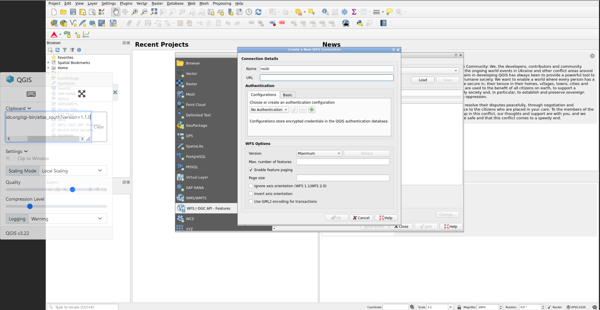
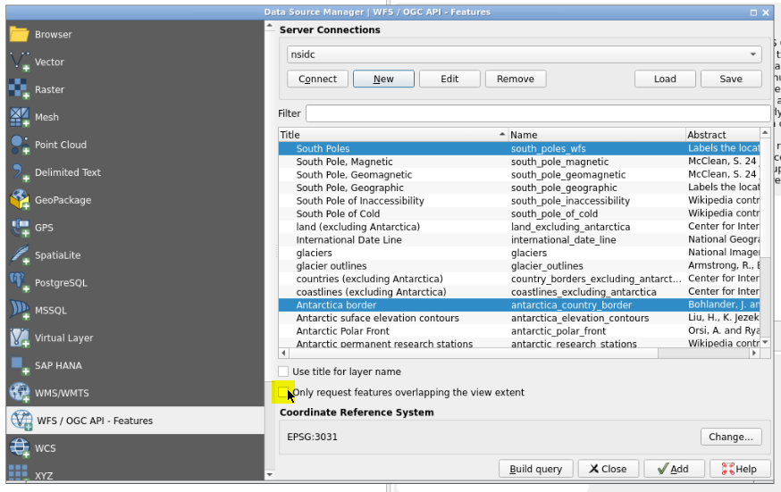
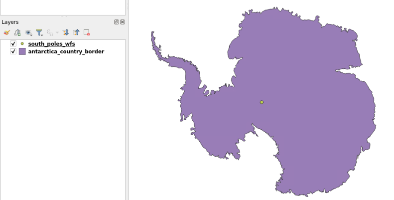
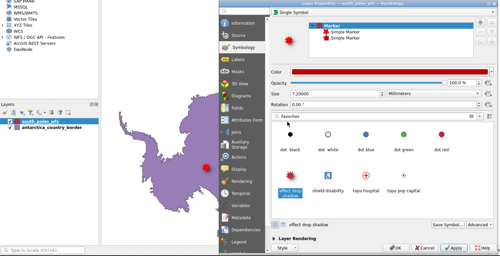
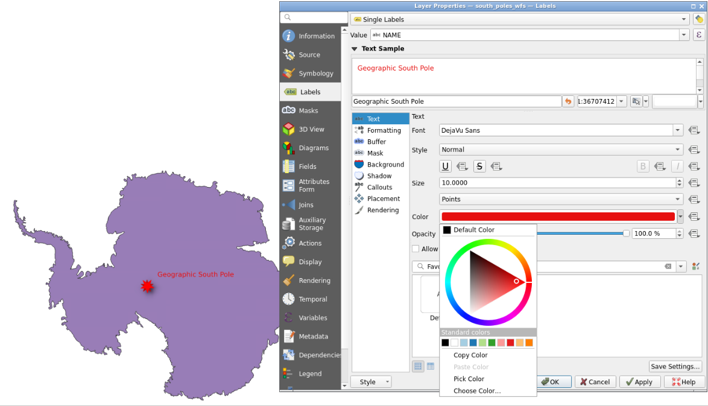
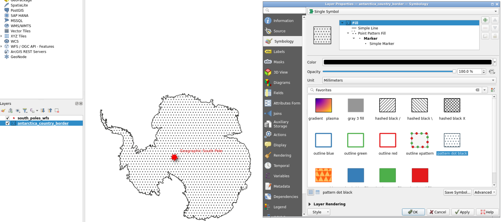
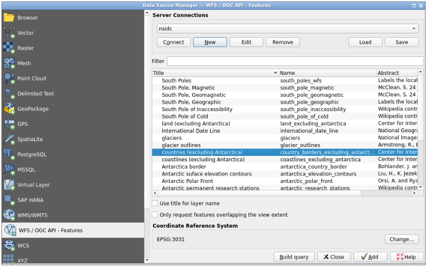
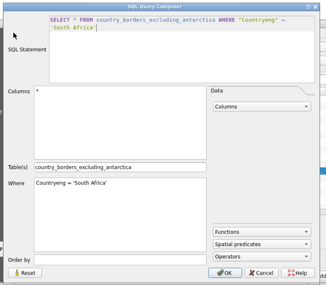
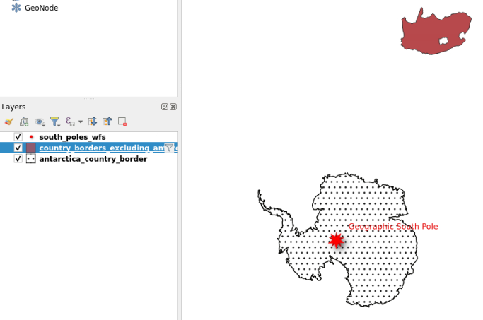

Based on this [QGIS official tutorial](https://docs.qgis.org/2.18/en/docs/training_manual/online_resources/wfs.html), you will learn here how to access, filter and import GIS data through WFS web service using QGIS Galaxy interactive tool:

In the Geographical Information System landscape, there is existing standards to help users deal with remote data. The most common web services are Web Map Services (WMS) and Web Feature Services (WFS). If WMS allows users only to access and display maps stored remotely, WFS is giving access to the features of data so you can modify it and create your own data and maps.

> <agenda-title></agenda-title>
>
> In this tutorial, we will cover:
>
> 1. TOC
> {:toc}
>
{: .agenda}

# Managing QGIS Galaxy interactive tool

QGIS is now integrated in Galaxy as an interactive tool. This kind of tool works differently than classical tools as it allows the user to interact with a dedicated graphical interface.

To use QGIS, you need to use the , you can specify input datasets from your history you want to use in QGIS, or not ;), then press the execute button to launch a QGIS instance. When the graphical user interface of QGIS is ready to be used, a URL will be displayed at the top of the Galaxy center panel. If you don't see it, you can see and access it through the "Active InteractiveTools" space of the "User" menu or you can click on  on the tool in the history.

Once you finish your work on QGIS, if you want to reuse data and/or the entire project, you need to save files in the "output" folder (which you can find in the "working" directory). 
Then, quit QGIS properly through the "Project" Menu tab top left and click on "Exit QGIS".

> <hands-on-title>Deploy your own QGIS instance</hands-on-title>
>
> 1. Create a new history for this tutorial
> 2. Deploy a 
> 3. Access QGIS
> 4. Save your project in /working/output folder
>
{: .hands_on}

# Web Feature Services
## Loading WFS layer

> <hands-on-title>Loading WFS layer</hands-on-title>
>
> 1. Go to the top left of QGIS and click on "Layer"
> 2. Click on the 1st option "Data Source Manager" 
> 3. Select "WFS / OGC API - Features" on the left part of the pop-up panel
> 4. Click the "New" button
> 5. In the dialog that appears, enter the Name as `nsidc` and the URL as `http://nsidc.org/cgi-bin/atlas_south?version=1.1.0`.
>
>    > <tip-title>copy pasting from computer to QGIS</tip-title>
>    >
>    > You can expand the QGIS left panel (where there are 3 dots, vertically) to access the "clipboard" menu and paste the content you want to paste on a QGIS form. Then, click outside of this panel to collapse it, and you can click for example on the `url` field to paste the URL from your clipboard
>    >
>    > 
>    {: .tip}
>
> 5. Click OK, then you can create the connection with the "connect" button to see a list of available layers
> 6. Find and select the `antarctica_country_border` (Antartica border) layer
> 7. Find and select, holding the "CTRL" button, the `south_poles_wfs` (South border) layer
> 9. Unselect "only request features overlapping the view extent" option then click "add"
>   
> 10. You now have Antarctica border displayed with a symbol showing the south pole
>   
> 11. You can double click each layer at the bottom left to modify symbology, notably color for "south_poles_wfs" modifying the symbol by selecting for example "effect drop shadow"  click on "Save Symbol..." and add a label `Geographic South Pole`
>   
>   
> 12. And to "antarctica_country_border".
>   
> 
{: .hands_on}

## Querying a WFS layer

Even if you can select, download and display entire WFS layers, it is often more efficient to interrogate a layer before loading it to QGIS. This is a major interest of the use of such web services, as you can save internet bandwidth by selecting only parts of layer you want in your own QGIS instance.

> <hands-on-title>Querying a WFS layer</hands-on-title>
>
> 1. In the WFS server already created in the first step of this tutorial, there is a layer called `countries (excluding Antarctica)`. If we want to know where is South Africa related to the `south_poles_wfs`, there are several manners to operate. One can load the entire layer of `countries (excluding Antarctica)` and then use it locally, or we can save bandwidth and only load locally the needed information concerning South Africa. We will here use the second manner, querying the WFS layer to obtain only information we will use in our QGIS instance.
> 2. Go to the top left of QGIS and click on "Layer"
> 3. Click on the 1st option "Data Source Manager" 
> 4. Select "WFS / OGC API - Features" then the already connected `nsidc` server
> 5. Select the `countries (excluding Antarctica)` layer and click "Build query" button
>    
> 6. On the new dialog box, you can copy/paste this query: `SELECT * FROM country_borders_excluding_antarctica WHERE "Countryeng" = 'South Africa'` using the clipboard functionality from the left QGIS panel to make a "bridge" between your local clipboard and the virtualized QGIS one.
>    
> 7. Clicking OK, you can now see the SQL query on a dedicated column of the layers table.
>    
> 9. Clicking the "Add" button, you now have the South Africa layer added and displayed on QGIS.
>    
{: .hands_on}

> <question-title></question-title>
>
> 1. Are you seeing how QGIS shows the fact that a layer is resulting from a query made on a larger layer?
>
> > <solution-title></solution-title>
> >
> > 1. There is a dedicated "filter" icon next to the name of the layer.
> >
> {: .solution}
>
{: .question}

# Conclusion

You just did a classical GIS operation, accessing remote data using WFS webservice through QGIS, retrieving features of interest you can share broadly through Galaxy!
