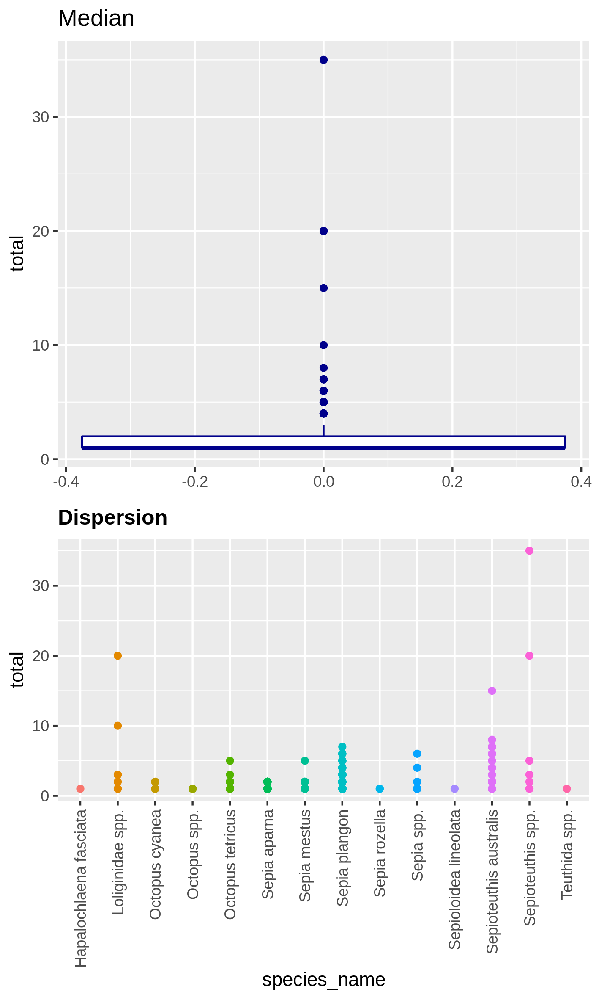
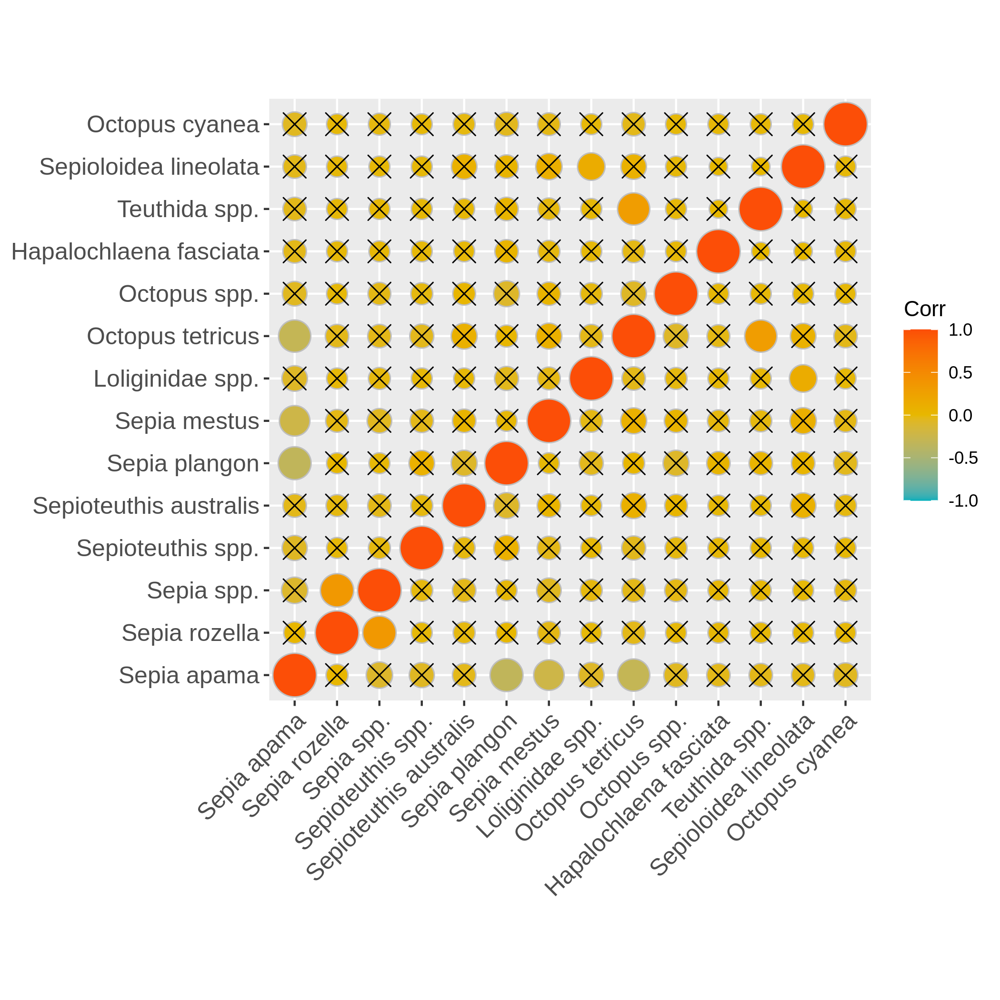

# Introduction

This tutorial will guide you on the exploration of biodiversity data having taxonomic, spatial and temporal informations.

We'll be using Reef Life Survey (RLS) data extracted from the Australian Ocean Data Network (AODN) portal. We'll use a subset done directly on the AODN data portal (https://portal.aodn.org.au/) on this dataset "IMOS - National Reef Monitoring Network Sub-Facility - Global reef fish abundance and biomass". We decided to use data only on the Mollusca phylum from the east coast of Australia between 2008 and 2021. We'll explore this dataset in the view of making statistical analyses so we will check the homoscedasticity and normality of the variables, see if some variables are correlated, how the data is distributed through space and time, etc ... And finally, we'll explore Beta diversity through the computation of the SCBD and LCBD (Species and Local Contribution to Beta Diversity).

> <details-title>Definitions of SCBD and LCBD</details-title>
>
> Species Contribution to Beta Diversity: degree of variation for individual species across the study area.
>
> Local Contribution to Beta Diversity: comparative indicators of the ecological uniqueness of the sites.
>
{: .details}

> <agenda-title></agenda-title>
>
> In this tutorial, we will cover:
>
> 1. TOC
> {:toc}
>
{: .agenda}

# Data preparation

First step is to download biodiversity data on your Galaxy history. Here we will use a "classical" (containing taxonomic, spatial and temporal informations) biodiversity dataset from the well known ["Reef life survey" initiative](https://reeflifesurvey.com/).

## Get data

> <hands-on-title>Data upload</hands-on-title>
>
> 1. Create a new history for this tutorial and give it a name (example: "RLS for biodiversity data exploration tutorial")
>    for you to find it again later if needed.
> 2. Import the files from [Zenodo](https://zenodo.org/record/6107457/files/IMOS-National_Reef_Monitoring_Network_Sub-Facility-Global_reef_fish_abundance_and_biomass.csv?download=1)
>
>    
>
>    
>
> 3. Rename the datasets "reef_life_molluscs" for example and preview your dataset
>
>    You can see that the dataset hasn't been detected to be a CSV dataframe, it is because RLS data directly puts the
>    metadata of the dataframe in the first lines before the dataframe so you'll have to remove these lines using the  with the following parameters:
>        -  *"Remove first"*: `72`
>        -  *"from"*: reef_life_molluscs data file
>
>    Then, verify if your new file hasn't got hashtags in the first lines and then ask Galaxy to autodetect datatype (click on the pencil, then "Datatypes" then click on "Auto-detect" button). Galaxy will normally detect it as csv.
>
> 4. Convert datatype CSV to tabular
>
>    
>
{: .hands_on}

## Customize your dataset

In order to clean unnecessary informations from the table we will now cut a few columns and change the format of time information.

> <hands-on-title>Clean your data</hands-on-title>
>
> 1. Use 
>    with following parameters :
>    -  *"File to cut"*: Convert CSV to tabular data file
>    -  *"Operation"*: `Keep`
>    -  *"Delimited by"*: `Tab`
>    -  *"Cut by"*: `fields`
>      -  *"List of Fields"*: `Column: 8` `Column: 10` `Column: 11` `Column: 12` `Column: 25` `Column: 28`
>
> 2. Use  with following parameters:
>    -  *"Select cells from"*: Advanced Cut data file
>    -  *"using column"*: `Column: 4`
>    -  Click *"+ Insert Check"*:
>         -  *"Find Regex"*: `([0-9]{4})-[0-9]{2}-[0-9]{2}`
>         -  *"Replacement"*: `\1`
>
>
{: .hands_on}

# Data checking

## Homoscedasticity and normality analysis

> <hands-on-title>Here we will check homogeneity of variances (Levene test) for every species and represent it through multiple boxplots and the normal distribution (Kolmogorov-Smirnov test) represented by a distribution histogram and a Q-Q plot.</hands-on-title>
>
> 1.  with the following parameters:
>    -  *"Input table"*: Column Regex Find and Replace data file
>    -  *"First line is a header line"*: `Yes`
>    -  *"Select column containing temporal data (year, date, ...)"*: `c4`
>    -  *"Select column containing species"*: `c5`
>    -  *"Select column containing numerical values (like abundances)"*: `c6`
>
>    You have to get three outputs: the Levene Test for homoscedasticity dataset, the Kolmogrov-Smirnov test for normality  and 9 PNG files in a data collection representing the homogeneity of variances for each species at each time point of the study.
>    If the levene test is significant (P-value in column Pr < 0.5 and at least one * at the end of the 4th line), variances aren't homogeneous, the hypothesis of homoscedasticity is rejected.
>    If the K-S test is significant (p-value < 0.5), your numerical variable isn't normally distributed, the hypothesis of normality is rejected.
>    The two tests have to be significant so variances aren't homogenous and data isn't normally distributed.
>
{: .hands_on}

## Autocorrelation in your data

> <hands-on-title>Autocorrelation</hands-on-title>
>
> 1.  with the following parameters:
>    -  *"Input table"*: Column Regex Find and Replace data file
>    -  *"First line is a header line"*: `Yes`
>    -  *"Variables links exploration"*: `Autocorrelation of one selected numerical variable`
>        -  *"Select columns containing numerical values"*: `c6`
>
>     You have to get two outputs, one text file containing the Autocorrelation function values and one PNG file in the data collection showing the autocorrelation for a variable.
>     If the bars of the histogram are strictly confined between the dashed lines (representing 95% confidence interval without white noise), there is auto-correlation.
>
>    Here, we don't see there is autocorrelation.
>
{: .hands_on}

## Check collinearity in your data

> <hands-on-title>Collinearity between numerical variables</hands-on-title>
>
> 1.  with the following parameters:
>    -  *"Input table"*: formatted biodiversity data file
>    -  *"First line is a header line"*: `Yes`
>    -  *"Variables links exploration"*: `Collinearity between selected numerical variables for each species`
>        -  *"Select column containing species"*: `c5`
>        -  *"Select columns containing numerical values"*: `c['4', '6']`
>
>    You have to get two outputs, one describing species we couldn't evaluate and one PNG file with one plot containing multiple correlation plots and the correlation values between each variables.
>
{: .hands_on}

# Data exploration
## Visualize abundance repartition through space

> <hands-on-title>Abundance map in the environment</hands-on-title>
>
> 1.  with the following parameters:
>    -  *"Input table"*: formatted biodiversity data file
>    -  *"First line is a header line"*: `Yes`
>    -  *"Variables presence, absence and abundance"*: `Abundance map in the environment `
>        -  *"Select column containing latitudes "*: `c2`
>        -  *"Select column containing longitudes"*: `c3`
>        -  *"What do you study in this analysis ?"*: `Molluscs of Australian east coast`
>        -  *"Select column containing taxon "*: `c5`
>    -  *"Select column containing abundances "*: `c6`
>
>    You have to get two outputs, one with the map of the abundance through space with the coordinates and one text file to inform you about the geographical extent of your map.
>
{: .hands_on}

## Visualize the number of locations where each taxons are present

> <hands-on-title>Presence count of taxons (barplot)</hands-on-title>
>
> 1.  with the following parameters:
>    -  *"Input table"*: formatted biodiversity data file
>    -  *"First line is a header line"*: `Yes`
>    -  *"Variables presence, absence and abundance"*: `Presence count of taxons (barplot)`
>        -  *"Select column containing your separation variable"*: `c1`
>        -  *"Select column containing taxon"*: `c5`
>    -  *"Select column containing abundances "*: `c6`
>
>    You have to get two outputs, one with 120 PNG files (one for each site) representing the number of locations where each taxons are present and one text file to inform you about the used locations.
>
{: .hands_on}

## Visualize the rarefaction curves of your species

> <hands-on-title>Rarefaction curve of species</hands-on-title>
>
> 1.  with the following parameters:
>    -  *"Input table"*: formatted biodiversity data file
>    -  *"First line is a header line"*: `Yes`
>    -  *"Variables presence, absence and abundance"*: `Rarefaction curve of species`
>        -  *"Size of subsamples"*: `200`
>        -  *"Select column containing species"*: `c5`
>    -  *"Select column containing abundances "*: `c6`
>
>    You have to get two outputs, one data collection with one PNG files representing the rarefaction curves of each species in one graph and one tabular file with log informations.
>
{: .hands_on}

## Visualize the dispersion of a numeric variable and the correlation between species absence

> <hands-on-title>Boxplot of dispersion and correlation of absence</hands-on-title>
>
> 1.  with the following parameters:
>    -  *"Input table"*: formatted biodiversity data file
>    -  *"First line is a header line"*: `Yes`
>    -  *"Select a column containing numerical values (such as the abundance) "*: `c6`
>    -  *"Select the column of the x-axis : most commonly species"*: `c5`
>    -  *"Select column containing locations "*: `c1`
>    -  *"Select column containing temporal data (year, date, ...) "*: `c4`
>
>    You have to get two outputs, one PNG file with the boxplot and dispersion plot of the abundance and one plot representing wether the absence of several species is correlated. In the second plot if you see there is a cross on the round representation the two related species haven't got their absences correlated, the other are correlated and seem to be co-absent.
>
{: .hands_on}

# Beta diversity
## Local and Species Contribution to Beta Diversity (SCBD and LCBD)

> <hands-on-title>Task description</hands-on-title>
>
> 1.  with the following parameters:
>    -  *"Input table"*: formatted biodiversity data file
>    -  *"First line is a header line"*: `Yes`
>    -  *"Select column with abundances"*: `c6`
>    -  *"Select column with locations"*: `c1`
>    -  *"Select column containing taxon"*: `c5`
>    -  *"Select column containing dates"*: `c4`
>    -  *"Other LCBD : spatialized representation or xy plot."*: `Spatialized representation`
>        -  *"Select column containing latitudes in decimal degrees"*: `c2`
>        -  *"Select column containing longitudes in decimal degrees"*: `c3`
>
>    You have to get three outputs. Two text file containing a table with information on the beta diversity and one text file with the list of species that has a SCBD larger than the mean SCBD. One data collection with PNG files showing multiple plots according to one type of variable in order to vizualize the beta diversity.
>
>
{: .hands_on}

# Conclusion

Here, you just explored your biodiversity dataframe properly and you know a lot more about your data. You can now peacefully make your statiscal analyses as most of the red flags you can get have been revealed by this toolsuite ! Enjoy !

# Bonus: Want to spatially anoymize your data?

A step of this tutorial could be to show you how you can simply apply spatial coordinates anonymization if you want to share data without spatial context, particularly of interest if you want to share endangered species oriented data.

## Bonus! Spatial coordinates anonymization

> <hands-on-title>Task description</hands-on-title>
>
> 1.  with the following parameters:
>    -  *"Input table"*: Column Regex Find and Replace data file
>    -  *"First line is a header line"*: `Yes`
>    -  *"Select column containing latitudes in decimal degrees"*: `c2`
>    -  *"Select column containing longitudes in decimal degrees"*: `c3`
>
{: .hands_on}

