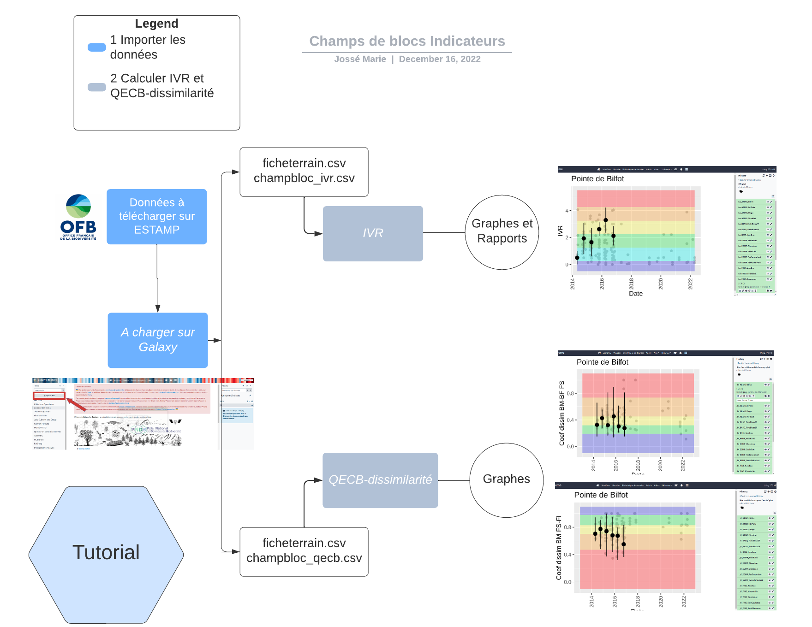
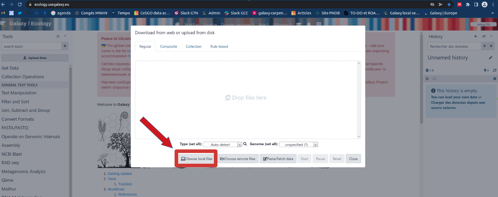
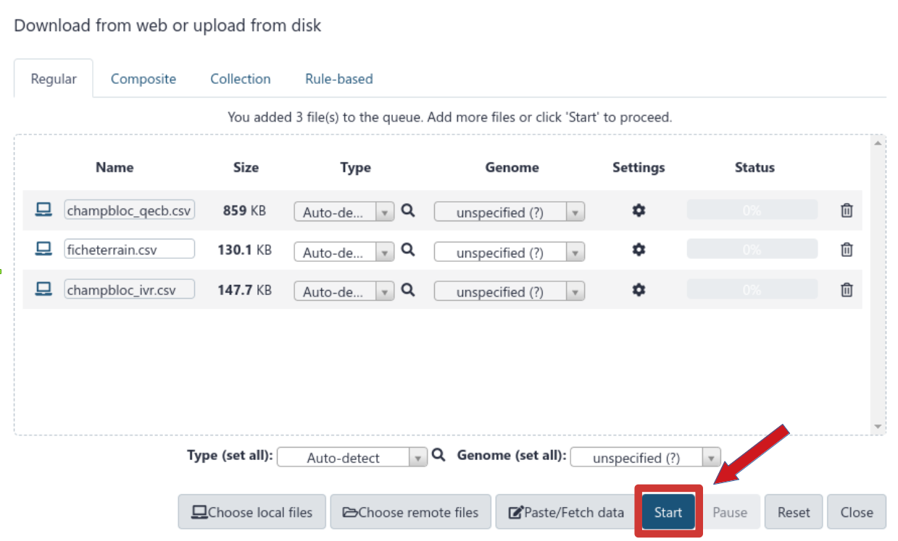

This tutorial will allow you to better apprehend the workflow for indicators on boulder fields. This will help you understand the effects of global and local changes on marine habitats, and the effectiveness of the management measures adopted, requires standardized monitoring and robust and sensitive indicators reflecting the state of the habitats.

The "mediolittoral boulder fields" habitat harbors a high diversity of micro-habitats and species due to its high structural heterogeneity and its intermediate position on the foreshore, which makes it one of the most diversified mediolittoral habitats and of high ecological interest along the French Channel-Atlantic coast. It is also a very attractive habitat for recreational fishing, which, through the reworking of the blocks, can impact the communities.
Thus, the "mediolittoral boulder fields" habitat has been the subject of several national and local initiatives (including LIFE+ "Experimentation for a sustainable and concerted management of recreational foot fishing in France" 2013-2017) to better assess its status and relate it to the pressure of foot fishing with a view to adapting local management, particularly through the network of Marine Protected Areas (Natura 2000, PNM, PNR etc.).

In particular, these projects have made it possible to develop a network of involved field players and managers and tools for evaluating the ecological status and pressure of fishing on foot:

- the Visual Boulder Turning Indicator (VTI), which is similar to a "landscape" indicator to assess fishing pressure based on architectural criteria;
- the Boulder Field Ecological Quality Index (BFEQ) - the subject of this report - based on biotic and abiotic variables that respond to the disturbance "boulder turning".

Here we will go over the different steps in order to get those 2 indicators and more.

> <agenda-title></agenda-title>
>
> In this tutorial, we will cover:
>
> 1. TOC
> {:toc}
>
{: .agenda}

> <details-title>Short introduction on how Galaxy works</details-title>
>
> You can leave the tutorial and go bask on the main screen by clicking outside of the tutorial screen.
> You can come back to where you left off the tutorial anytime by clicking .
>
> > <hands-on-title>Log in to Galaxy</hands-on-title>
> > 1. Open your favorite browser (Chrome, Safari or Firefox as your browser, not Internet Explorer!)
> > 2. Browse to your Galaxy instance
> > 3. Log in or register
> >
> > 
> >
> > This is an image of Galaxy Ecology, located at [usegalaxy.eu](https://ecology.usegalaxy.eu/)
> >
> {: .hands_on}
>
> The Galaxy homepage is divided into three panels:
> * Tools on the left
> * Viewing panel in the middle
> * History of analysis and files on the right
>
> 
>
> The first time you use Galaxy, there will be no files in your history panel.
{: .details}

Now let's focus on our workflow on boulder field ecological state

# Get data



1. Download your data on ESTAMP [estamp.afbiodiversite.fr](https://estamp.afbiodiversite.fr/) website, clicking on "Accédez aux données" at the bottom of the page. You will get a zip folder.
2. Unzip your folder. In the folder three files .csv will interest us :

   - champbloc_ivr.csv
   - champbloc_qecb.csv
   - ficheterrain.csv

> <hands-on-title>Data upload</hands-on-title>
> 1. Import the data into Galaxy
>    
>  * Open the Galaxy Upload Manager 
>  * Select **Choose local files**
>    
>  * Browse in your computer and get your ESTAMP files (select all three of them : champbloc_ivr.csv, champbloc_qecb.csv and ficheterrain.csv)
>   
>  * Press **Start**
>    
>  * Press **Close**
>    
>  You need to wait for the data to become green on the right panel
>    
>   
> > <tip-title>Create a new history</tip-title>
> > Create a new history for this tutorial and give it a name (example: “Champs blocs indicators”) for you to find it again later if needed.
> > 
> {: .tip}
{: .hands_on}

# Computing the Visual Boulder turning Indicator for each site

Based on the proportion of "turned" and "not turned" blocs this indicator vary from 0 to 5 and can be quickly used.

> <tip-title>How to get your tool ?</tip-title>
>
> > <hands-on-title>Use a tool</hands-on-title>
> > 1.  click on for example the  tool or type **ivr** in the tools panel search box (top left)
> > The tool form will be displayed in the central Galaxy panel.
> {: .hands_on}
{: .tip}

## IVR

Go on the tool **IVR**

> <hands-on-title>Calculating IVR</hands-on-title>
>
> 1.  with the following parameters:
>    -  *"Input champbloc_ivr.csv"*: `input` (champbloc_ivr.csv)
>    -  *"Input ficheterrain.csv"*: `input` (ficheterrain.csv)
>
> 2. Press **Run Tool** (it can take some minutes to process it's normal if you have to wait a bit especially if your internet connection is weak)
>
> 3. Three outputs will appear in your history panel on the right.
>
> 4. View graphs
>  * Once it's green, click on **IVR plot**
>  * Then, click on the  (eye) icon of your output in the history panel.
> 
>  The information is displayed in the central panel
> 
>   {:width="620px"}
>
> > <tip-title>Search for your site results</tip-title>
> >
> > 1. In the top of the History panel (on the right) go on the search box
> > 2. Click on the double arrows to display more filter options
> > 3. Type the name of your site (for instance "Bilfot") on the "Filter by name:" criteria then click on "No" for the "Visible:" criteria, as plots are created in a data collection and not directly visible on the history
> >
> >  {:width="620px"}
> >
> {: .tip}
> **For your reports you need to download the ones you want. You won't be able to vizualise them directly on Galaxy center panel !**
>
> 5. Download results
> 
>  * Click on the output you are interested in for instance **Reports**
>  * Click on  (download)
{: .hands_on}

# Computing dissimilarity coefficient for each site

## Dissimilarity
Cleaning out your data in order and then compute de dissimilarity coefficient.
Get the  tool

> <hands-on-title>Calculate dissimilarity index</hands-on-title>
>
> 1.  with the following parameters:
>    -  *"Input champbloc_qecb.csv"*: `input` (champbloc_qecb.csv)
>    -  *"Input ficheterrain.csv"*: `input` (ficheterrain.csv)
>
>    -  *"Do you have data after the year 2021 ?"*: `No`
>    -  *"Until when do you have data (write only the YEAR) ?"*: `2021`
>
>
> 2. Press **Run Tool** (it can take some minutes to process it's normal if you have to wait a bit especially if your internet connection is weak)
>
> 3. View graphs
>  * Once it's green, click on type of plot you want to see
>  * Then, click on the  (eye) icon of your output in the history panel.
> 
>  The information is displayed in the central panel
>
> {:width="620px"}
>
> {:width="620px"}
>
> 3. Download your results
> 
>  * Click on the output you are interested in
>  * Click on  (download)
>
{: .hands_on}

## Diversity indicators
Taking as input cleaned data from the Dissimilarity step tocompute diversity indicators.
Get the  tool

> <hands-on-title>Calculate diversity indicators</hands-on-title>
>
> 1.  with the following parameters:
>    -  *"Input clean data"*: `input` (Clean Rdata)
>
> 2. Press **Execute** 
>
> 3. View graphs
>  * Once it's green, click on type of plot you want to see
>  * Then, click on the  (eye) icon of your output in the history panel.
> 
>  The information is displayed in the central panel
>
> {:width="620px"}
>
>
> 3. Download your results
> 
>  * Click on the output you are interested in
>  * Click on  (download)
>
{: .hands_on}

# Conclusion
Here you have finished your study on your boulder fields biodiversity state.
